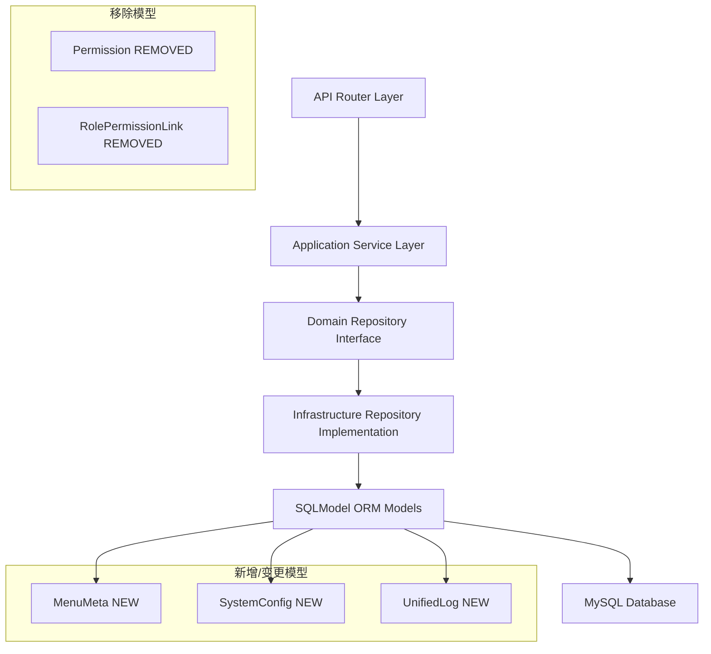

## 产品概述

基于新的数据库表结构（hello_fastapi.sql），对现有RBAC系统进行全面重构。后端从ORM模型到API接口层全链路适配新表结构，前端根据新接口返回数据重构系统管理页面，参照 xadmin-client (E:\GitHub\xadmin\xadmin-client-nineaiyu) 的设计模式。

## 核心功能

### 后端重构

- **模型层重构**：ORM模型适配新表结构（所有表ID统一为char(32) UUID string、Menu拆分为Menu+MenuMeta、新增SystemConfig、统一日志表、移除Permission相关模型）
- **RBAC逻辑重设计**：从"角色-权限"模式转为"角色-菜单"模式，菜单的method字段承载API权限控制
- **API接口适配**：所有CRUD接口返回新表结构数据，认证/授权逻辑基于菜单权限
- **动态路由接口重构**：`/get-async-routes`基于新的Menu+MenuMeta结构返回前端路由配置

### 前端重构（参照 xadmin-client 设计模式）

- **API层重构**：从单一`system.ts`拆分为独立模块API（参照xadmin-client的`/api/system/user.ts`、`role.ts`、`menu.ts`、`dept.ts`模式），继承BaseApi类
- **菜单管理重构**：采用xadmin-client的左右分栏布局（tree.vue + edit.vue），菜单类型三级分类（DIRECTORY/MENU/PERMISSION），MenuMeta嵌入表单编辑
- **角色管理重构**：采用xadmin-client的菜单权限树组件（form.vue），勾选菜单分配权限，支持checkStrictly父子关联控制
- **用户管理重构**：采用xadmin-client的左侧部门树+右侧RePlusPage列表布局，角色分配弹窗
- **部门管理重构**：采用xadmin-client的RePlusPage树形表格模式，角色分配功能
- **权限控制适配**：按钮级权限从permissions改为菜单auths/method字段

## Tech Stack

- 后端：FastAPI + classy-fastapi + SQLModel + FastCRUD + DDD分层架构
- 前端：Vue 3 + vue-pure-admin + Pinia + Element Plus + TSX Hook模式
- 数据库：MySQL 8.0（新schema）+ SQLModel ORM
- 认证：JWT（AccessToken + RefreshToken）
- 参考项目：xadmin-client (E:\GitHub\xadmin\xadmin-client-nineaiyu)

## Implementation Approach

### 核心架构变更

新schema最大的结构性变更是：**权限模型从"角色-权限"多对多模式转为"角色-菜单"模式**。原`sys_permissions` + `sys_role_permissions`被移除，权限控制通过`sys_menus.method`字段实现。同时菜单元数据从Menu表拆分到独立的`sys_menumeta`表，通过`meta_id`外键关联。

### 参考项目关键设计模式（从 xadmin-client 提取）

1. **API层设计**：

- 每个模块独立API类继承`BaseApi`（如`UserApi extends BaseApi`）
- 特殊操作在子类中扩展（如UserApi.upload/resetPassword/empower/unblock/logout）
- API路径模式：`/api/system/{module}`，特殊操作：`/api/system/{module}/{pk}/{action}`
- 响应码约定：`code=1000`表示成功

2. **菜单管理设计（参照xadmin-client menu/）**：

- **左右分栏**：左侧tree.vue（菜单树+操作按钮）+ 右侧edit.vue（表单编辑）
- **三种菜单类型**：`MenuChoices.DIRECTORY(0)` / `MenuChoices.MENU(1)` / `MenuChoices.PERMISSION(2)`
- **MenuMeta嵌入**：meta作为menu的嵌套对象，在表单中直接编辑meta字段
- **表单规则切换**：根据menu_type动态切换验证规则（dirFormRules/menuFormRules/permissionFormRules）
- **操作功能**：拖拽排序(rank)、添加权限(permissions)、导入导出、批量删除

3. **角色管理设计（参照xadmin-client role/）**：

- 使用`RePlusPage`组件 + 菜单权限树弹窗
- `form.vue`为菜单权限树组件：el-tree with show-checkbox，支持搜索/全选/展开/严格模式
- 角色编辑时显示菜单树，勾选菜单分配权限
- 菜单树节点样式：directory蓝色、menu绿色、permission默认

4. **用户管理设计（参照xadmin-client user/）**：

- 左侧部门树(tree.vue) + 右侧RePlusPage列表
- 操作按钮：下线、上传头像、重置密码、分配角色
- 密码强度验证：使用zxcvbn库
- 角色分配弹窗：选择roles + rules + mode_type

5. **部门管理设计（参照xadmin-client dept/）**：

- 使用`RePlusPage`的`isTree=true`树形表格
- 父级部门级联选择器
- 部门角色分配功能（empower）
- 用户数可点击跳转用户列表

6. **公共组件/工具**：

- `hooks.tsx`：usePublicHooks（switchStyle/tagStyle）、formatHigherDeptOptions、picturePng、customRolePermissionOptions
- `constants.ts`：MenuChoices(DIRECTORY:0/MENU:1/PERMISSION:2)、MethodChoices(GET/POST/PUT/DELETE)、ModeChoices(OR:0/AND:1)
- `render.tsx`：renderOption（Segmented渲染）、renderSwitch（开关渲染）
- `utils.ts`：日期快捷选项

### 实施策略

采用**自底向上**的重构顺序：ORM模型→领域实体→仓储接口→仓储实现→DTO→服务→路由。每一层完成后确保下一层可编译，减少集成风险。后端完成后再重构前端。

### 关键技术决策

1. **全表UUID ID统一**：所有数据表ID统一为char(32) UUID string类型（包括sys_users、sys_logs、sys_userloginlog、sys_userinfo_roles、sys_userrole_menu），应用层自动生成UUID，无需数据库自增
2. **Menu-Meta拆分**：Menu专注路由/组件信息，MenuMeta专注显示配置（标题/图标/动画等），通过meta_id一对一关联
3. **权限校验方式变更**：原`require_permission(code)`基于Permission表查询，新方案基于Menu的method字段匹配API路径
4. **统一日志表**：原3种日志表合并为1个sys_logs表，通过log_type区分
5. **审计字段统一**：新增creator_id/modifier_id/created_time/updated_time统一审计模式
6. **前端API重构**：从单一system.ts拆分为BaseApi继承模式的独立模块API类
7. **菜单类型三级模型**：DIRECTORY(0目录) → MENU(1页面) → PERMISSION(2按钮/权限)，参照xadmin-client

### 性能考量

- Menu-Meta一对一关联使用`selectin`加载策略，避免N+1查询
- 角色菜单权限查询通过sys_userrole_menu直接JOIN，路径：User→UserRole→RoleMenu→Menu
- 动态路由接口需一次性加载用户所有菜单及Meta，构建树形结构返回

## SQL表功能与关联关系详细分析

### 表1: sys_departments — 部门（组织架构树）

**功能**: 存储组织架构的树形部门数据，支持无限层级嵌套。用户通过`dept_id`关联到部门。

**新表字段 vs 旧表字段映射**:

| 新字段 (sys_departments) | 旧字段 (sys_departments) | 变更说明 |
| --- | --- | --- |
| id char(32) | id str (UUID max_length=36) | 长度缩短为32 |
| mode_type smallint | ❌ 新增 | 权限模式(0:OR/1:AND)，控制部门下角色权限合并方式 |
| name varchar(128) | name varchar(64) | 长度扩展 |
| code varchar(128) UNIQUE | ❌ 新增 | 部门唯一编码，旧表无此字段 |
| rank int | sort int | 字段名从sort改为rank，语义更明确 |
| auto_bind tinyint(1) | ❌ 新增 | 是否自动绑定角色（创建用户时自动分配部门角色） |
| is_active tinyint(1) | status int | 从0/1整数改为布尔语义，字段名改为is_active |
| creator_id varchar(150) | ❌ 新增 | 创建人ID |
| modifier_id varchar(150) | ❌ 新增 | 修改人ID |
| parent_id char(32) FK | parent_id str FK | 外键类型统一char(32) |
| created_time datetime(6) | created_at datetime | 字段名+精度变更 |
| updated_time datetime(6) | updated_at datetime | 字段名+精度变更 |
| description varchar(256) | remark varchar(500) | 字段名从remark改为description，长度缩短 |
| ❌ 移除 | principal | 负责人字段不再需要 |
| ❌ 移除 | phone | 联系电话不再需要 |
| ❌ 移除 | email | 邮箱不再需要 |


**外键关系**:

- `parent_id` → `sys_departments.id`（自引用，树形结构）

**关联表**:

- `sys_users.dept_id` → `sys_departments.id`（用户所属部门）

**影响的后端文件**:

- ORM: `models/department.py` — 新增mode_type/code/rank/auto_bind/is_active/creator_id/modifier_id/created_time/updated_time/description，移除principal/phone/email/remark/sort/status/created_at/updated_at
- Entity: `entities/department.py` — 同上
- Repository Interface: `repositories/department_repository.py` — 接口参数适配新字段
- Repository Impl: `repositories/department_repository.py` — CRUD操作适配新字段
- DTO: `dto/department_dto.py` — 新增code/modeType/rank/autoBind字段，移除principal/phone/email
- Service: `services/department_service.py` — 业务逻辑适配新字段
- Router: `api/v1/dept_router.py` — 响应格式适配

---

### 表2: sys_roles — 角色

**功能**: 存储角色定义，角色是权限分配的核心单位。角色通过`sys_userrole_menu`关联菜单实现权限控制。

**新表字段 vs 旧表字段映射**:

| 新字段 (sys_roles) | 旧字段 (sys_roles) | 变更说明 |
| --- | --- | --- |
| id char(32) | id str (UUID max_length=36) | 长度缩短为32 |
| name varchar(128) UNIQUE | name varchar(50) UNIQUE | 长度扩展 |
| code varchar(128) UNIQUE | code varchar(64) UNIQUE | 长度扩展 |
| is_active tinyint(1) | status int | 从status整数改为is_active布尔语义 |
| creator_id varchar(150) | ❌ 新增 | 创建人ID |
| modifier_id varchar(150) | ❌ 新增 | 修改人ID |
| created_time datetime(6) | created_at datetime | 字段名+精度变更 |
| updated_time datetime(6) | updated_at datetime | 字段名+精度变更 |
| description varchar(256) | description varchar(255) | 长度微调 |


**外键关系**: 无直接外键

**关联表**:

- `sys_userinfo_roles.userrole_id` ← `sys_roles.id`（用户-角色关联）
- `sys_userrole_menu.userrole_id` ← `sys_roles.id`（角色-菜单关联）

**影响的后端文件**:

- ORM: `models/role.py` — 移除permissions Relationship（改为menus），status→is_active，新增creator_id/modifier_id/created_time/updated_time
- Entity: `entities/role.py` — 同上
- Repository: `repositories/role_repository.py` — assign_permissions_to_role → assign_menus_to_role，get_role_permissions → get_role_menus
- DTO: `dto/role_dto.py` — permissionIds → menuIds，新增AssignMenusDTO替代AssignPermissionsDTO
- Service: `services/role_service.py` — 权限分配改为菜单分配
- Router: `api/v1/role_router.py` — 接口适配

---

### 表3: sys_users — 用户

**功能**: 存储用户账号信息，是系统的核心实体。用户通过`sys_userinfo_roles`关联角色。

**新表字段 vs 旧表字段映射**:

| 新字段 (sys_users) | 旧字段 (sys_users) | 变更说明 |
| --- | --- | --- |
| id char(32) | id str (UUID max_length=36) | 长度缩短为32 |
| password varchar(128) | hashed_password str | 字段名从hashed_password改为password（更贴近DB语义） |
| last_login datetime(6) | ❌ 新增 | 最后登录时间 |
| is_superuser tinyint(1) | is_superuser bool | 类型统一 |
| username varchar(150) UNIQUE | username varchar(50) UNIQUE | 长度扩展 |
| first_name varchar(150) | ❌ 新增 | 名（Django风格） |
| last_name varchar(150) | ❌ 新增 | 姓（Django风格） |
| is_staff tinyint(1) | ❌ 新增 | 是否为职员 |
| is_active tinyint(1) | status int | 从status改为is_active布尔语义 |
| date_joined datetime(6) | ❌ 新增 | 注册时间 |
| mode_type smallint | ❌ 新增 | 权限模式(0:OR/1:AND) |
| avatar varchar(100) | avatar varchar(500) | 长度缩短 |
| nickname varchar(150) | nickname varchar(64) | 长度扩展 |
| gender int | sex int | 字段名从sex改为gender |
| phone varchar(16) | phone varchar(20) | 长度微调 |
| email varchar(254) | email varchar(100) | 长度扩展 |
| creator_id varchar(150) | ❌ 新增 | 创建人ID |
| modifier_id varchar(150) | ❌ 新增 | 修改人ID |
| dept_id char(32) FK | dept_id str | 外键类型统一char(32) |
| created_time datetime(6) | created_at datetime | 字段名+精度变更 |
| updated_time datetime(6) | updated_at datetime | 字段名+精度变更 |
| description varchar(256) | remark varchar(500) | 字段名+长度变更 |
| ❌ 移除 | roles Relationship | 改为通过sys_userinfo_roles关联 |


**外键关系**:

- `dept_id` → `sys_departments.id`

**关联表**:

- `sys_userinfo_roles.userinfo_id` ← `sys_users.id`

**影响的后端文件**:

- ORM: `models/user.py` — 大量字段变更，Relationship从roles改为新关联
- Entity: `entities/user.py` — 同上
- Repository: `repositories/user_repository.py` — 查询参数适配
- DTO: `dto/user_dto.py` — 新增firstName/lastName/isStaff/dateJoined/modeType/gender等字段
- Service: `services/user_service.py` — _to_response方法大量适配
- Router: `api/v1/user_router.py` — 新增empower/unblock/upload/logout等操作
- Common: `api/common/user_formatter.py` — 格式化适配

---

### 表4: sys_menumeta — 菜单元数据（新增）

**功能**: 存储菜单元数据（显示配置），与`sys_menus`通过`meta_id`一对一关联。将原Menu表中的显示相关字段（icon/title/keepalive/animation等）拆分到独立表，实现关注点分离。

**字段说明**:

| 字段 | 说明 |
| --- | --- |
| id char(32) | 主键UUID |
| title varchar(255) | 菜单显示标题 |
| icon varchar(255) | 菜单图标 |
| r_svg_name varchar(255) | SVG图标名称（remix icon） |
| is_show_menu tinyint(1) | 是否在菜单中显示 |
| is_show_parent tinyint(1) | 是否显示父级菜单 |
| is_keepalive tinyint(1) | 是否缓存页面(keep-alive) |
| frame_url varchar(255) | iframe内嵌链接 |
| frame_loading tinyint(1) | iframe加载动画 |
| transition_enter varchar(255) | 进场动画名称 |
| transition_leave varchar(255) | 离场动画名称 |
| is_hidden_tag tinyint(1) | 禁止添加到标签页 |
| fixed_tag tinyint(1) | 固定标签页 |
| dynamic_level int | 动态路由层级 |
| creator_id/modifier_id | 审计字段 |
| created_time/updated_time | 时间戳 |
| description | 描述 |


**外键关系**: 无（被sys_menus.meta_id引用）

**关联表**:

- `sys_menus.meta_id` → `sys_menumeta.id`（一对一，UNIQUE约束）

**影响的后端文件**:

- ORM: `models/menu_meta.py` — **全新文件**
- Entity: `entities/menu_meta.py` — **全新文件**
- Repository: `repositories/menu_repository.py` — 新增meta CRUD方法
- DTO: `dto/menu_dto.py` — MenuMeta嵌入MenuDTO
- Service: `services/menu_service.py` — Menu+MenuMeta联合CRUD
- Router: `api/v1/menu_router.py` — 响应格式包含meta嵌套对象

**旧Menu表中拆分到MenuMeta的字段**:
icon, title, show_link(→is_show_menu), show_parent(→is_show_parent), keep_alive(→is_keepalive), frame_src(→frame_url), frame_loading, enter_transition(→transition_enter), leave_transition(→transition_leave), hidden_tag(→is_hidden_tag), fixed_tag, extra_icon(→r_svg_name)

---

### 表5: sys_menus — 菜单/权限

**功能**: 存储菜单/权限的树形结构数据，是RBAC的核心。通过`menu_type`区分三种类型：DIRECTORY(0目录)、MENU(1页面)、PERMISSION(2按钮/权限)。`method`字段存储HTTP方法，用于API级权限控制。

**新表字段 vs 旧表字段映射**:

| 新字段 (sys_menus) | 旧字段 (sys_menus) | 变更说明 |
| --- | --- | --- |
| id char(32) | id str (UUID max_length=36) | 长度缩短为32 |
| menu_type smallint | menu_type int | 类型值语义变更：0-菜单/1-iframe/2-外链/3-按钮 → 0-DIRECTORY/1-MENU/2-PERMISSION |
| name varchar(128) UNIQUE | name varchar(64) | 长度扩展，新增UNIQUE约束 |
| rank int | order_num int | 字段名从order_num改为rank |
| path varchar(255) | path varchar(256) | 长度微调 |
| component varchar(255) | component varchar(256) | 长度微调 |
| is_active tinyint(1) | status int | 从status改为is_active |
| method varchar(10) | ❌ 新增 | HTTP方法(GET/POST/PUT/DELETE)，用于PERMISSION类型菜单的API权限控制 |
| creator_id varchar(150) | ❌ 新增 | 创建人ID |
| modifier_id varchar(150) | ❌ 新增 | 修改人ID |
| parent_id char(32) FK | parent_id str FK | 外键类型统一 |
| meta_id char(32) FK UNIQUE | ❌ 新增 | 指向sys_menumeta，一对一关联 |
| created_time datetime(6) | created_at datetime | 字段名+精度变更 |
| updated_time datetime(6) | updated_at datetime | 字段名+精度变更 |
| description varchar(256) | ❌ 新增 | 描述 |
| ❌ 移除 | icon | 拆分到sys_menumeta |
| ❌ 移除 | title | 拆分到sys_menumeta |
| ❌ 移除 | show_link | 拆分到sys_menumeta(is_show_menu) |
| ❌ 移除 | permissions | 新schema使用menu_type+method替代 |
| ❌ 移除 | redirect | 新schema无此字段 |
| ❌ 移除 | extra_icon | 拆分到sys_menumeta(r_svg_name) |
| ❌ 移除 | enter_transition | 拆分到sys_menumeta(transition_enter) |
| ❌ 移除 | leave_transition | 拆分到sys_menumeta(transition_leave) |
| ❌ 移除 | active_path | 新schema无此字段 |
| ❌ 移除 | frame_src | 拆分到sys_menumeta(frame_url) |
| ❌ 移除 | frame_loading | 拆分到sys_menumeta |
| ❌ 移除 | keep_alive | 拆分到sys_menumeta(is_keepalive) |
| ❌ 移除 | hidden_tag | 拆分到sys_menumeta(is_hidden_tag) |
| ❌ 移除 | fixed_tag | 拆分到sys_menumeta |
| ❌ 移除 | show_parent | 拆分到sys_menumeta(is_show_parent) |


**外键关系**:

- `parent_id` → `sys_menus.id`（自引用，树形结构）
- `meta_id` → `sys_menumeta.id`（一对一，UNIQUE约束）

**关联表**:

- `sys_userrole_menu.menu_id` ← `sys_menus.id`（角色-菜单关联）

**影响的后端文件**:

- ORM: `models/menu.py` — 大量字段移除/新增，添加meta Relationship
- Entity: `entities/menu.py` — 同上
- Repository: `repositories/menu_repository.py` — 新增meta联合查询
- DTO: `dto/menu_dto.py` — 适配新结构，meta嵌入
- Service: `services/menu_service.py` — Menu+MenuMeta联合CRUD，权限过滤逻辑改为基于menu_type+method
- Router: `api/v1/menu_router.py` — 响应格式包含meta嵌套对象

**关键业务逻辑变更**:

- 旧: `menu.permissions`(逗号分隔权限编码) 用于前端按钮权限控制 `hasAuth(perm_code)`
- 新: `menu_type=2(PERMISSION)` + `menu.method` 用于API权限控制，前端通过菜单的name字段做按钮权限判断
- 动态路由: 旧`/get-async-routes`返回硬编码路由 → 新方案基于Menu+MenuMeta构建真实路由树

---

### 表6: sys_userinfo_roles — 用户-角色关联

**功能**: 用户和角色的多对多关联表。表名从旧的`sys_user_roles`改为`sys_userinfo_roles`。

**新表字段 vs 旧表字段映射**:

| 新字段 (sys_userinfo_roles) | 旧字段 (sys_user_roles) | 变更说明 |
| --- | --- | --- |
| id char(32) | id str (UUID max_length=36) | 新增独立主键（旧表使用复合主键） |
| userinfo_id char(32) FK | user_id String(36) FK | 字段名从user_id改为userinfo_id，类型统一 |
| userrole_id char(32) FK | role_id String(36) FK | 字段名从role_id改为userrole_id，类型统一 |
| ❌ 移除 | assigned_at | 移除分配时间字段 |
| UNIQUE(userinfo_id, userrole_id) | — | 新增联合唯一约束 |


**外键关系**:

- `userinfo_id` → `sys_users.id`（CASCADE删除）
- `userrole_id` → `sys_roles.id`（CASCADE删除）

**影响的后端文件**:

- ORM: `models/user_role.py` — 表名、字段名、主键方式全面变更
- ORM: `models/user.py` — Relationship引用变更
- ORM: `models/role.py` — Relationship引用变更
- Repository: `repositories/role_repository.py` — 用户角色分配/查询SQL适配

---

### 表7: sys_userrole_menu — 角色-菜单关联

**功能**: 角色和菜单的多对多关联表，是新版RBAC的核心权限表。表名从旧的`sys_role_menus`改为`sys_userrole_menu`。

**新表字段 vs 旧表字段映射**:

| 新字段 (sys_userrole_menu) | 旧字段 (sys_role_menus) | 变更说明 |
| --- | --- | --- |
| id char(32) | ❌ 新增独立主键 | 旧表使用复合主键(role_id+menu_id) |
| userrole_id char(32) FK | role_id String(36) FK | 字段名从role_id改为userrole_id |
| menu_id char(32) FK | menu_id String(36) FK | 类型统一 |
| UNIQUE(userrole_id, menu_id) | PK(role_id, menu_id) | 联合唯一约束替代复合主键 |


**外键关系**:

- `userrole_id` → `sys_roles.id`（CASCADE删除）
- `menu_id` → `sys_menus.id`（CASCADE删除）

**影响的后端文件**:

- ORM: `models/role_menu_link.py` — 表名、字段名、主键方式变更
- Repository: `repositories/role_repository.py` — 菜单分配/查询SQL适配
- Service: `services/role_service.py` — assign_menus_to_role适配

**关键业务逻辑变更**:

- 这是替代旧的`sys_role_permissions`表的核心表。旧方案：Role→Permission(通过sys_role_permissions)；新方案：Role→Menu(通过sys_userrole_menu)
- 权限查询路径变更：旧: User→UserRole→Role→RolePermissionLink→Permission.code；新: User→UserRole→RoleMenuLink→Menu.method

---

### 表8: sys_logs — 统一操作日志

**功能**: 统一的操作日志表，替代旧的三表分离设计（sys_system_logs + sys_operation_logs）。记录API请求的详细信息。

**新表字段 vs 旧表字段映射**:

| 新字段 (sys_logs) | 对应旧表 | 变更说明 |
| --- | --- | --- |
| id char(32) | id str (UUID max_length=36) | 长度缩短为32 |
| module varchar(64) | SystemLog.module / OperationLog.module | 统一字段 |
| path varchar(400) | SystemLog.url varchar(500) | 字段名从url改为path，长度缩短 |
| body longtext | SystemLog.request_body Text | 字段名简化 |
| method varchar(8) | SystemLog.method varchar(10) | 长度缩短 |
| ipaddress char(39) | OperationLog.ip / SystemLog.ip | 统一字段名 |
| browser varchar(64) | 统一字段 | 长度统一 |
| system varchar(64) | 统一字段 | 长度统一 |
| response_code int | ❌ 新增 | HTTP响应码 |
| response_result longtext | SystemLog.response_body Text | 字段名简化 |
| status_code int | ❌ 新增 | 业务状态码 |
| creator_id/modifier_id | ❌ 新增 | 审计字段 |
| created_time/updated_time | request_time/operating_time | 统一时间字段 |
| description varchar(256) | ❌ 新增 | 描述 |
| ❌ 移除 | SystemLog.level | 不再需要日志级别 |
| ❌ 移除 | SystemLog.takes_time | 不再记录耗时 |
| ❌ 移除 | OperationLog.username | 改用creator_id关联 |
| ❌ 移除 | OperationLog.address | 不再记录地点 |
| ❌ 移除 | OperationLog.status | 改用response_code/status_code |


**外键关系**: 无

**影响的后端文件**:

- ORM: `models/system_log.py` — 大幅重构，合并OperationLog功能
- ORM: `models/operation_log.py` — **删除**（合并到sys_logs）
- Entity: `entities/log.py` — 统一日志实体
- Repository: `repositories/log_repository.py` — 统一查询方法
- DTO: `dto/log_dto.py` — 统一日志DTO
- Service: `services/log_service.py` — 统一日志服务
- Router: `api/v1/log_router.py` — 统一日志接口

---

### 表9: sys_userloginlog — 登录日志

**功能**: 记录用户登录行为日志。表名从`sys_login_logs`改为`sys_userloginlog`。

**新表字段 vs 旧表字段映射**:

| 新字段 (sys_userloginlog) | 旧字段 (sys_login_logs) | 变更说明 |
| --- | --- | --- |
| id char(32) | id str (UUID max_length=36) | 长度缩短为32 |
| status tinyint(1) | status int | 类型统一 |
| ipaddress char(39) | ip varchar(45) | 字段名+类型变更 |
| browser varchar(64) | browser varchar(100) | 长度缩短 |
| system varchar(64) | system varchar(100) | 长度缩短 |
| agent varchar(128) | ❌ 新增 | User-Agent信息 |
| login_type smallint | ❌ 新增 | 登录类型(0:密码/1:短信/2:OAuth等) |
| creator_id/modifier_id | ❌ 新增 | 审计字段 |
| created_time/updated_time | login_time datetime | 字段名+精度变更 |
| description varchar(256) | ❌ 新增 | 描述 |
| ❌ 移除 | username | 改用creator_id关联用户 |
| ❌ 移除 | address | 不再记录登录地点 |
| ❌ 移除 | behavior | 不再需要行为描述 |


**外键关系**: 无（creator_id非强制外键）

**影响的后端文件**:

- ORM: `models/login_log.py` — 大量字段变更
- Entity: `entities/log.py` — LoginLogEntity适配
- Repository/DTO/Service/Router — 同步适配

---

### 表10: sys_systemconfig — 系统配置（新增）

**功能**: 存储系统级键值配置，如站点名称、Logo、主题配置等。替代硬编码配置，支持动态修改。

**字段说明**:

| 字段 | 说明 |
| --- | --- |
| id char(32) | 主键UUID |
| value longtext | 配置值（JSON格式） |
| is_active tinyint(1) | 是否启用 |
| access tinyint(1) | 访问级别 |
| key varchar(255) UNIQUE | 配置键（唯一） |
| inherit tinyint(1) | 是否继承 |
| creator_id/modifier_id | 审计字段 |
| created_time/updated_time | 时间戳 |
| description | 描述 |


**外键关系**: 无

**影响的后端文件**:

- ORM: `models/system_config.py` — **全新文件**
- Entity: `entities/system_config.py` — **全新文件**
- Repository: `repositories/system_config_repository.py` — **全新文件**
- DTO: `dto/system_config_dto.py` — **全新文件**
- Service: `services/system_config_service.py` — **全新文件**
- Router: `api/v1/system_config_router.py` — **全新文件**
- Dependencies: `api/dependencies/system_config_service.py` — **全新文件**

---

### 表11: sys_ip_rules — IP黑白名单

**功能**: IP访问控制规则，支持白名单和黑名单。

**新表字段 vs 旧表字段映射**:

| 新字段 (sys_ip_rules) | 旧字段 (sys_ip_rules) | 变更说明 |
| --- | --- | --- |
| id char(32) | id str (UUID max_length=36) | 长度缩短为32 |
| ip_address varchar(45) | ip_address varchar(45) | 不变 |
| rule_type varchar(10) | rule_type varchar(10) | 不变 |
| reason varchar(255) | reason varchar(255) | 不变 |
| is_active tinyint(1) | is_active bool | 类型统一 |
| created_at datetime | created_at datetime(timezone=True) | 精度变更 |
| expires_at datetime | expires_at datetime(timezone=True) | 精度变更 |


**外键关系**: 无

**影响的后端文件**:

- ORM: `models/ip_rule.py` — id长度+类型微调
- 变更较小，其余层基本不受影响

---

### 删除的表

| 旧表 | 原因 | 影响的删除文件 |
| --- | --- | --- |
| sys_permissions | 权限模型从独立表改为Menu.method字段 | models/permission.py, entities/permission.py, repositories/permission_repository.py(接口+实现), dto/permission_dto.py, services/permission_service.py, routers/permission_router.py, dependencies/permission_service.py |
| sys_role_permissions | 角色权限关联表，功能由sys_userrole_menu替代 | models/role_permission_link.py |
| sys_operation_logs | 合并到统一日志表sys_logs | models/operation_log.py |
| sys_system_logs | 合并到统一日志表sys_logs | models/system_log.py（重构） |


---

### 表间关联关系总图

```
sys_departments ◄─────── sys_users.dept_id
     │                         │
     │(自引用parent_id)         │
     ▼                         ▼
                        sys_userinfo_roles
                        (userinfo_id → sys_users.id)
                        (userrole_id → sys_roles.id)
                              │
                              ▼
                         sys_roles
                              │
                              ▼
                        sys_userrole_menu
                        (userrole_id → sys_roles.id)
                        (menu_id → sys_menus.id)
                              │
                              ▼
                         sys_menus ◄────── sys_menumeta
                         (meta_id → sys_menumeta.id)    ▲
                         (parent_id → sys_menus.id)      │(无外键依赖)
                              │
                              │(自引用parent_id)
                              ▼

独立表（无外键依赖）:
- sys_logs (统一操作日志)
- sys_userloginlog (登录日志)
- sys_systemconfig (系统配置)
- sys_ip_rules (IP规则)
```

### RBAC权限查询路径变更

**旧路径**:

```
User → UserRole(user_id) → Role → RolePermissionLink(role_id) → Permission.code
前端: hasAuth(permission.code) 检查按钮权限
后端: require_permission(code) 检查API权限
```

**新路径**:

```
User → sys_userinfo_roles(userinfo_id) → Role → sys_userrole_menu(userrole_id) → Menu
前端: hasAuth(menu.name) 检查按钮权限（menu_type=2 PERMISSION类型）
后端: require_menu_permission(path, method) 基于Menu.path+Menu.method检查API权限
动态路由: User → Role → Menu(menu_type=0/1) + MenuMeta → 构建前端路由树
```

## Architecture Design

### 新RBAC数据流

```
User → UserRole (sys_userinfo_roles) → Role (sys_roles) 
                                          ↓
                                     RoleMenu (sys_userrole_menu) → Menu (sys_menus) → MenuMeta (sys_menumeta)
```

### 菜单类型模型（参照xadmin-client）

```
MenuChoices:
  DIRECTORY(0): 目录 - 只有path/name/rank，可包含子目录和菜单
  MENU(1):      页面 - 有component/path，包含meta（title/icon/keepalive等）
  PERMISSION(2): 权限 - 有method字段（GET/POST/PUT/DELETE），对应按钮级权限
```

### 系统架构图



## Directory Structure

### 后端文件变更清单

```
service/src/
├── infrastructure/database/models/
│   ├── user.py              # [MODIFY] 适配sys_users新表结构（id char(32) UUID, first_name, last_name, is_staff, date_joined, mode_type, gender, dept_id FK, creator_id/modifier_id, created_time/updated_time）
│   ├── role.py              # [MODIFY] 适配sys_roles（is_active替代status, creator_id/modifier_id, created_time/updated_time）
│   ├── menu.py              # [MODIFY] 重构为sys_menus新结构（menu_type, method, meta_id FK, is_active, creator_id/modifier_id）
│   ├── menu_meta.py         # [NEW] sys_menumeta表模型（title, icon, r_svg_name, is_show_menu, is_show_parent, is_keepalive, frame_url, frame_loading, transition_enter/leave, is_hidden_tag, fixed_tag, dynamic_level）
│   ├── department.py        # [MODIFY] 适配sys_departments（mode_type, code唯一, rank, auto_bind, is_active, creator_id/modifier_id）
│   ├── user_role.py         # [MODIFY] 表名改为sys_userinfo_roles，id char(32) UUID, userinfo_id char(32) FK, userrole_id char(32) FK
│   ├── role_menu_link.py    # [MODIFY] 表名改为sys_userrole_menu，id char(32) UUID, userrole_id char(32) FK, menu_id char(32) FK
│   ├── login_log.py         # [MODIFY] 表名改为sys_userloginlog，id char(32) UUID，适配新字段（login_type, agent）
│   ├── system_log.py        # [MODIFY] 改为统一日志表sys_logs，id char(32) UUID（log_type, content, user_id, username, ip, address, browser, system, agent, status）
│   ├── system_config.py     # [NEW] sys_systemconfig表模型（config_key唯一, config_value, description）
│   ├── ip_rule.py           # [MODIFY] id改为char(32)统一类型
│   ├── operation_log.py     # [DELETE] 合并到统一日志表sys_logs
│   ├── permission.py        # [DELETE] 新schema无此表
│   ├── role_permission_link.py # [DELETE] 新schema无此表
│   └── __init__.py          # [MODIFY] 更新模型导出
├── domain/entities/
│   ├── user.py              # [MODIFY] 适配新User字段
│   ├── role.py              # [MODIFY] is_active替代status
│   ├── menu.py              # [MODIFY] 适配新Menu结构，移除meta相关扁平字段
│   ├── menu_meta.py         # [NEW] MenuMeta实体（显示元数据）
│   ├── department.py         # [MODIFY] 适配新字段（mode_type, code, auto_bind, is_active）
│   ├── permission.py        # [DELETE] 
│   ├── log.py               # [MODIFY] 统一日志实体+登录日志实体
│   ├── system_config.py     # [NEW] SystemConfig实体
│   └── __init__.py          # [MODIFY] 更新导出
├── domain/repositories/
│   ├── user_repository.py   # [MODIFY] 适配新User结构
│   ├── role_repository.py   # [MODIFY] 适配新Role结构，菜单权限分配接口
│   ├── menu_repository.py   # [MODIFY] 适配Menu+MenuMeta，新增meta CRUD
│   ├── department_repository.py # [MODIFY] 适配新字段
│   ├── permission_repository.py # [DELETE] 
│   ├── log_repository.py    # [MODIFY] 统一日志仓储+登录日志仓储
│   ├── system_config_repository.py # [NEW] SystemConfig仓储接口
│   └── __init__.py          # [MODIFY] 更新导出
├── domain/rbac_defaults.py  # [MODIFY] 移除Permission默认数据，更新角色默认菜单分配
├── application/dto/
│   ├── user_dto.py          # [MODIFY] 适配新User字段
│   ├── role_dto.py          # [MODIFY] 适配新Role字段，菜单权限分配DTO
│   ├── menu_dto.py          # [MODIFY] 适配Menu+MenuMeta结构
│   ├── department_dto.py    # [MODIFY] 适配新字段
│   ├── permission_dto.py    # [DELETE]
│   ├── log_dto.py           # [MODIFY] 统一日志DTO+登录日志DTO
│   ├── system_config_dto.py # [NEW] SystemConfig DTO
│   └── __init__.py          # [MODIFY] 更新导出
├── application/services/
│   ├── user_service.py      # [MODIFY] 适配新User结构，_to_response更新
│   ├── role_service.py      # [MODIFY] 菜单权限分配替代Permission分配
│   ├── menu_service.py      # [MODIFY] Menu+MenuMeta联合CRUD，_to_response适配新结构
│   ├── department_service.py # [MODIFY] 适配新字段
│   ├── permission_service.py # [DELETE]
│   ├── auth_service.py      # [MODIFY] 登录返回角色+菜单权限，动态路由基于菜单构建
│   ├── log_service.py       # [MODIFY] 统一日志服务
│   ├── system_config_service.py # [NEW] SystemConfig服务
│   └── __init__.py
├── infrastructure/repositories/
│   ├── user_repository.py   # [MODIFY] 适配char(32) UUID id和新字段
│   ├── role_repository.py   # [MODIFY] 菜单权限操作（assign_menus_to_role等）
│   ├── menu_repository.py   # [MODIFY] Menu+MenuMeta联合操作
│   ├── department_repository.py # [MODIFY] 适配新字段
│   ├── permission_repository.py # [DELETE]
│   ├── log_repository.py    # [MODIFY] 统一日志仓储实现
│   ├── system_config_repository.py # [NEW] SystemConfig仓储实现
│   └── __init__.py
├── api/v1/
│   ├── auth_router.py       # [MODIFY] 动态路由基于新Menu+MenuMeta构建，权限校验基于菜单method
│   ├── user_router.py       # [MODIFY] 适配新响应格式，新增empower/reset-password/unblock/upload/logout操作
│   ├── role_router.py       # [MODIFY] 菜单权限分配接口
│   ├── menu_router.py       # [MODIFY] 适配Menu+MenuMeta CRUD，新增rank/permissions/api-url操作
│   ├── dept_router.py       # [MODIFY] 适配新字段，新增empower操作
│   ├── permission_router.py # [DELETE]
│   ├── log_router.py        # [MODIFY] 统一日志接口，拆分login/operation子路径
│   ├── system_config_router.py # [NEW] SystemConfig路由
│   └── __init__.py          # [MODIFY] 更新路由聚合
├── api/dependencies/
│   ├── auth.py              # [MODIFY] require_permission改为基于菜单method校验
│   ├── permission_service.py # [DELETE]
│   ├── system_config_service.py # [NEW] SystemConfig依赖注入
│   └── __init__.py          # [MODIFY] 更新导出
└── api/common/
    ├── user_formatter.py    # [MODIFY] 适配新User字段
    └── model_utils.py       # [MODIFY] 如需新工具函数
```

### 前端文件变更清单（参照xadmin-client结构重构）

```
web/src/
├── api/
│   ├── base.ts              # [MODIFY/NEW] BaseApi基础类（参照xadmin-client的BaseApi），提供list/retrieve/create/partialUpdate/destroy/choices等标准CRUD方法
│   ├── system/              # [NEW] 从system.ts拆分为独立模块目录
│   │   ├── user.ts          # [NEW] UserApi extends BaseApi，新增upload/resetPassword/empower/unblock/logout
│   │   ├── role.ts          # [NEW] RoleApi extends BaseApi
│   │   ├── menu.ts          # [NEW] MenuApi extends BaseApi，新增permissions/rank/apiUrl
│   │   ├── dept.ts          # [NEW] DeptApi extends BaseApi，新增empower
│   │   ├── log.ts           # [NEW] 统一日志API，login/operation子路径
│   │   └── system_config.ts # [NEW] SystemConfigApi extends BaseApi
│   ├── system.ts            # [DELETE] 拆分到system/目录
│   ├── user.ts              # [MODIFY] 适配新登录响应（角色+菜单权限）
│   └── routes.ts            # [MODIFY] 适配新动态路由格式
├── views/system/
│   ├── constants.ts         # [NEW] 公共常量（参照xadmin-client）：MenuChoices(DIRECTORY:0/MENU:1/PERMISSION:2)、MethodChoices(GET/POST/PUT/DELETE)、ModeChoices(OR:0/AND:1)
│   ├── hooks.tsx            # [MODIFY] 参照xadmin-client：usePublicHooks(switchStyle/tagStyle)、formatHigherDeptOptions、picturePng、customRolePermissionOptions、formatPublicLabels
│   ├── render.tsx           # [NEW] 参照xadmin-client：renderOption(Segmented渲染)、renderSwitch(开关渲染)
│   ├── utils.ts             # [MODIFY] 保留日期快捷选项，新增通用工具函数
│   ├── user/                # [重构] 参照xadmin-client user/结构
│   │   ├── index.vue        # [MODIFY] 左侧部门树+右侧RePlusPage列表布局
│   │   ├── components/
│   │   │   └── tree.vue     # [NEW] 部门树组件（参照xadmin-client user/components/tree.vue），搜索/展开/折叠/高亮选中
│   │   └── utils/
│   │       ├── hook.tsx     # [MODIFY] 参照xadmin-client：useUser(tableRef)，auth权限控制、角色分配、密码重置、头像上传、下线操作
│   │       └── reset.css    # [NEW] 参照xadmin-client样式重置
│   ├── role/                # [重构] 参照xadmin-client role/结构
│   │   ├── index.vue        # [MODIFY] RePlusPage + 菜单权限树弹窗
│   │   ├── components/
│   │   │   └── form.vue     # [NEW] 菜单权限树组件（参照xadmin-client role/components/form.vue），el-tree+checkbox，搜索/全选/展开/严格模式
│   │   └── utils/
│   │       └── hook.tsx     # [MODIFY] 参照xadmin-client：useRole()，菜单权限树数据加载、addOrEditOptions配置
│   ├── menu/                # [重构] 参照xadmin-client menu/结构，适配Menu+MenuMeta
│   │   ├── index.vue        # [MODIFY] 左右分栏布局（tree + edit）
│   │   ├── components/
│   │   │   ├── tree.vue     # [NEW] 菜单树组件（参照xadmin-client menu/components/tree.vue），拖拽排序/添加/删除/搜索/导入导出
│   │   │   └── edit.vue     # [NEW] 菜单编辑表单（参照xadmin-client menu/components/edit.vue），menu_type切换/MenuMeta嵌套编辑/动画选择/图标选择
│   │   └── utils/
│   │       ├── hook.tsx     # [MODIFY] 参照xadmin-client：useMenu()，treeData/menuData管理、CRUD操作、拖拽排序、权限添加
│   │       ├── types.ts     # [MODIFY] 参照xadmin-client：FormItemProps(menu_type/parent/name/path/rank/component/method/is_active/meta)、FormMetaProps、FormProps、TreeFormProps
│   │       └── rule.ts      # [MODIFY] 参照xadmin-client：dirFormRules/menuFormRules/permissionFormRules三种验证规则
│   ├── dept/                # [重构] 参照xadmin-client dept/结构
│   │   ├── index.vue        # [MODIFY] RePlusPage isTree=true树形表格
│   │   └── utils/
│   │       └── hook.tsx     # [MODIFY] 参照xadmin-client：useDept(tableRef)，isTree树形、父级级联选择、角色分配
│   └── logs/                # [NEW] 日志管理（参照xadmin-client logs/）
│       ├── login/           # 登录日志
│       └── operation/       # 操作日志
├── store/modules/
│   ├── user.ts              # [MODIFY] 适配新登录响应
│   └── permission.ts        # [MODIFY] 适配新菜单路由结构
├── router/
│   └── utils.ts             # [MODIFY] 动态路由处理适配新格式
└── utils/
    └── auth.ts              # [MODIFY] 适配新权限存储
```

## Implementation Notes

- **UUID ID统一**：所有数据表ID统一为char(32) UUID string类型（包括sys_users、sys_logs、sys_userloginlog、sys_userinfo_roles、sys_userrole_menu、sys_ip_rules），应用层自动生成UUID，无需数据库自增。关联表外键类型保持char(32)一致
- **Menu-Meta一致性**：创建/更新Menu时必须同步创建/更新MenuMeta，确保一对一关联完整性
- **菜单类型PERMISSION(2)**：参照xadmin-client，menu_type=2的菜单项为按钮级权限，method字段存储HTTP方法（GET/POST/PUT/DELETE），用于前端按钮权限控制（hasAuth检查）
- **API响应格式**：参照xadmin-client，统一使用`{code: 1000, data: {...}, detail: "..."}`格式，code=1000表示成功
- **前端API BaseApi**：参照xadmin-client的BaseApi类，提供标准CRUD方法（list/retrieve/create/partialUpdate/destroy/choices），特殊操作在子类中扩展
- **角色菜单权限树**：参照xadmin-client role/components/form.vue，使用el-tree的show-checkbox模式，支持checkStrictly切换父子关联
- **RePlusPage组件**：参照xadmin-client大量使用的RePlusPage组件，提供addOrEditOptions/listColumnsFormat/operationButtonsProps等配置化能力

## 分阶段实施计划

采用**6阶段渐进式重构**，每个阶段完成后有明确的质量检查点，确保系统在重构过程中保持可运行状态。

### 阶段1: ORM模型层重构（基础层，无业务逻辑变更）

**目标**: 所有ORM模型适配新表结构，确保模型定义与SQL DDL完全一致。此阶段只修改模型定义，不涉及业务逻辑。

**任务清单**:

1. 新建 `models/menu_meta.py` — MenuMeta ORM模型
2. 新建 `models/system_config.py` — SystemConfig ORM模型
3. 修改 `models/department.py` — 新增mode_type/code/rank/auto_bind/is_active/creator_id/modifier_id/created_time/updated_time/description，移除principal/phone/email/remark/sort/status/created_at/updated_at
4. 修改 `models/role.py` — status→is_active，新增审计字段，移除permissions Relationship
5. 修改 `models/user.py` — 大量字段适配(password/first_name/last_name/is_staff/is_active/date_joined/mode_type/gender/审计字段)，移除roles Relationship
6. 修改 `models/menu.py` — 移除icon/title/show_link/permissions等拆分字段，新增method/meta_id/is_active/审计字段，添加meta Relationship
7. 修改 `models/user_role.py` — 表名改为sys_userinfo_roles，字段名变更(userinfo_id/userrole_id)
8. 修改 `models/role_menu_link.py` — 表名改为sys_userrole_menu，新增id字段，字段名变更
9. 修改 `models/login_log.py` — 表名改为sys_userloginlog，字段适配(ipaddress/agent/login_type/审计字段)
10. 修改 `models/system_log.py` — 重构为sys_logs统一日志表
11. 修改 `models/ip_rule.py` — id长度统一
12. 删除 `models/operation_log.py`
13. 删除 `models/permission.py`
14. 删除 `models/role_permission_link.py`
15. 更新 `models/__init__.py` — 导出新模型，移除已删除模型

**质量检查点**:

- 所有模型可正常导入（`python -c "from src.infrastructure.database.models import *"`）
- 模型字段与SQL DDL完全一致
- 无循环导入问题

---

### 阶段2: 领域实体+仓储层重构（数据访问层）

**目标**: Domain Entity和Repository适配新模型结构，确保数据读写与新表结构匹配。

**任务清单**:

1. 新建 `entities/menu_meta.py` — MenuMetaEntity
2. 新建 `entities/system_config.py` — SystemConfigEntity
3. 修改 `entities/department.py` — 适配新字段
4. 修改 `entities/role.py` — is_active替代status
5. 修改 `entities/user.py` — 适配新User字段
6. 修改 `entities/menu.py` — 适配新Menu结构，移除meta相关扁平字段
7. 修改 `entities/log.py` — 统一日志实体+登录日志实体适配
8. 删除 `entities/permission.py`
9. 更新 `entities/__init__.py`
10. 新建 `repositories/system_config_repository.py` — SystemConfig仓储接口
11. 修改 `repositories/user_repository.py` — 适配新User字段
12. 修改 `repositories/role_repository.py` — assign_permissions→assign_menus，字段适配
13. 修改 `repositories/menu_repository.py` — 新增meta CRUD方法
14. 修改 `repositories/department_repository.py` — 适配新字段
15. 修改 `repositories/log_repository.py` — 统一日志仓储接口
16. 删除 `repositories/permission_repository.py`
17. 更新 `repositories/__init__.py`
18. 修改 `repositories/user_repository.py`(实现) — 适配新字段
19. 修改 `repositories/role_repository.py`(实现) — 菜单权限操作
20. 修改 `repositories/menu_repository.py`(实现) — Menu+MenuMeta联合操作
21. 修改 `repositories/department_repository.py`(实现) — 适配新字段
22. 修改 `repositories/log_repository.py`(实现) — 统一日志
23. 新建 `repositories/system_config_repository.py`(实现)
24. 删除 `repositories/permission_repository.py`(实现)
25. 更新 `repositories/__init__.py`(实现)

**质量检查点**:

- 所有仓储接口和实现可正常导入
- Repository方法签名与新模型字段一致

---

### 阶段3: DTO+Service+Router重构（业务逻辑层）

**目标**: 应用服务层适配新数据结构，API接口返回新格式数据，认证/授权逻辑改为基于菜单权限。

**任务清单**:

1. 新建 `dto/system_config_dto.py` — SystemConfig DTO
2. 修改 `dto/department_dto.py` — 新增code/modeType/rank/autoBind
3. 修改 `dto/role_dto.py` — permissionIds→menuIds，新增AssignMenusDTO
4. 修改 `dto/user_dto.py` — 新增firstName/lastName/isStaff/dateJoined/modeType/gender
5. 修改 `dto/menu_dto.py` — 适配Menu+MenuMeta结构，meta嵌入
6. 修改 `dto/log_dto.py` — 统一日志DTO
7. 删除 `dto/permission_dto.py`
8. 更新 `dto/__init__.py`
9. 新建 `services/system_config_service.py`
10. 修改 `services/department_service.py` — 适配新字段
11. 修改 `services/role_service.py` — 菜单权限分配
12. 修改 `services/user_service.py` — _to_response大量适配
13. 修改 `services/menu_service.py` — Menu+MenuMeta联合CRUD
14. 修改 `services/auth_service.py` — 登录返回角色+菜单权限，动态路由基于菜单构建
15. 修改 `services/log_service.py` — 统一日志服务
16. 删除 `services/permission_service.py`
17. 新建 `api/v1/system_config_router.py`
18. 修改 `api/v1/auth_router.py` — 动态路由重构，权限校验基于菜单method
19. 修改 `api/v1/user_router.py` — 适配新响应格式
20. 修改 `api/v1/role_router.py` — 菜单权限分配接口
21. 修改 `api/v1/menu_router.py` — 适配Menu+MenuMeta
22. 修改 `api/v1/dept_router.py` — 适配新字段
23. 修改 `api/v1/log_router.py` — 统一日志接口
24. 删除 `api/v1/permission_router.py`
25. 更新 `api/v1/__init__.py`
26. 修改 `api/dependencies/auth.py` — require_permission改为基于菜单method校验
27. 新建 `api/dependencies/system_config_service.py`
28. 删除 `api/dependencies/permission_service.py`
29. 更新 `api/dependencies/__init__.py`
30. 修改 `api/common/user_formatter.py` — 适配新User字段
31. 修改 `domain/rbac_defaults.py` — 移除Permission默认数据，更新角色默认菜单分配

**质量检查点**:

- 所有API接口可正常启动（FastAPI app无报错）
- 手动测试核心流程：登录→获取用户信息→获取动态路由→CRUD操作

---

### 阶段4: 后端单元测试

**目标**: 为每个后端模块编写单元测试，确保重构后的功能正确性。

**测试框架**: pytest + pytest-asyncio + httpx（异步测试客户端）

**任务清单**:

1. 配置测试基础设施 — `tests/conftest.py`（测试数据库、fixture、客户端）
2. 编写模型层测试 — `tests/test_models.py`（验证模型字段、关系、to_domain/from_domain）
3. 编写仓储层测试 — `tests/test_repositories/`（每个仓储的CRUD操作）

- `test_user_repository.py`
- `test_role_repository.py`
- `test_menu_repository.py`（含MenuMeta联合操作）
- `test_department_repository.py`
- `test_log_repository.py`
- `test_system_config_repository.py`

4. 编写服务层测试 — `tests/test_services/`（业务逻辑验证）

- `test_auth_service.py`（登录/注册/刷新令牌/动态路由构建）
- `test_user_service.py`
- `test_role_service.py`（含菜单权限分配）
- `test_menu_service.py`（含MenuMeta联合CRUD）
- `test_department_service.py`
- `test_log_service.py`

5. 编写API集成测试 — `tests/test_api/`（端到端接口测试）

- `test_auth_api.py`（登录/注册/动态路由/菜单权限）
- `test_user_api.py`
- `test_role_api.py`
- `test_menu_api.py`
- `test_dept_api.py`
- `test_log_api.py`
- `test_system_config_api.py`

6. 编写RBAC权限测试 — `tests/test_rbac.py`

- 基于菜单method的API权限校验
- 动态路由根据角色菜单过滤
- menu_type=2 PERMISSION类型菜单的权限控制

**质量检查点**:

- 所有单元测试通过（`pytest --tb=short`）
- 代码覆盖率 ≥ 70%
- RBAC权限校验逻辑测试全部通过

---

### 阶段5: 前端重构

**目标**: 前端适配新后端接口，重构页面和组件。

**任务清单**:

1. **API层重构** — BaseApi基础类 + 独立模块API

- 新建 `api/base.ts`（BaseApi类）
- 新建 `api/system/user.ts`、`role.ts`、`menu.ts`、`dept.ts`、`log.ts`、`system_config.ts`
- 修改 `api/user.ts`（登录响应适配）
- 修改 `api/routes.ts`（动态路由格式适配）
- 删除 `api/system.ts`

2. **公共组件/工具重构**

- 新建 `views/system/constants.ts`
- 修改 `views/system/hooks.tsx`
- 新建 `views/system/render.tsx`
- 修改 `views/system/utils.ts`

3. **菜单管理重构** — 左右分栏布局

- 修改 `views/system/menu/index.vue`
- 新建 `views/system/menu/components/tree.vue`
- 新建 `views/system/menu/components/edit.vue`
- 修改 `views/system/menu/utils/hook.tsx`、`types.ts`、`rule.ts`

4. **角色管理重构** — 菜单权限树

- 修改 `views/system/role/index.vue`
- 新建 `views/system/role/components/form.vue`
- 修改 `views/system/role/utils/hook.tsx`

5. **用户管理重构** — 部门树+列表

- 修改 `views/system/user/index.vue`
- 新建 `views/system/user/components/tree.vue`
- 修改 `views/system/user/utils/hook.tsx`

6. **部门管理重构** — 树形表格

- 修改 `views/system/dept/index.vue`
- 修改 `views/system/dept/utils/hook.tsx`

7. **日志管理重构**

- 新建 `views/system/logs/login/`
- 新建 `views/system/logs/operation/`

8. **Store/Router适配**

- 修改 `store/modules/user.ts`
- 修改 `store/modules/permission.ts`
- 修改 `router/utils.ts`
- 修改 `utils/auth.ts`

**质量检查点**:

- 前端编译无错误（`npm run build`）
- 各页面可正常渲染，无控制台报错
- API调用路径与后端接口匹配

---

### 阶段6: 前后端联调

**目标**: 确保前后端数据流通畅，所有功能端到端正确。

**联调检查清单**:

**A. 认证流程联调**:

1. 登录接口 — 验证返回accessToken/refreshToken/roles/menus格式
2. 刷新令牌 — 验证token续期正常
3. 动态路由 — 验证`/get-async-routes`返回的Menu+MenuMeta结构可被前端正确解析为路由
4. 权限控制 — 验证前端hasAuth基于menu.name的正确性

**B. 菜单管理联调**:

5. 菜单列表 — 验证扁平/树形数据正确（含meta嵌套对象）
6. 创建菜单 — 验证Menu+MenuMeta同时创建
7. 编辑菜单 — 验证MenuMeta同步更新
8. 删除菜单 — 验证级联清理（RoleMenuLink、子菜单parent_id、MenuMeta）
9. 菜单类型切换 — DIRECTORY/MENU/PERMISSION三种类型表单切换正确

**C. 角色管理联调**:

10. 角色列表 — 验证响应格式
11. 角色创建/编辑 — 验证menuIds分配
12. 菜单权限树 — 验证树形数据加载、勾选回显、保存

**D. 用户管理联调**:

13. 用户列表 — 验证分页、部门筛选
14. 用户创建/编辑 — 验证新字段（firstName/lastName/gender/is_active等）
15. 角色分配 — 验证角色列表加载和保存
16. 密码重置/状态变更

**E. 部门管理联调**:

17. 部门列表/树 — 验证新字段（code/rank/mode_type/auto_bind/is_active）
18. 部门CRUD — 验证code唯一性校验

**F. 日志管理联调**:

19. 登录日志列表 — 验证新字段（login_type/agent/ipaddress）
20. 操作日志列表 — 验证统一日志格式
21. 日志删除/清空

**G. 系统配置联调**:

22. 配置CRUD — 验证key唯一性

**质量检查点**:

- 所有联调项通过
- 无前端控制台错误
- 无后端500错误
- 完整RBAC流程验证通过：创建菜单→创建角色→分配菜单→创建用户→分配角色→登录→验证权限

---

### 阶段优先级说明

| 阶段 | 优先级 | 预计工作量 | 依赖 |
| --- | --- | --- | --- |
| 阶段1: ORM模型层 | P0（最高） | 2-3小时 | 无 |
| 阶段2: 实体+仓储层 | P0 | 3-4小时 | 阶段1 |
| 阶段3: DTO+Service+Router | P0 | 5-6小时 | 阶段2 |
| 阶段4: 后端单元测试 | P1 | 4-5小时 | 阶段3 |
| 阶段5: 前端重构 | P1 | 6-8小时 | 阶段3 |
| 阶段6: 前后端联调 | P2 | 3-4小时 | 阶段4+5 |


**关键路径**: 阶段1→2→3 是串行的后端重构链，必须按顺序完成。阶段4和5可以并行进行（后端测试和前端重构同时推进），最后阶段6联调收尾。