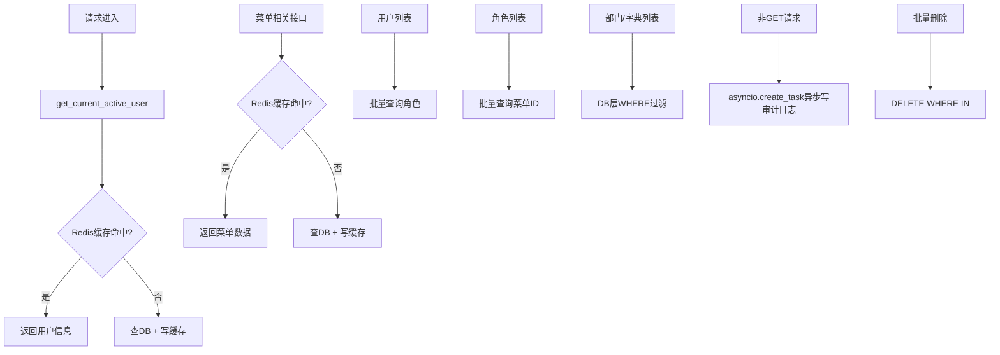

## 产品概述

对 Hello-FastApi 后端进行系统性性能优化，消除接口响应瓶颈，提升整体吞吐量。

## 核心功能

- 优化认证热路径：每个认证请求都查DB的用户信息，改为缓存
- 消除 N+1 查询：用户列表和角色列表的逐条关联查询
- 菜单数据缓存：menu_repo.get_all() 被多处反复全表查询，数据极少变化，适合缓存
- 数据库层过滤替代 Python 层过滤：部门/字典先全表加载再 Python 过滤
- 数据库连接池配置：当前未配置 pool_size/max_overflow
- 批量删除优化：逐条删除改为 DELETE WHERE IN
- 审计日志异步写入：中间件同步写库阻塞请求响应

## 技术栈

- 后端框架：FastAPI + SQLModel + SQLAlchemy (async)
- 缓存：Redis (已有 CacheService 基础设施)
- 数据库：SQLite (开发) / MySQL (生产可切换)
- 现有模式：DDD 分层架构、依赖注入工厂、FastCRUD

## 实现方案

### 优化策略总览

按影响面从大到小分三层：**热路径缓存** > **查询优化** > **基础设施调优**。仅对认证用户信息和菜单全表两个核心场景引入缓存，其余通过 SQL 优化和代码重构解决。

### 瓶颈1: get_current_active_user 每次查DB（最高优先级）

**现状**：`auth.py:44-52` 每个认证请求都创建 UserRepository 查 DB 获取用户基本信息（id/username/email/is_superuser/is_active）。
**方案**：在 CacheService 中新增用户基本信息缓存（key: `user:info:{user_id}`，TTL 5分钟），`get_current_active_user` 优先从缓存读取。用户信息变更时（update_user/update_status/delete_user）主动失效缓存。
**理由**：这是所有认证接口的热路径，QPS 最高，缓存命中率极高（用户信息在5分钟内几乎不变）。

### 瓶颈2: menu_repo.get_all() 反复全表查询

**现状**：auth_router（get_async_routes/role-menu）、menu_service（get_menu_tree/get_menu_list/get_user_menus）、auth_service（login/get_async_routes）都调用 menu_repo.get_all()，每次都执行 `SELECT * FROM sys_menus JOIN sys_menumeta`。
**方案**：在 CacheService 中新增菜单全表缓存（key: `menu:all`，TTL 10分钟），MenuRepository.get_all() 优先从缓存读取。菜单增删改时主动失效缓存。
**理由**：菜单数据极少变化（仅后台管理员操作），但被高频读取（登录、权限检查、动态路由），是缓存最佳候选。

### 瓶颈3: UserService.get_users() N+1 查询

**现状**：`user_service.py:175-181` 的 `_to_response` 对每个用户单独查 `role_repo.get_user_roles(user.id)`，10条数据 = 11次查询。
**方案**：新增 `RoleRepository.get_users_roles_batch(user_ids)` 方法，一次查询获取多用户角色映射，在 UserService.get_users() 中批量获取后分配。

### 瓶颈4: RoleService.get_roles() N+1 查询

**现状**：`role_service.py:116-122` 的 `_role_to_response` 对每个角色单独查 `role_repo.get_role_menu_ids(role.id)`。
**方案**：新增 `RoleRepository.get_roles_menu_ids_batch(role_ids)` 方法，一次查询获取多角色菜单ID映射。

### 瓶颈5: Department/Dictionary Python 层过滤

**现状**：department_service 和 dictionary_service 的 get_departments/get_dictionaries 先 get_all() 加载全部数据，再用 Python 列表推导过滤。
**方案**：在 Repository 层新增带筛选参数的查询方法，由数据库 WHERE 子句完成过滤，减少数据传输和内存占用。

### 瓶颈6: 数据库连接池未配置

**现状**：`database_manager.py:20` 的 `create_async_engine` 仅设 `pool_pre_ping=True`，SQLite 默认单连接，MySQL 生产环境也使用默认池大小。
**方案**：根据数据库类型配置连接池参数，MySQL 设 pool_size=10, max_overflow=20；SQLite 保持默认（单文件数据库不适合大连接池）。

### 瓶颈7: 批量删除逐条执行

**现状**：UserRepository.batch_delete、LogRepository.delete_login_logs/delete_operation_logs、IPRuleRepository.delete_ip_rules 都是 for 循环逐条删除。
**方案**：改用 `DELETE FROM table WHERE id IN (:ids)` 批量操作。

### 瓶颈8: 审计日志同步写入

**现状**：`request_logging_middleware.py:116-151` 在请求响应周期内同步创建新 DB 会话并写入审计日志。
**方案**：使用 `asyncio.create_task()` 将审计日志写入改为后台任务，不阻塞请求响应。使用独立的 session_factory 避免与请求事务冲突。

## 实现注意事项

- 缓存失效必须在用户/菜单/角色变更的所有写操作路径上覆盖，否则会出现数据不一致
- CacheService 已有完善的 Redis 降级机制（Redis 不可用时自动降级为直接查库），新增缓存方法需保持一致
- 批量查询方法需处理空列表入参的边界情况
- 审计日志异步写入需捕获异常并记录日志，避免后台任务异常影响主流程
- 数据库连接池参数仅对 MySQL 等服务端数据库生效，SQLite 无需配置
- 所有代码注释使用中文，行长度限制 320

## 架构设计



## 目录结构

```
service/src/
├── infrastructure/
│   ├── cache/
│   │   └── cache_service.py           # [MODIFY] 新增用户信息缓存和菜单全表缓存方法
│   ├── database/
│   │   └── database_manager.py        # [MODIFY] 配置MySQL连接池参数
│   ├── http/
│   │   └── request_logging_middleware.py  # [MODIFY] 审计日志改为异步后台写入
│   └── repositories/
│       ├── user_repository.py         # [MODIFY] batch_delete改为DELETE WHERE IN
│       ├── role_repository.py         # [MODIFY] 新增get_users_roles_batch和get_roles_menu_ids_batch
│       ├── department_repository.py   # [MODIFY] 新增带筛选参数的查询方法
│       ├── dictionary_repository.py   # [MODIFY] 新增带筛选参数的查询方法
│       ├── log_repository.py          # [MODIFY] 批量删除改为DELETE WHERE IN
│       ├── ip_rule_repository.py      # [MODIFY] 批量删除改为DELETE WHERE IN
│       └── menu_repository.py         # [MODIFY] get_all()增加缓存读取逻辑
├── application/
│   └── services/
│       ├── user_service.py            # [MODIFY] 消除N+1，批量获取角色；写操作失效缓存
│       ├── role_service.py            # [MODIFY] 消除N+1，批量获取菜单ID；写操作失效缓存
│       ├── department_service.py      # [MODIFY] 改用DB层过滤
│       ├── dictionary_service.py      # [MODIFY] 改用DB层过滤
│       └── menu_service.py            # [MODIFY] 写操作失效菜单缓存
├── api/
│   ├── dependencies/
│   │   └── auth.py                    # [MODIFY] get_current_active_user优先从缓存读取
│   └── v1/
│       └── auth_router.py             # [MODIFY] get_async_routes等接口利用菜单缓存
└── domain/
    └── repositories/
        ├── role_repository.py          # [MODIFY] 接口新增批量查询方法
        ├── department_repository.py    # [MODIFY] 接口新增带筛选查询方法
        └── dictionary_repository.py    # [MODIFY] 接口新增带筛选查询方法
```

## Agent Extensions

### Skill

- **python-performance-optimization**
- Purpose: 确保性能优化方案遵循 Python 异步编程最佳实践，特别是 asyncio.create_task 的使用和 Redis 缓存降级策略
- Expected outcome: 优化后的代码符合 Python 异步性能最佳实践，无潜在的并发问题
- **python-code-quality**
- Purpose: 确保新增的批量查询方法和缓存方法遵循 SOLID 原则，类型注解完整，代码风格一致
- Expected outcome: 新增代码类型注解完整，符合项目 DDD 分层规范