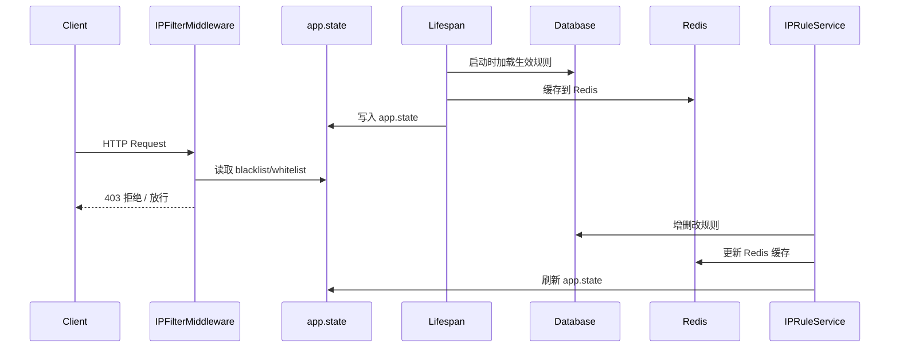

## 产品概述

启用 IP 过滤中间件，将已有的 `IPFilterMiddleware` 注册到 `create_app()`，使其从数据库 `sys_ip_rules` 表动态加载 IP 黑白名单规则，实现实时 IP 访问控制。

## 核心功能

- 在应用启动时从 `sys_ip_rules` 表加载所有生效的 IP 规则（is_active=1 且未过期）到内存
- 中间件在每次请求时检查客户端 IP 是否命中黑名单或白名单
- 白名单优先：配置了白名单时仅放行白名单内 IP；黑名单拒绝匹配 IP
- IP 规则变更（增删改）后自动刷新缓存，无需重启服务
- 支持 Redis 缓存 IP 规则，确保多 worker 场景下的一致性
- Redis 不可用时降级为直接查库加载，不阻塞服务

## Tech Stack

- 后端框架: FastAPI + Starlette BaseHTTPMiddleware
- ORM: SQLModel + SQLAlchemy
- 缓存: Redis (redis.asyncio)
- 已有基础设施: CacheService, IPRuleRepository, IPRuleEntity

## Implementation Approach

### 核心策略

将现有的静态 `IPFilterMiddleware`（构造函数注入 blacklist/whitelist set）改造为动态中间件，通过 `app.state` 存储内存中的 IP 规则集合，实现毫秒级请求过滤。IP 规则的加载和刷新通过新增的 `IPFilterCache` 管理器统一协调。

### 数据流

```
应用启动 → lifespan 从 DB 加载生效规则 → 写入 Redis 缓存 + app.state
每次请求 → 中间件读 app.state (内存) → 判断放行/拒绝
规则变更 → service 触发 refresh → 重载 DB → 更新 Redis + app.state
Redis 故障 → 降级为直接从 DB 加载到 app.state
```

### 关键技术决策

1. **app.state 而非每请求查 Redis/DB**：中间件在请求热路径上，必须极致快速。app.state 内存读取零延迟，远优于每请求 Redis/DB 查询。

2. **IPFilterCache 模块级单例**：遵循项目已有的模块级单例模式（`_db_manager`, `_redis_manager`），提供 `load_to_app_state()` 和 `refresh()` 方法，被 lifespan 和 service 共同调用。

3. **Redis 作为辅助缓存**：主要服务于多 worker 场景下的一致性。规则变更时先更新 Redis，其他 worker 可定期或按需同步。单 worker 场景下 Redis 不参与请求路径。

4. **过期规则处理**：利用已有的 `IPRuleEntity.is_effective` 语义（is_active=1 且未过期），加载时过滤掉已过期规则，并在 refresh 时重新评估。

5. **白名单优先策略**：与现有 IPFilterMiddleware 逻辑一致 — 白名单非空时仅放行白名单 IP，否则检查黑名单。

## Implementation Notes

- **性能**: 中间件仅读取 app.state 的 set 集合，O(1) 查找，零 I/O 开销。refresh 仅在规则变更时触发，不影响请求路径。
- **降级**: Redis 不可用时 CacheService 方法已自带 try/except 降级，IPFilterCache.load_to_app_state 在 Redis 写入失败时仍能成功加载到 app.state。
- **多 worker**: Docker 部署 4 worker 时，每个 worker 有独立的 app.state。规则变更时通过 Redis 缓存 + 日志提示确保最终一致性。未来可扩展 Redis Pub/Sub 实现实时同步。
- **日志**: 复用项目已有的 `src.infrastructure.logging.logger`，拒绝访问时记录 warning 级别日志，包含客户端 IP。
- **兼容**: 保留 IPFilterMiddleware 的 403 响应格式与现有统一错误格式一致。

## Architecture Design



## Directory Structure

```
service/src/
├── infrastructure/
│   ├── http/
│   │   ├── ip_filter_cache.py          # [NEW] IP 规则缓存管理器。模块级单例，提供 load_to_app_state() 从 DB 加载生效 IP 规则到 app.state 和 Redis；refresh() 在规则变更时重新加载。包含 _app 引用用于跨模块刷新。
│   │   ├── ip_filter_middleware.py     # [MODIFY] 移除构造函数的 blacklist/whitelist 参数，改为从 request.app.state 动态读取 ip_blacklist/ip_whitelist 集合。保留白名单优先+黑名单拒绝逻辑。
│   │   └── __init__.py                 # [MODIFY] 导出新增的 IPFilterCache 相关函数
│   ├── cache/
│   │   └── cache_service.py            # [MODIFY] 新增 IP 规则缓存方法：set_ip_rules()、get_ip_rules()、invalidate_ip_rules()，使用 Redis Hash 存储 blacklist/whitelist
│   └── lifecycle/
│       └── lifespan.py                 # [MODIFY] 在 application_lifespan 启动阶段（DB 初始化后）调用 IPFilterCache.load_to_app_state(app) 预加载 IP 规则
├── application/
│   └── services/
│       └── ip_rule_service.py          # [MODIFY] 在 create_ip_rule/update_ip_rule/delete_ip_rules/clear_ip_rules 操作后调用 IPFilterCache.refresh() 刷新缓存
├── domain/
│   └── repositories/
│       └── ip_rule_repository.py       # [MODIFY] 新增 get_effective_ip_rules() 抽象方法，返回所有 is_active=1 且未过期的 IPRuleEntity 列表
├── infrastructure/
│   └── repositories/
│       └── ip_rule_repository.py       # [MODIFY] 实现 get_effective_ip_rules()，查询 is_active=1 且 (expires_at IS NULL OR expires_at > now) 的记录
└── main.py                             # [MODIFY] 导入并注册 IPFilterMiddleware，调用 IPFilterCache.set_app(app)
```

## Key Code Structures

### IPFilterCache 核心接口

```python
class IPFilterCache:
    """IP 规则缓存管理器，协调 DB/Redis/app.state 三层缓存。"""
    _app: FastAPI | None
    _cache_service: CacheService | None

    async def load_to_app_state(self, app: FastAPI) -> None: ...
    async def refresh(self) -> None: ...
    def _classify_rules(self, rules: list[IPRuleEntity]) -> tuple[set[str], set[str]]: ...
```

### CacheService 新增方法签名

```python
async def set_ip_rules(self, blacklist: set[str], whitelist: set[str]) -> bool: ...
async def get_ip_rules(self) -> tuple[set[str], set[str]] | None: ...
async def invalidate_ip_rules(self) -> bool: ...
```

### IPRuleRepositoryInterface 新增方法签名

```python
@abstractmethod
async def get_effective_ip_rules(self) -> list[IPRuleEntity]: ...
```

## Agent Extensions

### Skill

- **python-code-quality**
- Purpose: 确保 IPFilterCache 和重构后的中间件代码遵循 SOLID 原则、类型注解完整、异常处理健全
- Expected outcome: 产出高质量 Python 代码，含完整类型注解和优雅降级逻辑