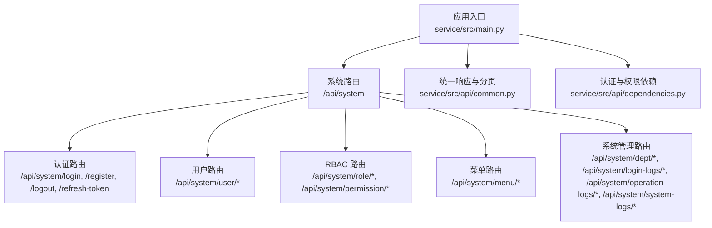
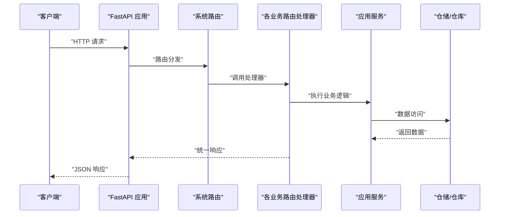
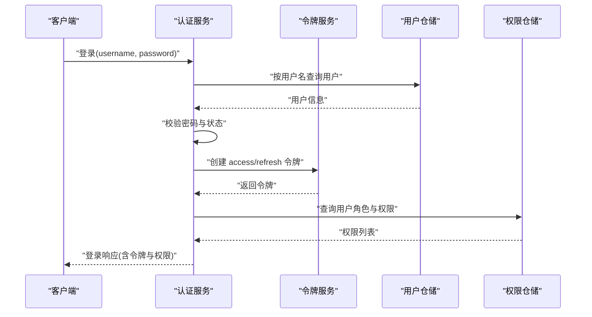
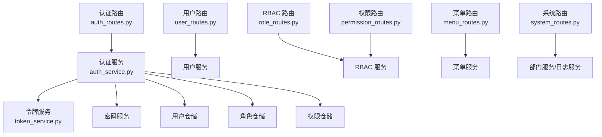

# API 接口文档

<cite>
**本文引用的文件**
- [service/src/main.py](file://service/src/main.py)
- [service/src/api/common.py](file://service/src/api/common.py)
- [service/src/api/dependencies.py](file://service/src/api/dependencies.py)
- [service/src/api/v1/auth_routes.py](file://service/src/api/v1/auth_routes.py)
- [service/src/api/v1/user_routes.py](file://service/src/api/v1/user_routes.py)
- [service/src/api/v1/role_routes.py](file://service/src/api/v1/role_routes.py)
- [service/src/api/v1/permission_routes.py](file://service/src/api/v1/permission_routes.py)
- [service/src/api/v1/menu_routes.py](file://service/src/api/v1/menu_routes.py)
- [service/src/api/v1/system_routes.py](file://service/src/api/v1/system_routes.py)
- [service/src/application/dto/auth_dto.py](file://service/src/application/dto/auth_dto.py)
- [service/src/application/dto/user_dto.py](file://service/src/application/dto/user_dto.py)
- [service/src/application/dto/role_dto.py](file://service/src/application/dto/role_dto.py)
- [service/src/application/dto/permission_dto.py](file://service/src/application/dto/permission_dto.py)
- [service/src/domain/auth/token_service.py](file://service/src/domain/auth/token_service.py)
- [service/src/application/services/auth_service.py](file://service/src/application/services/auth_service.py)
- [service/src/config/settings.py](file://service/src/config/settings.py)
- [service/src/core/constants.py](file://service/src/core/constants.py)
- [service/tests/integration/test_api.py](file://service/tests/integration/test_api.py)
- [service/scripts/verify_api.py](file://service/scripts/verify_api.py)
</cite>

## 更新摘要
**所做更改**
- 新增用户列表格式化函数的详细说明，确保前端兼容性和数据一致性
- 更新用户管理接口部分，反映数据格式化改进对API响应的影响
- 增强API数据呈现的一致性说明，涵盖用户和角色API的数据格式优化

## 目录
1. [简介](#简介)
2. [项目结构](#项目结构)
3. [核心组件](#核心组件)
4. [架构总览](#架构总览)
5. [详细组件分析](#详细组件分析)
6. [依赖分析](#依赖分析)
7. [性能考虑](#性能考虑)
8. [故障排查指南](#故障排查指南)
9. [结论](#结论)
10. [附录](#附录)

## 简介
本文件为 Hello-FastApi 的 API 接口文档，覆盖认证接口、用户管理接口、RBAC 接口、菜单管理接口与系统管理接口。文档提供每个接口的 HTTP 方法、URL 模式、请求参数、响应格式与状态码说明，并解释 JWT 认证与权限校验机制。同时给出统一响应格式、版本管理策略、兼容性考虑以及测试与调试建议，帮助前后端与第三方集成快速上手。

**更新** 本次更新重点关注API数据格式化改进，新增了用户列表格式化函数，确保前端兼容性和数据一致性，特别优化了用户和角色API的数据呈现格式。

## 项目结构
- 后端采用 FastAPI + DDD 分层架构，API 路由位于 v1 版本命名空间，统一前缀为 /api/system。
- 核心模块包括：认证、用户管理、RBAC（角色与权限）、菜单管理、系统管理（部门、日志等）。
- 统一响应格式与分页格式在公共模块定义；认证依赖与权限校验通过依赖注入实现。

**图表来源**
- [service/src/main.py:34-96](file://service/src/main.py#L34-L96)
- [service/src/api/common.py:29-65](file://service/src/api/common.py#L29-L65)
- [service/src/api/dependencies.py:16-72](file://service/src/api/dependencies.py#L16-L72)

**章节来源**
- [service/src/main.py:34-96](file://service/src/main.py#L34-L96)
- [service/src/core/constants.py:4-6](file://service/src/core/constants.py#L4-L6)

## 核心组件
- 统一响应与分页
  - 统一响应格式包含 code、message、data 字段；分页响应包含 total、pageNum、pageSize、totalPage、rows。
- 认证依赖
  - 通过 HTTP Bearer 令牌进行鉴权；从令牌中解析用户 ID 并校验令牌类型；校验用户是否激活；支持基于权限码的细粒度授权。
- JWT 令牌服务
  - 支持创建访问令牌与刷新令牌，设定过期时间；解码并验证令牌有效性；校验令牌类型。
- **数据格式化组件**（新增）
  - 用户列表格式化函数确保前端兼容性，自动处理空值占位和部门信息格式化。

**章节来源**
- [service/src/api/common.py:29-65](file://service/src/api/common.py#L29-L65)
- [service/src/api/dependencies.py:16-72](file://service/src/api/dependencies.py#L16-L72)
- [service/src/domain/auth/token_service.py:14-45](file://service/src/domain/auth/token_service.py#L14-L45)
- [service/src/api/common.py:95-104](file://service/src/api/common.py#L95-L104)

## 架构总览
- API 前缀：/api/system
- 文档地址：/api/system/docs、/api/system/redoc、/api/system/openapi.json
- 健康检查：/health
- 统一异常处理：AppException、参数校验错误、通用异常
- CORS：允许跨域请求，按配置放行

**图表来源**
- [service/src/main.py:34-96](file://service/src/main.py#L34-L96)
- [service/src/api/common.py:45-65](file://service/src/api/common.py#L45-L65)

**章节来源**
- [service/src/main.py:34-96](file://service/src/main.py#L34-L96)
- [service/src/config/settings.py:47-51](file://service/src/config/settings.py#L47-L51)

## 详细组件分析

### 认证接口
- 登录
  - 方法与路径：POST /api/system/login
  - 请求体：用户名、密码
  - 成功响应：包含 accessToken、expires（秒）、refreshToken、userInfo、roles、permissions
  - 失败响应：401 未授权（用户名或密码错误、账户禁用）
- 注册
  - 方法与路径：POST /api/system/register
  - 请求体：用户名、密码、昵称、邮箱、手机号
  - 成功响应：返回新用户基本信息
  - 失败响应：400 业务错误（用户名已存在）
- 登出
  - 方法与路径：POST /api/system/logout
  - 请求头：Authorization: Bearer <access_token>
  - 成功响应：登出成功
  - 说明：JWT 无状态，服务端不存储会话
- 刷新令牌
  - 方法与路径：POST /api/system/refresh-token
  - 请求体：refreshToken
  - 成功响应：返回新的 accessToken、expires、refreshToken
  - 失败响应：401 未授权（无效或过期的刷新令牌）

请求与响应示例（基于测试与实现）
- 登录成功示例：响应包含 code=0、data.accessToken、data.refreshToken、data.expires、data.userInfo、data.roles、data.permissions
- 登录失败示例：响应 code=401，message 说明用户名或密码错误
- 注册成功示例：响应 code=0，data 包含新建用户基本信息
- 登出成功示例：响应 code=0，message 为"登出成功"
- 刷新成功示例：响应 code=0，data.accessToken、data.refreshToken 更新

**章节来源**
- [service/src/api/v1/auth_routes.py:23-86](file://service/src/api/v1/auth_routes.py#L23-L86)
- [service/src/application/dto/auth_dto.py:7-54](file://service/src/application/dto/auth_dto.py#L7-L54)
- [service/src/application/services/auth_service.py:26-154](file://service/src/application/services/auth_service.py#L26-L154)
- [service/tests/integration/test_api.py:44-124](file://service/tests/integration/test_api.py#L44-L124)

### 用户管理接口
- 获取用户列表（分页+筛选）
  - 方法与路径：POST /api/system/user
  - 权限：user:view
  - 请求体：pageNum、pageSize、username、phone、email、status、deptId
  - 成功响应：分页数据 rows、total、pageNum、pageSize、totalPage
  - **响应格式优化**：新增用户列表格式化函数，确保前端兼容性
- 创建用户
  - 方法与路径：POST /api/system/user/create
  - 权限：user:add
  - 请求体：username、password、nickname、email、phone、sex、avatar、status、deptId、remark
  - 成功响应：code=201，data 为创建用户信息
- 获取当前用户信息
  - 方法与路径：GET /api/system/user/info
  - 认证：需要有效 access_token
  - 成功响应：data 为当前用户完整信息（含角色与权限）
- 获取用户详情
  - 方法与路径：GET /api/system/user/{user_id}
  - 权限：user:view
  - 成功响应：data 为指定用户信息
- 更新用户
  - 方法与路径：PUT /api/system/user/{user_id}
  - 权限：user:edit
  - 请求体：可选字段（昵称、邮箱、电话、性别、头像、状态、部门、备注）
  - 成功响应：更新后的用户信息
- 删除用户
  - 方法与路径：DELETE /api/system/user/{user_id}
  - 权限：user:delete
  - 成功响应：删除成功
- 批量删除用户
  - 方法与路径：POST /api/system/user/batch-delete
  - 权限：user:delete
  - 请求体：ids（用户ID列表）
  - 成功响应：批量删除成功
- 重置用户密码（管理员）
  - 方法与路径：PUT /api/system/user/{user_id}/reset-password
  - 权限：user:edit
  - 请求体：newPassword
  - 成功响应：密码重置成功
- 更改用户状态
  - 方法与路径：PUT /api/system/user/{user_id}/status
  - 权限：user:edit
  - 请求体：status（0/1）
  - 成功响应：状态更新成功
- 修改当前用户密码
  - 方法与路径：POST /api/system/user/change-password
  - 认证：需要有效 access_token
  - 请求体：oldPassword、newPassword
  - 成功响应：密码修改成功
- 为用户分配角色
  - 方法与路径：POST /api/system/user/assign-role
  - 权限：user:edit
  - 请求体：userId、roleIds
  - 成功响应：角色分配成功

**数据格式化改进说明**（新增）
用户列表接口现已集成格式化函数，确保响应数据与前端期望格式完全一致：

- 自动添加部门信息：`{"id": dept_id 或 "", "name": ""}`
- 空值处理：phone、email、nickname、avatar、remark 字段为空时自动替换为空字符串
- 字段清理：移除 dept_id 字段，避免前端兼容性问题

请求与响应示例（基于测试与实现）
- 获取当前用户信息示例：需携带 Authorization: Bearer <access_token>，响应 code=0，data 为用户信息
- 修改密码示例：携带 access_token，响应 code=0，message 为"密码修改成功"

**章节来源**
- [service/src/api/v1/user_routes.py:17-228](file://service/src/api/v1/user_routes.py#L17-L228)
- [service/src/application/dto/user_dto.py:8-86](file://service/src/application/dto/user_dto.py#L8-L86)
- [service/src/api/common.py:95-104](file://service/src/api/common.py#L95-L104)
- [service/tests/integration/test_api.py:125-263](file://service/tests/integration/test_api.py#L125-L263)

### RBAC 接口
- 角色管理
  - 获取角色列表（分页+筛选）
    - 方法与路径：POST /api/system/role
    - 权限：role:view
    - 请求体：pageNum、pageSize、roleName、status
    - 成功响应：分页数据
    - **响应格式优化**：角色列表已优化字段格式，确保与前端期望一致
  - 创建角色
    - 方法与路径：POST /api/system/role/create
    - 权限：role:manage
    - 请求体：name、code、description、status、permissionIds
    - 成功响应：code=201
  - 获取角色详情
    - 方法与路径：GET /api/system/role/{role_id}
    - 权限：role:view
    - 成功响应：data 为角色及权限列表
  - 更新角色
    - 方法与路径：PUT /api/system/role/{role_id}
    - 权限：role:manage
    - 请求体：name、code、description、status、permissionIds
    - 成功响应：更新后的角色信息
  - 删除角色
    - 方法与路径：DELETE /api/system/role/{role_id}
    - 权限：role:manage
    - 成功响应：角色删除成功
  - 为角色分配权限
    - 方法与路径：POST /api/system/role/{role_id}/permissions
    - 权限：role:manage
    - 请求体：permissionIds
    - 成功响应：权限分配成功
  - 为角色分配菜单权限
    - 方法与路径：POST /api/system/role/{role_id}/menu
    - 权限：role:manage
    - 请求体：menuIds（菜单ID列表）
    - 成功响应：菜单权限分配成功
- 权限管理
  - 获取权限列表（分页+筛选）
    - 方法与路径：GET /api/system/permission/list
    - 权限：permission:view
    - 查询参数：pageNum、pageSize、permissionName
    - 成功响应：分页数据
  - 创建权限
    - 方法与路径：POST /api/system/permission
    - 权限：permission:manage
    - 请求体：name、code、category、description、status
    - 成功响应：code=201
  - 删除权限
    - 方法与路径：DELETE /api/system/permission/{permission_id}
    - 权限：permission:manage
    - 成功响应：权限删除成功

**数据格式化改进说明**（新增）
角色列表接口已优化响应格式，确保与前端期望保持一致：

- 标准化字段格式：包含 id、name、code、status、remark、createTime
- 时间格式处理：使用 `datetime_to_timestamp` 函数转换时间格式
- 空值处理：remark 字段为空时自动替换为空字符串

请求与响应示例（基于测试与实现）
- 获取角色列表示例：携带 role:view 权限，响应 code=0，data 为分页数据
- 为角色分配权限示例：携带 role:manage 权限，响应 code=0，message 为"权限分配成功"

**章节来源**
- [service/src/api/v1/role_routes.py:25-227](file://service/src/api/v1/role_routes.py#L25-L227)
- [service/src/api/v1/permission_routes.py:25-227](file://service/src/api/v1/permission_routes.py#L25-L227)
- [service/src/application/dto/role_dto.py:8-88](file://service/src/application/dto/role_dto.py#L8-L88)
- [service/src/application/dto/permission_dto.py:8-88](file://service/src/application/dto/permission_dto.py#L8-L88)

### 菜单管理接口
- 获取菜单列表（扁平结构）
  - 方法与路径：POST /api/system/menu
  - 权限：menu:view
  - 成功响应：data 为扁平菜单列表
- 获取完整菜单树
  - 方法与路径：GET /api/system/menu/tree
  - 权限：menu:view
  - 成功响应：data 为菜单树
- 获取当前用户可访问菜单
  - 方法与路径：GET /api/system/menu/user-menus
  - 认证：需要有效 access_token
  - 成功响应：data 为用户可访问菜单列表
- 创建菜单
  - 方法与路径：POST /api/system/menu/create
  - 权限：menu:add
  - 请求体：菜单字段（具体字段以 DTO 定义为准）
  - 成功响应：code=201
- 更新菜单
  - 方法与路径：PUT /api/system/menu/{menu_id}
  - 权限：menu:edit
  - 请求体：菜单字段
  - 成功响应：更新后的菜单
- 删除菜单
  - 方法与路径：DELETE /api/system/menu/{menu_id}
  - 权限：menu:delete
  - 成功响应：删除成功

**章节来源**
- [service/src/api/v1/menu_routes.py:19-72](file://service/src/api/v1/menu_routes.py#L19-L72)

### 系统管理接口
- 部门管理
  - 获取部门列表（扁平结构）
    - 方法与路径：POST /api/system/dept
    - 权限：dept:view
    - 请求体：name、status
    - 成功响应：data 为扁平部门列表
  - 创建部门
    - 方法与路径：POST /api/system/dept/create
    - 权限：dept:add
    - 请求体：部门字段
    - 成功响应：code=201
  - 更新部门
    - 方法与路径：PUT /api/system/dept/{dept_id}
    - 权限：dept:edit
    - 请求体：部门字段
    - 成功响应：更新后的部门
  - 删除部门
    - 方法与路径：DELETE /api/system/dept/{dept_id}
    - 权限：dept:delete
    - 成功响应：删除成功
- 在线用户（模拟数据）
  - 方法与路径：POST /api/system/online-logs
  - 权限：admin
  - 请求体：username（可选）
  - 成功响应：data 为在线用户列表
- 登录日志管理
  - 获取登录日志列表
    - 方法与路径：POST /api/system/login-logs
    - 权限：login-log:view
    - 请求体：pageNum、pageSize、username、startTime、endTime
    - 成功响应：分页数据
  - 批量删除登录日志
    - 方法与路径：POST /api/system/login-logs/batch-delete
    - 权限：login-log:delete
    - 请求体：ids（日志ID列表）
    - 成功响应：已删除数量
  - 清空所有登录日志
    - 方法与路径：POST /api/system/login-logs/clear
    - 权限：login-log:delete
    - 成功响应：已清空数量
- 操作日志管理
  - 获取操作日志列表
    - 方法与路径：POST /api/system/operation-logs
    - 权限：operation-log:view
    - 请求体：pageNum、pageSize、username、startTime、endTime
    - 成功响应：分页数据
  - 批量删除操作日志
    - 方法与路径：POST /api/system/operation-logs/batch-delete
    - 权限：operation-log:delete
    - 请求体：ids（日志ID列表）
    - 成功响应：已删除数量
  - 清空所有操作日志
    - 方法与路径：POST /api/system/operation-logs/clear
    - 权限：operation-log:delete
    - 成功响应：已清空数量
- 系统日志管理
  - 获取系统日志列表
    - 方法与路径：POST /api/system/system-logs
    - 权限：system-log:view
    - 请求体：pageNum、pageSize、level、module、startTime、endTime
    - 成功响应：分页数据
  - 获取系统日志详情
    - 方法与路径：POST /api/system/system-logs-detail
    - 权限：system-log:view
    - 请求体：id（日志ID）
    - 成功响应：data 为日志详情
  - 批量删除系统日志
    - 方法与路径：POST /api/system/system-logs/batch-delete
    - 权限：system-log:delete
    - 请求体：ids（日志ID列表）
    - 成功响应：已删除数量
  - 清空所有系统日志
    - 方法与路径：POST /api/system/system-logs/clear
    - 权限：system-log:delete
    - 成功响应：已清空数量
- 地图数据接口（模拟数据）
  - 方法与路径：GET /api/system/get-map-info
  - 权限：admin
  - 成功响应：data 为模拟车辆位置数据
- 卡片列表接口（模拟数据）
  - 方法与路径：POST /api/system/get-card-list
  - 权限：admin
  - 成功响应：data 为模拟卡片数据

**章节来源**
- [service/src/api/v1/system_routes.py:25-335](file://service/src/api/v1/system_routes.py#L25-L335)

### JWT 认证与权限校验
- 认证方式
  - 使用 HTTP Bearer 令牌；令牌类型区分 access 与 refresh；访问令牌用于受保护资源，刷新令牌用于换取新的访问令牌。
- 权限校验
  - 通过 require_permission(code) 依赖实现；超级用户拥有全部权限；普通用户需具备目标权限码。
- 令牌服务
  - 支持创建访问令牌与刷新令牌、解码与验证、令牌类型校验。

**图表来源**
- [service/src/application/services/auth_service.py:26-74](file://service/src/application/services/auth_service.py#L26-L74)
- [service/src/domain/auth/token_service.py:14-45](file://service/src/domain/auth/token_service.py#L14-L45)

**章节来源**
- [service/src/api/dependencies.py:16-72](file://service/src/api/dependencies.py#L16-L72)
- [service/src/domain/auth/token_service.py:14-45](file://service/src/domain/auth/token_service.py#L14-L45)

## 依赖分析
- 路由到服务的依赖链
  - 路由处理器依赖应用服务；应用服务依赖仓储与领域服务（如令牌服务、密码服务）。
- 统一响应与异常处理
  - 统一响应格式在公共模块定义；全局异常处理器捕获业务异常与参数校验异常，返回标准化错误。

**图表来源**
- [service/src/api/v1/auth_routes.py:23-86](file://service/src/api/v1/auth_routes.py#L23-L86)
- [service/src/api/v1/user_routes.py:17-228](file://service/src/api/v1/user_routes.py#L17-L228)
- [service/src/api/v1/role_routes.py:25-227](file://service/src/api/v1/role_routes.py#L25-L227)
- [service/src/api/v1/permission_routes.py:25-227](file://service/src/api/v1/permission_routes.py#L25-L227)
- [service/src/api/v1/menu_routes.py:19-72](file://service/src/api/v1/menu_routes.py#L19-L72)
- [service/src/api/v1/system_routes.py:25-335](file://service/src/api/v1/system_routes.py#L25-L335)
- [service/src/application/services/auth_service.py:18-25](file://service/src/application/services/auth_service.py#L18-L25)

**章节来源**
- [service/src/api/common.py:45-65](file://service/src/api/common.py#L45-L65)
- [service/src/main.py:60-83](file://service/src/main.py#L60-L83)

## 性能考虑
- 分页与限制
  - 默认分页大小与最大分页大小在常量中定义，避免一次性返回过多数据。
- 缓存与限流
  - 配置中包含限流参数，可在网关或中间件层实施速率限制。
- 异步数据库访问
  - 使用异步 SQLModel 会话，提升并发处理能力。
- **数据格式化优化**（新增）
  - 用户列表格式化函数减少前端数据处理负担，提升渲染性能
  - 统一的空值处理机制避免重复的前端判断逻辑
- 建议
  - 对高频接口增加缓存（如菜单树、权限列表），结合缓存失效策略。
  - 对复杂查询增加索引与筛选条件，避免全表扫描。

**章节来源**
- [service/src/core/constants.py:7-9](file://service/src/core/constants.py#L7-L9)
- [service/src/config/settings.py:77-80](file://service/src/config/settings.py#L77-L80)
- [service/src/api/common.py:95-104](file://service/src/api/common.py#L95-L104)

## 故障排查指南
- 常见错误与处理
  - 401 未授权：令牌无效、过期或类型不正确；用户不存在或未激活。
  - 403 禁止访问：缺少目标权限码；非超级用户尝试管理操作。
  - 422 参数校验失败：请求体字段不符合 DTO 校验规则。
  - 500 内部错误：未捕获异常，查看服务端日志定位。
- 调试技巧
  - 使用统一响应格式中的 code 与 message 快速定位问题。
  - 在开发环境开启详细日志级别，结合请求 ID 追踪。
  - 使用集成测试与验证脚本快速复现问题。
- 健康检查
  - 访问 /health 确认服务可用与版本信息。

**章节来源**
- [service/src/main.py:60-83](file://service/src/main.py#L60-L83)
- [service/tests/integration/test_api.py:12-22](file://service/tests/integration/test_api.py#L12-L22)

## 结论
本 API 文档覆盖了认证、用户管理、RBAC、菜单管理与系统管理的核心接口，明确了统一响应格式、JWT 认证与权限校验机制，并提供了测试与调试建议。**更新** 本次改进重点加强了API数据格式化，新增用户列表格式化函数确保前端兼容性和数据一致性，特别优化了用户和角色API的数据呈现格式。建议在生产环境中完善缓存、限流与监控策略，确保高可用与高性能。

## 附录

### 统一响应格式
- 成功响应：{ code: number, message: string, data?: any }
- 分页响应：{ total: number, pageNum: number, pageSize: number, totalPage: number, rows: any[] }
- 错误响应：{ code: number, message: string }

**章节来源**
- [service/src/api/common.py:29-65](file://service/src/api/common.py#L29-L65)

### 版本管理与兼容性
- API 前缀：/api/system
- 版本号：通过配置项 API_VERSION 控制
- 兼容性建议：新增字段向后兼容；变更字段时提供迁移策略与过渡期

**章节来源**
- [service/src/config/settings.py:47-51](file://service/src/config/settings.py#L47-L51)
- [service/src/main.py:36-43](file://service/src/main.py#L36-L43)

### 权限码清单（示例）
- 用户相关：user:view、user:add、user:edit、user:delete
- 角色相关：role:view、role:manage
- 权限相关：permission:view、permission:manage
- 菜单相关：menu:view、menu:add、menu:edit、menu:delete
- 部门相关：dept:view、dept:add、dept:edit、dept:delete
- 日志相关：login-log:view、login-log:delete、operation-log:view、operation-log:delete、system-log:view、system-log:delete

**章节来源**
- [service/src/core/constants.py:18-44](file://service/src/core/constants.py#L18-L44)

### API 测试与调试实用技巧
- 使用集成测试验证端到端流程（登录、受保护资源访问、权限控制）。
- 使用验证脚本快速检查健康检查、登录、受保护端点与 RBAC 端点。
- 前端集成时优先使用 /api/system/docs 与 /api/system/redoc 查看接口定义与示例。

**章节来源**
- [service/tests/integration/test_api.py:12-263](file://service/tests/integration/test_api.py#L12-L263)
- [service/scripts/verify_api.py:27-156](file://service/scripts/verify_api.py#L27-L156)

### 数据格式化改进详情（新增）
**用户列表格式化函数**
- 功能：确保前端兼容性和数据一致性
- 处理逻辑：
  - 自动添加部门信息：`{"id": dept_id 或 "", "name": ""}`
  - 空值处理：phone、email、nickname、avatar、remark 字段为空时自动替换为空字符串
  - 字段清理：移除 dept_id 字段，避免前端兼容性问题

**角色列表格式化**
- 标准化字段格式：包含 id、name、code、status、remark、createTime
- 时间格式处理：使用 `datetime_to_timestamp` 函数转换时间格式
- 空值处理：remark 字段为空时自动替换为空字符串

**章节来源**
- [service/src/api/common.py:95-104](file://service/src/api/common.py#L95-L104)
- [service/src/api/v1/user_routes.py:32-35](file://service/src/api/v1/user_routes.py#L32-L35)
- [service/src/api/v1/role_routes.py:37-43](file://service/src/api/v1/role_routes.py#L37-L43)