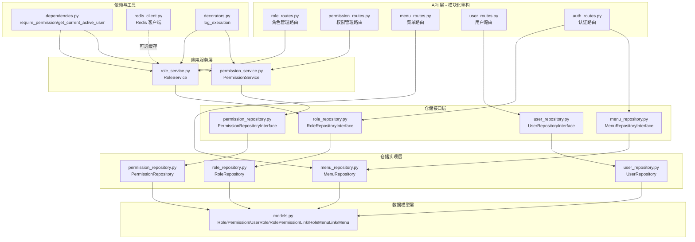
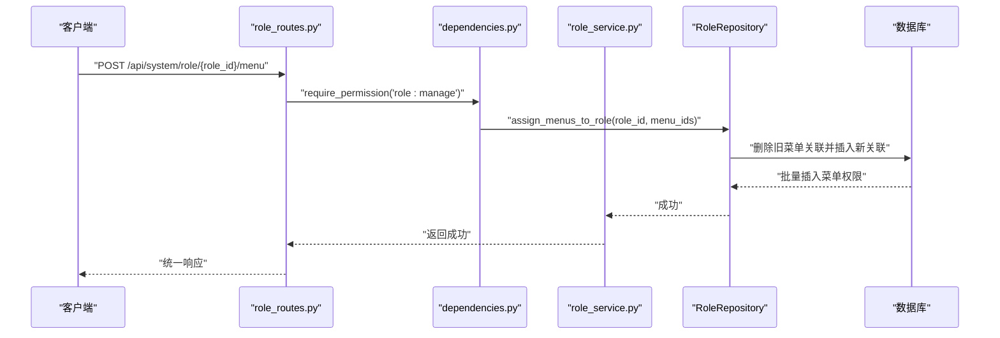
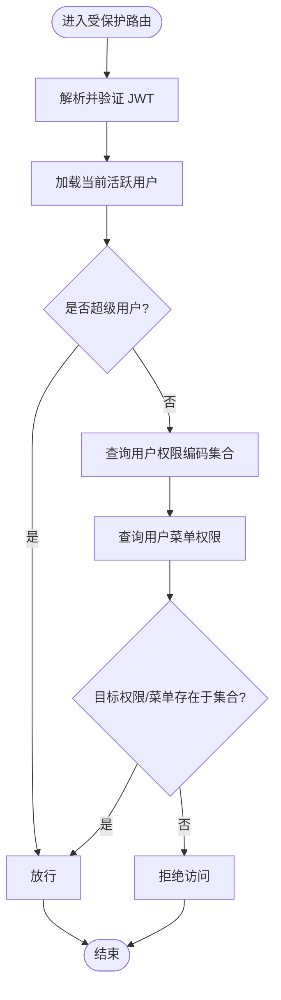
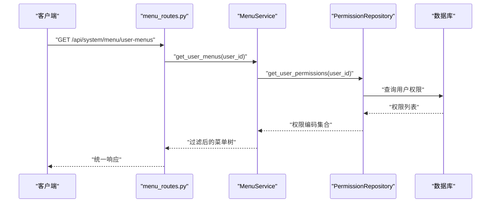
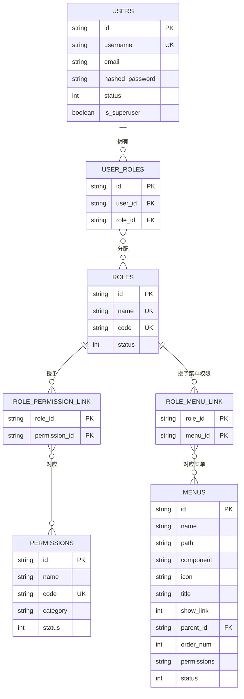
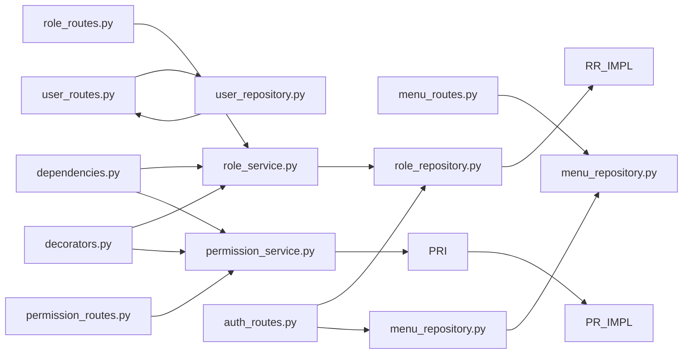

# RBAC 权限管理接口

<cite>
**本文引用的文件**
- [role_routes.py](file://service/src/api/v1/role_routes.py)
- [permission_routes.py](file://service/src/api/v1/permission_routes.py)
- [menu_routes.py](file://service/src/api/v1/menu_routes.py)
- [user_routes.py](file://service/src/api/v1/user_routes.py)
- [auth_routes.py](file://service/src/api/v1/auth_routes.py)
- [role_service.py](file://service/src/application/services/role_service.py)
- [permission_service.py](file://service/src/application/services/permission_service.py)
- [role_dto.py](file://service/src/application/dto/role_dto.py)
- [permission_dto.py](file://service/src/application/dto/permission_dto.py)
- [role_repository.py](file://service/src/infrastructure/repositories/role_repository.py)
- [permission_repository.py](file://service/src/infrastructure/repositories/permission_repository.py)
- [menu_repository.py](file://service/src/infrastructure/repositories/menu_repository.py)
- [user_repository.py](file://service/src/infrastructure/repositories/user_repository.py)
- [models.py](file://service/src/infrastructure/database/models.py)
- [dependencies.py](file://service/src/api/dependencies.py)
- [redis_client.py](file://service/src/infrastructure/cache/redis_client.py)
- [decorators.py](file://service/src/core/decorators.py)
- [main.py](file://service/src/main.py)
</cite>

## 更新摘要
**变更内容**
- API接口模块化重构：角色和权限管理API已从单一rbac_routes.py文件拆分为独立的role_routes.py和permission_routes.py文件
- API路径结构更新：角色管理API路径为/api/system/role，权限管理API路径为/api/system/permission
- 菜单权限管理功能保持不变，仍通过auth_routes.py提供角色菜单权限树获取接口
- 用户角色分配接口已迁移到user_routes.py文件中

## 目录
1. [简介](#简介)
2. [项目结构](#项目结构)
3. [核心组件](#核心组件)
4. [架构总览](#架构总览)
5. [详细组件分析](#详细组件分析)
6. [依赖分析](#依赖分析)
7. [性能考量](#性能考量)
8. [故障排查指南](#故障排查指南)
9. [结论](#结论)
10. [附录](#附录)

## 简介
本文件为 RBAC 权限管理接口的权威文档，覆盖角色管理、权限管理、角色权限分配、用户角色分配以及菜单权限管理的完整 API。文档同时阐述权限继承与权限验证机制、权限树形结构数据格式与查询方法、动态权限控制原理与实现、权限缓存策略与性能优化建议，并给出最佳实践与安全注意事项。

**更新** API接口已进行模块化重构，角色和权限管理功能分别位于独立的路由文件中，API路径结构已更新为/api/system/role和/api/system/permission。

## 项目结构
RBAC 子系统采用分层架构和模块化设计：
- API 层：角色管理路由(role_routes.py)、权限管理路由(permission_routes.py)、菜单路由(menu_routes.py)、用户路由(user_routes.py)、认证路由(auth_routes.py)
- 应用服务层：角色服务(RoleService)、权限服务(PermissionService)
- 领域仓储接口层：角色仓储接口、权限仓储接口
- 基础设施仓储实现层：基于 SQLModel 的具体数据库操作
- 数据模型层：角色、权限、用户角色关联、菜单等实体
- 依赖注入与中间件：鉴权、权限校验、日志装饰器等

**图表来源**
- [role_routes.py:1-167](file://service/src/api/v1/role_routes.py#L1-L167)
- [permission_routes.py:1-85](file://service/src/api/v1/permission_routes.py#L1-L85)
- [menu_routes.py:1-72](file://service/src/api/v1/menu_routes.py#L1-L72)
- [user_routes.py:1-208](file://service/src/api/v1/user_routes.py#L1-L208)
- [auth_routes.py:1-252](file://service/src/api/v1/auth_routes.py#L1-L252)
- [role_service.py:1-178](file://service/src/application/services/role_service.py#L1-L178)
- [permission_service.py:1-78](file://service/src/application/services/permission_service.py#L1-L78)

**章节来源**
- [role_routes.py:1-167](file://service/src/api/v1/role_routes.py#L1-L167)
- [permission_routes.py:1-85](file://service/src/api/v1/permission_routes.py#L1-L85)
- [menu_routes.py:1-72](file://service/src/api/v1/menu_routes.py#L1-L72)
- [user_routes.py:1-208](file://service/src/api/v1/user_routes.py#L1-L208)
- [auth_routes.py:1-252](file://service/src/api/v1/auth_routes.py#L1-L252)
- [role_service.py:1-178](file://service/src/application/services/role_service.py#L1-L178)
- [permission_service.py:1-78](file://service/src/application/services/permission_service.py#L1-L78)

## 核心组件
- **角色管理**：创建、查询、更新、删除角色；角色详情含权限列表
- **权限管理**：创建、查询、删除权限；支持按名称模糊查询
- **角色权限分配**：为角色批量分配权限，先清空旧关联再建立新关联
- **用户角色分配**：为用户分配/移除角色；获取用户角色与权限集合
- **权限验证**：基于用户权限编码进行动态校验
- **菜单权限管理**：角色与菜单的多对多关联，支持菜单权限分配与查询
- **角色菜单权限树**：获取完整的菜单权限树用于角色权限分配界面
- **菜单权限集成**：菜单与权限编码关联，按用户权限过滤菜单树

**更新** API接口已模块化重构，角色管理API路径为/api/system/role，权限管理API路径为/api/system/permission。

**章节来源**
- [role_routes.py:20-167](file://service/src/api/v1/role_routes.py#L20-L167)
- [permission_routes.py:17-85](file://service/src/api/v1/permission_routes.py#L17-L85)
- [role_service.py:30-178](file://service/src/application/services/role_service.py#L30-L178)
- [permission_service.py:28-78](file://service/src/application/services/permission_service.py#L28-L78)
- [auth_routes.py:207-252](file://service/src/api/v1/auth_routes.py#L207-L252)

## 架构总览
RBAC 请求处理链路如下：
- 路由接收请求，参数校验与分页参数解析
- 依赖注入完成鉴权与权限校验
- 应用服务编排业务逻辑，调用仓储层持久化
- 返回统一响应格式

**图表来源**
- [role_routes.py:141-167](file://service/src/api/v1/role_routes.py#L141-L167)
- [dependencies.py:45-61](file://service/src/api/dependencies.py#L45-L61)
- [role_service.py:131-139](file://service/src/application/services/role_service.py#L131-L139)

## 详细组件分析

### 角色管理接口
- 列表查询（分页）
  - 方法与路径：POST /api/system/role
  - 查询参数：pageNum、pageSize、name（模糊）、code、status
  - 权限要求：role:view
  - 行为：调用服务层获取角色列表与总数，统一分页响应
- 新增角色
  - 方法与路径：POST /api/system/role/create
  - 请求体：RoleCreateDTO（name/code/remark/status/permissionIds）
  - 权限要求：role:manage
  - 行为：校验唯一性后创建角色，可选分配权限
- 获取角色详情
  - 方法与路径：GET /api/system/role/{role_id}
  - 路径参数：role_id
  - 权限要求：role:view
  - 行为：返回角色详情及权限列表（仅 id/code）
- 更新角色
  - 方法与路径：PUT /api/system/role/{role_id}
  - 路径参数：role_id
  - 请求体：RoleUpdateDTO（name/code/remark/status/permissionIds）
  - 权限要求：role:manage
  - 行为：更新基础信息与权限（可选），权限为空时不变更
- 删除角色
  - 方法与路径：DELETE /api/system/role/{role_id}
  - 权限要求：role:manage
  - 行为：删除角色（不级联删除权限）

**章节来源**
- [role_routes.py:20-118](file://service/src/api/v1/role_routes.py#L20-L118)
- [role_service.py:30-129](file://service/src/application/services/role_service.py#L30-L129)
- [role_dto.py:10-77](file://service/src/application/dto/role_dto.py#L10-L77)

### 权限管理接口
- 列表查询（分页）
  - 方法与路径：GET /api/system/permission/list
  - 查询参数：pageNum、pageSize、permissionName（模糊）
  - 权限要求：permission:view
  - 行为：返回权限列表与总数
- 新增权限
  - 方法与路径：POST /api/system/permission/
  - 请求体：PermissionCreateDTO（name/code/category/description/status）
  - 权限要求：permission:manage
  - 行为：校验权限编码唯一性后创建
- 删除权限
  - 方法与路径：DELETE /api/system/permission/{permission_id}
  - 权限要求：permission:manage
  - 行为：删除权限

**章节来源**
- [permission_routes.py:17-85](file://service/src/api/v1/permission_routes.py#L17-L85)
- [permission_service.py:28-54](file://service/src/application/services/permission_service.py#L28-L54)
- [permission_dto.py:8-38](file://service/src/application/dto/permission_dto.py#L8-L38)

### 角色权限分配接口
- 为角色分配权限
  - 方法与路径：POST /api/system/role/{role_id}/permissions
  - 请求体：AssignPermissionsDTO（permissionIds）
  - 权限要求：role:manage
  - 行为：先清理旧关联，再批量插入新关联

**章节来源**
- [role_routes.py:121-138](file://service/src/api/v1/role_routes.py#L121-L138)
- [role_service.py:131-139](file://service/src/application/services/role_service.py#L131-L139)
- [role_dto.py:79-83](file://service/src/application/dto/role_dto.py#L79-L83)

### 角色菜单权限分配接口
- 为角色分配菜单权限
  - 方法与路径：POST /api/system/role/{role_id}/menu
  - 请求体：{ menuIds: ["xxx", "yyy", "zzz"] }
  - 权限要求：role:manage
  - 行为：先清理角色的旧菜单关联，再批量插入新的菜单权限关联

**章节来源**
- [role_routes.py:141-167](file://service/src/api/v1/role_routes.py#L141-L167)
- [role_repository.py:159-179](file://service/src/infrastructure/repositories/role_repository.py#L159-L179)

### 用户角色分配与权限查询接口
- 为用户分配角色
  - 方法与路径：POST /api/system/user/assign-role
  - 请求体：AssignRoleDTO（userId/roleIds）
  - 权限要求：user:edit
  - 行为：若未分配则创建关联，否则冲突
- 获取用户角色
  - 方法与路径：GET /api/system/user/{user_id}/roles
  - 权限要求：user:view
  - 行为：返回用户角色列表
- 获取用户权限
  - 方法与路径：GET /api/system/user/{user_id}/permissions
  - 权限要求：permission:view
  - 行为：返回用户通过角色继承的权限列表
- 检查用户权限
  - 方法与路径：GET /api/system/user/{user_id}/check-permission/{codename}
  - 权限要求：permission:view
  - 行为：返回布尔值表示是否拥有指定权限编码

**更新** 用户角色分配接口已迁移到user_routes.py文件中，路径更新为POST /api/system/user/assign-role。

**章节来源**
- [user_routes.py:192-208](file://service/src/api/v1/user_routes.py#L192-L208)
- [permission_service.py:56-64](file://service/src/application/services/permission_service.py#L56-L64)
- [role_service.py:157-160](file://service/src/application/services/role_service.py#L157-L160)

### 角色菜单权限树获取接口
- 获取角色菜单权限树
  - 方法与路径：POST /api/system/role-menu
  - 权限要求：menu:view
  - 行为：返回完整的菜单权限树，用于角色权限分配界面
- 获取角色菜单ID列表
  - 方法与路径：POST /api/system/role-menu-ids
  - 请求体：{ id: "xxx" }
  - 权限要求：menu:view
  - 行为：返回指定角色已分配的菜单ID列表，超级管理员返回所有菜单

**章节来源**
- [auth_routes.py:207-252](file://service/src/api/v1/auth_routes.py#L207-L252)

### 权限继承与权限验证
- 继承机制
  - 用户通过用户-角色关联获得角色
  - 角色通过角色-权限关联获得权限
  - 用户权限 = 角色权限的并集
  - 角色通过角色-菜单关联获得菜单权限
- 动态验证
  - 通过 require_permission 依赖在路由层拦截
  - 在仓储层查询用户权限编码集合，匹配目标权限编码
  - 超级用户豁免权限校验

**图表来源**
- [dependencies.py:45-61](file://service/src/api/dependencies.py#L45-L61)
- [permission_service.py:56-64](file://service/src/application/services/permission_service.py#L56-L64)

**章节来源**
- [dependencies.py:45-61](file://service/src/api/dependencies.py#L45-L61)
- [permission_service.py:56-64](file://service/src/application/services/permission_service.py#L56-L64)

### 菜单权限与用户权限
- 菜单树获取
  - 方法与路径：GET /api/system/menu/tree
  - 权限要求：menu:view
  - 行为：返回完整菜单树（父子关系）
- 用户可访问菜单
  - 方法与路径：GET /api/system/menu/user-menus
  - 权限要求：menu:view
  - 行为：根据用户权限过滤菜单，返回可访问的菜单树
- 菜单与权限关联
  - 菜单实体包含 permissions 字段，存储逗号分隔的权限编码
  - 用户访问菜单需满足"无关联权限"或"与用户权限集合有交集"

**图表来源**
- [menu_routes.py:43-47](file://service/src/api/v1/menu_routes.py#L43-L47)
- [permission_service.py:56-64](file://service/src/application/services/permission_service.py#L56-L64)

**章节来源**
- [menu_routes.py:36-47](file://service/src/api/v1/menu_routes.py#L36-L47)
- [permission_service.py:56-64](file://service/src/application/services/permission_service.py#L56-L64)

### 数据模型与关系

**图表来源**
- [models.py:31-141](file://service/src/infrastructure/database/models.py#L31-L141)

**章节来源**
- [models.py:17-304](file://service/src/infrastructure/database/models.py#L17-L304)

## 依赖分析
- 路由到服务：各路由依赖对应的服务类执行业务逻辑
- 服务到仓储：服务类通过相应的仓储接口访问数据库
- 仓储到模型：SQLModel 定义实体与多对多关联表
- 权限校验：require_permission 依赖 TokenService 解析 JWT 并查询用户权限
- 日志装饰：log_execution 记录函数执行情况，便于问题定位

**图表来源**
- [role_routes.py:1-167](file://service/src/api/v1/role_routes.py#L1-L167)
- [permission_routes.py:1-85](file://service/src/api/v1/permission_routes.py#L1-L85)
- [menu_routes.py:1-72](file://service/src/api/v1/menu_routes.py#L1-L72)
- [user_routes.py:1-208](file://service/src/api/v1/user_routes.py#L1-L208)
- [auth_routes.py:1-252](file://service/src/api/v1/auth_routes.py#L1-L252)

**章节来源**
- [role_routes.py:1-167](file://service/src/api/v1/role_routes.py#L1-L167)
- [permission_routes.py:1-85](file://service/src/api/v1/permission_routes.py#L1-L85)
- [menu_routes.py:1-72](file://service/src/api/v1/menu_routes.py#L1-L72)
- [user_routes.py:1-208](file://service/src/api/v1/user_routes.py#L1-L208)
- [auth_routes.py:1-252](file://service/src/api/v1/auth_routes.py#L1-L252)

## 性能考量
- 查询优化
  - 使用分页参数限制单页数量，避免一次性加载过多数据
  - 对角色/权限名称使用模糊查询时，建议配合索引与合理分页
- 关联查询
  - 用户权限查询通过 JOIN 一次性获取，减少 N+1 查询
  - 角色权限分配采用"清空-重建"，适合中低频变更场景
  - 角色菜单权限分配同样采用"清空-重建"模式，确保数据一致性
- 缓存策略（建议）
  - 用户权限集合可缓存于 Redis，键名建议包含 user_id 与版本号
  - 缓存过期时间可按权限变更频率设定，权限变更时主动失效
  - 菜单树可缓存，结合权限变更事件触发失效
  - 角色菜单权限树可缓存，超级管理员菜单权限可特殊处理
- 日志与可观测性
  - 使用 log_execution 包裹热点函数，记录执行耗时与异常
  - 结合分布式追踪与指标埋点，定位慢查询与瓶颈

## 故障排查指南
- 权限不足
  - 现象：返回 403 Forbidden
  - 排查：确认用户是否为超级用户；核对用户权限编码集合是否包含所需权限
- 资源不存在
  - 现象：返回 404 Not Found
  - 排查：确认角色/权限/菜单 ID 是否正确；检查软删除与级联删除策略
- 冲突错误
  - 现象：返回 409 Conflict
  - 排查：角色/权限编码唯一性冲突；用户已分配角色冲突；菜单层级循环引用
- 鉴权失败
  - 现象：返回 401 Unauthorized
  - 排查：Token 过期或类型错误；用户被禁用或不存在
- 菜单权限分配失败
  - 现象：角色菜单权限分配接口返回错误
  - 排查：确认菜单ID有效性；检查角色是否存在；验证菜单层级关系

**章节来源**
- [dependencies.py:16-42](file://service/src/api/dependencies.py#L16-L42)
- [role_service.py:30-35](file://service/src/application/services/role_service.py#L30-L35)
- [permission_service.py:50-54](file://service/src/application/services/permission_service.py#L50-L54)

## 结论
本 RBAC 子系统以清晰的分层架构和模块化设计实现了角色、权限、用户、菜单四者之间的灵活管理，具备完善的权限继承与动态校验能力。通过菜单权限关联与用户权限过滤，系统能够高效生成用户可见的菜单树。**模块化重构后的API接口更加清晰，角色管理API路径为/api/system/role，权限管理API路径为/api/system/permission，便于维护和扩展**。建议在生产环境中引入权限缓存与监控告警，持续优化查询与写入性能。

## 附录

### API 定义概览
- **角色管理**
  - POST /api/system/role（分页列表）
  - POST /api/system/role/create（新增）
  - GET /api/system/role/{role_id}（详情）
  - PUT /api/system/role/{role_id}（更新）
  - DELETE /api/system/role/{role_id}（删除）
  - POST /api/system/role/{role_id}/permissions（分配权限）
  - POST /api/system/role/{role_id}/menu（分配菜单权限）
- **权限管理**
  - GET /api/system/permission/list（分页）
  - POST /api/system/permission/（新增）
  - DELETE /api/system/permission/{permission_id}（删除）
- **用户管理**
  - POST /api/system/user/assign-role（分配角色）
  - GET /api/system/user/{user_id}/roles（用户角色）
  - GET /api/system/user/{user_id}/permissions（用户权限）
  - GET /api/system/user/{user_id}/check-permission/{codename}（权限校验）
- **菜单管理**
  - GET /api/system/menu/tree（菜单树）
  - GET /api/system/menu/user-menus（用户菜单）
- **角色菜单权限**
  - POST /api/system/role-menu（获取菜单权限树）
  - POST /api/system/role-menu-ids（获取菜单ID列表）

**更新** API接口已模块化重构，角色管理API路径为/api/system/role，权限管理API路径为/api/system/permission。

**章节来源**
- [role_routes.py:20-167](file://service/src/api/v1/role_routes.py#L20-L167)
- [permission_routes.py:17-85](file://service/src/api/v1/permission_routes.py#L17-L85)
- [user_routes.py:192-208](file://service/src/api/v1/user_routes.py#L192-L208)
- [auth_routes.py:207-252](file://service/src/api/v1/auth_routes.py#L207-L252)

### 最佳实践与安全考虑
- 最小权限原则：为角色分配必要的最小权限集合
- 审计与日志：记录权限变更与敏感操作，保留审计轨迹
- 输入校验：严格校验 DTO 字段长度与范围，避免注入与越界
- 超级用户管控：限制超级用户数量，定期复核
- 菜单权限一致性：菜单 permissions 字段与权限实体保持同步
- 缓存一致性：权限变更时主动失效相关缓存键
- 菜单权限完整性：角色菜单权限分配后验证菜单层级关系，防止循环引用
- 权限继承层次：明确角色-权限与角色-菜单的继承优先级和冲突处理机制
- **模块化维护**：遵循独立路由文件的设计原则，便于功能扩展和维护
- **API路径规范**：统一使用/api/system前缀，保持RESTful风格