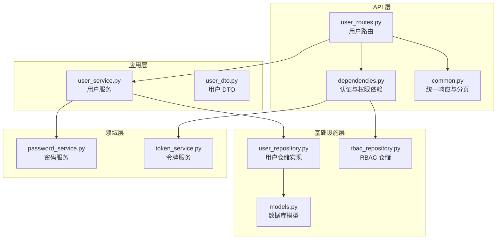
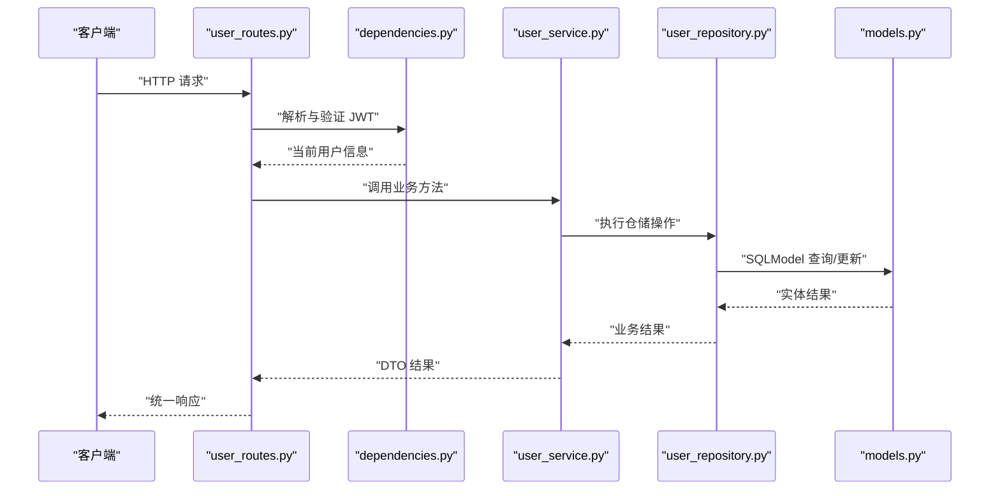
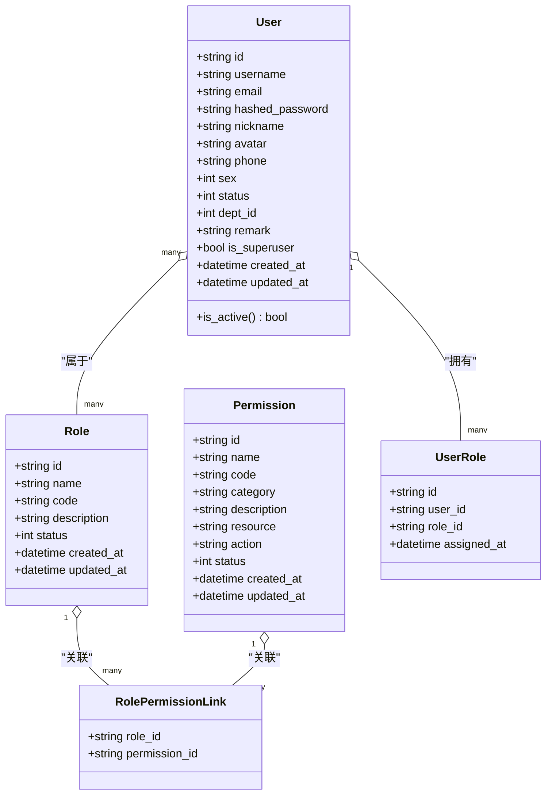
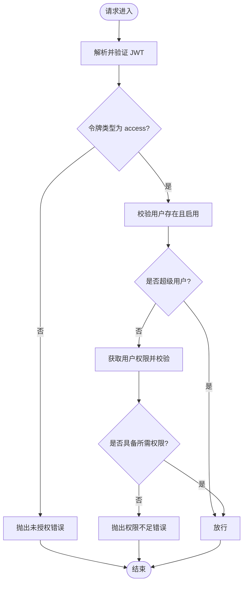
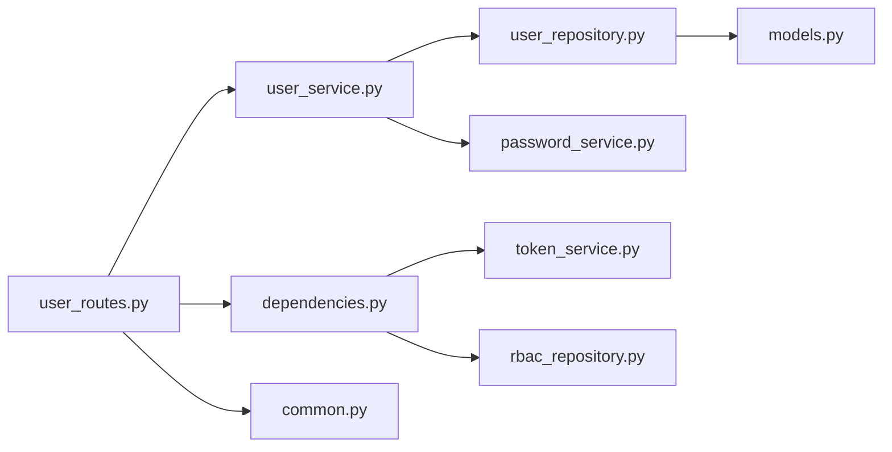

# 用户管理接口

<cite>
**本文引用的文件**
- [user_routes.py](file://service/src/api/v1/user_routes.py)
- [user_dto.py](file://service/src/application/dto/user_dto.py)
- [user_service.py](file://service/src/application/services/user_service.py)
- [user_repository.py](file://service/src/infrastructure/repositories/user_repository.py)
- [dependencies.py](file://service/src/api/dependencies.py)
- [models.py](file://service/src/infrastructure/database/models.py)
- [common.py](file://service/src/api/common.py)
- [password_service.py](file://service/src/domain/auth/password_service.py)
- [rbac_repository.py](file://service/src/infrastructure/repositories/rbac_repository.py)
- [token_service.py](file://service/src/domain/auth/token_service.py)
- [README.md](file://service/README.md)
</cite>

## 更新摘要
**变更内容**
- 新增角色分配功能，支持为用户批量分配角色
- 增强批量操作支持，包括批量删除和角色分配
- 完善密码重置功能，支持管理员重置用户密码
- 优化用户响应模型，包含角色和权限信息
- 改进权限验证机制，支持角色权限继承

## 目录
1. [简介](#简介)
2. [项目结构](#项目结构)
3. [核心组件](#核心组件)
4. [架构总览](#架构总览)
5. [详细组件分析](#详细组件分析)
6. [依赖关系分析](#依赖关系分析)
7. [性能考虑](#性能考虑)
8. [故障排除指南](#故障排除指南)
9. [结论](#结论)

## 简介
本文件为用户管理接口的全面 API 文档，覆盖用户 CRUD 操作、列表查询、批量操作、状态管理与密码管理等能力。文档详细说明每个接口的请求参数、查询条件、排序与分页选项、数据模型定义与字段说明、权限验证机制与访问控制策略，并提供使用示例与注意事项，帮助开发者快速集成与维护。

**更新** 本次更新反映了用户管理API的重大增强：新增角色分配功能、批量操作支持、密码重置功能，以及完整的CRUD操作实现。

## 项目结构
用户管理接口位于服务端工程的 API 层，采用分层架构：
- API 层：定义路由与控制器，负责接收请求、校验权限并调用应用服务
- 应用层：封装业务逻辑，协调 DTO、服务与仓储
- 领域层：密码服务等业务工具类
- 基础设施层：数据库模型、仓储实现与依赖注入
- 公共组件：统一响应格式与通用依赖

**图表来源**
- [user_routes.py:1-301](file://service/src/api/v1/user_routes.py#L1-L301)
- [dependencies.py:1-72](file://service/src/api/dependencies.py#L1-L72)
- [common.py:1-88](file://service/src/api/common.py#L1-L88)
- [user_service.py:1-346](file://service/src/application/services/user_service.py#L1-L346)
- [user_dto.py:1-132](file://service/src/application/dto/user_dto.py#L1-L132)
- [user_repository.py:1-185](file://service/src/infrastructure/repositories/user_repository.py#L1-L185)
- [models.py:1-304](file://service/src/infrastructure/database/models.py#L1-L304)
- [rbac_repository.py:1-289](file://service/src/infrastructure/repositories/rbac_repository.py#L1-L289)
- [password_service.py:1-21](file://service/src/domain/auth/password_service.py#L1-L21)
- [token_service.py:1-45](file://service/src/domain/auth/token_service.py#L1-L45)

**章节来源**
- [README.md:27-93](file://service/README.md#L27-L93)

## 核心组件
- 用户路由模块：提供用户 CRUD、列表查询、批量删除、密码重置、状态更新、当前用户信息获取、角色分配等接口
- 用户服务：封装业务逻辑，包括唯一性校验、密码哈希、状态变更、批量删除统计、角色分配等
- 用户仓储：实现用户数据的查询、分页、计数、更新状态、重置密码、批量删除等
- DTO：定义请求与响应的数据结构，包含字段约束与别名映射，支持角色分配
- 权限依赖：基于 JWT 的用户身份解析与 RBAC 权限校验
- 统一响应：标准化返回格式与分页结构

**章节来源**
- [user_routes.py:25-301](file://service/src/api/v1/user_routes.py#L25-L301)
- [user_service.py:18-346](file://service/src/application/services/user_service.py#L18-L346)
- [user_dto.py:8-132](file://service/src/application/dto/user_dto.py#L8-L132)
- [user_repository.py:11-185](file://service/src/infrastructure/repositories/user_repository.py#L11-L185)
- [dependencies.py:16-72](file://service/src/api/dependencies.py#L16-L72)
- [common.py:29-88](file://service/src/api/common.py#L29-L88)

## 架构总览
用户管理接口遵循 FastAPI + DDD + RBAC 的架构模式，请求流如下：
- 客户端携带 Bearer Token 发起请求
- 依赖项解析并验证 JWT，获取当前用户
- 若涉及资源级权限，进一步校验用户是否具备所需权限编码
- 路由调用应用服务，应用服务协调仓储执行数据库操作
- 返回统一响应格式，包含状态码、消息与数据

**图表来源**
- [user_routes.py:25-301](file://service/src/api/v1/user_routes.py#L25-L301)
- [dependencies.py:16-72](file://service/src/api/dependencies.py#L16-L72)
- [user_service.py:25-346](file://service/src/application/services/user_service.py#L25-L346)
- [user_repository.py:17-185](file://service/src/infrastructure/repositories/user_repository.py#L17-L185)
- [models.py:31-65](file://service/src/infrastructure/database/models.py#L31-L65)

## 详细组件分析

### 用户数据模型与字段说明
用户实体包含基础字段、状态、部门关联与时间戳；同时通过关系映射角色与权限，用于响应时构建角色与权限列表。

**图表来源**
- [models.py:31-141](file://service/src/infrastructure/database/models.py#L31-L141)

**章节来源**
- [models.py:31-65](file://service/src/infrastructure/database/models.py#L31-L65)

### 用户列表查询接口
- 路径：POST /api/system/user
- 权限：需要 user:view
- 功能：支持按用户名、手机号、邮箱、状态、部门 ID 进行筛选，分页返回用户列表与总数
- 请求体：UserListQueryDTO
- 响应：统一响应，data 内含 total、pageNum、pageSize、totalPage、rows

请求参数与约束
- pageNum：默认 1，最小 1
- pageSize：默认 10，范围 [1, 100]
- username：模糊匹配
- phone：模糊匹配
- email：模糊匹配
- status：0-禁用，1-启用
- deptId：整数

分页与排序
- 分页：基于 pageNum 与 pageSize 计算 offset 与 limit
- 排序：当前实现未显式指定排序字段，默认按数据库默认顺序

**章节来源**
- [user_routes.py:28-76](file://service/src/api/v1/user_routes.py#L28-L76)
- [user_dto.py:88-105](file://service/src/application/dto/user_dto.py#L88-L105)
- [user_service.py:82-115](file://service/src/application/services/user_service.py#L82-L115)
- [user_repository.py:32-76](file://service/src/infrastructure/repositories/user_repository.py#L32-L76)
- [common.py:50-67](file://service/src/api/common.py#L50-L67)

### 用户创建接口
- 路径：POST /api/system/user/create
- 权限：需要 user:add
- 功能：创建新用户，自动对密码进行哈希
- 请求体：UserCreateDTO
- 响应：统一响应，data 为 UserResponseDTO

字段约束
- username：长度 [3, 50]
- password：长度 [8, 128]
- nickname、avatar、remark：可选
- email：唯一且可选
- phone：长度不超过 20
- sex：可选
- status：默认 1
- deptId：可选

唯一性校验
- 用户名与邮箱在创建前进行唯一性检查，冲突则抛出冲突异常

**章节来源**
- [user_routes.py:79-99](file://service/src/api/v1/user_routes.py#L79-L99)
- [user_dto.py:8-21](file://service/src/application/dto/user_dto.py#L8-L21)
- [user_service.py:27-59](file://service/src/application/services/user_service.py#L27-L59)
- [password_service.py:9-21](file://service/src/domain/auth/password_service.py#L9-L21)

### 用户详情获取接口
- 路径：GET /api/system/user/{user_id}
- 权限：需要 user:view
- 功能：根据用户 ID 获取用户详情
- 响应：统一响应，data 为 UserResponseDTO

**章节来源**
- [user_routes.py:121-140](file://service/src/api/v1/user_routes.py#L121-L140)
- [user_service.py:61-76](file://service/src/application/services/user_service.py#L61-L76)

### 当前用户信息接口
- 路径：GET /api/system/user/info
- 功能：获取当前登录用户信息（含角色与权限）
- 响应：统一响应，data 为 UserResponseDTO

**章节来源**
- [user_routes.py:102-118](file://service/src/api/v1/user_routes.py#L102-L118)
- [user_service.py:307-346](file://service/src/application/services/user_service.py#L307-L346)

### 用户更新接口
- 路径：PUT /api/system/user/{user_id}
- 权限：需要 user:edit
- 功能：更新用户信息，仅更新非空字段
- 请求体：UserUpdateDTO
- 响应：统一响应，data 为 UserResponseDTO

唯一性校验
- 更新邮箱时，若邮箱被其他用户占用则抛出冲突异常

**章节来源**
- [user_routes.py:143-164](file://service/src/api/v1/user_routes.py#L143-L164)
- [user_dto.py:40-67](file://service/src/application/dto/user_dto.py#L40-L67)
- [user_service.py:117-158](file://service/src/application/services/user_service.py#L117-L158)
- [user_repository.py:121-126](file://service/src/infrastructure/repositories/user_repository.py#L121-L126)

### 用户删除接口
- 路径：DELETE /api/system/user/{user_id}
- 权限：需要 user:delete
- 功能：删除用户
- 响应：统一响应

**章节来源**
- [user_routes.py:167-186](file://service/src/api/v1/user_routes.py#L167-L186)
- [user_service.py:160-174](file://service/src/application/services/user_service.py#L160-L174)
- [user_repository.py:128-136](file://service/src/infrastructure/repositories/user_repository.py#L128-L136)

### 批量删除接口
- 路径：POST /api/system/user/batch-delete
- 权限：需要 user:delete
- 功能：批量删除用户，返回删除统计
- 请求体：BatchDeleteDTO
- 响应：统一响应，data 为包含 deleted_count 与 total_requested 的字典

**章节来源**
- [user_routes.py:189-208](file://service/src/api/v1/user_routes.py#L189-L208)
- [user_dto.py:123-126](file://service/src/application/dto/user_dto.py#L123-L126)
- [user_service.py:176-189](file://service/src/application/services/user_service.py#L176-L189)
- [user_repository.py:137-150](file://service/src/infrastructure/repositories/user_repository.py#L137-L150)

### 密码管理接口
- 修改当前用户密码
  - 路径：POST /api/system/user/change-password
  - 功能：校验旧密码并更新为新密码
  - 请求体：ChangePasswordDTO
  - 响应：统一响应

- 管理员重置用户密码
  - 路径：PUT /api/system/user/{user_id}/reset-password
  - 权限：需要 user:edit
  - 功能：管理员重置指定用户的密码
  - 请求体：ResetPasswordDTO
  - 响应：统一响应

**章节来源**
- [user_routes.py:259-277](file://service/src/api/v1/user_routes.py#L259-L277)
- [user_routes.py:211-232](file://service/src/api/v1/user_routes.py#L211-L232)
- [user_dto.py:107-116](file://service/src/application/dto/user_dto.py#L107-L116)
- [user_service.py:229-253](file://service/src/application/services/user_service.py#L229-L253)
- [user_service.py:191-210](file://service/src/application/services/user_service.py#L191-L210)
- [password_service.py:9-21](file://service/src/domain/auth/password_service.py#L9-L21)

### 用户状态管理接口
- 路径：PUT /api/system/user/{user_id}/status
- 权限：需要 user:edit
- 功能：更新用户状态（0-禁用，1-启用）
- 请求体：UpdateStatusDTO
- 响应：统一响应

**章节来源**
- [user_routes.py:235-256](file://service/src/api/v1/user_routes.py#L235-L256)
- [user_dto.py:118-121](file://service/src/application/dto/user_dto.py#L118-L121)
- [user_service.py:212-227](file://service/src/application/services/user_service.py#L212-L227)
- [user_repository.py:152-168](file://service/src/infrastructure/repositories/user_repository.py#L152-L168)

### 角色分配接口
- 路径：POST /api/system/user/assign-role
- 权限：需要 user:edit
- 功能：为用户分配角色，支持批量分配
- 请求体：AssignRoleDTO
- 响应：统一响应

字段说明
- userId：目标用户ID
- roleIds：角色ID列表，支持多个角色分配

**更新** 新增角色分配功能，支持为用户批量分配角色，通过 RoleRepository 实现角色关联管理。

**章节来源**
- [user_routes.py:280-300](file://service/src/api/v1/user_routes.py#L280-L300)
- [user_dto.py:128-132](file://service/src/application/dto/user_dto.py#L128-L132)
- [user_service.py:285-305](file://service/src/application/services/user_service.py#L285-L305)
- [rbac_repository.py:135-155](file://service/src/infrastructure/repositories/rbac_repository.py#L135-L155)

### 权限验证与访问控制
- 认证方式：Bearer Token（JWT），通过 HTTP Bearer 传递
- 当前用户解析：从 JWT 中提取用户标识，验证令牌类型与有效性
- 活跃用户校验：确保用户存在且状态为启用
- 资源级权限校验：通过 RBAC 仓储获取用户权限集合，校验是否包含所需权限编码
- 超级用户：超级用户可绕过权限校验

**图表来源**
- [dependencies.py:16-72](file://service/src/api/dependencies.py#L16-L72)
- [rbac_repository.py:203-212](file://service/src/infrastructure/repositories/rbac_repository.py#L203-L212)
- [token_service.py:33-44](file://service/src/domain/auth/token_service.py#L33-L44)

**章节来源**
- [dependencies.py:16-72](file://service/src/api/dependencies.py#L16-L72)
- [rbac_repository.py:203-212](file://service/src/infrastructure/repositories/rbac_repository.py#L203-L212)
- [token_service.py:14-44](file://service/src/domain/auth/token_service.py#L14-L44)

### 统一响应与分页
- 统一响应格式：包含 code、message、data
- 分页响应：包含 total、pageNum、pageSize、totalPage、rows
- 列表查询接口返回分页响应

**章节来源**
- [common.py:29-88](file://service/src/api/common.py#L29-L88)
- [user_routes.py:71-76](file://service/src/api/v1/user_routes.py#L71-L76)

### 用户响应模型增强
用户响应模型现已包含角色和权限信息，支持前端展示用户完整的权限集。

- roles：用户所属角色列表，包含角色ID和名称
- permissions：用户拥有的权限编码列表
- 其他字段保持不变

**更新** 用户响应模型已增强，现在包含角色和权限信息，支持前端权限展示和权限验证。

**章节来源**
- [user_dto.py:70-85](file://service/src/application/dto/user_dto.py#L70-L85)
- [user_service.py:307-346](file://service/src/application/services/user_service.py#L307-L346)

## 依赖关系分析
- 路由依赖应用服务：路由层仅负责参数解析与权限校验，业务逻辑集中在应用服务
- 应用服务依赖仓储与领域服务：应用服务协调仓储执行数据操作，并调用密码服务进行哈希与校验
- 仓储依赖数据库模型：仓储实现基于 SQLModel 对数据库进行查询与更新
- 权限依赖依赖令牌服务与 RBAC 仓储：权限校验依赖 JWT 解析与用户权限集合

**图表来源**
- [user_routes.py:1-301](file://service/src/api/v1/user_routes.py#L1-L301)
- [user_service.py:1-346](file://service/src/application/services/user_service.py#L1-L346)
- [user_repository.py:1-185](file://service/src/infrastructure/repositories/user_repository.py#L1-L185)
- [models.py:1-304](file://service/src/infrastructure/database/models.py#L1-L304)
- [dependencies.py:1-72](file://service/src/api/dependencies.py#L1-L72)
- [rbac_repository.py:1-289](file://service/src/infrastructure/repositories/rbac_repository.py#L1-L289)
- [token_service.py:1-45](file://service/src/domain/auth/token_service.py#L1-L45)
- [common.py:1-88](file://service/src/api/common.py#L1-L88)

## 性能考虑
- 分页限制：列表查询的 pageSize 最大为 100，避免一次性返回过多数据
- 唯一性检查：创建与更新均进行唯一性校验，建议在数据库层面建立唯一索引以提升性能
- 查询过滤：支持模糊匹配与精确匹配，建议对高频查询字段建立索引
- 批量删除：逐条删除并在循环中执行 flush，建议在高并发场景下评估事务开销
- 密码哈希：使用 bcrypt，计算成本较高，建议在批量导入场景中进行异步处理
- 角色分配：批量角色分配会先清除旧关联再创建新关联，注意在大量角色分配时的性能影响

**更新** 新增角色分配的性能考虑，批量角色分配涉及多对多关联表的操作，需要注意性能影响。

## 故障排除指南
常见错误与处理
- 未授权/令牌无效：检查 Bearer Token 是否正确传递、是否过期、令牌类型是否为 access
- 权限不足：确认当前用户是否具备所需的权限编码（如 user:add、user:edit、user:delete、user:view）
- 用户不存在：确认用户 ID 是否正确，或用户是否已被删除
- 唯一性冲突：用户名或邮箱已存在，需更换唯一字段
- 旧密码不正确：修改密码时旧密码校验失败，需重新输入正确旧密码
- 角色分配失败：检查角色ID是否存在，确保用户ID有效

**更新** 新增角色分配相关的故障排除指导。

**章节来源**
- [dependencies.py:16-72](file://service/src/api/dependencies.py#L16-L72)
- [user_service.py:37-41](file://service/src/application/services/user_service.py#L37-L41)
- [user_service.py:129-137](file://service/src/application/services/user_service.py#L129-L137)
- [user_service.py:242-247](file://service/src/application/services/user_service.py#L242-L247)
- [user_service.py:298-300](file://service/src/application/services/user_service.py#L298-L300)

## 结论
用户管理接口提供了完善的 CRUD、列表查询、批量操作、状态管理与密码管理能力，配合 RBAC 权限体系与 JWT 认证，确保了系统的安全性与可维护性。通过统一响应与分页机制，接口具备良好的用户体验与扩展性。

**更新** 本次重大增强包括角色分配功能、批量操作支持、密码重置功能，以及完整的CRUD操作实现。新增的功能增强了系统的灵活性和可管理性，支持更复杂的用户权限管理场景。建议在生产环境中结合数据库索引优化、事务控制与缓存策略，进一步提升性能与稳定性。