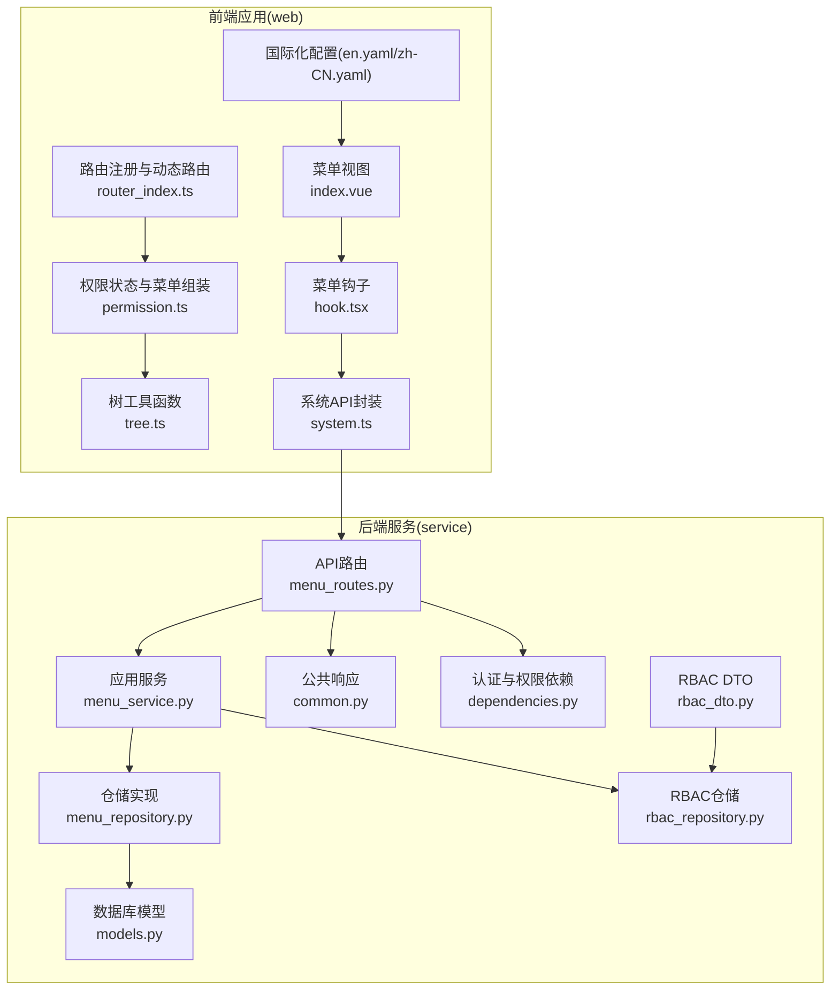
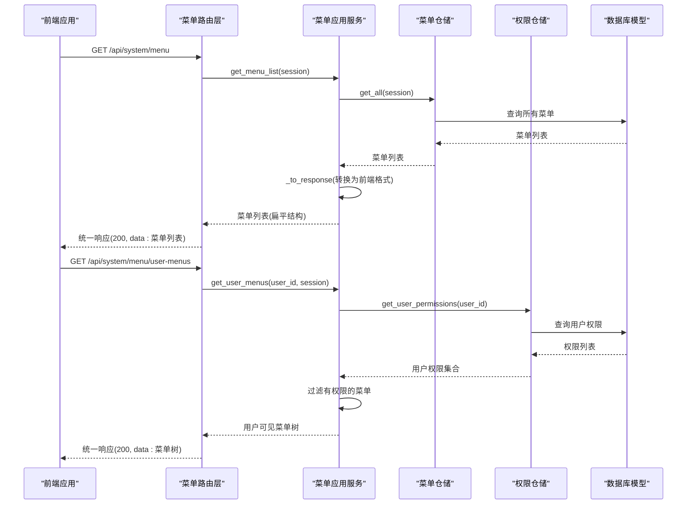
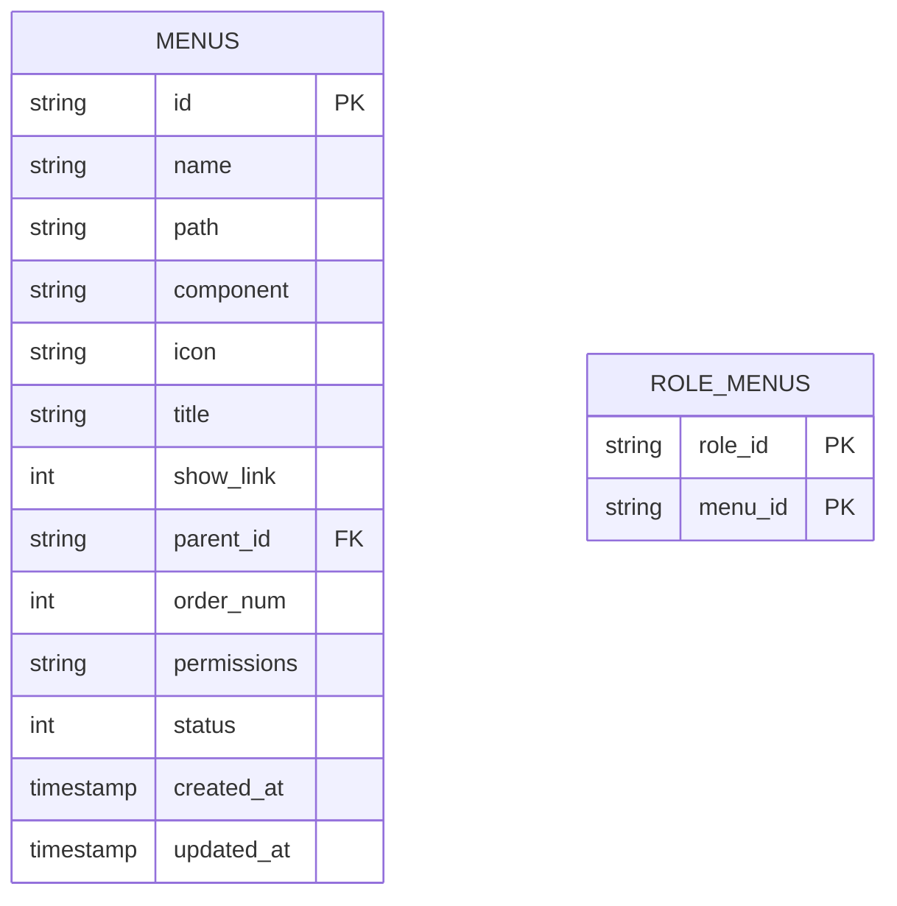
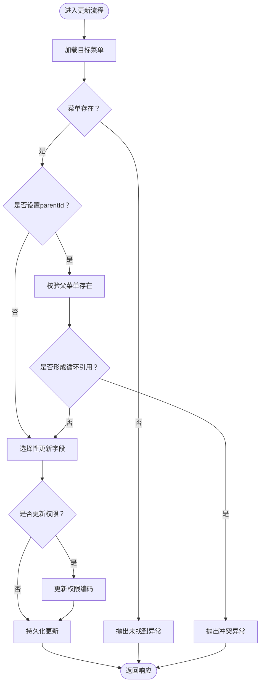
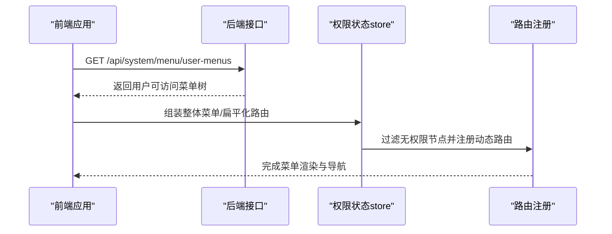
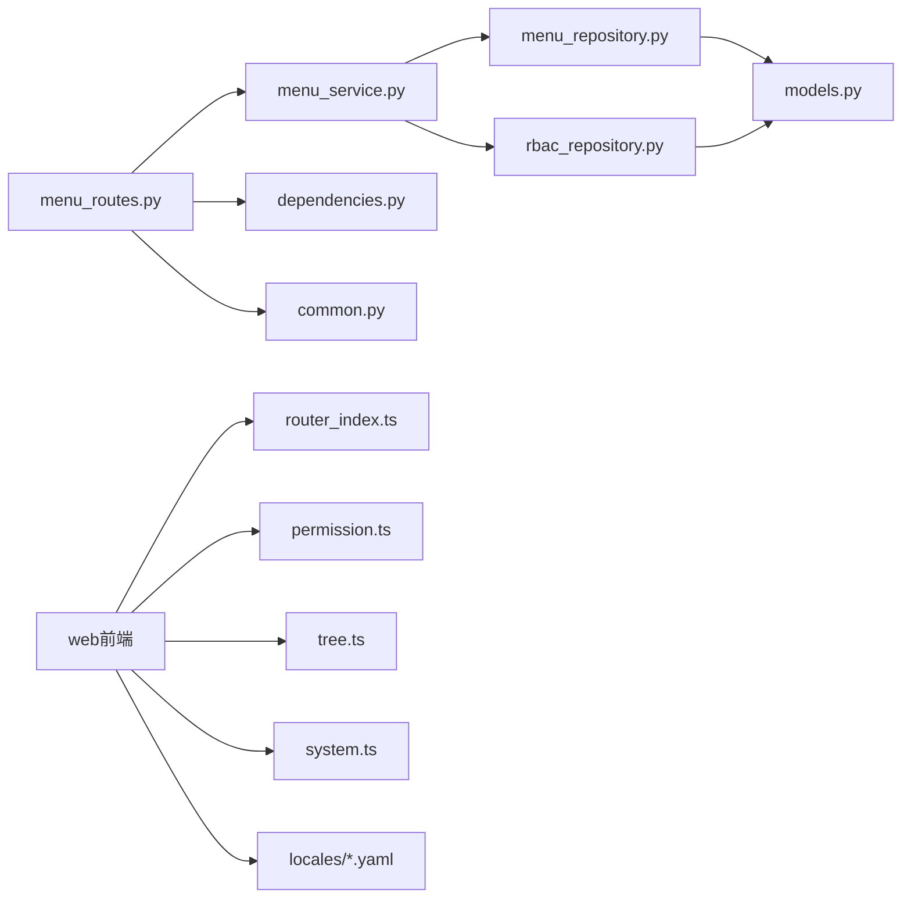

# 菜单管理接口

<cite>
**本文引用的文件**
- [menu_routes.py](file://service/src/api/v1/menu_routes.py)
- [menu_dto.py](file://service/src/application/dto/menu_dto.py)
- [menu_service.py](file://service/src/application/services/menu_service.py)
- [menu_repository.py](file://service/src/infrastructure/repositories/menu_repository.py)
- [models.py](file://service/src/infrastructure/database/models.py)
- [rbac_dto.py](file://service/src/application/dto/rbac_dto.py)
- [rbac_repository.py](file://service/src/infrastructure/repositories/rbac_repository.py)
- [repository.py](file://service/src/domain/rbac/repository.py)
- [common.py](file://service/src/api/common.py)
- [dependencies.py](file://service/src/api/dependencies.py)
- [routes.ts](file://web/src/api/routes.ts)
- [system.ts](file://web/src/api/system.ts)
- [permission.ts](file://web/src/store/modules/permission.ts)
- [tree.ts](file://web/src/utils/tree.ts)
- [index.vue](file://web/src/views/system/menu/index.vue)
- [hook.tsx](file://web/src/views/system/menu/utils/hook.tsx)
- [router_index.ts](file://web/src/router/index.ts)
- [en.yaml](file://web/locales/en.yaml)
- [zh-CN.yaml](file://web/locales/zh-CN.yaml)
</cite>

## 更新摘要
**所做更改**
- 新增菜单权限分配功能，支持基于权限编码的细粒度访问控制
- 完善动态菜单生成机制，优化前后端数据格式适配
- 增强菜单结构管理，支持更灵活的菜单类型和属性配置
- 扩展RBAC权限体系，提供角色-菜单关联管理能力
- 改进前端菜单管理界面，支持更丰富的菜单属性编辑

## 目录
1. [简介](#简介)
2. [项目结构](#项目结构)
3. [核心组件](#核心组件)
4. [架构总览](#架构总览)
5. [详细组件分析](#详细组件分析)
6. [依赖分析](#依赖分析)
7. [性能考虑](#性能考虑)
8. [故障排查指南](#故障排查指南)
9. [结论](#结论)
10. [附录](#附录)

## 简介
本文件为菜单管理接口的完整API文档，覆盖菜单的CRUD操作、树形结构与父子关系处理、动态菜单生成与前端集成、权限控制与访问校验、缓存策略与性能优化、树形查询与过滤、以及国际化支持与多语言配置。文档面向后端开发者与前端开发者，帮助快速理解与集成菜单管理能力。

**更新** 本次更新重点增强了菜单权限分配功能，完善了动态菜单生成机制，并提供了更灵活的菜单结构管理能力。

## 项目结构
后端采用FastAPI + SQLModel架构，菜单功能位于service工程；前端采用Vue3 + TypeScript + Element Plus，菜单管理位于web工程。后端提供REST接口，前端通过HTTP请求获取菜单树与动态路由，结合权限状态渲染UI。

**图表来源**
- [menu_routes.py:1-122](file://service/src/api/v1/menu_routes.py#L1-L122)
- [menu_service.py:1-169](file://service/src/application/services/menu_service.py#L1-L169)
- [menu_repository.py:1-50](file://service/src/infrastructure/repositories/menu_repository.py#L1-L50)
- [models.py:146-171](file://service/src/infrastructure/database/models.py#L146-L171)
- [rbac_dto.py:1-121](file://service/src/application/dto/rbac_dto.py#L1-L121)
- [rbac_repository.py:1-289](file://service/src/infrastructure/repositories/rbac_repository.py#L1-L289)
- [common.py:1-65](file://service/src/api/common.py#L1-L65)
- [dependencies.py:1-72](file://service/src/api/dependencies.py#L1-L72)
- [index.vue:1-164](file://web/src/views/system/menu/index.vue#L1-L164)
- [hook.tsx:1-279](file://web/src/views/system/menu/utils/hook.tsx#L1-L279)
- [router_index.ts:1-230](file://web/src/router/index.ts#L1-L230)
- [permission.ts:1-76](file://web/src/store/modules/permission.ts#L1-L76)
- [tree.ts:1-189](file://web/src/utils/tree.ts#L1-L189)
- [system.ts:1-237](file://web/src/api/system.ts#L1-L237)
- [en.yaml:1-265](file://web/locales/en.yaml#L1-L265)
- [zh-CN.yaml:1-265](file://web/locales/zh-CN.yaml#L1-L265)

**章节来源**
- [menu_routes.py:1-122](file://service/src/api/v1/menu_routes.py#L1-L122)
- [menu_service.py:1-169](file://service/src/application/services/menu_service.py#L1-L169)
- [menu_repository.py:1-50](file://service/src/infrastructure/repositories/menu_repository.py#L1-L50)
- [models.py:146-171](file://service/src/infrastructure/database/models.py#L146-L171)
- [rbac_dto.py:1-121](file://service/src/application/dto/rbac_dto.py#L1-L121)
- [rbac_repository.py:1-289](file://service/src/infrastructure/repositories/rbac_repository.py#L1-L289)
- [common.py:1-65](file://service/src/api/common.py#L1-L65)
- [dependencies.py:1-72](file://service/src/api/dependencies.py#L1-L72)
- [index.vue:1-164](file://web/src/views/system/menu/index.vue#L1-L164)
- [hook.tsx:1-279](file://web/src/views/system/menu/utils/hook.tsx#L1-L279)
- [router_index.ts:1-230](file://web/src/router/index.ts#L1-L230)
- [permission.ts:1-76](file://web/src/store/modules/permission.ts#L1-L76)
- [tree.ts:1-189](file://web/src/utils/tree.ts#L1-L189)
- [system.ts:1-237](file://web/src/api/system.ts#L1-L237)
- [en.yaml:1-265](file://web/locales/en.yaml#L1-L265)
- [zh-CN.yaml:1-265](file://web/locales/zh-CN.yaml#L1-L265)

## 核心组件
- 菜单路由层：提供菜单树、用户可见菜单、创建、更新、删除等接口。
- 应用服务层：实现菜单树构建、用户菜单过滤、父子关系校验、权限过滤等业务逻辑。
- 仓储层：基于SQLModel实现菜单的增删改查与父子查询。
- 数据模型：定义菜单实体及其字段约束，支持权限编码关联。
- RBAC权限体系：提供角色-菜单关联管理，支持细粒度权限控制。
- 响应与依赖：统一响应格式、JWT解析与权限校验依赖。
- 前端集成：动态路由请求、菜单树工具、权限状态与国际化。

**章节来源**
- [menu_routes.py:1-122](file://service/src/api/v1/menu_routes.py#L1-L122)
- [menu_service.py:1-169](file://service/src/application/services/menu_service.py#L1-L169)
- [menu_repository.py:1-50](file://service/src/infrastructure/repositories/menu_repository.py#L1-L50)
- [models.py:146-171](file://service/src/infrastructure/database/models.py#L146-L171)
- [rbac_dto.py:1-121](file://service/src/application/dto/rbac_dto.py#L1-L121)
- [rbac_repository.py:1-289](file://service/src/infrastructure/repositories/rbac_repository.py#L1-L289)
- [common.py:1-65](file://service/src/api/common.py#L1-L65)
- [dependencies.py:1-72](file://service/src/api/dependencies.py#L1-L72)
- [index.vue:1-164](file://web/src/views/system/menu/index.vue#L1-L164)
- [hook.tsx:1-279](file://web/src/views/system/menu/utils/hook.tsx#L1-L279)
- [router_index.ts:1-230](file://web/src/router/index.ts#L1-L230)
- [permission.ts:1-76](file://web/src/store/modules/permission.ts#L1-L76)
- [tree.ts:1-189](file://web/src/utils/tree.ts#L1-L189)
- [system.ts:1-237](file://web/src/api/system.ts#L1-L237)
- [en.yaml:1-265](file://web/locales/en.yaml#L1-L265)
- [zh-CN.yaml:1-265](file://web/locales/zh-CN.yaml#L1-L265)

## 架构总览
后端以路由层接收请求，经依赖注入进行鉴权与权限校验，调用应用服务执行业务逻辑，服务层通过仓储访问数据库模型，最终返回统一响应格式。前端通过HTTP请求获取菜单树与动态路由，结合权限状态与树工具函数渲染UI，并支持国际化。

**图表来源**
- [menu_routes.py:21-84](file://service/src/api/v1/menu_routes.py#L21-L84)
- [menu_service.py:22-51](file://service/src/application/services/menu_service.py#L22-L51)
- [menu_repository.py:13-16](file://service/src/infrastructure/repositories/menu_repository.py#L13-L16)
- [rbac_repository.py:279-288](file://service/src/infrastructure/repositories/rbac_repository.py#L279-L288)
- [models.py:146-171](file://service/src/infrastructure/database/models.py#L146-L171)
- [common.py:29-47](file://service/src/api/common.py#L29-L47)

## 详细组件分析

### 菜单数据模型与父子关系
- 菜单实体包含名称、路径、组件、图标、标题、是否显示、父ID、排序号、权限编码、状态、创建/更新时间等字段。
- 父子关系通过parent_id建立自引用，支持递归构建树形结构。
- 权限字段permissions存储逗号分隔的权限编码字符串，用于用户菜单过滤。

**图表来源**
- [models.py:146-171](file://service/src/infrastructure/database/models.py#L146-L171)
- [models.py:297-304](file://service/src/infrastructure/database/models.py#L297-L304)

**章节来源**
- [models.py:146-171](file://service/src/infrastructure/database/models.py#L146-L171)
- [models.py:297-304](file://service/src/infrastructure/database/models.py#L297-L304)

### DTO定义与字段约束
- 创建DTO：parentId、menuType、title、name、path、component、rank、redirect、icon、extraIcon、enterTransition、leaveTransition、activePath、auths、frameSrc、frameLoading、keepAlive、hiddenTag、fixedTag、showLink、showParent等字段，含长度与类型约束。
- 更新DTO：同上字段允许部分更新，非None字段才会被更新。
- 响应DTO：包含children字段，支持树形序列化。

**更新** 新增menuType字段支持多种菜单类型，auths字段用于权限标识管理。

**章节来源**
- [menu_dto.py:8-109](file://service/src/application/dto/menu_dto.py#L8-L109)

### 菜单路由与接口规范
- 获取菜单列表（扁平结构）：POST /api/system/menu（需权限：menu:view）
- 获取完整菜单树：GET /api/system/menu/tree（需权限：menu:view）
- 获取当前用户可访问的菜单：GET /api/system/menu/user-menus（需登录）
- 创建菜单：POST /api/system/menu/create（需权限：menu:add）
- 更新菜单：PUT /api/system/menu/{menu_id}（需权限：menu:edit）
- 删除菜单：DELETE /api/system/menu/{menu_id}（需权限：menu:delete）

**更新** 路由前缀从/api/v1/menus调整为/api/system/menu，接口命名更加规范化。

**章节来源**
- [menu_routes.py:21-122](file://service/src/api/v1/menu_routes.py#L21-L122)

### 应用服务与业务逻辑
- 菜单树构建：按parentId递归构建children。
- 用户菜单过滤：超级用户返回全部；普通用户根据权限集合过滤。
- 创建校验：若指定parentId，需确保父菜单存在；默认启用状态。
- 更新校验：禁止将菜单设为自己的子菜单；禁止形成循环引用；仅更新非None字段。
- 删除校验：若存在子菜单则拒绝删除。

**图表来源**
- [menu_service.py:76-129](file://service/src/application/services/menu_service.py#L76-L129)

**章节来源**
- [menu_service.py:22-169](file://service/src/application/services/menu_service.py#L22-L169)

### 仓储与数据库交互
- 提供获取全部、按ID获取、创建、更新、删除、按父ID查询子菜单等方法。
- 查询按排序号排序，保证树形顺序稳定。

**更新** 新增对Menu实体的完整CRUD支持，包括权限字段的处理。

**章节来源**
- [menu_repository.py:13-49](file://service/src/infrastructure/repositories/menu_repository.py#L13-L49)

### RBAC权限分配功能
- 角色-菜单关联：支持为角色分配多个菜单权限，提供批量分配和清理功能。
- 用户权限继承：通过角色间接获得菜单访问权限。
- 权限过滤：用户访问菜单时根据权限集合进行过滤。

**新增** 完整的RBAC权限分配体系，支持角色-菜单关联管理和权限继承。

**章节来源**
- [rbac_dto.py:118-121](file://service/src/application/dto/rbac_dto.py#L118-L121)
- [rbac_repository.py:159-210](file://service/src/infrastructure/repositories/rbac_repository.py#L159-L210)
- [repository.py:8-77](file://service/src/domain/rbac/repository.py#L8-L77)

### 统一响应与错误处理
- 统一响应格式包含code、message、data。
- 错误响应与分页响应工具函数。

**章节来源**
- [common.py:29-65](file://service/src/api/common.py#L29-L65)

### 权限控制与访问验证
- 依赖项从JWT中解析用户ID并校验令牌有效性与类型。
- require_permission(code)用于校验用户是否具备特定权限编码。
- 超级用户绕过权限校验。

**章节来源**
- [dependencies.py:16-72](file://service/src/api/dependencies.py#L16-L72)

### 动态菜单生成与前端集成
- 前端通过http请求获取动态路由数据。
- 路由注册时使用树工具函数构建层级关系，组装整体菜单。
- 权限状态store负责过滤无权限的菜单节点，扁平化路由以便标签页管理。

**更新** 前端菜单管理界面支持更多菜单属性编辑，包括权限标识、菜单类型等。

**图表来源**
- [menu_routes.py:77-84](file://service/src/api/v1/menu_routes.py#L77-L84)
- [permission.ts:26-34](file://web/src/store/modules/permission.ts#L26-L34)
- [router_index.ts:68-70](file://web/src/router/index.ts#L68-L70)
- [routes.ts:9-11](file://web/src/api/routes.ts#L9-L11)

**章节来源**
- [routes.ts:1-12](file://web/src/api/routes.ts#L1-L12)
- [permission.ts:1-76](file://web/src/store/modules/permission.ts#L1-L76)
- [router_index.ts:1-230](file://web/src/router/index.ts#L1-L230)
- [hook.tsx:1-279](file://web/src/views/system/menu/utils/hook.tsx#L1-L279)

### 树形结构查询与过滤
- 后端：_build_tree按parentId递归构建树。
- 前端：handleTree、buildHierarchyTree、deleteChildren等工具函数支持树转换与层级关系构造。

**章节来源**
- [menu_service.py:141-149](file://service/src/application/services/menu_service.py#L141-L149)
- [tree.ts:137-188](file://web/src/utils/tree.ts#L137-L188)

### 国际化支持与多语言配置
- 前端国际化配置包含菜单标题、按钮文案等键值。
- 通过transformI18n在路由与组件中使用多语言文本。

**章节来源**
- [en.yaml:70-197](file://web/locales/en.yaml#L70-L197)
- [zh-CN.yaml:70-197](file://web/locales/zh-CN.yaml#L70-L197)
- [router_index.ts:14-5](file://web/src/router/index.ts#L14-L5)

## 依赖分析
- 路由依赖应用服务，应用服务依赖仓储与权限仓储。
- 仓储依赖数据库模型。
- 前端依赖路由注册、权限状态store与树工具函数。
- 前端国际化依赖本地化配置文件。

**图表来源**
- [menu_routes.py:1-122](file://service/src/api/v1/menu_routes.py#L1-L122)
- [menu_service.py:1-169](file://service/src/application/services/menu_service.py#L1-L169)
- [menu_repository.py:1-50](file://service/src/infrastructure/repositories/menu_repository.py#L1-L50)
- [rbac_repository.py:1-289](file://service/src/infrastructure/repositories/rbac_repository.py#L1-L289)
- [models.py:146-171](file://service/src/infrastructure/database/models.py#L146-L171)
- [dependencies.py:1-72](file://service/src/api/dependencies.py#L1-L72)
- [common.py:1-65](file://service/src/api/common.py#L1-L65)
- [router_index.ts:1-230](file://web/src/router/index.ts#L1-L230)
- [permission.ts:1-76](file://web/src/store/modules/permission.ts#L1-L76)
- [tree.ts:1-189](file://web/src/utils/tree.ts#L1-L189)
- [system.ts:1-237](file://web/src/api/system.ts#L1-L237)
- [en.yaml:1-265](file://web/locales/en.yaml#L1-L265)
- [zh-CN.yaml:1-265](file://web/locales/zh-CN.yaml#L1-L265)

## 性能考虑
- 数据库查询：按order_num排序，减少前端排序成本；按parentId查询子菜单时建议在数据库层面建立索引。
- 业务层：树构建为O(n)递归，建议限制菜单层级深度与总数；对用户菜单过滤可缓存用户权限集合。
- 前端：动态路由注册时避免重复构建树；权限过滤与扁平化路由可在store中缓存结果。
- 缓存策略：可对菜单树与用户可见菜单设置短期缓存（如Redis），结合版本号或变更事件失效。

**更新** 建议缓存用户权限集合和菜单树结构，减少重复计算和数据库查询。

## 故障排查指南
- 401/403：检查JWT令牌是否有效、类型是否正确、用户是否激活；确认require_permission校验是否通过。
- 404：菜单不存在或父菜单不存在；检查ID合法性与数据库一致性。
- 409：循环引用（将菜单设为自己的子菜单或其子菜单的子菜单）；检查parentId与父子关系。
- 409：删除失败（存在子菜单）；先删除子菜单再删除父菜单。
- 前端菜单为空：确认用户权限是否包含菜单权限编码；检查权限过滤逻辑与动态路由注册流程。

**更新** 新增权限相关故障排查指导，包括权限编码格式和角色权限继承问题。

**章节来源**
- [dependencies.py:16-72](file://service/src/api/dependencies.py#L16-L72)
- [menu_service.py:53-129](file://service/src/application/services/menu_service.py#L53-L129)
- [permission.ts:26-34](file://web/src/store/modules/permission.ts#L26-L34)

## 结论
本菜单管理接口以清晰的分层架构实现菜单CRUD、树形结构与权限过滤，并提供动态菜单生成与前端集成方案。通过统一响应、权限依赖与国际化配置，满足企业级后台系统的菜单管理需求。新增的RBAC权限分配功能进一步增强了系统的安全性和灵活性。建议在生产环境中配合缓存与索引策略进一步提升性能与稳定性。

**更新** 新功能增强了系统的权限控制能力和菜单管理灵活性，为复杂的企业级应用提供了更好的支持。

## 附录

### API接口一览
- POST /api/system/menu
  - 权限：menu:view
  - 描述：获取菜单列表（扁平结构）
  - 响应：统一响应，data为扁平菜单列表
- GET /api/system/menu/tree
  - 权限：menu:view
  - 描述：获取完整菜单树
  - 响应：统一响应，data为树形菜单
- GET /api/system/menu/user-menus
  - 权限：登录用户
  - 描述：获取当前用户可访问的菜单
  - 响应：统一响应，data为用户可见菜单树
- POST /api/system/menu/create
  - 权限：menu:add
  - 描述：创建菜单
  - 请求体：MenuCreateDTO
  - 响应：统一响应，data为新建菜单
- PUT /api/system/menu/{menu_id}
  - 权限：menu:edit
  - 描述：更新菜单
  - 请求体：MenuUpdateDTO
  - 响应：统一响应，data为更新后的菜单
- DELETE /api/system/menu/{menu_id}
  - 权限：menu:delete
  - 描述：删除菜单
  - 响应：统一响应，message为操作结果

**更新** 接口路径调整为/api/system/menu前缀，提供更规范的RESTful风格。

**章节来源**
- [menu_routes.py:21-122](file://service/src/api/v1/menu_routes.py#L21-L122)
- [menu_dto.py:8-109](file://service/src/application/dto/menu_dto.py#L8-L109)
- [common.py:29-47](file://service/src/api/common.py#L29-L47)

### 菜单权限分配接口
- POST /api/system/role/{role_id}/menu
  - 权限：role:manage
  - 描述：为角色分配菜单权限
  - 请求体：AssignPermissionsDTO
  - 响应：统一响应，message为操作结果
- POST /api/system/role-menu
  - 权限：role:manage
  - 描述：获取角色菜单权限
  - 响应：统一响应，data为角色菜单列表
- POST /api/system/role-menu-ids
  - 权限：role:manage
  - 描述：获取角色菜单ID列表
  - 响应：统一响应，data为菜单ID数组

**新增** 角色-菜单权限关联管理接口，支持批量权限分配和查询。

**章节来源**
- [rbac_dto.py:118-121](file://service/src/application/dto/rbac_dto.py#L118-L121)
- [rbac_repository.py:159-210](file://service/src/infrastructure/repositories/rbac_repository.py#L159-L210)
- [system.ts:152-155](file://web/src/api/system.ts#L152-L155)