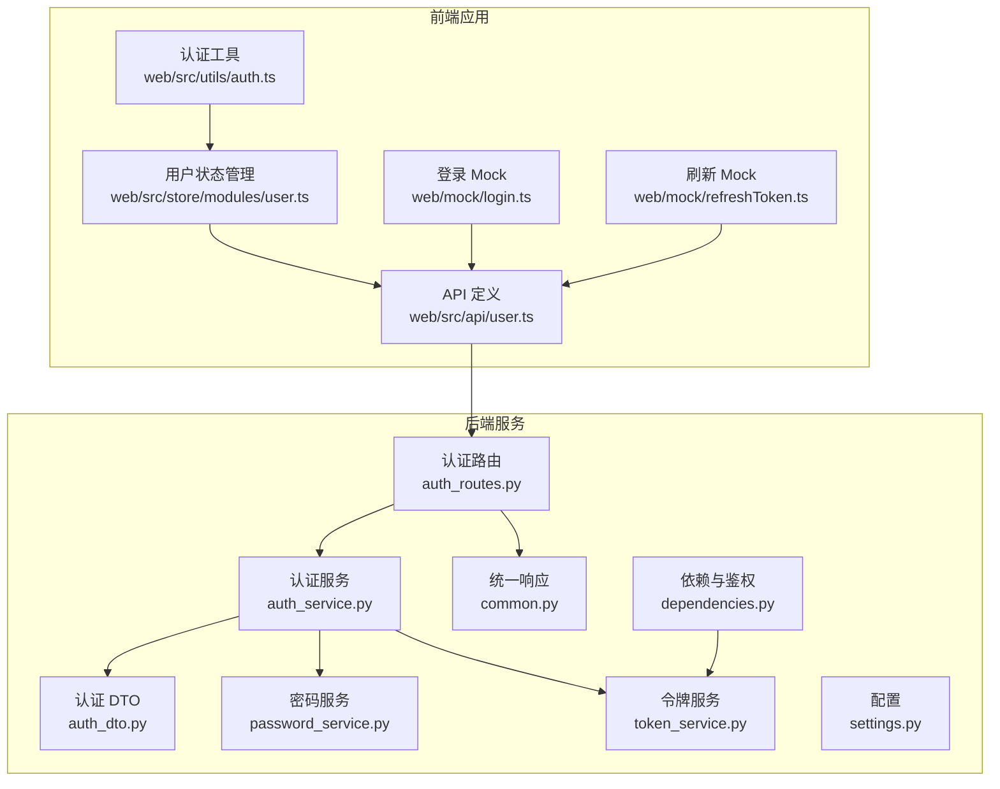
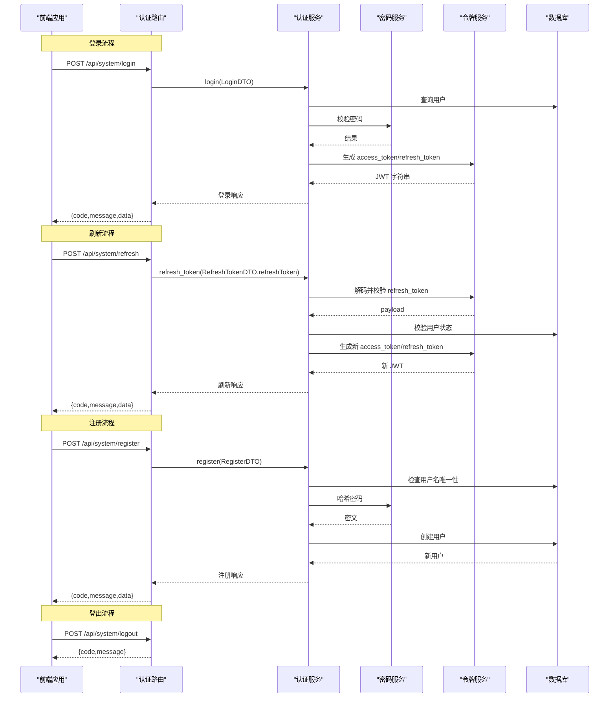
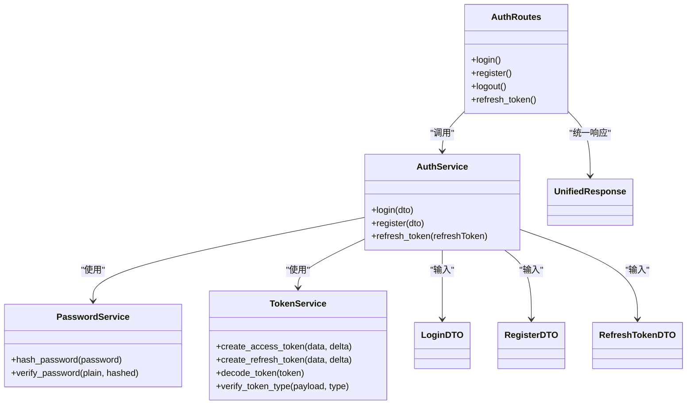

# 认证接口

<cite>
**本文引用的文件**
- [service/src/api/v1/auth_routes.py](file://service/src/api/v1/auth_routes.py)
- [service/src/application/dto/auth_dto.py](file://service/src/application/dto/auth_dto.py)
- [service/src/application/services/auth_service.py](file://service/src/application/services/auth_service.py)
- [service/src/domain/auth/password_service.py](file://service/src/domain/auth/password_service.py)
- [service/src/domain/auth/token_service.py](file://service/src/domain/auth/token_service.py)
- [service/src/api/common.py](file://service/src/api/common.py)
- [service/src/api/dependencies.py](file://service/src/api/dependencies.py)
- [service/src/config/settings.py](file://service/src/config/settings.py)
- [service/src/core/exceptions.py](file://service/src/core/exceptions.py)
- [web/src/api/user.ts](file://web/src/api/user.ts)
- [web/src/store/modules/user.ts](file://web/src/store/modules/user.ts)
- [web/src/utils/auth.ts](file://web/src/utils/auth.ts)
- [web/mock/login.ts](file://web/mock/login.ts)
- [web/mock/refreshToken.ts](file://web/mock/refreshToken.ts)
- [service/tests/integration/test_api.py](file://service/tests/integration/test_api.py)
- [service/tests/unit/test_auth.py](file://service/tests/unit/test_auth.py)
</cite>

## 目录
1. [简介](#简介)
2. [项目结构](#项目结构)
3. [核心组件](#核心组件)
4. [架构总览](#架构总览)
5. [详细组件分析](#详细组件分析)
6. [依赖分析](#依赖分析)
7. [性能考量](#性能考量)
8. [故障排查指南](#故障排查指南)
9. [结论](#结论)
10. [附录](#附录)

## 简介
本文件为认证接口的权威技术文档，覆盖登录、注册、登出与令牌刷新四个核心接口。内容包括：
- 接口规范：HTTP 方法、URL 路径、请求参数、响应结构与状态码
- JWT 机制：生成、验证与刷新流程
- 请求/响应示例：成功登录、密码错误、账户不存在等典型场景
- 安全考虑与最佳实践
- 前端集成要点与常见问题解决方案

## 项目结构
认证能力由后端服务与前端应用共同实现：
- 后端（FastAPI）：提供认证路由、应用服务、领域服务与统一响应封装
- 前端（Vue）：负责令牌存储、携带与刷新，调用后端接口

图表来源
- [service/src/api/v1/auth_routes.py:1-86](file://service/src/api/v1/auth_routes.py#L1-L86)
- [service/src/application/services/auth_service.py:1-154](file://service/src/application/services/auth_service.py#L1-L154)
- [service/src/application/dto/auth_dto.py:1-54](file://service/src/application/dto/auth_dto.py#L1-L54)
- [service/src/domain/auth/password_service.py:1-21](file://service/src/domain/auth/password_service.py#L1-L21)
- [service/src/domain/auth/token_service.py:1-45](file://service/src/domain/auth/token_service.py#L1-L45)
- [service/src/api/common.py:1-65](file://service/src/api/common.py#L1-L65)
- [service/src/api/dependencies.py:1-72](file://service/src/api/dependencies.py#L1-L72)
- [service/src/config/settings.py:1-198](file://service/src/config/settings.py#L1-L198)
- [web/src/api/user.ts:1-94](file://web/src/api/user.ts#L1-L94)
- [web/src/store/modules/user.ts:1-128](file://web/src/store/modules/user.ts#L1-L128)
- [web/src/utils/auth.ts:1-142](file://web/src/utils/auth.ts#L1-L142)
- [web/mock/login.ts:1-45](file://web/mock/login.ts#L1-L45)
- [web/mock/refreshToken.ts:1-30](file://web/mock/refreshToken.ts#L1-L30)

章节来源
- [service/src/api/v1/auth_routes.py:1-86](file://service/src/api/v1/auth_routes.py#L1-L86)
- [service/src/application/services/auth_service.py:1-154](file://service/src/application/services/auth_service.py#L1-L154)
- [service/src/api/common.py:1-65](file://service/src/api/common.py#L1-L65)
- [service/src/api/dependencies.py:1-72](file://service/src/api/dependencies.py#L1-L72)
- [service/src/config/settings.py:1-198](file://service/src/config/settings.py#L1-L198)
- [web/src/api/user.ts:1-94](file://web/src/api/user.ts#L1-L94)
- [web/src/store/modules/user.ts:1-128](file://web/src/store/modules/user.ts#L1-L128)
- [web/src/utils/auth.ts:1-142](file://web/src/utils/auth.ts#L1-L142)
- [web/mock/login.ts:1-45](file://web/mock/login.ts#L1-L45)
- [web/mock/refreshToken.ts:1-30](file://web/mock/refreshToken.ts#L1-L30)

## 核心组件
- 认证路由模块：提供 /api/system/login、/api/system/register、/api/system/logout、/api/system/refresh 四个端点
- 认证服务：封装登录、注册、令牌刷新的核心业务逻辑
- 领域服务：密码哈希与校验、JWT 令牌生成与解码
- 统一响应：标准化返回结构 code/message/data
- 前端集成：令牌存储、携带 Authorization 头、刷新流程

章节来源
- [service/src/api/v1/auth_routes.py:19-86](file://service/src/api/v1/auth_routes.py#L19-L86)
- [service/src/application/services/auth_service.py:26-154](file://service/src/application/services/auth_service.py#L26-L154)
- [service/src/domain/auth/password_service.py:6-21](file://service/src/domain/auth/password_service.py#L6-L21)
- [service/src/domain/auth/token_service.py:11-45](file://service/src/domain/auth/token_service.py#L11-L45)
- [service/src/api/common.py:29-65](file://service/src/api/common.py#L29-L65)

## 架构总览
认证流程概览（登录、注册、登出、刷新）：

图表来源
- [service/src/api/v1/auth_routes.py:19-86](file://service/src/api/v1/auth_routes.py#L19-L86)
- [service/src/application/services/auth_service.py:26-154](file://service/src/application/services/auth_service.py#L26-L154)
- [service/src/domain/auth/password_service.py:6-21](file://service/src/domain/auth/password_service.py#L6-L21)
- [service/src/domain/auth/token_service.py:11-45](file://service/src/domain/auth/token_service.py#L11-L45)

## 详细组件分析

### 登录接口
- 路径与方法
  - POST /api/system/login
- 请求体（JSON）
  - username: 字符串，必填
  - password: 字符串，必填
- 成功响应（data 字段）
  - accessToken: 字符串，访问令牌
  - expires: 整数，过期时间（秒）
  - refreshToken: 字符串，刷新令牌
  - userInfo: 对象，包含 id、username、nickname、avatar、email、phone
  - roles: 数组，字符串列表
  - permissions: 数组，字符串列表
- 状态码
  - 200：成功
  - 401：用户名或密码错误、用户被禁用、令牌无效
- 场景示例
  - 成功登录：返回包含 accessToken、refreshToken、userInfo、roles、permissions
  - 密码错误：返回 401，message 描述错误
  - 账户不存在：返回 401，message 描述错误
- 安全要点
  - 密码使用哈希校验
  - 仅在用户启用状态下发放令牌
  - 响应中不包含明文密码

章节来源
- [service/src/api/v1/auth_routes.py:19-34](file://service/src/api/v1/auth_routes.py#L19-L34)
- [service/src/application/services/auth_service.py:26-74](file://service/src/application/services/auth_service.py#L26-L74)
- [service/src/domain/auth/password_service.py:17-21](file://service/src/domain/auth/password_service.py#L17-L21)
- [service/src/application/dto/auth_dto.py:7-11](file://service/src/application/dto/auth_dto.py#L7-L11)
- [service/src/application/dto/auth_dto.py:46-54](file://service/src/application/dto/auth_dto.py#L46-L54)
- [service/tests/integration/test_api.py:28-82](file://service/tests/integration/test_api.py#L28-L82)

### 注册接口
- 路径与方法
  - POST /api/system/register
- 请求体（JSON）
  - username: 字符串，必填
  - password: 字符串，必填
  - nickname: 字符串，可选
  - email: 字符串，可选
  - phone: 字符串，可选
- 成功响应（data 字段）
  - id、username、nickname、email、phone、status
- 状态码
  - 200：成功
  - 400：用户名已存在
- 场景示例
  - 成功注册：返回新用户基本信息
  - 用户名已存在：返回 400
- 安全要点
  - 密码经哈希后入库
  - 默认启用状态

章节来源
- [service/src/api/v1/auth_routes.py:37-52](file://service/src/api/v1/auth_routes.py#L37-L52)
- [service/src/application/services/auth_service.py:76-116](file://service/src/application/services/auth_service.py#L76-L116)
- [service/src/domain/auth/password_service.py:9-15](file://service/src/domain/auth/password_service.py#L9-L15)
- [service/src/application/dto/auth_dto.py:13-20](file://service/src/application/dto/auth_dto.py#L13-L20)
- [service/tests/integration/test_api.py:83-101](file://service/tests/integration/test_api.py#L83-L101)

### 登出接口
- 路径与方法
  - POST /api/system/logout
- 请求头
  - Authorization: Bearer {accessToken}
- 成功响应
  - message: 登出成功
- 状态码
  - 200：成功
  - 401/403：未认证或令牌无效
- 场景示例
  - 成功登出：返回 200
  - 未携带有效令牌：返回 401/403
- 安全要点
  - JWT 无状态，服务端无需特殊处理；登出即客户端删除令牌

章节来源
- [service/src/api/v1/auth_routes.py:55-67](file://service/src/api/v1/auth_routes.py#L55-L67)
- [service/src/api/dependencies.py:16-42](file://service/src/api/dependencies.py#L16-L42)
- [service/tests/integration/test_api.py:102-126](file://service/tests/integration/test_api.py#L102-L126)

### 令牌刷新接口
- 路径与方法
  - POST /api/system/refresh
- 请求体（JSON）
  - refreshToken: 字符串，必填
- 成功响应（data 字段）
  - accessToken: 新的访问令牌
  - expires: 过期时间（秒）
  - refreshToken: 新的刷新令牌
- 状态码
  - 200：成功
  - 401：无效刷新令牌、用户不存在或被禁用
- 场景示例
  - 成功刷新：返回新的 accessToken/refreshToken
  - 刷新令牌无效：返回 401
- 安全要点
  - 仅允许 refresh 类型令牌刷新 access 令牌
  - 刷新时校验用户状态

章节来源
- [service/src/api/v1/auth_routes.py:70-85](file://service/src/api/v1/auth_routes.py#L70-L85)
- [service/src/application/services/auth_service.py:118-154](file://service/src/application/services/auth_service.py#L118-L154)
- [service/src/domain/auth/token_service.py:32-44](file://service/src/domain/auth/token_service.py#L32-L44)
- [service/src/application/dto/auth_dto.py:22-24](file://service/src/application/dto/auth_dto.py#L22-L24)
- [service/tests/integration/test_api.py:127-161](file://service/tests/integration/test_api.py#L127-L161)

### JWT 令牌机制
- 令牌类型与有效期
  - 访问令牌：ACCESS_TOKEN_EXPIRE_MINUTES 分钟
  - 刷新令牌：REFRESH_TOKEN_EXPIRE_DAYS 天
- 生成与验证
  - 访问令牌：包含 exp 和 type=access
  - 刷新令牌：包含 exp 和 type=refresh
  - 解码与类型校验失败时视为无效
- 配置
  - JWT_SECRET_KEY、JWT_ALGORITHM、ACCESS_TOKEN_EXPIRE_MINUTES、REFRESH_TOKEN_EXPIRE_DAYS

章节来源
- [service/src/domain/auth/token_service.py:14-44](file://service/src/domain/auth/token_service.py#L14-L44)
- [service/src/config/settings.py:63-67](file://service/src/config/settings.py#L63-L67)

### 前端集成与最佳实践
- 令牌存储
  - accessToken、expires、refreshToken 存于 Cookie（过期自动销毁）
  - 用户头像、用户名、昵称、角色、权限、refreshToken、expires 存于 localStorage（支持多标签页）
- 携带令牌
  - 所有受保护接口均需在 Authorization 头中携带 Bearer {accessToken}
- 登录流程
  - 调用 /api/system/login，成功后 setToken 并进入应用
- 刷新流程
  - 前端在登录后保存 refreshToken，过期前调用 /api/system/refresh 获取新令牌
- 权限控制
  - 前端根据后端返回的 roles/permissions 控制界面元素显示

章节来源
- [web/src/utils/auth.ts:34-128](file://web/src/utils/auth.ts#L34-L128)
- [web/src/store/modules/user.ts:78-121](file://web/src/store/modules/user.ts#L78-L121)
- [web/src/api/user.ts:75-83](file://web/src/api/user.ts#L75-L83)
- [web/mock/login.ts:4-44](file://web/mock/login.ts#L4-L44)
- [web/mock/refreshToken.ts:4-29](file://web/mock/refreshToken.ts#L4-L29)

## 依赖分析
认证相关组件之间的依赖关系如下：

图表来源
- [service/src/api/v1/auth_routes.py:19-86](file://service/src/api/v1/auth_routes.py#L19-L86)
- [service/src/application/services/auth_service.py:26-154](file://service/src/application/services/auth_service.py#L26-L154)
- [service/src/domain/auth/password_service.py:6-21](file://service/src/domain/auth/password_service.py#L6-L21)
- [service/src/domain/auth/token_service.py:11-45](file://service/src/domain/auth/token_service.py#L11-L45)
- [service/src/application/dto/auth_dto.py:7-54](file://service/src/application/dto/auth_dto.py#L7-L54)
- [service/src/api/common.py:29-47](file://service/src/api/common.py#L29-L47)

章节来源
- [service/src/api/v1/auth_routes.py:19-86](file://service/src/api/v1/auth_routes.py#L19-L86)
- [service/src/application/services/auth_service.py:26-154](file://service/src/application/services/auth_service.py#L26-L154)
- [service/src/application/dto/auth_dto.py:7-54](file://service/src/application/dto/auth_dto.py#L7-L54)
- [service/src/api/common.py:29-47](file://service/src/api/common.py#L29-L47)

## 性能考量
- 令牌生成与校验为 O(1)，开销极低
- 密码哈希使用 bcrypt，成本因子建议在生产环境适当提高以增强安全性
- 建议对登录接口增加速率限制，防止暴力破解
- 前端刷新令牌采用无感刷新策略，减少用户感知

## 故障排查指南
- 常见错误与定位
  - 401 未认证/令牌无效：检查 Authorization 头是否携带、令牌是否过期、类型是否为 access
  - 401 用户被禁用：检查用户状态
  - 400 用户名已存在：注册时用户名重复
  - 401 刷新令牌无效：refreshToken 不合法或已失效
- 单元测试参考
  - 密码哈希与校验、令牌生成与解码、类型校验
- 集成测试参考
  - 登录成功/失败、注册成功、登出、刷新令牌、未认证访问

章节来源
- [service/src/core/exceptions.py:27-60](file://service/src/core/exceptions.py#L27-L60)
- [service/tests/unit/test_auth.py:10-67](file://service/tests/unit/test_auth.py#L10-L67)
- [service/tests/integration/test_api.py:28-161](file://service/tests/integration/test_api.py#L28-L161)

## 结论
该认证体系采用 JWT 无状态设计，结合后端统一响应与前端无感刷新，提供了清晰、安全且易集成的认证能力。遵循本文档的接口规范与安全实践，可快速完成前后端对接并保障系统安全。

## 附录

### 请求与响应示例（基于测试与前端 Mock）
- 登录成功
  - 请求：POST /api/system/login，Body：{username, password}
  - 响应：code=200，data.accessToken、data.refreshToken、data.expires、data.userInfo、data.roles、data.permissions
- 登录失败（密码错误）
  - 请求：POST /api/system/login，Body：{username, wrongPassword}
  - 响应：code=401，message 描述错误
- 注册成功
  - 请求：POST /api/system/register，Body：{username, password, ...}
  - 响应：code=200，data 包含新用户基本信息
- 刷新成功
  - 请求：POST /api/system/refresh，Body：{refreshToken}
  - 响应：code=200，data.accessToken、data.refreshToken、data.expires
- 登出
  - 请求：POST /api/system/logout，Header：Authorization: Bearer {accessToken}
  - 响应：code=200，message："登出成功"

章节来源
- [service/tests/integration/test_api.py:28-161](file://service/tests/integration/test_api.py#L28-L161)
- [web/mock/login.ts:8-44](file://web/mock/login.ts#L8-L44)
- [web/mock/refreshToken.ts:8-29](file://web/mock/refreshToken.ts#L8-L29)