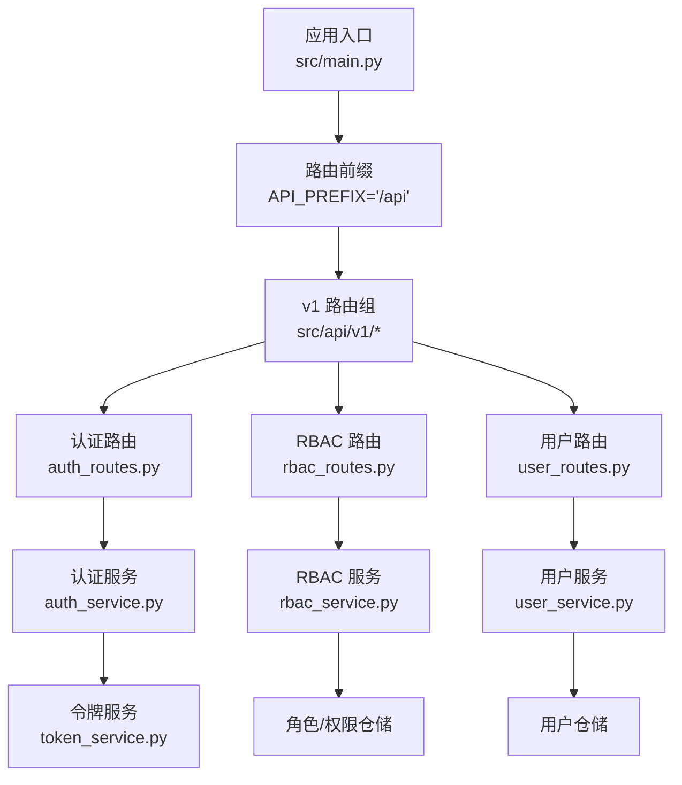
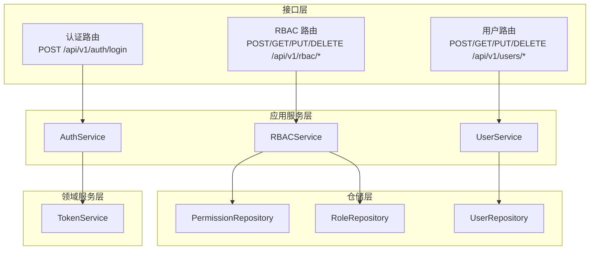
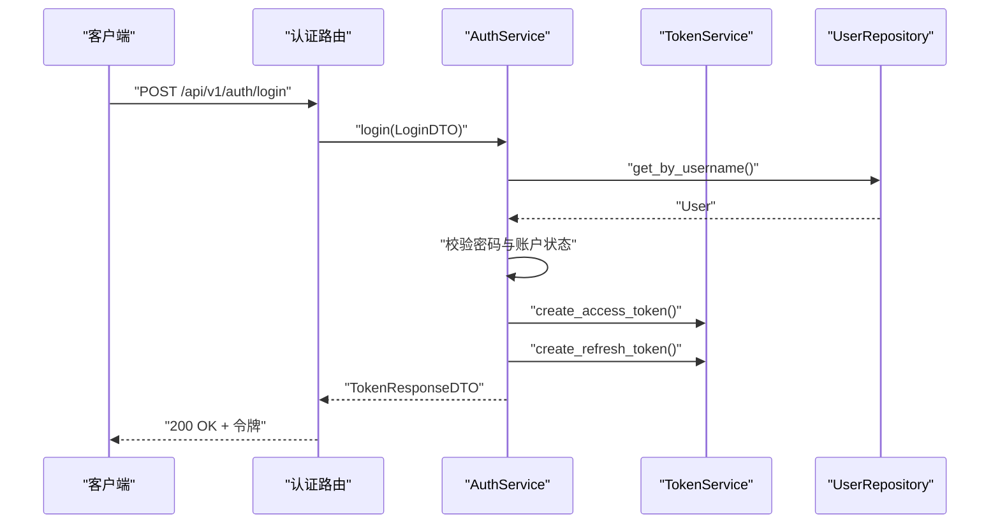
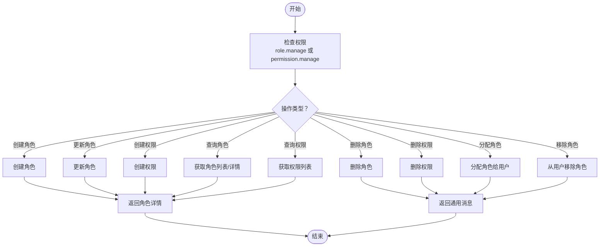
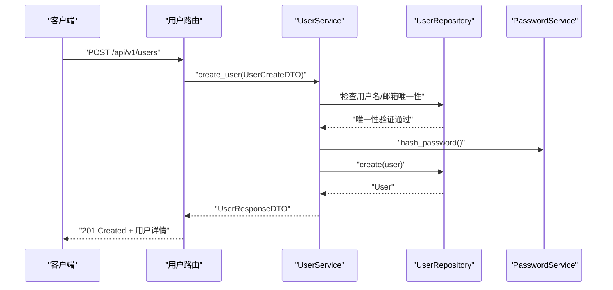
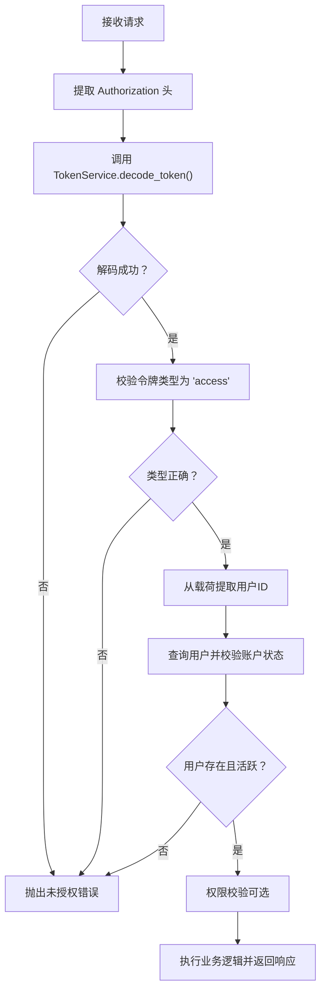
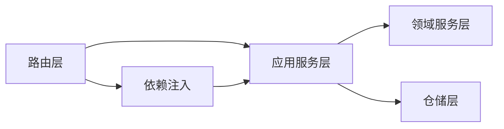

# API接口文档

<cite>
**本文档引用的文件**
- [src/main.py](file://src/main.py)
- [src/api/v1/auth_routes.py](file://src/api/v1/auth_routes.py)
- [src/api/v1/rbac_routes.py](file://src/api/v1/rbac_routes.py)
- [src/api/v1/user_routes.py](file://src/api/v1/user_routes.py)
- [src/api/common.py](file://src/api/common.py)
- [src/api/dependencies.py](file://src/api/dependencies.py)
- [src/application/dto/auth_dto.py](file://src/application/dto/auth_dto.py)
- [src/application/dto/rbac_dto.py](file://src/application/dto/rbac_dto.py)
- [src/application/dto/user_dto.py](file://src/application/dto/user_dto.py)
- [src/core/constants.py](file://src/core/constants.py)
- [src/domain/auth/token_service.py](file://src/domain/auth/token_service.py)
- [src/application/services/auth_service.py](file://src/application/services/auth_service.py)
- [src/application/services/rbac_service.py](file://src/application/services/rbac_service.py)
- [src/application/services/user_service.py](file://src/application/services/user_service.py)
</cite>

## 目录
1. [简介](#简介)
2. [项目结构](#项目结构)
3. [核心组件](#核心组件)
4. [架构总览](#架构总览)
5. [详细组件分析](#详细组件分析)
6. [依赖分析](#依赖分析)
7. [性能考虑](#性能考虑)
8. [故障排除指南](#故障排除指南)
9. [结论](#结论)
10. [附录](#附录)

## 简介
本项目基于 FastAPI 构建，采用领域驱动设计（DDD）与基于角色的访问控制（RBAC）模型，提供 RESTful API 接口。系统支持认证与授权、用户管理、RBAC 管理等核心功能。API 通过 JWT 令牌进行认证，使用细粒度权限控制保障安全性。

## 项目结构
- 应用入口与生命周期管理位于应用工厂模块，负责初始化数据库连接、注册中间件与异常处理器、挂载路由前缀。
- 版本化路由按 v1 组织，分别提供认证、RBAC 和用户管理三类接口。
- 应用层 DTO 定义请求与响应的数据结构；服务层封装业务逻辑；领域层提供令牌与密码等安全能力；基础设施层负责数据库与仓储实现。

图表来源
- [src/main.py:31-83](file://src/main.py#L31-L83)
- [src/api/v1/auth_routes.py:11-34](file://src/api/v1/auth_routes.py#L11-L34)
- [src/api/v1/rbac_routes.py:19-168](file://src/api/v1/rbac_routes.py#L19-L168)
- [src/api/v1/user_routes.py:21-115](file://src/api/v1/user_routes.py#L21-L115)

章节来源
- [src/main.py:31-83](file://src/main.py#L31-L83)
- [src/core/constants.py:4-6](file://src/core/constants.py#L4-L6)

## 核心组件
- 应用入口与生命周期：负责应用启动/关闭时的数据库初始化与关闭、CORS、请求日志中间件、全局异常处理以及健康检查端点。
- 路由前缀与文档：统一前缀为 /api，v1 版本路由挂载于 /api/v1。
- 认证依赖与权限校验：基于 HTTP Bearer 令牌，提供当前用户解析、活跃用户获取、权限校验与超级用户校验。
- DTO 层：标准化请求与响应结构，确保 API 的一致性与可维护性。
- 服务层：封装业务规则，协调仓储与领域服务，处理异常与返回值。
- 领域服务：提供 JWT 令牌生成、刷新与解码验证等安全能力。

章节来源
- [src/main.py:31-83](file://src/main.py#L31-L83)
- [src/api/dependencies.py:16-83](file://src/api/dependencies.py#L16-L83)
- [src/application/dto/auth_dto.py:6-25](file://src/application/dto/auth_dto.py#L6-L25)
- [src/application/dto/rbac_dto.py:8-70](file://src/application/dto/rbac_dto.py#L8-L70)
- [src/application/dto/user_dto.py:8-53](file://src/application/dto/user_dto.py#L8-L53)
- [src/domain/auth/token_service.py:9-41](file://src/domain/auth/token_service.py#L9-L41)

## 架构总览
系统采用分层架构，API 路由层负责请求映射，依赖注入完成认证与权限校验，应用服务层执行业务逻辑，领域服务提供安全能力，仓储层与数据库交互。

图表来源
- [src/api/v1/auth_routes.py:14-33](file://src/api/v1/auth_routes.py#L14-L33)
- [src/api/v1/rbac_routes.py:25-167](file://src/api/v1/rbac_routes.py#L25-L167)
- [src/api/v1/user_routes.py:24-114](file://src/api/v1/user_routes.py#L24-L114)
- [src/application/services/auth_service.py:13-67](file://src/application/services/auth_service.py#L13-L67)
- [src/application/services/rbac_service.py:21-159](file://src/application/services/rbac_service.py#L21-L159)
- [src/application/services/user_service.py:22-142](file://src/application/services/user_service.py#L22-L142)
- [src/domain/auth/token_service.py:9-41](file://src/domain/auth/token_service.py#L9-L41)

## 详细组件分析

### 认证接口
- 基础信息
  - 前缀：/api/v1/auth
  - 认证方式：HTTP Bearer 令牌（Access Token）
  - 令牌类型：访问令牌用于受保护资源，刷新令牌用于换取新的访问令牌
- 端点定义
  - 登录
    - 方法：POST
    - 路径：/api/v1/auth/login
    - 请求体：用户名与密码
    - 成功响应：访问令牌、刷新令牌与令牌类型
    - 错误：用户名或密码错误、账户被禁用
  - 刷新令牌
    - 方法：POST
    - 路径：/api/v1/auth/refresh
    - 请求体：刷新令牌
    - 成功响应：新的访问令牌与刷新令牌
    - 错误：无效或过期的刷新令牌、用户不存在或被禁用
  - 获取当前用户信息
    - 方法：GET
    - 路径：/api/v1/auth/me
    - 成功响应：当前用户的基本信息（含是否为超级用户）
    - 错误：无效或过期的访问令牌、用户不存在或账户被禁用
- 数据模型
  - 登录请求 DTO：包含用户名与密码字段
  - 令牌响应 DTO：包含访问令牌、刷新令牌与令牌类型
  - 刷新令牌请求 DTO：包含刷新令牌字段
- 示例
  - 成功登录响应示例路径：[响应示例:13-18](file://src/application/dto/auth_dto.py#L13-L18)
  - 当前用户信息响应示例路径：[响应示例:45-50](file://src/api/dependencies.py#L45-L50)
- 错误处理
  - 未授权：无效或过期令牌、无效令牌类型、用户不存在或被禁用
  - 全局异常处理器将 AppException 映射为 JSON 响应

图表来源
- [src/api/v1/auth_routes.py:14-18](file://src/api/v1/auth_routes.py#L14-L18)
- [src/application/services/auth_service.py:21-40](file://src/application/services/auth_service.py#L21-L40)
- [src/domain/auth/token_service.py:12-26](file://src/domain/auth/token_service.py#L12-L26)

章节来源
- [src/api/v1/auth_routes.py:14-33](file://src/api/v1/auth_routes.py#L14-L33)
- [src/application/dto/auth_dto.py:6-25](file://src/application/dto/auth_dto.py#L6-L25)
- [src/application/services/auth_service.py:21-67](file://src/application/services/auth_service.py#L21-L67)
- [src/domain/auth/token_service.py:12-41](file://src/domain/auth/token_service.py#L12-L41)
- [src/api/dependencies.py:16-31](file://src/api/dependencies.py#L16-L31)

### RBAC 管理接口
- 基础信息
  - 前缀：/api/v1/rbac
  - 权限控制：每个端点均需相应权限，如 role.view、role.manage、permission.view、permission.manage
- 角色管理
  - 创建角色
    - 方法：POST
    - 路径：/api/v1/rbac/roles
    - 权限：role.manage
    - 请求体：角色名称与描述
    - 成功响应：角色详情（含权限列表）
  - 获取角色列表
    - 方法：GET
    - 路径：/api/v1/rbac/roles
    - 权限：role.view
    - 查询参数：skip（默认0）、limit（默认20，范围1-100）
    - 成功响应：角色数组
  - 获取单个角色
    - 方法：GET
    - 路径：/api/v1/rbac/roles/{role_id}
    - 权限：role.view
    - 成功响应：角色详情
  - 更新角色
    - 方法：PUT
    - 路径：/api/v1/rbac/roles/{role_id}
    - 权限：role.manage
    - 请求体：角色名称与描述（可选）
    - 成功响应：更新后的角色详情
  - 删除角色
    - 方法：DELETE
    - 路径：/api/v1/rbac/roles/{role_id}
    - 权限：role.manage
    - 成功响应：通用消息
- 权限管理
  - 创建权限
    - 方法：POST
    - 路径：/api/v1/rbac/permissions
    - 权限：permission.manage
    - 请求体：权限名称、编码、描述、资源与动作
    - 成功响应：权限详情
  - 获取权限列表
    - 方法：GET
    - 路径：/api/v1/rbac/permissions
    - 权限：permission.view
    - 查询参数：skip、limit
    - 成功响应：权限数组
  - 删除权限
    - 方法：DELETE
    - 路径：/api/v1/rbac/permissions/{permission_id}
    - 权限：permission.manage
    - 成功响应：通用消息
- 用户授权
  - 分配角色给用户
    - 方法：POST
    - 路径：/api/v1/rbac/assign-role
    - 权限：role.manage
    - 请求体：用户ID与角色ID
    - 成功响应：通用消息
  - 从用户移除角色
    - 方法：POST
    - 路径：/api/v1/rbac/remove-role
    - 权限：role.manage
    - 请求体：用户ID与角色ID
    - 成功响应：通用消息
  - 获取用户角色
    - 方法：GET
    - 路径：/api/v1/rbac/users/{user_id}/roles
    - 权限：role.view
    - 成功响应：角色数组
  - 获取用户权限
    - 方法：GET
    - 路径：/api/v1/rbac/users/{user_id}/permissions
    - 权限：permission.view
    - 成功响应：权限数组
- 数据模型
  - 角色创建/更新 DTO：名称与描述
  - 角色响应 DTO：ID、名称、描述、权限编码列表、创建时间
  - 权限创建 DTO：名称、编码、描述、资源、动作
  - 权限响应 DTO：ID、名称、编码、描述、资源、动作、创建时间
  - 分配角色 DTO：用户ID与角色ID
- 示例
  - 角色创建请求示例路径：[请求示例:8-12](file://src/application/dto/rbac_dto.py#L8-L12)
  - 角色响应示例路径：[响应示例:22-31](file://src/application/dto/rbac_dto.py#L22-L31)
  - 权限创建请求示例路径：[请求示例:34-42](file://src/application/dto/rbac_dto.py#L34-L42)
  - 权限响应示例路径：[响应示例:44-55](file://src/application/dto/rbac_dto.py#L44-L55)
  - 分配角色请求示例路径：[请求示例:58-62](file://src/application/dto/rbac_dto.py#L58-L62)

图表来源
- [src/api/v1/rbac_routes.py:25-167](file://src/api/v1/rbac_routes.py#L25-L167)
- [src/application/dto/rbac_dto.py:8-70](file://src/application/dto/rbac_dto.py#L8-L70)
- [src/application/services/rbac_service.py:30-128](file://src/application/services/rbac_service.py#L30-L128)

章节来源
- [src/api/v1/rbac_routes.py:25-167](file://src/api/v1/rbac_routes.py#L25-L167)
- [src/application/dto/rbac_dto.py:8-70](file://src/application/dto/rbac_dto.py#L8-L70)
- [src/application/services/rbac_service.py:30-159](file://src/application/services/rbac_service.py#L30-L159)

### 用户管理接口
- 基础信息
  - 前缀：/api/v1/users
  - 权限控制：根据操作类型需要 user.create、user.view、user.update、user.delete
- 用户 CRUD
  - 创建用户
    - 方法：POST
    - 路径：/api/v1/users
    - 权限：user.create
    - 请求体：用户名、邮箱、密码、全名（可选）
    - 成功响应：用户详情
  - 获取用户列表（分页）
    - 方法：GET
    - 路径：/api/v1/users
    - 权限：user.view
    - 查询参数：skip、limit
    - 成功响应：分页结果（总数与条目）
  - 获取指定用户
    - 方法：GET
    - 路径：/api/v1/users/{user_id}
    - 权限：user.view
    - 成功响应：用户详情
  - 更新指定用户
    - 方法：PUT
    - 路径：/api/v1/users/{user_id}
    - 权限：user.update
    - 请求体：邮箱、全名、激活状态（可选）
    - 成功响应：更新后的用户详情
  - 删除指定用户
    - 方法：DELETE
    - 路径：/api/v1/users/{user_id}
    - 权限：user.delete
    - 成功响应：通用消息
- 当前用户操作
  - 获取我的资料
    - 方法：GET
    - 路径：/api/v1/users/me
    - 成功响应：当前用户详情
  - 更新我的资料
    - 方法：PUT
    - 路径：/api/v1/users/me
    - 请求体：邮箱、全名、激活状态（可选）
    - 成功响应：当前用户详情
  - 修改我的密码
    - 方法：POST
    - 路径：/api/v1/users/me/change-password
    - 请求体：旧密码、新密码
    - 成功响应：通用消息
- 数据模型
  - 用户创建 DTO：用户名、邮箱、密码、全名（可选）
  - 用户更新 DTO：邮箱、全名、激活状态（可选）
  - 用户响应 DTO：ID、用户名、邮箱、全名、激活状态、超级用户标识、创建/更新时间、角色列表
  - 分页用户列表 DTO：总数与用户条目数组
  - 修改密码 DTO：旧密码、新密码
- 示例
  - 用户创建请求示例路径：[请求示例:8-14](file://src/application/dto/user_dto.py#L8-L14)
  - 用户响应示例路径：[响应示例:25-38](file://src/application/dto/user_dto.py#L25-L38)
  - 分页列表响应示例路径：[响应示例:41-46](file://src/application/dto/user_dto.py#L41-L46)
  - 修改密码请求示例路径：[请求示例:48-53](file://src/application/dto/user_dto.py#L48-L53)

图表来源
- [src/api/v1/user_routes.py:24-32](file://src/api/v1/user_routes.py#L24-L32)
- [src/application/services/user_service.py:29-44](file://src/application/services/user_service.py#L29-L44)

章节来源
- [src/api/v1/user_routes.py:24-114](file://src/api/v1/user_routes.py#L24-L114)
- [src/application/dto/user_dto.py:8-53](file://src/application/dto/user_dto.py#L8-L53)
- [src/application/services/user_service.py:29-142](file://src/application/services/user_service.py#L29-L142)

### 认证机制与权限验证流程
- 令牌与类型
  - 访问令牌：用于访问受保护资源，携带用户标识与类型标记
  - 刷新令牌：用于换取新的访问令牌与刷新令牌，有效期更长
- 令牌服务
  - 生成访问令牌与刷新令牌，设置到期时间
  - 解码并验证令牌，校验令牌类型
- 依赖链
  - 从 Authorization 头部提取凭据，解码并验证访问令牌
  - 获取当前活跃用户，校验账户状态
  - 权限校验：若非超级用户，则查询用户权限集合，匹配所需权限编码
- 流程图

图表来源
- [src/api/dependencies.py:16-50](file://src/api/dependencies.py#L16-L50)
- [src/domain/auth/token_service.py:29-41](file://src/domain/auth/token_service.py#L29-L41)
- [src/application/services/auth_service.py:21-40](file://src/application/services/auth_service.py#L21-L40)

章节来源
- [src/api/dependencies.py:16-83](file://src/api/dependencies.py#L16-L83)
- [src/domain/auth/token_service.py:12-41](file://src/domain/auth/token_service.py#L12-L41)
- [src/application/services/auth_service.py:21-67](file://src/application/services/auth_service.py#L21-L67)

## 依赖分析
- 组件耦合
  - 路由层仅依赖应用服务层与依赖注入，保持低耦合
  - 应用服务层依赖仓储与领域服务，职责清晰
  - 依赖注入提供统一的认证与权限校验入口
- 外部依赖
  - FastAPI 提供路由与依赖注入
  - SQLAlchemy 异步会话用于数据库交互
  - Pydantic 用于数据验证与序列化
- 可能的循环依赖
  - 通过模块拆分与依赖注入避免循环导入

图表来源
- [src/api/v1/auth_routes.py:14-33](file://src/api/v1/auth_routes.py#L14-L33)
- [src/api/v1/rbac_routes.py:25-167](file://src/api/v1/rbac_routes.py#L25-L167)
- [src/api/v1/user_routes.py:24-114](file://src/api/v1/user_routes.py#L24-L114)
- [src/api/dependencies.py:16-83](file://src/api/dependencies.py#L16-L83)

章节来源
- [src/api/v1/auth_routes.py:14-33](file://src/api/v1/auth_routes.py#L14-L33)
- [src/api/v1/rbac_routes.py:25-167](file://src/api/v1/rbac_routes.py#L25-L167)
- [src/api/v1/user_routes.py:24-114](file://src/api/v1/user_routes.py#L24-L114)
- [src/api/dependencies.py:16-83](file://src/api/dependencies.py#L16-L83)

## 性能考虑
- 分页参数限制：默认每页20条，最大100条，避免一次性返回过多数据
- 异步数据库访问：使用 SQLAlchemy 异步会话，提升并发性能
- DTO 序列化：Pydantic 自动序列化，减少手动转换开销
- 缓存建议：可结合 Redis 缓存热点数据（如用户权限），降低数据库压力

章节来源
- [src/core/constants.py:7-9](file://src/core/constants.py#L7-L9)
- [src/api/v1/rbac_routes.py:38-40](file://src/api/v1/rbac_routes.py#L38-L40)
- [src/api/v1/user_routes.py:37-39](file://src/api/v1/user_routes.py#L37-L39)

## 故障排除指南
- 常见错误与状态码
  - 400 Bad Request：请求参数不合法（如用户名/邮箱格式、密码长度）
  - 401 Unauthorized：令牌无效、过期或类型不正确；用户不存在或账户被禁用
  - 403 Forbidden：缺少必要权限（如 role.manage、user.view 等）
  - 404 Not Found：资源不存在（如用户、角色、权限）
  - 409 Conflict：重复资源（如用户名或邮箱已存在、角色或权限已存在、重复分配角色）
  - 500 Internal Server Error：未捕获异常
- 全局异常处理
  - AppException 将映射为 JSON 响应，包含 detail 字段
  - 未处理异常统一返回 500 与通用错误信息
- 调试建议
  - 使用 /api/docs 或 /api/redoc 查看 OpenAPI 文档
  - 检查请求头 Authorization 是否为 Bearer 令牌
  - 确认权限编码与用户角色对应关系
  - 在本地开发环境启用日志中间件查看请求详情

章节来源
- [src/main.py:56-69](file://src/main.py#L56-L69)
- [src/api/common.py:6-23](file://src/api/common.py#L6-L23)
- [src/api/dependencies.py:20-31](file://src/api/dependencies.py#L20-L31)
- [src/application/services/user_service.py:32-35](file://src/application/services/user_service.py#L32-L35)
- [src/application/services/rbac_service.py:32-33](file://src/application/services/rbac_service.py#L32-L33)

## 结论
本项目提供了完整、可扩展的认证与授权体系，配合 RBAC 与用户管理接口，满足企业级权限控制需求。通过明确的权限编码、严格的依赖注入与异常处理机制，确保了系统的安全性与可维护性。建议在生产环境中结合缓存与审计日志进一步优化性能与可观测性。

## 附录

### API 版本管理与兼容性
- 版本前缀：/api/v1，便于未来引入 /api/v2 并保持向后兼容
- 建议策略
  - 新增端点：在现有版本内添加
  - 修改行为：通过新增版本端点或提供兼容参数
  - 移除字段：先标记废弃，保留至少一个版本再移除

章节来源
- [src/core/constants.py:4-6](file://src/core/constants.py#L4-L6)
- [src/main.py:37-39](file://src/main.py#L37-L39)

### 常用请求头与示例
- 认证头：Authorization: Bearer <access_token>
- 内容类型：application/json
- 示例参考
  - 登录成功响应示例路径：[示例:13-18](file://src/application/dto/auth_dto.py#L13-L18)
  - 当前用户信息示例路径：[示例:45-50](file://src/api/dependencies.py#L45-L50)
  - 通用消息响应示例路径：[示例:12-15](file://src/api/common.py#L12-L15)

章节来源
- [src/api/dependencies.py:13](file://src/api/dependencies.py#L13)
- [src/application/dto/auth_dto.py:13-18](file://src/application/dto/auth_dto.py#L13-L18)
- [src/api/common.py:12-15](file://src/api/common.py#L12-L15)