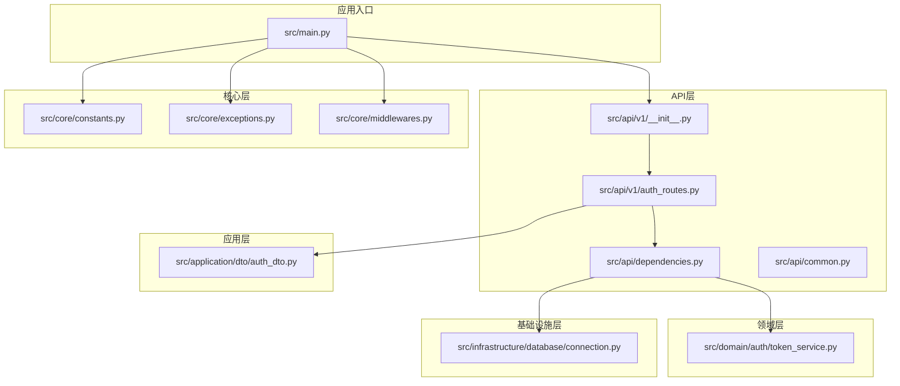
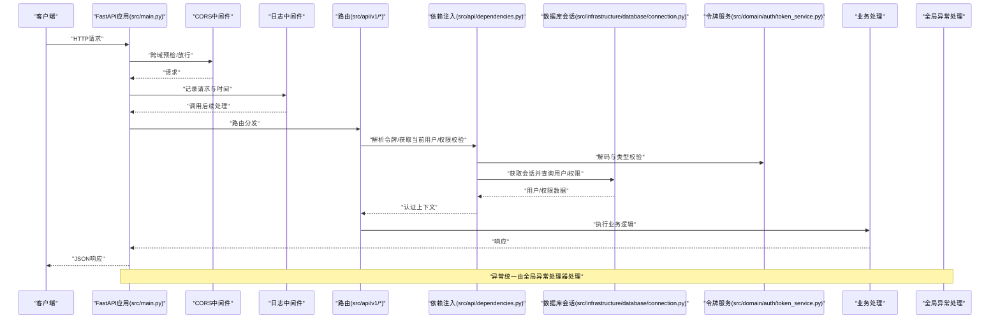
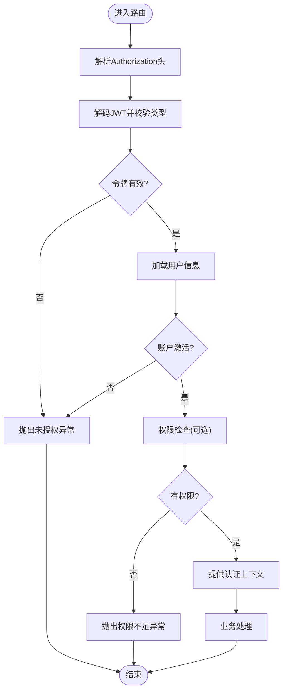
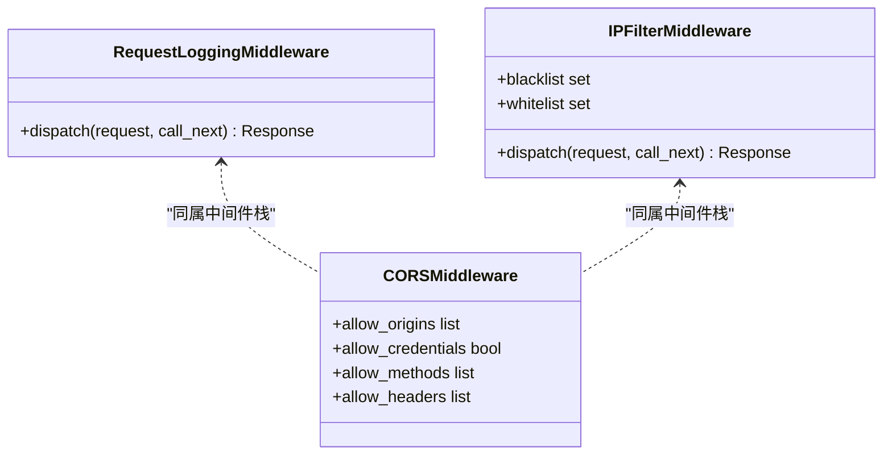
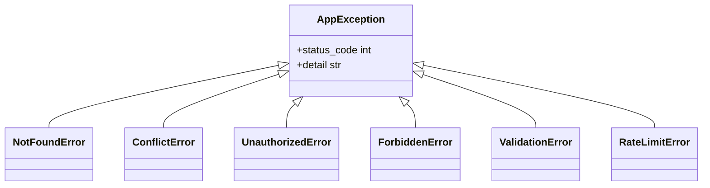
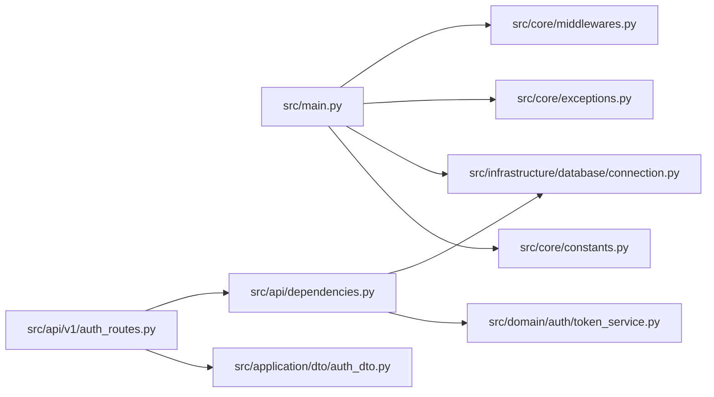

# API通用功能

<cite>
**本文引用的文件**
- [src/main.py](file://src/main.py)
- [src/api/dependencies.py](file://src/api/dependencies.py)
- [src/core/middlewares.py](file://src/core/middlewares.py)
- [src/core/exceptions.py](file://src/core/exceptions.py)
- [src/infrastructure/database/connection.py](file://src/infrastructure/database/connection.py)
- [src/api/v1/__init__.py](file://src/api/v1/__init__.py)
- [src/api/v1/auth_routes.py](file://src/api/v1/auth_routes.py)
- [src/api/common.py](file://src/api/common.py)
- [src/core/constants.py](file://src/core/constants.py)
- [src/application/dto/auth_dto.py](file://src/application/dto/auth_dto.py)
- [src/domain/auth/token_service.py](file://src/domain/auth/token_service.py)
- [src/tests/conftest.py](file://src/tests/conftest.py)
- [scripts/verify_api.py](file://scripts/verify_api.py)
- [pyproject.toml](file://pyproject.toml)
</cite>

## 目录
1. [简介](#简介)
2. [项目结构](#项目结构)
3. [核心组件](#核心组件)
4. [架构总览](#架构总览)
5. [详细组件分析](#详细组件分析)
6. [依赖分析](#依赖分析)
7. [性能考虑](#性能考虑)
8. [故障排查指南](#故障排查指南)
9. [结论](#结论)
10. [附录](#附录)

## 简介
本文件聚焦于API通用功能与基础设施，涵盖以下主题：
- 依赖注入机制：数据库连接依赖、当前用户依赖与权限验证依赖的实现原理与协作方式
- 中间件配置：CORS跨域、请求日志中间件与异常处理中间件的工作机制
- 全局异常处理：自定义异常类、错误响应格式与HTTP状态码映射规则
- API版本控制策略与向后兼容性保障
- API文档生成机制与OpenAPI规范的自动生成
- 测试工具与调试指南：验证脚本、curl示例与Postman集合使用建议
- 性能优化策略：缓存、分页与批量操作最佳实践

## 项目结构
该项目采用分层与领域驱动设计（DDD）结合的组织方式，API层通过依赖注入提供数据库会话与认证上下文，核心层包含中间件、异常与日志等横切关注点，基础设施层负责数据库连接与ORM模型。

图表来源
- [src/main.py:31-83](file://src/main.py#L31-L83)
- [src/api/v1/__init__.py:1-15](file://src/api/v1/__init__.py#L1-L15)
- [src/api/v1/auth_routes.py:1-34](file://src/api/v1/auth_routes.py#L1-L34)
- [src/api/dependencies.py:1-83](file://src/api/dependencies.py#L1-L83)
- [src/core/middlewares.py:1-64](file://src/core/middlewares.py#L1-L64)
- [src/core/exceptions.py:1-53](file://src/core/exceptions.py#L1-L53)
- [src/core/constants.py:1-29](file://src/core/constants.py#L1-L29)
- [src/application/dto/auth_dto.py:1-25](file://src/application/dto/auth_dto.py#L1-L25)
- [src/domain/auth/token_service.py:1-41](file://src/domain/auth/token_service.py#L1-L41)
- [src/infrastructure/database/connection.py:1-51](file://src/infrastructure/database/connection.py#L1-L51)

章节来源
- [src/main.py:31-83](file://src/main.py#L31-L83)
- [src/api/v1/__init__.py:1-15](file://src/api/v1/__init__.py#L1-L15)
- [src/api/v1/auth_routes.py:1-34](file://src/api/v1/auth_routes.py#L1-L34)
- [src/api/dependencies.py:1-83](file://src/api/dependencies.py#L1-L83)
- [src/core/middlewares.py:1-64](file://src/core/middlewares.py#L1-L64)
- [src/core/exceptions.py:1-53](file://src/core/exceptions.py#L1-L53)
- [src/core/constants.py:1-29](file://src/core/constants.py#L1-L29)
- [src/application/dto/auth_dto.py:1-25](file://src/application/dto/auth_dto.py#L1-L25)
- [src/domain/auth/token_service.py:1-41](file://src/domain/auth/token_service.py#L1-L41)
- [src/infrastructure/database/connection.py:1-51](file://src/infrastructure/database/connection.py#L1-L51)

## 核心组件
- 应用工厂与生命周期：应用工厂负责创建FastAPI实例、注册中间件、全局异常处理器、健康检查端点与路由前缀，并通过生命周期钩子初始化与关闭数据库连接。
- 依赖注入体系：数据库会话依赖提供异步会话；认证依赖链从令牌解析到当前用户加载再到权限校验；权限依赖工厂按需生成具体权限检查器。
- 中间件栈：CORS跨域、请求日志中间件以及可选的IP黑白名单中间件。
- 异常体系：统一的AppException基类及各类业务异常，映射到标准HTTP状态码。
- 文档与版本：OpenAPI文档路径与版本号配置，API前缀统一管理。

章节来源
- [src/main.py:31-83](file://src/main.py#L31-L83)
- [src/api/dependencies.py:16-83](file://src/api/dependencies.py#L16-L83)
- [src/core/middlewares.py:12-64](file://src/core/middlewares.py#L12-L64)
- [src/core/exceptions.py:6-53](file://src/core/exceptions.py#L6-L53)
- [src/core/constants.py:4-6](file://src/core/constants.py#L4-L6)

## 架构总览
下图展示了API通用功能在运行时的关键交互：请求进入应用后依次经过CORS与日志中间件，随后由路由触发依赖注入链，最终到达业务服务层并返回响应；异常在全局范围内被统一捕获与格式化。

图表来源
- [src/main.py:31-83](file://src/main.py#L31-L83)
- [src/api/v1/auth_routes.py:14-33](file://src/api/v1/auth_routes.py#L14-L33)
- [src/api/dependencies.py:16-83](file://src/api/dependencies.py#L16-L83)
- [src/domain/auth/token_service.py:28-41](file://src/domain/auth/token_service.py#L28-L41)
- [src/infrastructure/database/connection.py:26-36](file://src/infrastructure/database/connection.py#L26-L36)

## 详细组件分析

### 依赖注入机制
- 数据库连接依赖
  - 通过异步会话工厂提供会话，自动提交、回滚与关闭，确保事务一致性与资源释放。
  - 在生命周期钩子中初始化数据库表，在应用关闭时释放引擎。
- 当前用户依赖
  - 从Authorization头解析Bearer令牌，解码并校验令牌类型，再通过用户仓储加载用户实体，校验账户激活状态。
- 权限验证依赖
  - 提供权限工厂与超级用户工厂，前者基于用户权限集合进行匹配，后者直接校验超级用户标记。
  - 两者均依赖当前用户与数据库会话，形成清晰的依赖链。

图表来源
- [src/api/dependencies.py:16-83](file://src/api/dependencies.py#L16-L83)
- [src/domain/auth/token_service.py:28-41](file://src/domain/auth/token_service.py#L28-L41)
- [src/infrastructure/database/connection.py:26-36](file://src/infrastructure/database/connection.py#L26-L36)

章节来源
- [src/infrastructure/database/connection.py:26-36](file://src/infrastructure/database/connection.py#L26-L36)
- [src/api/dependencies.py:16-83](file://src/api/dependencies.py#L16-L83)
- [src/domain/auth/token_service.py:28-41](file://src/domain/auth/token_service.py#L28-L41)

### 中间件配置
- CORS跨域处理
  - 通过CORSMiddleware配置允许来源、凭证、方法与头部，满足前后端分离场景。
- 请求日志中间件
  - 记录请求方法、路径与客户端IP，计算处理耗时并在响应头中附加处理时间，便于性能监控。
- IP黑白名单中间件（可选）
  - 支持白名单优先与黑名单阻断，拒绝不在白名单或在黑名单内的请求。

图表来源
- [src/core/middlewares.py:12-64](file://src/core/middlewares.py#L12-L64)
- [src/main.py:43-53](file://src/main.py#L43-L53)

章节来源
- [src/core/middlewares.py:12-64](file://src/core/middlewares.py#L12-L64)
- [src/main.py:43-53](file://src/main.py#L43-L53)

### 全局异常处理机制
- 自定义异常类
  - 统一继承HTTPException，派生出未找到、冲突、未授权、权限不足、验证错误与限流等异常。
- 错误响应格式
  - 全局异常处理器返回JSON格式的错误详情字段，遵循REST风格。
- HTTP状态码映射
  - 各异常类显式映射到对应HTTP状态码，保证语义一致与客户端友好。

图表来源
- [src/core/exceptions.py:6-53](file://src/core/exceptions.py#L6-L53)

章节来源
- [src/core/exceptions.py:6-53](file://src/core/exceptions.py#L6-L53)
- [src/main.py:55-69](file://src/main.py#L55-L69)

### API版本控制与向后兼容
- 版本控制策略
  - 使用统一API前缀与版本前缀管理，V1路由聚合器集中注册各模块路由。
  - 应用级版本号在应用工厂中配置，文档路径也基于前缀生成。
- 向后兼容性
  - 通过独立版本命名空间隔离变更；新增端点优先在新版本发布，旧版本保持稳定。
  - 常量中定义默认分页参数与RBAC默认角色/权限，作为稳定契约的一部分。

章节来源
- [src/api/v1/__init__.py:9-12](file://src/api/v1/__init__.py#L9-L12)
- [src/main.py:33-40](file://src/main.py#L33-L40)
- [src/core/constants.py:4-28](file://src/core/constants.py#L4-L28)

### API文档生成与OpenAPI
- 文档路径
  - OpenAPI JSON、Swagger UI与ReDoc路径均基于统一前缀生成，便于集成与访问。
- 自动生成
  - FastAPI基于路由与Pydantic模型自动生成OpenAPI规范，无需手写YAML/JSON。

章节来源
- [src/main.py:37-39](file://src/main.py#L37-L39)
- [src/api/v1/auth_routes.py:14-33](file://src/api/v1/auth_routes.py#L14-L33)

### 测试工具与调试指南
- 功能验证脚本
  - 包含健康检查、登录、受保护端点访问、RBAC端点与未认证访问等场景的自动化验证。
- curl示例
  - 建议使用curl命令模拟登录、携带Bearer令牌访问受保护端点、查看RBAC数据等。
- Postman集合
  - 建议将验证脚本中的端点导入Postman，配合环境变量管理基础URL与令牌。
- 单元/集成测试
  - 测试固件提供内存数据库、依赖覆盖与异步HTTP客户端，便于快速回归测试。

章节来源
- [scripts/verify_api.py:1-176](file://scripts/verify_api.py#L1-L176)
- [src/tests/conftest.py:29-57](file://src/tests/conftest.py#L29-L57)

## 依赖分析
- 外部依赖
  - FastAPI、SQLAlchemy异步、Pydantic、JWTS、Redis、分页与缓存相关扩展等。
- 内部依赖
  - 应用入口依赖中间件、异常与数据库；API路由依赖依赖注入与DTO；依赖注入依赖令牌服务与仓储；令牌服务依赖配置。

图表来源
- [src/main.py:31-83](file://src/main.py#L31-L83)
- [src/api/v1/auth_routes.py:1-34](file://src/api/v1/auth_routes.py#L1-L34)
- [src/api/dependencies.py:1-83](file://src/api/dependencies.py#L1-L83)
- [src/domain/auth/token_service.py:1-41](file://src/domain/auth/token_service.py#L1-L41)
- [src/infrastructure/database/connection.py:1-51](file://src/infrastructure/database/connection.py#L1-L51)
- [src/application/dto/auth_dto.py:1-25](file://src/application/dto/auth_dto.py#L1-L25)
- [src/core/constants.py:1-29](file://src/core/constants.py#L1-L29)

章节来源
- [pyproject.toml:7-27](file://pyproject.toml#L7-L27)
- [src/main.py:31-83](file://src/main.py#L31-L83)
- [src/api/dependencies.py:1-83](file://src/api/dependencies.py#L1-L83)

## 性能考虑
- 缓存机制
  - 使用缓存库与Redis客户端，建议对热点读取（如RBAC权限集）进行缓存，降低数据库压力。
- 分页查询
  - 常量中定义默认与最大分页大小，建议在查询接口统一使用分页DTO与限制条件，避免一次性返回大量数据。
- 批量操作
  - 对于批量写入，建议使用批量插入/更新与事务合并，减少往返次数与锁竞争。
- 日志与监控
  - 请求日志中间件输出处理时间，可用于定位慢请求；建议结合指标系统与追踪链路。

章节来源
- [src/core/constants.py:7-9](file://src/core/constants.py#L7-L9)
- [src/core/middlewares.py:15-31](file://src/core/middlewares.py#L15-L31)
- [src/infrastructure/cache/redis_client.py](file://src/infrastructure/cache/redis_client.py)

## 故障排查指南
- 健康检查
  - 通过健康端点确认服务可用性与版本信息。
- 未认证/权限不足
  - 检查Authorization头格式与令牌有效性；确认用户账户状态与权限集合。
- 数据库问题
  - 关注会话生命周期与异常回滚逻辑；确认数据库初始化与关闭流程。
- 全局异常
  - 查看全局异常处理器返回的错误详情字段，结合日志定位根因。

章节来源
- [src/main.py:71-74](file://src/main.py#L71-L74)
- [src/api/dependencies.py:20-31](file://src/api/dependencies.py#L20-L31)
- [src/infrastructure/database/connection.py:26-36](file://src/infrastructure/database/connection.py#L26-L36)
- [src/main.py:55-69](file://src/main.py#L55-L69)

## 结论
该API通用功能以依赖注入为核心，结合中间件与异常处理机制，提供了认证、授权、日志与文档的完整基础设施。通过版本前缀与常量契约保障向后兼容，配合缓存、分页与批量操作策略提升性能。测试脚本与固件为持续集成与本地调试提供了便利。

## 附录
- 常用端点参考
  - 健康检查：GET /health
  - 登录：POST /api/v1/auth/login
  - 刷新令牌：POST /api/v1/auth/refresh
  - 当前用户：GET /api/v1/auth/me
  - 角色列表：GET /api/v1/rbac/roles
  - 权限列表：GET /api/v1/rbac/permissions
- curl示例思路
  - 登录获取令牌后，使用Authorization: Bearer <token>访问受保护端点
- Postman集合建议
  - 将上述端点导入集合，使用环境变量管理基础URL与令牌，便于团队协作与回归测试