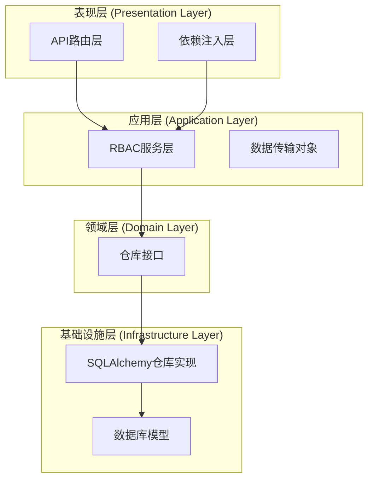
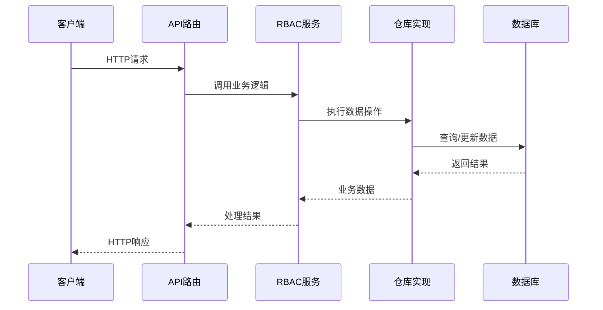
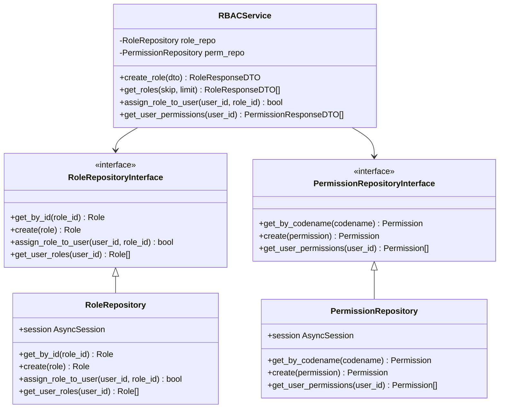

# RBAC权限管理接口

<cite>
**本文档引用的文件**
- [rbac_routes.py](file://src/api/v1/rbac_routes.py)
- [rbac_service.py](file://src/application/services/rbac_service.py)
- [rbac_dto.py](file://src/application/dto/rbac_dto.py)
- [rbac_repository.py](file://src/infrastructure/repositories/rbac_repository.py)
- [models.py](file://src/infrastructure/database/models.py)
- [dependencies.py](file://src/api/dependencies.py)
- [repository.py](file://src/domain/rbac/repository.py)
- [exceptions.py](file://src/core/exceptions.py)
- [__init__.py](file://src/api/v1/__init__.py)
- [main.py](file://src/main.py)
</cite>

## 目录
1. [简介](#简介)
2. [项目结构](#项目结构)
3. [核心组件](#核心组件)
4. [架构概览](#架构概览)
5. [详细组件分析](#详细组件分析)
6. [依赖关系分析](#依赖关系分析)
7. [性能考虑](#性能考虑)
8. [故障排除指南](#故障排除指南)
9. [结论](#结论)

## 简介

本文件为基于FastAPI构建的RBAC（基于角色的访问控制）权限管理系统提供完整的API接口文档。该系统采用领域驱动设计（DDD）架构，实现了完整的角色管理、权限管理和用户授权功能。系统支持权限验证、冲突检测、循环依赖防止和权限继承等高级特性。

## 项目结构

RBAC权限管理系统采用分层架构设计，主要包含以下层次：



**图表来源**
- [rbac_routes.py:1-168](file://src/api/v1/rbac_routes.py#L1-L168)
- [rbac_service.py:1-158](file://src/application/services/rbac_service.py#L1-L158)
- [rbac_repository.py:1-133](file://src/infrastructure/repositories/rbac_repository.py#L1-L133)

**章节来源**
- [rbac_routes.py:1-168](file://src/api/v1/rbac_routes.py#L1-L168)
- [rbac_service.py:1-158](file://src/application/services/rbac_service.py#L1-L158)
- [rbac_repository.py:1-133](file://src/infrastructure/repositories/rbac_repository.py#L1-L133)

## 核心组件

### 数据传输对象 (DTO)

系统使用Pydantic模型定义数据传输格式：

#### 角色相关DTO
- **RoleCreateDTO**: 角色创建请求模型
- **RoleUpdateDTO**: 角色更新请求模型  
- **RoleResponseDTO**: 角色响应模型

#### 权限相关DTO
- **PermissionCreateDTO**: 权限创建请求模型
- **PermissionResponseDTO**: 权限响应模型

#### 分配相关DTO
- **AssignRoleDTO**: 用户角色分配请求模型
- **AssignPermissionDTO**: 角色权限分配请求模型

**章节来源**
- [rbac_dto.py:1-70](file://src/application/dto/rbac_dto.py#L1-L70)

### 仓库接口

系统定义了清晰的仓库接口以实现领域逻辑与数据访问的分离：

#### 角色仓库接口
- `get_by_id()`: 按ID获取角色
- `get_by_name()`: 按名称获取角色
- `get_all()`: 获取所有角色
- `create()`: 创建角色
- `update()`: 更新角色
- `delete()`: 删除角色
- `assign_role_to_user()`: 为用户分配角色
- `remove_role_from_user()`: 移除用户角色
- `get_user_roles()`: 获取用户角色

#### 权限仓库接口
- `get_by_id()`: 按ID获取权限
- `get_by_codename()`: 按编码获取权限
- `get_all()`: 获取所有权限
- `create()`: 创建权限
- `delete()`: 删除权限
- `get_permissions_by_role()`: 获取角色权限
- `get_user_permissions()`: 获取用户权限

**章节来源**
- [repository.py:1-62](file://src/domain/rbac/repository.py#L1-L62)

## 架构概览

系统采用经典的三层架构模式，结合领域驱动设计原则：



**图表来源**
- [rbac_routes.py:25-33](file://src/api/v1/rbac_routes.py#L25-L33)
- [rbac_service.py:29-36](file://src/application/services/rbac_service.py#L29-L36)
- [rbac_repository.py:32-36](file://src/infrastructure/repositories/rbac_repository.py#L32-L36)

## 详细组件分析

### 角色管理接口

#### 创建角色接口
- **URL**: `/api/v1/rbac/roles`
- **方法**: POST
- **权限**: `role.manage`
- **请求体**: RoleCreateDTO
- **响应**: RoleResponseDTO

请求示例：
```json
{
  "name": "管理员",
  "description": "系统管理员角色"
}
```

响应示例：
```json
{
  "id": "123e4567-e89b-12d3-a456-426614174000",
  "name": "管理员",
  "description": "系统管理员角色",
  "permissions": [],
  "created_at": "2024-01-01T12:00:00Z"
}
```

#### 角色列表查询接口
- **URL**: `/api/v1/rbac/roles`
- **方法**: GET
- **权限**: `role.view`
- **查询参数**: 
  - `skip`: 跳过数量，默认0
  - `limit`: 限制数量，默认20，最大100
- **响应**: RoleResponseDTO数组

**章节来源**
- [rbac_routes.py:25-45](file://src/api/v1/rbac_routes.py#L25-L45)
- [rbac_service.py:29-48](file://src/application/services/rbac_service.py#L29-L48)

### 权限管理接口

#### 创建权限接口
- **URL**: `/api/v1/rbac/permissions`
- **方法**: POST
- **权限**: `permission.manage`
- **请求体**: PermissionCreateDTO
- **响应**: PermissionResponseDTO

请求示例：
```json
{
  "name": "用户管理",
  "codename": "user.manage",
  "description": "用户管理权限",
  "resource": "user",
  "action": "manage"
}
```

响应示例：
```json
{
  "id": "123e4567-e89b-12d3-a456-426614174001",
  "name": "用户管理",
  "codename": "user.manage",
  "description": "用户管理权限",
  "resource": "user",
  "action": "manage",
  "created_at": "2024-01-01T12:00:00Z"
}
```

#### 权限列表查询接口
- **URL**: `/api/v1/rbac/permissions`
- **方法**: GET
- **权限**: `permission.view`
- **查询参数**: 
  - `skip`: 跳过数量，默认0
  - `limit`: 限制数量，默认20，最大100
- **响应**: PermissionResponseDTO数组

**章节来源**
- [rbac_routes.py:86-106](file://src/api/v1/rbac_routes.py#L86-L106)
- [rbac_service.py:75-93](file://src/application/services/rbac_service.py#L75-L93)

### 用户授权接口

#### 为用户分配角色接口
- **URL**: `/api/v1/rbac/assign-role`
- **方法**: POST
- **权限**: `role.manage`
- **请求体**: AssignRoleDTO
- **响应**: MessageResponse

请求示例：
```json
{
  "user_id": "123e4567-e89b-12d3-a456-426614174002",
  "role_id": "123e4567-e89b-12d3-a456-426614174000"
}
```

响应示例：
```json
{
  "message": "Role assigned successfully"
}
```

#### 移除用户角色接口
- **URL**: `/api/v1/rbac/remove-role`
- **方法**: POST
- **权限**: `role.manage`
- **请求体**: AssignRoleDTO
- **响应**: MessageResponse

#### 获取用户角色接口
- **URL**: `/api/v1/rbac/users/{user_id}/roles`
- **方法**: GET
- **权限**: `role.view`
- **路径参数**: `user_id`
- **响应**: RoleResponseDTO数组

#### 获取用户权限接口
- **URL**: `/api/v1/rbac/users/{user_id}/permissions`
- **方法**: GET
- **权限**: `permission.view`
- **路径参数**: `user_id`
- **响应**: PermissionResponseDTO数组

**章节来源**
- [rbac_routes.py:124-167](file://src/api/v1/rbac_routes.py#L124-L167)
- [rbac_service.py:103-127](file://src/application/services/rbac_service.py#L103-L127)

## 依赖关系分析

系统采用依赖注入和接口分离的设计模式：



**图表来源**
- [rbac_service.py:20-26](file://src/application/services/rbac_service.py#L20-L26)
- [repository.py:8-37](file://src/domain/rbac/repository.py#L8-L37)
- [rbac_repository.py:11-77](file://src/infrastructure/repositories/rbac_repository.py#L11-L77)

**章节来源**
- [rbac_service.py:1-158](file://src/application/services/rbac_service.py#L1-L158)
- [rbac_repository.py:1-133](file://src/infrastructure/repositories/rbac_repository.py#L1-L133)

## 性能考虑

### 数据库优化策略

1. **批量加载**: 使用`selectinload`优化N+1查询问题
2. **索引优化**: 在关键字段上建立数据库索引
3. **分页查询**: 默认限制查询结果数量，防止内存溢出
4. **连接池**: 使用异步数据库连接池提高并发性能

### 缓存策略

系统支持Redis缓存机制，可配置性地缓存：
- 用户权限信息
- 角色权限映射
- 频繁访问的元数据

### 错误处理

系统提供统一的异常处理机制：
- 自定义HTTP异常类
- 统一的错误响应格式
- 详细的错误信息日志

**章节来源**
- [rbac_repository.py:17-30](file://src/infrastructure/repositories/rbac_repository.py#L17-L30)
- [exceptions.py:1-53](file://src/core/exceptions.py#L1-L53)

## 故障排除指南

### 常见错误类型

#### 认证相关错误
- **401 未授权**: 无效或过期的JWT令牌
- **403 权限不足**: 当前用户缺少必需的权限
- **404 用户不存在**: 指定的用户ID不存在

#### 资源相关错误
- **409 资源冲突**: 角色或权限名称重复
- **422 参数验证错误**: 请求参数不符合验证规则

#### 业务逻辑错误
- **400 业务逻辑错误**: 用户角色分配冲突
- **500 服务器内部错误**: 未处理的系统异常

### 调试建议

1. **启用详细日志**: 检查请求和响应的完整日志
2. **验证JWT令牌**: 确保令牌格式正确且未过期
3. **检查权限配置**: 验证用户是否具备所需权限
4. **数据库连接**: 确认数据库连接正常

**章节来源**
- [dependencies.py:16-83](file://src/api/dependencies.py#L16-L83)
- [exceptions.py:13-53](file://src/core/exceptions.py#L13-L53)

## 结论

本RBAC权限管理系统提供了完整的权限控制解决方案，具有以下特点：

1. **模块化设计**: 清晰的分层架构便于维护和扩展
2. **安全可靠**: 完整的权限验证和错误处理机制
3. **高性能**: 优化的数据库查询和缓存策略
4. **易于使用**: 标准化的API接口和详细的文档

系统支持复杂的权限管理场景，包括角色继承、权限组合和动态权限验证等功能，能够满足企业级应用的安全需求。