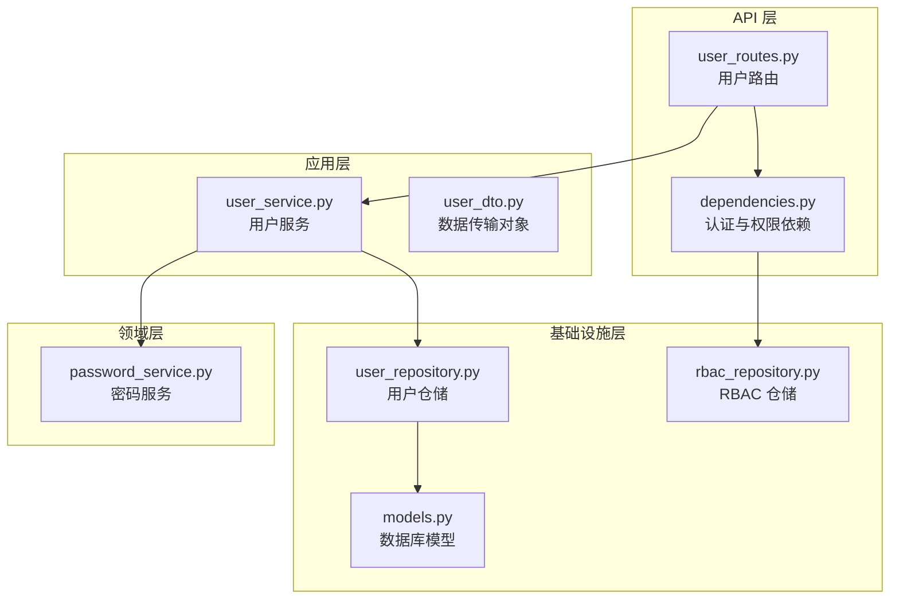
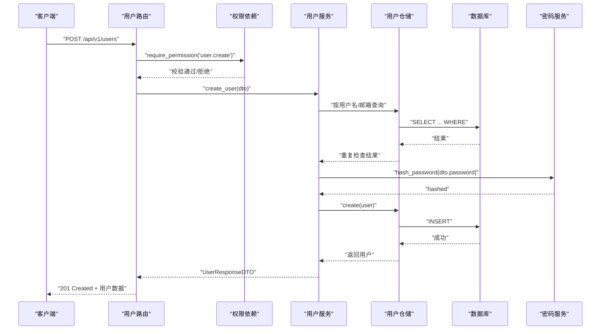
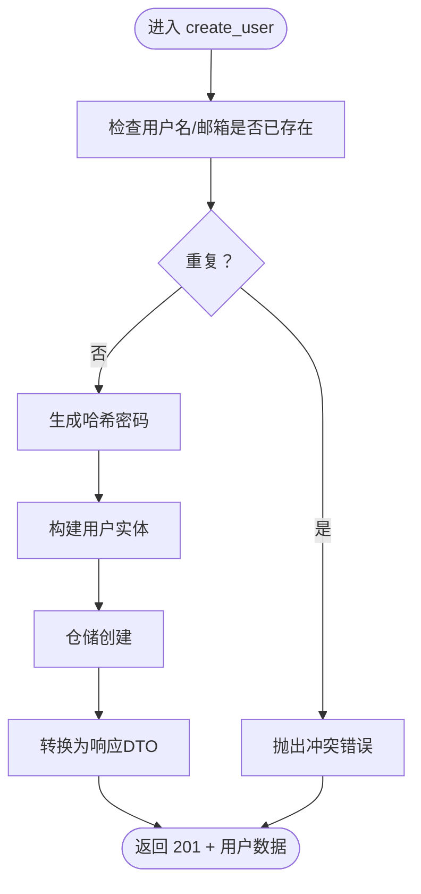
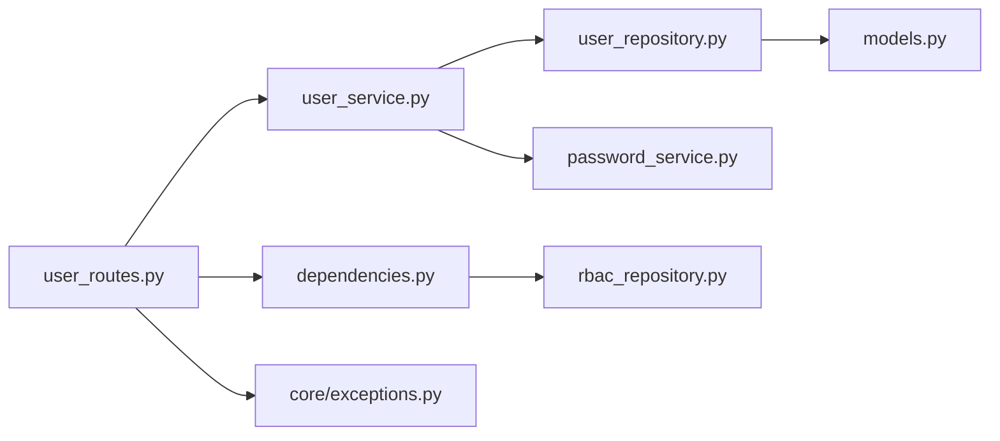
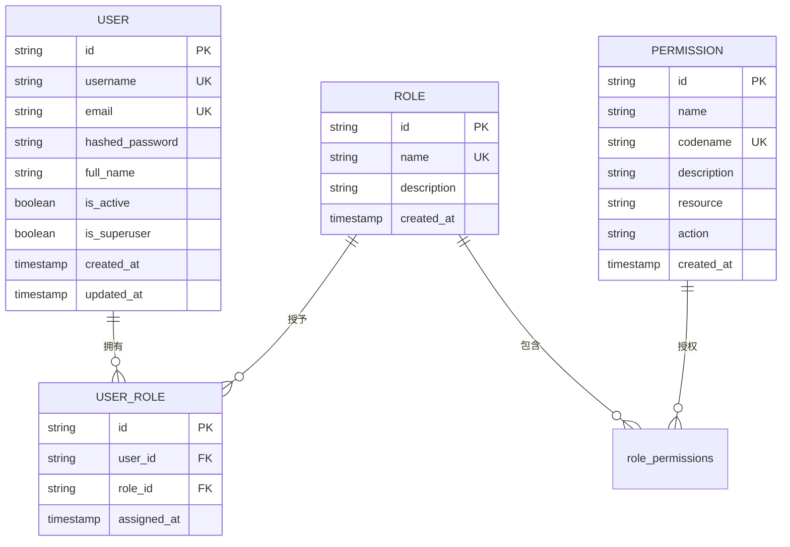

# 用户管理接口

<cite>
**本文档引用的文件**
- [src/api/v1/user_routes.py](file://src/api/v1/user_routes.py)
- [src/application/services/user_service.py](file://src/application/services/user_service.py)
- [src/application/dto/user_dto.py](file://src/application/dto/user_dto.py)
- [src/infrastructure/repositories/user_repository.py](file://src/infrastructure/repositories/user_repository.py)
- [src/infrastructure/database/models.py](file://src/infrastructure/database/models.py)
- [src/domain/auth/password_service.py](file://src/domain/auth/password_service.py)
- [src/api/dependencies.py](file://src/api/dependencies.py)
- [src/core/exceptions.py](file://src/core/exceptions.py)
- [src/infrastructure/repositories/rbac_repository.py](file://src/infrastructure/repositories/rbac_repository.py)
- [src/api/common.py](file://src/api/common.py)
- [src/main.py](file://src/main.py)
- [src/tests/integration/test_api.py](file://src/tests/integration/test_api.py)
</cite>

## 目录
1. [简介](#简介)
2. [项目结构](#项目结构)
3. [核心组件](#核心组件)
4. [架构总览](#架构总览)
5. [详细组件分析](#详细组件分析)
6. [依赖分析](#依赖分析)
7. [性能考虑](#性能考虑)
8. [故障排除指南](#故障排除指南)
9. [结论](#结论)
10. [附录](#附录)

## 简介
本文件为用户管理系统的完整API接口文档，覆盖用户CRUD操作、查询接口、更新与删除、密码变更、权限校验与RBAC角色分配等能力。文档基于实际代码实现，提供接口规范、数据模型、请求响应示例、错误处理与最佳实践。

## 项目结构
用户管理相关代码采用分层架构组织，主要涉及API路由、应用服务、领域模型与仓储层：
- API层：定义REST接口与依赖注入
- 应用层：封装业务逻辑与数据转换
- 领域层：密码服务等核心领域能力
- 基础设施层：数据库模型与仓储实现
- RBAC：权限与角色管理

图表来源
- [src/api/v1/user_routes.py:1-115](file://src/api/v1/user_routes.py#L1-L115)
- [src/api/dependencies.py:1-83](file://src/api/dependencies.py#L1-L83)
- [src/application/services/user_service.py:1-141](file://src/application/services/user_service.py#L1-L141)
- [src/application/dto/user_dto.py:1-53](file://src/application/dto/user_dto.py#L1-L53)
- [src/infrastructure/repositories/user_repository.py:1-61](file://src/infrastructure/repositories/user_repository.py#L1-L61)
- [src/infrastructure/database/models.py:1-142](file://src/infrastructure/database/models.py#L1-L142)
- [src/domain/auth/password_service.py:1-24](file://src/domain/auth/password_service.py#L1-L24)
- [src/infrastructure/repositories/rbac_repository.py:1-133](file://src/infrastructure/repositories/rbac_repository.py#L1-L133)

章节来源
- [src/api/v1/user_routes.py:1-115](file://src/api/v1/user_routes.py#L1-L115)
- [src/application/services/user_service.py:1-141](file://src/application/services/user_service.py#L1-L141)
- [src/infrastructure/repositories/user_repository.py:1-61](file://src/infrastructure/repositories/user_repository.py#L1-L61)
- [src/infrastructure/database/models.py:1-142](file://src/infrastructure/database/models.py#L1-L142)
- [src/domain/auth/password_service.py:1-24](file://src/domain/auth/password_service.py#L1-L24)
- [src/api/dependencies.py:1-83](file://src/api/dependencies.py#L1-L83)
- [src/infrastructure/repositories/rbac_repository.py:1-133](file://src/infrastructure/repositories/rbac_repository.py#L1-L133)

## 核心组件
- 用户路由：提供用户CRUD、列表查询、个人资料读写、密码变更等端点
- 用户服务：封装业务逻辑，负责数据校验、重复性检查、密码哈希、角色装载
- 数据传输对象：定义请求/响应的数据结构与校验规则
- 用户仓储：基于SQLAlchemy实现的异步仓储，支持分页、计数、唯一性查询
- 密码服务：基于bcrypt的哈希与校验
- 认证与权限依赖：基于JWT的访问令牌解析、用户状态校验、权限校验
- RBAC仓储：角色与权限的查询、用户角色分配与移除

章节来源
- [src/api/v1/user_routes.py:24-115](file://src/api/v1/user_routes.py#L24-L115)
- [src/application/services/user_service.py:21-141](file://src/application/services/user_service.py#L21-L141)
- [src/application/dto/user_dto.py:8-53](file://src/application/dto/user_dto.py#L8-L53)
- [src/infrastructure/repositories/user_repository.py:11-61](file://src/infrastructure/repositories/user_repository.py#L11-L61)
- [src/domain/auth/password_service.py:6-24](file://src/domain/auth/password_service.py#L6-L24)
- [src/api/dependencies.py:16-83](file://src/api/dependencies.py#L16-L83)
- [src/infrastructure/repositories/rbac_repository.py:11-133](file://src/infrastructure/repositories/rbac_repository.py#L11-L133)

## 架构总览
用户管理接口遵循FastAPI + DDD + RBAC的设计模式，通过依赖注入与中间件实现认证、权限控制与日志记录。

图表来源
- [src/api/v1/user_routes.py:24-32](file://src/api/v1/user_routes.py#L24-L32)
- [src/api/dependencies.py:53-69](file://src/api/dependencies.py#L53-L69)
- [src/application/services/user_service.py:28-43](file://src/application/services/user_service.py#L28-L43)
- [src/infrastructure/repositories/user_repository.py:37-41](file://src/infrastructure/repositories/user_repository.py#L37-L41)
- [src/domain/auth/password_service.py:10-15](file://src/domain/auth/password_service.py#L10-L15)

## 详细组件分析

### 用户创建接口
- 端点：POST /api/v1/users
- 权限：需要 "user.create"
- 请求体：UserCreateDTO
- 响应：UserResponseDTO
- 处理流程：
  - 重复性检查：用户名与邮箱唯一性
  - 密码哈希：使用PasswordService
  - 仓储持久化：创建用户并刷新
  - 响应转换：UserResponseDTO（含角色列表）

图表来源
- [src/application/services/user_service.py:28-43](file://src/application/services/user_service.py#L28-L43)
- [src/domain/auth/password_service.py:10-15](file://src/domain/auth/password_service.py#L10-L15)
- [src/infrastructure/repositories/user_repository.py:37-41](file://src/infrastructure/repositories/user_repository.py#L37-L41)

章节来源
- [src/api/v1/user_routes.py:24-32](file://src/api/v1/user_routes.py#L24-L32)
- [src/application/services/user_service.py:28-43](file://src/application/services/user_service.py#L28-L43)
- [src/application/dto/user_dto.py:8-15](file://src/application/dto/user_dto.py#L8-L15)
- [src/infrastructure/repositories/user_repository.py:37-41](file://src/infrastructure/repositories/user_repository.py#L37-L41)
- [src/domain/auth/password_service.py:10-15](file://src/domain/auth/password_service.py#L10-L15)

### 用户列表查询接口
- 端点：GET /api/v1/users
- 权限：需要 "user.view"
- 查询参数：
  - skip：非负整数，默认0
  - limit：1~100，默认20
- 响应：UserListResponseDTO（total + items）
- 处理流程：
  - 分页查询用户列表
  - 统计总数
  - 转换为响应DTO

章节来源
- [src/api/v1/user_routes.py:35-46](file://src/api/v1/user_routes.py#L35-L46)
- [src/application/services/user_service.py:56-63](file://src/application/services/user_service.py#L56-L63)
- [src/application/dto/user_dto.py:41-46](file://src/application/dto/user_dto.py#L41-L46)

### 单个用户详情接口
- 端点：GET /api/v1/users/{user_id}
- 权限：需要 "user.view"
- 路径参数：user_id
- 响应：UserResponseDTO
- 处理流程：
  - 根据ID查询用户
  - 不存在则抛出未找到错误
  - 返回用户信息（含角色列表）

章节来源
- [src/api/v1/user_routes.py:82-90](file://src/api/v1/user_routes.py#L82-L90)
- [src/application/services/user_service.py:45-50](file://src/application/services/user_service.py#L45-L50)
- [src/infrastructure/repositories/user_repository.py:17-20](file://src/infrastructure/repositories/user_repository.py#L17-L20)

### 当前用户资料与更新
- 端点：
  - GET /api/v1/users/me（读取当前用户资料）
  - PUT /api/v1/users/me（更新当前用户资料）
- 依赖：get_current_user_id（从JWT提取用户ID）
- 响应：UserResponseDTO
- 处理流程：
  - 读取当前用户ID并校验令牌有效性与活跃状态
  - 查询用户并返回
  - 更新时仅允许email、full_name、is_active字段（若传入）

章节来源
- [src/api/v1/user_routes.py:49-67](file://src/api/v1/user_routes.py#L49-L67)
- [src/api/dependencies.py:16-50](file://src/api/dependencies.py#L16-L50)
- [src/application/services/user_service.py:65-82](file://src/application/services/user_service.py#L65-L82)

### 修改当前用户密码
- 端点：POST /api/v1/users/me/change-password
- 依赖：get_current_user_id
- 请求体：ChangePasswordDTO（old_password, new_password）
- 响应：MessageResponse
- 处理流程：
  - 校验旧密码正确性
  - 生成新密码哈希并更新

章节来源
- [src/api/v1/user_routes.py:70-79](file://src/api/v1/user_routes.py#L70-L79)
- [src/application/services/user_service.py:90-101](file://src/application/services/user_service.py#L90-L101)
- [src/application/dto/user_dto.py:48-53](file://src/application/dto/user_dto.py#L48-L53)
- [src/domain/auth/password_service.py:17-23](file://src/domain/auth/password_service.py#L17-L23)

### 更新指定用户接口
- 端点：PUT /api/v1/users/{user_id}
- 权限：需要 "user.update"
- 路径参数：user_id
- 请求体：UserUpdateDTO（email、full_name、is_active可选）
- 响应：UserResponseDTO
- 处理流程：
  - 校验目标用户是否存在
  - 若更新邮箱，需确保不与其他用户冲突
  - 更新后返回最新用户信息

章节来源
- [src/api/v1/user_routes.py:93-102](file://src/api/v1/user_routes.py#L93-L102)
- [src/application/services/user_service.py:65-82](file://src/application/services/user_service.py#L65-L82)

### 删除用户接口
- 端点：DELETE /api/v1/users/{user_id}
- 权限：需要 "user.delete"
- 路径参数：user_id
- 响应：MessageResponse
- 处理流程：
  - 删除用户并返回成功消息

章节来源
- [src/api/v1/user_routes.py:105-114](file://src/api/v1/user_routes.py#L105-L114)
- [src/application/services/user_service.py:84-88](file://src/application/services/user_service.py#L84-L88)

### 用户状态管理与批量操作
- 当前实现支持单用户状态切换（is_active），通过PUT /api/v1/users/{user_id}更新UserUpdateDTO中的is_active字段
- 批量用户操作（如批量启用/禁用、批量删除）未在当前版本暴露REST端点；如需扩展，建议新增专用端点并引入批量DTO与事务处理

章节来源
- [src/application/services/user_service.py:78-79](file://src/application/services/user_service.py#L78-L79)
- [src/application/dto/user_dto.py:17-23](file://src/application/dto/user_dto.py#L17-L23)

### 用户数据模型与字段定义
- 用户模型（ORM）：包含id、username、email、hashed_password、full_name、is_active、is_superuser、created_at、updated_at及角色关系
- 响应模型：UserResponseDTO包含上述字段与roles列表
- 列表响应：UserListResponseDTO包含total与items

章节来源
- [src/infrastructure/database/models.py:29-52](file://src/infrastructure/database/models.py#L29-L52)
- [src/application/dto/user_dto.py:25-38](file://src/application/dto/user_dto.py#L25-L38)
- [src/application/dto/user_dto.py:41-46](file://src/application/dto/user_dto.py#L41-L46)

### 密码加密与安全策略
- 密码哈希：bcrypt，使用随机盐生成
- 密码校验：比对明文与存储的哈希值
- 密码长度：最小8位，最大128位（创建与更新时）
- 建议：生产环境结合密码强度策略（字母、数字、特殊字符组合）与历史密码限制

章节来源
- [src/domain/auth/password_service.py:6-24](file://src/domain/auth/password_service.py#L6-L24)
- [src/application/dto/user_dto.py:11-14](file://src/application/dto/user_dto.py#L11-L14)
- [src/application/dto/user_dto.py:52](file://src/application/dto/user_dto.py#L52)

### 用户角色分配与权限验证
- 角色模型：Role、Permission、UserRole多对多关联
- 用户角色：通过UserRole关联用户与角色
- 权限校验：require_permission(codename)依赖会查询用户的所有权限（含继承自角色的权限）
- 超级用户：is_superuser=true时跳过权限检查

章节来源
- [src/infrastructure/database/models.py:58-121](file://src/infrastructure/database/models.py#L58-L121)
- [src/infrastructure/repositories/rbac_repository.py:79-133](file://src/infrastructure/repositories/rbac_repository.py#L79-L133)
- [src/api/dependencies.py:53-69](file://src/api/dependencies.py#L53-L69)

### 请求与响应示例
以下示例展示典型交互，具体字段以DTO与模型为准。

- 创建用户（成功）
  - 请求：POST /api/v1/users
  - 请求体：{
    "username": "string（3-50）",
    "email": "string（邮箱格式）",
    "password": "string（8-128）",
    "full_name": "string|null"
  }
  - 响应：201，UserResponseDTO

- 获取用户列表
  - 请求：GET /api/v1/users?skip=0&limit=20
  - 响应：UserListResponseDTO（total, items[]）

- 更新用户
  - 请求：PUT /api/v1/users/{user_id}
  - 请求体：{
    "email": "string|null",
    "full_name": "string|null",
    "is_active": "boolean|null"
  }
  - 响应：200，UserResponseDTO

- 修改密码
  - 请求：POST /api/v1/users/me/change-password
  - 请求体：{
    "old_password": "string",
    "new_password": "string（8-128）"
  }
  - 响应：200，MessageResponse

章节来源
- [src/application/dto/user_dto.py:8-53](file://src/application/dto/user_dto.py#L8-L53)
- [src/api/v1/user_routes.py:24-115](file://src/api/v1/user_routes.py#L24-L115)
- [src/tests/integration/test_api.py:98-142](file://src/tests/integration/test_api.py#L98-L142)

## 依赖分析
- 路由到服务：API路由依赖UserService执行业务逻辑
- 服务到仓储：UserService通过UserRepository与数据库交互
- 仓储到模型：UserRepository基于ORM模型User进行查询与持久化
- 权限依赖：require_permission依赖TokenService解码JWT、PermissionRepository查询用户权限
- 错误处理：统一异常AppException映射为HTTP响应

图表来源
- [src/api/v1/user_routes.py:1-115](file://src/api/v1/user_routes.py#L1-L115)
- [src/application/services/user_service.py:1-141](file://src/application/services/user_service.py#L1-L141)
- [src/infrastructure/repositories/user_repository.py:1-61](file://src/infrastructure/repositories/user_repository.py#L1-L61)
- [src/infrastructure/database/models.py:1-142](file://src/infrastructure/database/models.py#L1-L142)
- [src/domain/auth/password_service.py:1-24](file://src/domain/auth/password_service.py#L1-L24)
- [src/api/dependencies.py:1-83](file://src/api/dependencies.py#L1-L83)
- [src/infrastructure/repositories/rbac_repository.py:1-133](file://src/infrastructure/repositories/rbac_repository.py#L1-L133)
- [src/core/exceptions.py:1-53](file://src/core/exceptions.py#L1-L53)

章节来源
- [src/api/v1/user_routes.py:1-115](file://src/api/v1/user_routes.py#L1-L115)
- [src/application/services/user_service.py:1-141](file://src/application/services/user_service.py#L1-L141)
- [src/infrastructure/repositories/user_repository.py:1-61](file://src/infrastructure/repositories/user_repository.py#L1-L61)
- [src/infrastructure/database/models.py:1-142](file://src/infrastructure/database/models.py#L1-L142)
- [src/domain/auth/password_service.py:1-24](file://src/domain/auth/password_service.py#L1-L24)
- [src/api/dependencies.py:1-83](file://src/api/dependencies.py#L1-L83)
- [src/infrastructure/repositories/rbac_repository.py:1-133](file://src/infrastructure/repositories/rbac_repository.py#L1-L133)
- [src/core/exceptions.py:1-53](file://src/core/exceptions.py#L1-L53)

## 性能考虑
- 分页查询：列表接口支持skip/limit，避免一次性加载大量数据
- 关联预加载：仓储在查询用户时预加载角色关系，减少N+1查询风险
- 异步I/O：使用SQLAlchemy异步会话，提升并发性能
- 建议：对高频查询建立合适的索引（username、email、id），并结合缓存策略优化热点用户数据读取

## 故障排除指南
- 401 未授权：令牌无效、过期或类型错误；当前用户不存在或被禁用
- 403 权限不足：缺少所需权限codename
- 404 资源未找到：用户ID不存在
- 409 冲突：用户名或邮箱已存在
- 422 参数校验失败：DTO字段不符合约束（长度、格式等）
- 500 服务器错误：未捕获异常，查看日志定位

章节来源
- [src/api/dependencies.py:16-50](file://src/api/dependencies.py#L16-L50)
- [src/core/exceptions.py:13-52](file://src/core/exceptions.py#L13-L52)
- [src/application/services/user_service.py:30-34](file://src/application/services/user_service.py#L30-L34)
- [src/application/services/user_service.py:47-49](file://src/application/services/user_service.py#L47-L49)
- [src/application/services/user_service.py:67-69](file://src/application/services/user_service.py#L67-L69)

## 结论
本用户管理接口以清晰的分层设计实现了完整的CRUD能力，结合RBAC权限体系与bcrypt密码安全策略，满足企业级用户管理需求。建议后续扩展批量操作端点、审计日志与更细粒度的权限控制。

## 附录

### 接口一览表
- POST /api/v1/users（创建用户，需要 user.create）
- GET /api/v1/users（列表查询，需要 user.view）
- GET /api/v1/users/{user_id}（详情查询，需要 user.view）
- PUT /api/v1/users/{user_id}（更新用户，需要 user.update）
- DELETE /api/v1/users/{user_id}（删除用户，需要 user.delete）
- GET /api/v1/users/me（读取当前用户资料）
- PUT /api/v1/users/me（更新当前用户资料）
- POST /api/v1/users/me/change-password（修改当前用户密码）

章节来源
- [src/api/v1/user_routes.py:24-115](file://src/api/v1/user_routes.py#L24-L115)

### 数据模型图

图表来源
- [src/infrastructure/database/models.py:29-121](file://src/infrastructure/database/models.py#L29-L121)