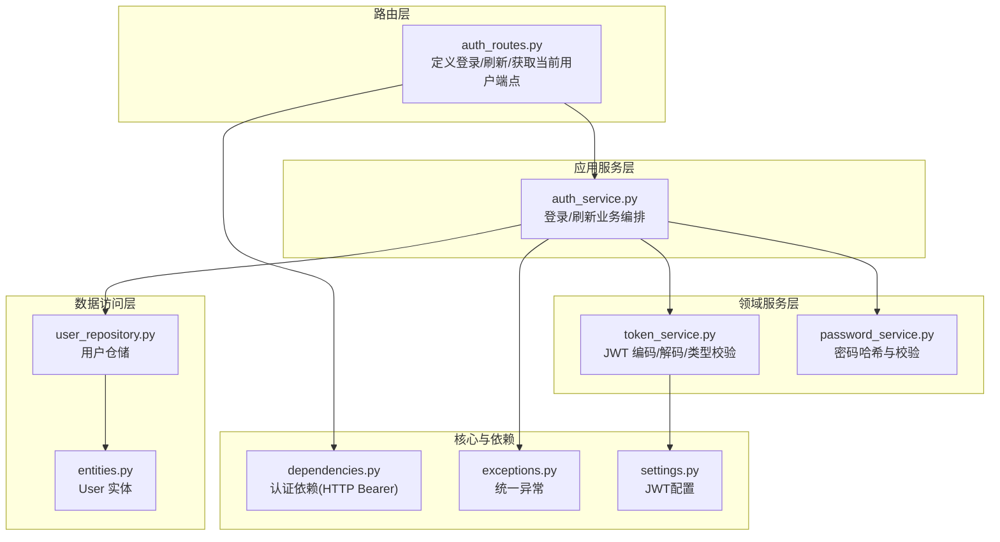
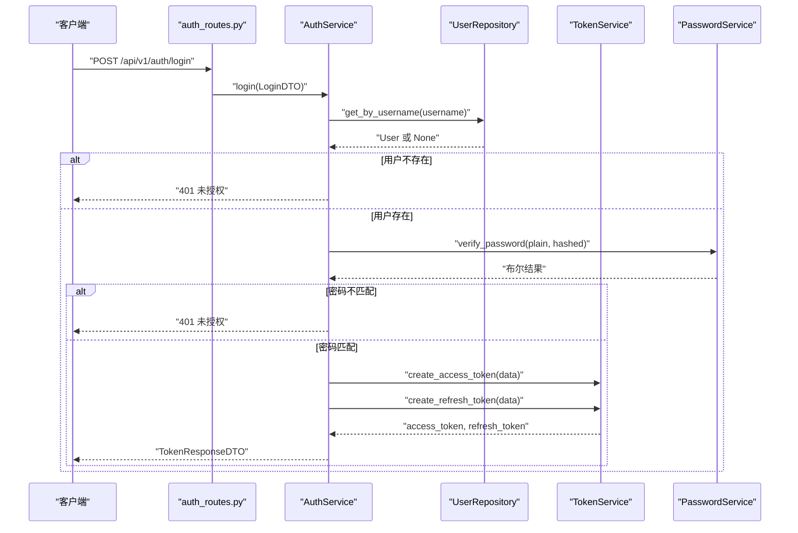
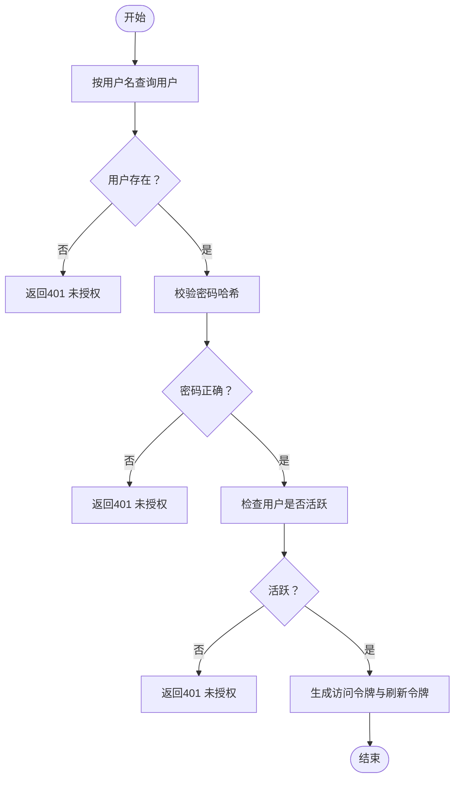
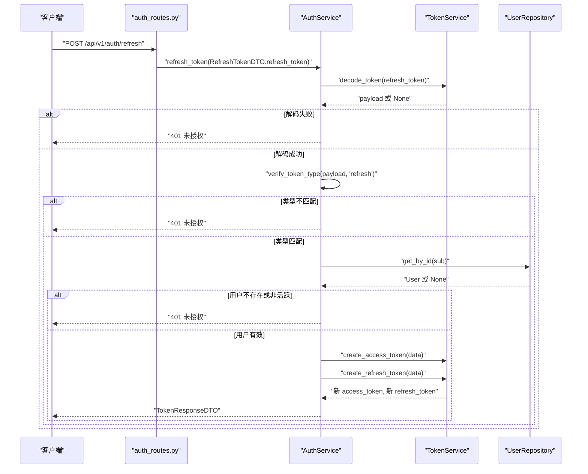
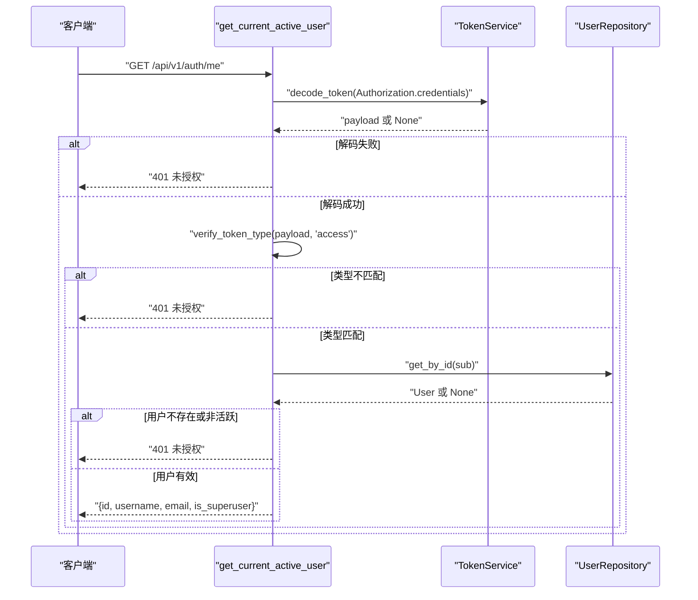
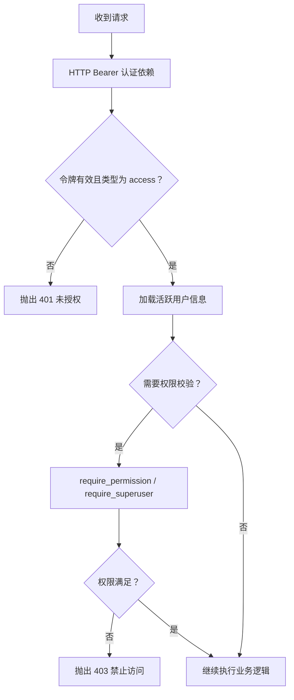
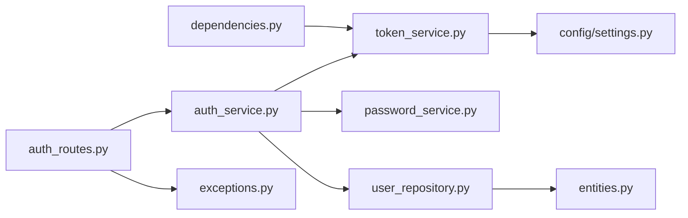

# 认证接口

<cite>
**本文引用的文件**
- [src/api/v1/auth_routes.py](file://src/api/v1/auth_routes.py)
- [src/application/dto/auth_dto.py](file://src/application/dto/auth_dto.py)
- [src/application/services/auth_service.py](file://src/application/services/auth_service.py)
- [src/domain/auth/token_service.py](file://src/domain/auth/token_service.py)
- [src/domain/auth/password_service.py](file://src/domain/auth/password_service.py)
- [src/api/dependencies.py](file://src/api/dependencies.py)
- [src/infrastructure/repositories/user_repository.py](file://src/infrastructure/repositories/user_repository.py)
- [src/domain/user/entities.py](file://src/domain/user/entities.py)
- [src/core/exceptions.py](file://src/core/exceptions.py)
- [src/tests/integration/test_api.py](file://src/tests/integration/test_api.py)
- [config/settings.py](file://config/settings.py)
</cite>

## 目录
1. [简介](#简介)
2. [项目结构](#项目结构)
3. [核心组件](#核心组件)
4. [架构总览](#架构总览)
5. [详细组件分析](#详细组件分析)
6. [依赖分析](#依赖分析)
7. [性能考虑](#性能考虑)
8. [故障排查指南](#故障排查指南)
9. [结论](#结论)
10. [附录](#附录)

## 简介
本文件面向认证相关API接口，系统性梳理以下三个端点：
- 用户登录：POST /api/v1/auth/login
- 令牌刷新：POST /api/v1/auth/refresh
- 获取当前用户：GET /api/v1/auth/me

内容涵盖请求参数、业务流程、响应结构、JWT令牌类型与有效期、认证中间件与权限校验机制，以及常见错误码与处理建议。

## 项目结构
认证功能主要分布在以下层次：
- 路由层：定义REST端点与依赖注入
- 应用服务层：编排业务逻辑（用户查询、密码校验、令牌签发）
- 领域服务层：JWT编码/解码、密码哈希与校验
- 数据访问层：用户仓储，负责持久化读写
- 核心异常与依赖：统一异常、HTTP Bearer认证依赖、权限依赖工厂

图表来源
- [src/api/v1/auth_routes.py:11-33](file://src/api/v1/auth_routes.py#L11-L33)
- [src/application/services/auth_service.py:13-66](file://src/application/services/auth_service.py#L13-L66)
- [src/domain/auth/token_service.py:9-41](file://src/domain/auth/token_service.py#L9-L41)
- [src/domain/auth/password_service.py:6-24](file://src/domain/auth/password_service.py#L6-L24)
- [src/infrastructure/repositories/user_repository.py:11-61](file://src/infrastructure/repositories/user_repository.py#L11-L61)
- [src/domain/user/entities.py:16-38](file://src/domain/user/entities.py#L16-L38)
- [src/api/dependencies.py:13-83](file://src/api/dependencies.py#L13-L83)
- [src/core/exceptions.py:6-53](file://src/core/exceptions.py#L6-L53)
- [config/settings.py:26-29](file://config/settings.py#L26-L29)

章节来源
- [src/api/v1/auth_routes.py:11-33](file://src/api/v1/auth_routes.py#L11-L33)
- [src/application/services/auth_service.py:13-66](file://src/application/services/auth_service.py#L13-L66)
- [src/api/dependencies.py:13-83](file://src/api/dependencies.py#L13-L83)

## 核心组件
- 认证路由：定义登录、刷新、获取当前用户三个端点，绑定对应处理器函数与依赖。
- 认证服务：封装登录与刷新的核心业务逻辑，包括用户查询、密码校验、令牌生成与刷新。
- 令牌服务：提供JWT访问令牌与刷新令牌的生成、解码与类型校验。
- 密码服务：提供密码哈希与校验。
- 用户仓储：基于SQLAlchemy异步会话，提供按ID/用户名等查询用户的能力。
- 认证依赖：从Authorization头解析并校验JWT，提取用户ID并加载活跃用户信息；提供权限与超级用户依赖工厂。
- 统一异常：集中定义401/403/404/422/429等错误类型，便于全局处理。

章节来源
- [src/application/dto/auth_dto.py:6-25](file://src/application/dto/auth_dto.py#L6-L25)
- [src/application/services/auth_service.py:13-66](file://src/application/services/auth_service.py#L13-L66)
- [src/domain/auth/token_service.py:9-41](file://src/domain/auth/token_service.py#L9-L41)
- [src/domain/auth/password_service.py:6-24](file://src/domain/auth/password_service.py#L6-L24)
- [src/infrastructure/repositories/user_repository.py:11-61](file://src/infrastructure/repositories/user_repository.py#L11-L61)
- [src/api/dependencies.py:13-83](file://src/api/dependencies.py#L13-L83)
- [src/core/exceptions.py:6-53](file://src/core/exceptions.py#L6-L53)

## 架构总览
下图展示认证端点到应用服务、领域服务与仓储的整体调用链路。

图表来源
- [src/api/v1/auth_routes.py:14-18](file://src/api/v1/auth_routes.py#L14-L18)
- [src/application/services/auth_service.py:21-40](file://src/application/services/auth_service.py#L21-L40)
- [src/infrastructure/repositories/user_repository.py:22-25](file://src/infrastructure/repositories/user_repository.py#L22-L25)
- [src/domain/auth/token_service.py:12-26](file://src/domain/auth/token_service.py#L12-L26)
- [src/domain/auth/password_service.py:18-23](file://src/domain/auth/password_service.py#L18-L23)

## 详细组件分析

### 用户登录接口 /api/v1/auth/login
- 方法与路径
  - POST /api/v1/auth/login
- 请求体参数（LoginDTO）
  - 字段
    - username: 字符串，必填
    - password: 字符串，必填
- 响应体（TokenResponseDTO）
  - 字段
    - access_token: 字符串，JWT访问令牌
    - refresh_token: 字符串，JWT刷新令牌
    - token_type: 字符串，默认为 "bearer"
- 处理流程
  - 通过用户名查询用户
  - 校验密码哈希
  - 校验用户状态为活跃
  - 生成访问令牌与刷新令牌
  - 返回响应DTO
- 错误场景
  - 用户名或密码错误：401 未授权
  - 用户被禁用：401 未授权
- 示例
  - 成功时返回包含 access_token、refresh_token 与 token_type 的JSON
  - 失败时返回401及错误详情

图表来源
- [src/application/services/auth_service.py:21-40](file://src/application/services/auth_service.py#L21-L40)
- [src/infrastructure/repositories/user_repository.py:22-25](file://src/infrastructure/repositories/user_repository.py#L22-L25)
- [src/domain/auth/password_service.py:18-23](file://src/domain/auth/password_service.py#L18-L23)

章节来源
- [src/api/v1/auth_routes.py:14-18](file://src/api/v1/auth_routes.py#L14-L18)
- [src/application/dto/auth_dto.py:6-19](file://src/application/dto/auth_dto.py#L6-L19)
- [src/application/services/auth_service.py:21-40](file://src/application/services/auth_service.py#L21-L40)
- [src/tests/integration/test_api.py:27-66](file://src/tests/integration/test_api.py#L27-L66)

### 令牌刷新接口 /api/v1/auth/refresh
- 方法与路径
  - POST /api/v1/auth/refresh
- 请求体参数（RefreshTokenDTO）
  - 字段
    - refresh_token: 字符串，必填
- 响应体（TokenResponseDTO）
  - 字段
    - access_token: 新的JWT访问令牌
    - refresh_token: 新的JWT刷新令牌
    - token_type: 默认 "bearer"
- 处理流程
  - 解码并验证刷新令牌
  - 校验令牌类型为 "refresh"
  - 从载荷提取用户ID并查询用户
  - 校验用户存在且活跃
  - 重新签发访问令牌与刷新令牌
  - 返回响应DTO
- 使用场景
  - 访问令牌过期但刷新令牌有效时，换取新的访问令牌
- 错误场景
  - 刷新令牌无效或过期：401 未授权
  - 令牌类型不是刷新令牌：401 未授权
  - 用户不存在或被禁用：401 未授权

图表来源
- [src/api/v1/auth_routes.py:21-25](file://src/api/v1/auth_routes.py#L21-L25)
- [src/application/services/auth_service.py:42-66](file://src/application/services/auth_service.py#L42-L66)
- [src/domain/auth/token_service.py:28-40](file://src/domain/auth/token_service.py#L28-L40)
- [src/infrastructure/repositories/user_repository.py:17-20](file://src/infrastructure/repositories/user_repository.py#L17-L20)

章节来源
- [src/api/v1/auth_routes.py:21-25](file://src/api/v1/auth_routes.py#L21-L25)
- [src/application/dto/auth_dto.py:21-25](file://src/application/dto/auth_dto.py#L21-L25)
- [src/application/services/auth_service.py:42-66](file://src/application/services/auth_service.py#L42-L66)
- [src/tests/integration/test_api.py:27-66](file://src/tests/integration/test_api.py#L27-L66)

### 获取当前用户接口 /api/v1/auth/me
- 方法与路径
  - GET /api/v1/auth/me
- 认证与权限
  - 依赖HTTP Bearer认证，要求携带有效的访问令牌
  - 依赖解析并校验令牌，提取用户ID并加载活跃用户信息
- 响应体
  - 字段
    - id: 字符串，用户ID
    - username: 字符串，用户名
    - email: 字符串，邮箱
    - is_superuser: 布尔，是否超级用户
- 错误场景
  - 缺少或无效令牌：401 未授权
  - 令牌类型不是访问令牌：401 未授权
  - 用户不存在或被禁用：401 未授权
  - 未提供Authorization头：401/403（取决于具体实现）

图表来源
- [src/api/dependencies.py:34-50](file://src/api/dependencies.py#L34-L50)
- [src/domain/auth/token_service.py:28-40](file://src/domain/auth/token_service.py#L28-L40)
- [src/infrastructure/repositories/user_repository.py:17-20](file://src/infrastructure/repositories/user_repository.py#L17-L20)

章节来源
- [src/api/v1/auth_routes.py:28-33](file://src/api/v1/auth_routes.py#L28-L33)
- [src/api/dependencies.py:34-50](file://src/api/dependencies.py#L34-L50)
- [src/tests/integration/test_api.py:67-91](file://src/tests/integration/test_api.py#L67-L91)

### 认证中间件与权限验证流程
- HTTP Bearer认证
  - 从Authorization头提取凭据，校验JWT有效性与类型
  - 提取用户ID并加载活跃用户信息
- 权限依赖工厂
  - require_permission：校验用户是否拥有指定权限
  - require_superuser：校验是否为超级用户
- 中间件
  - 请求日志中间件：记录请求方法、路径、客户端IP与处理耗时
  - IP黑白名单中间件：根据配置放行或拒绝请求

图表来源
- [src/api/dependencies.py:13-83](file://src/api/dependencies.py#L13-L83)
- [src/core/middlewares.py:12-64](file://src/core/middlewares.py#L12-L64)

章节来源
- [src/api/dependencies.py:53-83](file://src/api/dependencies.py#L53-L83)
- [src/core/middlewares.py:12-64](file://src/core/middlewares.py#L12-L64)

## 依赖分析
- 路由依赖应用服务，应用服务依赖仓储、令牌服务与密码服务
- 认证依赖依赖令牌服务进行JWT解码与类型校验
- 令牌服务依赖配置模块读取密钥与算法、过期时间等参数

图表来源
- [src/api/v1/auth_routes.py:3-9](file://src/api/v1/auth_routes.py#L3-L9)
- [src/application/services/auth_service.py:3-10](file://src/application/services/auth_service.py#L3-L10)
- [src/domain/auth/token_service.py:3-6](file://src/domain/auth/token_service.py#L3-L6)
- [src/api/dependencies.py:7-11](file://src/api/dependencies.py#L7-L11)
- [config/settings.py:26-29](file://config/settings.py#L26-L29)

章节来源
- [src/api/v1/auth_routes.py:3-9](file://src/api/v1/auth_routes.py#L3-L9)
- [src/application/services/auth_service.py:3-10](file://src/application/services/auth_service.py#L3-L10)
- [src/api/dependencies.py:7-11](file://src/api/dependencies.py#L7-L11)

## 性能考虑
- 令牌生成与解码为轻量级操作，主要开销在数据库查询与密码校验
- 建议
  - 对用户查询使用索引（用户名、邮箱、ID）
  - 合理设置访问令牌与刷新令牌的过期时间
  - 在高并发场景下，确保数据库连接池与缓存策略合理

## 故障排查指南
- 常见错误码与原因
  - 401 未授权
    - 登录时用户名或密码错误
    - 刷新时刷新令牌无效、过期或类型不正确
    - 访问令牌无效、过期或类型不正确
    - 用户不存在或被禁用
  - 403 禁止访问
    - 权限不足或非超级用户尝试访问超级用户接口
- 排查步骤
  - 确认Authorization头格式为 "Bearer <access_token>"
  - 确认令牌未过期且类型正确
  - 确认用户处于活跃状态
  - 检查服务端日志中间件输出的请求与响应信息
- 参考测试
  - 集成测试覆盖了登录成功、登录失败、获取当前用户成功与失败等场景

章节来源
- [src/core/exceptions.py:27-38](file://src/core/exceptions.py#L27-L38)
- [src/tests/integration/test_api.py:27-91](file://src/tests/integration/test_api.py#L27-L91)

## 结论
本认证体系采用JWT访问令牌与刷新令牌分离的设计，结合HTTP Bearer认证与权限依赖工厂，提供了清晰的登录、刷新与用户信息获取能力。通过仓储与领域服务的分层设计，保证了业务逻辑的可维护性与可测试性。建议在生产环境中妥善管理密钥、合理设置令牌有效期，并配合中间件与异常处理机制提升可观测性与安全性。

## 附录

### 请求与响应示例
- 登录成功
  - 请求：POST /api/v1/auth/login
  - 请求体：{"username": "...", "password": "..."}
  - 响应：{"access_token": "...", "refresh_token": "...", "token_type": "bearer"}
- 刷新令牌
  - 请求：POST /api/v1/auth/refresh
  - 请求体：{"refresh_token": "..."}
  - 响应：{"access_token": "...", "refresh_token": "...", "token_type": "bearer"}
- 获取当前用户
  - 请求：GET /api/v1/auth/me
  - 请求头：Authorization: Bearer <access_token>
  - 响应：{"id": "...", "username": "...", "email": "...", "is_superuser": false}

章节来源
- [src/tests/integration/test_api.py:27-91](file://src/tests/integration/test_api.py#L27-L91)

### JWT配置要点
- 密钥与算法
  - JWT_SECRET_KEY：用于签名的密钥
  - JWT_ALGORITHM：签名算法
- 过期时间
  - ACCESS_TOKEN_EXPIRE_MINUTES：访问令牌分钟数
  - REFRESH_TOKEN_EXPIRE_DAYS：刷新令牌天数

章节来源
- [config/settings.py:26-29](file://config/settings.py#L26-L29)