# API 响应标准

<cite>
**本文档引用的文件**
- [common.py](file://service/src/api/common.py)
- [exceptions.py](file://service/src/core/exceptions.py)
- [auth_routes.py](file://service/src/api/v1/auth_routes.py)
- [user_routes.py](file://service/src/api/v1/user_routes.py)
- [menu_routes.py](file://service/src/api/v1/menu_routes.py)
- [rbac_routes.py](file://service/src/api/v1/rbac_routes.py)
- [system_routes.py](file://service/src/api/v1/system_routes.py)
- [dependencies.py](file://service/src/api/dependencies.py)
- [auth_dto.py](file://service/src/application/dto/auth_dto.py)
- [user_dto.py](file://service/src/application/dto/user_dto.py)
- [settings.py](file://service/src/config/settings.py)
- [middlewares.py](file://service/src/core/middlewares.py)
- [main.py](file://service/src/main.py)
- [constants.py](file://service/src/core/constants.py)
- [index.ts](file://web/src/utils/http/index.ts)
- [types.d.ts](file://web/src/utils/http/types.d.ts)
- [system.ts](file://web/src/api/system.ts)
- [test_api.py](file://service/tests/integration/test_api.py)
</cite>

## 更新摘要
**所做更改**
- 更新统一响应格式以匹配Pure Admin前端标准
- 新增Pure Admin前端响应格式的详细说明
- 更新响应代码和消息格式的标准化要求
- 增强前后端一致性响应格式的文档说明

## 目录
1. [简介](#简介)
2. [项目结构](#项目结构)
3. [核心组件](#核心组件)
4. [架构概览](#架构概览)
5. [详细组件分析](#详细组件分析)
6. [依赖分析](#依赖分析)
7. [性能考虑](#性能考虑)
8. [故障排除指南](#故障排除指南)
9. [结论](#结论)

## 简介

本项目采用统一的API响应标准，基于Pure Admin前端框架设计，确保前后端交互的一致性和规范性。该标准通过标准化的响应格式、错误处理机制和权限控制，为整个系统的API接口提供了统一的规范。

**更新** 本版本重点更新了统一响应系统的标准化，完全匹配Pure Admin前端标准的响应代码和消息格式，确保前后端一致的响应格式。

## 项目结构

项目采用分层架构设计，主要分为以下层次：

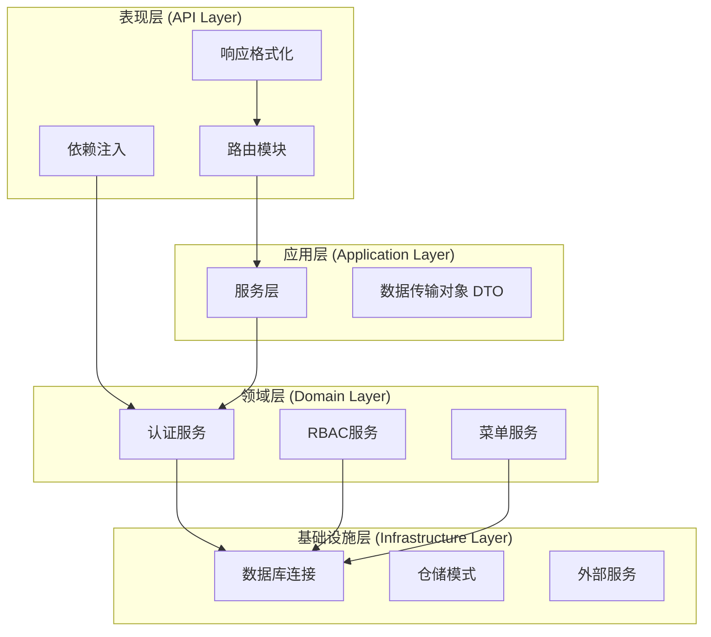

**图表来源**
- [main.py:34-96](file://service/src/main.py#L34-L96)
- [constants.py:1-37](file://service/src/core/constants.py#L1-L37)

**章节来源**
- [main.py:1-96](file://service/src/main.py#L1-L96)
- [constants.py:1-37](file://service/src/core/constants.py#L1-L37)

## 核心组件

### 统一响应格式

系统实现了标准化的响应格式，确保所有API接口返回一致的数据结构，并完全匹配Pure Admin前端标准：

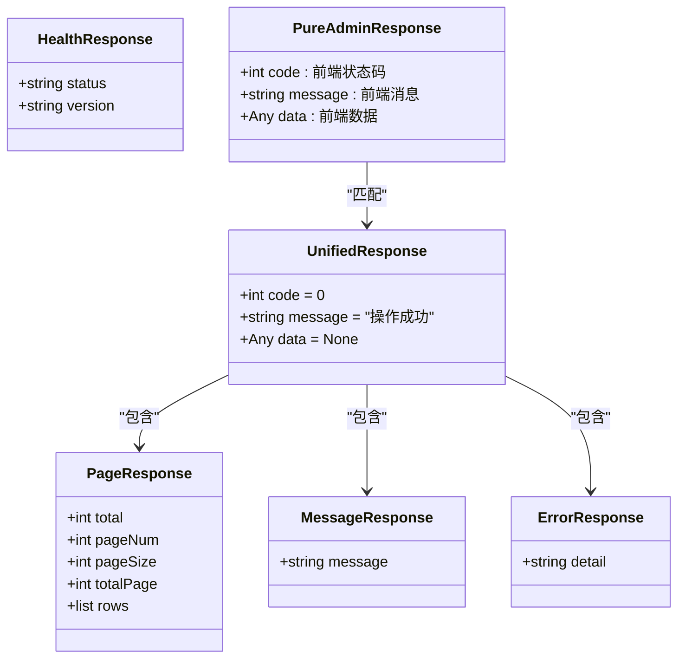

**图表来源**
- [common.py:29-43](file://service/src/api/common.py#L29-L43)

**更新** 统一响应格式现已完全标准化，采用Pure Admin前端标准格式：
- `code`: 前端状态码，0表示成功，非0表示错误
- `message`: 前端消息，描述操作结果
- `data`: 前端数据，包含具体业务数据

### 错误处理机制

系统建立了完善的异常处理体系，支持多种类型的错误场景：

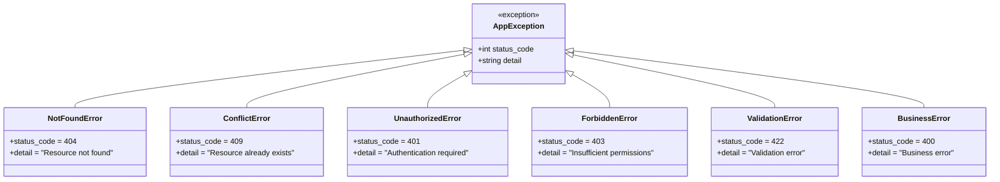

**图表来源**
- [exceptions.py:6-60](file://service/src/core/exceptions.py#L6-L60)

**章节来源**
- [common.py:1-88](file://service/src/api/common.py#L1-L88)
- [exceptions.py:1-60](file://service/src/core/exceptions.py#L1-L60)

## 架构概览

系统采用FastAPI框架构建，实现了现代化的API服务架构：

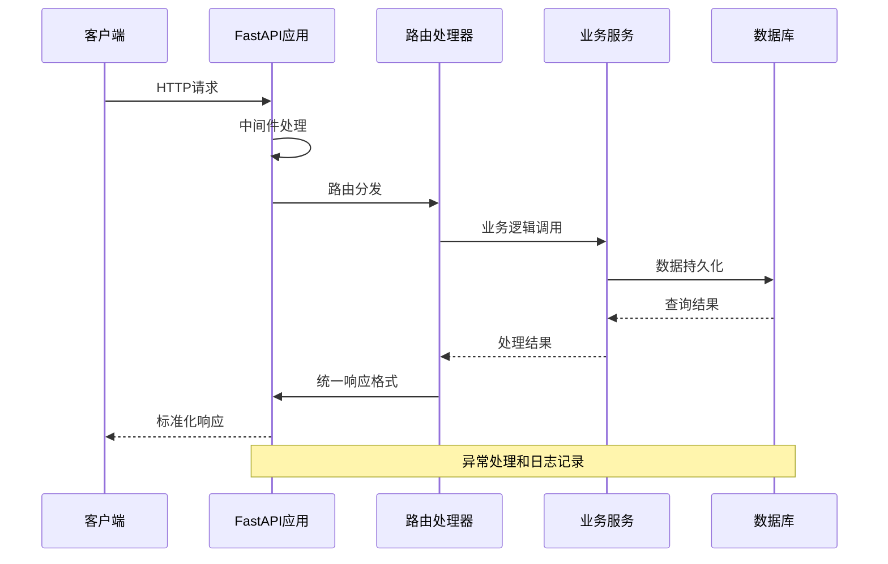

**图表来源**
- [main.py:60-83](file://service/src/main.py#L60-L83)
- [middlewares.py:12-39](file://service/src/core/middlewares.py#L12-L39)

## 详细组件分析

### 认证路由模块

认证模块提供了完整的用户身份验证功能，采用JWT令牌机制：

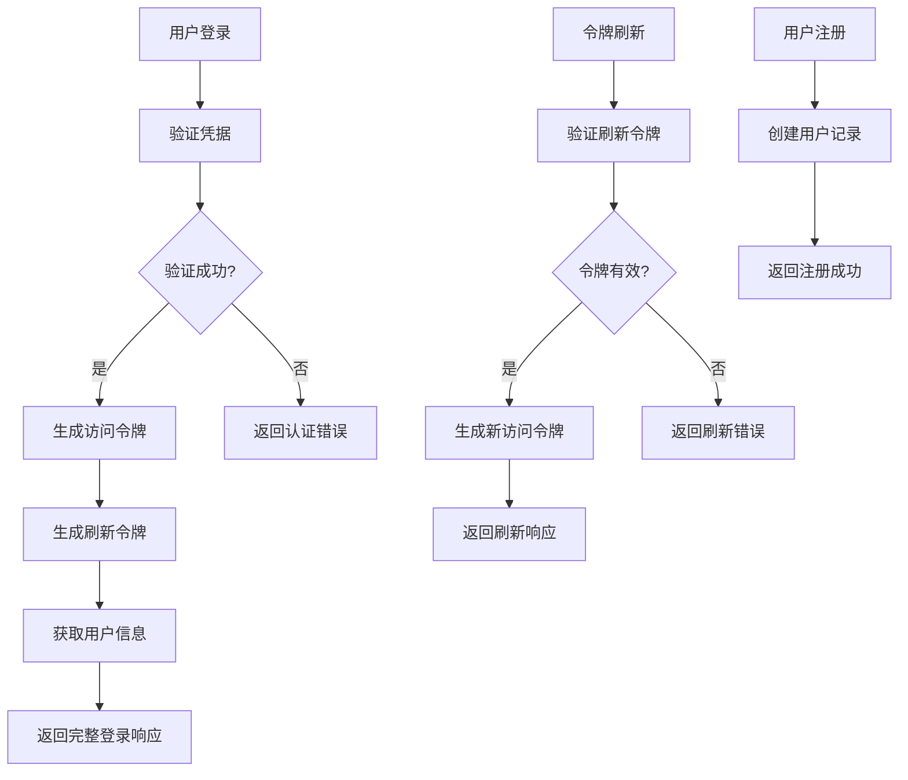

**图表来源**
- [auth_routes.py:23-89](file://service/src/api/v1/auth_routes.py#L23-L89)
- [auth_dto.py:7-54](file://service/src/application/dto/auth_dto.py#L7-L54)

认证路由的主要特点：
- 支持标准JWT令牌认证
- 提供登录、注册、登出、令牌刷新功能
- 集成RBAC权限控制
- 使用统一响应格式

**章节来源**
- [auth_routes.py:1-391](file://service/src/api/v1/auth_routes.py#L1-L391)
- [auth_dto.py:1-54](file://service/src/application/dto/auth_dto.py#L1-L54)

### 用户管理路由模块

用户管理模块实现了完整的用户生命周期管理：

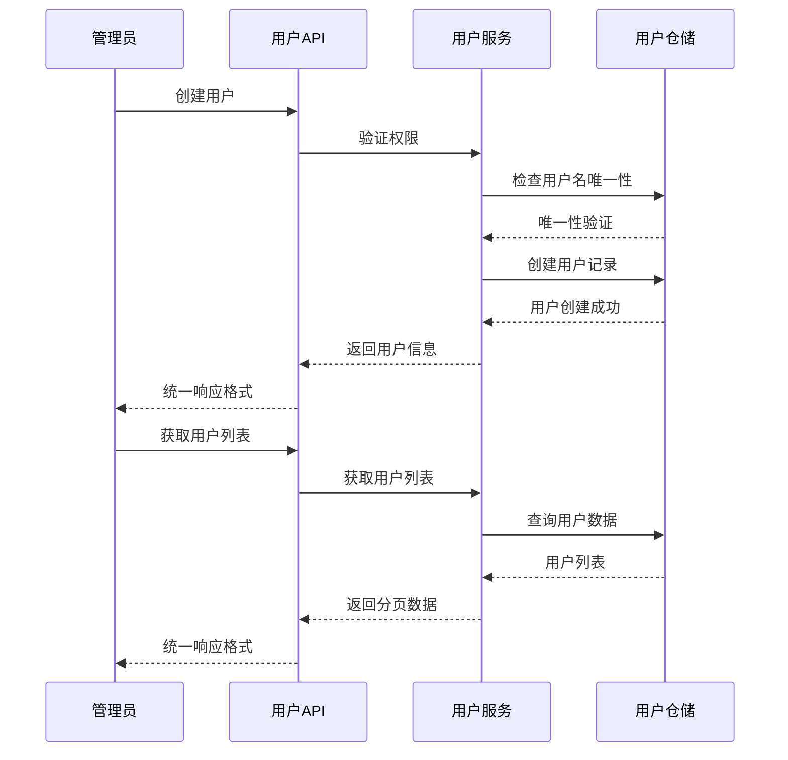

**图表来源**
- [user_routes.py:27-264](file://service/src/api/v1/user_routes.py#L27-L264)
- [user_dto.py:8-86](file://service/src/application/dto/user_dto.py#L8-L86)

用户管理的核心功能：
- 用户增删改查操作
- 批量用户管理
- 密码管理和状态控制
- 权限验证和RBAC集成

**章节来源**
- [user_routes.py:1-264](file://service/src/api/v1/user_routes.py#L1-L264)
- [user_dto.py:1-86](file://service/src/application/dto/user_dto.py#L1-L86)

### RBAC权限管理模块

RBAC模块提供了细粒度的权限控制机制：

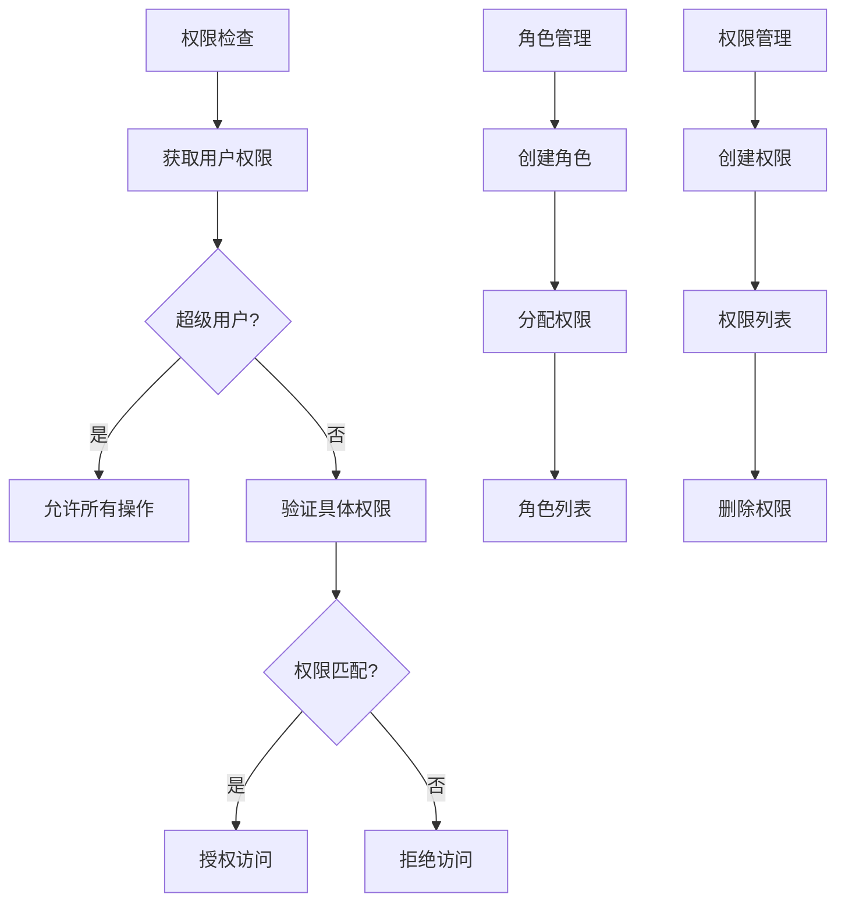

**图表来源**
- [rbac_routes.py:33-271](file://service/src/api/v1/rbac_routes.py#L33-L271)
- [dependencies.py:45-60](file://service/src/api/dependencies.py#L45-L60)

RBAC系统的关键特性：
- 基于角色的权限控制
- 细粒度的权限验证
- 动态权限分配
- 支持超级用户特权

**章节来源**
- [rbac_routes.py:1-271](file://service/src/api/v1/rbac_routes.py#L1-L271)
- [dependencies.py:1-72](file://service/src/api/dependencies.py#L1-L72)

### 菜单管理模块

菜单管理模块支持动态菜单配置和权限控制：

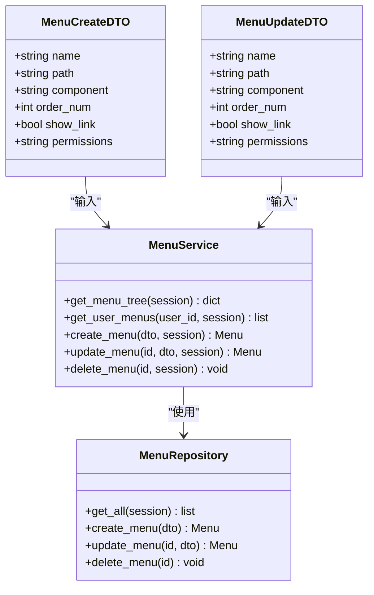

**图表来源**
- [menu_routes.py:21-121](file://service/src/api/v1/menu_routes.py#L21-L121)

菜单管理的功能特性：
- 支持菜单树形结构
- 动态菜单权限控制
- 用户个性化菜单展示
- 完整的CRUD操作

**章节来源**
- [menu_routes.py:1-121](file://service/src/api/v1/menu_routes.py#L1-L121)

### 系统监控模块

系统监控模块提供各种系统状态和日志信息：

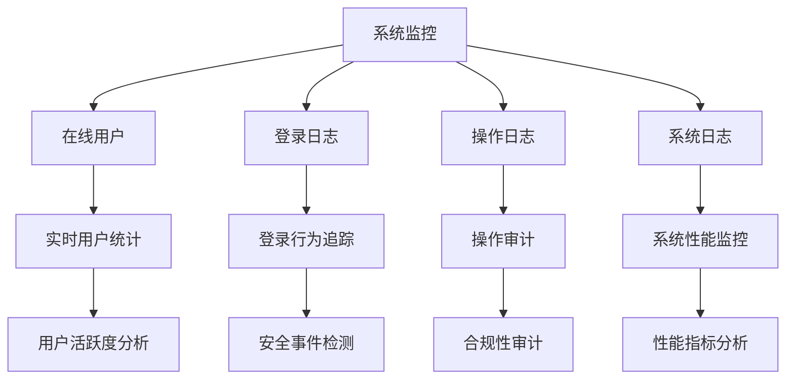

**图表来源**
- [system_routes.py:16-128](file://service/src/api/v1/system_routes.py#L16-L128)

系统监控的主要功能：
- 在线用户实时监控
- 安全日志追踪
- 操作行为审计
- 系统性能监控

**章节来源**
- [system_routes.py:1-128](file://service/src/api/v1/system_routes.py#L1-L128)

## 依赖分析

系统采用模块化的依赖管理，确保各组件间的松耦合：

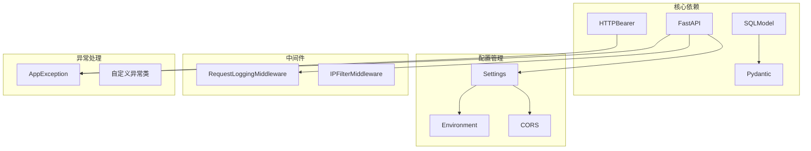

**图表来源**
- [main.py:34-96](file://service/src/main.py#L34-L96)
- [settings.py:41-198](file://service/src/config/settings.py#L41-L198)
- [middlewares.py:12-65](file://service/src/core/middlewares.py#L12-L65)

**章节来源**
- [main.py:1-96](file://service/src/main.py#L1-L96)
- [settings.py:1-198](file://service/src/config/settings.py#L1-L198)
- [middlewares.py:1-65](file://service/src/core/middlewares.py#L1-L65)

## 性能考虑

系统在设计时充分考虑了性能优化：

### 缓存策略
- 使用Redis进行会话和缓存管理
- 实现LRU缓存机制减少数据库查询
- 支持配置化的缓存过期策略

### 连接池管理
- 数据库连接池优化
- 异步数据库操作
- 连接复用和回收机制

### 响应优化
- 统一响应格式减少前端处理复杂度
- 分页查询避免大数据量传输
- 条件查询优化索引使用

## 故障排除指南

### 常见问题诊断

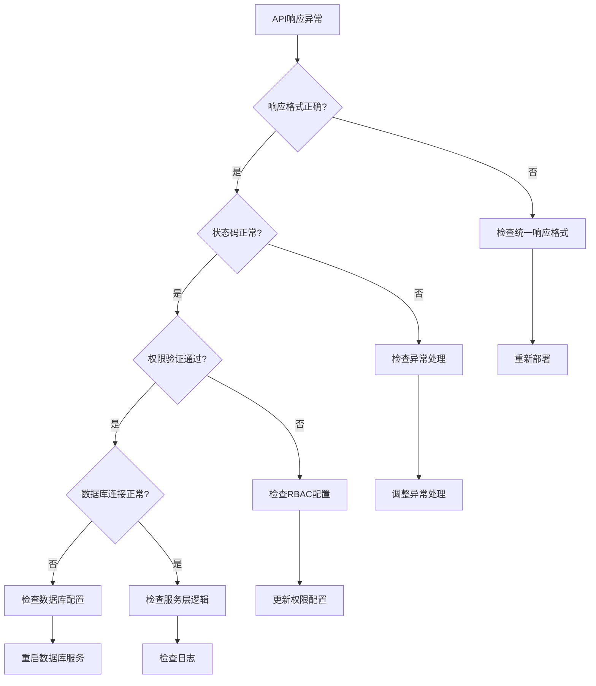

### 调试工具

系统提供了完善的调试和监控工具：

1. **请求日志中间件**：记录所有HTTP请求的详细信息
2. **异常处理机制**：统一的错误响应格式
3. **健康检查接口**：系统状态监控
4. **性能指标**：请求处理时间和资源使用情况

**章节来源**
- [middlewares.py:12-65](file://service/src/core/middlewares.py#L12-L65)
- [main.py:60-83](file://service/src/main.py#L60-L83)

## 结论

本项目的API响应标准通过统一的架构设计和严格的规范约束，为现代Web应用提供了可靠的技术基础。系统的主要优势包括：

1. **一致性**：统一的响应格式确保前后端交互的稳定性
2. **安全性**：完善的RBAC权限控制和JWT认证机制
3. **可扩展性**：模块化的架构设计支持功能扩展
4. **可维护性**：清晰的代码结构和文档规范
5. **性能优化**：合理的缓存策略和连接池管理

**更新** 本版本特别强调了与Pure Admin前端的完全兼容性，通过标准化的响应代码和消息格式，确保前后端一致的响应格式，为团队协作和项目长期发展奠定了坚实的基础，适用于各种规模的企业级应用开发。

### Pure Admin前端响应格式标准

系统现已完全匹配Pure Admin前端的响应格式标准：

- **响应结构**：`{"code": 0, "message": "操作成功", "data": null}`
- **成功状态**：`code = 0` 表示操作成功
- **错误状态**：`code ≠ 0` 表示操作失败，`message`提供错误描述
- **数据承载**：所有业务数据通过`data`字段传递
- **消息国际化**：`message`字段支持多语言消息

这种标准化确保了前后端开发的一致性，减少了接口对接的复杂度，提高了开发效率和系统稳定性。