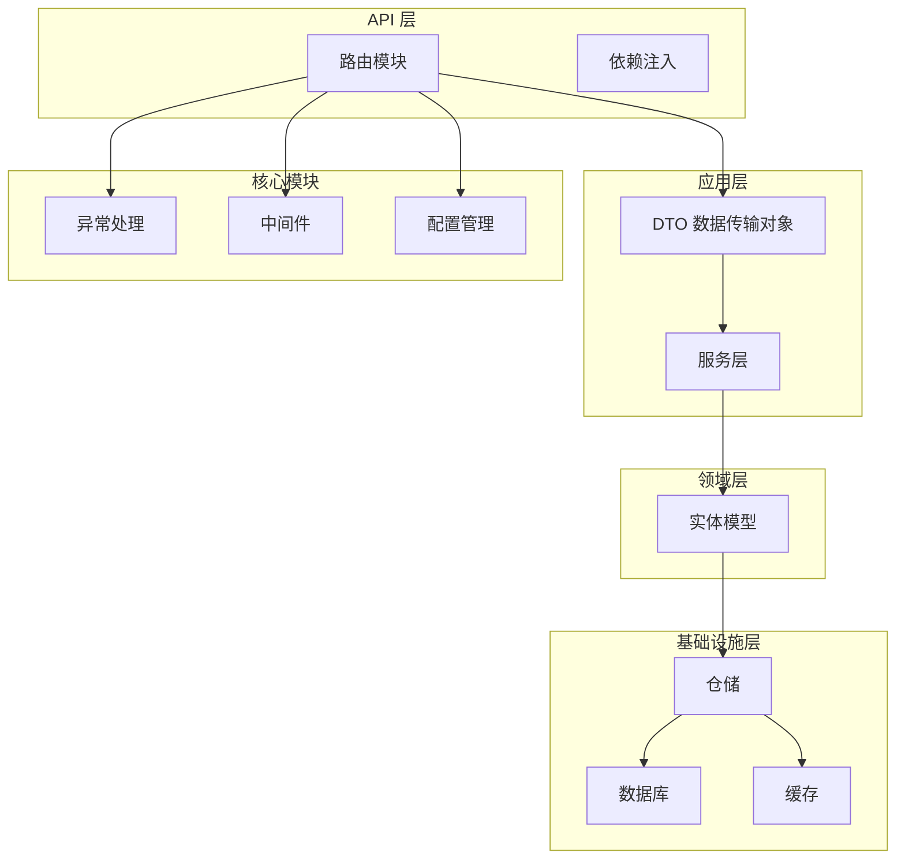
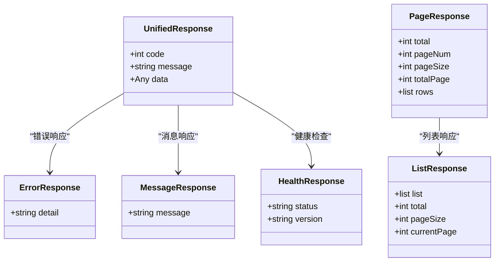
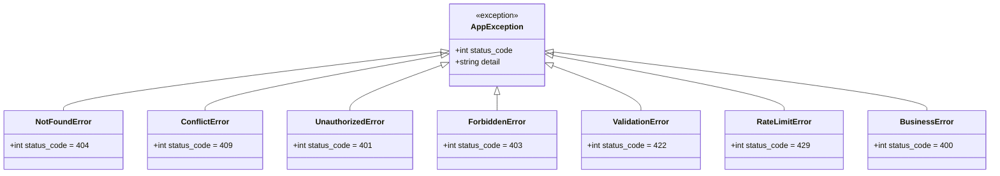
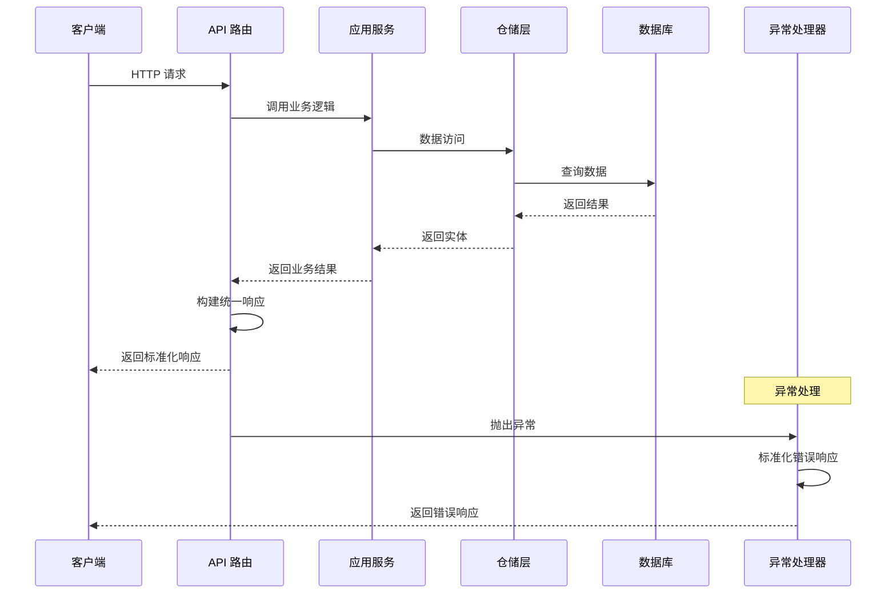
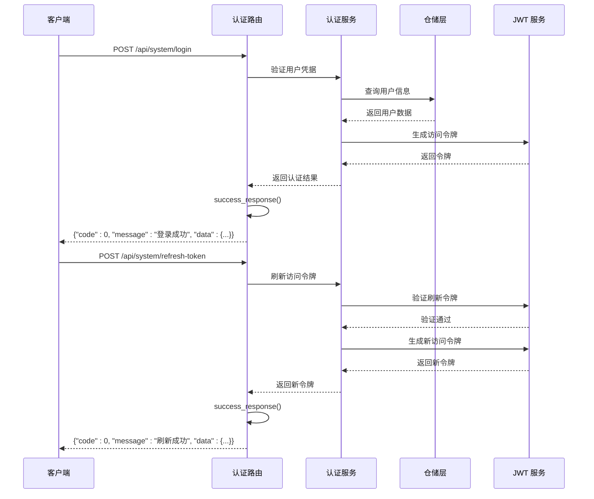
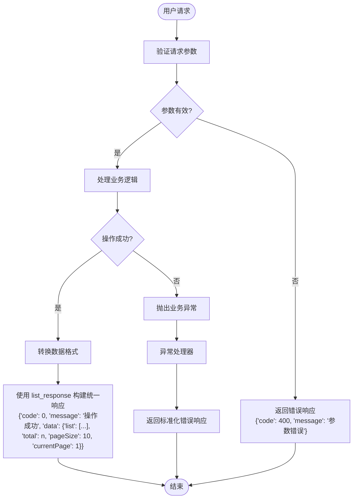
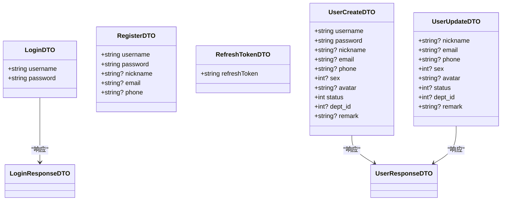
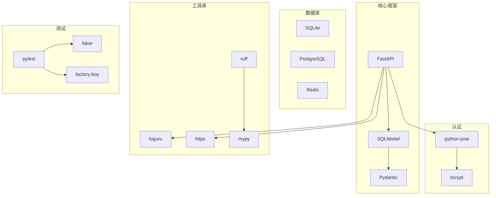
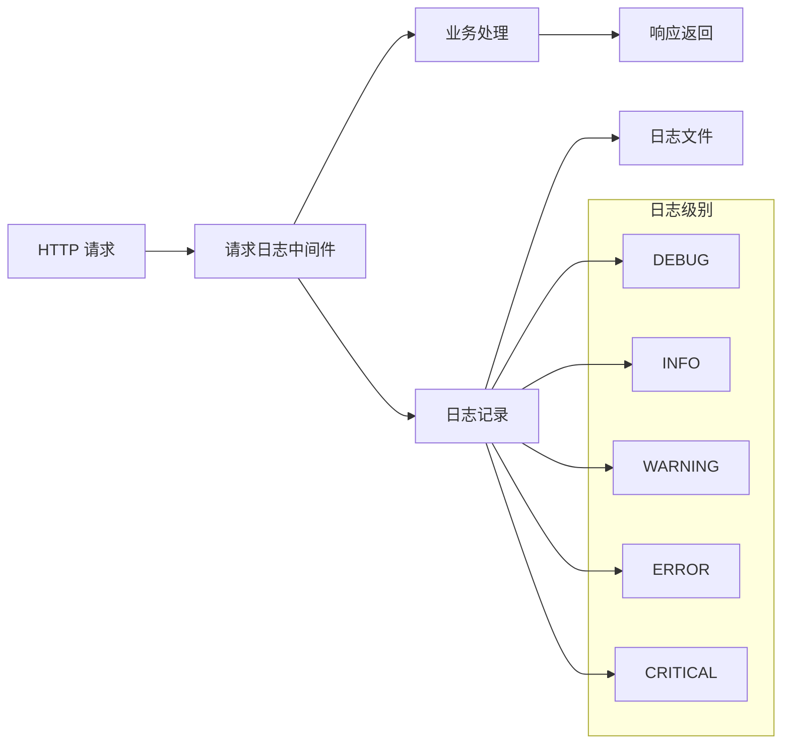

# API 响应标准

<cite>
**本文档引用的文件**
- [service/src/api/common.py](file://service/src/api/common.py)
- [service/src/main.py](file://service/src/main.py)
- [service/src/core/exceptions.py](file://service/src/core/exceptions.py)
- [service/src/api/v1/auth_routes.py](file://service/src/api/v1/auth_routes.py)
- [service/src/api/v1/user_routes.py](file://service/src/api/v1/user_routes.py)
- [service/src/api/v1/system_routes.py](file://service/src/api/v1/system_routes.py)
- [service/src/application/dto/auth_dto.py](file://service/src/application/dto/auth_dto.py)
- [service/src/application/dto/user_dto.py](file://service/src/application/dto/user_dto.py)
- [service/src/core/constants.py](file://service/src/core/constants.py)
- [service/src/core/middlewares.py](file://service/src/core/middlewares.py)
- [service/src/config/settings.py](file://service/src/config/settings.py)
- [service/pyproject.toml](file://service/pyproject.toml)
- [README.md](file://README.md)
- [service/README.md](file://service/README.md)
- [service/tests/integration/test_api.py](file://service/tests/integration/test_api.py)
</cite>

## 更新摘要
**变更内容**
- 统一的API响应格式标准化改进
- `list_response` 函数响应格式更新：从 `{"rows": rows, "total": total, "pageNum": page_num, "pageSize": page_size, "totalPage": total_page}` 改为 `{"list": list_data, "total": total, "pageSize": page_size, "currentPage": current_page}`
- `page_response` 函数标记为向后兼容，建议使用新的 `list_response`
- 增强的响应工具函数文档说明

## 目录
1. [简介](#简介)
2. [项目结构](#项目结构)
3. [核心组件](#核心组件)
4. [架构概览](#架构概览)
5. [详细组件分析](#详细组件分析)
6. [依赖分析](#依赖分析)
7. [性能考虑](#性能考虑)
8. [故障排除指南](#故障排除指南)
9. [结论](#结论)

## 简介

Hello-FastApi 是一个基于 FastAPI 框架的 RESTful API 服务，采用 DDD（领域驱动设计）架构和 RBAC 权限控制。该项目的核心特色之一是实现了标准化的 API 响应格式，确保前后端交互的一致性和可靠性。

该项目遵循 Pure Admin 前端标准，提供了统一的响应格式和错误处理机制，支持 JWT 双令牌认证、RBAC 细粒度权限控制、动态路由加载等功能。

**更新** 本版本重点改进了统一的API响应格式标准化，特别是分页响应格式的统一化处理。最新的响应格式采用更简洁的字段命名，移除了过时的 `pageNum` 和 `totalPage` 字段，使用 `currentPage` 作为替代。

## 项目结构

项目采用分层架构设计，主要分为以下几个层次：

**图表来源**
- [service/src/api/v1/__init__.py:1-46](file://service/src/api/v1/__init__.py#L1-L46)
- [service/src/application/dto/user_dto.py:1-124](file://service/src/application/dto/user_dto.py#L1-L124)
- [service/src/core/exceptions.py:1-60](file://service/src/core/exceptions.py#L1-L60)

**章节来源**
- [service/README.md:28-111](file://service/README.md#L28-L111)
- [README.md:48-76](file://README.md#L48-L76)

## 核心组件

### 统一响应格式

项目实现了标准化的 API 响应格式，确保所有接口返回一致的数据结构：

**图表来源**
- [service/src/api/common.py:30-49](file://service/src/api/common.py#L30-L49)

### 响应工具函数

项目提供了多种响应工具函数来简化 API 响应的构建，其中分页响应格式已标准化：

| 函数名称 | 功能描述 | 参数 | 返回值 | 更新说明 |
|---------|---------|------|--------|----------|
| success_response | 构建成功响应 | data: Any = None, message: str = "操作成功", code: int = 0 | dict | 标准化统一响应格式 |
| list_response | 构建列表响应 | list_data: list, total: int, page_size: int = 10, current_page: int = 1 | dict | **更新** 新格式：{"list": list_data, "total": total, "pageSize": page_size, "currentPage": current_page} |
| page_response | 构建分页响应 | rows: list, total: int, page_num: int, page_size: int | dict | **更新** 向后兼容，建议使用 list_response |
| error_response | 构建错误响应 | message: str, code: int = 400 | dict | 标准化错误响应格式 |

**更新** 分页响应格式标准化：`list_response` 函数现在使用新的响应格式，移除了 `pageNum` 和 `totalPage` 字段，改为更简洁的 `currentPage` 字段，与前端 Pure Admin 标准保持一致。这种变化提高了响应格式的简洁性和一致性。

**章节来源**
- [service/src/api/common.py:51-93](file://service/src/api/common.py#L51-L93)

### 自定义异常类

项目实现了完整的异常处理体系，提供语义化的错误响应：

**图表来源**
- [service/src/core/exceptions.py:6-59](file://service/src/core/exceptions.py#L6-L59)

**章节来源**
- [service/src/core/exceptions.py:1-60](file://service/src/core/exceptions.py#L1-L60)

## 架构概览

项目采用 FastAPI 框架，实现了完整的 API 响应标准体系：

**图表来源**
- [service/src/main.py:61-73](file://service/src/main.py#L61-L73)
- [service/src/api/common.py:51-93](file://service/src/api/common.py#L51-L93)

## 详细组件分析

### 认证接口响应标准

认证模块实现了完整的用户认证流程，所有接口都遵循统一的响应格式：

**图表来源**
- [service/src/api/v1/auth_routes.py:28-94](file://service/src/api/v1/auth_routes.py#L28-L94)
- [service/src/api/common.py:51](file://service/src/api/common.py#L51)

**章节来源**
- [service/src/api/v1/auth_routes.py:1-265](file://service/src/api/v1/auth_routes.py#L1-L265)

### 用户管理接口响应标准

用户管理模块提供了完整的 CRUD 操作，所有接口都遵循统一的响应格式。**更新** 分页响应现在使用标准化的 `list_response` 函数，采用新的响应格式：

**更新** 分页响应格式标准化：使用新的 `list_response` 函数，返回格式为 `{"list": list_data, "total": total, "pageSize": page_size, "currentPage": current_page}`，移除了 `pageNum` 和 `totalPage` 字段，与前端 Pure Admin 标准保持一致。这种变化简化了响应结构，提高了前后端交互的效率。

**图表来源**
- [service/src/api/v1/user_routes.py:17-36](file://service/src/api/v1/user_routes.py#L17-L36)
- [service/src/api/common.py:60-72](file://service/src/api/common.py#L60-L72)

**章节来源**
- [service/src/api/v1/user_routes.py:1-208](file://service/src/api/v1/user_routes.py#L1-L208)

### 系统管理接口响应标准

系统管理模块提供了部门管理、日志管理等功能，所有接口都遵循统一的响应格式。**更新** 日志管理接口现在使用标准化的 `list_response` 函数，采用新的响应格式：

**章节来源**
- [service/src/api/v1/system_routes.py:1-336](file://service/src/api/v1/system_routes.py#L1-L336)

### 数据传输对象（DTO）

项目使用 Pydantic 实现数据验证和序列化：

**图表来源**
- [service/src/application/dto/auth_dto.py:6-53](file://service/src/application/dto/auth_dto.py#L6-L53)
- [service/src/application/dto/user_dto.py:10-124](file://service/src/application/dto/user_dto.py#L10-L124)

**章节来源**
- [service/src/application/dto/auth_dto.py:1-53](file://service/src/application/dto/auth_dto.py#L1-L53)
- [service/src/application/dto/user_dto.py:1-124](file://service/src/application/dto/user_dto.py#L1-L124)

## 依赖分析

项目的技术栈和依赖关系如下：

**图表来源**
- [service/pyproject.toml:7-32](file://service/pyproject.toml#L7-L32)

**章节来源**
- [service/pyproject.toml:1-76](file://service/pyproject.toml#L1-L76)

## 性能考虑

项目在性能方面采用了多项优化措施：

1. **异步处理**：全面支持 async/await，提高并发处理能力
2. **连接池**：数据库连接池管理，减少连接开销
3. **缓存机制**：Redis 缓存提升数据访问速度
4. **中间件优化**：请求日志中间件，便于性能监控
5. **类型检查**：MyPy 类型检查，提前发现性能问题

## 故障排除指南

### 常见响应错误处理

项目实现了完善的异常处理机制：

| 错误类型 | HTTP 状态码 | 响应格式 | 处理建议 |
|---------|-------------|----------|----------|
| 未找到资源 | 404 | {"code": 404, "message": "Resource not found"} | 检查资源是否存在 |
| 权限不足 | 403 | {"code": 403, "message": "Insufficient permissions"} | 检查用户权限 |
| 认证失败 | 401 | {"code": 401, "message": "Authentication required"} | 检查令牌有效性 |
| 参数验证错误 | 422 | {"code": 422, "message": "参数验证失败", "errors": []} | 检查请求参数 |
| 业务逻辑错误 | 400 | {"code": 400, "message": "Business error"} | 检查业务规则 |

**章节来源**
- [service/src/main.py:61-73](file://service/src/main.py#L61-L73)
- [service/src/core/exceptions.py:13-59](file://service/src/core/exceptions.py#L13-L59)

### 日志和监控

项目使用 Loguru 进行日志管理，支持请求日志中间件：

**图表来源**
- [service/src/core/middlewares.py:12-39](file://service/src/core/middlewares.py#L12-L39)

**章节来源**
- [service/src/core/middlewares.py:1-65](file://service/src/core/middlewares.py#L1-L65)

## 结论

Hello-FastApi 项目通过实现标准化的 API 响应格式和完善的异常处理机制，为前后端交互提供了可靠的保障。**更新** 本版本的重点改进包括：

1. **响应格式标准化**：统一的 `list_response` 函数确保分页响应格式的一致性
2. **向前兼容性**：`page_response` 函数保留向后兼容，但建议使用新的 `list_response`
3. **一致性增强**：所有接口遵循统一的响应格式，便于前端处理
4. **可维护性**：清晰的分层架构和模块化设计
5. **可扩展性**：基于 FastAPI 的高性能异步处理能力
6. **安全性**：JWT 双令牌认证和 RBAC 权限控制
7. **可观测性**：完整的日志记录和异常处理机制

**更新** 最新的响应格式标准化进一步提升了系统的可靠性和用户体验。新的 `list_response` 函数采用更简洁的字段命名（`currentPage` 替代 `pageNum`），减少了响应数据的冗余，提高了前后端交互的效率。这种变化体现了项目对前端标准的持续适配和优化。

这些特性使得该项目成为构建企业级 API 服务的良好参考实现，特别适合需要与前端框架（如 Pure Admin）进行深度集成的项目。新的响应格式标准化进一步提升了系统的可靠性和用户体验。