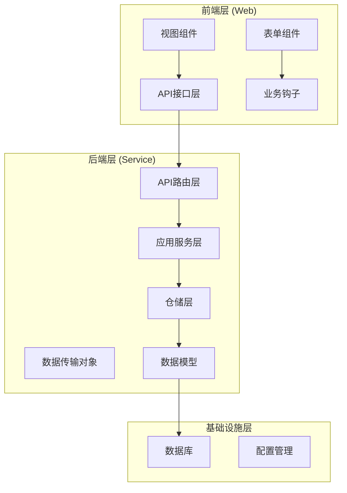
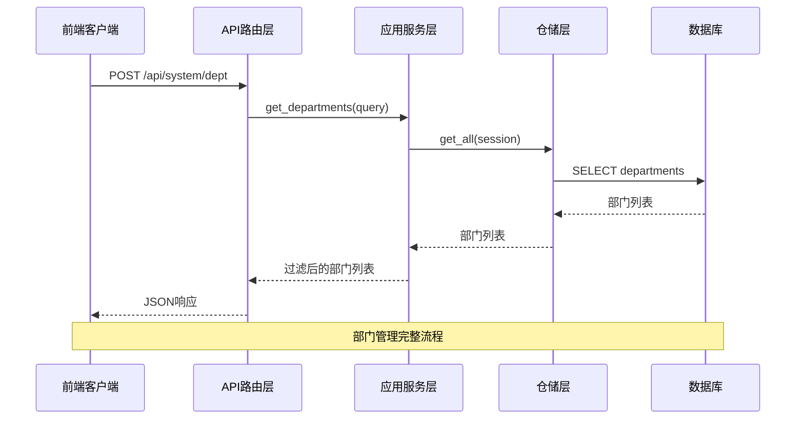
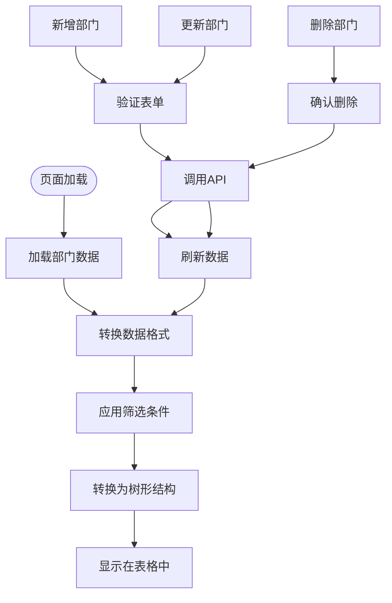
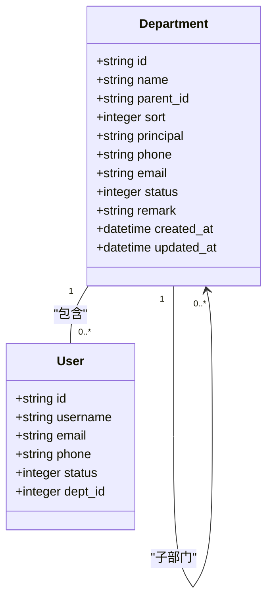
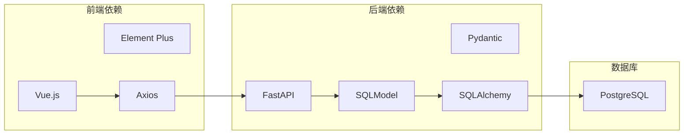
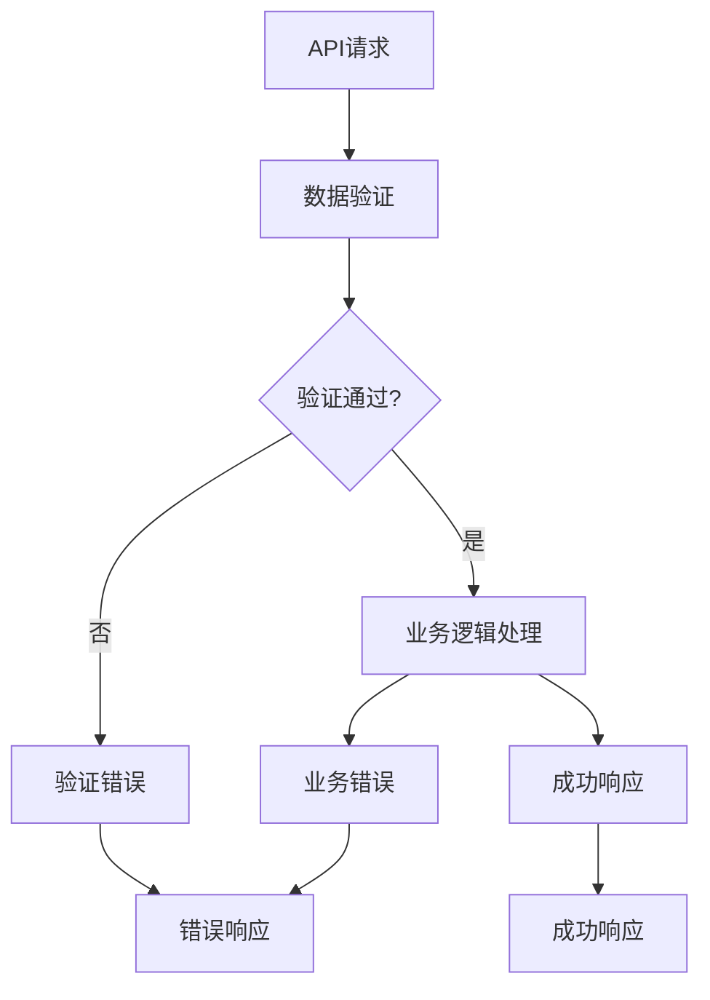

# 部门管理系统

<cite>
**本文档引用的文件**
- [department_dto.py](file://service/src/application/dto/department_dto.py)
- [department_service.py](file://service/src/application/services/department_service.py)
- [department_repository.py](file://service/src/infrastructure/repositories/department_repository.py)
- [system_routes.py](file://service/src/api/v1/system_routes.py)
- [models.py](file://service/src/infrastructure/database/models.py)
- [index.vue](file://web/src/views/system/dept/index.vue)
- [form.vue](file://web/src/views/system/dept/form.vue)
- [hook.tsx](file://web/src/views/system/dept/utils/hook.tsx)
- [rule.ts](file://web/src/views/system/dept/utils/rule.ts)
- [types.ts](file://web/src/views/system/dept/utils/types.ts)
- [system.ts](file://web/src/api/system.ts)
- [common.py](file://service/src/api/common.py)
- [exceptions.py](file://service/src/core/exceptions.py)
</cite>

## 目录
1. [简介](#简介)
2. [项目结构](#项目结构)
3. [核心组件](#核心组件)
4. [架构概览](#架构概览)
5. [详细组件分析](#详细组件分析)
6. [依赖关系分析](#依赖关系分析)
7. [性能考虑](#性能考虑)
8. [故障排除指南](#故障排除指南)
9. [结论](#结论)

## 简介

部门管理系统是基于FastAPI构建的企业级管理系统中的核心功能模块，负责企业组织架构的维护和管理。该系统采用前后端分离架构，后端使用Python FastAPI框架，前端使用Vue.js技术栈，实现了完整的部门信息管理功能。

系统支持部门的增删改查操作，具备树形结构的组织架构展示能力，提供完整的数据验证和业务逻辑处理。通过标准化的API接口，为前端提供了灵活的部门管理功能。

## 项目结构

部门管理系统采用清晰的分层架构设计，主要分为以下层次：

**图表来源**
- [system_routes.py:1-474](file://service/src/api/v1/system_routes.py#L1-L474)
- [department_service.py:1-156](file://service/src/application/services/department_service.py#L1-L156)
- [models.py:198-221](file://service/src/infrastructure/database/models.py#L198-L221)

**章节来源**
- [system_routes.py:1-474](file://service/src/api/v1/system_routes.py#L1-L474)
- [department_service.py:1-156](file://service/src/application/services/department_service.py#L1-L156)
- [models.py:198-221](file://service/src/infrastructure/database/models.py#L198-L221)

## 核心组件

### 数据传输对象 (DTO)

系统定义了完整的数据传输对象来确保前后端数据交换的规范性和安全性：

#### DepartmentCreateDTO
用于部门创建的数据传输对象，包含部门的基本信息验证和转换逻辑。

#### DepartmentUpdateDTO  
用于部门更新的数据传输对象，支持部分字段更新和数据类型转换。

#### DepartmentListQueryDTO
用于部门列表查询的数据传输对象，支持名称和状态的过滤查询。

**章节来源**
- [department_dto.py:8-92](file://service/src/application/dto/department_dto.py#L8-L92)

### 应用服务层

DepartmentService作为核心业务逻辑处理层，提供了完整的部门管理功能：

- **部门列表查询**：支持名称模糊匹配和状态过滤
- **部门创建**：验证部门名称唯一性，处理父子部门关系
- **部门更新**：支持字段级更新，验证父子部门关系有效性
- **部门删除**：检查子部门存在性，防止误删除

**章节来源**
- [department_service.py:18-156](file://service/src/application/services/department_service.py#L18-L156)

### 仓储层

DepartmentRepository实现了数据访问层的抽象，提供标准的CRUD操作：

- **get_all**：获取所有部门，按排序号排序
- **get_by_id**：根据ID获取部门
- **get_by_name**：根据名称获取部门
- **get_by_parent_id**：根据父部门ID获取子部门
- **create/update/delete**：标准的增删改操作

**章节来源**
- [department_repository.py:10-73](file://service/src/infrastructure/repositories/department_repository.py#L10-L73)

## 架构概览

系统采用经典的三层架构模式，实现了关注点分离和职责明确：

**图表来源**
- [system_routes.py:32-69](file://service/src/api/v1/system_routes.py#L32-L69)
- [department_service.py:25-43](file://service/src/application/services/department_service.py#L25-L43)
- [department_repository.py:13-16](file://service/src/infrastructure/repositories/department_repository.py#L13-L16)

## 详细组件分析

### 前端部门管理界面

前端部门管理界面采用Vue.js构建，提供了完整的用户交互体验：

#### 主页面组件 (index.vue)
- **搜索功能**：支持按部门名称和状态进行筛选
- **表格展示**：使用纯表格组件展示部门信息
- **操作按钮**：提供新增、修改、删除功能
- **树形展示**：前端将扁平数据转换为树形结构

#### 表单组件 (form.vue)
- **上级部门选择**：使用级联选择器选择父部门
- **数据验证**：集成Element Plus表单验证规则
- **状态控制**：支持部门启用/停用状态切换
- **响应式布局**：适配不同屏幕尺寸

**章节来源**
- [index.vue:1-173](file://web/src/views/system/dept/index.vue#L1-L173)
- [form.vue:1-140](file://web/src/views/system/dept/form.vue#L1-L140)

### 前端业务逻辑 (hook.tsx)

业务钩子组件封装了部门管理的核心业务逻辑：

**图表来源**
- [hook.tsx:76-95](file://web/src/views/system/dept/utils/hook.tsx#L76-L95)
- [hook.tsx:109-171](file://web/src/views/system/dept/utils/hook.tsx#L109-L171)

#### 核心功能实现

- **数据加载**：通过API获取部门列表，支持分页和筛选
- **表单验证**：集成手机号和邮箱格式验证
- **树形转换**：使用handleTree函数将扁平数据转换为树形结构
- **状态管理**：使用Vue响应式数据管理界面状态

**章节来源**
- [hook.tsx:13-215](file://web/src/views/system/dept/utils/hook.tsx#L13-L215)

### 后端API接口

系统提供了完整的RESTful API接口来支持部门管理功能：

#### 核心API端点

| 端点 | 方法 | 功能 | 描述 |
|------|------|------|------|
| `/api/system/dept` | POST | 获取部门列表 | 返回扁平结构的部门列表 |
| `/api/system/dept/create` | POST | 创建部门 | 创建新的部门记录 |
| `/api/system/dept/{id}` | PUT | 更新部门 | 更新指定ID的部门信息 |
| `/api/system/dept/{id}` | DELETE | 删除部门 | 删除指定ID的部门记录 |

**章节来源**
- [system_routes.py:32-129](file://service/src/api/v1/system_routes.py#L32-L129)

### 数据模型设计

部门数据模型采用SQLModel定义，支持树形结构的组织架构：

**图表来源**
- [models.py:198-221](file://service/src/infrastructure/database/models.py#L198-L221)
- [models.py:31-57](file://service/src/infrastructure/database/models.py#L31-L57)

#### 字段说明

- **id**: 部门唯一标识符，UUID格式
- **name**: 部门名称，最大长度64字符
- **parent_id**: 父部门ID，支持NULL表示顶级部门
- **sort**: 排序号，用于部门层级展示
- **principal**: 部门负责人姓名
- **phone/email**: 联系方式信息
- **status**: 部门状态（0-停用，1-启用）
- **remark**: 备注信息

**章节来源**
- [models.py:198-221](file://service/src/infrastructure/database/models.py#L198-L221)

## 依赖关系分析

系统各层之间的依赖关系清晰明确，遵循依赖倒置原则：

**图表来源**
- [system_routes.py:6-22](file://service/src/api/v1/system_routes.py#L6-L22)
- [department_service.py:6-15](file://service/src/application/services/department_service.py#L6-L15)

### 依赖注入机制

系统采用依赖注入模式管理组件间的依赖关系：

- **API路由**依赖应用服务层
- **应用服务**依赖仓储层
- **仓储层**依赖数据模型
- **前端组件**依赖API服务层

**章节来源**
- [system_routes.py:20-22](file://service/src/api/v1/system_routes.py#L20-L22)
- [department_service.py:21-23](file://service/src/application/services/department_service.py#L21-L23)

## 性能考虑

### 数据访问优化

- **懒加载策略**：使用selectin加载策略减少N+1查询问题
- **索引优化**：为常用查询字段建立数据库索引
- **缓存机制**：可扩展Redis缓存机制提升查询性能

### 前端性能优化

- **虚拟滚动**：大量数据时使用虚拟滚动提升渲染性能
- **防抖处理**：搜索功能实现防抖避免频繁请求
- **增量加载**：支持分页加载减少初始数据传输

### 并发处理

- **异步操作**：所有数据库操作采用异步模式
- **连接池**：数据库连接采用连接池管理
- **请求限流**：可配置的请求频率限制

## 故障排除指南

### 常见问题及解决方案

#### 部门名称重复错误
**问题描述**：创建部门时提示部门名称已存在
**解决方法**：检查部门名称唯一性，修改为唯一的部门名称

#### 父部门不存在错误
**问题描述**：更新部门时提示父部门不存在
**解决方法**：确认父部门ID正确性，确保父部门存在且状态正常

#### 子部门存在错误
**问题描述**：删除部门时提示部门下存在子部门
**解决方法**：先删除子部门，或调整子部门的父部门关系

#### 业务逻辑错误
**问题描述**：提示不能将部门设为自己的子部门
**解决方法**：检查部门层级关系，确保不会形成循环引用

**章节来源**
- [exceptions.py:55-60](file://service/src/core/exceptions.py#L55-L60)
- [department_service.py:58-60](file://service/src/application/services/department_service.py#L58-L60)

### 错误处理机制

系统采用统一的错误处理机制：

**图表来源**
- [common.py:85-88](file://service/src/api/common.py#L85-L88)
- [department_service.py:57-60](file://service/src/application/services/department_service.py#L57-L60)

## 结论

部门管理系统是一个设计合理、架构清晰的企业级应用模块。系统采用分层架构设计，实现了良好的关注点分离和职责明确。通过标准化的API接口和完整的数据验证机制，为前端提供了稳定可靠的部门管理功能。

系统的优点包括：

- **架构清晰**：分层设计便于维护和扩展
- **数据安全**：完善的验证和错误处理机制
- **用户体验**：友好的前端界面和交互体验
- **性能优化**：异步处理和数据库优化策略

未来可以考虑的改进方向：

- **权限控制**：增强RBAC权限管理功能
- **审计日志**：添加完整的操作审计功能
- **缓存优化**：引入Redis缓存提升性能
- **监控告警**：添加系统监控和告警机制