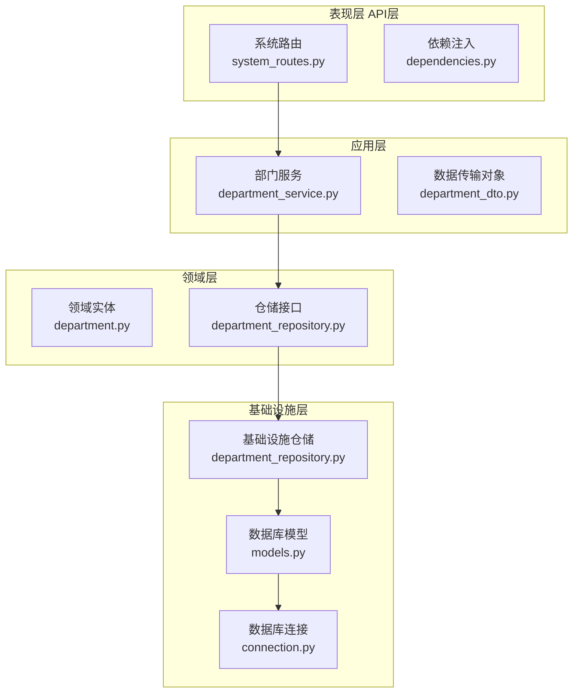
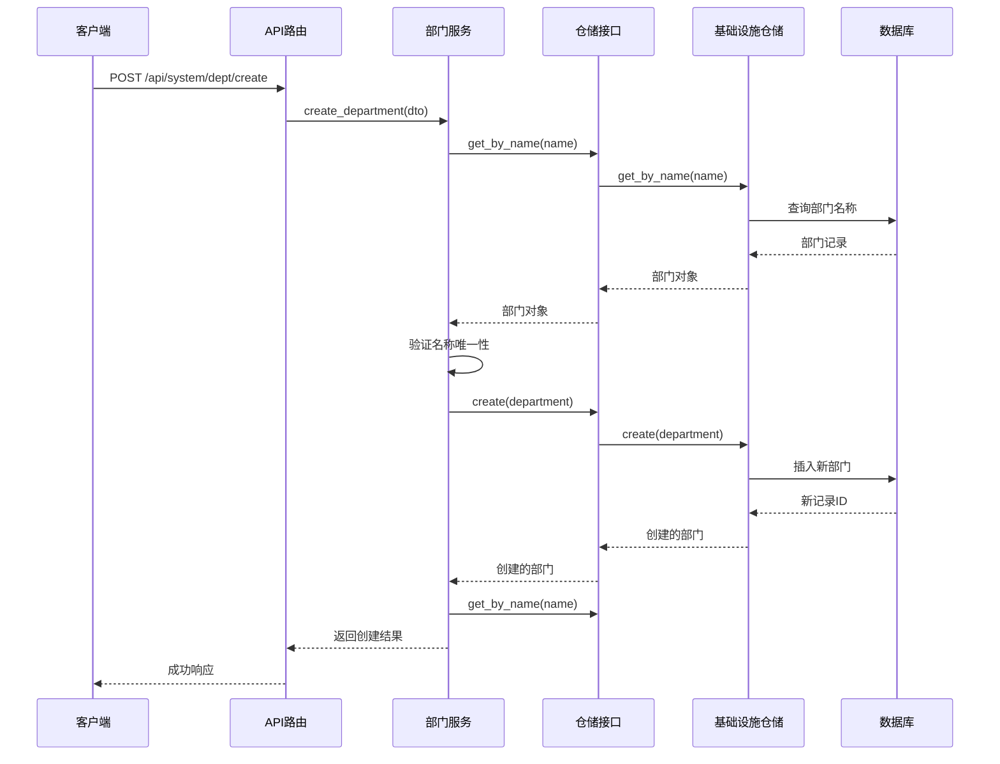
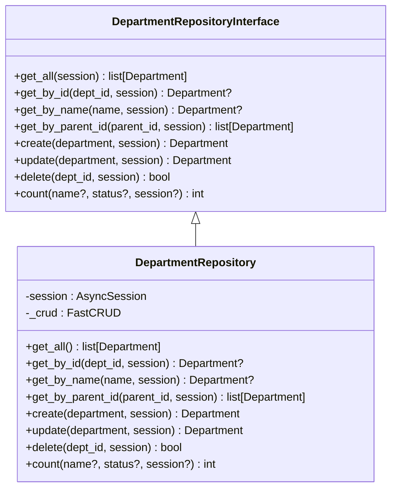
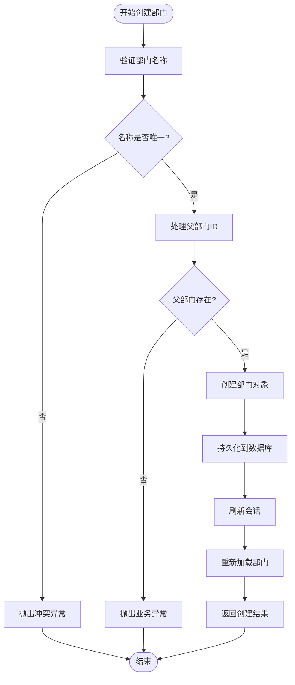
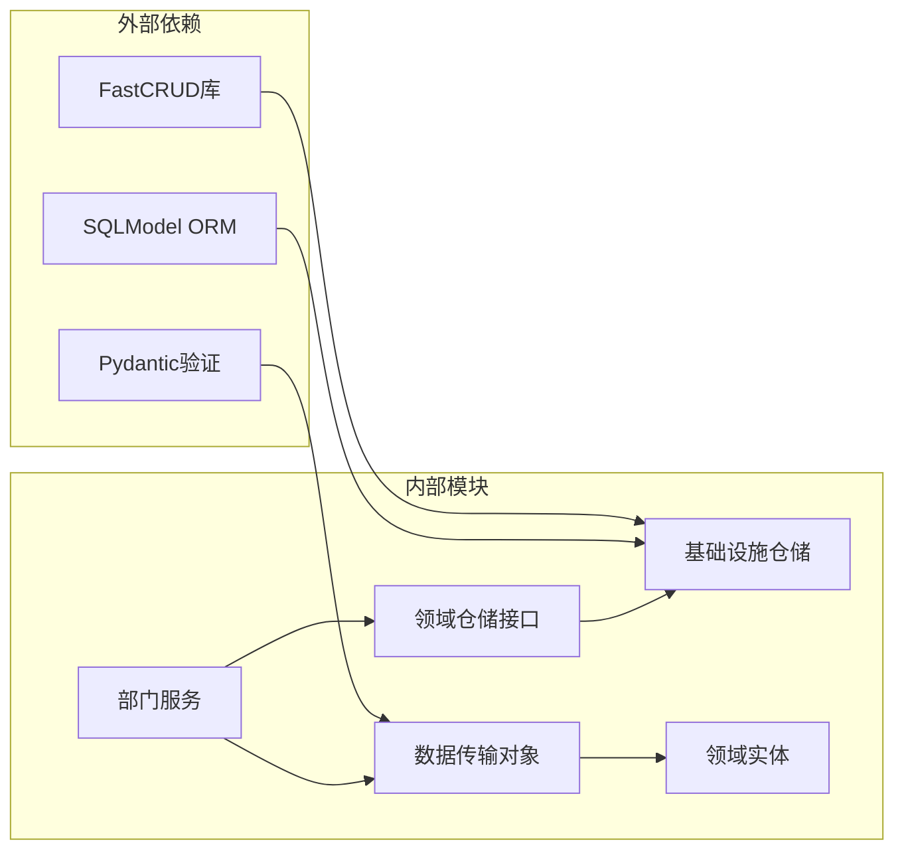

# 部门仓储层文档

<cite>
**本文档引用的文件**
- [department_repository.py](file://service/src/domain/repositories/department_repository.py)
- [department_repository.py](file://service/src/infrastructure/repositories/department_repository.py)
- [department.py](file://service/src/domain/entities/department.py)
- [department_service.py](file://service/src/application/services/department_service.py)
- [department_dto.py](file://service/src/application/dto/department_dto.py)
- [models.py](file://service/src/infrastructure/database/models.py)
- [system_routes.py](file://service/src/api/v1/system_routes.py)
- [dependencies.py](file://service/src/api/dependencies.py)
- [connection.py](file://service/src/infrastructure/database/connection.py)
- [settings.py](file://service/src/config/settings.py)
- [validators.py](file://service/src/application/validators.py)
</cite>

## 目录
1. [简介](#简介)
2. [项目结构概览](#项目结构概览)
3. [核心组件分析](#核心组件分析)
4. [架构设计](#架构设计)
5. [详细组件分析](#详细组件分析)
6. [依赖关系分析](#依赖关系分析)
7. [性能考虑](#性能考虑)
8. [故障排除指南](#故障排除指南)
9. [总结](#总结)

## 简介

本文档深入分析了基于FastAPI的部门仓储层实现，该系统采用领域驱动设计（DDD）和分层架构模式。部门仓储层作为基础设施层的核心组件，负责与数据库交互并提供部门数据的持久化操作。系统使用SQLModel作为ORM框架，结合FastCRUD库简化CRUD操作，实现了高效的部门管理功能。

## 项目结构概览

该项目采用清晰的分层架构，主要分为四个层次：

**图表来源**
- [system_routes.py:1-336](file://service/src/api/v1/system_routes.py#L1-L336)
- [department_service.py:1-157](file://service/src/application/services/department_service.py#L1-L157)
- [department_repository.py:1-129](file://service/src/infrastructure/repositories/department_repository.py#L1-L129)

**章节来源**
- [system_routes.py:1-336](file://service/src/api/v1/system_routes.py#L1-L336)
- [department_service.py:1-157](file://service/src/application/services/department_service.py#L1-L157)
- [department_repository.py:1-129](file://service/src/infrastructure/repositories/department_repository.py#L1-L129)

## 核心组件分析

### 部门仓储接口

部门仓储接口定义了完整的抽象操作规范，遵循依赖倒置原则，确保上层应用不直接依赖具体实现。

**章节来源**
- [department_repository.py:15-121](file://service/src/domain/repositories/department_repository.py#L15-L121)

### 基础设施仓储实现

基础设施仓储使用FastCRUD库实现具体的CRUD操作，提供了高性能的数据访问能力。

**章节来源**
- [department_repository.py:12-129](file://service/src/infrastructure/repositories/department_repository.py#L12-L129)

### 领域实体

部门领域实体使用dataclass实现，保持了纯领域模型的特性，不依赖任何外部框架。

**章节来源**
- [department.py:11-45](file://service/src/domain/entities/department.py#L11-L45)

## 架构设计

系统采用经典的六边形架构（端口和适配器），实现了清晰的分层分离：

**图表来源**
- [system_routes.py:58-66](file://service/src/api/v1/system_routes.py#L58-L66)
- [department_service.py:47-82](file://service/src/application/services/department_service.py#L47-L82)
- [department_repository.py:74-84](file://service/src/infrastructure/repositories/department_repository.py#L74-L84)

## 详细组件分析

### 部门仓储接口详解

仓储接口定义了完整的部门操作契约，包括基础CRUD操作和高级查询功能：

**图表来源**
- [department_repository.py:15-121](file://service/src/domain/repositories/department_repository.py#L15-L121)
- [department_repository.py:12-129](file://service/src/infrastructure/repositories/department_repository.py#L12-L129)

### 部门服务业务逻辑

部门服务实现了完整的业务规则验证和数据处理逻辑：

**图表来源**
- [department_service.py:47-82](file://service/src/application/services/department_service.py#L47-L82)

**章节来源**
- [department_service.py:14-157](file://service/src/application/services/department_service.py#L14-L157)

### 数据传输对象设计

系统使用Pydantic模型进行数据验证和序列化：

**章节来源**
- [department_dto.py:10-102](file://service/src/application/dto/department_dto.py#L10-L102)

### 数据库模型映射

使用SQLModel定义了完整的部门数据库模型，支持树形结构的组织关系：

**章节来源**
- [models.py:325-355](file://service/src/infrastructure/database/models.py#L325-L355)

## 依赖关系分析

系统采用依赖注入模式，实现了松耦合的设计：

**图表来源**
- [department_repository.py:5-9](file://service/src/infrastructure/repositories/department_repository.py#L5-L9)
- [department_service.py:8-11](file://service/src/application/services/department_service.py#L8-L11)

**章节来源**
- [dependencies.py:116-171](file://service/src/api/dependencies.py#L116-L171)
- [connection.py:11-14](file://service/src/infrastructure/database/connection.py#L11-L14)

## 性能考虑

### 查询优化策略

1. **索引设计**：部门表的关键字段（name、parent_id、status）都建立了适当的索引
2. **批量操作**：使用FastCRUD的批量查询功能减少数据库往返次数
3. **排序优化**：在查询结果中进行内存排序，避免复杂的数据库排序开销

### 缓存策略

系统集成了Redis缓存机制，可以有效提升高频查询的性能：

**章节来源**
- [settings.py:60-61](file://service/src/config/settings.py#L60-L61)
- [dependencies.py:43-49](file://service/src/api/dependencies.py#L43-L49)

## 故障排除指南

### 常见问题及解决方案

1. **部门名称冲突**
   - 现象：创建部门时报错"部门名称已存在"
   - 解决：检查数据库中是否存在同名部门，或修改部门名称

2. **父部门不存在**
   - 现象：更新部门时提示父部门不存在
   - 解决：确认父部门ID的有效性，或设置为None

3. **删除保护**
   - 现象：删除部门时报错"部门下存在子部门"
   - 解决：先删除子部门，或调整组织架构

**章节来源**
- [department_service.py:62-150](file://service/src/application/services/department_service.py#L62-L150)

### 错误处理机制

系统实现了完善的异常处理机制，包括：

- **业务异常**：针对业务规则违反的情况
- **数据异常**：针对数据完整性问题
- **系统异常**：针对底层系统错误

**章节来源**
- [department_service.py:9-10](file://service/src/application/services/department_service.py#L9-L10)

## 总结

部门仓储层实现了以下关键特性：

1. **清晰的分层架构**：严格遵循DDD原则，实现了关注点分离
2. **高度可测试性**：通过接口抽象和依赖注入，便于单元测试
3. **高性能实现**：使用FastCRUD库和SQLModel优化数据库操作
4. **完整的业务逻辑**：实现了部门管理的所有核心业务规则
5. **良好的扩展性**：模块化设计便于功能扩展和维护

该系统为后续的功能扩展奠定了坚实的基础，特别是在用户管理、角色权限等模块的集成方面具有良好的可扩展性。