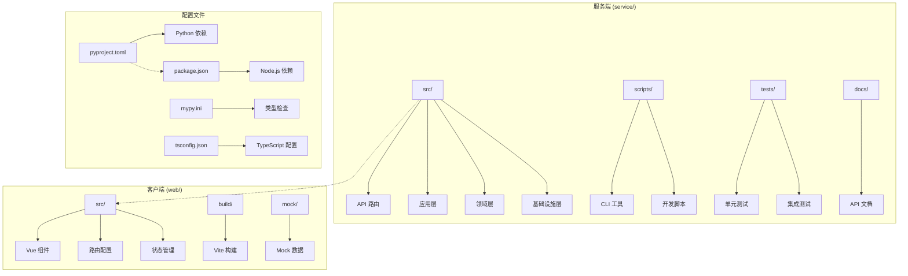
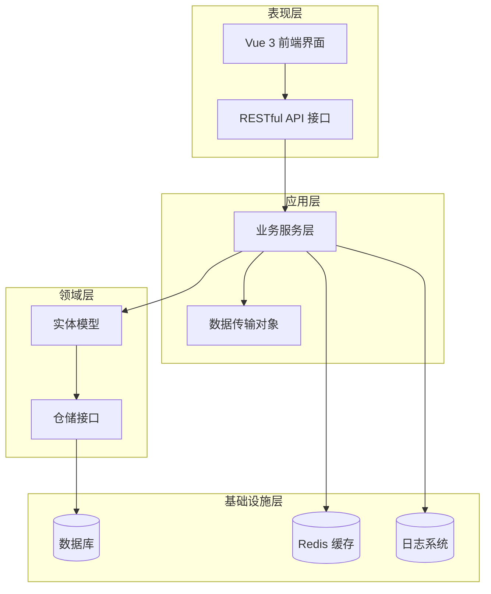
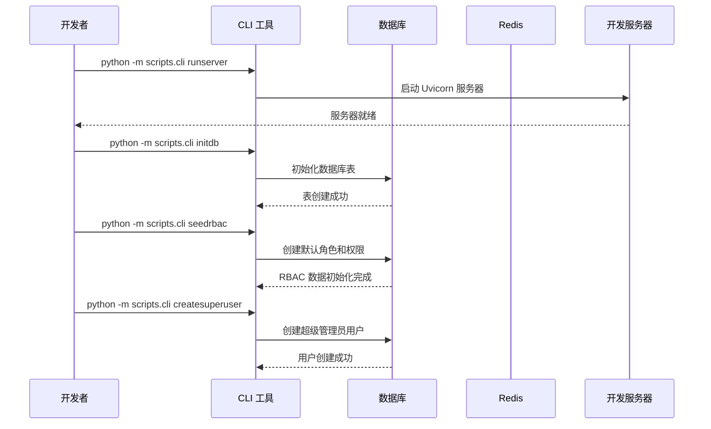
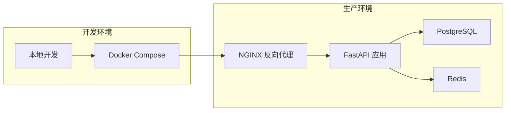
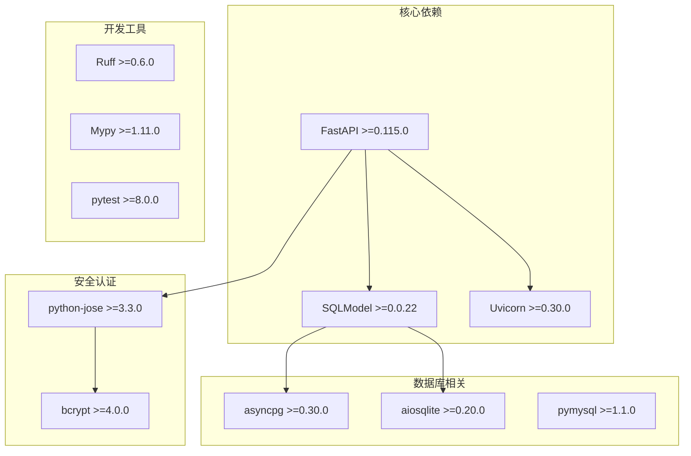

# 开发工具

<cite>
**本文档引用的文件**
- [pyproject.toml](file://service/pyproject.toml)
- [package.json](file://web/package.json)
- [mypy.ini](file://service/mypy.ini)
- [tsconfig.json](file://web/tsconfig.json)
- [uv.lock](file://service/uv.lock)
- [cli.py](file://service/scripts/cli.py)
- [setup_dev.sh](file://service/scripts/setup_dev.sh)
- [lint.sh](file://service/scripts/lint.sh)
- [eslint.config.js](file://web/eslint.config.js)
- [stylelint.config.js](file://web/stylelint.config.js)
- [Dockerfile](file://web/Dockerfile)
- [docker-compose.yml](file://service/docker/docker-compose.yml)
</cite>

## 目录
1. [简介](#简介)
2. [项目结构](#项目结构)
3. [核心组件](#核心组件)
4. [架构概览](#架构概览)
5. [详细组件分析](#详细组件分析)
6. [依赖分析](#依赖分析)
7. [性能考虑](#性能考虑)
8. [故障排除指南](#故障排除指南)
9. [结论](#结论)

## 简介

Hello-FastApi 是一个基于 FastAPI 的现代化 Web 应用程序，采用前后端分离架构，集成了完整的开发工具链和自动化流程。该项目展示了如何构建一个具备企业级功能的权限认证系统，包括用户管理、角色权限控制、系统监控等功能。

该应用程序采用 Python 3.10 + FastAPI + Vue 3 + TypeScript 技术栈，实现了完整的开发、测试、部署流水线。项目提供了丰富的开发工具配置，包括代码格式化、静态检查、类型检查、测试框架等，确保代码质量和开发效率。

## 项目结构

项目采用典型的前后端分离架构，主要包含以下核心目录：

**图表来源**
- [pyproject.toml:1-79](file://service/pyproject.toml#L1-L79)
- [package.json:1-211](file://web/package.json#L1-L211)

**章节来源**
- [pyproject.toml:1-79](file://service/pyproject.toml#L1-L79)
- [package.json:1-211](file://web/package.json#L1-L211)

## 核心组件

### Python 开发环境配置

项目使用现代 Python 包管理工具，提供完整的开发环境配置：

**Python 依赖管理**
- 主要依赖：FastAPI 0.115.0+, SQLModel, Uvicorn, Pydantic
- 开发依赖：pytest, ruff, mypy, factory-boy, faker
- 版本要求：Python 3.10+

**类型检查配置**
- mypy 配置严格模式
- 支持第三方库类型忽略
- 自动类型检查集成

**章节来源**
- [pyproject.toml:7-35](file://service/pyproject.toml#L7-L35)
- [mypy.ini:1-33](file://service/mypy.ini#L1-L33)

### Node.js 前端开发环境

前端采用现代化的 Vue 3 + TypeScript 开发栈：

**包管理配置**
- 使用 pnpm 作为包管理器
- Node.js 20.19.0+ 要求
- 支持 pnpm 9+

**TypeScript 配置**
- ESNext 目标版本
- 模块解析器：bundler
- 支持 JSX 和 Vue 单文件组件
- 全局类型定义

**章节来源**
- [package.json:178-181](file://web/package.json#L178-L181)
- [tsconfig.json:1-43](file://web/tsconfig.json#L1-L43)

### 开发工具链

项目集成了完整的开发工具链，包括代码质量检查、格式化、测试等：

**代码质量工具**
- Ruff：Python 代码格式化和静态分析
- ESLint：JavaScript/TypeScript 代码检查
- Stylelint：CSS/SCSS 代码风格检查
- Prettier：代码格式化统一标准

**测试框架**
- pytest：Python 测试框架
- Vue Test Utils：Vue 组件测试
- Mock 数据支持

**章节来源**
- [pyproject.toml:47-79](file://service/pyproject.toml#L47-L79)
- [eslint.config.js:1-191](file://web/eslint.config.js#L1-L191)

## 架构概览

项目采用分层架构设计，清晰分离关注点：

**图表来源**
- [pyproject.toml:7-23](file://service/pyproject.toml#L7-L23)

## 详细组件分析

### CLI 管理工具

项目提供了强大的命令行工具，简化开发和运维工作：

**图表来源**
- [cli.py:24-276](file://service/scripts/cli.py#L24-L276)

**章节来源**
- [cli.py:1-276](file://service/scripts/cli.py#L1-L276)

### 开发环境自动化脚本

项目提供了完整的开发环境设置和维护脚本：

**开发环境设置流程**
1. 检查并安装 UV 包管理器
2. 创建虚拟环境
3. 安装开发依赖
4. 代码格式化和静态检查
5. 数据库初始化
6. 种子数据填充
7. 运行测试

**代码质量检查流程**
- Ruff 格式检查和修复
- MyPy 类型检查
- 代码覆盖率统计

**章节来源**
- [setup_dev.sh:1-47](file://service/scripts/setup_dev.sh#L1-L47)
- [lint.sh:1-19](file://service/scripts/lint.sh#L1-L19)

### Docker 容器化部署

项目支持完整的容器化部署方案：

**图表来源**
- [docker-compose.yml:1-65](file://service/docker/docker-compose.yml#L1-L65)

**章节来源**
- [docker-compose.yml:1-65](file://service/docker/docker-compose.yml#L1-L65)
- [Dockerfile:1-20](file://web/Dockerfile#L1-L20)

### 代码质量保证体系

项目建立了完善的代码质量保证机制：

**Python 代码质量**
- Ruff 静态分析和格式化
- MyPy 类型检查
- pytest 测试框架
- 代码覆盖率报告

**前端代码质量**
- ESLint 规则配置
- Stylelint 样式检查
- Prettier 代码格式化
- TypeScript 类型安全

**章节来源**
- [pyproject.toml:47-79](file://service/pyproject.toml#L47-L79)
- [eslint.config.js:1-191](file://web/eslint.config.js#L1-L191)
- [stylelint.config.js:1-88](file://web/stylelint.config.js#L1-L88)

## 依赖分析

### Python 依赖关系

项目使用现代 Python 包管理技术，确保依赖关系清晰可控：

**图表来源**
- [pyproject.toml:7-35](file://service/pyproject.toml#L7-L35)

### Node.js 前端依赖

前端依赖采用模块化管理，支持现代化开发体验：

**核心框架依赖**
- Vue 3.5.31：响应式前端框架
- TypeScript 6.0.2：类型安全的 JavaScript
- Vite 8.0.3：快速构建工具

**UI 和工具库**
- Element Plus 2.13.6：Vue 3 组件库
- Pinia 3.0.4：状态管理
- Vue Router 5.0.4：路由管理

**开发工具链**
- ESLint 10.1.0：代码检查
- Prettier 3.8.1：代码格式化
- TypeScript ESLint：TS 代码检查

**章节来源**
- [package.json:49-177](file://web/package.json#L49-L177)

## 性能考虑

### 代码性能优化

项目在多个层面考虑了性能优化：

**Python 性能特性**
- 异步编程模型减少阻塞
- 连接池管理数据库连接
- 缓存策略提升响应速度
- 内存使用优化

**前端性能优化**
- 按需加载组件
- 代码分割和懒加载
- 图片和资源优化
- CDN 加速静态资源

**数据库性能**
- ORM 查询优化
- 索引策略设计
- 连接池配置
- 查询缓存机制

### 开发效率提升

**自动化工具**
- CI/CD 流水线
- 自动化测试
- 代码质量检查
- 部署自动化

**开发体验**
- 热重载开发服务器
- 实时错误提示
- 代码自动补全
- 类型智能提示

## 故障排除指南

### 常见开发问题

**Python 环境问题**
- UV 安装失败：检查网络连接和权限
- 依赖安装超时：使用国内镜像源
- 版本冲突：清理虚拟环境重新安装

**前端开发问题**
- Node.js 版本不兼容：升级或降级 Node.js
- pnpm 安装失败：清理缓存重新安装
- TypeScript 编译错误：检查类型定义

**数据库连接问题**
- PostgreSQL 连接失败：检查服务状态和凭据
- Redis 连接异常：验证连接字符串
- 迁移失败：检查数据库权限

### 调试技巧

**Python 应用调试**
- 使用 uvicorn 的 reload 模式
- 日志级别调整
- 数据库查询日志
- 异步任务监控

**前端应用调试**
- Vue DevTools 使用
- 浏览器开发者工具
- 网络请求监控
- 状态管理调试

**章节来源**
- [setup_dev.sh:1-47](file://service/scripts/setup_dev.sh#L1-L47)
- [cli.py:24-58](file://service/scripts/cli.py#L24-L58)

## 结论

Hello-FastApi 项目展示了一个现代化、企业级 Web 应用程序的完整开发工具链。通过精心设计的架构和完善的工具配置，项目实现了：

**技术优势**
- 现代化的技术栈选择
- 清晰的分层架构设计
- 完善的开发工具链
- 自动化的部署流程

**开发体验**
- 高效的开发环境配置
- 严格的代码质量保证
- 完善的测试覆盖
- 友好的调试工具

**可扩展性**
- 模块化的设计理念
- 灵活的配置管理
- 容器化部署支持
- 微服务架构准备

该项目为类似的企业级应用开发提供了优秀的参考模板，涵盖了从开发到生产的完整生命周期管理。