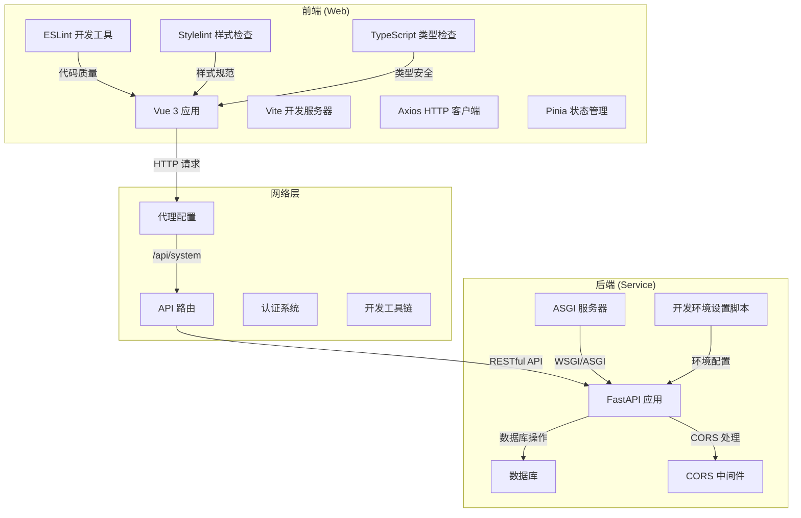
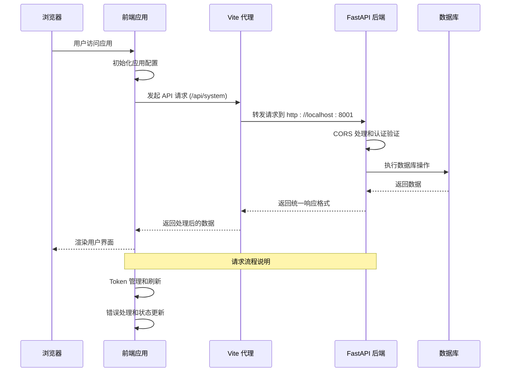
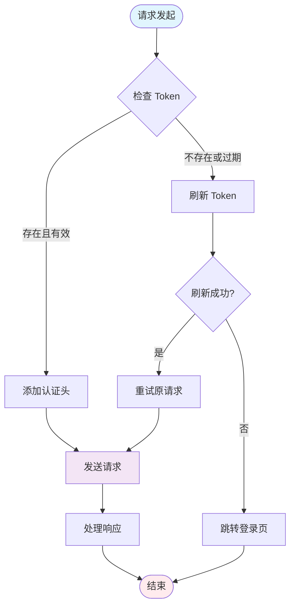
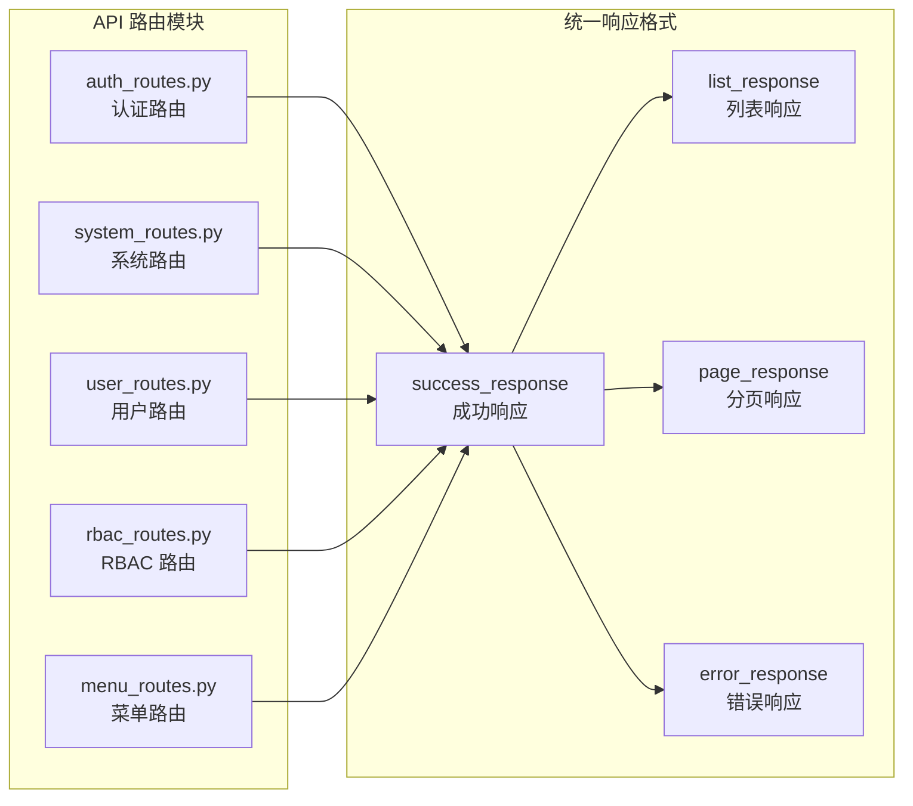
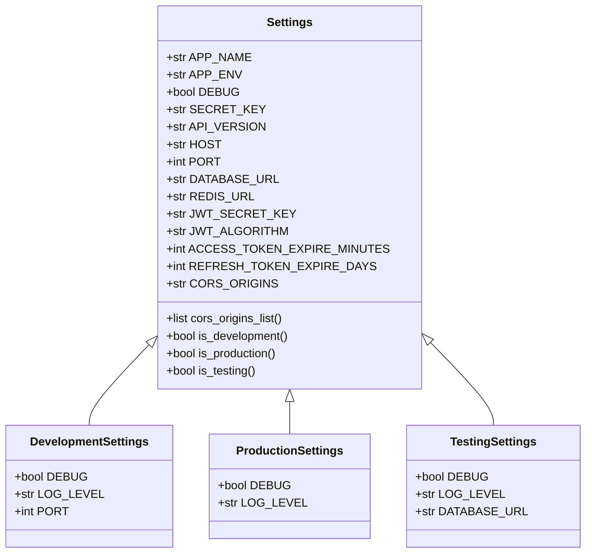
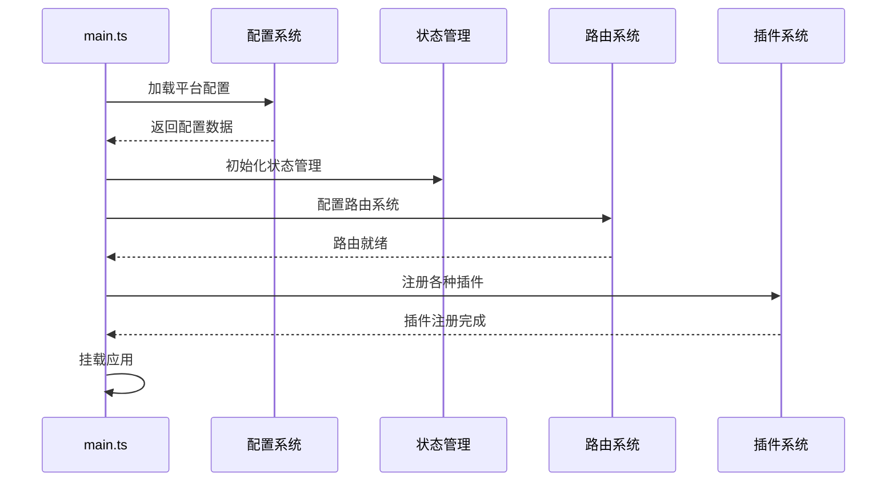
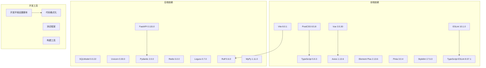

# 前端集成

<cite>
**本文档引用的文件**
- [service/src/main.py](file://service/src/main.py)
- [web/src/main.ts](file://web/src/main.ts)
- [service/pyproject.toml](file://service/pyproject.toml)
- [web/package.json](file://web/package.json)
- [service/src/config/settings.py](file://service/src/config/settings.py)
- [web/src/config/index.ts](file://web/src/config/index.ts)
- [service/src/api/v1/system_routes.py](file://service/src/api/v1/system_routes.py)
- [web/src/api/system.ts](file://web/src/api/system.ts)
- [service/src/core/constants.py](file://service/src/core/constants.py)
- [web/vite.config.ts](file://web/vite.config.ts)
- [web/src/utils/http/index.ts](file://web/src/utils/http/index.ts)
- [web/public/platform-config.json](file://web/public/platform-config.json)
- [service/src/api/common.py](file://service/src/api/common.py)
- [web/src/store/modules/app.ts](file://web/src/store/modules/app.ts)
- [service/src/api/v1/auth_routes.py](file://service/src/api/v1/auth_routes.py)
- [web/src/api/user.ts](file://web/src/api/user.ts)
- [service/scripts/setup_dev.sh](file://service/scripts/setup_dev.sh)
- [service/scripts/setup_dev.bat](file://service/scripts/setup_dev.bat)
- [web/eslint.config.js](file://web/eslint.config.js)
- [web/postcss.config.js](file://web/postcss.config.js)
- [web/stylelint.config.js](file://web/stylelint.config.js)
- [web/tsconfig.json](file://web/tsconfig.json)
</cite>

## 更新摘要
**所做更改**
- 更新了代理配置部分，反映后端目标端口从8000更改为8001
- 增强了开发工具配置说明，包括ESLint、Stylelint和TypeScript配置
- 添加了新的开发环境设置脚本说明
- 更新了故障排除指南中的端口冲突解决方案

## 目录
1. [简介](#简介)
2. [项目结构](#项目结构)
3. [核心组件](#核心组件)
4. [架构概览](#架构概览)
5. [详细组件分析](#详细组件分析)
6. [依赖分析](#依赖分析)
7. [性能考虑](#性能考虑)
8. [故障排除指南](#故障排除指南)
9. [结论](#结论)

## 简介

这是一个基于 FastAPI 和 Vue.js 的前后端分离项目，展示了现代 Web 应用的集成架构。项目采用纯前端（Vue 3 + TypeScript + Vite）和纯后端（FastAPI + Python）分离架构，通过 RESTful API 进行通信。

**更新** 项目现已包含增强的开发工具配置和改进的开发体验，包括更完善的ESLint、Stylelint和TypeScript配置，以及自动化开发环境设置脚本。

## 项目结构

该项目采用典型的前后端分离架构：

**图表来源**
- [web/vite.config.ts:27-33](file://web/vite.config.ts#L27-L33)
- [service/src/main.py:46-53](file://service/src/main.py#L46-L53)
- [service/scripts/setup_dev.sh:1-47](file://service/scripts/setup_dev.sh#L1-L47)

**章节来源**
- [service/src/main.py:1-96](file://service/src/main.py#L1-L96)
- [web/src/main.ts:1-72](file://web/src/main.ts#L1-L72)

## 核心组件

### 前端核心组件

前端应用的核心组件包括：

1. **应用入口 (main.ts)** - 应用初始化和插件注册
2. **HTTP 客户端 (http/index.ts)** - 统一的 API 请求处理
3. **配置管理 (config/index.ts)** - 动态配置加载
4. **状态管理 (store/modules/app.ts)** - 应用状态管理
5. **开发工具配置** - ESLint、Stylelint、TypeScript配置

### 后端核心组件

后端应用的核心组件包括：

1. **应用工厂 (main.py)** - FastAPI 应用创建和配置
2. **配置系统 (settings.py)** - 多环境配置管理
3. **API 路由 (auth_routes.py)** - 认证和权限相关接口
4. **系统路由 (system_routes.py)** - 系统管理和监控接口
5. **开发环境设置脚本** - 自动化开发环境配置

**章节来源**
- [web/src/main.ts:57-71](file://web/src/main.ts#L57-L71)
- [service/src/main.py:34-92](file://service/src/main.py#L34-L92)

## 架构概览

**更新** 代理配置已更新，后端目标地址从 `http://localhost:8000` 更改为 `http://localhost:8001`

**图表来源**
- [web/vite.config.ts:27-33](file://web/vite.config.ts#L27-L33)
- [web/src/utils/http/index.ts:64-124](file://web/src/utils/http/index.ts#L64-L124)
- [service/src/main.py:46-53](file://service/src/main.py#L46-L53)

## 详细组件分析

### HTTP 请求处理流程

**图表来源**
- [web/src/utils/http/index.ts:80-118](file://web/src/utils/http/index.ts#L80-L118)

前端 HTTP 客户端实现了完整的请求处理流程：

1. **请求拦截器** - 自动添加认证信息和处理 Token 过期
2. **响应拦截器** - 统一处理响应数据和错误
3. **Token 管理** - 自动刷新和存储认证信息
4. **错误处理** - 统一的错误提示和处理机制

**章节来源**
- [web/src/utils/http/index.ts:35-199](file://web/src/utils/http/index.ts#L35-L199)

### API 路由集成

后端 API 路由采用模块化设计：

**图表来源**
- [service/src/api/v1/auth_routes.py:23-89](file://service/src/api/v1/auth_routes.py#L23-L89)
- [service/src/api/v1/system_routes.py:16-34](file://service/src/api/v1/system_routes.py#L16-L34)
- [service/src/api/common.py:45-87](file://service/src/api/common.py#L45-L87)

**章节来源**
- [service/src/api/v1/auth_routes.py:20-293](file://service/src/api/v1/auth_routes.py#L20-L293)
- [service/src/api/common.py:29-87](file://service/src/api/common.py#L29-L87)

### 配置管理系统

**更新** 开发环境配置现已包含端口配置，默认端口为8001

**图表来源**
- [service/src/config/settings.py:41-197](file://service/src/config/settings.py#L41-L197)

**章节来源**
- [service/src/config/settings.py:41-197](file://service/src/config/settings.py#L41-L197)

### 前端应用初始化流程

**图表来源**
- [web/src/main.ts:57-71](file://web/src/main.ts#L57-L71)

**章节来源**
- [web/src/main.ts:1-72](file://web/src/main.ts#L1-L72)

### 开发工具配置

**更新** 新增了完整的开发工具配置说明

前端项目包含以下开发工具配置：

1. **ESLint 配置** - 代码质量检查和格式化
2. **Stylelint 配置** - CSS/SCSS 样式规范检查
3. **TypeScript 配置** - 类型检查和编译选项
4. **PostCSS 配置** - CSS 后处理器配置

**章节来源**
- [web/eslint.config.js:1-191](file://web/eslint.config.js#L1-L191)
- [web/stylelint.config.js:1-88](file://web/stylelint.config.js#L1-L88)
- [web/tsconfig.json:1-55](file://web/tsconfig.json#L1-L55)
- [web/postcss.config.js:1-9](file://web/postcss.config.js#L1-L9)

### 开发环境设置脚本

**更新** 新增了自动化开发环境设置脚本

项目提供跨平台的开发环境设置脚本：

1. **Linux/macOS 脚本** - `setup_dev.sh`
2. **Windows 脚本** - `setup_dev.bat`

这些脚本自动完成以下设置：
- 检查和安装 UV 工具
- 创建虚拟环境
- 安装依赖包
- 运行代码格式化
- 初始化数据库
- 种子 RBAC 数据
- 运行测试

**章节来源**
- [service/scripts/setup_dev.sh:1-47](file://service/scripts/setup_dev.sh#L1-L47)
- [service/scripts/setup_dev.bat:1-44](file://service/scripts/setup_dev.bat#L1-L44)

## 依赖分析

### 技术栈依赖关系

**更新** 增强了开发工具链的依赖关系，包括ESLint、Stylelint和TypeScript配置

**图表来源**
- [web/package.json:49-114](file://web/package.json#L49-L114)
- [service/pyproject.toml:7-20](file://service/pyproject.toml#L7-L20)

**章节来源**
- [web/package.json:1-210](file://web/package.json#L1-L210)
- [service/pyproject.toml:1-76](file://service/pyproject.toml#L1-L76)

### CORS 和代理配置

**更新** 代理配置已更新为目标端口8001

前端通过 Vite 开发服务器配置代理，实现跨域请求：

| 配置项 | 值 | 说明 |
|--------|-----|------|
| 代理路径 | `/api` | 匹配所有以 /api 开头的请求 |
| 目标地址 | `http://localhost:8001` | 后端服务地址（已更新） |
| 改变源 | `true` | 修改请求头中的 Host 字段 |

**更新** 目标端口从8000更改为8001，避免与默认数据库或其他服务冲突

**章节来源**
- [web/vite.config.ts:27-33](file://web/vite.config.ts#L27-L33)

## 性能考虑

### 前端性能优化

1. **依赖预热** - Vite 预热配置减少首次加载时间
2. **CDN 支持** - 可选的 CDN 配置提升静态资源加载速度
3. **代码分割** - 按需加载组件和路由
4. **缓存策略** - 合理的 HTTP 缓存头设置
5. **开发工具优化** - ESLint和TypeScript增量检查提升开发效率

### 后端性能优化

1. **异步处理** - 全面使用 async/await 支持高并发
2. **连接池** - 数据库连接池管理
3. **CORS 优化** - 精确的跨域配置减少不必要的头部
4. **日志管理** - 结构化日志便于性能分析
5. **开发环境优化** - 自动化设置脚本确保一致的开发环境

## 故障排除指南

### 常见问题及解决方案

#### 1. CORS 跨域问题
**症状**: 前端请求被浏览器阻止
**解决方案**: 检查后端 CORS 配置和前端代理设置

#### 2. 认证失败
**症状**: Token 过期或无效
**解决方案**: 
- 检查 Token 存储和刷新机制
- 验证 JWT 密钥配置
- 确认用户状态

#### 3. API 调用失败
**症状**: 请求超时或返回错误
**解决方案**:
- 检查网络连接和防火墙设置
- 验证 API 路由配置
- 查看后端日志

#### 4. 端口冲突问题
**更新** 新增端口冲突解决方案

**症状**: 开发服务器无法启动
**解决方案**:
- 检查端口8001是否被占用
- 修改 `vite.config.ts` 中的代理目标端口
- 使用 `netstat -ano | findstr :8001` 检查端口占用
- 在 `settings.py` 中修改 `PORT` 配置

#### 5. 开发环境配置问题
**更新** 新增开发环境设置脚本故障排除

**症状**: 依赖安装失败或环境配置错误
**解决方案**:
- 运行 `setup_dev.sh` 或 `setup_dev.bat` 自动配置
- 检查 UV 工具是否正确安装
- 确保 Python 3.10 版本兼容
- 清理缓存并重新安装依赖

**章节来源**
- [web/src/utils/http/index.ts:143-149](file://web/src/utils/http/index.ts#L143-L149)

### 调试技巧

1. **浏览器开发者工具** - 监控网络请求和响应
2. **后端日志** - 使用 Loguru 进行结构化日志记录
3. **API 文档** - 通过 `/api/docs` 和 `/api/redoc` 测试接口
4. **环境配置** - 检查 `.env` 文件配置
5. **开发工具** - 使用 ESLint、Stylelint 和 TypeScript 检查代码质量
6. **自动化脚本** - 使用开发环境设置脚本确保一致的开发环境

## 结论

本项目展示了现代 Web 应用的完整集成架构，通过前后端分离设计实现了良好的可维护性和扩展性。主要特点包括：

1. **清晰的架构分离** - 前后端职责明确，便于独立开发和部署
2. **完善的认证系统** - 基于 JWT 的认证机制和 RBAC 权限控制
3. **统一的 API 设计** - 标准化的响应格式和错误处理
4. **灵活的配置管理** - 支持多环境配置和动态参数调整
5. **现代化的技术栈** - Vue 3 + FastAPI + TypeScript 的最佳实践组合
6. **增强的开发工具链** - 完整的ESLint、Stylelint、TypeScript配置
7. **自动化开发环境** - 跨平台的开发环境设置脚本
8. **改进的开发体验** - 从8000端口迁移到8001端口，避免端口冲突

该架构为大型企业级应用提供了坚实的基础，可以根据具体需求进行功能扩展和性能优化。新增的开发工具配置和自动化脚本显著提升了开发效率和一致性，为团队协作提供了更好的基础。