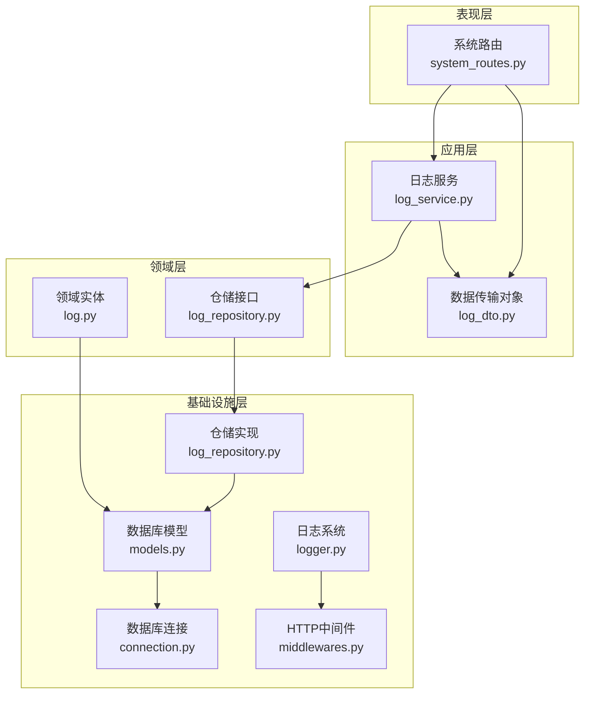
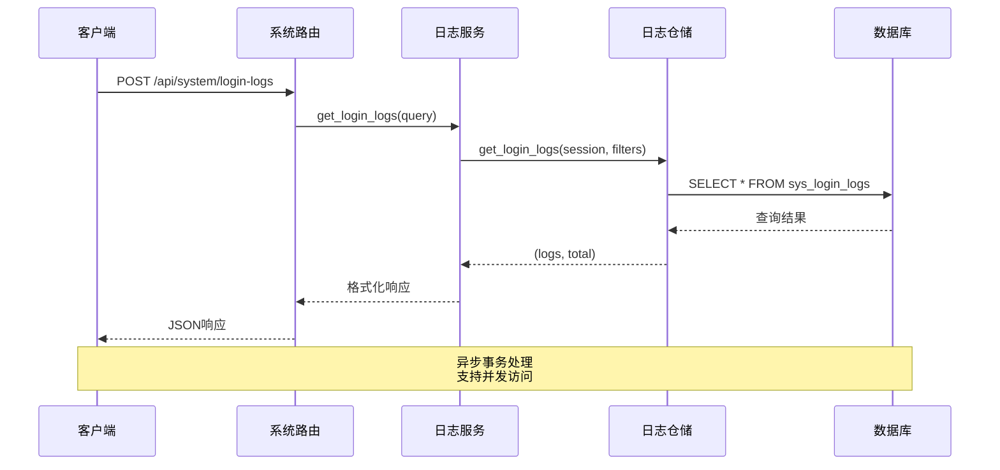
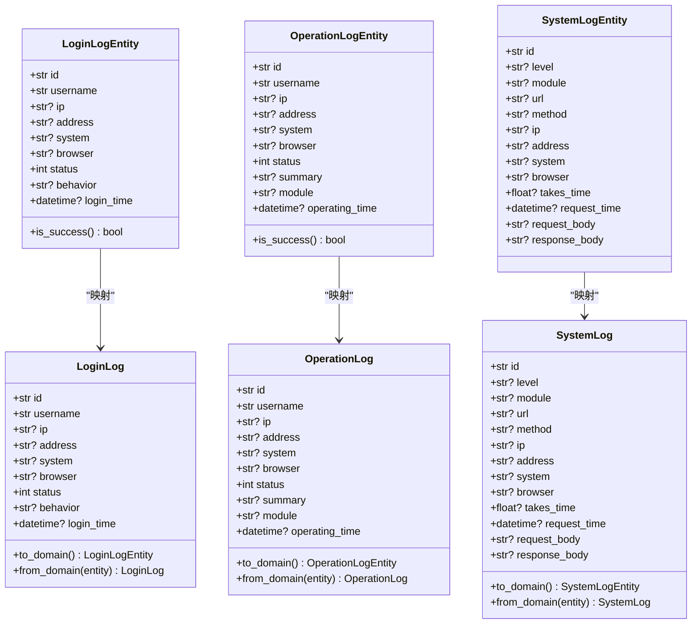
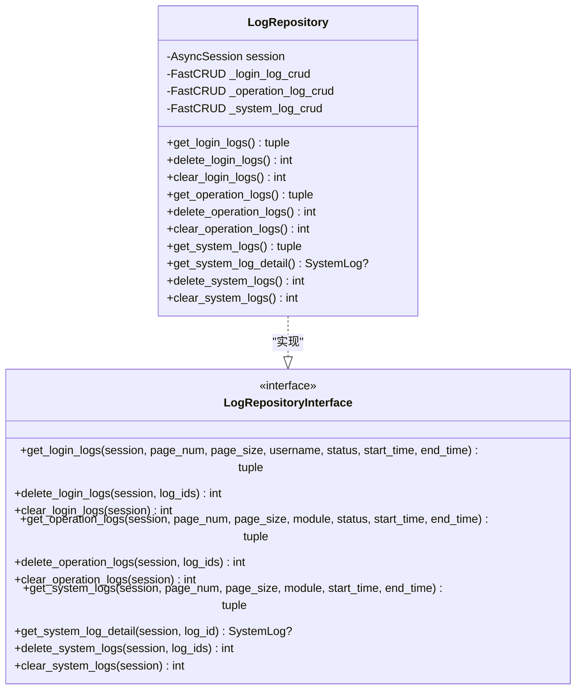
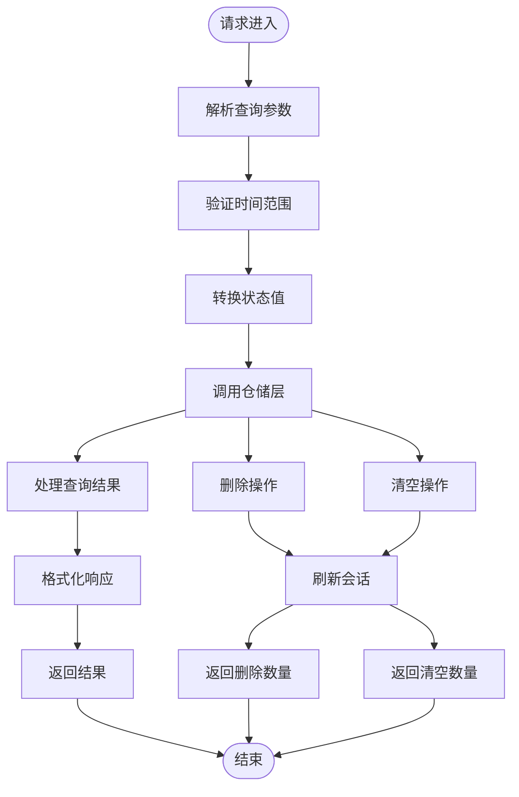
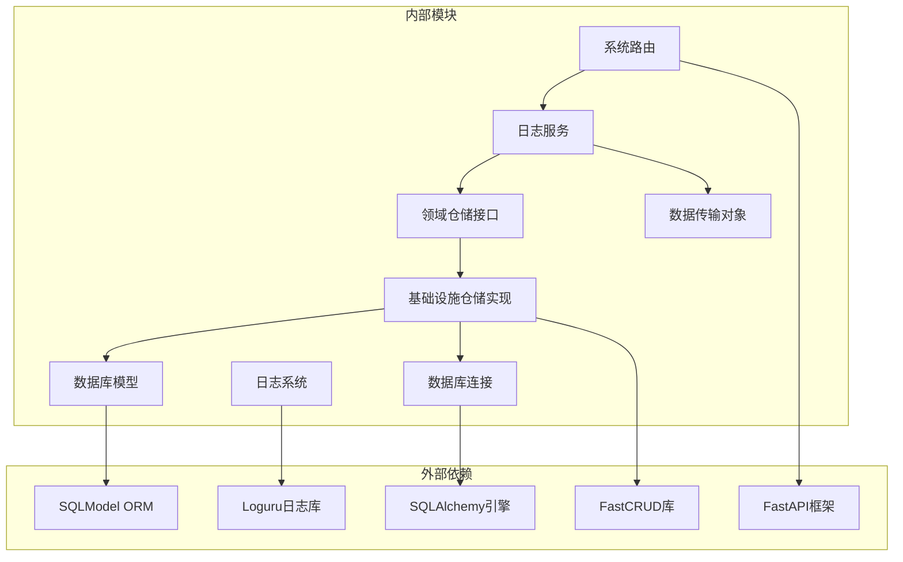
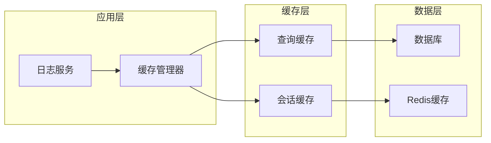
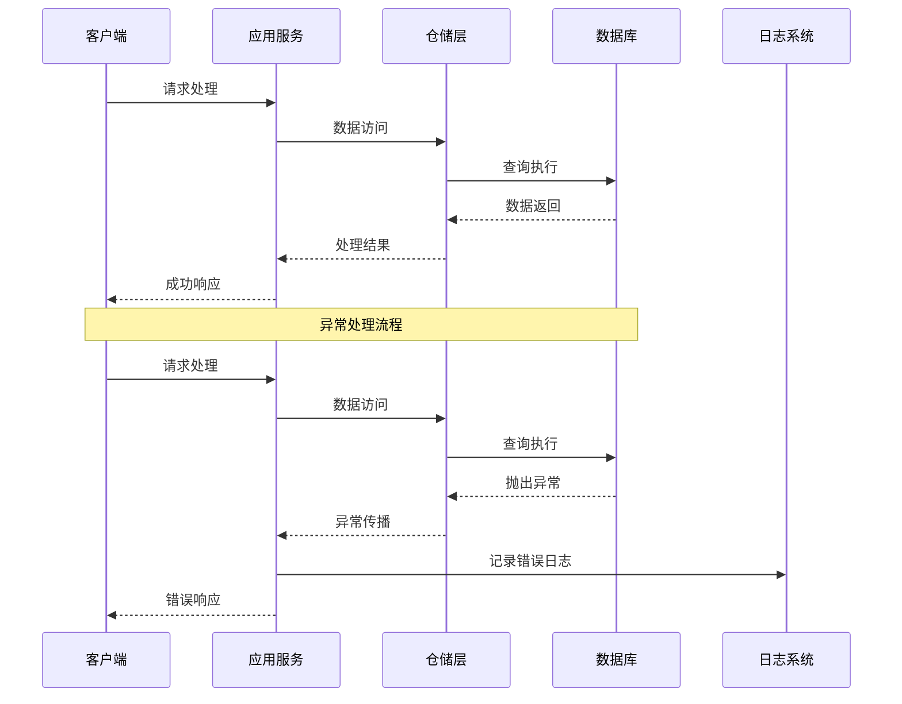

# 日志仓库层文档

<cite>
**本文档引用的文件**
- [log_repository.py](file://service/src/domain/repositories/log_repository.py)
- [log_repository.py](file://service/src/infrastructure/repositories/log_repository.py)
- [log.py](file://service/src/domain/entities/log.py)
- [log_dto.py](file://service/src/application/dto/log_dto.py)
- [log_service.py](file://service/src/application/services/log_service.py)
- [models.py](file://service/src/infrastructure/database/models.py)
- [system_routes.py](file://service/src/api/v1/system_routes.py)
- [dependencies.py](file://service/src/api/dependencies.py)
- [logger.py](file://service/src/infrastructure/logging/logger.py)
- [middlewares.py](file://service/src/infrastructure/http/middlewares.py)
- [connection.py](file://service/src/infrastructure/database/connection.py)
- [settings.py](file://service/src/config/settings.py)
</cite>

## 目录
1. [简介](#简介)
2. [项目结构](#项目结构)
3. [核心组件](#核心组件)
4. [架构概览](#架构概览)
5. [详细组件分析](#详细组件分析)
6. [依赖关系分析](#依赖关系分析)
7. [性能考虑](#性能考虑)
8. [故障排除指南](#故障排除指南)
9. [结论](#结论)

## 简介

本文档深入分析了基于FastAPI的DDD（领域驱动设计）架构中的日志仓库层。该系统实现了完整的日志管理功能，包括登录日志、操作日志和系统日志的存储、查询、管理和清理。通过清晰的分层架构，系统确保了业务逻辑与数据访问的分离，提供了高性能、可扩展的日志管理解决方案。

## 项目结构

日志仓库层采用经典的三层架构模式，严格按照DDD原则设计：

**图表来源**
- [system_routes.py:1-336](file://service/src/api/v1/system_routes.py#L1-L336)
- [log_service.py:1-219](file://service/src/application/services/log_service.py#L1-L219)
- [log_repository.py:1-37](file://service/src/domain/repositories/log_repository.py#L1-L37)

**章节来源**
- [system_routes.py:1-336](file://service/src/api/v1/system_routes.py#L1-L336)
- [log_service.py:1-219](file://service/src/application/services/log_service.py#L1-L219)
- [log_repository.py:1-37](file://service/src/domain/repositories/log_repository.py#L1-L37)

## 核心组件

### 1. 领域实体层

系统定义了三种核心日志实体，每种都使用Python的dataclass实现，确保类型安全和数据完整性：

- **LoginLogEntity**: 登录日志实体，包含用户认证信息
- **OperationLogEntity**: 操作日志实体，记录用户业务操作
- **SystemLogEntity**: 系统日志实体，记录系统运行状态

### 2. 仓储接口层

LogRepositoryInterface定义了完整的日志操作契约，采用Protocol模式确保类型安全：

- **查询操作**: 支持分页查询、条件筛选、时间范围查询
- **管理操作**: 支持批量删除、清空操作
- **详情查询**: 支持系统日志详情获取

### 3. 仓储实现层

LogRepository使用SQLModel和FastCRUD框架实现，提供高性能的数据访问：

- **SQLModel集成**: 利用SQLModel的ORM特性
- **FastCRUD优化**: 使用FastCRUD简化CRUD操作
- **异步支持**: 完全支持异步数据库操作

**章节来源**
- [log.py:1-110](file://service/src/domain/entities/log.py#L1-L110)
- [log_repository.py:1-37](file://service/src/domain/repositories/log_repository.py#L1-L37)
- [log_repository.py:1-295](file://service/src/infrastructure/repositories/log_repository.py#L1-L295)

## 架构概览

日志仓库层遵循Clean Architecture原则，实现了严格的分层隔离：

**图表来源**
- [system_routes.py:116-131](file://service/src/api/v1/system_routes.py#L116-L131)
- [log_service.py:48-70](file://service/src/application/services/log_service.py#L48-L70)
- [log_repository.py:32-78](file://service/src/infrastructure/repositories/log_repository.py#L32-L78)

### 数据流分析

系统采用事件驱动的数据流模式：

1. **请求接收**: HTTP请求通过FastAPI路由层接收
2. **参数验证**: DTO进行参数验证和类型转换
3. **业务处理**: 应用服务执行业务逻辑
4. **数据访问**: 仓储层执行数据库操作
5. **响应返回**: 格式化数据返回给客户端

**章节来源**
- [system_routes.py:1-336](file://service/src/api/v1/system_routes.py#L1-L336)
- [log_service.py:1-219](file://service/src/application/services/log_service.py#L1-L219)

## 详细组件分析

### 日志实体设计

每个日志实体都经过精心设计，确保数据完整性和业务语义：

**图表来源**
- [log.py:11-110](file://service/src/domain/entities/log.py#L11-L110)
- [models.py:360-466](file://service/src/infrastructure/database/models.py#L360-L466)

### 仓储接口设计

LogRepositoryInterface采用Protocol模式定义了完整的日志操作契约：

**图表来源**
- [log_repository.py:15-37](file://service/src/domain/repositories/log_repository.py#L15-L37)
- [log_repository.py:16-295](file://service/src/infrastructure/repositories/log_repository.py#L16-L295)

### 应用服务层

LogService作为应用层的核心，负责协调仓储操作和业务逻辑：

**图表来源**
- [log_service.py:48-93](file://service/src/application/services/log_service.py#L48-L93)
- [log_service.py:121-142](file://service/src/application/services/log_service.py#L121-L142)
- [log_service.py:197-218](file://service/src/application/services/log_service.py#L197-L218)

### 数据传输对象

系统使用Pydantic定义了完整的DTO结构，确保数据传输的安全性和一致性：

| DTO类型 | 字段 | 验证规则 | 用途 |
|---------|------|----------|------|
| LoginLogListQueryDTO | pageNum, pageSize, username, status, loginTime | ge=1, le=100 | 登录日志查询 |
| OperationLogListQueryDTO | pageNum, pageSize, module, status, operatingTime | ge=1, le=100 | 操作日志查询 |
| SystemLogListQueryDTO | pageNum, pageSize, module, requestTime | ge=1, le=100 | 系统日志查询 |
| BatchDeleteLogDTO | ids | list[str] | 批量删除 |

**章节来源**
- [log_dto.py:1-123](file://service/src/application/dto/log_dto.py#L1-L123)
- [log_service.py:1-219](file://service/src/application/services/log_service.py#L1-L219)

## 依赖关系分析

### 组件依赖图

**图表来源**
- [dependencies.py:174-180](file://service/src/api/dependencies.py#L174-L180)
- [log_repository.py:8-11](file://service/src/infrastructure/repositories/log_repository.py#L8-L11)
- [logger.py:14-22](file://service/src/infrastructure/logging/logger.py#L14-L22)

### 循环依赖检查

系统严格避免循环依赖：
- 路由层仅依赖应用服务，不直接依赖仓储
- 应用服务依赖仓储接口，不依赖具体实现
- 仓储实现依赖数据库模型，不依赖上层组件
- 日志系统独立于业务逻辑

**章节来源**
- [dependencies.py:1-201](file://service/src/api/dependencies.py#L1-L201)
- [log_repository.py:1-295](file://service/src/infrastructure/repositories/log_repository.py#L1-L295)

## 性能考虑

### 数据库优化策略

1. **索引优化**: 关键查询字段建立适当索引
2. **分页查询**: 默认限制每页最大记录数
3. **异步操作**: 使用异步数据库连接池
4. **连接复用**: 复用数据库连接减少开销

### 缓存策略

### 性能监控

系统内置性能监控机制：
- HTTP请求处理时间统计
- 数据库查询性能监控
- 内存使用情况跟踪
- 错误率统计分析

**章节来源**
- [middlewares.py:1-59](file://service/src/infrastructure/http/middlewares.py#L1-L59)
- [logger.py:42-53](file://service/src/infrastructure/logging/logger.py#L42-L53)

## 故障排除指南

### 常见问题诊断

1. **数据库连接问题**
   - 检查DATABASE_URL配置
   - 验证数据库服务状态
   - 查看连接池配置

2. **日志查询异常**
   - 验证查询参数格式
   - 检查时间范围有效性
   - 确认权限验证通过

3. **性能问题**
   - 分析慢查询日志
   - 检查索引使用情况
   - 监控内存使用情况

### 错误处理机制

系统采用多层次错误处理：

**图表来源**
- [log_service.py:174-195](file://service/src/application/services/log_service.py#L174-L195)
- [logger.py:52-53](file://service/src/infrastructure/logging/logger.py#L52-L53)

### 调试工具

系统提供多种调试工具：
- 详细的日志输出
- 性能指标监控
- 错误堆栈跟踪
- 数据库查询日志

**章节来源**
- [logger.py:1-90](file://service/src/infrastructure/logging/logger.py#L1-L90)
- [log_service.py:174-195](file://service/src/application/services/log_service.py#L174-L195)

## 结论

日志仓库层展现了现代Python Web应用的最佳实践：

### 设计优势

1. **清晰的分层架构**: 严格遵循DDD原则，职责分离明确
2. **类型安全**: 全面使用Python类型注解和Pydantic验证
3. **高性能**: 异步架构和数据库优化策略
4. **可扩展性**: 插件化的中间件和配置系统
5. **可观测性**: 完善的日志记录和监控机制

### 技术亮点

- **FastCRUD集成**: 大幅简化了CRUD操作的实现
- **SQLModel统一**: ORM和Pydantic模型的完美结合
- **异步支持**: 完全支持异步编程模式
- **依赖注入**: 清晰的服务依赖管理
- **配置管理**: 多环境配置支持

### 未来改进方向

1. **缓存优化**: 实现更智能的缓存策略
2. **分布式追踪**: 集成分布式链路追踪
3. **指标收集**: 添加更多性能指标
4. **自动化测试**: 完善单元测试和集成测试
5. **文档完善**: 增加API文档和使用示例

该日志仓库层为整个系统的稳定运行提供了坚实的基础，其设计原则和实现模式可以作为其他类似项目的参考模板。