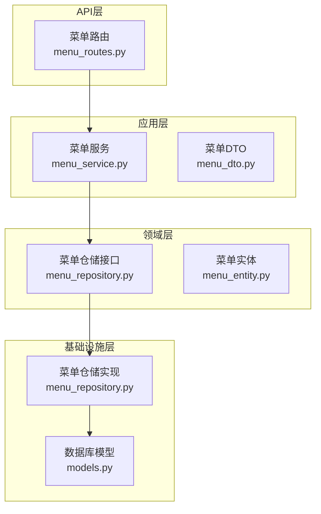
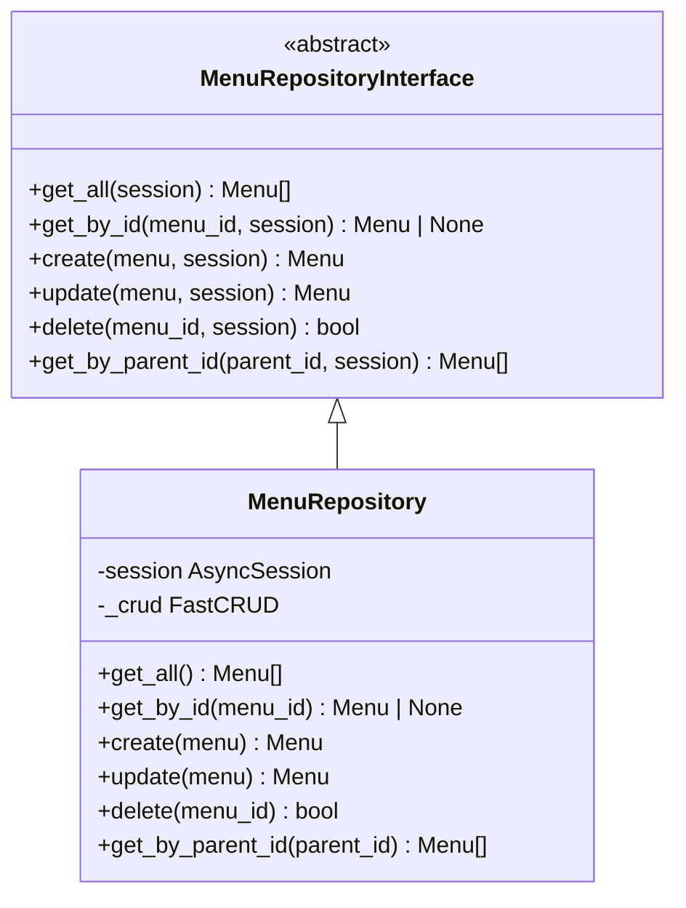
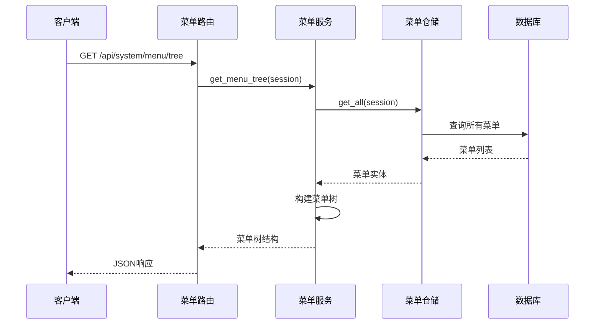
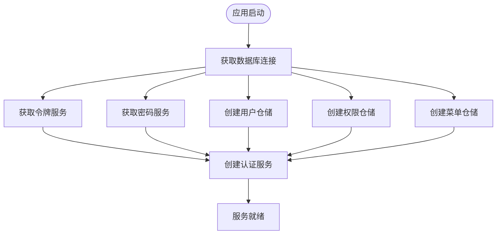
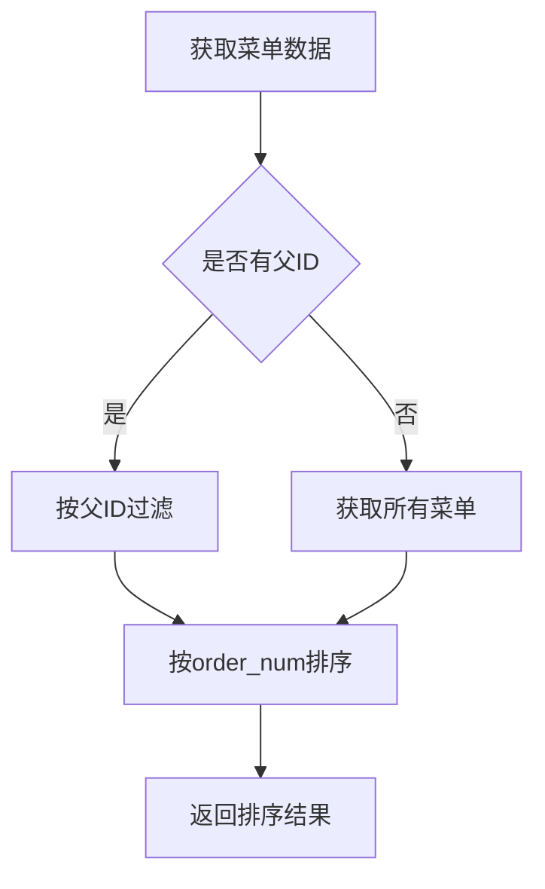
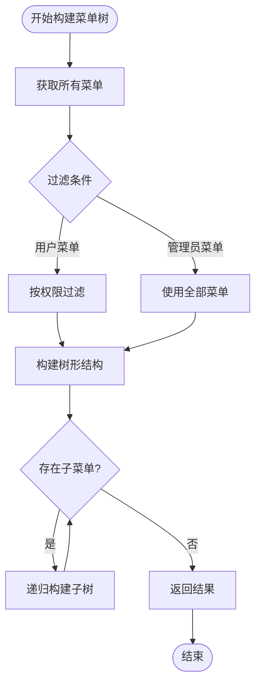
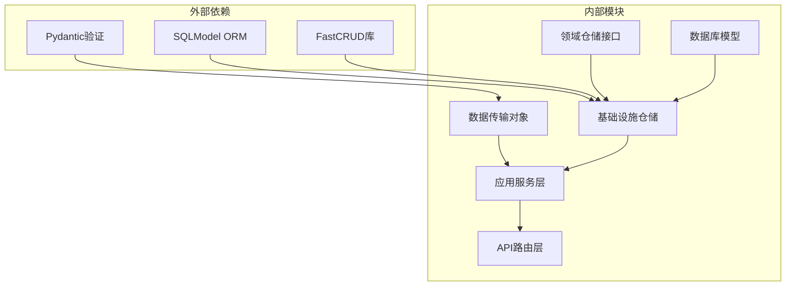

# 菜单仓库层

<cite>
**本文档引用的文件**
- [menu_repository.py](file://service/src/domain/repositories/menu_repository.py)
- [menu_repository.py](file://service/src/infrastructure/repositories/menu_repository.py)
- [menu.py](file://service/src/domain/entities/menu.py)
- [menu_service.py](file://service/src/application/services/menu_service.py)
- [menu_routes.py](file://service/src/api/v1/menu_routes.py)
- [menu_dto.py](file://service/src/application/dto/menu_dto.py)
- [models.py](file://service/src/infrastructure/database/models.py)
- [dependencies.py](file://service/src/api/dependencies.py)
</cite>

## 目录
1. [简介](#简介)
2. [项目结构](#项目结构)
3. [核心组件](#核心组件)
4. [架构概览](#架构概览)
5. [详细组件分析](#详细组件分析)
6. [依赖关系分析](#依赖关系分析)
7. [性能考虑](#性能考虑)
8. [故障排除指南](#故障排除指南)
9. [结论](#结论)

## 简介

菜单仓库层是本项目采用的Clean Architecture架构中的关键基础设施层组件，负责菜单数据的持久化操作。该层实现了领域驱动设计中的仓储模式，通过抽象接口定义数据访问契约，并提供了基于SQLModel和FastCRUD的具体实现。

本仓库层采用异步编程模型，支持完整的CRUD操作，包括菜单树构建、父子关系查询、权限过滤等功能。通过依赖注入机制，实现了路由层、应用层和基础设施层之间的松耦合设计。

## 项目结构

项目采用Clean Architecture分层架构，菜单仓库层位于基础设施层，与领域层通过接口进行交互：

**图表来源**
- [menu_routes.py:1-72](file://service/src/api/v1/menu_routes.py#L1-L72)
- [menu_service.py:1-249](file://service/src/application/services/menu_service.py#L1-L249)
- [menu_repository.py:1-94](file://service/src/domain/repositories/menu_repository.py#L1-L94)
- [menu_repository.py:1-91](file://service/src/infrastructure/repositories/menu_repository.py#L1-L91)

**章节来源**
- [menu_repository.py:1-94](file://service/src/domain/repositories/menu_repository.py#L1-L94)
- [menu_repository.py:1-91](file://service/src/infrastructure/repositories/menu_repository.py#L1-L91)
- [menu_service.py:1-249](file://service/src/application/services/menu_service.py#L1-L249)

## 核心组件

### 仓储接口定义

菜单仓储接口定义了完整的数据访问契约，采用抽象基类模式确保实现的一致性：

**图表来源**
- [menu_repository.py:15-94](file://service/src/domain/repositories/menu_repository.py#L15-L94)
- [menu_repository.py:10-91](file://service/src/infrastructure/repositories/menu_repository.py#L10-L91)

### 数据模型映射

菜单实体采用dataclass定义，提供清晰的数据结构和默认值：

| 字段名 | 类型 | 描述 | 默认值 |
|--------|------|------|--------|
| id | str | 菜单唯一标识 | UUID生成 |
| name | str | 菜单名称 | 必填 |
| path | str | 路由路径 | None |
| component | str | 组件路径 | None |
| icon | str | 图标 | None |
| title | str | 显示标题 | None |
| show_link | int | 是否显示 | 1 |
| parent_id | str | 父菜单ID | None |
| order_num | int | 排序号 | 0 |
| permissions | str | 权限编码 | None |
| status | int | 状态 | 1 |
| menu_type | int | 菜单类型 | 0 |
| redirect | str | 重定向路径 | None |
| extra_icon | str | 额外图标 | None |
| enter_transition | str | 进场动画 | None |
| leave_transition | str | 离场动画 | None |
| active_path | str | 激活路径 | None |
| frame_src | str | iframe地址 | None |
| frame_loading | bool | iframe加载动画 | True |
| keep_alive | bool | 页面缓存 | False |
| hidden_tag | bool | 隐藏标签 | False |
| fixed_tag | bool | 固定标签 | False |
| show_parent | bool | 显示父级 | False |
| created_at | datetime | 创建时间 | None |
| updated_at | datetime | 更新时间 | None |

**章节来源**
- [menu.py:11-78](file://service/src/domain/entities/menu.py#L11-L78)
- [models.py:203-299](file://service/src/infrastructure/database/models.py#L203-L299)

## 架构概览

菜单仓库层遵循Clean Architecture原则，实现了以下关键特性：

**图表来源**
- [menu_routes.py:36-47](file://service/src/api/v1/menu_routes.py#L36-L47)
- [menu_service.py:36-39](file://service/src/application/services/menu_service.py#L36-L39)
- [menu_repository.py:22-31](file://service/src/infrastructure/repositories/menu_repository.py#L22-L31)

### 依赖注入流程

**图表来源**
- [dependencies.py:137-144](file://service/src/api/dependencies.py#L137-L144)
- [dependencies.py:38-49](file://service/src/api/dependencies.py#L38-L49)

**章节来源**
- [dependencies.py:1-201](file://service/src/api/dependencies.py#L1-L201)

## 详细组件分析

### 菜单仓储实现

菜单仓储使用FastCRUD库简化CRUD操作，提供高性能的数据访问：

#### 核心操作方法

| 方法名 | 功能描述 | 参数 | 返回值 |
|--------|----------|------|--------|
| get_all | 获取所有菜单 | session | 菜单列表 |
| get_by_id | 根据ID获取菜单 | menu_id, session | 菜单对象或None |
| create | 创建新菜单 | menu, session | 创建后的菜单 |
| update | 更新现有菜单 | menu, session | 更新后的菜单 |
| delete | 删除菜单 | menu_id, session | 是否删除成功 |
| get_by_parent_id | 根据父ID获取子菜单 | parent_id, session | 子菜单列表 |

#### 排序机制

仓储实现中包含了智能排序逻辑：

**图表来源**
- [menu_repository.py:78-90](file://service/src/infrastructure/repositories/menu_repository.py#L78-L90)

**章节来源**
- [menu_repository.py:1-91](file://service/src/infrastructure/repositories/menu_repository.py#L1-L91)

### 菜单服务层集成

菜单服务层作为应用层的核心，协调仓储操作和业务逻辑：

#### 菜单树构建算法

**图表来源**
- [menu_service.py:209-217](file://service/src/application/services/menu_service.py#L209-L217)

#### 权限验证机制

菜单服务实现了多层次的权限验证：

1. **父菜单存在性验证**
2. **循环引用检测**
3. **子菜单删除保护**
4. **用户权限过滤**

**章节来源**
- [menu_service.py:66-197](file://service/src/application/services/menu_service.py#L66-L197)

### API路由集成

菜单路由层提供RESTful接口，支持完整的菜单管理功能：

#### 路由定义

| 路由 | 方法 | 功能 | 权限要求 |
|------|------|------|----------|
| /api/system/menu | POST | 获取菜单列表 | menu:view |
| /api/system/menu/tree | GET | 获取完整菜单树 | menu:view |
| /api/system/menu/user-menus | GET | 获取用户菜单 | 无需权限 |
| /api/system/menu/create | POST | 创建菜单 | menu:add |
| /api/system/menu/{menu_id} | PUT | 更新菜单 | menu:edit |
| /api/system/menu/{menu_id} | DELETE | 删除菜单 | menu:delete |

**章节来源**
- [menu_routes.py:1-72](file://service/src/api/v1/menu_routes.py#L1-L72)

## 依赖关系分析

### 组件依赖图

**图表来源**
- [menu_repository.py:3-7](file://service/src/infrastructure/repositories/menu_repository.py#L3-L7)
- [menu_dto.py:3-5](file://service/src/application/dto/menu_dto.py#L3-L5)

### 循环依赖检测

通过接口分离设计，有效避免了循环依赖：

**图表来源**
- [menu_routes.py:11-14](file://service/src/api/v1/menu_routes.py#L11-L14)
- [menu_service.py:10-12](file://service/src/application/services/menu_service.py#L10-L12)

**章节来源**
- [menu_repository.py:1-94](file://service/src/domain/repositories/menu_repository.py#L1-L94)
- [menu_repository.py:1-91](file://service/src/infrastructure/repositories/menu_repository.py#L1-L91)

## 性能考虑

### 查询优化策略

1. **异步查询执行**：所有数据库操作使用异步模式，提高并发性能
2. **智能排序**：在仓储层进行排序，减少应用层处理开销
3. **批量操作**：使用FastCRUD的批量查询功能
4. **连接池管理**：通过依赖注入复用数据库连接

### 内存使用优化

- **流式处理**：大量数据查询时使用流式结果集
- **延迟加载**：关联数据按需加载
- **对象复用**：通过依赖注入复用仓储实例

## 故障排除指南

### 常见问题及解决方案

#### 菜单循环引用错误

**问题描述**：尝试将菜单设置为其子菜单的子菜单

**解决方法**：
1. 检查菜单层级关系
2. 使用 `_is_descendant` 方法验证循环引用
3. 提供清晰的错误信息

#### 菜单删除失败

**问题描述**：删除菜单时报错提示有子菜单

**解决方法**：
1. 先删除所有子菜单
2. 检查 `get_by_parent_id` 返回结果
3. 提供递归删除功能

#### 权限验证失败

**问题描述**：用户无法访问某些菜单

**解决方法**：
1. 检查用户权限集合
2. 验证菜单权限字段格式
3. 确认权限编码匹配

**章节来源**
- [menu_service.py:115-127](file://service/src/application/services/menu_service.py#L115-L127)
- [menu_service.py:185-197](file://service/src/application/services/menu_service.py#L185-L197)

## 结论

菜单仓库层成功实现了Clean Architecture的设计原则，通过抽象接口与具体实现的分离，提供了高度模块化的数据访问层。该设计具有以下优势：

1. **高内聚低耦合**：各层职责明确，依赖关系清晰
2. **可测试性强**：接口抽象便于单元测试和模拟对象
3. **扩展性好**：新的存储后端可通过实现接口轻松接入
4. **性能优异**：异步编程和FastCRUD优化提升了数据访问效率

通过合理的依赖注入和错误处理机制，该仓库层为整个系统的稳定运行提供了坚实的基础。