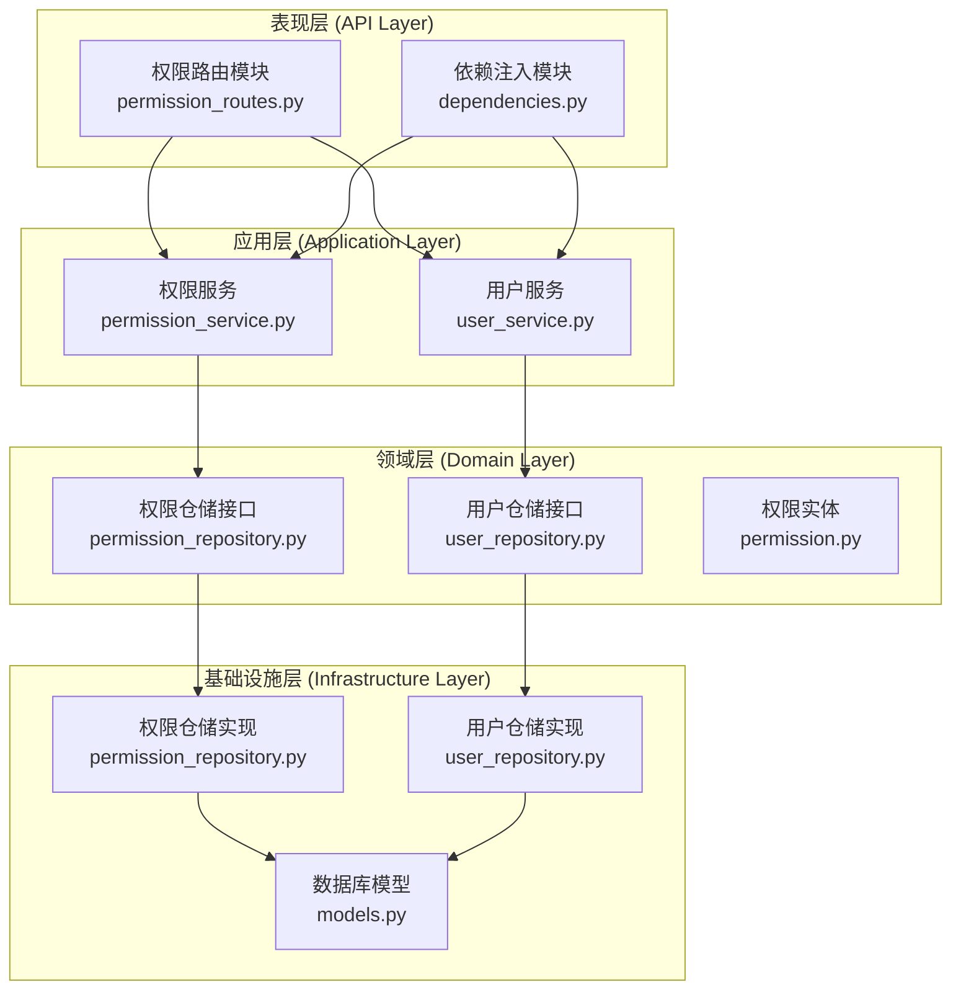
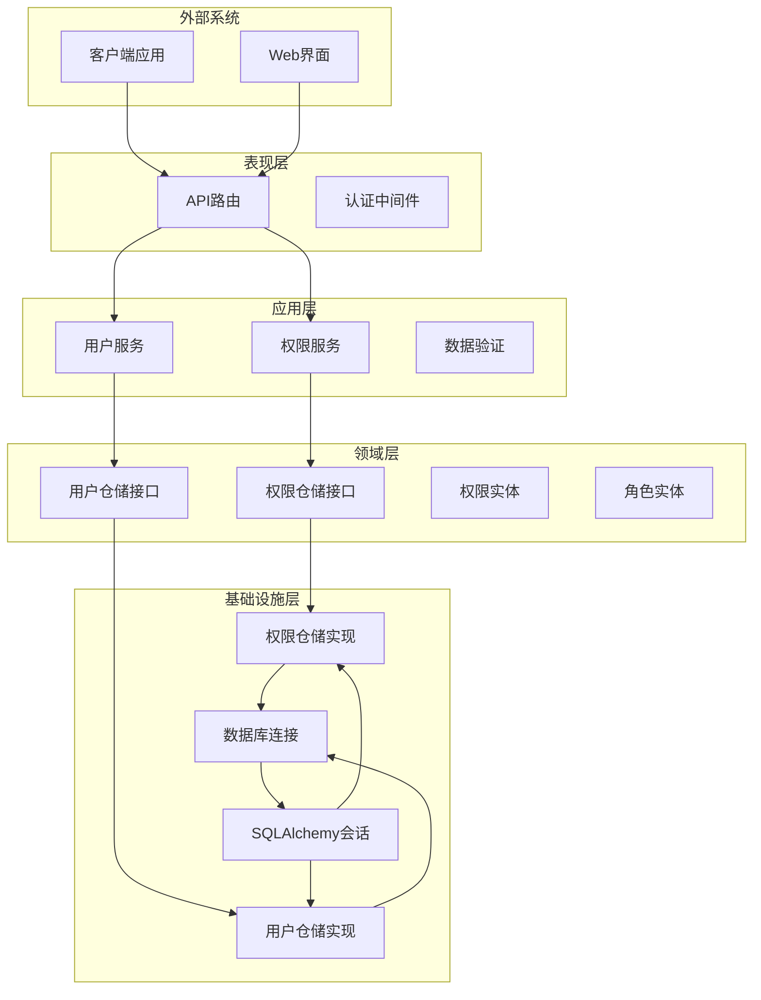
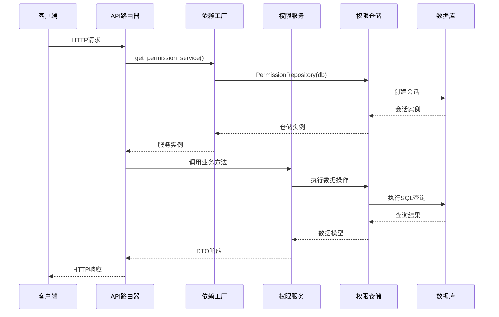
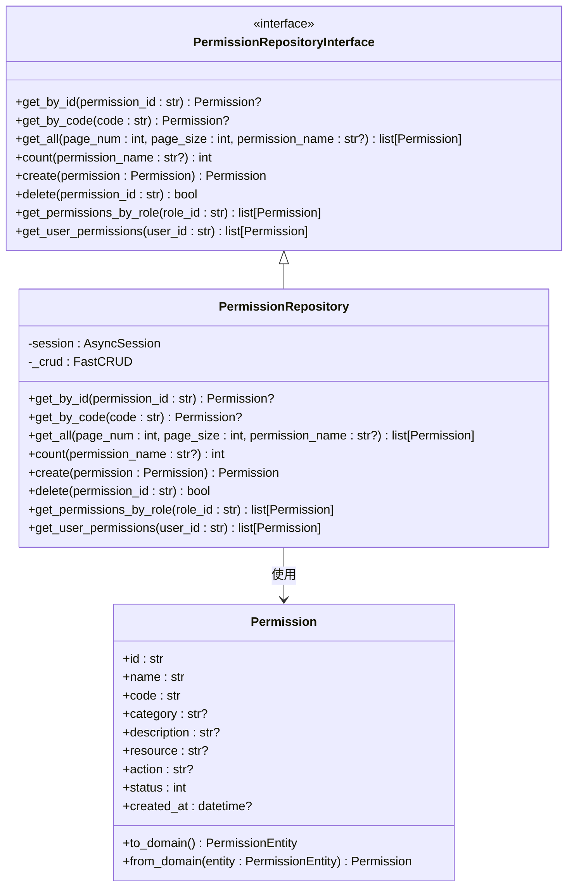
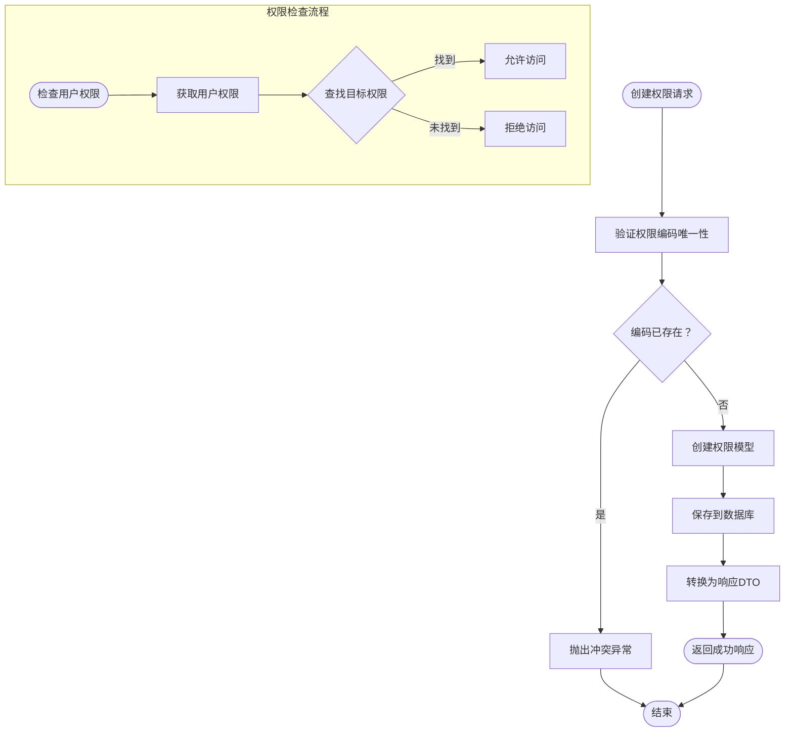
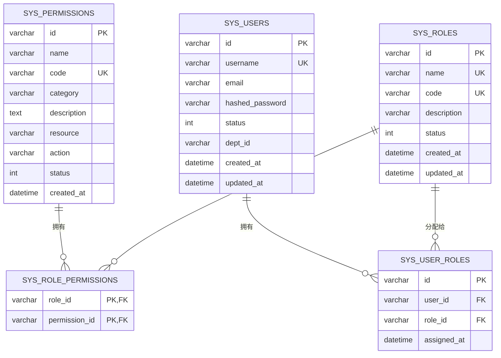
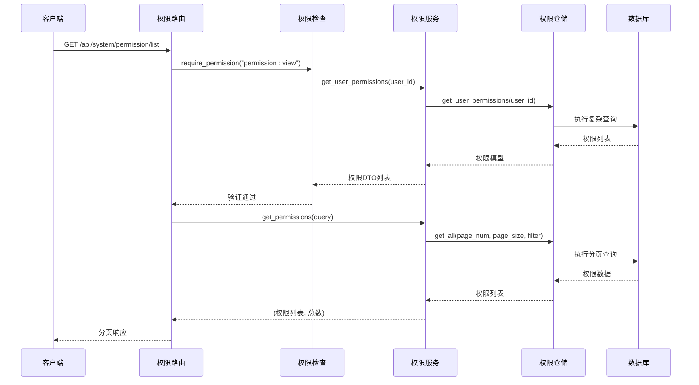
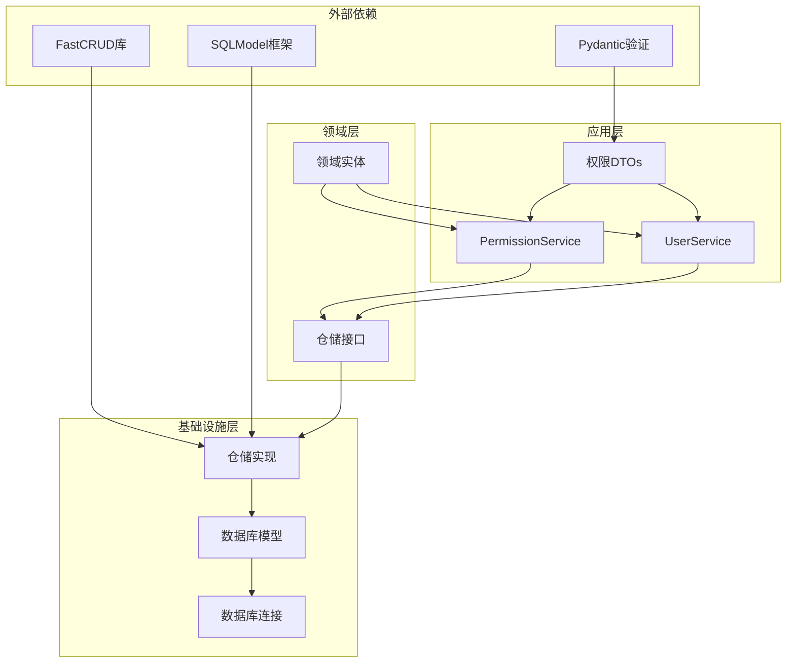

# 权限仓库层

<cite>
**本文档引用的文件**
- [permission_repository.py](file://service/src/domain/repositories/permission_repository.py)
- [permission_repository.py](file://service/src/infrastructure/repositories/permission_repository.py)
- [permission_service.py](file://service/src/application/services/permission_service.py)
- [permission_routes.py](file://service/src/api/v1/permission_routes.py)
- [models.py](file://service/src/infrastructure/database/models.py)
- [permission_dto.py](file://service/src/application/dto/permission_dto.py)
- [dependencies.py](file://service/src/api/dependencies.py)
- [permission.py](file://service/src/domain/entities/permission.py)
- [user_repository.py](file://service/src/domain/repositories/user_repository.py)
- [user_repository.py](file://service/src/infrastructure/repositories/user_repository.py)
- [user_service.py](file://service/src/application/services/user_service.py)
- [user_routes.py](file://service/src/api/v1/user_routes.py)
</cite>

## 目录
1. [简介](#简介)
2. [项目结构](#项目结构)
3. [核心组件](#核心组件)
4. [架构概览](#架构概览)
5. [详细组件分析](#详细组件分析)
6. [依赖关系分析](#依赖关系分析)
7. [性能考虑](#性能考虑)
8. [故障排除指南](#故障排除指南)
9. [结论](#结论)

## 简介

本文档深入分析了基于FastAPI的权限仓库层实现，这是一个采用Clean Architecture设计模式的RBAC（基于角色的访问控制）系统的核心部分。该权限仓库层实现了完整的权限管理功能，包括权限的创建、查询、删除以及基于角色的权限继承机制。

该系统使用SQLModel作为ORM框架，结合FastCRUD库简化CRUD操作，通过依赖注入模式实现松耦合的设计。权限仓库层严格遵循依赖倒置原则，将业务逻辑与数据访问层分离，提供了高度可测试性和可维护性的架构基础。

## 项目结构

权限仓库层在整个项目架构中位于基础设施层，负责具体的数据库操作实现。下图展示了权限相关组件在整体架构中的位置：

**图表来源**
- [permission_routes.py:1-73](file://service/src/api/v1/permission_routes.py#L1-L73)
- [permission_service.py:1-62](file://service/src/application/services/permission_service.py#L1-L62)
- [permission_repository.py:1-99](file://service/src/domain/repositories/permission_repository.py#L1-L99)
- [permission_repository.py:1-129](file://service/src/infrastructure/repositories/permission_repository.py#L1-L129)

**章节来源**
- [permission_repository.py:1-99](file://service/src/domain/repositories/permission_repository.py#L1-L99)
- [permission_repository.py:1-129](file://service/src/infrastructure/repositories/permission_repository.py#L1-L129)
- [models.py:149-179](file://service/src/infrastructure/database/models.py#L149-L179)

## 核心组件

权限仓库层包含以下核心组件：

### 1. 权限仓储接口 (PermissionRepositoryInterface)
这是领域层的抽象接口，定义了权限操作的标准契约：
- 基础CRUD操作：`get_by_id`, `get_by_code`, `get_all`, `count`, `create`, `delete`
- RBAC相关查询：`get_permissions_by_role`, `get_user_permissions`

### 2. 权限仓储实现 (PermissionRepository)
这是基础设施层的具体实现，使用SQLModel和FastCRUD：
- 基于FastCRUD的简化CRUD操作
- 复杂查询的SQLAlchemy原生实现
- 支持分页和条件筛选

### 3. 权限服务 (PermissionService)
应用层的服务类，协调权限操作：
- 业务逻辑验证（如权限编码唯一性检查）
- 数据转换（模型到DTO的转换）
- 错误处理和异常管理

### 4. 数据库模型
使用SQLModel定义的权限相关模型：
- Permission：权限实体模型
- RolePermissionLink：角色-权限关联表
- UserRole：用户-角色关联表

**章节来源**
- [permission_repository.py:13-99](file://service/src/domain/repositories/permission_repository.py#L13-L99)
- [permission_repository.py:16-129](file://service/src/infrastructure/repositories/permission_repository.py#L16-L129)
- [permission_service.py:11-62](file://service/src/application/services/permission_service.py#L11-L62)
- [models.py:149-197](file://service/src/infrastructure/database/models.py#L149-L197)

## 架构概览

权限仓库层采用了经典的Clean Architecture分层架构，确保了关注点分离和依赖方向的正确性：

**图表来源**
- [dependencies.py:115-162](file://service/src/api/dependencies.py#L115-L162)
- [permission_service.py:14-22](file://service/src/application/services/permission_service.py#L14-L22)
- [user_service.py:24-39](file://service/src/application/services/user_service.py#L24-L39)

### 依赖注入流程

**图表来源**
- [dependencies.py:156-162](file://service/src/api/dependencies.py#L156-L162)
- [permission_routes.py:17-38](file://service/src/api/v1/permission_routes.py#L17-L38)

**章节来源**
- [dependencies.py:1-201](file://service/src/api/dependencies.py#L1-L201)
- [permission_routes.py:1-73](file://service/src/api/v1/permission_routes.py#L1-L73)

## 详细组件分析

### 权限仓储接口分析

权限仓储接口定义了完整的权限操作契约，体现了良好的面向对象设计原则：

**图表来源**
- [permission_repository.py:13-99](file://service/src/domain/repositories/permission_repository.py#L13-L99)
- [permission_repository.py:16-129](file://service/src/infrastructure/repositories/permission_repository.py#L16-L129)
- [models.py:149-179](file://service/src/infrastructure/database/models.py#L149-L179)

#### 核心方法实现特点

1. **异步操作支持**：所有方法都使用async/await语法，确保高性能的数据库操作
2. **类型安全**：完整的类型注解，提供编译时类型检查
3. **错误处理**：通过None返回值和异常机制处理不存在的情况
4. **灵活查询**：支持多种查询条件和分页参数

**章节来源**
- [permission_repository.py:1-99](file://service/src/domain/repositories/permission_repository.py#L1-L99)
- [permission_repository.py:1-129](file://service/src/infrastructure/repositories/permission_repository.py#L1-L129)

### 权限服务业务逻辑

权限服务封装了业务规则和验证逻辑：

**图表来源**
- [permission_service.py:24-32](file://service/src/application/services/permission_service.py#L24-L32)
- [permission_service.py:53-56](file://service/src/application/services/permission_service.py#L53-L56)

#### 业务规则实现

1. **权限编码唯一性**：防止重复的权限编码
2. **权限状态管理**：支持启用/禁用状态
3. **权限继承机制**：通过角色实现权限继承
4. **权限检查优化**：提供高效的权限验证方法

**章节来源**
- [permission_service.py:1-62](file://service/src/application/services/permission_service.py#L1-L62)

### 数据模型设计

权限相关的数据库模型设计体现了良好的ORM实践：

**图表来源**
- [models.py:149-197](file://service/src/infrastructure/database/models.py#L149-L197)
- [models.py:29-36](file://service/src/infrastructure/database/models.py#L29-L36)
- [models.py:182-197](file://service/src/infrastructure/database/models.py#L182-L197)

#### 模型特性

1. **UUID主键**：使用36位UUID作为主键，支持分布式环境
2. **唯一约束**：权限编码和角色编码的唯一性保证
3. **软删除支持**：通过状态字段实现逻辑删除
4. **时间戳管理**：自动记录创建和更新时间

**章节来源**
- [models.py:149-197](file://service/src/infrastructure/database/models.py#L149-L197)

### API路由集成

权限路由模块展示了如何将仓储层集成到Web API中：

**图表来源**
- [permission_routes.py:17-38](file://service/src/api/v1/permission_routes.py#L17-L38)
- [dependencies.py:84-97](file://service/src/api/dependencies.py#L84-L97)

**章节来源**
- [permission_routes.py:1-73](file://service/src/api/v1/permission_routes.py#L1-L73)
- [dependencies.py:84-97](file://service/src/api/dependencies.py#L84-L97)

## 依赖关系分析

权限仓库层的依赖关系清晰且符合Clean Architecture原则：

**图表来源**
- [permission_repository.py:8-13](file://service/src/infrastructure/repositories/permission_repository.py#L8-L13)
- [permission_service.py:5-8](file://service/src/application/services/permission_service.py#L5-L8)
- [permission_dto.py:5-30](file://service/src/application/dto/permission_dto.py#L5-L30)

### 循环依赖检测

经过分析，权限仓库层没有发现循环依赖：
- 领域层不依赖基础设施层
- 应用层依赖领域层接口
- 基础设施层实现领域层接口
- 路由层依赖应用层服务

这种设计确保了良好的可测试性和可维护性。

**章节来源**
- [permission_repository.py:1-99](file://service/src/domain/repositories/permission_repository.py#L1-L99)
- [permission_service.py:1-62](file://service/src/application/services/permission_service.py#L1-L62)
- [dependencies.py:1-201](file://service/src/api/dependencies.py#L1-L201)

## 性能考虑

权限仓库层在设计时充分考虑了性能优化：

### 1. 查询优化策略

- **分页查询**：使用offset和limit实现高效分页
- **条件筛选**：支持多字段条件查询，减少不必要的数据传输
- **去重查询**：使用distinct避免重复权限数据
- **批量操作**：支持批量删除等高效操作

### 2. 缓存策略

虽然当前实现未包含缓存层，但架构设计支持缓存集成：
- 权限数据相对稳定，适合缓存
- 可以实现Redis缓存提高查询性能
- 缓存失效策略需要考虑权限变更时机

### 3. 数据库优化

- **索引设计**：权限编码和用户ID建立索引
- **连接池**：使用异步连接池管理数据库连接
- **事务管理**：合理使用事务确保数据一致性

## 故障排除指南

### 常见问题及解决方案

#### 1. 权限查询异常

**问题症状**：`get_user_permissions`返回空列表
**可能原因**：
- 用户未分配角色
- 角色未分配权限
- 数据库连接问题

**解决步骤**：
1. 检查用户-角色关联表
2. 检查角色-权限关联表
3. 验证数据库连接状态

#### 2. 权限创建失败

**问题症状**：创建权限时报唯一性约束错误
**可能原因**：
- 权限编码重复
- 数据库约束冲突

**解决步骤**：
1. 验证权限编码唯一性
2. 检查数据库约束
3. 清理重复数据

#### 3. 性能问题

**问题症状**：权限查询响应缓慢
**可能原因**：
- 缺少必要的数据库索引
- 查询条件不够精确
- 数据量过大

**优化建议**：
1. 添加适当的数据库索引
2. 优化查询条件
3. 考虑分页和缓存策略

**章节来源**
- [permission_service.py:24-46](file://service/src/application/services/permission_service.py#L24-L46)
- [permission_repository.py:106-129](file://service/src/infrastructure/repositories/permission_repository.py#L106-L129)

## 结论

权限仓库层实现了完整的RBAC权限管理系统，具有以下优势：

### 设计优势
1. **清晰的分层架构**：严格遵循Clean Architecture原则
2. **依赖倒置**：通过接口隔离具体实现
3. **可测试性**：良好的抽象设计便于单元测试
4. **扩展性**：易于添加新的权限类型和查询条件

### 技术优势
1. **异步支持**：全面的async/await支持
2. **类型安全**：完整的类型注解
3. **ORM集成**：SQLModel提供强大的ORM功能
4. **CRUD简化**：FastCRUD大幅减少样板代码

### 业务价值
1. **权限管理**：完整的权限生命周期管理
2. **RBAC实现**：灵活的角色-权限映射
3. **安全控制**：细粒度的访问控制
4. **审计支持**：完整的权限变更记录

该权限仓库层为整个系统的安全控制奠定了坚实的基础，为后续的功能扩展和性能优化提供了良好的架构支撑。