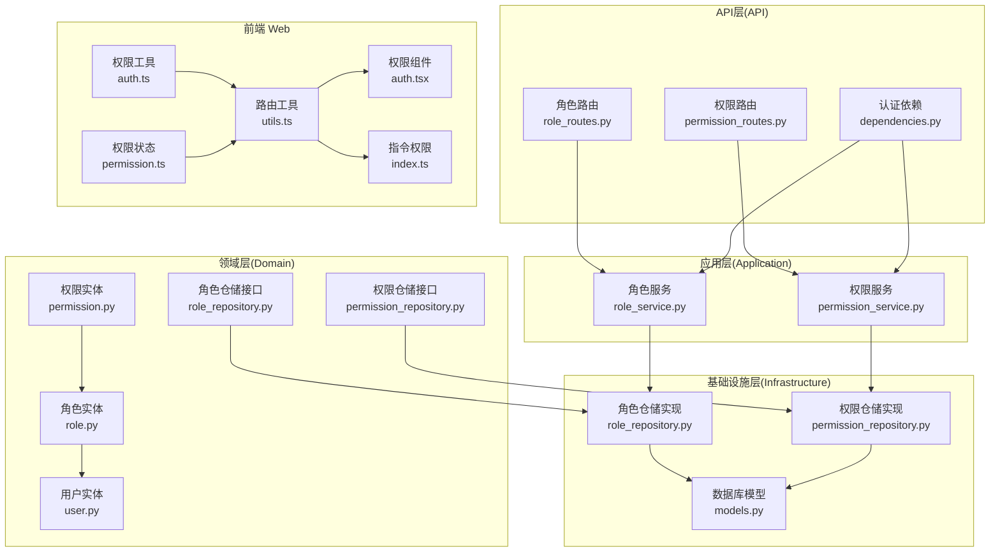
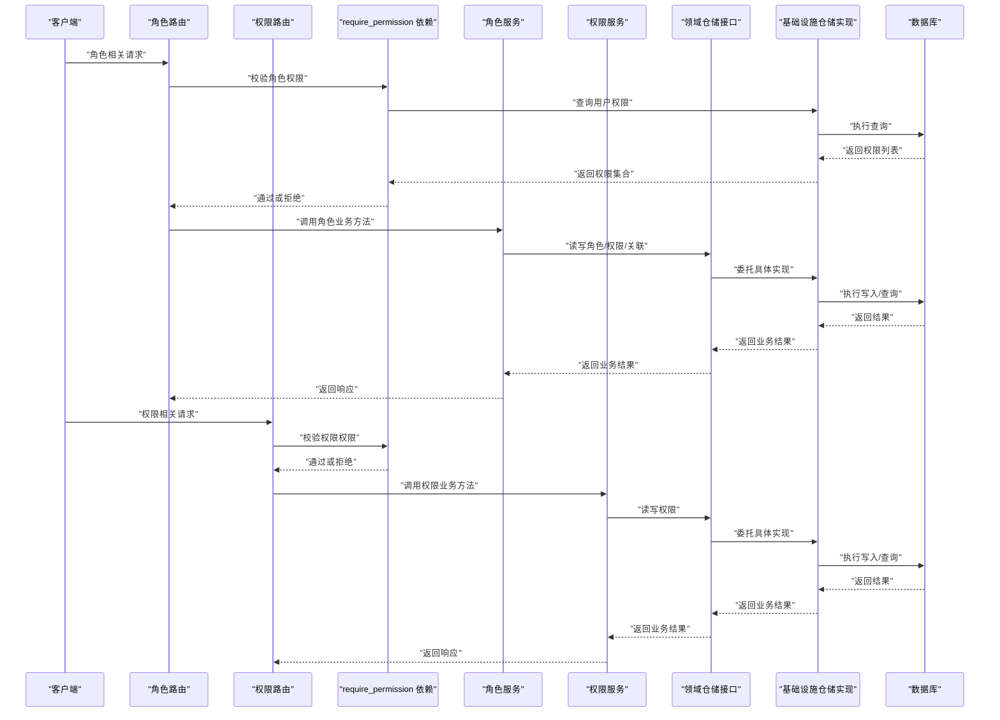
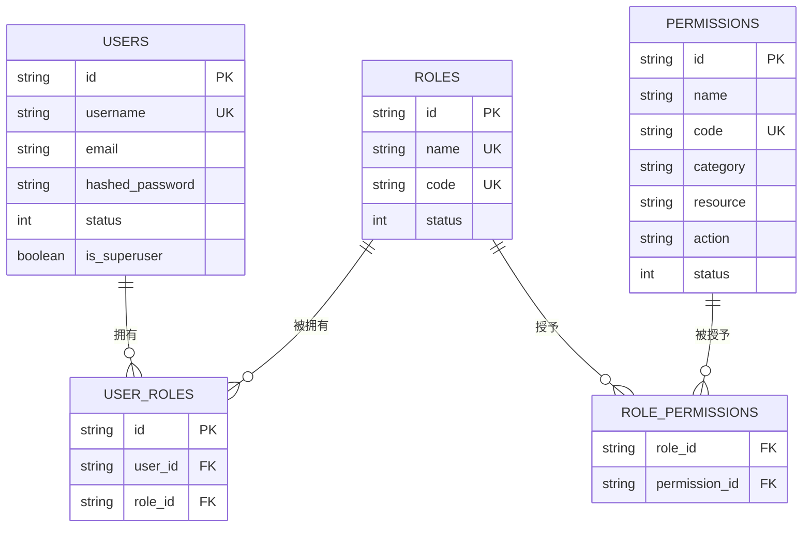
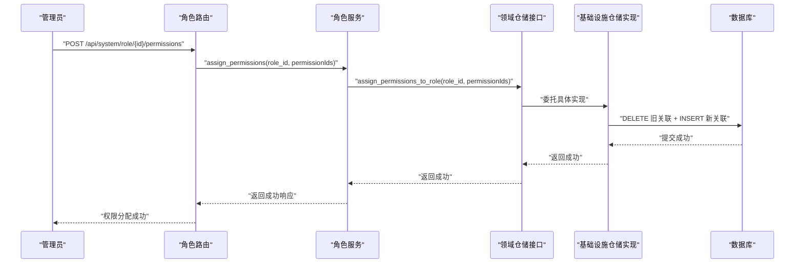
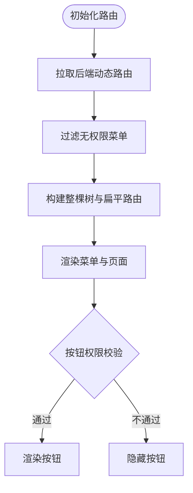
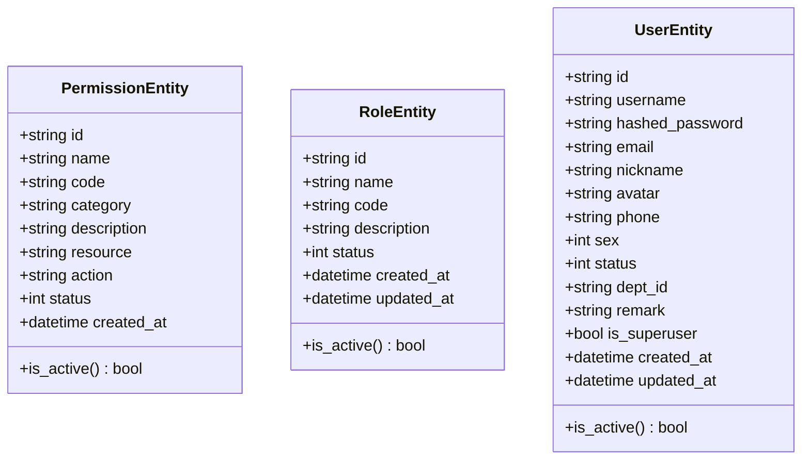
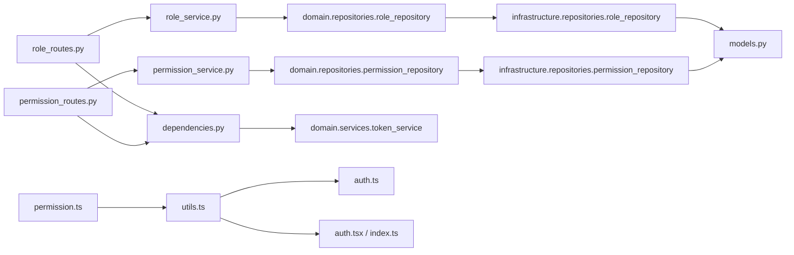

# RBAC 权限系统

<cite>
**本文档引用的文件**
- [role_routes.py](file://service/src/api/v1/role_routes.py)
- [permission_routes.py](file://service/src/api/v1/permission_routes.py)
- [role_service.py](file://service/src/application/services/role_service.py)
- [permission_service.py](file://service/src/application/services/permission_service.py)
- [role_dto.py](file://service/src/application/dto/role_dto.py)
- [permission_dto.py](file://service/src/application/dto/permission_dto.py)
- [role_repository.py](file://service/src/domain/repositories/role_repository.py)
- [permission_repository.py](file://service/src/domain/repositories/permission_repository.py)
- [role_repository.py](file://service/src/infrastructure/repositories/role_repository.py)
- [permission_repository.py](file://service/src/infrastructure/repositories/permission_repository.py)
- [dependencies.py](file://service/src/api/dependencies.py)
- [models.py](file://service/src/infrastructure/database/models.py)
- [token_service.py](file://service/src/domain/services/token_service.py)
- [settings.py](file://service/src/config/settings.py)
- [utils.ts](file://web/src/router/utils.ts)
- [auth.tsx](file://web/src/components/ReAuth/src/auth.tsx)
- [index.ts](file://web/src/directives/auth/index.ts)
- [auth.ts](file://web/src/utils/auth.ts)
- [permission.ts](file://web/src/store/modules/permission.ts)
- [permission.py](file://service/src/domain/entities/permission.py)
- [role.py](file://service/src/domain/entities/role.py)
- [user.py](file://service/src/domain/entities/user.py)
- [__init__.py](file://service/src/domain/__init__.py)
</cite>

## 更新摘要
**变更内容**
- RBAC系统已完成架构重构，从单一rbac_routes.py拆分为专门的role_routes.py和permission_routes.py
- 服务层从rbac_service.py拆分为role_service.py和permission_service.py
- 仓储层从rbac_repository.py拆分为role_repository.py和permission_repository.py
- 采用DDD设计原则，实现更清晰的分层架构和职责分离
- 新增领域层仓储接口定义，实现依赖倒置原则

## 目录
1. [引言](#引言)
2. [项目结构](#项目结构)
3. [核心组件](#核心组件)
4. [架构总览](#架构总览)
5. [详细组件分析](#详细组件分析)
6. [依赖分析](#依赖分析)
7. [性能考虑](#性能考虑)
8. [故障排查指南](#故障排查指南)
9. [结论](#结论)
10. [附录](#附录)

## 引言
本文件面向 Hello-FastApi 的 RBAC（基于角色的访问控制）权限系统，系统性阐述其架构设计、数据模型、权限验证机制、动态权限分配与继承策略，并提供角色管理、权限管理与用户授权的完整流程说明。经过重构后，系统采用DDD（领域驱动设计）架构，将角色和权限功能分离到独立的服务和路由模块中，实现了更好的代码组织和可维护性。

**更新** 本版本反映了RBAC架构重构后的最新结构，权限实体和仓储已迁移到新的领域层(domain)结构中，采用DDD设计原则实现更好的分层架构。

## 项目结构
RBAC 权限系统主要分布在后端服务与前端 Web 两部分，现已重构为基于领域驱动设计(Domain-Driven Design)的分层架构：
- 后端服务（Python/FastAPI）：角色路由模块、权限路由模块、应用服务、仓储层、数据库模型、认证与权限依赖注入。
- 前端 Web（Vue3）：路由权限过滤、指令与组件级权限控制、用户权限存储与校验工具。

**图表来源**
- [role_routes.py:1-167](file://service/src/api/v1/role_routes.py#L1-L167)
- [permission_routes.py:1-85](file://service/src/api/v1/permission_routes.py#L1-L85)
- [role_service.py:1-178](file://service/src/application/services/role_service.py#L1-L178)
- [permission_service.py:1-78](file://service/src/application/services/permission_service.py#L1-L78)
- [role_repository.py:1-209](file://service/src/domain/repositories/role_repository.py#L1-L209)
- [permission_repository.py:1-101](file://service/src/domain/repositories/permission_repository.py#L1-L101)
- [role_repository.py:1-307](file://service/src/infrastructure/repositories/role_repository.py#L1-L307)
- [permission_repository.py:1-149](file://service/src/infrastructure/repositories/permission_repository.py#L1-L149)
- [dependencies.py:1-201](file://service/src/api/dependencies.py#L1-L201)

**章节来源**
- [role_routes.py:1-167](file://service/src/api/v1/role_routes.py#L1-L167)
- [permission_routes.py:1-85](file://service/src/api/v1/permission_routes.py#L1-L85)
- [role_service.py:1-178](file://service/src/application/services/role_service.py#L1-L178)
- [permission_service.py:1-78](file://service/src/application/services/permission_service.py#L1-L78)
- [role_repository.py:1-209](file://service/src/domain/repositories/role_repository.py#L1-L209)
- [permission_repository.py:1-101](file://service/src/domain/repositories/permission_repository.py#L1-L101)
- [role_repository.py:1-307](file://service/src/infrastructure/repositories/role_repository.py#L1-L307)
- [permission_repository.py:1-149](file://service/src/infrastructure/repositories/permission_repository.py#L1-L149)
- [dependencies.py:1-201](file://service/src/api/dependencies.py#L1-L201)

## 核心组件
- **角色路由模块**：提供角色管理相关的接口，包括角色增删改查、权限分配、菜单权限分配等功能。
- **权限路由模块**：提供权限管理相关的接口，包括权限增删改查、分页查询等功能。
- **角色服务**：编排角色相关的业务逻辑，执行角色创建、更新、删除、权限分配等操作。
- **权限服务**：编排权限相关的业务逻辑，执行权限创建、删除、查询等操作。
- **领域仓储接口**：定义抽象的仓储接口，遵循依赖倒置原则，实现角色和权限的抽象访问。
- **基础设施仓储实现**：基于 SQLModel 的具体实现，负责角色、权限的查询与写入。
- **认证与权限依赖**：从 JWT 中提取用户身份，按需校验所需权限。
- **前端路由与组件**：根据后端返回的权限与路由元信息，过滤菜单与按钮级权限。

**更新** 现在使用领域层的抽象接口，通过基础设施层的具体实现来完成数据持久化操作，实现了更好的分层架构。

**章节来源**
- [role_routes.py:20-167](file://service/src/api/v1/role_routes.py#L20-L167)
- [permission_routes.py:17-85](file://service/src/api/v1/permission_routes.py#L17-L85)
- [role_service.py:17-178](file://service/src/application/services/role_service.py#L17-L178)
- [permission_service.py:15-78](file://service/src/application/services/permission_service.py#L15-L78)
- [role_repository.py:13-209](file://service/src/domain/repositories/role_repository.py#L13-L209)
- [permission_repository.py:13-101](file://service/src/domain/repositories/permission_repository.py#L13-L101)

## 架构总览
RBAC 权限系统遵循"路由 → 依赖校验 → 应用服务 → 仓储 → 数据库"的标准分层架构。后端通过 JWT 令牌识别用户身份，结合 require_permission 依赖在路由层强制权限校验；应用服务负责角色与权限的业务编排；仓储层实现多对多关系（用户-角色、角色-权限）的查询与写入；前端通过路由工具与组件/指令实现菜单与按钮级权限控制。

**图表来源**
- [role_routes.py:20-167](file://service/src/api/v1/role_routes.py#L20-L167)
- [permission_routes.py:17-85](file://service/src/api/v1/permission_routes.py#L17-L85)
- [dependencies.py:84-97](file://service/src/api/dependencies.py#L84-L97)
- [role_service.py:17-178](file://service/src/application/services/role_service.py#L17-L178)
- [permission_service.py:15-78](file://service/src/application/services/permission_service.py#L15-L78)
- [role_repository.py:15-307](file://service/src/infrastructure/repositories/role_repository.py#L15-L307)
- [permission_repository.py:14-149](file://service/src/infrastructure/repositories/permission_repository.py#L14-L149)

## 详细组件分析

### 数据模型与关系
RBAC 使用三张核心表与两张关联表：
- 用户表（users）：用户基本信息与状态。
- 角色表（roles）：角色名称、编码、状态等。
- 权限表（permissions）：权限名称、编码、分类、动作、资源等。
- 用户-角色关联表（user_roles）：多对多关系。
- 角色-权限关联表（role_permissions）：多对多关系。

**更新** 现在使用领域实体进行数据转换，ORM模型与领域实体之间提供双向转换方法。

**图表来源**
- [models.py:117-180](file://service/src/infrastructure/database/models.py#L117-L180)

**章节来源**
- [models.py:117-180](file://service/src/infrastructure/database/models.py#L117-L180)

### 权限验证机制与依赖注入
- 令牌解析：从 Authorization 头中提取 Bearer 令牌，解码并校验类型为 access。
- 当前用户：通过用户 ID 查询数据库，确保账户处于启用状态。
- 权限校验：require_permission 依赖从数据库查询用户所拥有的权限集合，若不包含目标权限则抛出禁止访问错误。
- 超级用户：若用户为超级管理员，则绕过权限校验。

**图表来源**
- [dependencies.py:57-97](file://service/src/api/dependencies.py#L57-L97)
- [permission_repository.py:132-149](file://service/src/infrastructure/repositories/permission_repository.py#L132-L149)
- [token_service.py:33-44](file://service/src/domain/services/token_service.py#L33-L44)

**章节来源**
- [dependencies.py:57-97](file://service/src/api/dependencies.py#L57-L97)
- [permission_repository.py:132-149](file://service/src/infrastructure/repositories/permission_repository.py#L132-L149)
- [token_service.py:11-45](file://service/src/domain/services/token_service.py#L11-L45)

### 角色管理与权限管理流程
- **角色管理**：支持分页查询、创建、详情、更新、删除、批量分配权限、分配菜单权限。
- **权限管理**：支持分页查询、创建、删除。
- **动态权限分配**：为角色分配权限时，先清理旧关联，再建立新关联，保证一致性。
- **用户授权**：为用户分配角色，或移除用户的角色；查询用户的角色与权限。

**图表来源**
- [role_routes.py:121-138](file://service/src/api/v1/role_routes.py#L121-L138)
- [role_service.py:131-139](file://service/src/application/services/role_service.py#L131-L139)
- [role_repository.py:150-170](file://service/src/infrastructure/repositories/role_repository.py#L150-L170)

**章节来源**
- [role_routes.py:20-167](file://service/src/api/v1/role_routes.py#L20-L167)
- [role_service.py:30-178](file://service/src/application/services/role_service.py#L30-L178)
- [role_repository.py:150-307](file://service/src/infrastructure/repositories/role_repository.py#L150-L307)

### 前端权限控制实现
- **路由级权限**：后端返回动态路由，前端通过工具函数过滤无权限的菜单树，仅展示可访问的路由。
- **按钮级权限**：通过指令 v-auth 或组件 Auth 根据当前用户权限集合判断是否渲染元素。
- **权限存储**：登录后将用户角色与权限写入本地存储，供全局校验使用。

**图表来源**
- [utils.ts:85-95](file://web/src/router/utils.ts#L85-L95)
- [utils.ts:368-383](file://web/src/router/utils.ts#L368-L383)
- [auth.tsx:12-19](file://web/src/components/ReAuth/src/auth.tsx#L12-L19)
- [index.ts:4-15](file://web/src/directives/auth/index.ts#L4-L15)
- [auth.ts:130-141](file://web/src/utils/auth.ts#L130-L141)

**章节来源**
- [utils.ts:85-95](file://web/src/router/utils.ts#L85-L95)
- [utils.ts:368-383](file://web/src/router/utils.ts#L368-L383)
- [auth.tsx:1-21](file://web/src/components/ReAuth/src/auth.tsx#L1-L21)
- [index.ts:1-16](file://web/src/directives/auth/index.ts#L1-L16)
- [auth.ts:1-142](file://web/src/utils/auth.ts#L1-L142)

### 领域实体与仓储接口
**新增** 领域层现在包含独立的权限和角色实体定义，采用dataclass实现，不依赖任何ORM或外部库。

- **权限实体**：包含id、name、code、category、description、resource、action、status、created_at等字段。
- **角色实体**：包含id、name、code、description、status、created_at、updated_at等字段。
- **用户实体**：包含id、username、hashed_password、email、nickname、avatar、phone、sex、status、dept_id、remark、is_superuser、created_at、updated_at等字段。

**图表来源**
- [permission.py:11-41](file://service/src/domain/entities/permission.py#L11-L41)
- [role.py:11-37](file://service/src/domain/entities/role.py#L11-L37)
- [user.py:11-51](file://service/src/domain/entities/user.py#L11-L51)

**章节来源**
- [permission.py:1-41](file://service/src/domain/entities/permission.py#L1-41)
- [role.py:1-37](file://service/src/domain/entities/role.py#L1-37)
- [user.py:1-51](file://service/src/domain/entities/user.py#L1-51)

## 依赖分析
- **路由依赖于应用服务与数据库会话**，应用服务依赖仓储接口与异常类型。
- **仓储实现依赖 SQLModel 与数据库连接**，查询用户权限时涉及多表关联。
- **前端依赖后端返回的权限与路由元信息**，通过工具函数与状态模块完成权限过滤与渲染。

**更新** 现在应用服务直接依赖领域仓储接口，而不是基础设施仓储实现，实现了依赖倒置原则。

**图表来源**
- [role_routes.py:1-167](file://service/src/api/v1/role_routes.py#L1-L167)
- [permission_routes.py:1-85](file://service/src/api/v1/permission_routes.py#L1-L85)
- [role_service.py:1-178](file://service/src/application/services/role_service.py#L1-L178)
- [permission_service.py:1-78](file://service/src/application/services/permission_service.py#L1-L78)
- [role_repository.py:1-209](file://service/src/domain/repositories/role_repository.py#L1-L209)
- [permission_repository.py:1-101](file://service/src/domain/repositories/permission_repository.py#L1-L101)
- [role_repository.py:1-307](file://service/src/infrastructure/repositories/role_repository.py#L1-L307)
- [permission_repository.py:1-149](file://service/src/infrastructure/repositories/permission_repository.py#L1-L149)
- [dependencies.py:1-201](file://service/src/api/dependencies.py#L1-L201)

**章节来源**
- [role_routes.py:1-167](file://service/src/api/v1/role_routes.py#L1-L167)
- [permission_routes.py:1-85](file://service/src/api/v1/permission_routes.py#L1-L85)
- [role_service.py:1-178](file://service/src/application/services/role_service.py#L1-L178)
- [permission_service.py:1-78](file://service/src/application/services/permission_service.py#L1-L78)
- [role_repository.py:1-209](file://service/src/domain/repositories/role_repository.py#L1-L209)
- [permission_repository.py:1-101](file://service/src/domain/repositories/permission_repository.py#L1-L101)
- [role_repository.py:1-307](file://service/src/infrastructure/repositories/role_repository.py#L1-L307)
- [permission_repository.py:1-149](file://service/src/infrastructure/repositories/permission_repository.py#L1-L149)
- [dependencies.py:1-201](file://service/src/api/dependencies.py#L1-L201)

## 性能考虑
- **查询优化**：权限查询使用 JOIN 并去重，建议在权限编码与用户-角色关联键上建立索引。
- **批量写入**：角色权限分配采用先清后插的方式，适合中小规模权限集；大规模场景可考虑差异对比与增量写入。
- **缓存策略**：可在应用层对热点权限集合进行短期缓存，减少数据库压力。
- **前端渲染**：路由树构建与权限过滤在前端一次性完成，避免重复请求；可通过本地缓存减少重复拉取。

## 故障排查指南
- **令牌问题**：确认 Authorization 头格式正确，令牌未过期，类型为 access。
- **权限不足**：检查用户是否具备所需权限编码；超级用户可绕过校验。
- **资源不存在**：角色或权限 ID 不存在时会触发未找到错误。
- **冲突错误**：角色名称/编码重复、用户已拥有某角色等情况会触发冲突错误。
- **前端按钮不显示**：检查当前用户权限集合与按钮权限码是否匹配；确认路由元信息中的权限码正确。

**章节来源**
- [dependencies.py:57-97](file://service/src/api/dependencies.py#L57-L97)
- [role_service.py:30-178](file://service/src/application/services/role_service.py#L30-L178)
- [permission_service.py:28-78](file://service/src/application/services/permission_service.py#L28-L78)
- [permission_repository.py:132-149](file://service/src/infrastructure/repositories/permission_repository.py#L132-L149)
- [auth.ts:130-141](file://web/src/utils/auth.ts#L130-L141)

## 结论
Hello-FastApi 的 RBAC 权限系统以清晰的分层架构与明确的职责划分实现了角色、权限与用户的解耦管理。经过重构后，系统采用了领域驱动设计原则，权限实体和仓储接口位于领域层，基础设施层提供具体实现，应用层通过依赖倒置原则调用仓储接口，实现了更好的可测试性和可维护性。后端通过 JWT 与依赖注入在路由层强制权限校验，应用服务编排业务流程，仓储层实现多对多关系的高效查询与写入；前端通过路由工具与组件/指令实现菜单与按钮级权限控制。该体系具备良好的扩展性与可维护性，便于后续引入更复杂的权限模型（如资源级细粒度控制）与审计追踪。

## 附录

### API 接口文档（后端）
- **角色管理**
  - POST /api/system/role：创建角色（需要 role:manage）
  - GET /api/system/role/{role_id}：获取角色详情（需要 role:view）
  - PUT /api/system/role/{role_id}：更新角色（需要 role:manage）
  - DELETE /api/system/role/{role_id}：删除角色（需要 role:manage）
  - POST /api/system/role/{role_id}/permissions：为角色分配权限（需要 role:manage）
  - POST /api/system/role/{role_id}/menu：为角色分配菜单权限（需要 role:manage）

- **权限管理**
  - GET /api/system/permission/list：分页获取权限列表（需要 permission:view）
  - POST /api/system/permission：创建权限（需要 permission:manage）
  - DELETE /api/system/permission/{permission_id}：删除权限（需要 permission:manage）

**章节来源**
- [role_routes.py:20-167](file://service/src/api/v1/role_routes.py#L20-L167)
- [permission_routes.py:17-85](file://service/src/api/v1/permission_routes.py#L17-L85)

### 数据传输对象（DTO）
- **角色DTO**：创建、更新、响应、列表查询、权限分配。
- **权限DTO**：创建、响应、列表查询。

**章节来源**
- [role_dto.py:10-92](file://service/src/application/dto/role_dto.py#L10-L92)
- [permission_dto.py:8-38](file://service/src/application/dto/permission_dto.py#L8-L38)

### 前端权限使用示例
- **指令 v-auth**：在模板中根据权限码控制元素渲染。
- **组件 Auth**：以组件形式包裹内容，依据权限码决定是否显示。
- **工具函数 hasPerms**：全局按钮级权限校验。
- **路由工具 hasAuth**：基于当前路由元信息进行按钮权限判断。

**章节来源**
- [index.ts:1-16](file://web/src/directives/auth/index.ts#L1-L16)
- [auth.tsx:1-21](file://web/src/components/ReAuth/src/auth.tsx#L1-L21)
- [auth.ts:130-141](file://web/src/utils/auth.ts#L130-L141)
- [utils.ts:368-383](file://web/src/router/utils.ts#L368-L383)

### 扩展与自定义指导
- **权限模型扩展**：在权限表增加资源与动作字段，配合后端权限校验逻辑实现资源级控制。
- **权限继承**：在仓储层增加角色层级查询，合并上级角色权限；在应用服务中聚合用户权限。
- **动态菜单**：后端返回菜单与权限编码映射，前端通过工具函数过滤并渲染。
- **审计与日志**：在应用服务的关键操作点记录审计日志，便于追踪权限变更。

### 领域层架构说明
**新增** 领域层采用DDD设计原则，包含以下关键特性：

- **实体层**：使用dataclass定义纯数据载体，不依赖任何外部库。
- **仓储接口**：定义抽象接口，遵循依赖倒置原则，便于替换实现。
- **领域服务**：提供业务逻辑服务，如密码服务和令牌服务。
- **依赖注入**：应用服务通过接口依赖仓储，实现松耦合设计。

**章节来源**
- [__init__.py:1-42](file://service/src/domain/__init__.py#L1-L42)
- [role_repository.py:13-209](file://service/src/domain/repositories/role_repository.py#L13-L209)
- [permission_repository.py:13-101](file://service/src/domain/repositories/permission_repository.py#L13-L101)
- [permission.py:1-41](file://service/src/domain/entities/permission.py#L1-41)
- [role.py:1-37](file://service/src/domain/entities/role.py#L1-37)
- [user.py:1-51](file://service/src/domain/entities/user.py#L1-51)