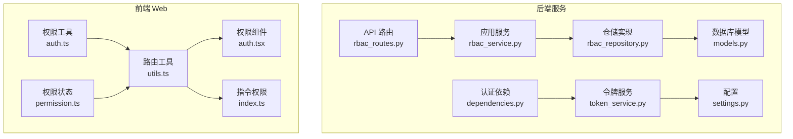
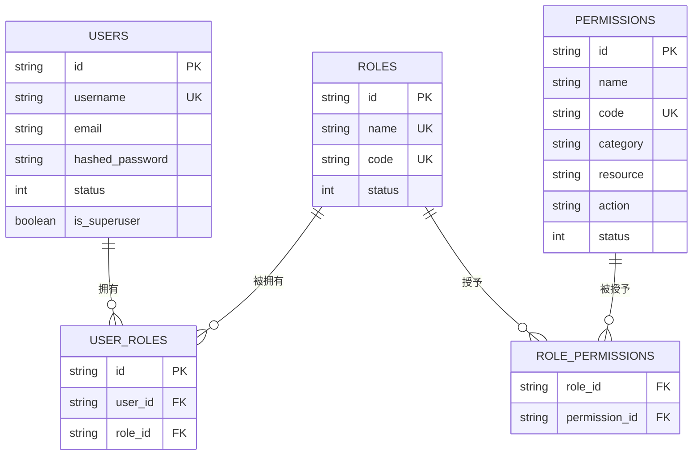
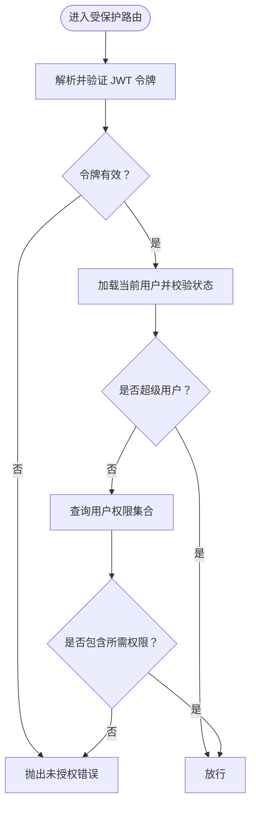
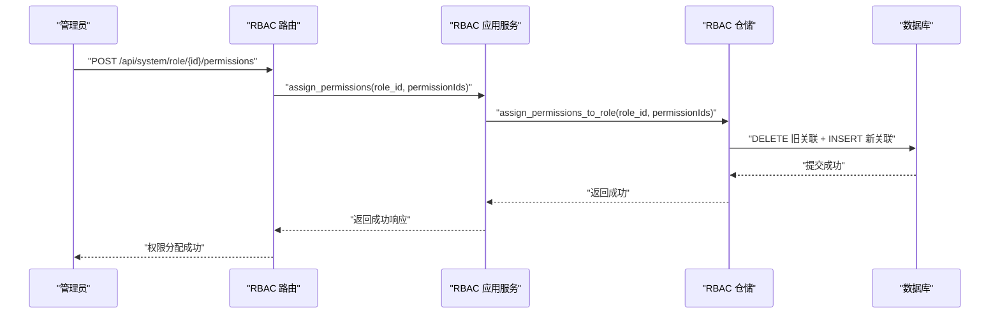
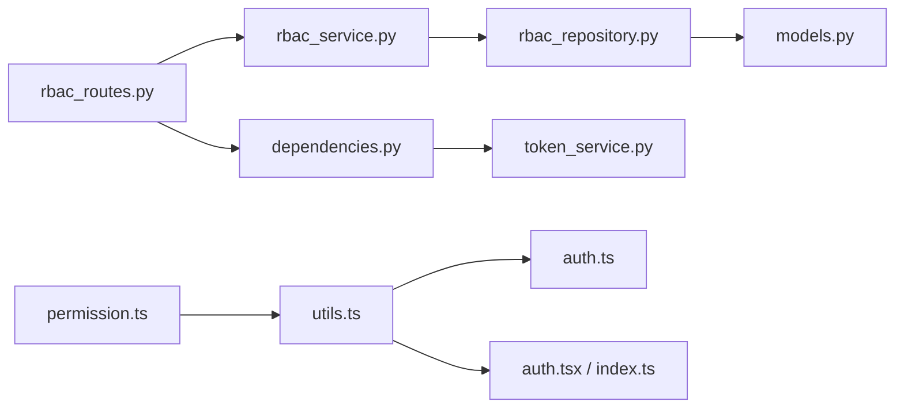

# RBAC 权限系统

<cite>
**本文引用的文件**
- [rbac_routes.py](file://service/src/api/v1/rbac_routes.py)
- [rbac_service.py](file://service/src/application/services/rbac_service.py)
- [rbac_dto.py](file://service/src/application/dto/rbac_dto.py)
- [rbac_repository.py](file://service/src/infrastructure/repositories/rbac_repository.py)
- [models.py](file://service/src/infrastructure/database/models.py)
- [dependencies.py](file://service/src/api/dependencies.py)
- [token_service.py](file://service/src/domain/auth/token_service.py)
- [settings.py](file://service/src/config/settings.py)
- [utils.ts](file://web/src/router/utils.ts)
- [auth.tsx](file://web/src/components/ReAuth/src/auth.tsx)
- [index.ts](file://web/src/directives/auth/index.ts)
- [auth.ts](file://web/src/utils/auth.ts)
- [permission.ts](file://web/src/store/modules/permission.ts)
</cite>

## 目录
1. [引言](#引言)
2. [项目结构](#项目结构)
3. [核心组件](#核心组件)
4. [架构总览](#架构总览)
5. [详细组件分析](#详细组件分析)
6. [依赖分析](#依赖分析)
7. [性能考虑](#性能考虑)
8. [故障排查指南](#故障排查指南)
9. [结论](#结论)
10. [附录](#附录)

## 引言
本文件面向 Hello-FastApi 的 RBAC（基于角色的访问控制）权限系统，系统性阐述其架构设计、数据模型、权限验证机制、动态权限分配与继承策略，并提供角色管理、权限管理与用户授权的完整流程说明。同时给出前后端权限控制的实现要点、API 接口文档与使用示例，以及扩展与自定义指导，帮助开发者快速理解并高效集成与演进该权限体系。

## 项目结构
RBAC 权限系统主要分布在后端服务与前端 Web 两部分：
- 后端服务（Python/FastAPI）：API 路由、应用服务、仓储层、数据库模型、认证与权限依赖注入。
- 前端 Web（Vue3）：路由权限过滤、指令与组件级权限控制、用户权限存储与校验工具。

**图表来源**
- [rbac_routes.py:1-257](file://service/src/api/v1/rbac_routes.py#L1-L257)
- [rbac_service.py:1-231](file://service/src/application/services/rbac_service.py#L1-L231)
- [rbac_repository.py:1-213](file://service/src/infrastructure/repositories/rbac_repository.py#L1-L213)
- [models.py:1-193](file://service/src/infrastructure/database/models.py#L1-L193)
- [dependencies.py:1-72](file://service/src/api/dependencies.py#L1-L72)
- [token_service.py:1-45](file://service/src/domain/auth/token_service.py#L1-L45)
- [settings.py:1-198](file://service/src/config/settings.py#L1-L198)
- [utils.ts:1-424](file://web/src/router/utils.ts#L1-L424)
- [auth.tsx:1-21](file://web/src/components/ReAuth/src/auth.tsx#L1-L21)
- [index.ts:1-16](file://web/src/directives/auth/index.ts#L1-L16)
- [auth.ts:1-142](file://web/src/utils/auth.ts#L1-L142)
- [permission.ts:1-76](file://web/src/store/modules/permission.ts#L1-L76)

**章节来源**
- [rbac_routes.py:1-257](file://service/src/api/v1/rbac_routes.py#L1-L257)
- [rbac_service.py:1-231](file://service/src/application/services/rbac_service.py#L1-L231)
- [rbac_repository.py:1-213](file://service/src/infrastructure/repositories/rbac_repository.py#L1-L213)
- [models.py:1-193](file://service/src/infrastructure/database/models.py#L1-L193)
- [dependencies.py:1-72](file://service/src/api/dependencies.py#L1-L72)
- [token_service.py:1-45](file://service/src/domain/auth/token_service.py#L1-L45)
- [settings.py:1-198](file://service/src/config/settings.py#L1-L198)
- [utils.ts:1-424](file://web/src/router/utils.ts#L1-L424)
- [auth.tsx:1-21](file://web/src/components/ReAuth/src/auth.tsx#L1-L21)
- [index.ts:1-16](file://web/src/directives/auth/index.ts#L1-L16)
- [auth.ts:1-142](file://web/src/utils/auth.ts#L1-L142)
- [permission.ts:1-76](file://web/src/store/modules/permission.ts#L1-L76)

## 核心组件
- API 路由层：提供角色与权限的 CRUD、角色权限分配等接口，统一响应封装。
- 应用服务层：编排业务逻辑，执行权限校验与角色/权限的持久化操作。
- 仓储层：基于 SQLModel 的具体实现，负责角色、权限、用户-角色、角色-权限关联的查询与写入。
- 数据模型层：定义用户、角色、权限、关联表等实体及其关系。
- 认证与权限依赖：从 JWT 中提取用户身份，按需校验所需权限。
- 前端路由与组件：根据后端返回的权限与路由元信息，过滤菜单与按钮级权限。

**章节来源**
- [rbac_routes.py:33-176](file://service/src/api/v1/rbac_routes.py#L33-L176)
- [rbac_service.py:19-231](file://service/src/application/services/rbac_service.py#L19-L231)
- [rbac_repository.py:11-213](file://service/src/infrastructure/repositories/rbac_repository.py#L11-L213)
- [models.py:17-141](file://service/src/infrastructure/database/models.py#L17-L141)
- [dependencies.py:45-61](file://service/src/api/dependencies.py#L45-L61)

## 架构总览
RBAC 权限系统遵循“路由 → 依赖校验 → 应用服务 → 仓储 → 数据库”的标准分层架构。后端通过 JWT 令牌识别用户身份，结合 require_permission 依赖在路由层强制权限校验；应用服务负责角色与权限的业务编排；仓储层实现多对多关系（用户-角色、角色-权限）的查询与写入；前端通过路由工具与组件/指令实现菜单与按钮级权限控制。

```mermaid
sequenceDiagram
participant Client as "客户端"
participant API as "RBAC 路由"
participant Dep as "require_permission 依赖"
participant Svc as "RBAC 应用服务"
participant Repo as "RBAC 仓储"
participant DB as "数据库"
Client->>API : "携带 Bearer 令牌的请求"
API->>Dep : "校验权限"
Dep->>Repo : "查询用户权限"
Repo->>DB : "执行查询"
DB-->>Repo : "返回权限列表"
Repo-->>Dep : "返回权限集合"
Dep-->>API : "通过或拒绝"
API->>Svc : "调用业务方法"
Svc->>Repo : "读写角色/权限/关联"
Repo->>DB : "执行写入/查询"
DB-->>Repo : "返回结果"
Repo-->>Svc : "返回业务结果"
Svc-->>API : "返回响应"
API-->>Client : "统一响应"
```

**图表来源**
- [rbac_routes.py:33-176](file://service/src/api/v1/rbac_routes.py#L33-L176)
- [dependencies.py:45-61](file://service/src/api/dependencies.py#L45-L61)
- [rbac_service.py:19-231](file://service/src/application/services/rbac_service.py#L19-L231)
- [rbac_repository.py:136-213](file://service/src/infrastructure/repositories/rbac_repository.py#L136-L213)

## 详细组件分析

### 数据模型与关系
RBAC 使用三张核心表与两张关联表：
- 用户表（users）：用户基本信息与状态。
- 角色表（roles）：角色名称、编码、状态等。
- 权限表（permissions）：权限名称、编码、分类、动作、资源等。
- 用户-角色关联表（user_roles）：多对多关系。
- 角色-权限关联表（role_permissions）：多对多关系。

**图表来源**
- [models.py:31-141](file://service/src/infrastructure/database/models.py#L31-L141)

**章节来源**
- [models.py:17-141](file://service/src/infrastructure/database/models.py#L17-L141)

### 权限验证机制与依赖注入
- 令牌解析：从 Authorization 头中提取 Bearer 令牌，解码并校验类型为 access。
- 当前用户：通过用户 ID 查询数据库，确保账户处于启用状态。
- 权限校验：require_permission 依赖从数据库查询用户所拥有的权限集合，若不包含目标权限则抛出禁止访问错误。
- 超级用户：若用户为超级管理员，则绕过权限校验。

**图表来源**
- [dependencies.py:16-61](file://service/src/api/dependencies.py#L16-L61)
- [rbac_repository.py:203-212](file://service/src/infrastructure/repositories/rbac_repository.py#L203-L212)
- [token_service.py:33-44](file://service/src/domain/auth/token_service.py#L33-L44)

**章节来源**
- [dependencies.py:16-72](file://service/src/api/dependencies.py#L16-L72)
- [rbac_repository.py:203-212](file://service/src/infrastructure/repositories/rbac_repository.py#L203-L212)
- [token_service.py:11-45](file://service/src/domain/auth/token_service.py#L11-L45)

### 角色管理与权限管理流程
- 角色管理：支持分页查询、创建、详情、更新、删除、批量分配权限。
- 权限管理：支持分页查询、创建、删除。
- 动态权限分配：为角色分配权限时，先清理旧关联，再建立新关联，保证一致性。
- 用户授权：为用户分配角色，或移除用户的角色；查询用户的角色与权限。

**图表来源**
- [rbac_routes.py:154-176](file://service/src/api/v1/rbac_routes.py#L154-L176)
- [rbac_service.py:121-129](file://service/src/application/services/rbac_service.py#L121-L129)
- [rbac_repository.py:84-96](file://service/src/infrastructure/repositories/rbac_repository.py#L84-L96)

**章节来源**
- [rbac_routes.py:33-176](file://service/src/api/v1/rbac_routes.py#L33-L176)
- [rbac_service.py:28-129](file://service/src/application/services/rbac_service.py#L28-L129)
- [rbac_repository.py:84-133](file://service/src/infrastructure/repositories/rbac_repository.py#L84-L133)

### 前端权限控制实现
- 路由级权限：后端返回动态路由，前端通过工具函数过滤无权限的菜单树，仅展示可访问的路由。
- 按钮级权限：通过指令 v-auth 或组件 Auth 根据当前用户权限集合判断是否渲染元素。
- 权限存储：登录后将用户角色与权限写入本地存储，供全局校验使用。

**图表来源**
- [utils.ts:85-95](file://web/src/router/utils.ts#L85-L95)
- [utils.ts:368-383](file://web/src/router/utils.ts#L368-L383)
- [auth.tsx:12-19](file://web/src/components/ReAuth/src/auth.tsx#L12-L19)
- [index.ts:4-15](file://web/src/directives/auth/index.ts#L4-L15)
- [auth.ts:130-141](file://web/src/utils/auth.ts#L130-L141)

**章节来源**
- [utils.ts:85-95](file://web/src/router/utils.ts#L85-L95)
- [utils.ts:368-383](file://web/src/router/utils.ts#L368-L383)
- [auth.tsx:1-21](file://web/src/components/ReAuth/src/auth.tsx#L1-L21)
- [index.ts:1-16](file://web/src/directives/auth/index.ts#L1-L16)
- [auth.ts:1-142](file://web/src/utils/auth.ts#L1-L142)

## 依赖分析
- 路由依赖于应用服务与数据库会话，应用服务依赖仓储接口与异常类型。
- 仓储实现依赖 SQLModel 与数据库连接，查询用户权限时涉及多表关联。
- 前端依赖后端返回的权限与路由元信息，通过工具函数与状态模块完成权限过滤与渲染。

**图表来源**
- [rbac_routes.py:1-257](file://service/src/api/v1/rbac_routes.py#L1-L257)
- [rbac_service.py:1-231](file://service/src/application/services/rbac_service.py#L1-L231)
- [rbac_repository.py:1-213](file://service/src/infrastructure/repositories/rbac_repository.py#L1-L213)
- [models.py:1-193](file://service/src/infrastructure/database/models.py#L1-L193)
- [dependencies.py:1-72](file://service/src/api/dependencies.py#L1-L72)
- [token_service.py:1-45](file://service/src/domain/auth/token_service.py#L1-L45)
- [utils.ts:1-424](file://web/src/router/utils.ts#L1-L424)
- [auth.ts:1-142](file://web/src/utils/auth.ts#L1-L142)
- [auth.tsx:1-21](file://web/src/components/ReAuth/src/auth.tsx#L1-L21)
- [index.ts:1-16](file://web/src/directives/auth/index.ts#L1-L16)
- [permission.ts:1-76](file://web/src/store/modules/permission.ts#L1-L76)

**章节来源**
- [rbac_routes.py:1-257](file://service/src/api/v1/rbac_routes.py#L1-L257)
- [rbac_service.py:1-231](file://service/src/application/services/rbac_service.py#L1-L231)
- [rbac_repository.py:1-213](file://service/src/infrastructure/repositories/rbac_repository.py#L1-L213)
- [models.py:1-193](file://service/src/infrastructure/database/models.py#L1-L193)
- [dependencies.py:1-72](file://service/src/api/dependencies.py#L1-L72)
- [token_service.py:1-45](file://service/src/domain/auth/token_service.py#L1-L45)
- [utils.ts:1-424](file://web/src/router/utils.ts#L1-L424)
- [auth.ts:1-142](file://web/src/utils/auth.ts#L1-L142)
- [auth.tsx:1-21](file://web/src/components/ReAuth/src/auth.tsx#L1-L21)
- [index.ts:1-16](file://web/src/directives/auth/index.ts#L1-L16)
- [permission.ts:1-76](file://web/src/store/modules/permission.ts#L1-L76)

## 性能考虑
- 查询优化：权限查询使用 JOIN 并去重，建议在权限编码与用户-角色关联键上建立索引。
- 批量写入：角色权限分配采用先清后插的方式，适合中小规模权限集；大规模场景可考虑差异对比与增量写入。
- 缓存策略：可在应用层对热点权限集合进行短期缓存，减少数据库压力。
- 前端渲染：路由树构建与权限过滤在前端一次性完成，避免重复请求；可通过本地缓存减少重复拉取。

[本节为通用性能建议，不直接分析具体文件]

## 故障排查指南
- 令牌问题：确认 Authorization 头格式正确，令牌未过期，类型为 access。
- 权限不足：检查用户是否具备所需权限编码；超级用户可绕过校验。
- 资源不存在：角色或权限 ID 不存在时会触发未找到错误。
- 冲突错误：角色名称/编码重复、用户已拥有某角色等情况会触发冲突错误。
- 前端按钮不显示：检查当前用户权限集合与按钮权限码是否匹配；确认路由元信息中的权限码正确。

**章节来源**
- [dependencies.py:16-72](file://service/src/api/dependencies.py#L16-L72)
- [rbac_service.py:28-129](file://service/src/application/services/rbac_service.py#L28-L129)
- [rbac_repository.py:203-212](file://service/src/infrastructure/repositories/rbac_repository.py#L203-L212)
- [auth.ts:130-141](file://web/src/utils/auth.ts#L130-L141)

## 结论
Hello-FastApi 的 RBAC 权限系统以清晰的分层架构与明确的职责划分实现了角色、权限与用户的解耦管理。后端通过 JWT 与依赖注入在路由层强制权限校验，应用服务编排业务流程，仓储层实现多对多关系的高效查询与写入；前端通过路由工具与组件/指令实现菜单与按钮级权限控制。该体系具备良好的扩展性与可维护性，便于后续引入更复杂的权限模型（如资源级细粒度控制）与审计追踪。

## 附录

### API 接口文档（后端）
- 角色管理
  - GET /api/system/role/list：分页获取角色列表（需要 role:view）
  - POST /api/system/role：创建角色（需要 role:manage）
  - GET /api/system/role/{role_id}：获取角色详情（需要 role:view）
  - PUT /api/system/role/{role_id}：更新角色（需要 role:manage）
  - DELETE /api/system/role/{role_id}：删除角色（需要 role:manage）
  - POST /api/system/role/{role_id}/permissions：为角色分配权限（需要 role:manage）

- 权限管理
  - GET /api/system/permission/list：分页获取权限列表（需要 permission:view）
  - POST /api/system/permission：创建权限（需要 permission:manage）
  - DELETE /api/system/permission/{permission_id}：删除权限（需要 permission:manage）

**章节来源**
- [rbac_routes.py:33-256](file://service/src/api/v1/rbac_routes.py#L33-L256)

### 数据传输对象（DTO）
- 角色：创建、更新、响应、列表查询、权限分配。
- 权限：创建、响应、列表查询。
- 用户授权：分配角色、移除角色、查询用户角色与权限、检查权限。

**章节来源**
- [rbac_dto.py:8-88](file://service/src/application/dto/rbac_dto.py#L8-L88)
- [rbac_service.py:169-198](file://service/src/application/services/rbac_service.py#L169-L198)

### 前端权限使用示例
- 指令 v-auth：在模板中根据权限码控制元素渲染。
- 组件 Auth：以组件形式包裹内容，依据权限码决定是否显示。
- 工具函数 hasPerms：全局按钮级权限校验。
- 路由工具 hasAuth：基于当前路由元信息进行按钮权限判断。

**章节来源**
- [index.ts:1-16](file://web/src/directives/auth/index.ts#L1-L16)
- [auth.tsx:1-21](file://web/src/components/ReAuth/src/auth.tsx#L1-L21)
- [auth.ts:130-141](file://web/src/utils/auth.ts#L130-L141)
- [utils.ts:368-383](file://web/src/router/utils.ts#L368-L383)

### 扩展与自定义指导
- 权限模型扩展：在权限表增加资源与动作字段，配合后端权限校验逻辑实现资源级控制。
- 权限继承：在仓储层增加角色层级查询，合并上级角色权限；在应用服务中聚合用户权限。
- 动态菜单：后端返回菜单与权限编码映射，前端通过工具函数过滤并渲染。
- 审计与日志：在应用服务的关键操作点记录审计日志，便于追踪权限变更。

[本节为通用扩展建议，不直接分析具体文件]