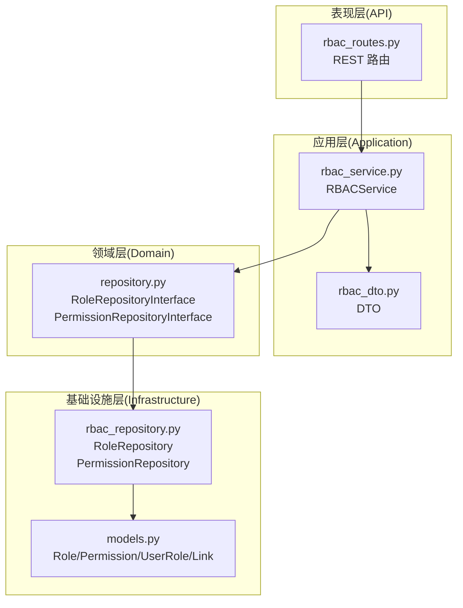
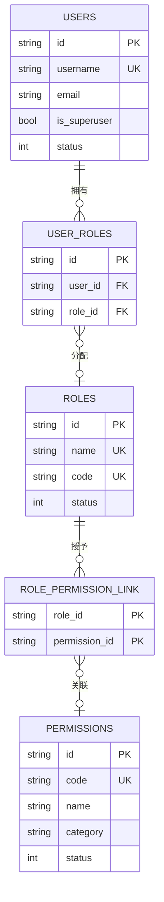
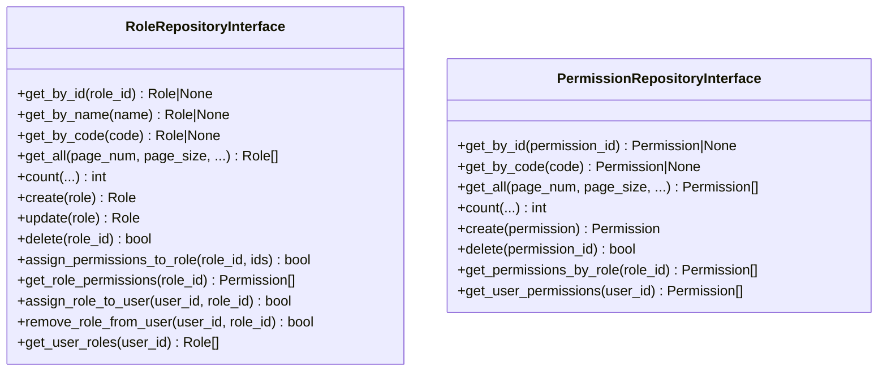
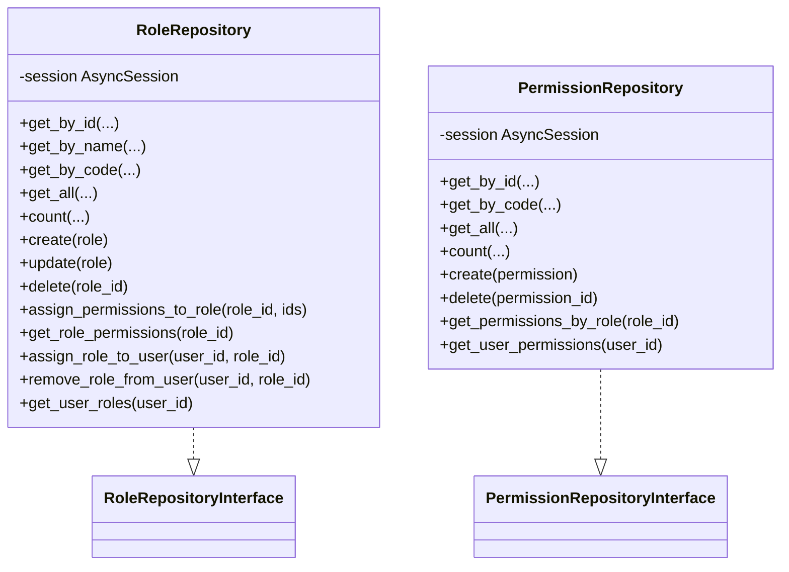
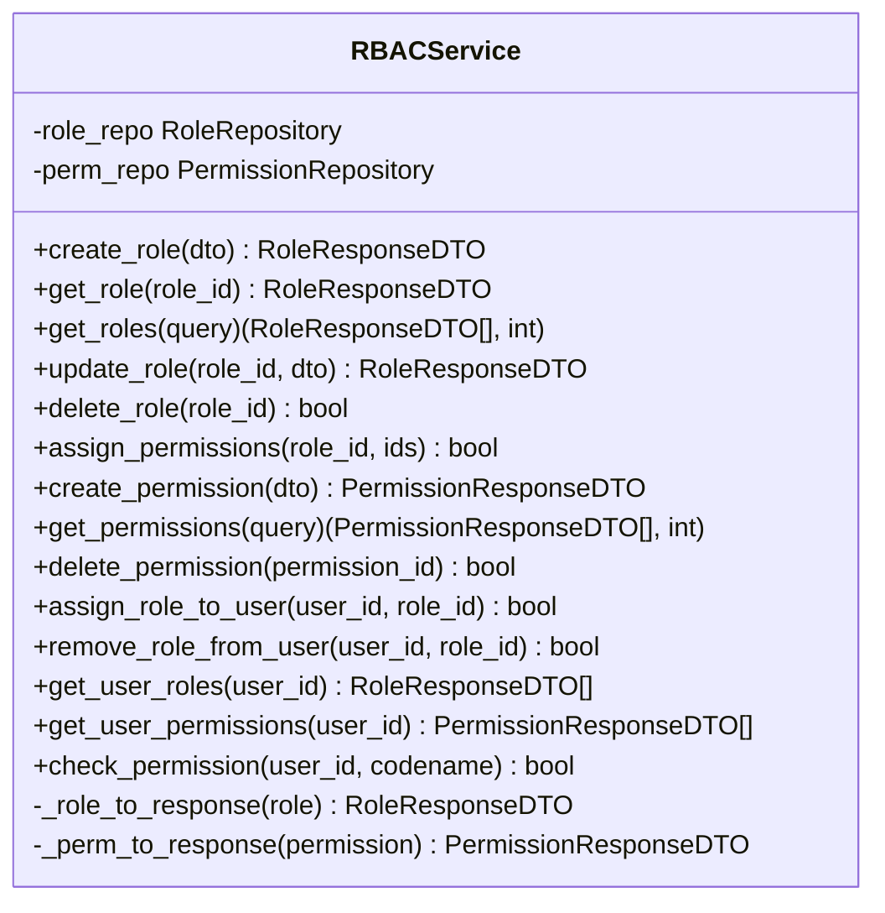
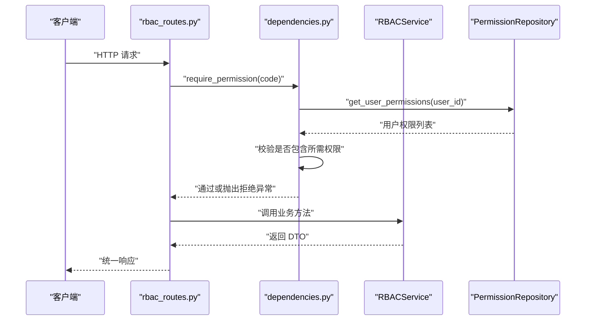
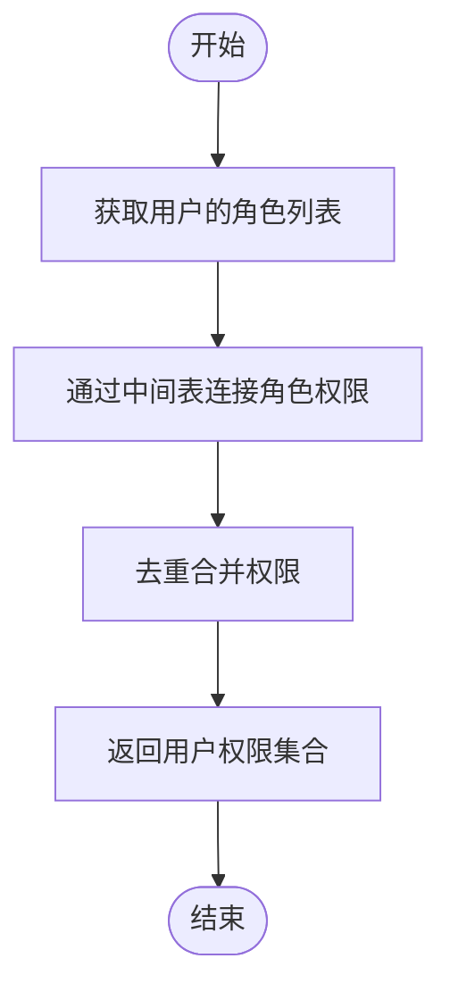
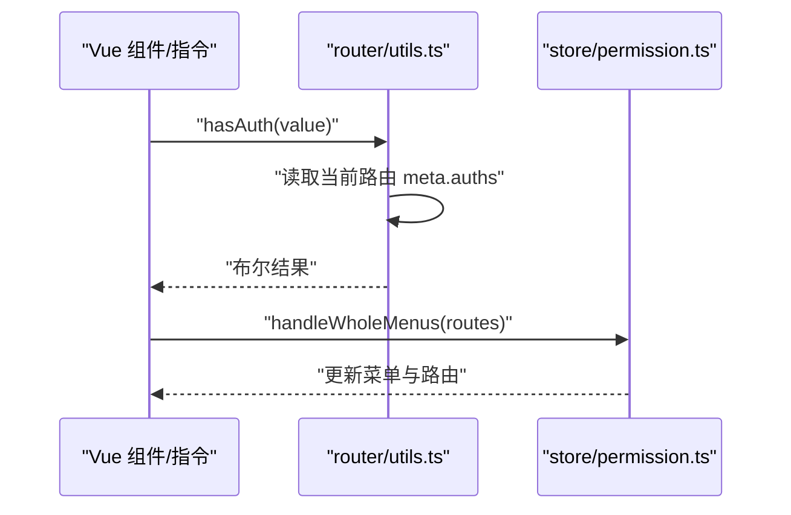
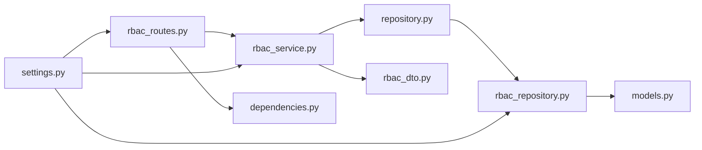

# RBAC 架构设计

<cite>
**本文引用的文件**
- [rbac_repository.py](file://service/src/infrastructure/repositories/rbac_repository.py)
- [repository.py](file://service/src/domain/rbac/repository.py)
- [rbac_service.py](file://service/src/application/services/rbac_service.py)
- [rbac_routes.py](file://service/src/api/v1/rbac_routes.py)
- [models.py](file://service/src/infrastructure/database/models.py)
- [rbac_dto.py](file://service/src/application/dto/rbac_dto.py)
- [dependencies.py](file://service/src/api/dependencies.py)
- [decorators.py](file://service/src/core/decorators.py)
- [settings.py](file://service/src/config/settings.py)
- [pyproject.toml](file://service/pyproject.toml)
- [auth.tsx](file://web/src/components/ReAuth/src/auth.tsx)
- [index.ts](file://web/src/directives/auth/index.ts)
- [utils.ts](file://web/src/router/utils.ts)
- [permission.ts](file://web/src/store/modules/permission.ts)
</cite>

## 目录
1. [引言](#引言)
2. [项目结构](#项目结构)
3. [核心组件](#核心组件)
4. [架构总览](#架构总览)
5. [详细组件分析](#详细组件分析)
6. [依赖分析](#依赖分析)
7. [性能考虑](#性能考虑)
8. [故障排查指南](#故障排查指南)
9. [结论](#结论)
10. [附录](#附录)

## 引言
本文件面向 RBAC（基于角色的访问控制）权限系统的核心架构设计，围绕领域驱动设计（DDD）分层与 FastAPI 应用层展开，系统性阐述以下主题：
- RBAC 模型设计原理与三层关系：用户、角色、权限
- 数据结构设计与实体关系映射（Role、Permission、UserRole、RolePermissionLink）
- 领域层接口设计模式：PermissionRepositoryInterface 与 RoleRepositoryInterface 的职责划分
- 权限继承与传递策略（通过角色链实现）
- 与 DDD 各层的交互关系图
- 权限验证执行流程与性能优化策略

## 项目结构
RBAC 权限系统遵循 DDD 分层：
- 表现层（API Routes）：提供 REST 接口，绑定 DTO 并调用应用服务
- 应用层（Application Services）：编排业务流程，协调仓储与 DTO
- 领域层（Domain Interfaces）：定义仓储接口契约
- 基础设施层（Infrastructure Repositories & Database Models）：实现仓储接口，提供数据库模型与 SQLModel 映射

图表来源
- [rbac_routes.py:1-257](file://service/src/api/v1/rbac_routes.py#L1-L257)
- [rbac_service.py:1-231](file://service/src/application/services/rbac_service.py#L1-L231)
- [repository.py:1-77](file://service/src/domain/rbac/repository.py#L1-L77)
- [rbac_repository.py:1-213](file://service/src/infrastructure/repositories/rbac_repository.py#L1-L213)
- [models.py:1-193](file://service/src/infrastructure/database/models.py#L1-L193)
- [rbac_dto.py:1-88](file://service/src/application/dto/rbac_dto.py#L1-L88)

章节来源
- [rbac_routes.py:1-257](file://service/src/api/v1/rbac_routes.py#L1-L257)
- [rbac_service.py:1-231](file://service/src/application/services/rbac_service.py#L1-L231)
- [repository.py:1-77](file://service/src/domain/rbac/repository.py#L1-L77)
- [rbac_repository.py:1-213](file://service/src/infrastructure/repositories/rbac_repository.py#L1-L213)
- [models.py:1-193](file://service/src/infrastructure/database/models.py#L1-L193)
- [rbac_dto.py:1-88](file://service/src/application/dto/rbac_dto.py#L1-L88)

## 核心组件
- 领域接口（抽象仓储）：定义角色与权限的 CRUD、分配、查询等能力，确保应用服务与基础设施解耦
- 应用服务（RBACService）：封装业务规则（如唯一性校验、权限分配策略），协调仓储与 DTO
- 基础设施仓储（SQLModel 实现）：基于 AsyncSession 提供具体持久化逻辑，包含分页、筛选、多对多关系处理
- 数据模型（SQLModel）：定义 Role、Permission、UserRole、RolePermissionLink 四个核心实体及其关系
- API 路由与依赖：提供 REST 接口与权限依赖注入，统一响应格式

章节来源
- [repository.py:8-77](file://service/src/domain/rbac/repository.py#L8-L77)
- [rbac_service.py:19-231](file://service/src/application/services/rbac_service.py#L19-L231)
- [rbac_repository.py:11-213](file://service/src/infrastructure/repositories/rbac_repository.py#L11-L213)
- [models.py:17-141](file://service/src/infrastructure/database/models.py#L17-L141)
- [rbac_routes.py:30-257](file://service/src/api/v1/rbac_routes.py#L30-L257)

## 架构总览
RBAC 的三层关系模型：
- 用户（User）与角色（Role）：多对多（UserRole）
- 角色（Role）与权限（Permission）：多对多（RolePermissionLink）

图表来源
- [models.py:31-141](file://service/src/infrastructure/database/models.py#L31-L141)

章节来源
- [models.py:17-141](file://service/src/infrastructure/database/models.py#L17-L141)

## 详细组件分析

### 领域层接口设计模式
- RoleRepositoryInterface：提供角色的查询、创建、更新、删除、权限分配、用户角色分配等方法
- PermissionRepositoryInterface：提供权限的查询、创建、删除、按角色/用户查询权限等方法
- 设计原则：通过抽象接口隔离应用服务与具体存储实现，便于替换与测试

图表来源
- [repository.py:8-77](file://service/src/domain/rbac/repository.py#L8-L77)

章节来源
- [repository.py:8-77](file://service/src/domain/rbac/repository.py#L8-L77)

### 基础设施仓储实现
- RoleRepository：基于 AsyncSession 实现角色与权限的 CRUD、分页、筛选、角色-权限批量分配、用户-角色分配与查询
- PermissionRepository：实现权限的 CRUD、分页、筛选、按角色/用户查询权限
- 关键点：权限分配采用“先清后增”的策略，保证一致性；用户权限查询通过中间表连接，去重返回

图表来源
- [rbac_repository.py:11-213](file://service/src/infrastructure/repositories/rbac_repository.py#L11-L213)
- [repository.py:8-77](file://service/src/domain/rbac/repository.py#L8-L77)

章节来源
- [rbac_repository.py:11-213](file://service/src/infrastructure/repositories/rbac_repository.py#L11-L213)

### 应用服务与 DTO
- RBACService：封装业务规则（如角色/权限唯一性校验、权限分配策略），协调仓储与 DTO，负责将实体转换为响应 DTO
- DTO：RoleCreateDTO、RoleUpdateDTO、RoleResponseDTO、PermissionCreateDTO、PermissionResponseDTO、PermissionListQueryDTO、RoleListQueryDTO、AssignPermissionsDTO、AssignRoleDTO

图表来源
- [rbac_service.py:19-231](file://service/src/application/services/rbac_service.py#L19-L231)
- [rbac_dto.py:8-88](file://service/src/application/dto/rbac_dto.py#L8-L88)

章节来源
- [rbac_service.py:19-231](file://service/src/application/services/rbac_service.py#L19-L231)
- [rbac_dto.py:8-88](file://service/src/application/dto/rbac_dto.py#L8-L88)

### API 路由与权限依赖
- 路由：提供角色与权限的增删改查、角色权限分配等接口，并统一响应格式
- 依赖：require_permission(code) 依赖工厂，结合 JWT 解码与用户权限查询，实现运行时权限校验

图表来源
- [rbac_routes.py:30-257](file://service/src/api/v1/rbac_routes.py#L30-L257)
- [dependencies.py:45-61](file://service/src/api/dependencies.py#L45-L61)
- [rbac_repository.py:203-212](file://service/src/infrastructure/repositories/rbac_repository.py#L203-L212)

章节来源
- [rbac_routes.py:30-257](file://service/src/api/v1/rbac_routes.py#L30-L257)
- [dependencies.py:45-61](file://service/src/api/dependencies.py#L45-L61)

### 权限继承与传递策略
- 继承机制：通过用户-角色-权限的链式传递实现权限继承。用户通过 UserRole 获得多个角色，角色通过 RolePermissionLink 获得多个权限
- 传递策略：用户权限查询通过 JOIN 两层关系（UserRole → RolePermissionLink → Permission）一次性获取，避免 N+1 查询
- 分配策略：角色权限分配采用“先清后增”，确保角色权限集合的原子性更新

图表来源
- [rbac_repository.py:203-212](file://service/src/infrastructure/repositories/rbac_repository.py#L203-L212)
- [models.py:17-141](file://service/src/infrastructure/database/models.py#L17-L141)

章节来源
- [rbac_repository.py:84-133](file://service/src/infrastructure/repositories/rbac_repository.py#L84-L133)
- [rbac_repository.py:194-212](file://service/src/infrastructure/repositories/rbac_repository.py#L194-L212)
- [models.py:17-141](file://service/src/infrastructure/database/models.py#L17-L141)

### 前端权限控制（补充）
- 指令与组件：v-auth 指令与 Auth 组件基于路由元信息中的权限码进行前端渲染控制
- 路由工具：hasAuth 与 getAuths 从当前路由元信息中读取权限码集合，进行包含性判断
- 权限状态：Pinia store 中维护菜单树与扁平路由，配合后端返回的权限集合进行前端过滤

图表来源
- [auth.tsx:1-21](file://web/src/components/ReAuth/src/auth.tsx#L1-L21)
- [index.ts:1-16](file://web/src/directives/auth/index.ts#L1-L16)
- [utils.ts:368-383](file://web/src/router/utils.ts#L368-L383)
- [permission.ts:1-76](file://web/src/store/modules/permission.ts#L1-L76)

章节来源
- [auth.tsx:1-21](file://web/src/components/ReAuth/src/auth.tsx#L1-L21)
- [index.ts:1-16](file://web/src/directives/auth/index.ts#L1-L16)
- [utils.ts:368-383](file://web/src/router/utils.ts#L368-L383)
- [permission.ts:1-76](file://web/src/store/modules/permission.ts#L1-L76)

## 依赖分析
- 外部依赖：FastAPI、SQLModel、Pydantic、Redis、JWT 等
- 内部依赖：API 路由依赖应用服务；应用服务依赖仓储接口；仓储实现依赖数据库模型与 AsyncSession
- 配置：通过 settings.py 支持多环境配置，缓存配置实例以减少重复初始化

图表来源
- [rbac_routes.py:1-257](file://service/src/api/v1/rbac_routes.py#L1-L257)
- [rbac_service.py:1-231](file://service/src/application/services/rbac_service.py#L1-L231)
- [repository.py:1-77](file://service/src/domain/rbac/repository.py#L1-L77)
- [rbac_repository.py:1-213](file://service/src/infrastructure/repositories/rbac_repository.py#L1-L213)
- [models.py:1-193](file://service/src/infrastructure/database/models.py#L1-L193)
- [rbac_dto.py:1-88](file://service/src/application/dto/rbac_dto.py#L1-L88)
- [dependencies.py:1-72](file://service/src/api/dependencies.py#L1-L72)
- [settings.py:1-198](file://service/src/config/settings.py#L1-L198)

章节来源
- [pyproject.toml:1-76](file://service/pyproject.toml#L1-L76)
- [settings.py:41-198](file://service/src/config/settings.py#L41-L198)

## 性能考虑
- 查询优化
  - 使用 JOIN 一次性获取用户权限，避免 N+1 查询
  - 分页与筛选：仓储实现支持分页与条件筛选，降低单次查询负载
- 写入优化
  - 权限分配采用“先清后增”策略，保证幂等与一致性
- 缓存与日志
  - Redis 作为缓存中间件（配置项存在），可用于热点数据缓存
  - 日志装饰器可辅助定位慢查询与异常
- 并发与事务
  - 基于 AsyncSession 的异步事务，适合高并发场景
- 建议
  - 对高频权限查询增加 Redis 缓存（如用户权限集合）
  - 对角色/权限列表分页查询增加索引与统计信息
  - 对权限分配操作增加幂等键与重试策略

章节来源
- [rbac_repository.py:84-133](file://service/src/infrastructure/repositories/rbac_repository.py#L84-L133)
- [rbac_repository.py:194-212](file://service/src/infrastructure/repositories/rbac_repository.py#L194-L212)
- [decorators.py:9-24](file://service/src/core/decorators.py#L9-L24)
- [settings.py:60-61](file://service/src/config/settings.py#L60-L61)

## 故障排查指南
- 常见问题
  - 403 权限不足：检查 require_permission 依赖是否正确注入，确认用户权限集合是否包含所需权限码
  - 404 资源不存在：检查角色/权限 ID 是否有效，仓储查询是否返回空
  - 409 冲突：角色/权限编码重复，需调整唯一性约束
- 排查步骤
  - 核对 JWT 令牌有效性与类型
  - 检查用户状态与超级用户标记
  - 核对角色-权限分配是否符合预期（“先清后增”）
  - 查看日志装饰器输出，定位异常函数与参数
- 相关实现参考
  - 依赖注入与权限校验：require_permission
  - 用户状态校验：get_current_active_user
  - 日志装饰器：log_execution

章节来源
- [dependencies.py:45-72](file://service/src/api/dependencies.py#L45-L72)
- [rbac_service.py:169-198](file://service/src/application/services/rbac_service.py#L169-L198)
- [decorators.py:9-24](file://service/src/core/decorators.py#L9-L24)

## 结论
本 RBAC 权限系统以 DDD 分层为核心，通过抽象仓储接口与 SQLModel 实现，清晰分离了表现层、应用层、领域层与基础设施层。系统采用多对多关系模型与中间表实现角色与权限的灵活组合，结合前端指令与路由工具形成前后端协同的权限控制闭环。通过分页、JOIN 查询与“先清后增”的权限分配策略，兼顾了功能完整性与性能稳定性。

## 附录
- 关键实体与关系
  - Role、Permission、UserRole、RolePermissionLink 四个核心实体构成 RBAC 数据模型
- 关键流程
  - 权限验证：JWT → 用户校验 → 权限查询 → 权限码匹配
  - 权限分配：角色权限清空 → 新权限插入 → 提交事务
- 前端集成
  - 指令与组件基于路由元信息进行渲染控制，配合 Pinia store 维护菜单与路由状态