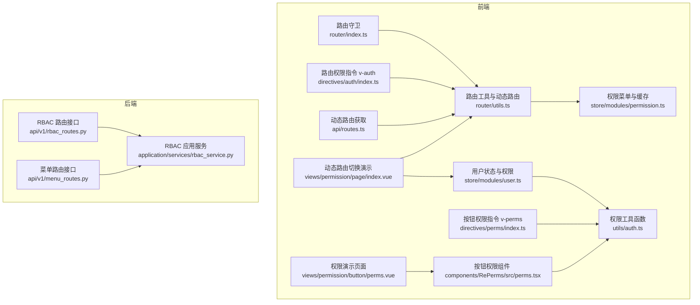
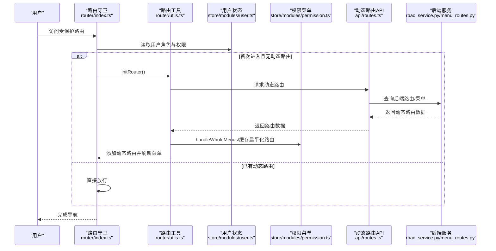
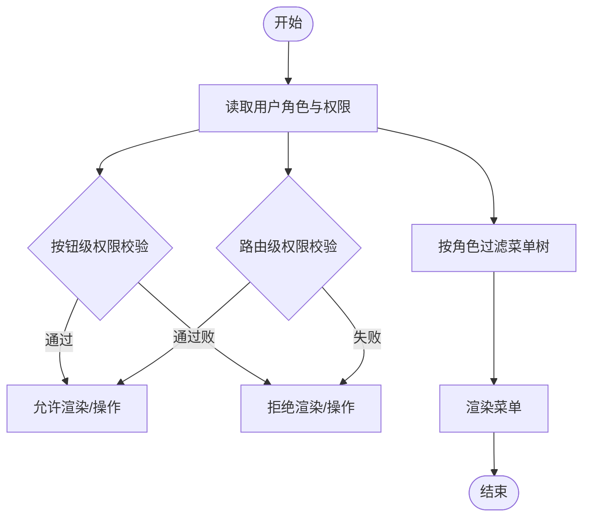
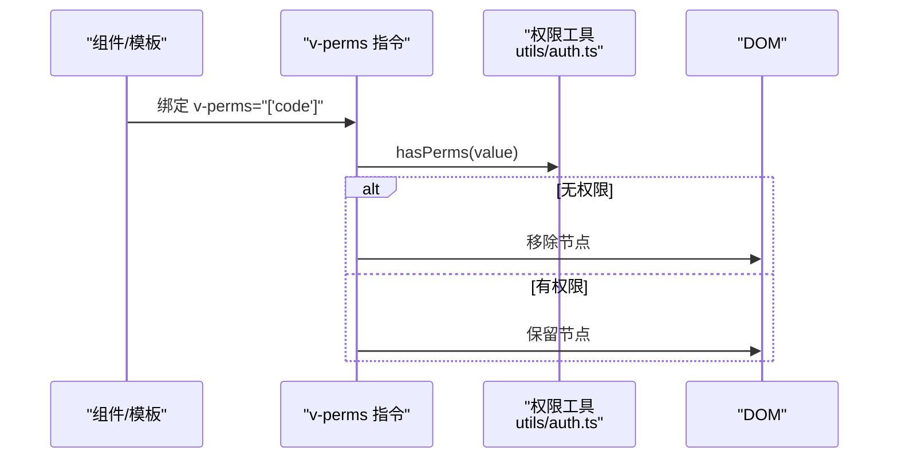
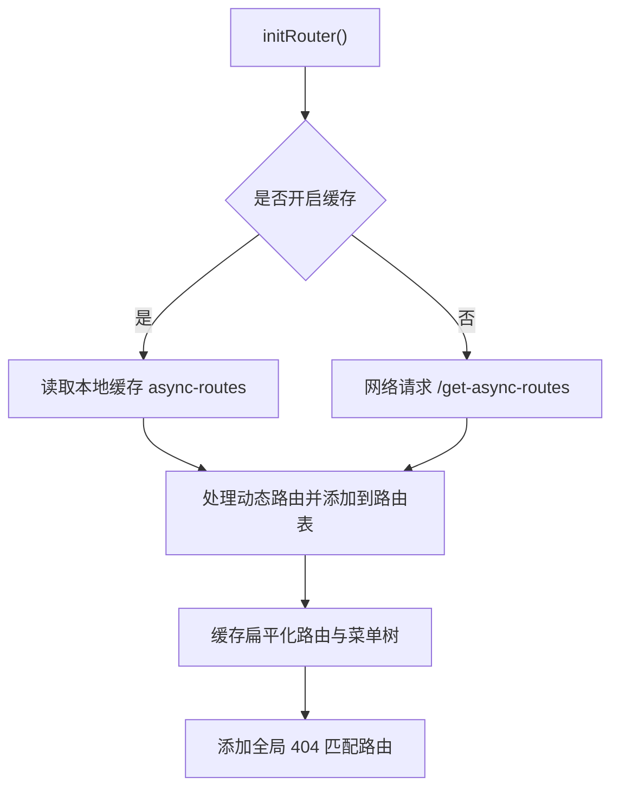
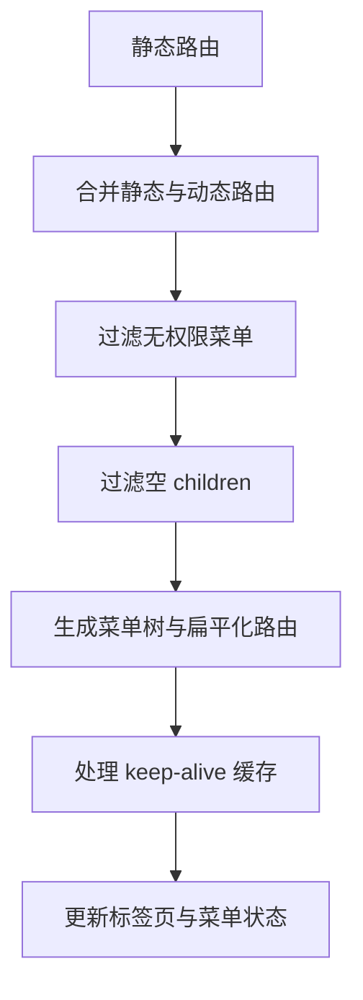
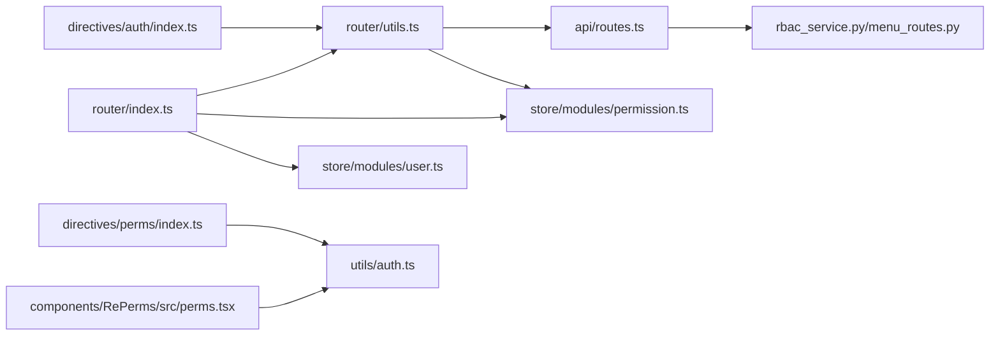

# 动态权限控制

<cite>
**本文引用的文件**
- [web/src/directives/perms/index.ts](file://web/src/directives/perms/index.ts)
- [web/src/components/RePerms/src/perms.tsx](file://web/src/components/RePerms/src/perms.tsx)
- [web/src/directives/auth/index.ts](file://web/src/directives/auth/index.ts)
- [web/src/store/modules/permission.ts](file://web/src/store/modules/permission.ts)
- [web/src/store/modules/user.ts](file://web/src/store/modules/user.ts)
- [web/src/router/index.ts](file://web/src/router/index.ts)
- [web/src/router/utils.ts](file://web/src/router/utils.ts)
- [web/src/utils/auth.ts](file://web/src/utils/auth.ts)
- [web/src/api/routes.ts](file://web/src/api/routes.ts)
- [web/src/views/permission/button/perms.vue](file://web/src/views/permission/button/perms.vue)
- [web/src/views/permission/page/index.vue](file://web/src/views/permission/page/index.vue)
- [service/src/api/v1/rbac_routes.py](file://service/src/api/v1/rbac_routes.py)
- [service/src/application/services/rbac_service.py](file://service/src/application/services/rbac_service.py)
- [service/src/api/v1/menu_routes.py](file://service/src/api/v1/menu_routes.py)
</cite>

## 目录
1. [简介](#简介)
2. [项目结构](#项目结构)
3. [核心组件](#核心组件)
4. [架构总览](#架构总览)
5. [详细组件分析](#详细组件分析)
6. [依赖关系分析](#依赖关系分析)
7. [性能考量](#性能考量)
8. [故障排查指南](#故障排查指南)
9. [结论](#结论)
10. [附录](#附录)

## 简介
本文件面向 RBAC 系统的动态权限控制能力，系统性阐述以下主题：
- 运行时权限计算与权限状态管理
- 前端权限指令与组件的实现机制与使用方法
- 权限数据的获取、缓存与更新策略
- 动态菜单生成与权限路由控制
- 权限状态在前端组件中的使用示例与最佳实践
- 用户体验优化与加载状态处理
- 权限控制与路由守卫、组件权限的协调机制
- 动态权限控制的测试方法与调试技巧

## 项目结构
本项目采用前后端分离架构，权限控制涉及前端路由与指令、状态管理、工具函数，以及后端 RBAC 接口与服务层。

图表来源
- [web/src/router/index.ts:1-230](file://web/src/router/index.ts#L1-L230)
- [web/src/router/utils.ts:1-424](file://web/src/router/utils.ts#L1-L424)
- [web/src/store/modules/user.ts:1-128](file://web/src/store/modules/user.ts#L1-L128)
- [web/src/store/modules/permission.ts:1-76](file://web/src/store/modules/permission.ts#L1-L76)
- [web/src/directives/perms/index.ts:1-16](file://web/src/directives/perms/index.ts#L1-L16)
- [web/src/components/RePerms/src/perms.tsx:1-21](file://web/src/components/RePerms/src/perms.tsx#L1-L21)
- [web/src/directives/auth/index.ts:1-16](file://web/src/directives/auth/index.ts#L1-L16)
- [web/src/utils/auth.ts:1-142](file://web/src/utils/auth.ts#L1-L142)
- [web/src/api/routes.ts:1-12](file://web/src/api/routes.ts#L1-L12)
- [web/src/views/permission/button/perms.vue:1-117](file://web/src/views/permission/button/perms.vue#L1-L117)
- [web/src/views/permission/page/index.vue:1-76](file://web/src/views/permission/page/index.vue#L1-L76)
- [service/src/api/v1/rbac_routes.py:1-257](file://service/src/api/v1/rbac_routes.py#L1-L257)
- [service/src/application/services/rbac_service.py:1-231](file://service/src/application/services/rbac_service.py#L1-L231)
- [service/src/api/v1/menu_routes.py:1-71](file://service/src/api/v1/menu_routes.py#L1-L71)

章节来源
- [web/src/router/index.ts:1-230](file://web/src/router/index.ts#L1-L230)
- [web/src/router/utils.ts:1-424](file://web/src/router/utils.ts#L1-L424)
- [web/src/store/modules/user.ts:1-128](file://web/src/store/modules/user.ts#L1-L128)
- [web/src/store/modules/permission.ts:1-76](file://web/src/store/modules/permission.ts#L1-L76)
- [web/src/utils/auth.ts:1-142](file://web/src/utils/auth.ts#L1-L142)
- [web/src/api/routes.ts:1-12](file://web/src/api/routes.ts#L1-L12)
- [service/src/api/v1/rbac_routes.py:1-257](file://service/src/api/v1/rbac_routes.py#L1-L257)
- [service/src/application/services/rbac_service.py:1-231](file://service/src/application/services/rbac_service.py#L1-L231)
- [service/src/api/v1/menu_routes.py:1-71](file://service/src/api/v1/menu_routes.py#L1-L71)

## 核心组件
- 用户状态与权限
  - 用户状态存储包含角色与按钮级权限，用于运行时权限判断与指令/组件渲染控制。
- 权限菜单与缓存
  - 维护静态与动态菜单、扁平化路由、缓存页面列表，支撑菜单生成与 keep-alive 策略。
- 路由守卫与动态路由
  - 基于路由守卫在首次进入受保护路由时拉取动态路由，完成菜单组装与标签页处理。
- 权限指令与组件
  - v-perms 与 <Perms> 提供基于按钮级权限的 DOM 控制与条件渲染。
- 权限工具函数
  - hasPerms、hasAuth、filterNoPermissionTree 等函数负责权限判断与菜单过滤。
- 后端 RBAC 与菜单接口
  - 提供角色、权限、菜单的增删改查与用户权限查询，作为前端动态路由与权限判断的数据来源。

章节来源
- [web/src/store/modules/user.ts:1-128](file://web/src/store/modules/user.ts#L1-L128)
- [web/src/store/modules/permission.ts:1-76](file://web/src/store/modules/permission.ts#L1-L76)
- [web/src/router/index.ts:123-222](file://web/src/router/index.ts#L123-L222)
- [web/src/router/utils.ts:84-95](file://web/src/router/utils.ts#L84-L95)
- [web/src/directives/perms/index.ts:1-16](file://web/src/directives/perms/index.ts#L1-L16)
- [web/src/components/RePerms/src/perms.tsx:1-21](file://web/src/components/RePerms/src/perms.tsx#L1-L21)
- [web/src/utils/auth.ts:130-142](file://web/src/utils/auth.ts#L130-L142)
- [service/src/api/v1/rbac_routes.py:1-257](file://service/src/api/v1/rbac_routes.py#L1-L257)
- [service/src/api/v1/menu_routes.py:1-71](file://service/src/api/v1/menu_routes.py#L1-L71)

## 架构总览
动态权限控制的端到端流程如下：

图表来源
- [web/src/router/index.ts:123-222](file://web/src/router/index.ts#L123-L222)
- [web/src/router/utils.ts:199-235](file://web/src/router/utils.ts#L199-L235)
- [web/src/store/modules/permission.ts:25-34](file://web/src/store/modules/permission.ts#L25-L34)
- [web/src/api/routes.ts:1-12](file://web/src/api/routes.ts#L1-L12)
- [service/src/application/services/rbac_service.py:185-199](file://service/src/application/services/rbac_service.py#L185-L199)
- [service/src/api/v1/menu_routes.py:29-36](file://service/src/api/v1/menu_routes.py#L29-L36)

## 详细组件分析

### 运行时权限计算与权限状态管理
- 权限状态来源
  - 用户登录成功后，前端将角色与按钮级权限写入本地存储与 Pinia 状态，后续通过工具函数读取。
- 权限计算
  - 按钮级权限：hasPerms 支持单个权限与权限数组的包含判断，特殊通配符“*:*:*”代表全部权限。
  - 路由级权限：hasAuth 读取当前路由 meta.auths，进行按钮级权限判断。
  - 菜单级权限：filterNoPermissionTree 基于用户角色过滤菜单树，确保仅展示有权限的菜单。
- 状态更新
  - 用户切换角色后，清空动态路由缓存并重新初始化路由，保证菜单与权限同步。

图表来源
- [web/src/utils/auth.ts:130-142](file://web/src/utils/auth.ts#L130-L142)
- [web/src/router/utils.ts:84-95](file://web/src/router/utils.ts#L84-L95)
- [web/src/router/utils.ts:373-383](file://web/src/router/utils.ts#L373-L383)

章节来源
- [web/src/utils/auth.ts:1-142](file://web/src/utils/auth.ts#L1-L142)
- [web/src/router/utils.ts:84-95](file://web/src/router/utils.ts#L84-L95)
- [web/src/router/utils.ts:373-383](file://web/src/router/utils.ts#L373-L383)

### 前端权限指令与组件
- v-perms 指令
  - 在挂载阶段读取绑定值，若不满足权限则移除对应 DOM 节点；需显式传入权限值，否则抛出错误。
- <Perms> 组件
  - 以插槽形式包裹内容，根据按钮级权限决定是否渲染默认插槽。
- v-auth 指令
  - 基于当前路由 meta.auths 进行按钮级权限判断，不满足则移除 DOM。

图表来源
- [web/src/directives/perms/index.ts:1-16](file://web/src/directives/perms/index.ts#L1-L16)
- [web/src/utils/auth.ts:130-142](file://web/src/utils/auth.ts#L130-L142)

章节来源
- [web/src/directives/perms/index.ts:1-16](file://web/src/directives/perms/index.ts#L1-L16)
- [web/src/components/RePerms/src/perms.tsx:1-21](file://web/src/components/RePerms/src/perms.tsx#L1-L21)
- [web/src/directives/auth/index.ts:1-16](file://web/src/directives/auth/index.ts#L1-L16)

### 权限数据的获取、缓存与更新策略
- 数据获取
  - 首次进入受保护路由时，调用 initRouter 拉取动态路由；路由工具内部根据配置选择从本地缓存或网络请求获取。
- 缓存策略
  - 可开启本地缓存 async-routes，避免每次刷新都请求后端；同时维护扁平化路由与菜单树，提升渲染效率。
- 更新策略
  - 用户切换角色后，清理本地动态路由缓存并重新初始化路由，确保权限与菜单即时生效。

图表来源
- [web/src/router/utils.ts:199-235](file://web/src/router/utils.ts#L199-L235)
- [web/src/api/routes.ts:1-12](file://web/src/api/routes.ts#L1-L12)
- [web/src/store/modules/permission.ts:25-34](file://web/src/store/modules/permission.ts#L25-L34)

章节来源
- [web/src/router/utils.ts:199-235](file://web/src/router/utils.ts#L199-L235)
- [web/src/api/routes.ts:1-12](file://web/src/api/routes.ts#L1-L12)
- [web/src/store/modules/permission.ts:1-76](file://web/src/store/modules/permission.ts#L1-L76)

### 动态菜单生成与权限路由控制
- 菜单生成
  - 将静态与动态路由合并，过滤无权限项与空 children，构建最终菜单树与扁平化路由。
- 路由控制
  - 路由守卫在首次进入时拉取动态路由并添加到路由表；同时处理 keep-alive 缓存与标签页。
- 菜单过滤
  - 使用 filterNoPermissionTree 按用户角色过滤菜单，确保目录与子菜单的权限一致性。

图表来源
- [web/src/router/utils.ts:55-95](file://web/src/router/utils.ts#L55-L95)
- [web/src/store/modules/permission.ts:25-34](file://web/src/store/modules/permission.ts#L25-L34)
- [web/src/router/index.ts:123-222](file://web/src/router/index.ts#L123-L222)

章节来源
- [web/src/router/utils.ts:55-95](file://web/src/router/utils.ts#L55-L95)
- [web/src/store/modules/permission.ts:1-76](file://web/src/store/modules/permission.ts#L1-L76)
- [web/src/router/index.ts:123-222](file://web/src/router/index.ts#L123-L222)

### 权限状态在前端组件中的使用示例与最佳实践
- 组件内判断
  - 使用 hasPerms 判断按钮级权限，结合 v-if/v-show 实现条件渲染。
- 插槽组件
  - 使用 <Perms> 包裹需要权限控制的内容，简洁直观。
- 指令方式
  - 使用 v-perms/v-auth 在模板层面快速控制元素显示，但注意指令在初次挂载后无法动态响应权限变化。
- 最佳实践
  - 优先使用组件或函数方式在逻辑层控制权限，指令适合静态场景。
  - 对于复杂权限组合，建议在组件逻辑中统一判断并缓存结果，减少重复计算。

章节来源
- [web/src/views/permission/button/perms.vue:1-117](file://web/src/views/permission/button/perms.vue#L1-L117)
- [web/src/components/RePerms/src/perms.tsx:1-21](file://web/src/components/RePerms/src/perms.tsx#L1-L21)
- [web/src/utils/auth.ts:130-142](file://web/src/utils/auth.ts#L130-L142)

### 用户体验优化与加载状态处理
- 加载进度
  - 路由守卫中集成进度条，在首次进入路由时显示加载状态，提升感知。
- 缓存策略
  - 启用动态路由缓存可显著降低二次进入的等待时间。
- 标签页与缓存
  - 结合标签页与缓存管理，避免频繁刷新导致的权限不一致问题。

章节来源
- [web/src/router/index.ts:123-222](file://web/src/router/index.ts#L123-L222)
- [web/src/router/utils.ts:200-235](file://web/src/router/utils.ts#L200-L235)

### 权限控制与路由守卫、组件权限的协调机制
- 协同流程
  - 路由守卫负责首次加载动态路由与菜单；组件/指令负责运行时渲染控制；状态管理负责权限数据的持久化与更新。
- 冲突与边界
  - 指令在初次挂载后不会响应权限变更，需配合组件/函数方式实现动态控制。
  - 路由守卫与菜单过滤共同保证“所见即所得”的权限体验。

章节来源
- [web/src/router/index.ts:123-222](file://web/src/router/index.ts#L123-L222)
- [web/src/router/utils.ts:84-95](file://web/src/router/utils.ts#L84-L95)
- [web/src/directives/perms/index.ts:1-16](file://web/src/directives/perms/index.ts#L1-L16)

## 依赖关系分析
- 前端依赖
  - 路由守卫依赖路由工具与用户状态；路由工具依赖动态路由 API 与权限状态；指令与组件依赖权限工具函数。
- 后端依赖
  - RBAC 与菜单接口为前端提供动态路由与权限数据；应用服务封装权限与角色查询逻辑。

图表来源
- [web/src/router/index.ts:1-230](file://web/src/router/index.ts#L1-L230)
- [web/src/router/utils.ts:1-424](file://web/src/router/utils.ts#L1-L424)
- [web/src/store/modules/permission.ts:1-76](file://web/src/store/modules/permission.ts#L1-L76)
- [web/src/store/modules/user.ts:1-128](file://web/src/store/modules/user.ts#L1-L128)
- [web/src/directives/perms/index.ts:1-16](file://web/src/directives/perms/index.ts#L1-L16)
- [web/src/components/RePerms/src/perms.tsx:1-21](file://web/src/components/RePerms/src/perms.tsx#L1-L21)
- [web/src/directives/auth/index.ts:1-16](file://web/src/directives/auth/index.ts#L1-L16)
- [web/src/utils/auth.ts:1-142](file://web/src/utils/auth.ts#L1-L142)
- [web/src/api/routes.ts:1-12](file://web/src/api/routes.ts#L1-L12)
- [service/src/application/services/rbac_service.py:1-231](file://service/src/application/services/rbac_service.py#L1-L231)
- [service/src/api/v1/menu_routes.py:1-71](file://service/src/api/v1/menu_routes.py#L1-L71)

章节来源
- [web/src/router/index.ts:1-230](file://web/src/router/index.ts#L1-L230)
- [web/src/router/utils.ts:1-424](file://web/src/router/utils.ts#L1-L424)
- [web/src/store/modules/permission.ts:1-76](file://web/src/store/modules/permission.ts#L1-L76)
- [web/src/store/modules/user.ts:1-128](file://web/src/store/modules/user.ts#L1-L128)
- [web/src/utils/auth.ts:1-142](file://web/src/utils/auth.ts#L1-L142)
- [web/src/api/routes.ts:1-12](file://web/src/api/routes.ts#L1-L12)
- [service/src/application/services/rbac_service.py:1-231](file://service/src/application/services/rbac_service.py#L1-L231)
- [service/src/api/v1/menu_routes.py:1-71](file://service/src/api/v1/menu_routes.py#L1-L71)

## 性能考量
- 动态路由缓存
  - 启用本地缓存可显著降低首屏与二次进入延迟。
- 菜单过滤与扁平化
  - 过滤无权限菜单与扁平化路由减少渲染与查找成本。
- Keep-alive 管理
  - 通过缓存页面列表与标签页联动，避免不必要的组件重建。

## 故障排查指南
- 常见问题
  - 指令未生效：确认 v-perms/v-auth 是否传入正确权限值，且在挂载时具备权限。
  - 菜单不显示：检查用户角色是否包含相应菜单权限，确认 filterNoPermissionTree 生效。
  - 动态路由不更新：切换角色后需清理本地缓存并重新初始化路由。
- 调试技巧
  - 在路由守卫与权限工具函数中打印关键变量，定位权限判断与路由注入时机。
  - 使用演示页面模拟不同角色，验证菜单与按钮权限变化。

章节来源
- [web/src/views/permission/page/index.vue:1-76](file://web/src/views/permission/page/index.vue#L1-L76)
- [web/src/router/utils.ts:199-235](file://web/src/router/utils.ts#L199-L235)
- [web/src/router/utils.ts:84-95](file://web/src/router/utils.ts#L84-L95)

## 结论
本系统通过“路由守卫 + 动态路由 + 权限指令/组件 + 状态管理”的组合，实现了运行时的动态权限控制。前端在首次进入时拉取并缓存动态路由，结合权限工具函数与菜单过滤，确保用户仅能看到其具备权限的菜单与按钮。通过演示页面与缓存策略，系统在可用性与性能之间取得平衡。

## 附录
- 后端接口要点
  - RBAC 路由接口提供角色与权限的增删改查，权限码用于前端按钮级与菜单级判断。
  - 菜单路由接口提供菜单树与用户可访问菜单，支撑动态菜单生成。
- 前端最佳实践
  - 在业务组件中优先使用函数或组件方式判断权限，指令适合静态场景。
  - 切换角色后清理动态路由缓存并重新初始化路由，确保权限即时生效。

章节来源
- [service/src/api/v1/rbac_routes.py:1-257](file://service/src/api/v1/rbac_routes.py#L1-L257)
- [service/src/api/v1/menu_routes.py:1-71](file://service/src/api/v1/menu_routes.py#L1-L71)
- [web/src/views/permission/button/perms.vue:1-117](file://web/src/views/permission/button/perms.vue#L1-L117)
- [web/src/views/permission/page/index.vue:1-76](file://web/src/views/permission/page/index.vue#L1-L76)