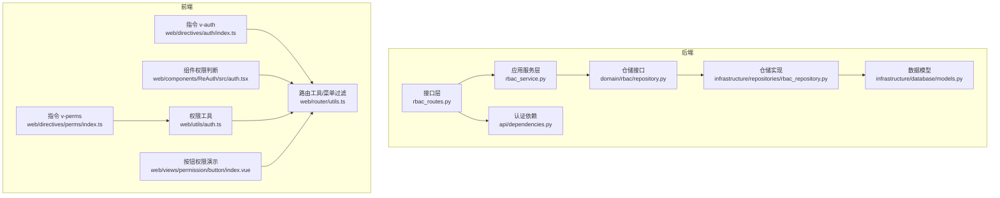
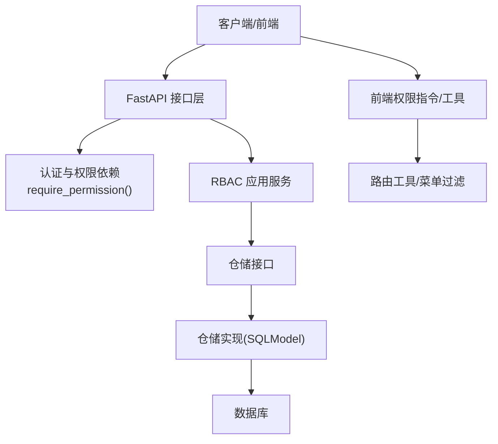
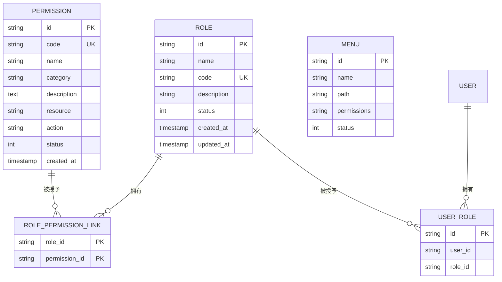
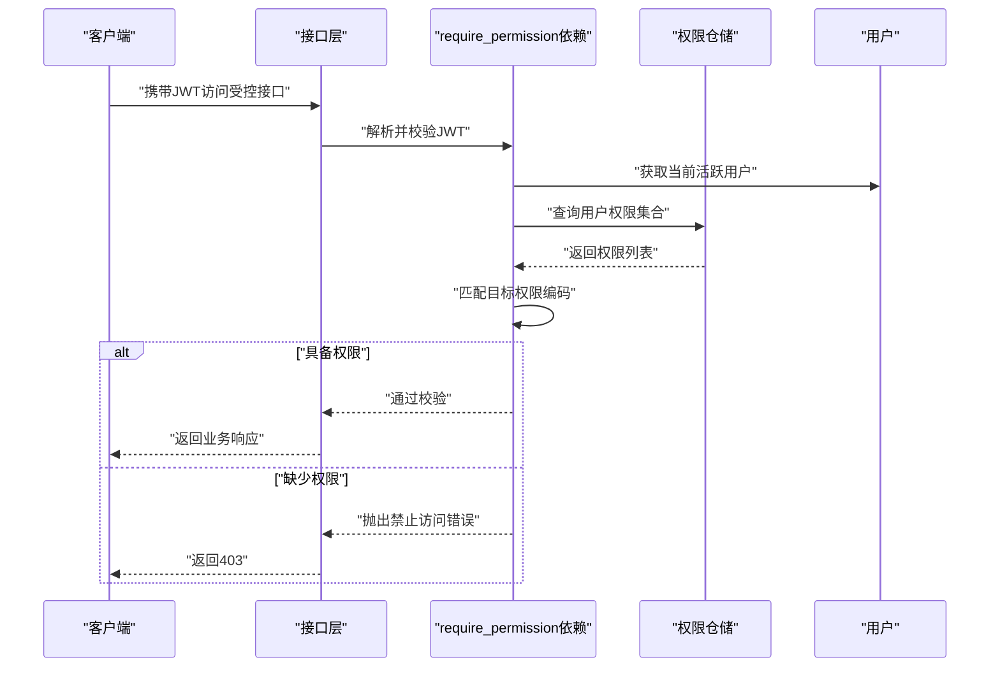
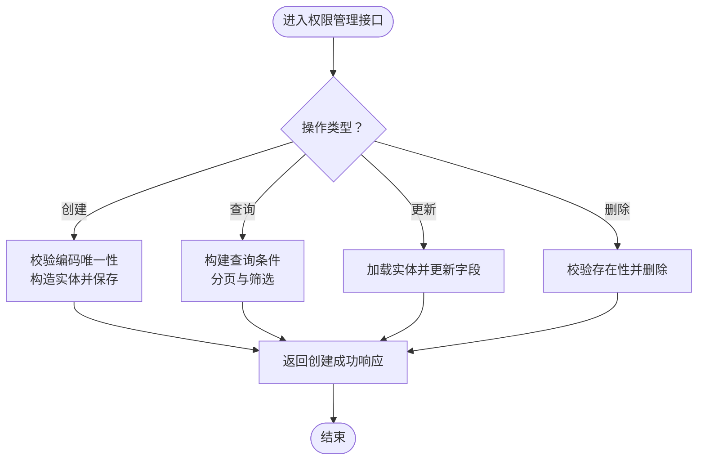
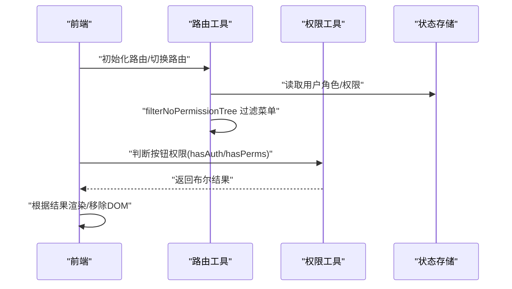
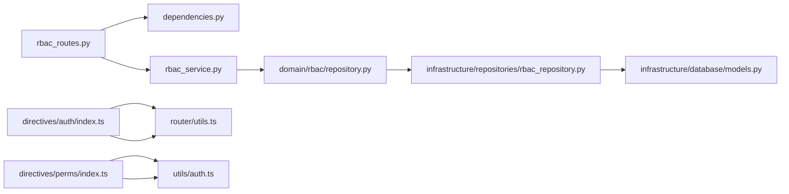

# 权限管理

<cite>
**本文引用的文件**
- [rbac_routes.py](file://service/src/api/v1/rbac_routes.py)
- [rbac_service.py](file://service/src/application/services/rbac_service.py)
- [rbac_dto.py](file://service/src/application/dto/rbac_dto.py)
- [rbac_repository.py](file://service/src/infrastructure/repositories/rbac_repository.py)
- [models.py](file://service/src/infrastructure/database/models.py)
- [dependencies.py](file://service/src/api/dependencies.py)
- [repository.py](file://service/src/domain/rbac/repository.py)
- [auth.tsx](file://web/src/components/ReAuth/src/auth.tsx)
- [index.ts（auth指令）](file://web/src/directives/auth/index.ts)
- [index.ts（perms指令）](file://web/src/directives/perms/index.ts)
- [auth.ts](file://web/src/utils/auth.ts)
- [utils.ts](file://web/src/router/utils.ts)
- [index.vue（按钮权限演示）](file://web/src/views/permission/button/index.vue)
</cite>

## 目录
1. [简介](#简介)
2. [项目结构](#项目结构)
3. [核心组件](#核心组件)
4. [架构总览](#架构总览)
5. [详细组件分析](#详细组件分析)
6. [依赖分析](#依赖分析)
7. [性能考量](#性能考量)
8. [故障排除指南](#故障排除指南)
9. [结论](#结论)
10. [附录](#附录)

## 简介
本章节面向 RBAC 权限管理功能，系统性阐述权限的定义、分类与管理机制，明确权限标识符、描述与范围的管理方式；解释权限与资源、操作之间的映射关系；梳理权限的创建、更新、删除与查询流程；说明权限验证的实现与策略；给出权限管理的 API 接口文档与使用示例；总结权限配置的最佳实践与安全注意事项；阐明权限与菜单权限、按钮权限的对应关系；并提供调试与故障排除指南。

## 项目结构
RBAC 权限管理在后端采用“接口层-应用服务层-领域/仓储层-基础设施层”的分层架构；在前端通过指令与组件实现按钮级权限控制，路由层面实现菜单级权限过滤。

图表来源
- [rbac_routes.py:1-257](file://service/src/api/v1/rbac_routes.py#L1-L257)
- [rbac_service.py:1-231](file://service/src/application/services/rbac_service.py#L1-L231)
- [repository.py:1-77](file://service/src/domain/rbac/repository.py#L1-L77)
- [rbac_repository.py:1-213](file://service/src/infrastructure/repositories/rbac_repository.py#L1-L213)
- [models.py:1-193](file://service/src/infrastructure/database/models.py#L1-L193)
- [dependencies.py:1-72](file://service/src/api/dependencies.py#L1-L72)
- [index.ts（auth指令）:1-16](file://web/src/directives/auth/index.ts#L1-L16)
- [index.ts（perms指令）:1-15](file://web/src/directives/perms/index.ts#L1-L15)
- [auth.tsx:1-21](file://web/src/components/ReAuth/src/auth.tsx#L1-L21)
- [auth.ts:1-142](file://web/src/utils/auth.ts#L1-L142)
- [utils.ts:1-424](file://web/src/router/utils.ts#L1-L424)
- [index.vue（按钮权限演示）:50-76](file://web/src/views/permission/button/index.vue#L50-L76)

章节来源
- [rbac_routes.py:1-257](file://service/src/api/v1/rbac_routes.py#L1-L257)
- [rbac_service.py:1-231](file://service/src/application/services/rbac_service.py#L1-L231)
- [rbac_repository.py:1-213](file://service/src/infrastructure/repositories/rbac_repository.py#L1-L213)
- [models.py:1-193](file://service/src/infrastructure/database/models.py#L1-L193)
- [dependencies.py:1-72](file://service/src/api/dependencies.py#L1-L72)
- [repository.py:1-77](file://service/src/domain/rbac/repository.py#L1-L77)
- [index.ts（auth指令）:1-16](file://web/src/directives/auth/index.ts#L1-L16)
- [index.ts（perms指令）:1-15](file://web/src/directives/perms/index.ts#L1-L15)
- [auth.tsx:1-21](file://web/src/components/ReAuth/src/auth.tsx#L1-L21)
- [auth.ts:1-142](file://web/src/utils/auth.ts#L1-L142)
- [utils.ts:1-424](file://web/src/router/utils.ts#L1-L424)
- [index.vue（按钮权限演示）:50-76](file://web/src/views/permission/button/index.vue#L50-L76)

## 核心组件
- 权限实体与模型
  - 权限实体包含标识符（code）、名称（name）、分类（category）、描述（description）、资源（resource）、操作（action）、状态（status）等字段，用于精确表达“对某资源执行某操作”的权限语义。
  - 菜单实体包含 permissions 字段，存储与菜单关联的权限编码字符串，用于菜单级权限控制。
- 角色与权限多对多关联
  - 通过角色-权限关联表维护角色与权限的多对多关系，支持角色权限的批量分配与回收。
- 用户-角色关联
  - 用户-角色关联表用于维护用户的角色归属，支撑基于角色的权限继承。
- 应用服务
  - 提供角色与权限的创建、查询、更新、删除、分配等业务逻辑，并封装用户权限集合的获取与校验。
- 仓储层
  - 抽象出角色与权限的仓储接口，具体实现基于 SQLModel 查询语言，支持分页、筛选与关联查询。
- 接口层
  - 提供角色与权限的 REST API，统一响应格式，结合依赖注入实现权限校验。
- 前端权限控制
  - 通过指令与工具函数在前端实现按钮级权限控制；通过路由工具在前端侧过滤不可见菜单。

章节来源
- [models.py:97-121](file://service/src/infrastructure/database/models.py#L97-L121)
- [models.py:146-171](file://service/src/infrastructure/database/models.py#L146-L171)
- [rbac_repository.py:11-213](file://service/src/infrastructure/repositories/rbac_repository.py#L11-L213)
- [rbac_service.py:19-231](file://service/src/application/services/rbac_service.py#L19-L231)
- [rbac_routes.py:1-257](file://service/src/api/v1/rbac_routes.py#L1-L257)
- [auth.ts:130-142](file://web/src/utils/auth.ts#L130-L142)
- [utils.ts:84-95](file://web/src/router/utils.ts#L84-L95)

## 架构总览
后端采用分层架构，接口层负责鉴权与权限校验，应用服务层编排业务，仓储层负责数据访问，模型层承载领域实体。前端通过指令与工具函数实现 UI 级别的权限控制。

图表来源
- [dependencies.py:45-61](file://service/src/api/dependencies.py#L45-L61)
- [rbac_service.py:19-231](file://service/src/application/services/rbac_service.py#L19-L231)
- [rbac_repository.py:11-213](file://service/src/infrastructure/repositories/rbac_repository.py#L11-L213)
- [models.py:1-193](file://service/src/infrastructure/database/models.py#L1-L193)
- [auth.ts:130-142](file://web/src/utils/auth.ts#L130-L142)
- [utils.ts:84-95](file://web/src/router/utils.ts#L84-L95)

## 详细组件分析

### 权限实体与映射关系
- 权限实体字段
  - 标识符（code）：全局唯一，作为权限的编程式标识，如“permission:manage”、“role:view”、“btn:add”等。
  - 名称（name）、描述（description）、分类（category）、状态（status）：用于管理与展示。
  - 资源（resource）、操作（action）：用于表达“对某资源执行某操作”的细粒度语义，便于与菜单/按钮权限映射。
- 菜单与权限
  - 菜单实体的 permissions 字段存储逗号分隔的权限编码，用于前端过滤不可见菜单。
- 关系模型
  - 角色-权限多对多：通过中间表维护。
  - 用户-角色多对多：通过中间表维护。

图表来源
- [models.py:17-141](file://service/src/infrastructure/database/models.py#L17-L141)

章节来源
- [models.py:97-121](file://service/src/infrastructure/database/models.py#L97-L121)
- [models.py:146-171](file://service/src/infrastructure/database/models.py#L146-L171)

### 权限验证与策略
- 后端验证
  - 通过依赖工厂 require_permission(code) 在接口层强制校验当前用户是否具备指定权限编码。
  - 若用户为超级管理员，则直接放行；否则查询用户通过角色继承的权限集合，匹配目标权限编码。
- 前端验证
  - 按钮级权限：通过 v-perms 指令或 hasPerms 工具函数判断当前用户拥有的权限集合是否包含目标权限。
  - 菜单级权限：通过 hasAuth 指令或工具函数判断当前路由 meta.auths 中声明的按钮权限是否在当前用户拥有的权限集合中。
  - 路由工具 filterNoPermissionTree 依据用户角色集合过滤不可见菜单树。

图表来源
- [dependencies.py:45-61](file://service/src/api/dependencies.py#L45-L61)
- [rbac_repository.py:203-212](file://service/src/infrastructure/repositories/rbac_repository.py#L203-L212)

章节来源
- [dependencies.py:45-61](file://service/src/api/dependencies.py#L45-L61)
- [rbac_repository.py:203-212](file://service/src/infrastructure/repositories/rbac_repository.py#L203-L212)
- [auth.ts:130-142](file://web/src/utils/auth.ts#L130-L142)
- [utils.ts:84-95](file://web/src/router/utils.ts#L84-L95)

### 权限管理 API 接口文档
- 角色管理
  - 获取角色列表
    - 方法与路径：GET /api/system/role/list
    - 权限要求：role:view
    - 查询参数：pageNum、pageSize、roleName（模糊）、status
    - 响应：分页的角色列表（含权限简要）
  - 创建角色
    - 方法与路径：POST /api/system/role/
    - 权限要求：role:manage
    - 请求体：RoleCreateDTO（name、code、description、status、permissionIds）
    - 响应：创建后的角色（code=201）
  - 获取角色详情
    - 方法与路径：GET /api/system/role/{role_id}
    - 权限要求：role:view
    - 响应：角色详情（含权限列表）
  - 更新角色
    - 方法与路径：PUT /api/system/role/{role_id}
    - 权限要求：role:manage
    - 请求体：RoleUpdateDTO（name、code、description、status、permissionIds）
    - 响应：更新后的角色
  - 删除角色
    - 方法与路径：DELETE /api/system/role/{role_id}
    - 权限要求：role:manage
    - 响应：操作结果消息
  - 为角色分配权限
    - 方法与路径：POST /api/system/role/{role_id}/permissions
    - 权限要求：role:manage
    - 请求体：AssignPermissionsDTO（permissionIds）
    - 响应：操作结果消息
- 权限管理
  - 获取权限列表
    - 方法与路径：GET /api/system/permission/list
    - 权限要求：permission:view
    - 查询参数：pageNum、pageSize、permissionName（模糊）
    - 响应：分页的权限列表
  - 创建权限
    - 方法与路径：POST /api/system/permission/
    - 权限要求：permission:manage
    - 请求体：PermissionCreateDTO（name、code、category、description、status）
    - 响应：创建后的权限（code=201）
  - 删除权限
    - 方法与路径：DELETE /api/system/permission/{permission_id}
    - 权限要求：permission:manage
    - 响应：操作结果消息

章节来源
- [rbac_routes.py:33-177](file://service/src/api/v1/rbac_routes.py#L33-L177)
- [rbac_routes.py:186-256](file://service/src/api/v1/rbac_routes.py#L186-L256)

### 权限与资源、操作的映射
- 权限标识符（code）用于后端严格匹配，如“permission:manage”。
- 资源（resource）与操作（action）用于表达“对某资源执行某操作”，便于与菜单/按钮权限建立语义映射。
- 菜单 permissions 字段存储权限编码，用于前端过滤不可见菜单。

章节来源
- [models.py:104-108](file://service/src/infrastructure/database/models.py#L104-L108)
- [models.py](file://service/src/infrastructure/database/models.py#L160)

### 权限创建、更新、删除与查询流程
- 创建权限
  - 校验权限编码唯一性 → 构造权限实体 → 保存 → 返回响应 DTO。
- 查询权限
  - 支持分页与按名称模糊查询 → 返回权限列表与总数。
- 更新权限
  - 通过应用服务更新字段 → 仓储层合并持久化。
- 删除权限
  - 校验权限存在性 → 删除实体 → 返回成功。

图表来源
- [rbac_service.py:133-165](file://service/src/application/services/rbac_service.py#L133-L165)
- [rbac_repository.py:142-192](file://service/src/infrastructure/repositories/rbac_repository.py#L142-L192)

章节来源
- [rbac_service.py:133-165](file://service/src/application/services/rbac_service.py#L133-L165)
- [rbac_repository.py:142-192](file://service/src/infrastructure/repositories/rbac_repository.py#L142-L192)

### 权限与菜单权限、按钮权限的对应关系
- 菜单权限
  - 菜单实体的 permissions 字段存储逗号分隔的权限编码，前端通过 filterNoPermissionTree 过滤不可见菜单。
- 按钮权限
  - 路由 meta.auths 声明按钮级权限 code；前端指令 v-auth 与工具函数 hasAuth 判断；也可使用 v-perms 与 hasPerms 判断。
- 示例
  - 按钮权限演示页面展示了如何使用 hasAuth 与 v-auth 控制按钮可见性。

图表来源
- [utils.ts:84-95](file://web/src/router/utils.ts#L84-L95)
- [auth.ts:130-142](file://web/src/utils/auth.ts#L130-L142)
- [index.ts（auth指令）:1-16](file://web/src/directives/auth/index.ts#L1-L16)
- [index.ts（perms指令）:1-15](file://web/src/directives/perms/index.ts#L1-L15)
- [auth.tsx:1-21](file://web/src/components/ReAuth/src/auth.tsx#L1-L21)
- [index.vue（按钮权限演示）:50-76](file://web/src/views/permission/button/index.vue#L50-L76)

章节来源
- [utils.ts:84-95](file://web/src/router/utils.ts#L84-L95)
- [auth.ts:130-142](file://web/src/utils/auth.ts#L130-L142)
- [index.ts（auth指令）:1-16](file://web/src/directives/auth/index.ts#L1-L16)
- [index.ts（perms指令）:1-15](file://web/src/directives/perms/index.ts#L1-L15)
- [auth.tsx:1-21](file://web/src/components/ReAuth/src/auth.tsx#L1-L21)
- [index.vue（按钮权限演示）:50-76](file://web/src/views/permission/button/index.vue#L50-L76)

## 依赖分析
- 后端
  - 接口层依赖认证与权限依赖项，以 require_permission(code) 强制权限校验。
  - 应用服务依赖仓储接口，实现业务编排与数据转换。
  - 仓储实现依赖 SQLModel 查询语言，提供分页、筛选与关联查询能力。
- 前端
  - 指令与组件依赖路由工具与权限工具，实现 UI 级权限控制。
  - 路由工具依赖用户状态存储，过滤不可见菜单。

图表来源
- [rbac_routes.py:1-257](file://service/src/api/v1/rbac_routes.py#L1-L257)
- [dependencies.py:1-72](file://service/src/api/dependencies.py#L1-L72)
- [rbac_service.py:1-231](file://service/src/application/services/rbac_service.py#L1-L231)
- [repository.py:1-77](file://service/src/domain/rbac/repository.py#L1-L77)
- [rbac_repository.py:1-213](file://service/src/infrastructure/repositories/rbac_repository.py#L1-L213)
- [models.py:1-193](file://service/src/infrastructure/database/models.py#L1-L193)
- [index.ts（auth指令）:1-16](file://web/src/directives/auth/index.ts#L1-L16)
- [index.ts（perms指令）:1-15](file://web/src/directives/perms/index.ts#L1-L15)
- [auth.ts:1-142](file://web/src/utils/auth.ts#L1-L142)
- [utils.ts:1-424](file://web/src/router/utils.ts#L1-L424)

章节来源
- [rbac_routes.py:1-257](file://service/src/api/v1/rbac_routes.py#L1-L257)
- [dependencies.py:1-72](file://service/src/api/dependencies.py#L1-L72)
- [rbac_service.py:1-231](file://service/src/application/services/rbac_service.py#L1-L231)
- [repository.py:1-77](file://service/src/domain/rbac/repository.py#L1-L77)
- [rbac_repository.py:1-213](file://service/src/infrastructure/repositories/rbac_repository.py#L1-L213)
- [models.py:1-193](file://service/src/infrastructure/database/models.py#L1-L193)
- [index.ts（auth指令）:1-16](file://web/src/directives/auth/index.ts#L1-L16)
- [index.ts（perms指令）:1-15](file://web/src/directives/perms/index.ts#L1-L15)
- [auth.ts:1-142](file://web/src/utils/auth.ts#L1-L142)
- [utils.ts:1-424](file://web/src/router/utils.ts#L1-L424)

## 性能考量
- 查询优化
  - 使用分页与筛选减少一次性数据量，降低网络与内存压力。
  - 关联查询时尽量限定条件，避免不必要的 JOIN。
- 缓存策略
  - 前端可缓存用户权限集合与动态路由，减少重复请求。
  - 后端可对热点权限数据进行缓存（需配合失效策略）。
- 并发与事务
  - 批量分配权限时建议在单事务内完成，保证一致性。
- 日志与可观测性
  - 使用统一日志装饰器记录关键流程耗时与异常，便于定位性能瓶颈。

## 故障排除指南
- 常见错误与排查
  - 401 未授权：检查 JWT 是否有效、是否为访问令牌类型、负载是否包含用户标识。
  - 403 权限不足：确认当前用户是否具备所需权限编码；检查角色与权限分配是否正确。
  - 404 资源不存在：确认 ID 是否正确、资源是否已被删除。
  - 409 冲突：如角色/权限编码重复，需调整编码或清理冲突数据。
- 前端权限不生效
  - 检查路由 meta.auths 与菜单 permissions 字段是否正确配置。
  - 确认用户状态存储中 permissions/roles 是否正确注入。
  - 使用 v-auth/v-perms 指令时确保传入正确的权限编码数组。
- 调试建议
  - 后端：开启调试日志，观察权限校验流程与异常堆栈。
  - 前端：在控制台打印用户权限集合与当前路由元信息，核对权限匹配逻辑。

章节来源
- [dependencies.py:16-42](file://service/src/api/dependencies.py#L16-L42)
- [rbac_service.py:133-165](file://service/src/application/services/rbac_service.py#L133-L165)
- [rbac_repository.py:203-212](file://service/src/infrastructure/repositories/rbac_repository.py#L203-L212)
- [auth.ts:130-142](file://web/src/utils/auth.ts#L130-L142)
- [utils.ts:84-95](file://web/src/router/utils.ts#L84-L95)

## 结论
本权限管理方案通过清晰的实体设计、严格的后端权限校验与前端 UI 控制，实现了从资源-操作到菜单-按钮的完整权限闭环。遵循最佳实践与安全注意事项，可有效提升系统的安全性与可维护性。

## 附录
- 权限编码命名建议
  - 采用“模块:动作”或“模块:资源:动作”的层级命名，如“permission:manage”“menu:view”“btn:add”。
- 安全最佳实践
  - 严格区分菜单权限与按钮权限；最小权限原则；定期审计权限分配；敏感操作增加二次确认。
- 常用 DTO 字段说明
  - RoleCreateDTO/RoleUpdateDTO：name、code、description、status、permissionIds。
  - PermissionCreateDTO：name、code、category、description、status。
  - AssignPermissionsDTO：permissionIds。

章节来源
- [rbac_dto.py:8-88](file://service/src/application/dto/rbac_dto.py#L8-L88)
- [rbac_service.py:19-231](file://service/src/application/services/rbac_service.py#L19-L231)