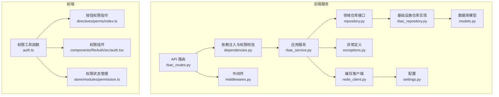
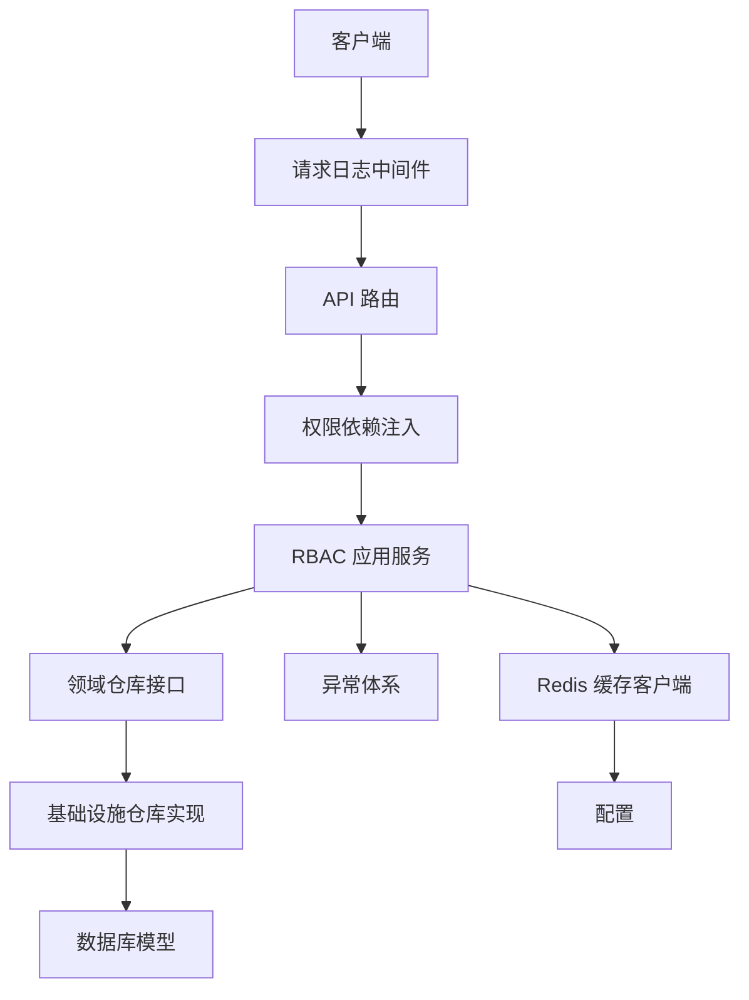
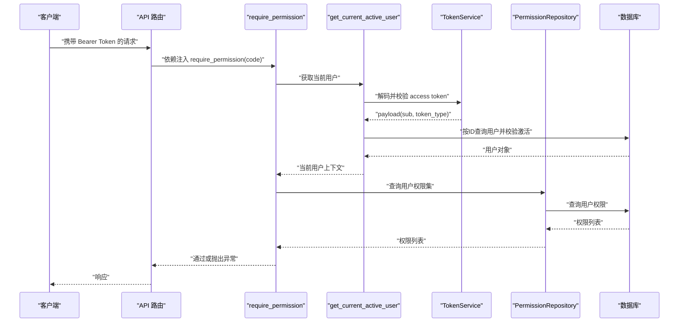
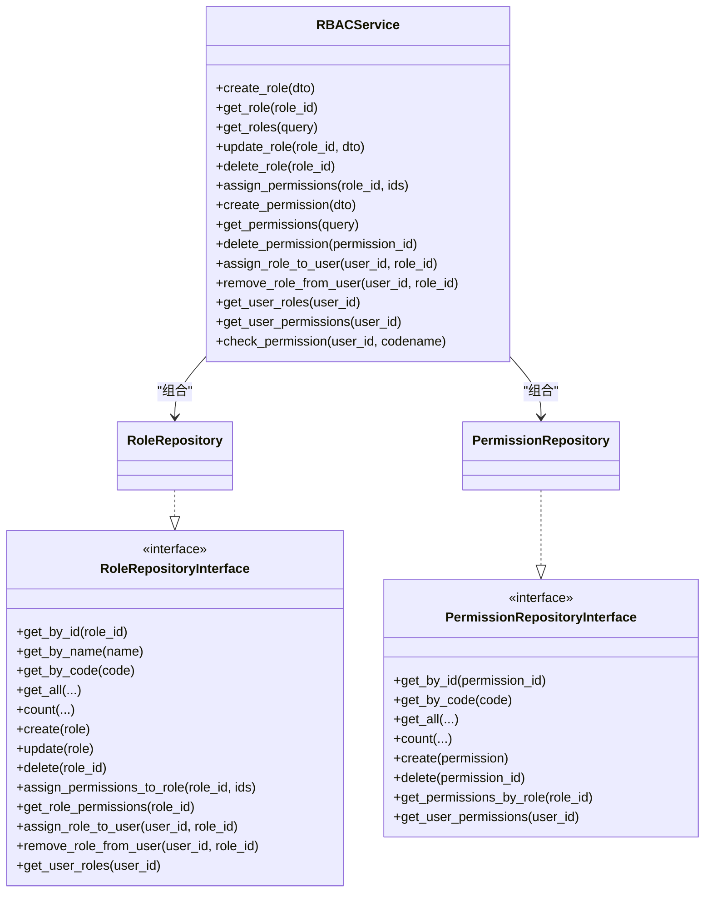
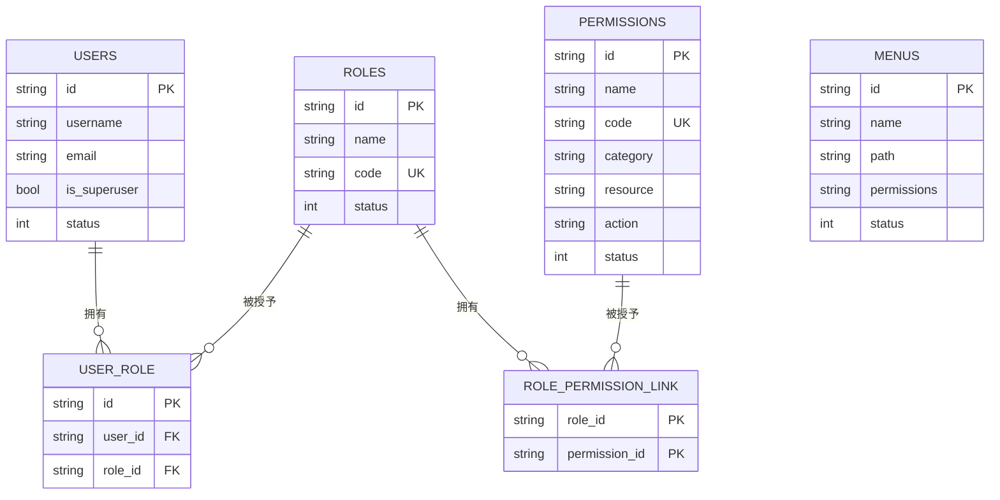
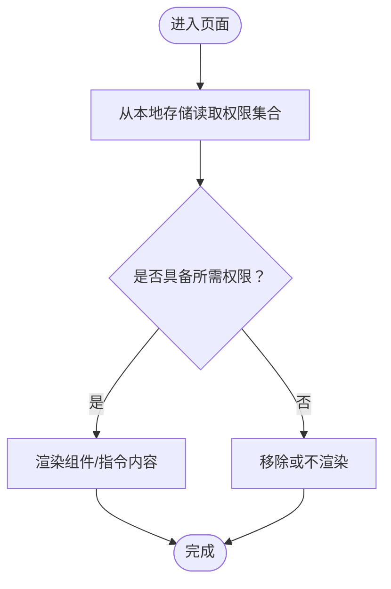
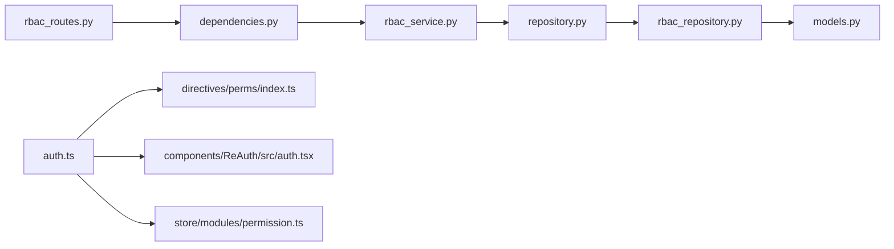

# 权限验证机制

<cite>
**本文引用的文件**
- [middlewares.py](file://service/src/core/middlewares.py)
- [rbac_routes.py](file://service/src/api/v1/rbac_routes.py)
- [dependencies.py](file://service/src/api/dependencies.py)
- [rbac_service.py](file://service/src/application/services/rbac_service.py)
- [repository.py](file://service/src/domain/rbac/repository.py)
- [rbac_repository.py](file://service/src/infrastructure/repositories/rbac_repository.py)
- [models.py](file://service/src/infrastructure/database/models.py)
- [exceptions.py](file://service/src/core/exceptions.py)
- [redis_client.py](file://service/src/infrastructure/cache/redis_client.py)
- [settings.py](file://service/src/config/settings.py)
- [auth.ts](file://web/src/utils/auth.ts)
- [index.ts](file://web/src/directives/perms/index.ts)
- [auth.tsx](file://web/src/components/ReAuth/src/auth.tsx)
- [permission.ts](file://web/src/store/modules/permission.ts)
</cite>

## 目录
1. [引言](#引言)
2. [项目结构](#项目结构)
3. [核心组件](#核心组件)
4. [架构总览](#架构总览)
5. [详细组件分析](#详细组件分析)
6. [依赖关系分析](#依赖关系分析)
7. [性能考量](#性能考量)
8. [故障排查指南](#故障排查指南)
9. [结论](#结论)
10. [附录](#附录)

## 引言
本文件系统性阐述 RBAC 权限验证机制，覆盖请求拦截、权限检查、响应处理、中间件实现与配置、依赖注入与验证逻辑、动态与静态权限验证、错误处理与异常管理、性能优化与缓存策略，以及在 API 接口、菜单权限、按钮权限等场景下的行为差异与调试监控方法。目标是帮助开发者快速理解并正确使用该系统的权限验证体系。

## 项目结构
RBAC 权限验证涉及后端 FastAPI 服务与前端 Vue 前端两部分：
- 后端：基于 FastAPI 的 API 路由、依赖注入、应用服务、领域仓库与基础设施仓库、数据库模型、异常与中间件、缓存与配置。
- 前端：基于 Vue 的权限指令、权限组件、权限状态管理与工具函数，配合后端返回的权限集合实现界面级的动态展示与交互控制。

图表来源
- [rbac_routes.py:1-257](file://service/src/api/v1/rbac_routes.py#L1-L257)
- [dependencies.py:1-72](file://service/src/api/dependencies.py#L1-L72)
- [rbac_service.py:1-231](file://service/src/application/services/rbac_service.py#L1-L231)
- [repository.py:1-77](file://service/src/domain/rbac/repository.py#L1-L77)
- [rbac_repository.py:1-213](file://service/src/infrastructure/repositories/rbac_repository.py#L1-L213)
- [models.py:1-193](file://service/src/infrastructure/database/models.py#L1-L193)
- [exceptions.py:1-60](file://service/src/core/exceptions.py#L1-L60)
- [middlewares.py:1-65](file://service/src/core/middlewares.py#L1-L65)
- [redis_client.py:1-24](file://service/src/infrastructure/cache/redis_client.py#L1-L24)
- [settings.py:1-198](file://service/src/config/settings.py#L1-L198)
- [auth.ts:1-142](file://web/src/utils/auth.ts#L1-L142)
- [index.ts:1-16](file://web/src/directives/perms/index.ts#L1-L16)
- [auth.tsx:1-21](file://web/src/components/ReAuth/src/auth.tsx#L1-L21)
- [permission.ts:1-76](file://web/src/store/modules/permission.ts#L1-L76)

章节来源
- [rbac_routes.py:1-257](file://service/src/api/v1/rbac_routes.py#L1-L257)
- [dependencies.py:1-72](file://service/src/api/dependencies.py#L1-L72)
- [rbac_service.py:1-231](file://service/src/application/services/rbac_service.py#L1-L231)
- [rbac_repository.py:1-213](file://service/src/infrastructure/repositories/rbac_repository.py#L1-L213)
- [models.py:1-193](file://service/src/infrastructure/database/models.py#L1-L193)
- [auth.ts:1-142](file://web/src/utils/auth.ts#L1-L142)
- [index.ts:1-16](file://web/src/directives/perms/index.ts#L1-L16)
- [auth.tsx:1-21](file://web/src/components/ReAuth/src/auth.tsx#L1-L21)
- [permission.ts:1-76](file://web/src/store/modules/permission.ts#L1-L76)

## 核心组件
- 请求拦截与日志中间件：统一记录请求开始与结束、计算耗时并输出日志，便于审计与性能分析。
- 权限依赖注入：通过依赖工厂 require_permission 与 require_superuser，在路由层强制执行权限校验。
- 应用服务与仓库：封装角色、权限、用户与角色权限关联的业务逻辑与数据访问。
- 异常体系：统一的业务异常类型，便于在权限不足、未认证、资源不存在等场景抛出标准错误。
- 前端权限控制：基于用户权限集合的指令与组件，实现按钮级与菜单级的动态渲染与交互控制。

章节来源
- [middlewares.py:12-64](file://service/src/core/middlewares.py#L12-L64)
- [dependencies.py:45-72](file://service/src/api/dependencies.py#L45-L72)
- [rbac_service.py:19-231](file://service/src/application/services/rbac_service.py#L19-L231)
- [exceptions.py:6-60](file://service/src/core/exceptions.py#L6-L60)
- [auth.ts:130-142](file://web/src/utils/auth.ts#L130-L142)
- [index.ts:4-15](file://web/src/directives/perms/index.ts#L4-L15)
- [auth.tsx:4-20](file://web/src/components/ReAuth/src/auth.tsx#L4-L20)

## 架构总览
后端采用分层架构：API 路由层负责暴露接口；依赖注入层负责认证与权限校验；应用服务层负责业务编排；仓库层负责数据访问；数据库模型定义实体关系；异常与中间件提供横切能力；缓存与配置支撑性能与运行参数。

图表来源
- [middlewares.py:12-64](file://service/src/core/middlewares.py#L12-L64)
- [rbac_routes.py:30-257](file://service/src/api/v1/rbac_routes.py#L30-L257)
- [dependencies.py:45-72](file://service/src/api/dependencies.py#L45-L72)
- [rbac_service.py:19-231](file://service/src/application/services/rbac_service.py#L19-L231)
- [repository.py:8-77](file://service/src/domain/rbac/repository.py#L8-L77)
- [rbac_repository.py:11-213](file://service/src/infrastructure/repositories/rbac_repository.py#L11-L213)
- [models.py:17-193](file://service/src/infrastructure/database/models.py#L17-L193)
- [exceptions.py:6-60](file://service/src/core/exceptions.py#L6-L60)
- [redis_client.py:10-23](file://service/src/infrastructure/cache/redis_client.py#L10-L23)
- [settings.py:60-67](file://service/src/config/settings.py#L60-L67)

## 详细组件分析

### 权限依赖注入与验证逻辑
- 依赖链路
  - 路由层通过 Depends(require_permission("...")) 注入权限校验依赖。
  - require_permission 依赖 get_current_active_user 获取当前用户上下文。
  - get_current_active_user 依赖 HTTP Bearer 解析与 TokenService 校验，再从数据库加载用户并校验激活状态。
  - require_permission 最终通过 PermissionRepository 查询用户权限集合并比对目标权限码。
- 特殊处理
  - 超级用户绕过权限校验，直接放行。
  - 未满足权限时抛出禁止访问异常。

图表来源
- [rbac_routes.py:33-176](file://service/src/api/v1/rbac_routes.py#L33-L176)
- [dependencies.py:16-72](file://service/src/api/dependencies.py#L16-L72)
- [rbac_repository.py:203-212](file://service/src/infrastructure/repositories/rbac_repository.py#L203-L212)
- [models.py:31-64](file://service/src/infrastructure/database/models.py#L31-L64)

章节来源
- [rbac_routes.py:33-176](file://service/src/api/v1/rbac_routes.py#L33-L176)
- [dependencies.py:16-72](file://service/src/api/dependencies.py#L16-L72)
- [rbac_repository.py:203-212](file://service/src/infrastructure/repositories/rbac_repository.py#L203-L212)
- [models.py:31-64](file://service/src/infrastructure/database/models.py#L31-L64)

### RBAC 应用服务与仓库
- 应用服务
  - 提供角色、权限、用户角色与权限的增删改查与分配操作。
  - 提供用户权限检查方法，用于细粒度权限判定。
- 仓库
  - 领域接口定义角色与权限的抽象能力。
  - 基础设施实现基于 SQLModel，提供分页、筛选、关联查询与去重。

图表来源
- [rbac_service.py:19-231](file://service/src/application/services/rbac_service.py#L19-L231)
- [repository.py:8-77](file://service/src/domain/rbac/repository.py#L8-L77)
- [rbac_repository.py:11-213](file://service/src/infrastructure/repositories/rbac_repository.py#L11-L213)

章节来源
- [rbac_service.py:19-231](file://service/src/application/services/rbac_service.py#L19-L231)
- [repository.py:8-77](file://service/src/domain/rbac/repository.py#L8-L77)
- [rbac_repository.py:11-213](file://service/src/infrastructure/repositories/rbac_repository.py#L11-L213)

### 数据模型与权限关系
- 角色、权限、用户三者通过多对多关联表建立关系，用户通过用户-角色关联表继承角色权限。
- 菜单模型包含权限编码字符串，可用于前端菜单级权限控制。

图表来源
- [models.py:17-193](file://service/src/infrastructure/database/models.py#L17-L193)

章节来源
- [models.py:17-193](file://service/src/infrastructure/database/models.py#L17-L193)

### 前端权限控制
- 权限工具函数
  - hasPerms 支持字符串与数组两种形式，支持通配符匹配与包含关系判断。
  - 从本地存储读取用户权限集合，结合 Pinia 状态管理。
- 指令与组件
  - v-perms 指令在挂载时根据权限决定元素是否渲染。
  - ReAuth 组件根据权限决定是否渲染默认插槽内容。
- 权限状态管理
  - permission store 提供菜单组装、路由扁平化与缓存页签管理。

图表来源
- [auth.ts:130-142](file://web/src/utils/auth.ts#L130-L142)
- [index.ts:4-15](file://web/src/directives/perms/index.ts#L4-L15)
- [auth.tsx:12-19](file://web/src/components/ReAuth/src/auth.tsx#L12-L19)
- [permission.ts:26-34](file://web/src/store/modules/permission.ts#L26-L34)

章节来源
- [auth.ts:130-142](file://web/src/utils/auth.ts#L130-L142)
- [index.ts:4-15](file://web/src/directives/perms/index.ts#L4-L15)
- [auth.tsx:12-19](file://web/src/components/ReAuth/src/auth.tsx#L12-L19)
- [permission.ts:26-34](file://web/src/store/modules/permission.ts#L26-L34)

## 依赖关系分析
- 路由依赖于依赖注入模块以实现权限校验。
- 应用服务依赖仓库接口，仓库实现依赖数据库模型。
- 前端依赖权限工具函数与状态管理，间接依赖后端返回的权限集合。

图表来源
- [rbac_routes.py:1-257](file://service/src/api/v1/rbac_routes.py#L1-L257)
- [dependencies.py:1-72](file://service/src/api/dependencies.py#L1-L72)
- [rbac_service.py:1-231](file://service/src/application/services/rbac_service.py#L1-L231)
- [repository.py:1-77](file://service/src/domain/rbac/repository.py#L1-L77)
- [rbac_repository.py:1-213](file://service/src/infrastructure/repositories/rbac_repository.py#L1-L213)
- [models.py:1-193](file://service/src/infrastructure/database/models.py#L1-L193)
- [auth.ts:1-142](file://web/src/utils/auth.ts#L1-L142)
- [index.ts:1-16](file://web/src/directives/perms/index.ts#L1-L16)
- [auth.tsx:1-21](file://web/src/components/ReAuth/src/auth.tsx#L1-L21)
- [permission.ts:1-76](file://web/src/store/modules/permission.ts#L1-L76)

章节来源
- [rbac_routes.py:1-257](file://service/src/api/v1/rbac_routes.py#L1-L257)
- [dependencies.py:1-72](file://service/src/api/dependencies.py#L1-L72)
- [rbac_service.py:1-231](file://service/src/application/services/rbac_service.py#L1-L231)
- [rbac_repository.py:1-213](file://service/src/infrastructure/repositories/rbac_repository.py#L1-L213)
- [models.py:1-193](file://service/src/infrastructure/database/models.py#L1-L193)
- [auth.ts:1-142](file://web/src/utils/auth.ts#L1-L142)
- [index.ts:1-16](file://web/src/directives/perms/index.ts#L1-L16)
- [auth.tsx:1-21](file://web/src/components/ReAuth/src/auth.tsx#L1-L21)
- [permission.ts:1-76](file://web/src/store/modules/permission.ts#L1-L76)

## 性能考量
- 中间件统计与日志
  - 请求日志中间件记录请求开始与结束、处理时长与状态码，便于性能监控与审计。
- 依赖注入与权限检查
  - require_permission 每次请求都会查询用户权限集，建议在应用层引入缓存以降低数据库压力。
- 缓存与配置
  - Redis 客户端提供连接管理，可在应用服务层对用户权限集进行缓存，结合配置中心调整缓存键与过期策略。
- 前端渲染优化
  - 前端指令与组件仅做本地判断，避免重复网络请求；菜单与路由的动态组装可结合扁平化与去重策略减少计算开销。

章节来源
- [middlewares.py:12-64](file://service/src/core/middlewares.py#L12-L64)
- [dependencies.py:45-72](file://service/src/api/dependencies.py#L45-L72)
- [rbac_repository.py:203-212](file://service/src/infrastructure/repositories/rbac_repository.py#L203-L212)
- [redis_client.py:10-23](file://service/src/infrastructure/cache/redis_client.py#L10-L23)
- [settings.py:60-67](file://service/src/config/settings.py#L60-L67)

## 故障排查指南
- 常见异常
  - 未认证：令牌无效、过期或类型不符。
  - 权限不足：缺少目标权限码。
  - 资源不存在：角色、权限或用户不存在。
- 排查步骤
  - 检查请求头是否携带正确的 Bearer 令牌。
  - 确认令牌类型为访问令牌且未过期。
  - 核对用户是否激活，是否被授予目标角色与权限。
  - 查看中间件日志与应用异常栈，定位具体失败点。
- 建议
  - 在 require_permission 处增加更详细的日志与上下文信息。
  - 对频繁访问的权限查询引入缓存，降低数据库负载。

章节来源
- [exceptions.py:13-60](file://service/src/core/exceptions.py#L13-L60)
- [dependencies.py:16-72](file://service/src/api/dependencies.py#L16-L72)
- [rbac_repository.py:203-212](file://service/src/infrastructure/repositories/rbac_repository.py#L203-L212)
- [middlewares.py:12-64](file://service/src/core/middlewares.py#L12-L64)

## 结论
该 RBAC 权限验证机制通过“路由依赖注入 + 应用服务 + 仓库 + 数据模型”的分层设计，实现了细粒度的权限控制；前端通过指令与组件实现按钮与菜单级的动态渲染。建议在生产环境中引入权限缓存、完善异常与日志、加强监控与告警，以提升安全性与稳定性。

## 附录

### 动态权限验证 vs 静态权限验证
- 动态权限验证
  - 后端：每次请求通过 require_permission 查询用户权限集并实时比对，适用于权限频繁变更的场景。
  - 前端：hasPerms 基于本地权限集合判断，适合界面级即时控制。
- 静态权限验证
  - 后端：在用户登录时一次性下发权限集合，后续请求不再查询数据库，适用于权限相对稳定的场景。
  - 前端：菜单与路由在登录时根据权限生成，减少运行时计算。

章节来源
- [dependencies.py:45-72](file://service/src/api/dependencies.py#L45-L72)
- [rbac_repository.py:203-212](file://service/src/infrastructure/repositories/rbac_repository.py#L203-L212)
- [auth.ts:130-142](file://web/src/utils/auth.ts#L130-L142)

### 不同场景下的行为差异
- API 接口
  - 通过 require_permission 在路由层强制校验，失败返回禁止访问。
- 菜单权限
  - 前端根据权限集合与菜单权限编码进行过滤与渲染。
- 按钮权限
  - 通过 v-perms 指令或 ReAuth 组件在 DOM 层面控制按钮显隐。

章节来源
- [rbac_routes.py:33-176](file://service/src/api/v1/rbac_routes.py#L33-L176)
- [models.py:146-171](file://service/src/infrastructure/database/models.py#L146-L171)
- [index.ts:4-15](file://web/src/directives/perms/index.ts#L4-L15)
- [auth.tsx:12-19](file://web/src/components/ReAuth/src/auth.tsx#L12-L19)

### 调试工具与监控方法
- 后端
  - 请求日志中间件输出请求与响应信息，结合异常类型定位问题。
  - 可扩展指标采集与链路追踪，记录权限检查耗时与命中率。
- 前端
  - 在 hasPerms 与指令钩子中增加日志输出，观察权限集合与判断结果。
  - 使用浏览器开发者工具查看网络请求与权限相关接口的返回。

章节来源
- [middlewares.py:12-64](file://service/src/core/middlewares.py#L12-L64)
- [auth.ts:130-142](file://web/src/utils/auth.ts#L130-L142)
- [index.ts:4-15](file://web/src/directives/perms/index.ts#L4-L15)