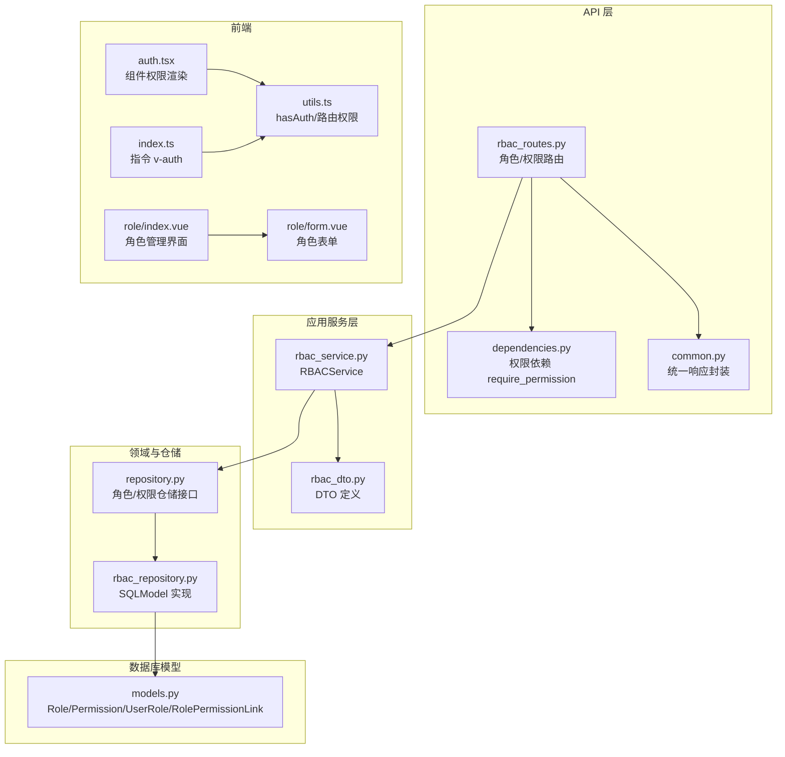
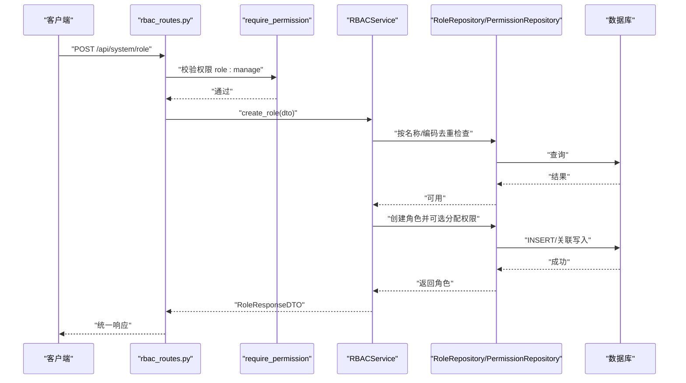
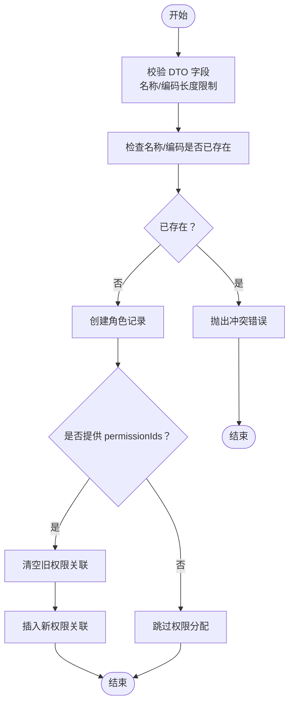
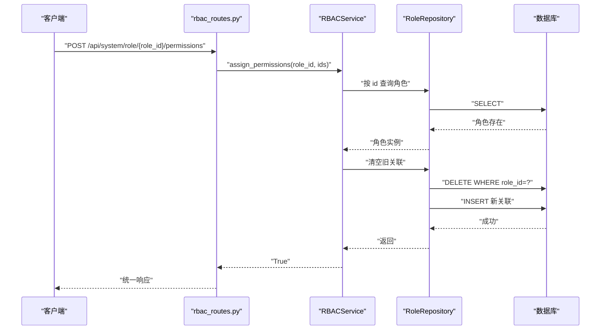
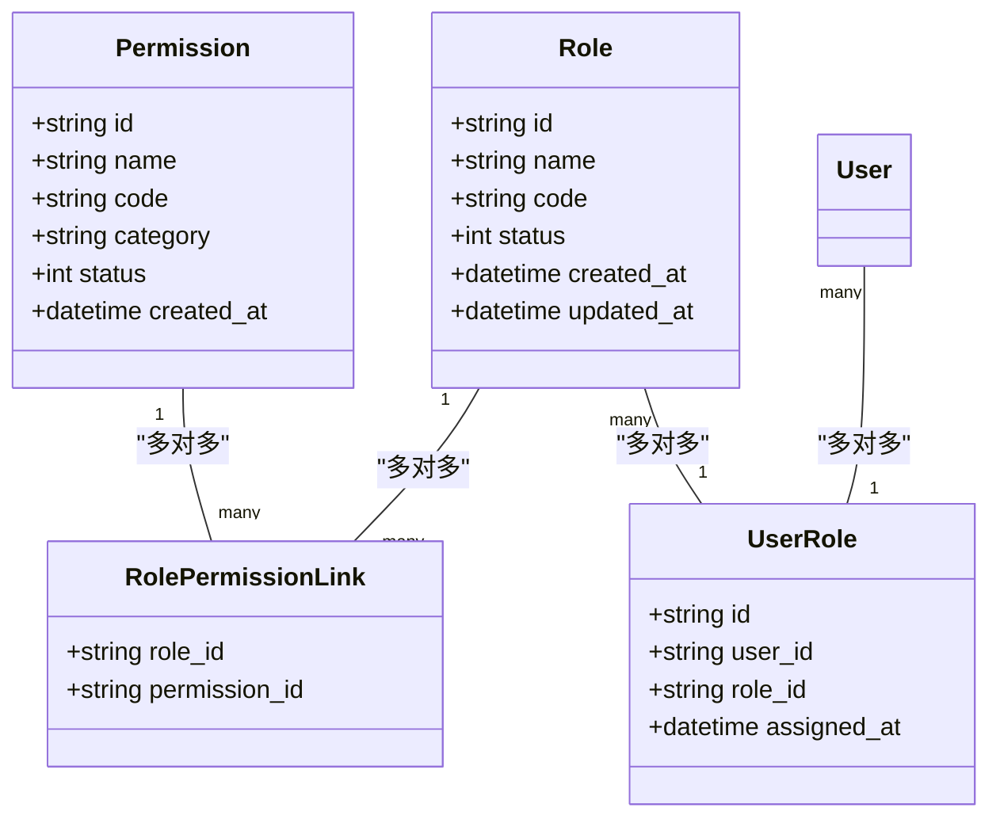
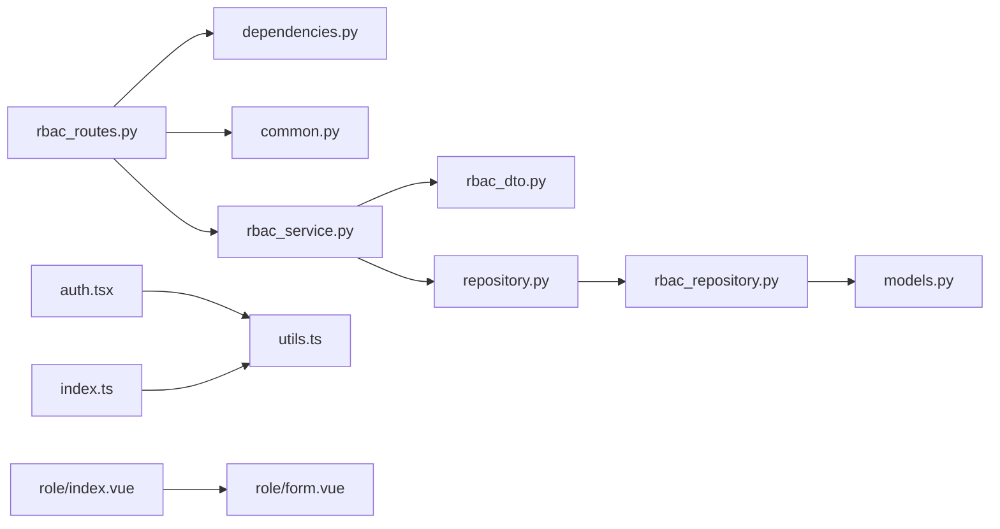

# 角色管理

<cite>
**本文引用的文件**   
- [rbac_routes.py](file://service/src/api/v1/rbac_routes.py)
- [rbac_service.py](file://service/src/application/services/rbac_service.py)
- [rbac_dto.py](file://service/src/application/dto/rbac_dto.py)
- [rbac_repository.py](file://service/src/infrastructure/repositories/rbac_repository.py)
- [repository.py](file://service/src/domain/rbac/repository.py)
- [models.py](file://service/src/infrastructure/database/models.py)
- [dependencies.py](file://service/src/api/dependencies.py)
- [common.py](file://service/src/api/common.py)
- [auth.tsx](file://web/src/components/ReAuth/src/auth.tsx)
- [index.ts](file://web/src/directives/auth/index.ts)
- [utils.ts](file://web/src/router/utils.ts)
- [index.vue](file://web/src/views/system/role/index.vue)
- [form.vue](file://web/src/views/system/role/form.vue)
</cite>

## 目录
1. [简介](#简介)
2. [项目结构](#项目结构)
3. [核心组件](#核心组件)
4. [架构总览](#架构总览)
5. [详细组件分析](#详细组件分析)
6. [依赖分析](#依赖分析)
7. [性能考虑](#性能考虑)
8. [故障排查指南](#故障排查指南)
9. [结论](#结论)
10. [附录](#附录)

## 简介
本文件面向 RBAC 系统中的“角色管理”功能，系统性阐述角色的创建、更新、删除、查询与角色权限分配/撤销的完整实现流程；解释角色与权限的多对多关联关系与继承策略；给出角色管理的 API 接口文档（请求参数、响应格式、错误处理）；说明角色在用户授权过程中的作用与优先级；并提供最佳实践、常见问题与实际使用示例。

## 项目结构
围绕角色管理的关键代码分布在以下层次：
- API 层：提供 REST 接口，负责参数校验、鉴权与统一响应封装
- 应用服务层：编排业务逻辑，协调仓储与 DTO
- 领域仓储接口：定义角色与权限的抽象能力
- 基础设施仓储实现：基于 SQLModel 的具体实现
- 数据库模型：定义角色、权限、用户-角色、角色-权限关联等实体
- 前端权限控制：指令与组件在前端侧进行按钮级权限校验

图表来源
- [rbac_routes.py:1-257](file://service/src/api/v1/rbac_routes.py#L1-L257)
- [dependencies.py:45-60](file://service/src/api/dependencies.py#L45-L60)
- [common.py:29-64](file://service/src/api/common.py#L29-L64)
- [rbac_service.py:1-231](file://service/src/application/services/rbac_service.py#L1-L231)
- [rbac_dto.py:1-88](file://service/src/application/dto/rbac_dto.py#L1-L88)
- [repository.py:1-77](file://service/src/domain/rbac/repository.py#L1-L77)
- [rbac_repository.py:1-213](file://service/src/infrastructure/repositories/rbac_repository.py#L1-L213)
- [models.py:1-193](file://service/src/infrastructure/database/models.py#L1-L193)
- [auth.tsx:1-21](file://web/src/components/ReAuth/src/auth.tsx#L1-L21)
- [index.ts:1-16](file://web/src/directives/auth/index.ts#L1-L16)
- [utils.ts:368-383](file://web/src/router/utils.ts#L368-L383)
- [index.vue:1-342](file://web/src/views/system/role/index.vue#L1-L342)
- [form.vue:1-56](file://web/src/views/system/role/form.vue#L1-L56)

章节来源
- [rbac_routes.py:1-257](file://service/src/api/v1/rbac_routes.py#L1-L257)
- [rbac_service.py:1-231](file://service/src/application/services/rbac_service.py#L1-L231)
- [rbac_dto.py:1-88](file://service/src/application/dto/rbac_dto.py#L1-L88)
- [repository.py:1-77](file://service/src/domain/rbac/repository.py#L1-L77)
- [rbac_repository.py:1-213](file://service/src/infrastructure/repositories/rbac_repository.py#L1-L213)
- [models.py:1-193](file://service/src/infrastructure/database/models.py#L1-L193)
- [dependencies.py:1-72](file://service/src/api/dependencies.py#L1-L72)
- [common.py:1-65](file://service/src/api/common.py#L1-L65)
- [auth.tsx:1-21](file://web/src/components/ReAuth/src/auth.tsx#L1-L21)
- [index.ts:1-16](file://web/src/directives/auth/index.ts#L1-L16)
- [utils.ts:368-383](file://web/src/router/utils.ts#L368-L383)
- [index.vue:1-342](file://web/src/views/system/role/index.vue#L1-L342)
- [form.vue:1-56](file://web/src/views/system/role/form.vue#L1-L56)

## 核心组件
- 角色路由与权限路由：提供角色 CRUD、角色权限分配、权限 CRUD、用户角色分配等接口
- RBACService：封装角色与权限的业务逻辑，负责去重校验、权限分配、用户权限聚合
- 仓储接口与实现：定义角色/权限的查询、计数、创建、更新、删除、关联管理等能力
- 数据库模型：Role、Permission、UserRole、RolePermissionLink 多对多关系
- 前端权限控制：指令 v-auth、组件 Auth、工具函数 hasAuth 在前端侧进行按钮级权限渲染与校验

章节来源
- [rbac_routes.py:33-176](file://service/src/api/v1/rbac_routes.py#L33-L176)
- [rbac_service.py:28-198](file://service/src/application/services/rbac_service.py#L28-L198)
- [repository.py:8-77](file://service/src/domain/rbac/repository.py#L8-L77)
- [rbac_repository.py:11-213](file://service/src/infrastructure/repositories/rbac_repository.py#L11-L213)
- [models.py:17-141](file://service/src/infrastructure/database/models.py#L17-L141)
- [dependencies.py:45-60](file://service/src/api/dependencies.py#L45-L60)
- [common.py:29-64](file://service/src/api/common.py#L29-L64)
- [auth.tsx:1-21](file://web/src/components/ReAuth/src/auth.tsx#L1-L21)
- [index.ts:1-16](file://web/src/directives/auth/index.ts#L1-L16)
- [utils.ts:368-383](file://web/src/router/utils.ts#L368-L383)

## 架构总览
角色管理采用分层架构：API 路由层负责输入输出与鉴权；应用服务层编排业务；仓储层屏蔽数据访问细节；模型层定义实体与关系。权限依赖 require_permission 在进入业务逻辑前完成权限校验。

图表来源
- [rbac_routes.py:64-83](file://service/src/api/v1/rbac_routes.py#L64-L83)
- [dependencies.py:45-60](file://service/src/api/dependencies.py#L45-L60)
- [rbac_service.py:28-49](file://service/src/application/services/rbac_service.py#L28-L49)
- [rbac_repository.py:62-96](file://service/src/infrastructure/repositories/rbac_repository.py#L62-L96)
- [models.py:70-120](file://service/src/infrastructure/database/models.py#L70-L120)

## 详细组件分析

### 角色管理 API 接口文档
- 角色列表（分页）
  - 方法与路径：GET /api/system/role/list
  - 权限：role:view
  - 查询参数：
    - pageNum: 整数，最小 1
    - pageSize: 整数，范围 [1,100]
    - roleName: 字符串（模糊匹配）
    - status: 整数（0-禁用, 1-启用）
  - 成功响应：统一响应，data 包含 total、pageNum、pageSize、totalPage、rows（角色列表）
  - 错误：无特殊错误类型，失败由统一错误响应封装
  - 章节来源
    - [rbac_routes.py:33-61](file://service/src/api/v1/rbac_routes.py#L33-L61)
    - [common.py:36-59](file://service/src/api/common.py#L36-L59)

- 创建角色
  - 方法与路径：POST /api/system/role
  - 权限：role:manage
  - 请求体：RoleCreateDTO
    - name: 字符串，长度 [2,64]
    - code: 字符串，长度 [2,64]
    - description: 字符串（可选）
    - status: 整数（默认 1）
    - permissionIds: 字符串数组（可选，用于初始分配权限）
  - 成功响应：统一响应，data 为 RoleResponseDTO，code=201
  - 错误：冲突（名称/编码已存在）、通用错误
  - 章节来源
    - [rbac_routes.py:64-83](file://service/src/api/v1/rbac_routes.py#L64-L83)
    - [rbac_dto.py:8-15](file://service/src/application/dto/rbac_dto.py#L8-L15)
    - [rbac_service.py:28-49](file://service/src/application/services/rbac_service.py#L28-L49)

- 获取角色详情
  - 方法与路径：GET /api/system/role/{role_id}
  - 权限：role:view
  - 路径参数：role_id
  - 成功响应：统一响应，data 为 RoleResponseDTO（含 permissions 列表）
  - 错误：未找到
  - 章节来源
    - [rbac_routes.py:86-105](file://service/src/api/v1/rbac_routes.py#L86-L105)
    - [rbac_service.py:51-56](file://service/src/application/services/rbac_service.py#L51-L56)

- 更新角色
  - 方法与路径：PUT /api/system/role/{role_id}
  - 权限：role:manage
  - 请求体：RoleUpdateDTO
    - name/code/description/status（可选），permissionIds（可选，为 None 表示不更新权限）
  - 成功响应：统一响应，data 为更新后的 RoleResponseDTO
  - 错误：未找到、冲突（名称/编码重复）
  - 章节来源
    - [rbac_routes.py:108-129](file://service/src/api/v1/rbac_routes.py#L108-L129)
    - [rbac_dto.py:17-24](file://service/src/application/dto/rbac_dto.py#L17-L24)
    - [rbac_service.py:79-113](file://service/src/application/services/rbac_service.py#L79-L113)

- 删除角色
  - 方法与路径：DELETE /api/system/role/{role_id}
  - 权限：role:manage
  - 成功响应：统一响应
  - 错误：未找到
  - 章节来源
    - [rbac_routes.py:132-151](file://service/src/api/v1/rbac_routes.py#L132-L151)
    - [rbac_service.py:115-119](file://service/src/application/services/rbac_service.py#L115-L119)

- 为角色分配权限
  - 方法与路径：POST /api/system/role/{role_id}/permissions
  - 权限：role:manage
  - 请求体：AssignPermissionsDTO
    - permissionIds: 字符串数组
  - 行为：先清空旧关联，再写入新关联
  - 成功响应：统一响应
  - 错误：未找到
  - 章节来源
    - [rbac_routes.py:154-176](file://service/src/api/v1/rbac_routes.py#L154-L176)
    - [rbac_dto.py:85-88](file://service/src/application/dto/rbac_dto.py#L85-L88)
    - [rbac_service.py:121-129](file://service/src/application/services/rbac_service.py#L121-L129)
    - [rbac_repository.py:84-96](file://service/src/infrastructure/repositories/rbac_repository.py#L84-L96)

- 权限列表（分页）
  - 方法与路径：GET /api/system/permission/list
  - 权限：permission:view
  - 查询参数：
    - pageNum/pageSize
    - permissionName（模糊匹配）
  - 成功响应：统一响应，data 包含分页信息与 rows（权限列表）
  - 章节来源
    - [rbac_routes.py:186-212](file://service/src/api/v1/rbac_routes.py#L186-L212)
    - [common.py:36-59](file://service/src/api/common.py#L36-L59)

- 创建权限
  - 方法与路径：POST /api/system/permission
  - 权限：permission:manage
  - 请求体：PermissionCreateDTO
    - name/code/category/description/status
  - 成功响应：统一响应，data 为 PermissionResponseDTO，code=201
  - 错误：冲突（编码已存在）
  - 章节来源
    - [rbac_routes.py:215-234](file://service/src/api/v1/rbac_routes.py#L215-L234)
    - [rbac_dto.py:48-55](file://service/src/application/dto/rbac_dto.py#L48-L55)
    - [rbac_service.py:133-147](file://service/src/application/services/rbac_service.py#L133-L147)

- 删除权限
  - 方法与路径：DELETE /api/system/permission/{permission_id}
  - 权限：permission:manage
  - 成功响应：统一响应
  - 错误：未找到
  - 章节来源
    - [rbac_routes.py:237-256](file://service/src/api/v1/rbac_routes.py#L237-L256)
    - [rbac_service.py:161-165](file://service/src/application/services/rbac_service.py#L161-L165)

### 角色与权限关联关系与继承策略
- 关联关系
  - 角色与权限：多对多，通过中间表 role_permissions 存储
  - 用户与角色：多对多，通过中间表 user_roles 存储
- 权限继承
  - 用户通过其角色获得权限，系统在查询用户权限时会聚合其所有角色对应的权限
- 分配策略
  - 为角色分配权限时，先清理旧关联，再写入新集合，确保一致性
- 章节来源
  - [models.py:17-141](file://service/src/infrastructure/database/models.py#L17-L141)
  - [rbac_repository.py:84-133](file://service/src/infrastructure/repositories/rbac_repository.py#L84-L133)
  - [rbac_service.py:190-198](file://service/src/application/services/rbac_service.py#L190-L198)

### 角色在用户授权中的作用与优先级
- 用户授权链路
  - 用户拥有多个角色
  - 每个角色绑定若干权限
  - 用户最终权限为其所有角色权限的并集
- 前端优先级
  - 指令 v-auth 与组件 Auth 基于当前路由 meta.auths 与用户权限集合进行匹配
  - 路由工具 hasAuth 支持字符串或数组匹配，决定元素是否渲染
- 章节来源
  - [rbac_service.py:190-198](file://service/src/application/services/rbac_service.py#L190-L198)
  - [utils.ts:368-383](file://web/src/router/utils.ts#L368-L383)
  - [index.ts:1-16](file://web/src/directives/auth/index.ts#L1-L16)
  - [auth.tsx:1-21](file://web/src/components/ReAuth/src/auth.tsx#L1-L21)

### 角色管理 API 流程图（创建角色）

图表来源
- [rbac_service.py:28-49](file://service/src/application/services/rbac_service.py#L28-L49)
- [rbac_repository.py:84-96](file://service/src/infrastructure/repositories/rbac_repository.py#L84-L96)
- [rbac_dto.py:8-15](file://service/src/application/dto/rbac_dto.py#L8-L15)

### 角色权限分配流程（为角色分配权限）

图表来源
- [rbac_routes.py:154-176](file://service/src/api/v1/rbac_routes.py#L154-L176)
- [rbac_service.py:121-129](file://service/src/application/services/rbac_service.py#L121-L129)
- [rbac_repository.py:84-96](file://service/src/infrastructure/repositories/rbac_repository.py#L84-L96)

### 类关系图（角色、权限、关联）

图表来源
- [models.py:17-141](file://service/src/infrastructure/database/models.py#L17-L141)

## 依赖分析
- API 层依赖
  - require_permission 依赖 PermissionRepository 获取用户权限并进行校验
  - 统一响应封装在 common.py 中提供 success_response/page_response/error_response
- 应用服务层依赖
  - RoleRepository/PermissionRepository 提供数据访问能力
  - DTO 作为输入输出契约
- 仓储层依赖
  - SQLModel 查询与写入，中间表维护多对多关系
- 前端依赖
  - v-auth 指令与 Auth 组件依赖 hasAuth 判断当前路由权限
  - 角色管理界面依赖后端接口进行增删改查与权限分配

图表来源
- [rbac_routes.py:1-257](file://service/src/api/v1/rbac_routes.py#L1-L257)
- [dependencies.py:1-72](file://service/src/api/dependencies.py#L1-L72)
- [common.py:1-65](file://service/src/api/common.py#L1-L65)
- [rbac_service.py:1-231](file://service/src/application/services/rbac_service.py#L1-L231)
- [rbac_dto.py:1-88](file://service/src/application/dto/rbac_dto.py#L1-L88)
- [repository.py:1-77](file://service/src/domain/rbac/repository.py#L1-L77)
- [rbac_repository.py:1-213](file://service/src/infrastructure/repositories/rbac_repository.py#L1-L213)
- [models.py:1-193](file://service/src/infrastructure/database/models.py#L1-L193)
- [auth.tsx:1-21](file://web/src/components/ReAuth/src/auth.tsx#L1-L21)
- [index.ts:1-16](file://web/src/directives/auth/index.ts#L1-L16)
- [utils.ts:368-383](file://web/src/router/utils.ts#L368-L383)
- [index.vue:1-342](file://web/src/views/system/role/index.vue#L1-L342)
- [form.vue:1-56](file://web/src/views/system/role/form.vue#L1-L56)

章节来源
- [rbac_routes.py:1-257](file://service/src/api/v1/rbac_routes.py#L1-L257)
- [dependencies.py:1-72](file://service/src/api/dependencies.py#L1-L72)
- [common.py:1-65](file://service/src/api/common.py#L1-L65)
- [rbac_service.py:1-231](file://service/src/application/services/rbac_service.py#L1-L231)
- [rbac_dto.py:1-88](file://service/src/application/dto/rbac_dto.py#L1-L88)
- [repository.py:1-77](file://service/src/domain/rbac/repository.py#L1-L77)
- [rbac_repository.py:1-213](file://service/src/infrastructure/repositories/rbac_repository.py#L1-L213)
- [models.py:1-193](file://service/src/infrastructure/database/models.py#L1-L193)
- [auth.tsx:1-21](file://web/src/components/ReAuth/src/auth.tsx#L1-L21)
- [index.ts:1-16](file://web/src/directives/auth/index.ts#L1-L16)
- [utils.ts:368-383](file://web/src/router/utils.ts#L368-L383)
- [index.vue:1-342](file://web/src/views/system/role/index.vue#L1-L342)
- [form.vue:1-56](file://web/src/views/system/role/form.vue#L1-L56)

## 性能考虑
- 分页查询
  - 角色与权限列表均支持 pageNum/pageSize 与筛选条件，建议前端合理设置 pageSize 并使用模糊查询时配合索引字段
- 关联写入
  - 为角色分配权限采用“清空旧关联+批量写入”，在权限数量较大时建议评估批量插入性能与事务开销
- 权限聚合
  - 用户权限聚合通过 JOIN 多表查询实现，建议在权限编码与用户-角色关联上建立索引以提升查询效率
- 前端渲染
  - 指令与组件基于 hasAuth 进行渲染判断，避免不必要的 DOM 渲染；建议在路由初始化时缓存用户权限集合

## 故障排查指南
- 常见错误与定位
  - 未授权/权限不足：检查 require_permission 依赖是否正确传递用户权限，确认用户是否具备 role:manage/permission:manage 等所需权限
  - 未找到资源：检查角色/权限 ID 是否有效，确认删除/更新前的查询逻辑
  - 冲突（名称/编码重复）：创建/更新角色时若名称或编码重复会触发冲突，需调整唯一约束字段
- 日志与追踪
  - 统一响应封装便于前后端调试，建议在 API 层打印关键请求与响应摘要
- 前端权限不生效
  - 检查路由 meta.auths 配置与 hasAuth 判断逻辑，确认当前用户权限集合是否包含目标权限编码

章节来源
- [dependencies.py:45-60](file://service/src/api/dependencies.py#L45-L60)
- [rbac_service.py:30-35](file://service/src/application/services/rbac_service.py#L30-L35)
- [rbac_service.py:81-83](file://service/src/application/services/rbac_service.py#L81-L83)
- [rbac_service.py:135-137](file://service/src/application/services/rbac_service.py#L135-L137)
- [common.py:45-64](file://service/src/api/common.py#L45-L64)
- [utils.ts:368-383](file://web/src/router/utils.ts#L368-L383)

## 结论
本角色管理实现遵循清晰的分层设计：API 层负责接口与鉴权，应用服务层编排业务逻辑，仓储层屏蔽数据细节，模型层定义实体关系。角色与权限采用多对多关联并通过中间表维护，用户权限通过其角色聚合得到。前端通过指令与组件实现按钮级权限控制，形成从前端到后端的完整授权闭环。建议在生产环境中关注分页与批量写入性能、索引优化与权限缓存策略。

## 附录

### 角色管理最佳实践
- 设计阶段
  - 角色命名与编码应具备唯一性与可读性，避免歧义
  - 权限编码采用“模块:动作”风格，便于前端与后端统一识别
- 运行阶段
  - 分配权限时尽量使用批量接口，减少多次往返
  - 定期审计角色与权限映射，清理无效关联
- 安全与合规
  - 使用 require_permission 严格控制敏感接口访问
  - 对关键操作（创建/删除角色、分配权限）增加审计日志

### 常见问题与解决方案
- 问题：更新角色时未更新权限
  - 解决：确保 RoleUpdateDTO 的 permissionIds 字段非 None 时才会重新分配
- 问题：权限分配后旧权限仍生效
  - 解决：确认分配接口执行了“清空旧关联”的步骤
- 问题：前端按钮不显示但用户确有权限
  - 解决：检查路由 meta.auths 与用户权限集合是否一致，确认 hasAuth 判断逻辑

### 实际使用示例（角色权限配置）
- 示例场景：为“运营管理员”角色分配“订单查询”“退款审批”权限
  - 步骤
    1) 创建权限：调用创建权限接口，提交权限编码（如 order:query、order:refund_approve）
    2) 创建角色：调用创建角色接口，传入角色名称与编码，同时传入 permissionIds
    3) 验证：调用获取角色详情接口，确认 permissions 列表包含上述权限
  - 章节来源
    - [rbac_routes.py:64-83](file://service/src/api/v1/rbac_routes.py#L64-L83)
    - [rbac_routes.py:215-234](file://service/src/api/v1/rbac_routes.py#L215-L234)
    - [rbac_routes.py:86-105](file://service/src/api/v1/rbac_routes.py#L86-L105)