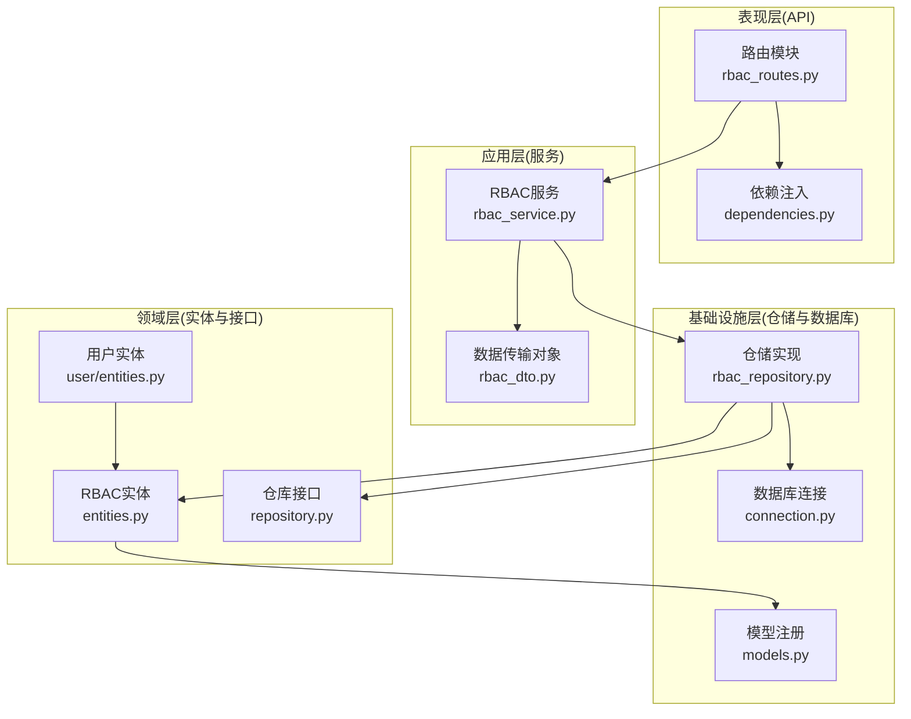
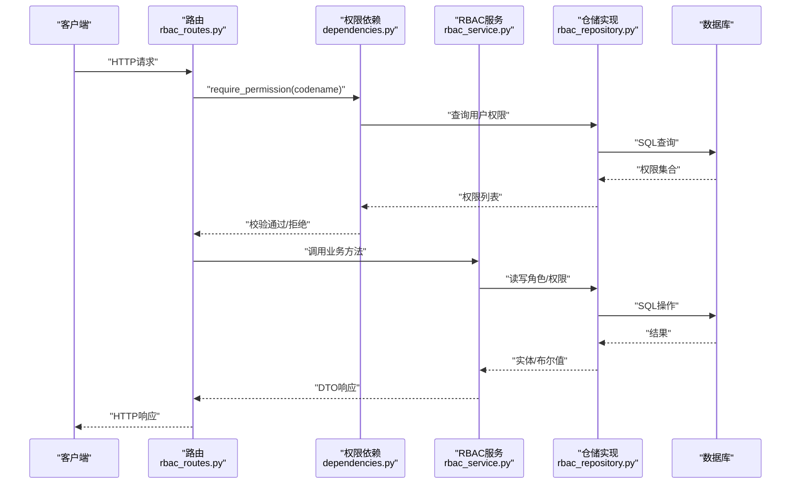
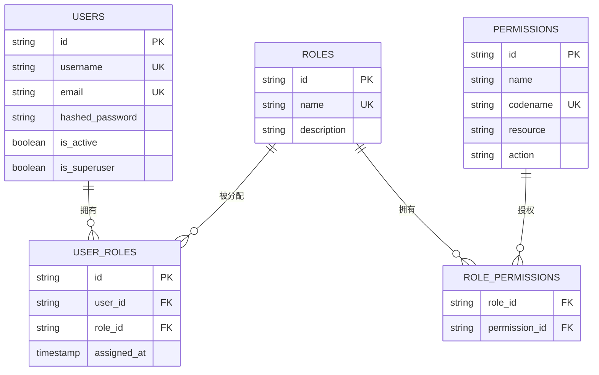
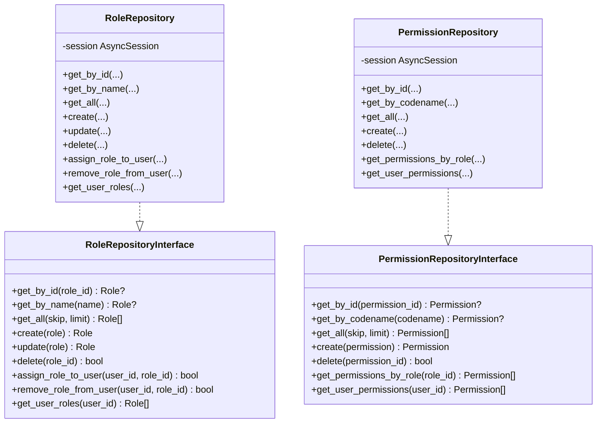
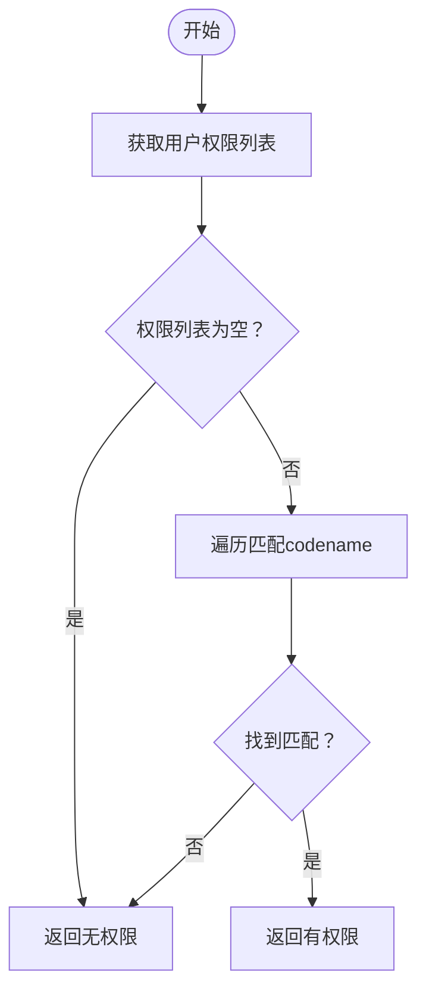
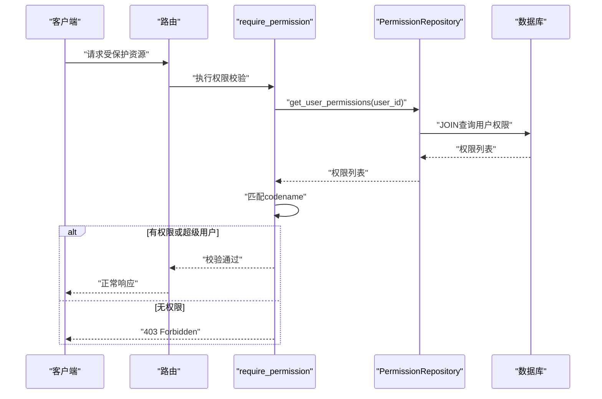
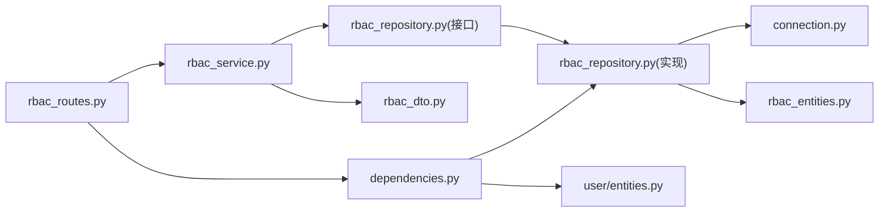

# RBAC权限系统

<cite>
**本文档引用的文件**
- [src/domain/rbac/entities.py](file://src/domain/rbac/entities.py)
- [src/domain/rbac/repository.py](file://src/domain/rbac/repository.py)
- [src/infrastructure/repositories/rbac_repository.py](file://src/infrastructure/repositories/rbac_repository.py)
- [src/application/services/rbac_service.py](file://src/application/services/rbac_service.py)
- [src/api/v1/rbac_routes.py](file://src/api/v1/rbac_routes.py)
- [src/api/dependencies.py](file://src/api/dependencies.py)
- [src/application/dto/rbac_dto.py](file://src/application/dto/rbac_dto.py)
- [src/domain/user/entities.py](file://src/domain/user/entities.py)
- [src/infrastructure/database/connection.py](file://src/infrastructure/database/connection.py)
- [src/infrastructure/database/models.py](file://src/infrastructure/database/models.py)
- [src/core/exceptions.py](file://src/core/exceptions.py)
- [src/main.py](file://src/main.py)
- [config/settings/base.py](file://config/settings/base.py)
- [src/core/middlewares.py](file://src/core/middlewares.py)
</cite>

## 目录
1. [简介](#简介)
2. [项目结构](#项目结构)
3. [核心组件](#核心组件)
4. [架构总览](#架构总览)
5. [详细组件分析](#详细组件分析)
6. [依赖关系分析](#依赖关系分析)
7. [性能考虑](#性能考虑)
8. [故障排除指南](#故障排除指南)
9. [结论](#结论)
10. [附录](#附录)

## 简介
本文件系统性阐述基于角色的访问控制（RBAC）权限模型的设计与实现，覆盖角色、权限与用户三者之间的多对多关系建模，权限检查的动态机制（继承、组合与验证），以及RBAC服务在角色分配、权限授予与权限验证方面的具体逻辑。同时，文档说明权限实体设计（标识符、描述与资源动作结构）、仓储模式在权限查询与批量操作中的应用，并提供API接口文档与使用示例，最后总结安全考虑与性能优化策略。

## 项目结构
该RBAC系统遵循分层架构与领域驱动设计（DDD）原则，分为以下层次：
- 表现层（API层）：定义REST接口与权限依赖注入
- 应用层（服务层）：封装业务用例与事务边界
- 领域层（实体与仓库接口）：定义权限、角色、用户等核心实体及仓库接口
- 基础设施层（仓储实现与数据库）：提供SQLAlchemy异步仓储实现与数据库连接

图表来源
- [src/api/v1/rbac_routes.py:1-168](file://src/api/v1/rbac_routes.py#L1-L168)
- [src/api/dependencies.py:1-83](file://src/api/dependencies.py#L1-L83)
- [src/application/services/rbac_service.py:1-159](file://src/application/services/rbac_service.py#L1-L159)
- [src/application/dto/rbac_dto.py:1-70](file://src/application/dto/rbac_dto.py#L1-L70)
- [src/domain/rbac/entities.py:1-79](file://src/domain/rbac/entities.py#L1-L79)
- [src/domain/rbac/repository.py:1-62](file://src/domain/rbac/repository.py#L1-L62)
- [src/infrastructure/repositories/rbac_repository.py:1-133](file://src/infrastructure/repositories/rbac_repository.py#L1-L133)
- [src/infrastructure/database/connection.py:1-51](file://src/infrastructure/database/connection.py#L1-L51)
- [src/infrastructure/database/models.py:1-10](file://src/infrastructure/database/models.py#L1-L10)
- [src/domain/user/entities.py:1-38](file://src/domain/user/entities.py#L1-L38)

章节来源
- [src/main.py:1-83](file://src/main.py#L1-L83)
- [src/api/v1/__init__.py:1-15](file://src/api/v1/__init__.py#L1-L15)

## 核心组件
- 权限实体（Permission）：表示可执行的操作，包含名称、编码（codename）、资源类型与动作等字段，支持唯一约束与索引，用于快速检索与权限匹配。
- 角色实体（Role）：聚合根，维护角色与其权限的多对多关系，以及用户角色映射（UserRole）的反向关系。
- 用户角色关联（UserRole）：用户与角色的多对多映射，支持为用户分配角色并记录分配时间。
- 仓库接口（RoleRepositoryInterface、PermissionRepositoryInterface）：定义角色与权限的CRUD、分配与查询接口，保证应用服务与实现解耦。
- 仓储实现（RoleRepository、PermissionRepository）：基于SQLAlchemy的异步实现，提供按ID/名称查询、分页读取、创建/更新/删除、用户角色与权限查询等能力。
- RBAC服务（RBACService）：应用服务层，负责业务规则校验、DTO转换、权限检查与角色分配等。
- API路由（rbac_routes.py）：暴露RBAC管理接口，结合依赖注入require_permission进行权限控制。
- 依赖注入（dependencies.py）：提供JWT解析、当前用户获取、权限校验与超级用户校验的依赖工厂。

章节来源
- [src/domain/rbac/entities.py:20-79](file://src/domain/rbac/entities.py#L20-L79)
- [src/domain/rbac/repository.py:8-62](file://src/domain/rbac/repository.py#L8-L62)
- [src/infrastructure/repositories/rbac_repository.py:11-133](file://src/infrastructure/repositories/rbac_repository.py#L11-L133)
- [src/application/services/rbac_service.py:21-159](file://src/application/services/rbac_service.py#L21-L159)
- [src/api/v1/rbac_routes.py:1-168](file://src/api/v1/rbac_routes.py#L1-L168)
- [src/api/dependencies.py:53-83](file://src/api/dependencies.py#L53-L83)

## 架构总览
下图展示RBAC系统从API到数据库的完整调用链路与职责划分：

图表来源
- [src/api/v1/rbac_routes.py:25-168](file://src/api/v1/rbac_routes.py#L25-L168)
- [src/api/dependencies.py:53-83](file://src/api/dependencies.py#L53-L83)
- [src/application/services/rbac_service.py:21-159](file://src/application/services/rbac_service.py#L21-L159)
- [src/infrastructure/repositories/rbac_repository.py:11-133](file://src/infrastructure/repositories/rbac_repository.py#L11-L133)

## 详细组件分析

### 权限实体与关系模型
- 多对多关系设计
  - 角色与权限：通过关联表role_permissions实现多对多，支持权限继承与组合。
  - 用户与角色：通过UserRole实现多对多，支持为用户分配多个角色。
- 字段设计
  - 权限：codename唯一且带索引，便于快速匹配；resource与action构成资源-动作语义。
  - 角色：name唯一且带索引；包含创建/更新时间戳。
  - 用户角色：记录分配时间，便于审计与追踪。
- 查询优化
  - 使用selectinload预加载角色的权限，减少N+1查询问题。
  - 权限查询通过JOIN关联表与用户角色表，一次性获取用户全部权限。

图表来源
- [src/domain/rbac/entities.py:12-79](file://src/domain/rbac/entities.py#L12-L79)
- [src/domain/user/entities.py:16-38](file://src/domain/user/entities.py#L16-L38)

章节来源
- [src/domain/rbac/entities.py:11-79](file://src/domain/rbac/entities.py#L11-L79)
- [src/domain/user/entities.py:16-38](file://src/domain/user/entities.py#L16-L38)

### 仓储模式与查询实现
- 角色仓储
  - 支持按ID/名称查询、分页读取、创建/更新/删除。
  - 提供用户角色分配与移除、查询用户角色列表。
- 权限仓储
  - 支持按ID/codename查询、分页读取、创建/删除。
  - 提供“按角色查询权限”与“按用户查询权限”的批量查询。
- 批量操作
  - 通过JOIN与DISTINCT实现用户权限去重，避免重复权限返回。

图表来源
- [src/domain/rbac/repository.py:8-62](file://src/domain/rbac/repository.py#L8-L62)
- [src/infrastructure/repositories/rbac_repository.py:11-133](file://src/infrastructure/repositories/rbac_repository.py#L11-L133)

章节来源
- [src/domain/rbac/repository.py:8-62](file://src/domain/rbac/repository.py#L8-L62)
- [src/infrastructure/repositories/rbac_repository.py:11-133](file://src/infrastructure/repositories/rbac_repository.py#L11-L133)

### RBAC服务实现
- 角色管理
  - 创建/更新时进行名称唯一性校验，防止冲突。
  - 删除角色前进行存在性检查，避免无效删除。
- 权限管理
  - 创建权限时进行codename唯一性校验。
  - 列表与分页查询支持skip/limit参数。
- 分配与查询
  - 为用户分配角色前检查是否已分配，避免重复。
  - 移除角色时进行存在性检查。
  - 获取用户角色与权限均通过仓储实现，返回DTO。
- 权限检查
  - 动态检查用户是否具备指定codename的权限，采用内存匹配。

图表来源
- [src/application/services/rbac_service.py:125-134](file://src/application/services/rbac_service.py#L125-L134)

章节来源
- [src/application/services/rbac_service.py:21-159](file://src/application/services/rbac_service.py#L21-L159)

### API接口文档与使用示例
- 角色管理
  - POST /v1/rbac/roles：创建角色（需要权限role.manage）
  - GET /v1/rbac/roles：获取角色列表（需要权限role.view）
  - GET /v1/rbac/roles/{role_id}：获取角色详情（需要权限role.view）
  - PUT /v1/rbac/roles/{role_id}：更新角色（需要权限role.manage）
  - DELETE /v1/rbac/roles/{role_id}：删除角色（需要权限role.manage）
- 权限管理
  - POST /v1/rbac/permissions：创建权限（需要权限permission.manage）
  - GET /v1/rbac/permissions：获取权限列表（需要权限permission.view）
  - DELETE /v1/rbac/permissions/{permission_id}：删除权限（需要权限permission.manage）
- 分配管理
  - POST /v1/rbac/assign-role：为用户分配角色（需要权限role.manage）
  - POST /v1/rbac/remove-role：移除用户角色（需要权限role.manage）
  - GET /v1/rbac/users/{user_id}/roles：获取用户角色列表（需要权限role.view）
  - GET /v1/rbac/users/{user_id}/permissions：获取用户权限列表（需要权限permission.view）

使用示例（路径引用）
- 创建角色：[POST /v1/rbac/roles:25-34](file://src/api/v1/rbac_routes.py#L25-L34)
- 分配角色给用户：[POST /v1/rbac/assign-role:124-134](file://src/api/v1/rbac_routes.py#L124-L134)
- 检查用户权限：[GET /v1/rbac/users/{user_id}/permissions:159-168](file://src/api/v1/rbac_routes.py#L159-L168)

章节来源
- [src/api/v1/rbac_routes.py:1-168](file://src/api/v1/rbac_routes.py#L1-L168)

### 权限检查的动态机制
- 依赖注入校验
  - require_permission(codename)依赖在路由层生效，先获取当前活跃用户，再查询其权限，若不满足则抛出禁止访问异常。
- 超级用户豁免
  - 若用户为超级用户，则直接放行，无需进一步校验。
- 权限组合
  - 用户通过角色继承多个权限，仓储查询返回权限集合，服务层进行匹配判断。

图表来源
- [src/api/dependencies.py:53-83](file://src/api/dependencies.py#L53-L83)
- [src/infrastructure/repositories/rbac_repository.py:123-133](file://src/infrastructure/repositories/rbac_repository.py#L123-L133)

章节来源
- [src/api/dependencies.py:53-83](file://src/api/dependencies.py#L53-L83)
- [src/infrastructure/repositories/rbac_repository.py:123-133](file://src/infrastructure/repositories/rbac_repository.py#L123-L133)

## 依赖关系分析
- 组件耦合
  - API路由依赖RBAC服务与权限依赖工厂。
  - RBAC服务依赖仓储接口，具体实现位于基础设施层。
  - 仓储实现依赖SQLAlchemy ORM与数据库连接。
- 外部依赖
  - FastAPI用于路由与依赖注入。
  - SQLAlchemy异步引擎与会话管理。
  - Pydantic用于DTO校验与序列化。
- 循环依赖规避
  - 用户实体通过字符串形式引用UserRole，避免循环导入。

图表来源
- [src/api/v1/rbac_routes.py:1-168](file://src/api/v1/rbac_routes.py#L1-L168)
- [src/application/services/rbac_service.py:1-159](file://src/application/services/rbac_service.py#L1-L159)
- [src/infrastructure/repositories/rbac_repository.py:1-133](file://src/infrastructure/repositories/rbac_repository.py#L1-L133)
- [src/api/dependencies.py:1-83](file://src/api/dependencies.py#L1-L83)
- [src/domain/user/entities.py:1-38](file://src/domain/user/entities.py#L1-L38)
- [src/infrastructure/database/connection.py:1-51](file://src/infrastructure/database/connection.py#L1-L51)

章节来源
- [src/application/dto/rbac_dto.py:1-70](file://src/application/dto/rbac_dto.py#L1-L70)
- [src/domain/rbac/entities.py:1-79](file://src/domain/rbac/entities.py#L1-L79)

## 性能考虑
- 查询优化
  - 使用selectinload预加载角色权限，减少N+1查询。
  - 权限查询使用JOIN与DISTINCT，避免重复权限。
- 数据库索引
  - codename与name字段建立唯一索引，加速查找。
- 事务与连接
  - 异步会话管理，自动提交/回滚，降低长事务风险。
- 缓存建议
  - 可引入Redis缓存用户权限列表，缩短权限检查延迟。
- 批量操作
  - 仓储实现支持分页查询，避免一次性加载过多数据。

[本节为通用性能指导，不直接分析具体文件]

## 故障排除指南
- 常见异常
  - 401 未认证：令牌无效、过期或类型不正确。
  - 403 权限不足：用户不具备所需codename权限。
  - 404 资源不存在：角色/权限ID不存在。
  - 409 冲突：角色名称或权限codename已存在。
- 排查步骤
  - 确认JWT令牌有效且为访问令牌。
  - 检查用户是否为超级用户或具备目标权限。
  - 核对角色/权限是否存在且状态正常。
  - 查看日志中间件输出的请求处理时间与状态码。

章节来源
- [src/core/exceptions.py:13-53](file://src/core/exceptions.py#L13-L53)
- [src/api/dependencies.py:16-51](file://src/api/dependencies.py#L16-L51)
- [src/application/services/rbac_service.py:30-118](file://src/application/services/rbac_service.py#L30-L118)

## 结论
本RBAC系统通过清晰的分层架构与DDD实践，实现了角色、权限与用户的多对多关系建模与动态权限检查。仓储模式确保了业务服务与数据访问的解耦，API层通过依赖注入实现了细粒度的权限控制。系统具备良好的扩展性与可维护性，适合在复杂业务场景中落地实施。

[本节为总结性内容，不直接分析具体文件]

## 附录

### 权限实体设计要点
- 标识符：UUID字符串，统一长度与格式，便于跨系统迁移。
- 描述：name与description分别用于显示与说明。
- 层级结构：通过resource与action构建资源-动作语义，支持细粒度控制。
- 唯一性：codename与name均设置唯一约束，避免歧义。

章节来源
- [src/domain/rbac/entities.py:20-38](file://src/domain/rbac/entities.py#L20-L38)

### 安全考虑
- 令牌安全：JWT密钥需妥善保管，生产环境禁用默认密钥。
- 中间件防护：可启用IP黑白名单中间件限制访问来源。
- 权限最小化：仅授予完成任务所需的最小权限集合。
- 审计日志：记录权限变更与敏感操作，便于追溯。

章节来源
- [config/settings/base.py:13-30](file://config/settings/base.py#L13-L30)
- [src/core/middlewares.py:34-64](file://src/core/middlewares.py#L34-L64)