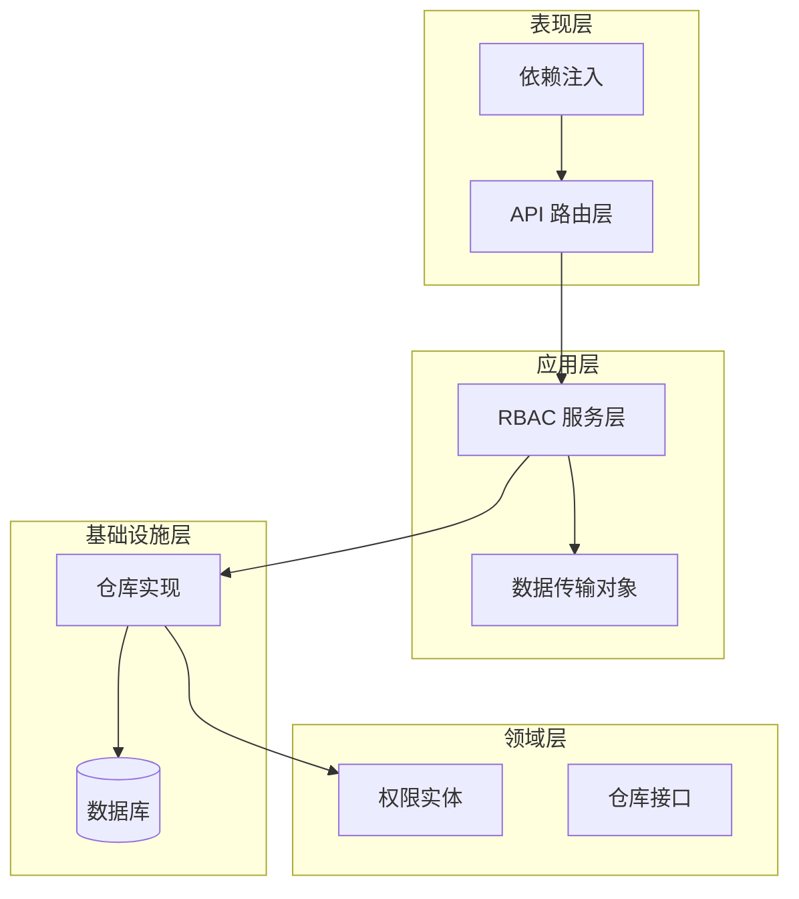
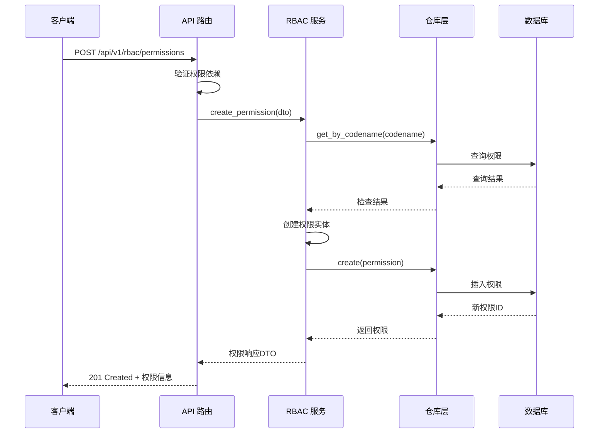
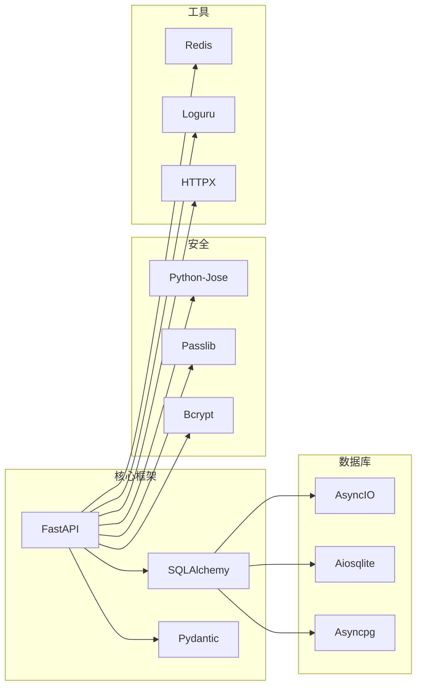
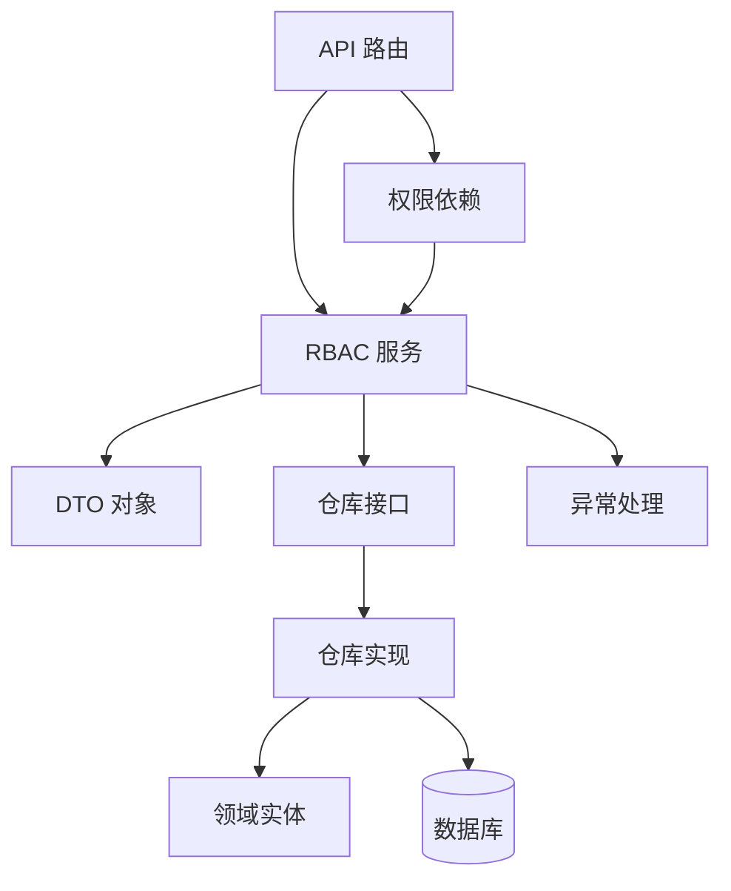

# 权限管理

<cite>
**本文档引用的文件**
- [src/domain/rbac/entities.py](file://src/domain/rbac/entities.py)
- [src/application/dto/rbac_dto.py](file://src/application/dto/rbac_dto.py)
- [src/application/services/rbac_service.py](file://src/application/services/rbac_service.py)
- [src/api/v1/rbac_routes.py](file://src/api/v1/rbac_routes.py)
- [src/infrastructure/repositories/rbac_repository.py](file://src/infrastructure/repositories/rbac_repository.py)
- [src/domain/rbac/repository.py](file://src/domain/rbac/repository.py)
- [src/infrastructure/database/models.py](file://src/infrastructure/database/models.py)
- [src/api/dependencies.py](file://src/api/dependencies.py)
- [src/core/exceptions.py](file://src/core/exceptions.py)
- [src/main.py](file://src/main.py)
- [pyproject.toml](file://pyproject.toml)
</cite>

## 目录
1. [简介](#简介)
2. [项目结构](#项目结构)
3. [核心组件](#核心组件)
4. [架构概览](#架构概览)
5. [详细组件分析](#详细组件分析)
6. [依赖分析](#依赖分析)
7. [性能考虑](#性能考虑)
8. [故障排除指南](#故障排除指南)
9. [结论](#结论)

## 简介

本项目实现了基于角色的访问控制（RBAC）权限管理系统，采用领域驱动设计（DDD）架构模式。该系统提供了完整的权限管理功能，包括权限实体设计、权限操作、权限分配以及权限验证机制。系统支持权限的创建、查询、更新、删除等操作，并通过中间件实现细粒度的权限控制。

## 项目结构

权限管理系统遵循分层架构设计，主要分为以下层次：



**图表来源**
- [src/api/v1/rbac_routes.py:1-168](file://src/api/v1/rbac_routes.py#L1-L168)
- [src/application/services/rbac_service.py:1-158](file://src/application/services/rbac_service.py#L1-L158)
- [src/domain/rbac/entities.py:1-79](file://src/domain/rbac/entities.py#L1-L79)

**章节来源**
- [src/main.py:1-83](file://src/main.py#L1-L83)
- [pyproject.toml:1-74](file://pyproject.toml#L1-L74)

## 核心组件

### 权限实体设计

系统中的权限管理基于三个核心实体：Permission（权限）、Role（角色）和UserRole（用户-角色关联）。

#### 权限实体（Permission）

权限实体是RBAC系统的基础，包含以下关键字段：
- **id**: 唯一标识符（UUID）
- **name**: 权限名称（唯一约束）
- **codename**: 权限代码名（唯一约束）
- **description**: 权限描述
- **resource**: 资源类型
- **action**: 操作类型
- **created_at**: 创建时间戳

#### 角色实体（Role）

角色实体代表用户可以拥有的角色：
- **id**: 唯一标识符（UUID）
- **name**: 角色名称（唯一约束）
- **description**: 角色描述
- **created_at**: 创建时间戳
- **updated_at**: 更新时间戳

#### 用户-角色关联实体（UserRole）

用户与角色之间的多对多关联，支持用户拥有多个角色：
- **id**: 唯一标识符（UUID）
- **user_id**: 用户标识符
- **role_id**: 角色标识符
- **assigned_at**: 分配时间戳

**章节来源**
- [src/domain/rbac/entities.py:20-79](file://src/domain/rbac/entities.py#L20-L79)
- [src/infrastructure/database/models.py:82-122](file://src/infrastructure/database/models.py#L82-L122)

### 权限操作实现

系统提供了完整的权限 CRUD 操作：

#### 创建权限
- 验证权限代码名唯一性
- 支持权限名称、代码名、描述、资源类型和操作类型的设置
- 自动记录创建时间

#### 获取权限列表
- 支持分页查询（skip/limit 参数）
- 默认每页20条记录，最大100条
- 返回权限的基本信息

#### 删除权限
- 删除指定ID的权限
- 自动处理级联删除关系

**章节来源**
- [src/application/services/rbac_service.py:75-99](file://src/application/services/rbac_service.py#L75-L99)
- [src/api/v1/rbac_routes.py:86-118](file://src/api/v1/rbac_routes.py#L86-L118)

## 架构概览

权限管理系统采用经典的分层架构，确保关注点分离和代码的可维护性：



**图表来源**
- [src/api/v1/rbac_routes.py:86-94](file://src/api/v1/rbac_routes.py#L86-L94)
- [src/application/services/rbac_service.py:75-88](file://src/application/services/rbac_service.py#L75-L88)
- [src/infrastructure/repositories/rbac_repository.py:100-104](file://src/infrastructure/repositories/rbac_repository.py#L100-L104)

## 详细组件分析

### 数据传输对象（DTO）设计

#### 权限创建DTO（PermissionCreateDTO）

权限创建DTO定义了权限创建时所需的输入字段和验证规则：
- **name**: 必填，长度2-100字符
- **codename**: 必填，长度2-100字符（唯一性约束）
- **description**: 可选，最大255字符
- **resource**: 必填，最大100字符
- **action**: 必填，最大50字符

#### 权限响应DTO（PermissionResponseDTO）

权限响应DTO定义了权限查询时的输出格式：
- **id**: 权限标识符
- **name**: 权限名称
- **codename**: 权限代码名
- **description**: 权限描述
- **resource**: 资源类型
- **action**: 操作类型
- **created_at**: 创建时间

#### 角色创建DTO（RoleCreateDTO）

角色创建DTO定义了角色创建时的输入字段：
- **name**: 必填，长度2-50字符
- **description**: 可选，最大255字符

#### 角色响应DTO（RoleResponseDTO）

角色响应DTO定义了角色查询时的输出格式：
- **id**: 角色标识符
- **name**: 角色名称
- **description**: 角色描述
- **permissions**: 权限列表（codename数组）
- **created_at**: 创建时间

**章节来源**
- [src/application/dto/rbac_dto.py:34-56](file://src/application/dto/rbac_dto.py#L34-L56)

### 业务逻辑实现

#### 权限唯一性约束

系统通过多种方式确保权限的唯一性：
- 数据库层面：codename 字段设置唯一索引
- 应用层面：创建前检查重复的 codename
- 服务层：统一的业务验证逻辑

#### 权限分类管理

权限通过 `resource` 和 `action` 字段实现分类管理：
- **resource**: 资源类型（如用户、角色、权限等）
- **action**: 具体操作（如创建、读取、更新、删除）

这种设计支持灵活的权限组合和细粒度的访问控制。

#### 权限层级结构

系统支持多层级的权限结构：
- 角色继承权限
- 用户通过角色间接获得权限
- 支持权限的组合和继承

**章节来源**
- [src/domain/rbac/entities.py:20-38](file://src/domain/rbac/entities.py#L20-L38)
- [src/application/services/rbac_service.py:124-132](file://src/application/services/rbac_service.py#L124-L132)

### API 接口文档

#### 权限管理接口

| 方法 | URL | 权限要求 | 功能描述 |
|------|-----|----------|----------|
| POST | `/api/v1/rbac/permissions` | `permission.manage` | 创建新权限 |
| GET | `/api/v1/rbac/permissions` | `permission.view` | 获取权限列表 |
| DELETE | `/api/v1/rbac/permissions/{permission_id}` | `permission.manage` | 删除权限 |

**请求参数**（创建权限）
- **name**: 字符串，必填，2-100字符
- **codename**: 字符串，必填，2-100字符
- **description**: 字符串，可选，最大255字符
- **resource**: 字符串，必填，最大100字符
- **action**: 字符串，必填，最大50字符

**响应格式**
```json
{
  "id": "字符串",
  "name": "字符串",
  "codename": "字符串",
  "description": "字符串或null",
  "resource": "字符串",
  "action": "字符串",
  "created_at": "ISO8601时间戳"
}
```

#### 角色管理接口

| 方法 | URL | 权限要求 | 功能描述 |
|------|-----|----------|----------|
| POST | `/api/v1/rbac/roles` | `role.manage` | 创建新角色 |
| GET | `/api/v1/rbac/roles` | `role.view` | 获取角色列表 |
| GET | `/api/v1/rbac/roles/{role_id}` | `role.view` | 获取单个角色 |
| PUT | `/api/v1/rbac/roles/{role_id}` | `role.manage` | 更新角色 |
| DELETE | `/api/v1/rbac/roles/{role_id}` | `role.manage` | 删除角色 |

**请求参数**（创建角色）
- **name**: 字符串，必填，2-50字符
- **description**: 字符串，可选，最大255字符

**响应格式**
```json
{
  "id": "字符串",
  "name": "字符串",
  "description": "字符串或null",
  "permissions": ["字符串数组"],
  "created_at": "ISO8601时间戳"
}
```

#### 权限分配接口

| 方法 | URL | 权限要求 | 功能描述 |
|------|-----|----------|----------|
| POST | `/api/v1/rbac/assign-role` | `role.manage` | 为用户分配角色 |
| POST | `/api/v1/rbac/remove-role` | `role.manage` | 移除用户的角色 |
| GET | `/api/v1/rbac/users/{user_id}/roles` | `role.view` | 获取用户角色列表 |
| GET | `/api/v1/rbac/users/{user_id}/permissions` | `permission.view` | 获取用户权限列表 |

**请求参数**（分配角色）
- **user_id**: 字符串，必填
- **role_id**: 字符串，必填

**章节来源**
- [src/api/v1/rbac_routes.py:25-167](file://src/api/v1/rbac_routes.py#L25-L167)

### 设计模式应用

#### 仓储模式（Repository Pattern）

系统采用仓储模式实现数据访问的抽象化：
- **接口定义**: 在领域层定义抽象接口
- **实现分离**: 在基础设施层提供具体实现
- **依赖注入**: 通过构造函数注入仓储实例

#### 服务层模式（Service Layer Pattern）

应用服务层负责协调业务逻辑：
- **事务管理**: 统一的业务事务处理
- **业务规则**: 集中处理业务验证和规则
- **异常处理**: 标准化的异常处理机制

#### 数据传输对象模式（DTO Pattern）

通过DTO实现数据的封装和验证：
- **输入验证**: 请求参数的严格验证
- **输出格式**: 统一的响应数据格式
- **数据映射**: 实体与传输对象的转换

**章节来源**
- [src/domain/rbac/repository.py:8-61](file://src/domain/rbac/repository.py#L8-L61)
- [src/infrastructure/repositories/rbac_repository.py:11-132](file://src/infrastructure/repositories/rbac_repository.py#L11-L132)

## 依赖分析

### 外部依赖

系统依赖以下关键外部库：



**图表来源**
- [pyproject.toml:7-26](file://pyproject.toml#L7-L26)

### 内部组件依赖



**图表来源**
- [src/api/v1/rbac_routes.py:1-168](file://src/api/v1/rbac_routes.py#L1-L168)
- [src/application/services/rbac_service.py:1-158](file://src/application/services/rbac_service.py#L1-L158)
- [src/infrastructure/repositories/rbac_repository.py:1-133](file://src/infrastructure/repositories/rbac_repository.py#L1-L133)

**章节来源**
- [src/api/dependencies.py:53-68](file://src/api/dependencies.py#L53-L68)
- [src/core/exceptions.py:1-53](file://src/core/exceptions.py#L1-L53)

## 性能考虑

### 数据库优化

- **索引策略**: 为常用查询字段建立索引（name、codename、user_id等）
- **批量查询**: 使用 selectinload 进行 N+1 查询优化
- **分页机制**: 默认限制每页查询数量，防止内存溢出

### 缓存策略

- **Redis 缓存**: 可用于缓存权限检查结果
- **会话缓存**: 减少重复的数据库查询
- **配置缓存**: 缓存权限配置信息

### 异步处理

- **异步数据库**: 使用 SQLAlchemy AsyncIO 提升并发性能
- **非阻塞 I/O**: 所有数据库操作都是异步的
- **连接池**: 合理配置数据库连接池大小

## 故障排除指南

### 常见错误类型

#### 认证相关错误
- **401 未授权**: 无效或过期的访问令牌
- **403 权限不足**: 当前用户没有执行操作所需的权限
- **404 资源不存在**: 请求的权限、角色或用户不存在

#### 数据验证错误
- **422 参数验证失败**: DTO 字段验证不通过
- **409 资源冲突**: 重复的权限代码名或角色名称

#### 服务器错误
- **500 内部服务器错误**: 未处理的异常情况

### 调试建议

1. **启用日志**: 使用 Loguru 记录详细的请求和错误信息
2. **检查令牌**: 确认 JWT 令牌的有效性和权限范围
3. **验证数据**: 确保请求参数符合 DTO 验证规则
4. **数据库连接**: 检查数据库连接状态和查询性能

**章节来源**
- [src/core/exceptions.py:13-52](file://src/core/exceptions.py#L13-L52)
- [src/api/dependencies.py:56-67](file://src/api/dependencies.py#L56-L67)

## 结论

本权限管理系统采用了成熟的 DDD 架构模式，通过清晰的分层设计实现了高内聚、低耦合的权限管理功能。系统具备以下特点：

### 技术优势
- **架构清晰**: 分层设计确保了代码的可维护性和可扩展性
- **安全性强**: 通过中间件实现细粒度的权限控制
- **性能优秀**: 异步数据库操作和合理的缓存策略
- **易于扩展**: 模块化设计支持功能的增量开发

### 功能完整性
- **完整的 CRUD 操作**: 支持权限和角色的全生命周期管理
- **灵活的权限模型**: 支持多层级的权限继承和组合
- **标准化的 API**: 清晰的接口规范和一致的响应格式
- **完善的错误处理**: 标准化的异常处理机制

### 最佳实践
- **依赖注入**: 通过构造函数注入依赖，便于测试和维护
- **DTO 模式**: 输入输出数据的严格验证和格式化
- **仓储模式**: 数据访问的抽象化和实现分离
- **异常处理**: 统一的错误处理和用户友好的错误信息

该系统为构建企业级权限管理提供了坚实的技术基础，可以根据具体需求进行功能扩展和定制化开发。