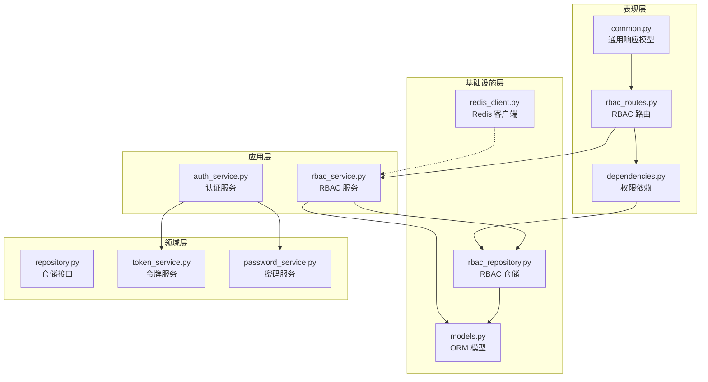
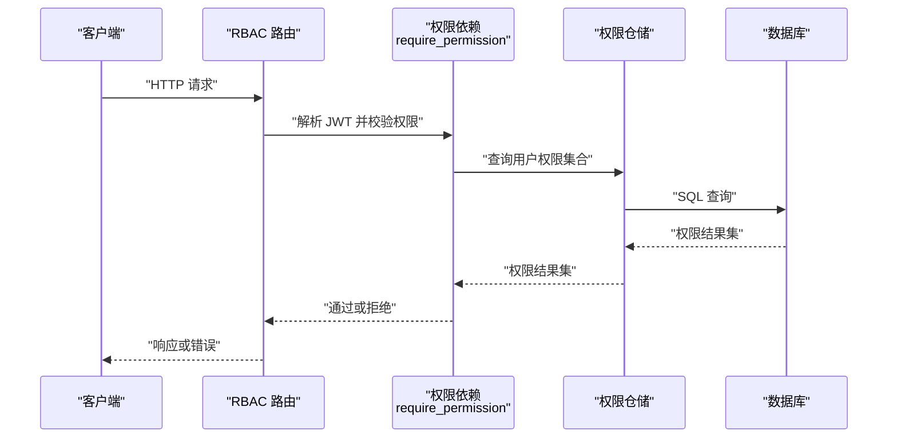
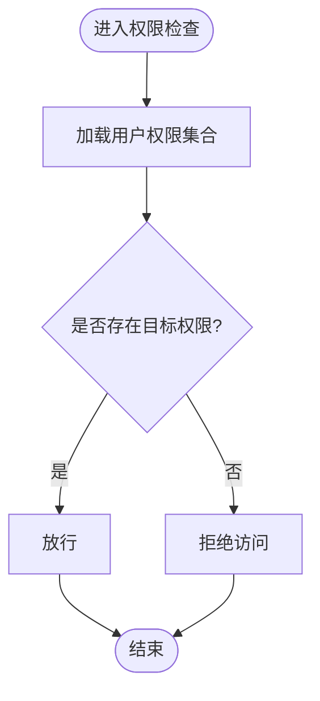
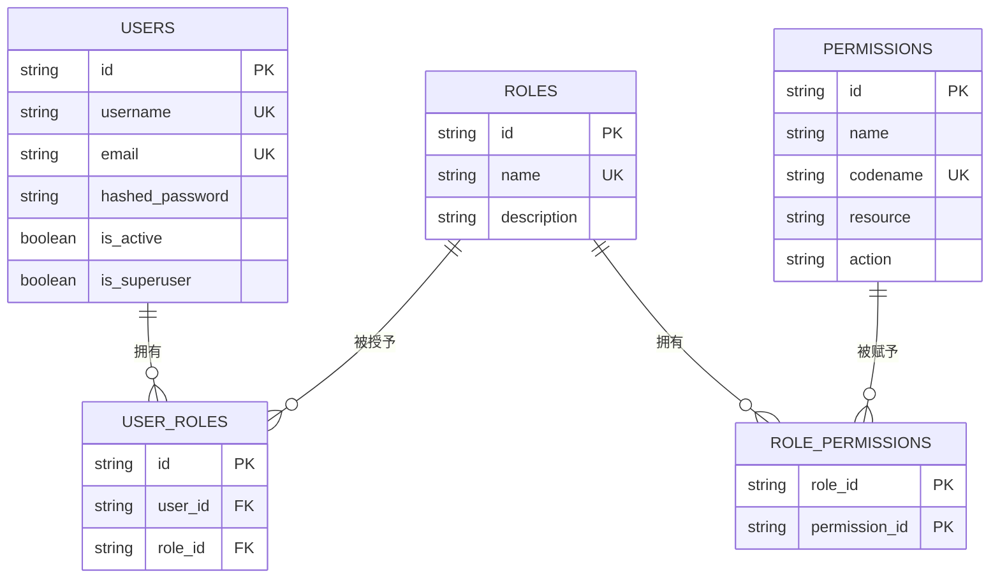
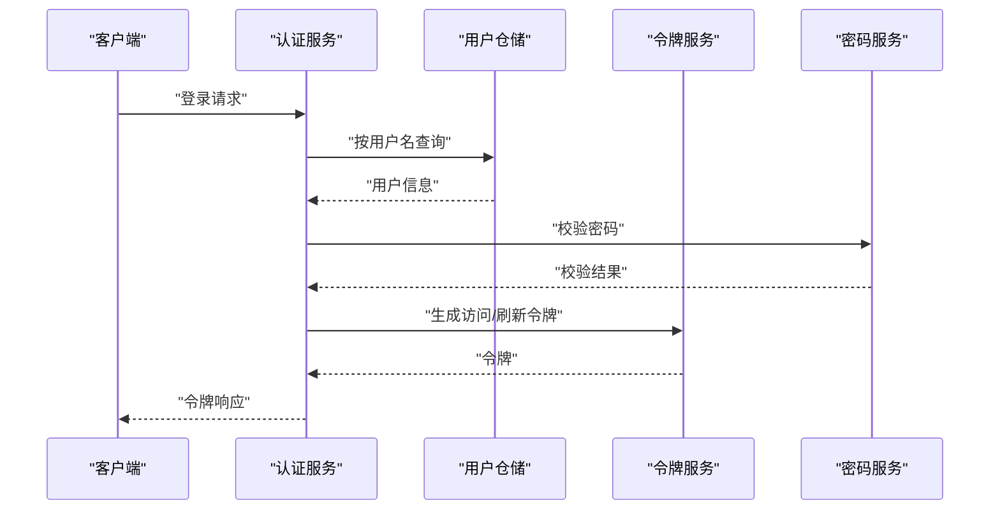
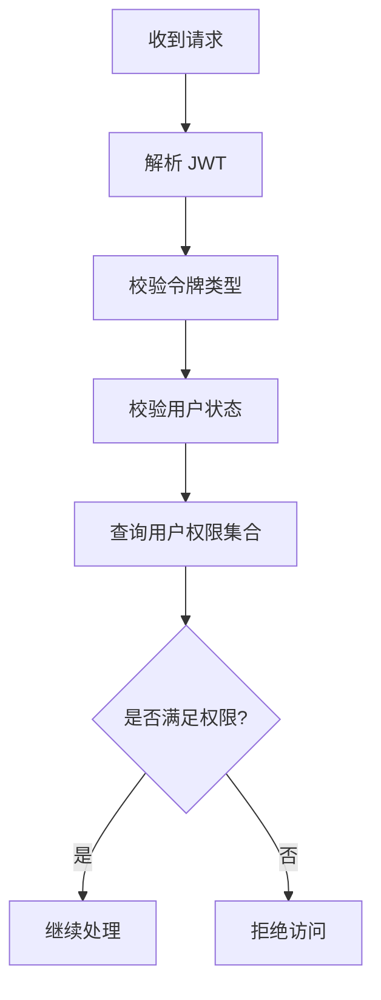
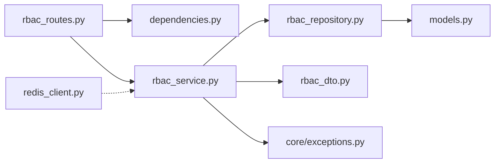

# 用户授权

<cite>
**本文引用的文件**
- [src/api/v1/rbac_routes.py](file://src/api/v1/rbac_routes.py)
- [src/application/dto/rbac_dto.py](file://src/application/dto/rbac_dto.py)
- [src/application/services/rbac_service.py](file://src/application/services/rbac_service.py)
- [src/infrastructure/repositories/rbac_repository.py](file://src/infrastructure/repositories/rbac_repository.py)
- [src/domain/rbac/repository.py](file://src/domain/rbac/repository.py)
- [src/infrastructure/database/models.py](file://src/infrastructure/database/models.py)
- [src/api/dependencies.py](file://src/api/dependencies.py)
- [src/application/services/auth_service.py](file://src/application/services/auth_service.py)
- [src/domain/auth/token_service.py](file://src/domain/auth/token_service.py)
- [src/domain/auth/password_service.py](file://src/domain/auth/password_service.py)
- [src/infrastructure/cache/redis_client.py](file://src/infrastructure/cache/redis_client.py)
- [src/api/common.py](file://src/api/common.py)
- [src/core/middlewares.py](file://src/core/middlewares.py)
</cite>

## 目录
1. [简介](#简介)
2. [项目结构](#项目结构)
3. [核心组件](#核心组件)
4. [架构总览](#架构总览)
5. [详细组件分析](#详细组件分析)
6. [依赖分析](#依赖分析)
7. [性能考量](#性能考量)
8. [故障排查指南](#故障排查指南)
9. [结论](#结论)
10. [附录](#附录)

## 简介
本文件围绕用户授权功能展开，系统性阐述基于角色的访问控制（RBAC）机制，包括角色与权限的建模、角色分配与权限继承、权限验证的实现逻辑与动态检查机制。文档覆盖以下内容：
- 用户授权的核心机制：角色分配、权限继承、权限验证
- RBAC 相关 API 接口：创建/查询/更新/删除角色；创建/查询/删除权限；为用户分配/移除角色；获取用户角色与权限列表
- 授权 DTO 设计：角色与权限的创建、更新、响应 DTO 字段与校验规则
- 权限验证的动态机制：权限检查算法、权限组合规则、权限缓存策略
- 业务流程图与权限验证流程图
- 安全考虑：权限绕过防护、权限缓存同步、权限审计日志
- 最佳实践与性能优化建议

## 项目结构
该授权子系统采用分层架构组织，主要分为：
- 表现层（API 路由）：定义 RBAC 与认证相关的 HTTP 接口，使用依赖注入完成权限校验
- 应用层（服务）：封装业务逻辑，协调仓储与 DTO
- 基础设施层（仓储与模型）：基于 SQLAlchemy 的 ORM 映射与查询
- 领域层（服务与接口）：定义令牌与密码处理、仓储接口契约
- 中间件与公共组件：统一响应模型、请求日志与 IP 过滤

图表来源
- [src/api/v1/rbac_routes.py:1-168](file://src/api/v1/rbac_routes.py#L1-L168)
- [src/api/dependencies.py:1-83](file://src/api/dependencies.py#L1-L83)
- [src/application/services/rbac_service.py:1-158](file://src/application/services/rbac_service.py#L1-L158)
- [src/infrastructure/repositories/rbac_repository.py:1-133](file://src/infrastructure/repositories/rbac_repository.py#L1-L133)
- [src/infrastructure/database/models.py:1-142](file://src/infrastructure/database/models.py#L1-L142)
- [src/application/services/auth_service.py:1-66](file://src/application/services/auth_service.py#L1-L66)
- [src/domain/auth/token_service.py:1-41](file://src/domain/auth/token_service.py#L1-L41)
- [src/domain/auth/password_service.py:1-24](file://src/domain/auth/password_service.py#L1-L24)
- [src/infrastructure/cache/redis_client.py:1-27](file://src/infrastructure/cache/redis_client.py#L1-L27)
- [src/api/common.py:1-23](file://src/api/common.py#L1-L23)

章节来源
- [src/api/v1/rbac_routes.py:1-168](file://src/api/v1/rbac_routes.py#L1-L168)
- [src/application/services/rbac_service.py:1-158](file://src/application/services/rbac_service.py#L1-L158)
- [src/infrastructure/repositories/rbac_repository.py:1-133](file://src/infrastructure/repositories/rbac_repository.py#L1-L133)
- [src/infrastructure/database/models.py:1-142](file://src/infrastructure/database/models.py#L1-L142)
- [src/api/dependencies.py:1-83](file://src/api/dependencies.py#L1-L83)
- [src/application/services/auth_service.py:1-66](file://src/application/services/auth_service.py#L1-L66)
- [src/domain/auth/token_service.py:1-41](file://src/domain/auth/token_service.py#L1-L41)
- [src/domain/auth/password_service.py:1-24](file://src/domain/auth/password_service.py#L1-L24)
- [src/infrastructure/cache/redis_client.py:1-27](file://src/infrastructure/cache/redis_client.py#L1-L27)
- [src/api/common.py:1-23](file://src/api/common.py#L1-L23)

## 核心组件
- RBAC 路由与权限依赖
  - RBAC 路由集中于表现层，提供角色、权限与用户角色/权限查询接口，并通过依赖注入强制执行权限校验
  - 权限依赖 require_permission 会先解析 JWT 提取用户信息，再查询用户权限集合，若不满足则拒绝访问
- RBAC 服务
  - 封装角色 CRUD、权限 CRUD、角色与用户的分配/移除、用户角色与权限查询、权限检查
  - 权限检查采用“用户权限集合”线性匹配，复杂度 O(n)
- RBAC 仓储
  - 基于 SQLAlchemy 实现角色与权限的持久化，支持用户角色与权限的关联查询
  - 使用 selectinload 预加载角色权限，减少 N+1 查询
- 数据模型
  - 用户、角色、权限、用户-角色关联、角色-权限关联表构成完整的 RBAC 模型
- 认证与令牌
  - 登录认证通过用户名与密码校验，生成访问/刷新令牌；刷新令牌时进行类型与有效性校验
- 缓存与中间件
  - 提供 Redis 客户端以支持权限缓存；中间件负责请求日志与 IP 白黑名单过滤

章节来源
- [src/api/v1/rbac_routes.py:1-168](file://src/api/v1/rbac_routes.py#L1-L168)
- [src/api/dependencies.py:53-69](file://src/api/dependencies.py#L53-L69)
- [src/application/services/rbac_service.py:20-158](file://src/application/services/rbac_service.py#L20-L158)
- [src/infrastructure/repositories/rbac_repository.py:11-133](file://src/infrastructure/repositories/rbac_repository.py#L11-L133)
- [src/infrastructure/database/models.py:29-142](file://src/infrastructure/database/models.py#L29-L142)
- [src/application/services/auth_service.py:20-66](file://src/application/services/auth_service.py#L20-L66)
- [src/domain/auth/token_service.py:12-41](file://src/domain/auth/token_service.py#L12-L41)
- [src/domain/auth/password_service.py:9-24](file://src/domain/auth/password_service.py#L9-L24)
- [src/infrastructure/cache/redis_client.py:9-27](file://src/infrastructure/cache/redis_client.py#L9-L27)
- [src/core/middlewares.py:12-64](file://src/core/middlewares.py#L12-L64)

## 架构总览
下图展示从 HTTP 请求到权限验证与数据访问的整体流程。

图表来源
- [src/api/v1/rbac_routes.py:25-167](file://src/api/v1/rbac_routes.py#L25-L167)
- [src/api/dependencies.py:53-69](file://src/api/dependencies.py#L53-L69)
- [src/infrastructure/repositories/rbac_repository.py:123-132](file://src/infrastructure/repositories/rbac_repository.py#L123-L132)

## 详细组件分析

### RBAC 路由与 API 接口
- 角色管理
  - 创建角色：POST /rbac/roles（需要 role.manage）
  - 查询角色列表：GET /rbac/roles（需要 role.view）
  - 查询单个角色：GET /rbac/roles/{role_id}（需要 role.view）
  - 更新角色：PUT /rbac/roles/{role_id}（需要 role.manage）
  - 删除角色：DELETE /rbac/roles/{role_id}（需要 role.manage）
- 权限管理
  - 创建权限：POST /rbac/permissions（需要 permission.manage）
  - 查询权限列表：GET /rbac/permissions（需要 permission.view）
  - 删除权限：DELETE /rbac/permissions/{permission_id}（需要 permission.manage）
- 用户角色与权限
  - 分配角色给用户：POST /rbac/assign-role（需要 role.manage）
  - 移除用户角色：POST /rbac/remove-role（需要 role.manage）
  - 获取用户角色列表：GET /rbac/users/{user_id}/roles（需要 role.view）
  - 获取用户权限列表：GET /rbac/users/{user_id}/permissions（需要 permission.view）

章节来源
- [src/api/v1/rbac_routes.py:25-167](file://src/api/v1/rbac_routes.py#L25-L167)

### 授权 DTO 对象设计
- 角色相关
  - 角色创建 DTO：name（必填，长度限制）、description（可选，长度限制）
  - 角色更新 DTO：name/description（可选，长度限制）
  - 角色响应 DTO：id、name、description、permissions（codename 列表）、created_at
- 权限相关
  - 权限创建 DTO：name、codename（唯一，必填，长度限制）、description（可选）、resource、action（长度限制）
  - 权限响应 DTO：id、name、codename、description、resource、action、created_at
- 分配相关
  - 角色分配 DTO：user_id、role_id
  - 角色-权限分配 DTO：role_id、permission_id

章节来源
- [src/application/dto/rbac_dto.py:8-70](file://src/application/dto/rbac_dto.py#L8-L70)

### 权限验证的动态机制
- 动态检查算法
  - 当前实现：通过用户 ID 查询其权限集合，线性匹配目标权限 codename
  - 复杂度：O(n)，n 为用户权限数量
- 权限组合规则
  - 用户权限来源于其角色集合，角色权限通过多对多关系继承
- 权限缓存策略
  - 可利用 Redis 缓存用户权限集合，键可采用 user:{id}:perms，设置 TTL 与失效策略
  - 在角色/权限变更时主动清理或更新缓存，确保一致性

图表来源
- [src/application/services/rbac_service.py:129-132](file://src/application/services/rbac_service.py#L129-L132)
- [src/infrastructure/repositories/rbac_repository.py:123-132](file://src/infrastructure/repositories/rbac_repository.py#L123-L132)

章节来源
- [src/application/services/rbac_service.py:129-132](file://src/application/services/rbac_service.py#L129-L132)
- [src/infrastructure/repositories/rbac_repository.py:123-132](file://src/infrastructure/repositories/rbac_repository.py#L123-L132)
- [src/infrastructure/cache/redis_client.py:9-27](file://src/infrastructure/cache/redis_client.py#L9-L27)

### 数据模型与关系

图表来源
- [src/infrastructure/database/models.py:29-142](file://src/infrastructure/database/models.py#L29-L142)

章节来源
- [src/infrastructure/database/models.py:29-142](file://src/infrastructure/database/models.py#L29-L142)

### 认证与令牌服务
- 登录流程
  - 根据用户名查询用户，校验密码与账户状态，生成访问/刷新令牌
- 令牌刷新
  - 解码并校验刷新令牌类型，重新签发新的访问/刷新令牌
- 安全要点
  - 使用强哈希算法存储密码
  - 区分访问令牌与刷新令牌类型，严格校验

图表来源
- [src/application/services/auth_service.py:20-66](file://src/application/services/auth_service.py#L20-L66)
- [src/domain/auth/token_service.py:12-41](file://src/domain/auth/token_service.py#L12-L41)
- [src/domain/auth/password_service.py:9-24](file://src/domain/auth/password_service.py#L9-L24)

章节来源
- [src/application/services/auth_service.py:20-66](file://src/application/services/auth_service.py#L20-L66)
- [src/domain/auth/token_service.py:12-41](file://src/domain/auth/token_service.py#L12-L41)
- [src/domain/auth/password_service.py:9-24](file://src/domain/auth/password_service.py#L9-L24)

### 权限依赖与中间件
- require_permission 依赖
  - 解析 JWT、校验令牌类型、获取用户信息后，查询用户权限集合，匹配目标 codename
- 中间件
  - 请求日志中间件：记录请求与响应信息，便于审计
  - IP 过滤中间件：支持白名单/黑名单，增强入口安全

图表来源
- [src/api/dependencies.py:16-51](file://src/api/dependencies.py#L16-L51)
- [src/api/dependencies.py:53-69](file://src/api/dependencies.py#L53-L69)
- [src/core/middlewares.py:12-64](file://src/core/middlewares.py#L12-L64)

章节来源
- [src/api/dependencies.py:16-51](file://src/api/dependencies.py#L16-L51)
- [src/api/dependencies.py:53-69](file://src/api/dependencies.py#L53-L69)
- [src/core/middlewares.py:12-64](file://src/core/middlewares.py#L12-L64)

## 依赖分析
- 组件耦合
  - 路由依赖权限依赖与 RBAC 服务；RBAC 服务依赖仓储与模型；仓储依赖 ORM 模型
- 外部依赖
  - SQLAlchemy（异步 ORM）
  - Redis（缓存）
  - Pydantic（DTO 校验）
  - python-jose（JWT）
  - bcrypt（密码哈希）

图表来源
- [src/api/v1/rbac_routes.py:1-168](file://src/api/v1/rbac_routes.py#L1-L168)
- [src/api/dependencies.py:1-83](file://src/api/dependencies.py#L1-L83)
- [src/application/services/rbac_service.py:1-158](file://src/application/services/rbac_service.py#L1-L158)
- [src/infrastructure/repositories/rbac_repository.py:1-133](file://src/infrastructure/repositories/rbac_repository.py#L1-L133)
- [src/infrastructure/database/models.py:1-142](file://src/infrastructure/database/models.py#L1-L142)
- [src/application/dto/rbac_dto.py:1-70](file://src/application/dto/rbac_dto.py#L1-L70)
- [src/infrastructure/cache/redis_client.py:1-27](file://src/infrastructure/cache/redis_client.py#L1-L27)

章节来源
- [src/api/v1/rbac_routes.py:1-168](file://src/api/v1/rbac_routes.py#L1-L168)
- [src/api/dependencies.py:1-83](file://src/api/dependencies.py#L1-L83)
- [src/application/services/rbac_service.py:1-158](file://src/application/services/rbac_service.py#L1-L158)
- [src/infrastructure/repositories/rbac_repository.py:1-133](file://src/infrastructure/repositories/rbac_repository.py#L1-L133)
- [src/infrastructure/database/models.py:1-142](file://src/infrastructure/database/models.py#L1-L142)
- [src/application/dto/rbac_dto.py:1-70](file://src/application/dto/rbac_dto.py#L1-L70)
- [src/infrastructure/cache/redis_client.py:1-27](file://src/infrastructure/cache/redis_client.py#L1-L27)

## 性能考量
- 查询优化
  - 使用 selectinload 预加载角色权限，避免 N+1 查询
  - 对角色与权限表建立索引（名称、编码、主键）
- 权限检查
  - 当前实现为线性匹配，建议在用户权限集合上建立缓存，降低数据库压力
  - 对高频权限检查可引入布隆过滤器快速判定不存在的情况
- 缓存策略
  - 键命名规范：user:{id}:perms，TTL 与失效策略需与业务一致
  - 写扩散：角色/权限变更时同步清理或更新缓存
- 异步与并发
  - 使用异步 ORM 与连接池，提升高并发下的吞吐量
- 日志与监控
  - 结合请求日志中间件与指标埋点，定位慢查询与异常

## 故障排查指南
- 常见错误与定位
  - 未授权/权限不足：检查 JWT 是否有效、令牌类型是否正确、用户是否激活、是否具备所需 codename
  - 资源不存在：确认角色/权限 ID 是否存在，用户是否已被分配角色
  - 冲突错误：角色名重复、权限 codename 重复、用户已拥有某角色
- 审计与追踪
  - 启用请求日志中间件，记录请求路径、状态码与耗时
  - 对敏感操作（角色/权限 CRUD、用户角色分配）增加审计日志
- 缓存一致性
  - 发生角色/权限变更后，及时清理对应用户权限缓存键
- 安全加固
  - 使用 IP 白名单/黑名单中间件限制访问来源
  - 严格校验令牌类型与有效期，防止令牌滥用

章节来源
- [src/api/dependencies.py:16-51](file://src/api/dependencies.py#L16-L51)
- [src/api/dependencies.py:53-69](file://src/api/dependencies.py#L53-L69)
- [src/core/middlewares.py:12-64](file://src/core/middlewares.py#L12-L64)
- [src/api/common.py:6-23](file://src/api/common.py#L6-L23)

## 结论
本授权体系以清晰的分层架构实现了 RBAC 的核心能力：角色与权限的建模、角色分配与继承、动态权限验证。通过依赖注入与中间件，系统在入口处提供了统一的安全控制。建议在现有基础上引入权限缓存与更细粒度的审计日志，持续优化权限检查性能与安全性。

## 附录
- API 接口一览（摘要）
  - 角色：POST /rbac/roles、GET /rbac/roles、GET /rbac/roles/{id}、PUT /rbac/roles/{id}、DELETE /rbac/roles/{id}
  - 权限：POST /rbac/permissions、GET /rbac/permissions、DELETE /rbac/permissions/{id}
  - 分配：POST /rbac/assign-role、POST /rbac/remove-role、GET /rbac/users/{user_id}/roles、GET /rbac/users/{user_id}/permissions
- DTO 字段与校验要点
  - 角色：name 长度限制、description 长度限制
  - 权限：name/codename/resource/action 长度限制且 codename 唯一
  - 分配：user_id、role_id 必填
- 安全最佳实践
  - 令牌类型严格区分与校验
  - 密码使用强哈希存储
  - 权限绕过防护：入口统一校验、超级用户豁免需谨慎
  - 权限缓存同步：写扩散策略、TTL 与失效
  - 审计日志：记录关键操作与失败事件