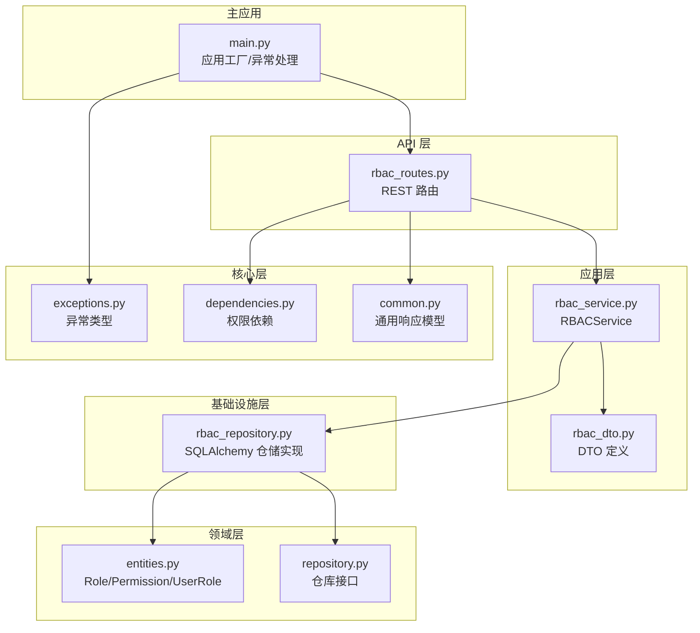
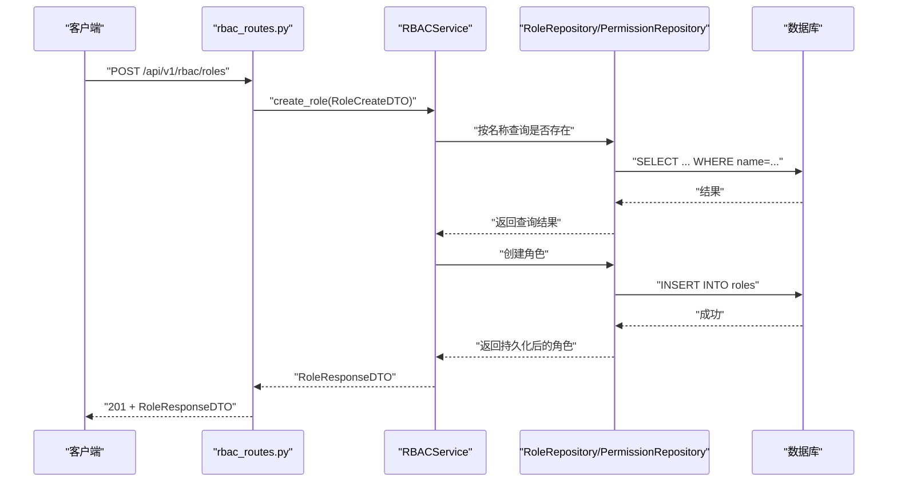
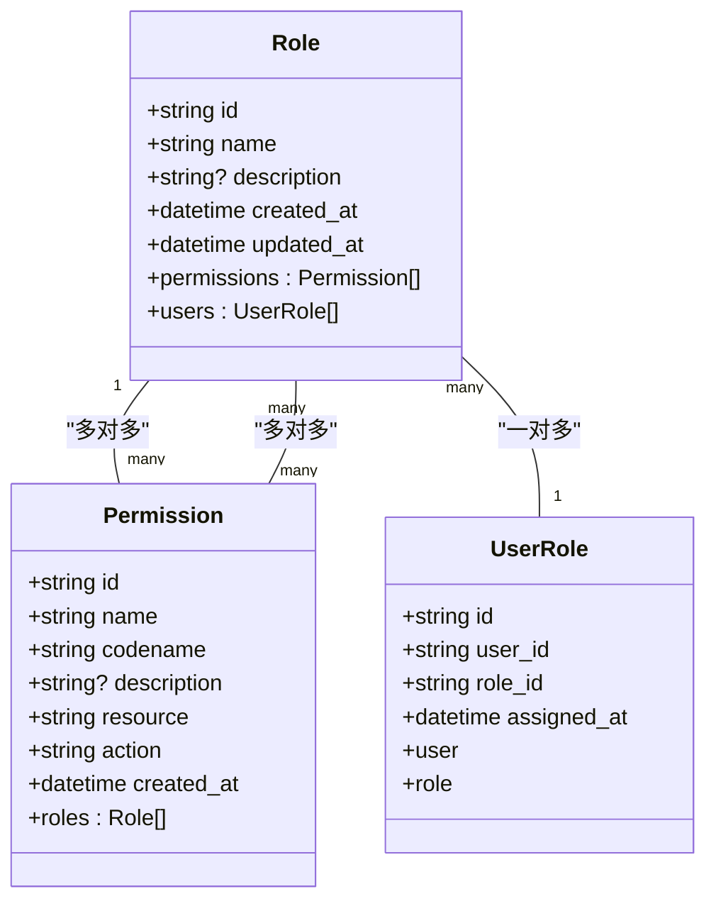
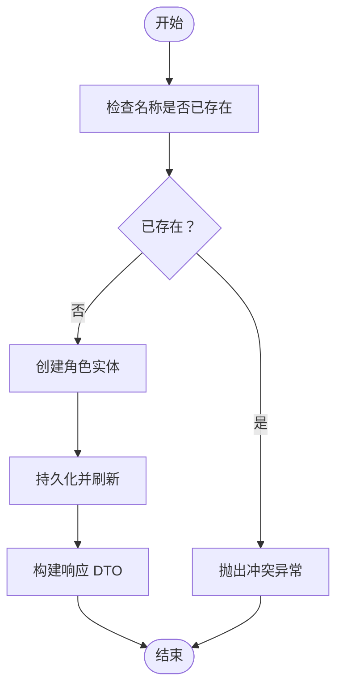
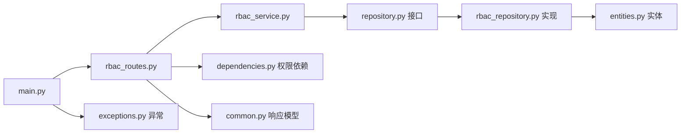

# 角色管理

<cite>
**本文引用的文件**
- [src/domain/rbac/entities.py](file://src/domain/rbac/entities.py)
- [src/application/dto/rbac_dto.py](file://src/application/dto/rbac_dto.py)
- [src/application/services/rbac_service.py](file://src/application/services/rbac_service.py)
- [src/infrastructure/repositories/rbac_repository.py](file://src/infrastructure/repositories/rbac_repository.py)
- [src/api/v1/rbac_routes.py](file://src/api/v1/rbac_routes.py)
- [src/domain/rbac/repository.py](file://src/domain/rbac/repository.py)
- [src/api/common.py](file://src/api/common.py)
- [src/api/dependencies.py](file://src/api/dependencies.py)
- [src/core/exceptions.py](file://src/core/exceptions.py)
- [src/main.py](file://src/main.py)
- [pyproject.toml](file://pyproject.toml)
</cite>

## 目录
1. [简介](#简介)
2. [项目结构](#项目结构)
3. [核心组件](#核心组件)
4. [架构总览](#架构总览)
5. [详细组件分析](#详细组件分析)
6. [依赖分析](#依赖分析)
7. [性能考虑](#性能考虑)
8. [故障排除指南](#故障排除指南)
9. [结论](#结论)
10. [附录](#附录)

## 简介
本文件系统化阐述角色管理功能的设计与实现，涵盖角色实体模型、DTO 设计、业务服务、仓储层、API 接口以及最佳实践与常见问题。角色管理基于领域驱动设计（DDD）分层架构，采用 Pydantic DTO 进行输入输出校验，SQLAlchemy 异步 ORM 进行持久化，并通过 FastAPI 路由暴露 REST 接口。系统支持角色的增删改查、权限分配、用户角色分配、权限检查等能力。

## 项目结构
角色管理功能分布在以下层次：
- 领域层：定义角色、权限、用户角色关联等实体及仓库接口
- 应用层：封装业务逻辑，协调仓储与 DTO
- 基础设施层：实现仓储接口，连接数据库
- API 层：定义 REST 路由、权限依赖与响应模型
- 核心层：异常体系与通用工具
- 主应用：注册路由、中间件与异常处理

图表来源
- [src/api/v1/rbac_routes.py:1-168](file://src/api/v1/rbac_routes.py#L1-L168)
- [src/application/services/rbac_service.py:1-158](file://src/application/services/rbac_service.py#L1-L158)
- [src/infrastructure/repositories/rbac_repository.py:1-133](file://src/infrastructure/repositories/rbac_repository.py#L1-L133)
- [src/domain/rbac/entities.py:1-79](file://src/domain/rbac/entities.py#L1-L79)
- [src/domain/rbac/repository.py:1-62](file://src/domain/rbac/repository.py#L1-L62)
- [src/application/dto/rbac_dto.py:1-70](file://src/application/dto/rbac_dto.py#L1-L70)
- [src/api/dependencies.py:1-83](file://src/api/dependencies.py#L1-L83)
- [src/api/common.py:1-23](file://src/api/common.py#L1-L23)
- [src/core/exceptions.py:1-53](file://src/core/exceptions.py#L1-L53)
- [src/main.py:1-83](file://src/main.py#L1-L83)

章节来源
- [src/api/v1/rbac_routes.py:1-168](file://src/api/v1/rbac_routes.py#L1-L168)
- [src/application/services/rbac_service.py:1-158](file://src/application/services/rbac_service.py#L1-L158)
- [src/infrastructure/repositories/rbac_repository.py:1-133](file://src/infrastructure/repositories/rbac_repository.py#L1-L133)
- [src/domain/rbac/entities.py:1-79](file://src/domain/rbac/entities.py#L1-L79)
- [src/domain/rbac/repository.py:1-62](file://src/domain/rbac/repository.py#L1-L62)
- [src/application/dto/rbac_dto.py:1-70](file://src/application/dto/rbac_dto.py#L1-L70)
- [src/api/dependencies.py:1-83](file://src/api/dependencies.py#L1-L83)
- [src/api/common.py:1-23](file://src/api/common.py#L1-L23)
- [src/core/exceptions.py:1-53](file://src/core/exceptions.py#L1-L53)
- [src/main.py:1-83](file://src/main.py#L1-L83)

## 核心组件
- 角色实体：包含标识符、名称、描述、创建时间、更新时间以及与权限的多对多关系、与用户角色的关联关系
- 权限实体：包含标识符、名称、编码、描述、资源、动作、创建时间以及与角色的多对多关系
- 用户角色关联实体：记录用户与角色的分配关系，包含分配时间等元数据
- DTO：角色创建/更新/响应、权限创建/响应、用户角色分配等
- 服务：角色 CRUD、权限 CRUD、用户角色分配与查询、权限检查
- 仓储：角色/权限的查询、创建、更新、删除、用户角色查询与分配
- API 路由：角色/权限/分配相关端点，配合权限依赖进行鉴权

章节来源
- [src/domain/rbac/entities.py:40-79](file://src/domain/rbac/entities.py#L40-L79)
- [src/application/dto/rbac_dto.py:8-70](file://src/application/dto/rbac_dto.py#L8-L70)
- [src/application/services/rbac_service.py:20-158](file://src/application/services/rbac_service.py#L20-L158)
- [src/infrastructure/repositories/rbac_repository.py:11-133](file://src/infrastructure/repositories/rbac_repository.py#L11-L133)

## 架构总览
角色管理遵循 DDD 分层与 Clean Architecture 思想：
- 领域层仅关注业务实体与不变量（如唯一性约束）
- 应用层编排业务流程，负责 DTO 映射与异常转换
- 基础设施层负责数据持久化与外部依赖
- API 层负责请求接入、权限校验与响应序列化

图表来源
- [src/api/v1/rbac_routes.py:25-34](file://src/api/v1/rbac_routes.py#L25-L34)
- [src/application/services/rbac_service.py:29-37](file://src/application/services/rbac_service.py#L29-L37)
- [src/infrastructure/repositories/rbac_repository.py:32-36](file://src/infrastructure/repositories/rbac_repository.py#L32-L36)

## 详细组件分析

### 角色实体与权限实体
- 角色实体
  - 字段：标识符（UUID 字符串）、名称（唯一索引）、描述、创建时间、更新时间
  - 关系：与权限多对多（通过中间表），与用户角色一对多（级联删除）
- 权限实体
  - 字段：标识符（UUID 字符串）、名称（唯一索引）、编码（唯一索引）、描述、资源、动作、创建时间
  - 关系：与角色多对多
- 用户角色关联实体
  - 字段：标识符（UUID 字符串）、用户标识、角色标识、分配时间
  - 关系：与用户、角色双向回溯

图表来源
- [src/domain/rbac/entities.py:40-79](file://src/domain/rbac/entities.py#L40-L79)

章节来源
- [src/domain/rbac/entities.py:20-79](file://src/domain/rbac/entities.py#L20-L79)

### DTO 对象设计与验证规则
- 角色创建 DTO
  - 字段：名称（必填，长度 2-50）、描述（可选，最大长度 255）
- 角色更新 DTO
  - 字段：名称（可选，长度 2-50）、描述（可选，最大长度 255）
- 角色响应 DTO
  - 字段：标识符、名称、描述（可选）、权限编码列表、创建时间；支持 from_attributes
- 权限创建 DTO
  - 字段：名称（必填，长度 2-100）、编码（必填，长度 2-100）、描述（可选，最大长度 255）、资源（必填，最大长度 100）、动作（必填，最大长度 50）
- 权限响应 DTO
  - 字段：标识符、名称、编码、描述（可选）、资源、动作、创建时间；支持 from_attributes
- 用户角色分配 DTO
  - 字段：用户标识、角色标识
- 用户权限分配 DTO
  - 字段：角色标识、权限标识

章节来源
- [src/application/dto/rbac_dto.py:8-70](file://src/application/dto/rbac_dto.py#L8-L70)

### 业务逻辑与约束
- 角色唯一性约束
  - 名称唯一（数据库唯一索引 + 服务层查询）
- 权限唯一性约束
  - 编码唯一（数据库唯一索引 + 服务层查询）
- 角色状态管理
  - 当前模型未显式状态字段；可通过扩展在实体中增加布尔字段并配合服务层状态变更逻辑
- 角色层级关系
  - 当前模型未直接建模层级关系；可通过引入父角色字段或额外映射表实现层级
- 权限检查
  - 通过用户角色关联与角色-权限多对多关系计算用户有效权限集合

章节来源
- [src/domain/rbac/entities.py:46-56](file://src/domain/rbac/entities.py#L46-L56)
- [src/application/services/rbac_service.py:29-132](file://src/application/services/rbac_service.py#L29-L132)
- [src/infrastructure/repositories/rbac_repository.py:114-132](file://src/infrastructure/repositories/rbac_repository.py#L114-L132)

### API 接口文档
- 角色管理
  - POST /api/v1/rbac/roles
    - 权限：role.manage
    - 请求体：RoleCreateDTO
    - 响应：RoleResponseDTO
    - 状态码：201
  - GET /api/v1/rbac/roles
    - 权限：role.view
    - 查询参数：skip（≥0，默认 0）、limit（1-100，默认 20）
    - 响应：RoleResponseDTO 数组
  - GET /api/v1/rbac/roles/{role_id}
    - 权限：role.view
    - 响应：RoleResponseDTO
  - PUT /api/v1/rbac/roles/{role_id}
    - 权限：role.manage
    - 请求体：RoleUpdateDTO
    - 响应：RoleResponseDTO
  - DELETE /api/v1/rbac/roles/{role_id}
    - 权限：role.manage
    - 响应：MessageResponse
- 权限管理
  - POST /api/v1/rbac/permissions
    - 权限：permission.manage
    - 请求体：PermissionCreateDTO
    - 响应：PermissionResponseDTO
    - 状态码：201
  - GET /api/v1/rbac/permissions
    - 权限：permission.view
    - 查询参数：skip、limit
    - 响应：PermissionResponseDTO 数组
  - DELETE /api/v1/rbac/permissions/{permission_id}
    - 权限：permission.manage
    - 响应：MessageResponse
- 用户角色分配
  - POST /api/v1/rbac/assign-role
    - 权限：role.manage
    - 请求体：AssignRoleDTO（user_id, role_id）
    - 响应：MessageResponse
  - POST /api/v1/rbac/remove-role
    - 权限：role.manage
    - 请求体：AssignRoleDTO（user_id, role_id）
    - 响应：MessageResponse
  - GET /api/v1/rbac/users/{user_id}/roles
    - 权限：role.view
    - 响应：RoleResponseDTO 数组
  - GET /api/v1/rbac/users/{user_id}/permissions
    - 权限：permission.view
    - 响应：PermissionResponseDTO 数组

章节来源
- [src/api/v1/rbac_routes.py:25-168](file://src/api/v1/rbac_routes.py#L25-L168)
- [src/api/dependencies.py:53-68](file://src/api/dependencies.py#L53-L68)
- [src/api/common.py:12-15](file://src/api/common.py#L12-L15)

### 数据流与处理逻辑
- 创建角色
  - 输入：RoleCreateDTO
  - 业务：检查名称唯一性，创建实体，刷新并返回响应 DTO
- 更新角色
  - 输入：RoleUpdateDTO（可选字段）
  - 业务：按 ID 获取角色，若更新名称则检查唯一性，合并更新后返回响应 DTO
- 删除角色
  - 输入：role_id
  - 业务：按 ID 删除，不存在时抛出未找到异常
- 用户角色分配
  - 输入：AssignRoleDTO
  - 业务：检查角色存在性与重复分配，插入用户角色关联

图表来源
- [src/application/services/rbac_service.py:29-37](file://src/application/services/rbac_service.py#L29-L37)
- [src/infrastructure/repositories/rbac_repository.py:32-36](file://src/infrastructure/repositories/rbac_repository.py#L32-L36)

## 依赖分析
- 组件耦合
  - API 路由依赖应用服务；应用服务依赖仓储接口；仓储实现依赖领域实体
- 外部依赖
  - FastAPI、SQLAlchemy 异步、Pydantic、HTTP Bearer 认证
- 权限依赖
  - require_permission 依赖 Token 解码、用户状态校验、权限查询

图表来源
- [src/api/v1/rbac_routes.py:1-168](file://src/api/v1/rbac_routes.py#L1-L168)
- [src/application/services/rbac_service.py:1-158](file://src/application/services/rbac_service.py#L1-L158)
- [src/infrastructure/repositories/rbac_repository.py:1-133](file://src/infrastructure/repositories/rbac_repository.py#L1-L133)
- [src/domain/rbac/repository.py:1-62](file://src/domain/rbac/repository.py#L1-L62)
- [src/domain/rbac/entities.py:1-79](file://src/domain/rbac/entities.py#L1-L79)
- [src/api/dependencies.py:1-83](file://src/api/dependencies.py#L1-L83)
- [src/api/common.py:1-23](file://src/api/common.py#L1-L23)
- [src/main.py:1-83](file://src/main.py#L1-L83)

章节来源
- [src/api/v1/rbac_routes.py:1-168](file://src/api/v1/rbac_routes.py#L1-L168)
- [src/application/services/rbac_service.py:1-158](file://src/application/services/rbac_service.py#L1-L158)
- [src/infrastructure/repositories/rbac_repository.py:1-133](file://src/infrastructure/repositories/rbac_repository.py#L1-L133)
- [src/domain/rbac/repository.py:1-62](file://src/domain/rbac/repository.py#L1-L62)
- [src/domain/rbac/entities.py:1-79](file://src/domain/rbac/entities.py#L1-L79)
- [src/api/dependencies.py:1-83](file://src/api/dependencies.py#L1-L83)
- [src/api/common.py:1-23](file://src/api/common.py#L1-L23)
- [src/main.py:1-83](file://src/main.py#L1-L83)

## 性能考虑
- 查询优化
  - 使用 selectinload 预加载角色权限，避免 N+1 查询
  - 在高频查询字段上建立索引（名称、编码、用户角色关联索引）
- 批量操作
  - 批量创建/更新时注意事务边界与 flush 刷新策略
- 缓存策略
  - 可结合缓存中间件缓存热点角色/权限数据，降低数据库压力
- 分页与限制
  - 默认分页限制合理，防止大结果集导致内存压力

章节来源
- [src/infrastructure/repositories/rbac_repository.py:17-30](file://src/infrastructure/repositories/rbac_repository.py#L17-L30)
- [src/infrastructure/repositories/rbac_repository.py:85-98](file://src/infrastructure/repositories/rbac_repository.py#L85-L98)

## 故障排除指南
- 401 未认证
  - 现象：缺少或无效的 Bearer 令牌
  - 处理：确保携带有效的 access token 并符合令牌类型
- 403 权限不足
  - 现象：当前用户不具备所需权限（如 role.manage、permission.view）
  - 处理：确认用户具备目标权限或提升为超级用户
- 404 资源未找到
  - 现象：角色/权限 ID 不存在或用户角色分配不存在
  - 处理：核对 ID 是否正确，确认资源存在
- 409 冲突
  - 现象：角色名称已存在或权限编码已存在、用户角色重复分配
  - 处理：修改名称/编码或移除重复分配
- 500 服务器错误
  - 现象：未捕获异常
  - 处理：查看日志定位具体异常并修复

章节来源
- [src/api/dependencies.py:53-68](file://src/api/dependencies.py#L53-L68)
- [src/core/exceptions.py:13-52](file://src/core/exceptions.py#L13-L52)
- [src/application/services/rbac_service.py:31-71](file://src/application/services/rbac_service.py#L31-L71)
- [src/infrastructure/repositories/rbac_repository.py:52-61](file://src/infrastructure/repositories/rbac_repository.py#L52-L61)

## 结论
角色管理模块以清晰的分层架构实现了完整的 RBAC 能力：实体模型定义了角色与权限的业务不变量，DTO 提供强约束的输入输出，服务层编排业务流程并处理唯一性与权限检查，仓储层提供高效的数据访问，API 层通过权限依赖保障安全。该设计具备良好的可扩展性，便于后续引入角色状态、层级关系与更复杂的权限表达式。

## 附录
- 最佳实践
  - 在实体层面维护唯一性约束（名称/编码），并在服务层进行二次校验
  - 使用 from_attributes 的 DTO 用于序列化领域对象，避免手动映射
  - 对高频查询字段建立索引，使用 selectinload 预加载关联
  - 为关键端点添加权限依赖，避免越权访问
  - 使用分页参数限制结果集大小，防止性能问题
- 常见问题
  - 重复创建相同名称的角色：服务层会抛出冲突异常
  - 更新角色名称导致冲突：服务层会检查并拒绝
  - 删除不存在的角色：服务层会抛出未找到异常
  - 为用户重复分配角色：仓储层会拒绝重复分配