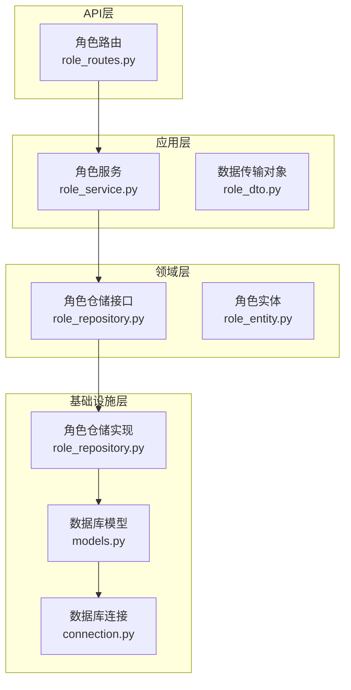
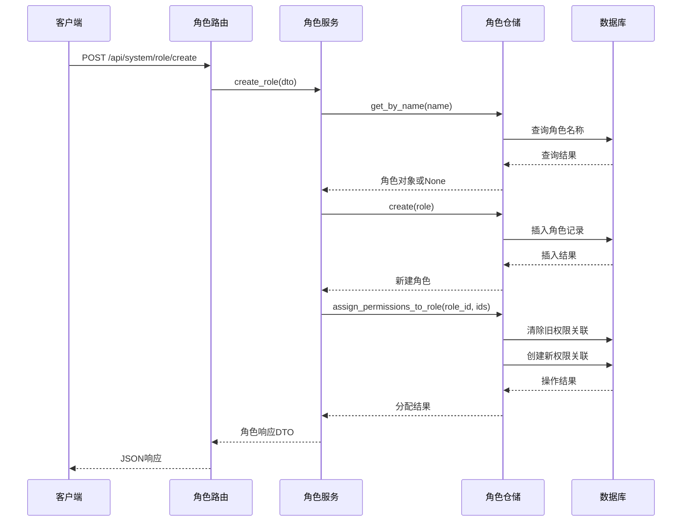
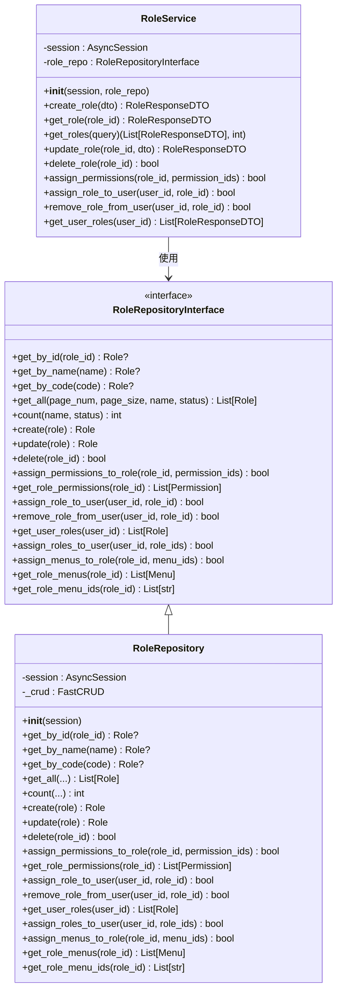
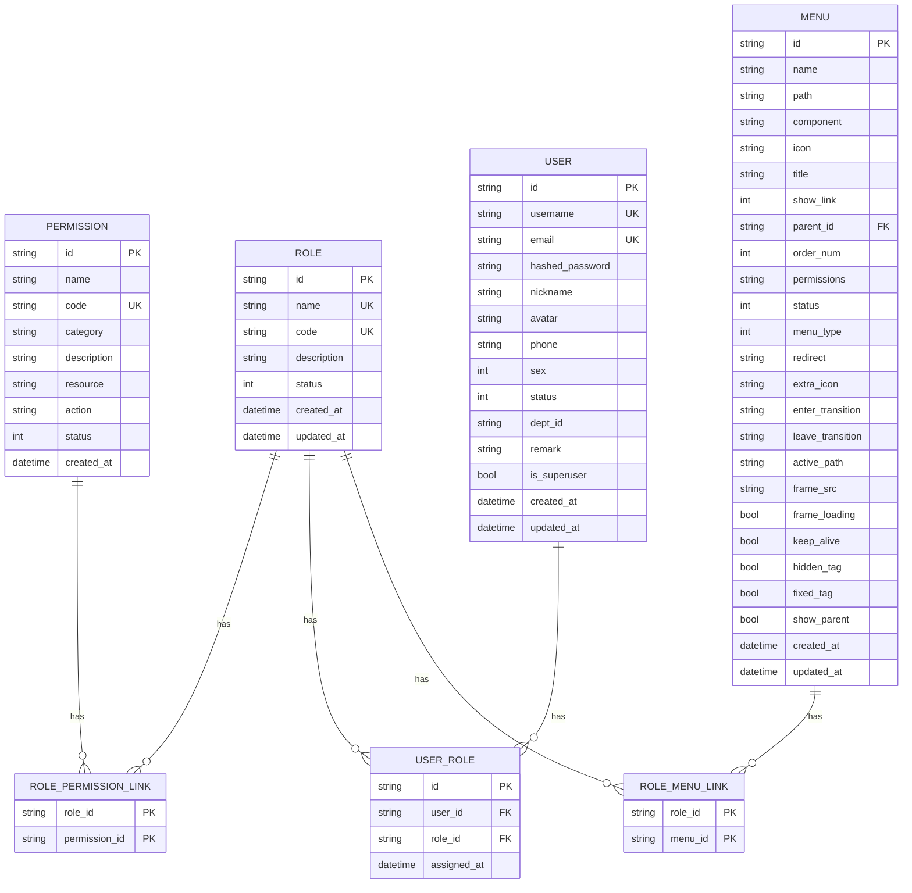
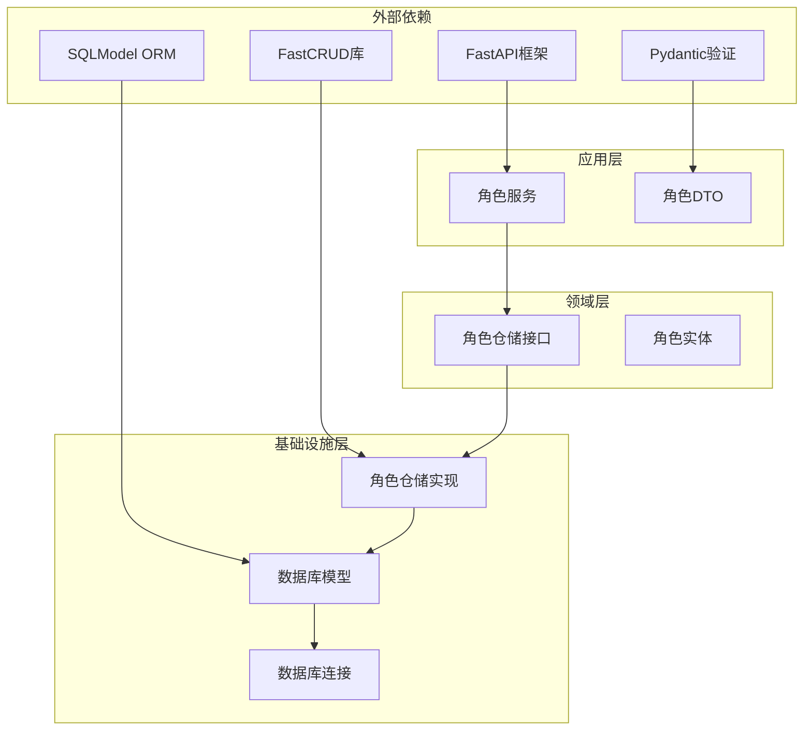

# 角色仓库层

<cite>
**本文档引用的文件**
- [role_repository.py](file://service/src/domain/repositories/role_repository.py)
- [role_repository.py](file://service/src/infrastructure/repositories/role_repository.py)
- [role.py](file://service/src/domain/entities/role.py)
- [role_service.py](file://service/src/application/services/role_service.py)
- [role_routes.py](file://service/src/api/v1/role_routes.py)
- [role_dto.py](file://service/src/application/dto/role_dto.py)
- [models.py](file://service/src/infrastructure/database/models.py)
- [dependencies.py](file://service/src/api/dependencies.py)
- [connection.py](file://service/src/infrastructure/database/connection.py)
- [settings.py](file://service/src/config/settings.py)
- [main.py](file://service/src/main.py)
</cite>

## 目录
1. [简介](#简介)
2. [项目结构](#项目结构)
3. [核心组件](#核心组件)
4. [架构概览](#架构概览)
5. [详细组件分析](#详细组件分析)
6. [依赖关系分析](#依赖关系分析)
7. [性能考虑](#性能考虑)
8. [故障排除指南](#故障排除指南)
9. [结论](#结论)

## 简介

角色仓库层是基于领域驱动设计（DDD）和六边形架构的FastAPI项目中的关键组件，负责管理角色相关的数据访问逻辑。该层实现了完整的角色管理功能，包括角色的CRUD操作、权限分配、用户角色关联以及菜单权限管理等。

该项目采用现代Python技术栈，使用SQLModel作为ORM框架，FastCRUD简化数据库操作，并结合Pydantic进行数据验证和序列化。整个系统遵循依赖倒置原则，通过接口抽象实现松耦合的设计。

## 项目结构

角色仓库层位于服务端项目的清晰分层架构中，采用DDD模式组织代码：

**图表来源**
- [role_routes.py:1-159](file://service/src/api/v1/role_routes.py#L1-L159)
- [role_service.py:1-174](file://service/src/application/services/role_service.py#L1-L174)
- [role_repository.py:1-207](file://service/src/domain/repositories/role_repository.py#L1-L207)
- [role_repository.py:1-282](file://service/src/infrastructure/repositories/role_repository.py#L1-L282)

**章节来源**
- [role_routes.py:1-159](file://service/src/api/v1/role_routes.py#L1-L159)
- [role_service.py:1-174](file://service/src/application/services/role_service.py#L1-L174)
- [role_repository.py:1-207](file://service/src/domain/repositories/role_repository.py#L1-L207)

## 核心组件

角色仓库层包含以下核心组件：

### 1. 角色仓储接口（Domain Layer）
定义了角色操作的抽象接口，确保业务逻辑与具体实现分离。

### 2. 角色仓储实现（Infrastructure Layer）
基于SQLModel和FastCRUD的具体实现，提供完整的数据库操作能力。

### 3. 角色实体（Domain Layer）
轻量级的数据容器，封装角色的业务属性和行为。

### 4. 角色服务（Application Layer）
协调仓储接口和业务逻辑，处理复杂的业务流程。

### 5. 角色路由（API Layer）
提供RESTful API接口，处理HTTP请求和响应。

**章节来源**
- [role_repository.py:13-207](file://service/src/domain/repositories/role_repository.py#L13-L207)
- [role_repository.py:17-282](file://service/src/infrastructure/repositories/role_repository.py#L17-L282)
- [role.py:11-37](file://service/src/domain/entities/role.py#L11-L37)
- [role_service.py:11-174](file://service/src/application/services/role_service.py#L11-L174)
- [role_routes.py:17-159](file://service/src/api/v1/role_routes.py#L17-L159)

## 架构概览

角色仓库层采用分层架构设计，每层都有明确的职责和边界：

**图表来源**
- [role_routes.py:46-61](file://service/src/api/v1/role_routes.py#L46-L61)
- [role_service.py:24-50](file://service/src/application/services/role_service.py#L24-L50)
- [role_repository.py:101-133](file://service/src/infrastructure/repositories/role_repository.py#L101-L133)

### 依赖注入机制

系统使用FastAPI的依赖注入机制实现松耦合：

**图表来源**
- [role_repository.py:13-207](file://service/src/domain/repositories/role_repository.py#L13-L207)
- [role_repository.py:17-282](file://service/src/infrastructure/repositories/role_repository.py#L17-L282)
- [role_service.py:11-22](file://service/src/application/services/role_service.py#L11-L22)

**章节来源**
- [dependencies.py:147-153](file://service/src/api/dependencies.py#L147-L153)
- [main.py:37-37](file://service/src/main.py#L37-L37)

## 详细组件分析

### 角色仓储接口分析

角色仓储接口定义了完整的角色管理操作契约：

#### 核心CRUD操作
- `get_by_id`: 根据唯一标识符获取角色
- `get_by_name`: 根据名称获取角色
- `get_by_code`: 根据编码获取角色
- `get_all`: 支持分页和条件过滤的角色列表查询
- `count`: 统计满足条件的角色总数
- `create`: 创建新角色
- `update`: 更新现有角色
- `delete`: 删除角色

#### 高级业务操作
- `assign_permissions_to_role`: 为角色分配权限（支持批量操作）
- `get_role_permissions`: 获取角色权限列表
- `assign_role_to_user`: 为用户分配角色
- `remove_role_from_user`: 移除用户的角色
- `get_user_roles`: 获取用户的所有角色
- `assign_roles_to_user`: 为用户批量分配角色
- `assign_menus_to_role`: 为角色分配菜单权限
- `get_role_menus`: 获取角色菜单列表
- `get_role_menu_ids`: 获取角色菜单ID列表

**章节来源**
- [role_repository.py:13-207](file://service/src/domain/repositories/role_repository.py#L13-L207)

### 角色仓储实现分析

仓储实现基于SQLModel和FastCRUD，提供高性能的数据访问：

#### 数据库模型映射
系统使用SQLModel定义了完整的RBAC模型体系：

**图表来源**
- [models.py:29-479](file://service/src/infrastructure/database/models.py#L29-L479)

#### 性能优化特性
- 使用FastCRUD简化复杂查询
- 支持批量操作减少数据库往返
- 实现了适当的索引策略
- 提供异步数据库操作支持

**章节来源**
- [role_repository.py:17-282](file://service/src/infrastructure/repositories/role_repository.py#L17-L282)
- [models.py:117-146](file://service/src/infrastructure/database/models.py#L117-L146)

### 角色实体分析

角色实体采用dataclass实现，保持领域模型的简洁性：

#### 实体属性
- `id`: 36位UUID字符串，唯一标识符
- `name`: 角色名称，最大长度64字符
- `code`: 角色编码，唯一标识，最大长度64字符
- `description`: 角色描述，可选
- `status`: 状态字段，0-禁用，1-启用
- `created_at`: 创建时间戳
- `updated_at`: 更新时间戳

#### 业务行为
- `is_active`: 属性方法判断角色是否启用

**章节来源**
- [role.py:11-37](file://service/src/domain/entities/role.py#L11-L37)

### 角色服务分析

角色服务协调仓储接口和业务逻辑，处理复杂的业务流程：

#### 业务流程
1. **创建角色流程**：
   - 验证角色名称和编码唯一性
   - 创建角色实体
   - 可选分配权限
   - 返回完整响应

2. **更新角色流程**：
   - 验证角色存在性
   - 更新允许修改的字段
   - 可选重新分配权限
   - 返回更新后的角色

3. **权限管理流程**：
   - 角色权限分配（先清除旧权限）
   - 用户角色分配（避免重复分配）
   - 批量角色分配（原子性操作）

**章节来源**
- [role_service.py:24-174](file://service/src/application/services/role_service.py#L24-L174)

### 角色路由分析

API路由提供RESTful接口，遵循统一的响应格式：

#### 接口规范
- **POST /api/system/role**: 获取角色列表（分页）
- **POST /api/system/role/create**: 创建角色
- **GET /api/system/role/{role_id}**: 获取角色详情
- **PUT /api/system/role/{role_id}**: 更新角色
- **DELETE /api/system/role/{role_id}**: 删除角色
- **POST /api/system/role/{role_id}/permissions**: 分配角色权限
- **POST /api/system/role/{role_id}/menu**: 分配角色菜单权限

#### 权限控制
- `role:view`: 查看角色需要的权限
- `role:manage`: 管理角色需要的权限

**章节来源**
- [role_routes.py:20-159](file://service/src/api/v1/role_routes.py#L20-L159)

## 依赖关系分析

角色仓库层的依赖关系体现了清晰的分层架构：

**图表来源**
- [dependencies.py:1-201](file://service/src/api/dependencies.py#L1-L201)
- [role_service.py:1-8](file://service/src/application/services/role_service.py#L1-L8)

### 循环依赖检查

系统设计避免了循环依赖：
- API层仅依赖应用层接口
- 应用层依赖领域层接口
- 领域层不依赖基础设施层
- 基础设施层实现领域层接口

**章节来源**
- [dependencies.py:147-201](file://service/src/api/dependencies.py#L147-L201)

## 性能考虑

### 数据库性能优化
1. **索引策略**：
   - 角色名称和编码建立唯一索引
   - 用户名和邮箱建立索引
   - 外键字段建立索引

2. **查询优化**：
   - 使用FastCRUD的批量操作
   - 实现分页查询避免大数据集
   - 缓存常用查询结果

3. **连接池管理**：
   - 使用异步连接池
   - 配置合适的连接数
   - 实现连接超时和重试机制

### 应用层性能优化
1. **依赖注入缓存**：
   - 使用LRU缓存配置
   - 减少重复的对象创建

2. **异步操作**：
   - 全面使用async/await
   - 避免阻塞操作

3. **内存管理**：
   - 及时释放数据库连接
   - 控制响应数据大小

## 故障排除指南

### 常见问题及解决方案

#### 1. 数据库连接问题
**症状**：应用启动时报数据库连接错误
**解决方案**：
- 检查DATABASE_URL配置
- 验证数据库服务状态
- 确认网络连接正常

#### 2. 权限验证失败
**症状**：API调用返回403权限不足
**解决方案**：
- 验证JWT令牌有效性
- 检查用户权限分配
- 确认权限编码正确

#### 3. 角色创建失败
**症状**：创建角色时报重复错误
**解决方案**：
- 检查角色名称和编码唯一性
- 验证输入数据格式
- 确认数据库约束

#### 4. 性能问题
**症状**：查询响应缓慢
**解决方案**：
- 添加适当的数据库索引
- 优化查询条件
- 调整分页参数

**章节来源**
- [connection.py:17-26](file://service/src/infrastructure/database/connection.py#L17-L26)
- [settings.py:57-58](file://service/src/config/settings.py#L57-L58)

## 结论

角色仓库层展现了现代Python Web应用的最佳实践，通过清晰的分层架构、依赖注入机制和DDD设计原则，实现了高内聚、低耦合的系统设计。该实现具有以下优势：

1. **架构清晰**：严格的分层设计使代码职责明确
2. **扩展性强**：接口抽象便于替换和扩展
3. **性能优秀**：异步操作和数据库优化提升响应速度
4. **易于维护**：依赖注入和单元测试支持代码维护
5. **安全可靠**：权限控制和数据验证保障系统安全

该角色仓库层为整个RBAC系统奠定了坚实的基础，为后续的功能扩展和系统演进提供了良好的架构支撑。