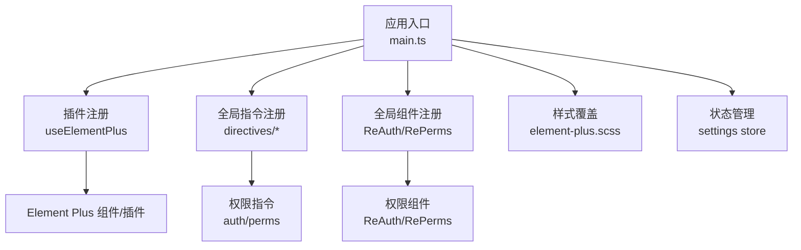
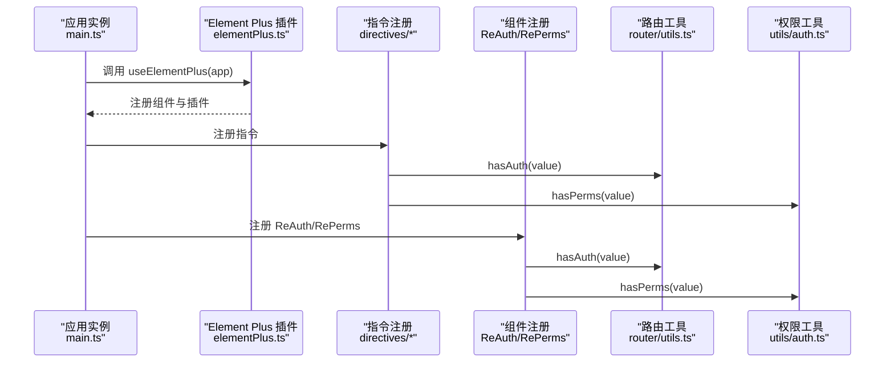
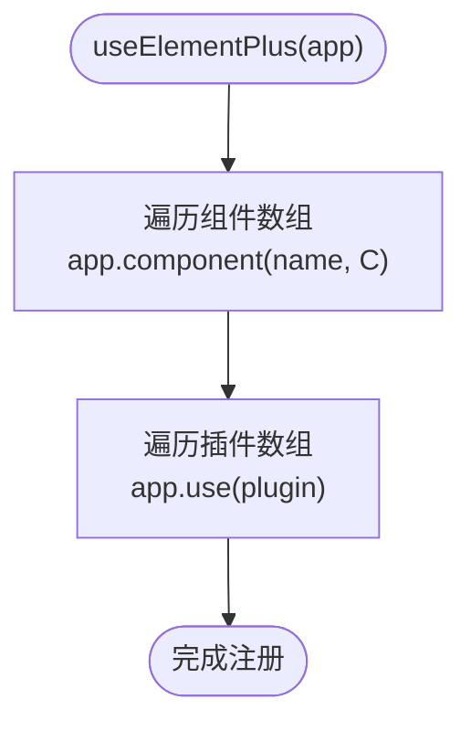
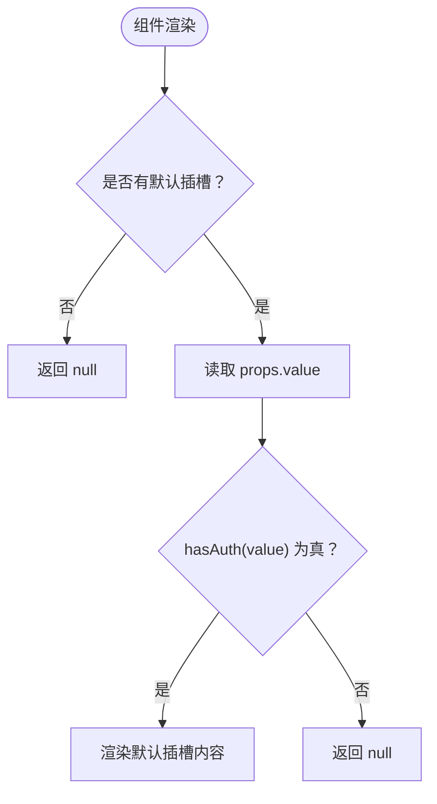
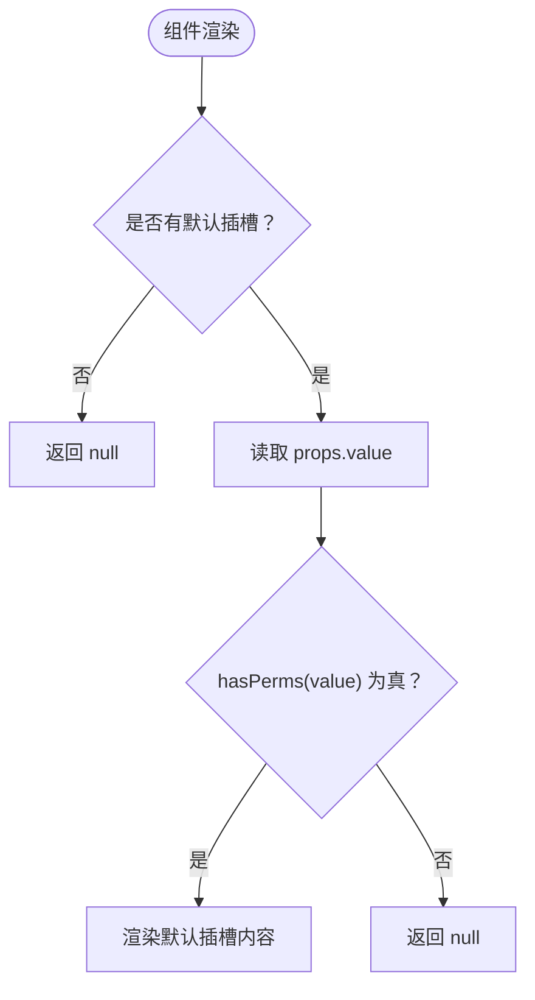
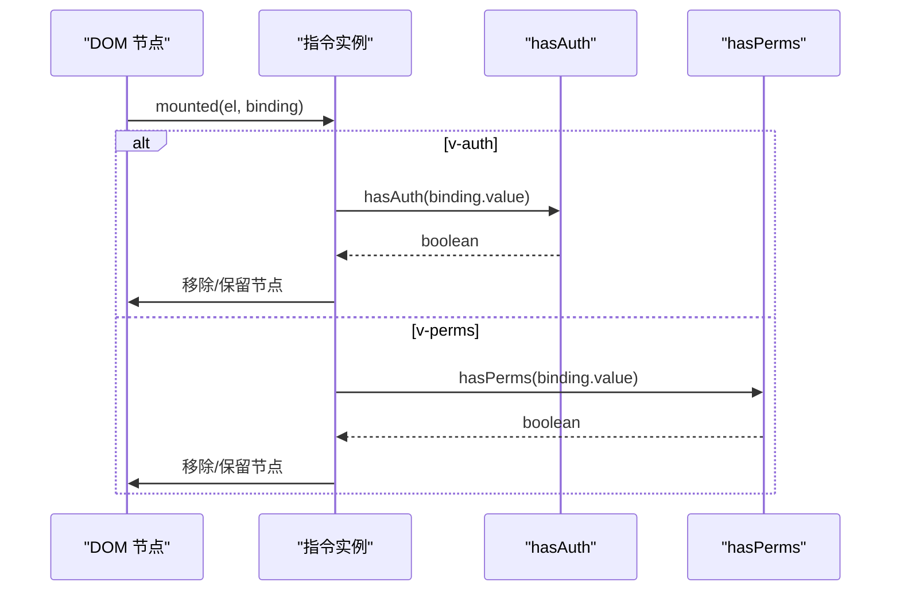
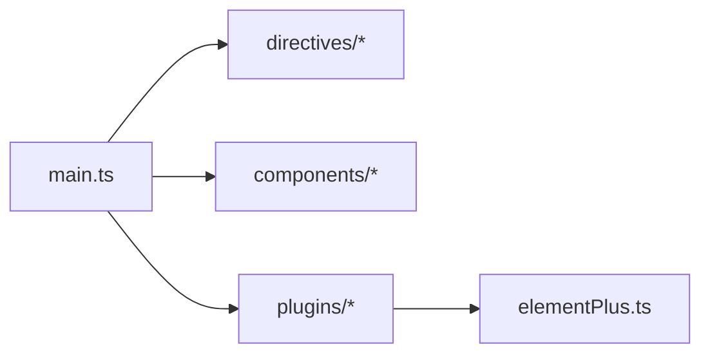
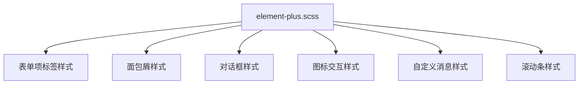
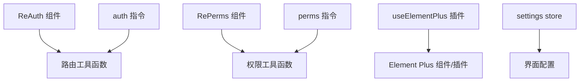

# UI 组件系统

<cite>
**本文引用的文件**
- [elementPlus.ts](file://web/src/plugins/elementPlus.ts)
- [main.ts](file://web/src/main.ts)
- [auth 指令](file://web/src/directives/auth/index.ts)
- [perms 指令](file://web/src/directives/perms/index.ts)
- [ReAuth 组件](file://web/src/components/ReAuth/src/auth.tsx)
- [RePerms 组件](file://web/src/components/RePerms/src/perms.tsx)
- [ReAuth 导出入口](file://web/src/components/ReAuth/index.ts)
- [RePerms 导出入口](file://web/src/components/RePerms/index.ts)
- [路由工具函数](file://web/src/router/utils.ts)
- [权限工具函数](file://web/src/utils/auth.ts)
- [Element Plus 样式覆盖](file://web/src/style/element-plus.scss)
- [设置 Store](file://web/src/store/modules/settings.ts)
- [ESLint 配置](file://web/eslint.config.js)
- [包管理配置](file://web/package.json)
</cite>

## 目录
1. [简介](#简介)
2. [项目结构](#项目结构)
3. [核心组件](#核心组件)
4. [架构总览](#架构总览)
5. [组件详解](#组件详解)
6. [依赖关系分析](#依赖关系分析)
7. [性能考量](#性能考量)
8. [故障排查指南](#故障排查指南)
9. [结论](#结论)
10. [附录](#附录)

## 简介
本文件面向 UI 组件系统的使用者与维护者，系统性阐述以下内容：
- Element Plus 组件库的集成与按需引入策略
- 自定义组件库的设计理念与实现方式（ReAuth 权限组件、RePerms 按钮权限组件等）
- 组件的全局注册机制与按需引入策略
- 组件的属性定义、事件处理与插槽使用
- 组件样式定制与主题配置方法
- 组件开发规范与最佳实践

## 项目结构
前端工程位于 web 目录，核心围绕 Vue 3 + TypeScript + Vite 构建，采用模块化的组件与插件设计：
- 插件层：统一注册第三方库与 Element Plus
- 指令层：基于路由与权限的指令系统
- 组件层：业务与通用组件（含 ReAuth、RePerms 等）
- 样式层：Element Plus 样式覆盖与主题适配
- 存储层：Pinia 状态管理（设置项等）

图表来源
- [main.ts:27-71](file://web/src/main.ts#L27-L71)
- [elementPlus.ts:250-260](file://web/src/plugins/elementPlus.ts#L250-L260)
- [auth 指令:4-15](file://web/src/directives/auth/index.ts#L4-L15)
- [perms 指令:4-15](file://web/src/directives/perms/index.ts#L4-L15)
- [ReAuth 组件:4-20](file://web/src/components/ReAuth/src/auth.tsx#L4-L20)
- [RePerms 组件:4-20](file://web/src/components/RePerms/src/perms.tsx#L4-L20)
- [Element Plus 样式覆盖:1-190](file://web/src/style/element-plus.scss#L1-L190)
- [设置 Store:4-35](file://web/src/store/modules/settings.ts#L4-L35)

章节来源
- [main.ts:1-72](file://web/src/main.ts#L1-L72)
- [elementPlus.ts:1-261](file://web/src/plugins/elementPlus.ts#L1-L261)

## 核心组件
- Element Plus 集成与按需引入
  - 在插件中集中导出并注册组件与插件，便于按需裁剪体积
  - 支持全局注册与按需引入两种方式
- 权限指令与组件
  - auth 指令：基于路由 meta.auths 的页面级权限控制
  - perms 指令：基于用户 permissions 的按钮级权限控制
  - ReAuth/RePerms 组件：以组件形式包裹内容，实现条件渲染
- 样式覆盖与主题适配
  - 通过 SCSS 覆盖 Element Plus 默认样式，统一视觉与交互
  - 提供暗色风格适配与自定义消息样式示例

章节来源
- [elementPlus.ts:1-261](file://web/src/plugins/elementPlus.ts#L1-L261)
- [auth 指令:1-16](file://web/src/directives/auth/index.ts#L1-L16)
- [perms 指令:1-16](file://web/src/directives/perms/index.ts#L1-L16)
- [ReAuth 组件:1-21](file://web/src/components/ReAuth/src/auth.tsx#L1-L21)
- [RePerms 组件:1-21](file://web/src/components/RePerms/src/perms.tsx#L1-L21)
- [Element Plus 样式覆盖:1-190](file://web/src/style/element-plus.scss#L1-L190)

## 架构总览
下图展示应用启动时的组件与插件装配流程，以及权限控制的关键路径。

图表来源
- [main.ts:27-71](file://web/src/main.ts#L27-L71)
- [elementPlus.ts:250-260](file://web/src/plugins/elementPlus.ts#L250-L260)
- [auth 指令:4-15](file://web/src/directives/auth/index.ts#L4-L15)
- [perms 指令:4-15](file://web/src/directives/perms/index.ts#L4-L15)
- [ReAuth 组件:12-19](file://web/src/components/ReAuth/src/auth.tsx#L12-L19)
- [RePerms 组件:12-19](file://web/src/components/RePerms/src/perms.tsx#L12-L19)
- [路由工具函数:368-383](file://web/src/router/utils.ts#L368-L383)
- [权限工具函数:130-141](file://web/src/utils/auth.ts#L130-L141)

## 组件详解

### Element Plus 集成与配置
- 集成方式
  - 在插件中集中导出并注册 Element Plus 组件与插件，便于统一管理与按需裁剪
  - 同时支持全局注册与按需引入两种策略
- 按需引入策略
  - 仅保留项目实际使用的组件与指令，减少打包体积
  - 通过注释标注导出来源，便于版本升级时核对差异
- 全局注册机制
  - 插件内部遍历组件数组进行 app.component 注册
  - 插件数组通过 app.use 注册指令与服务

图表来源
- [elementPlus.ts:129-259](file://web/src/plugins/elementPlus.ts#L129-L259)

章节来源
- [elementPlus.ts:1-261](file://web/src/plugins/elementPlus.ts#L1-L261)
- [main.ts:10-10](file://web/src/main.ts#L10-L10)

### ReAuth 权限组件
- 设计理念
  - 以组件形式包裹内容，基于路由 meta.auths 进行页面级权限判断
  - 无权限时隐藏内容，有权限时渲染默认插槽
- 属性与行为
  - 属性：value（字符串或字符串数组），用于匹配路由 meta.auths
  - 行为：在 setup 中读取 props.value 并调用 hasAuth 判断，决定是否渲染默认插槽
- 插槽
  - 使用默认插槽承载被保护的内容

图表来源
- [ReAuth 组件:12-19](file://web/src/components/ReAuth/src/auth.tsx#L12-L19)
- [路由工具函数:368-383](file://web/src/router/utils.ts#L368-L383)

章节来源
- [ReAuth 组件:1-21](file://web/src/components/ReAuth/src/auth.tsx#L1-L21)
- [ReAuth 导出入口:1-6](file://web/src/components/ReAuth/index.ts#L1-L6)
- [路由工具函数:368-383](file://web/src/router/utils.ts#L368-L383)

### RePerms 按钮权限组件
- 设计理念
  - 以组件形式包裹按钮等交互元素，基于用户 permissions 进行按钮级权限判断
  - 无权限时隐藏内容，有权限时渲染默认插槽
- 属性与行为
  - 属性：value（字符串或字符串数组），用于匹配用户 permissions
  - 行为：在 setup 中读取 props.value 并调用 hasPerms 判断，决定是否渲染默认插槽
- 插槽
  - 使用默认插槽承载受控的按钮或操作项

图表来源
- [RePerms 组件:12-19](file://web/src/components/RePerms/src/perms.tsx#L12-L19)
- [权限工具函数:130-141](file://web/src/utils/auth.ts#L130-L141)

章节来源
- [RePerms 组件:1-21](file://web/src/components/RePerms/src/perms.tsx#L1-L21)
- [RePerms 导出入口:1-6](file://web/src/components/RePerms/index.ts#L1-L6)
- [权限工具函数:130-141](file://web/src/utils/auth.ts#L130-L141)

### 权限指令（auth 与 perms）
- auth 指令
  - 作用于 DOM 元素，基于路由 meta.auths 判断页面级权限
  - 无权限时移除节点，避免渲染
  - 缺省值时报错提示
- perms 指令
  - 作用于 DOM 元素，基于用户 permissions 判断按钮级权限
  - 无权限时移除节点，避免渲染
  - 缺省值时报错提示

图表来源
- [auth 指令:4-15](file://web/src/directives/auth/index.ts#L4-L15)
- [perms 指令:4-15](file://web/src/directives/perms/index.ts#L4-L15)
- [路由工具函数:368-383](file://web/src/router/utils.ts#L368-L383)
- [权限工具函数:130-141](file://web/src/utils/auth.ts#L130-L141)

章节来源
- [auth 指令:1-16](file://web/src/directives/auth/index.ts#L1-L16)
- [perms 指令:1-16](file://web/src/directives/perms/index.ts#L1-L16)

### 组件全局注册与按需引入
- 全局注册
  - 在 main.ts 中统一注册指令、组件与插件
  - 通过 app.directive/app.component/app.use 完成装配
- 按需引入
  - 在插件中集中导出组件与插件，按需启用
  - 通过注释标注导出来源，便于版本升级时核对差异

图表来源
- [main.ts:27-71](file://web/src/main.ts#L27-L71)
- [elementPlus.ts:1-261](file://web/src/plugins/elementPlus.ts#L1-L261)

章节来源
- [main.ts:27-71](file://web/src/main.ts#L27-L71)
- [elementPlus.ts:1-261](file://web/src/plugins/elementPlus.ts#L1-L261)

### 组件属性、事件与插槽
- ReAuth/RePerms
  - 属性：value（字符串或字符串数组）
  - 事件：无（纯条件渲染）
  - 插槽：默认插槽（承载受控内容）
- auth/perms 指令
  - 参数：binding.value（字符串或字符串数组）
  - 事件：无（DOM 生命周期钩子）
  - 插槽：无（直接作用于宿主元素）

章节来源
- [ReAuth 组件:6-11](file://web/src/components/ReAuth/src/auth.tsx#L6-L11)
- [RePerms 组件:6-11](file://web/src/components/RePerms/src/perms.tsx#L6-L11)
- [auth 指令:4-15](file://web/src/directives/auth/index.ts#L4-L15)
- [perms 指令:4-15](file://web/src/directives/perms/index.ts#L4-L15)

### 样式定制与主题配置
- Element Plus 样式覆盖
  - 通过 SCSS 覆盖 label 字体、面包屑样式、对话框头尾部间距、图标 hover 效果等
  - 提供自定义 Message 样式类与滚动条样式
- 主题适配
  - 结合暗色样式文件与变量，适配深色模式
  - 通过 CSS 变量与 SCSS 变量实现主题一致性

图表来源
- [Element Plus 样式覆盖:1-190](file://web/src/style/element-plus.scss#L1-L190)

章节来源
- [Element Plus 样式覆盖:1-190](file://web/src/style/element-plus.scss#L1-L190)

## 依赖关系分析
- 组件与工具的依赖链
  - ReAuth/RePerms 依赖路由工具函数与权限工具函数
  - 指令 auth/perms 依赖路由工具函数与权限工具函数
  - 插件 useElementPlus 依赖 Element Plus 组件与插件
- 外部依赖
  - Element Plus 版本与相关生态组件
  - Pinia、Vue Router、VueUse 等核心依赖

图表来源
- [ReAuth 组件:1-21](file://web/src/components/ReAuth/src/auth.tsx#L1-L21)
- [RePerms 组件:1-21](file://web/src/components/RePerms/src/perms.tsx#L1-L21)
- [auth 指令:1-16](file://web/src/directives/auth/index.ts#L1-L16)
- [perms 指令:1-16](file://web/src/directives/perms/index.ts#L1-L16)
- [路由工具函数:368-383](file://web/src/router/utils.ts#L368-L383)
- [权限工具函数:130-141](file://web/src/utils/auth.ts#L130-L141)
- [elementPlus.ts:1-261](file://web/src/plugins/elementPlus.ts#L1-L261)
- [设置 Store:4-35](file://web/src/store/modules/settings.ts#L4-L35)

章节来源
- [ReAuth 组件:1-21](file://web/src/components/ReAuth/src/auth.tsx#L1-L21)
- [RePerms 组件:1-21](file://web/src/components/RePerms/src/perms.tsx#L1-L21)
- [auth 指令:1-16](file://web/src/directives/auth/index.ts#L1-L16)
- [perms 指令:1-16](file://web/src/directives/perms/index.ts#L1-L16)
- [elementPlus.ts:1-261](file://web/src/plugins/elementPlus.ts#L1-L261)
- [设置 Store:4-35](file://web/src/store/modules/settings.ts#L4-L35)

## 性能考量
- 按需引入
  - 仅引入实际使用的 Element Plus 组件与指令，降低首屏体积
- 指令与组件的轻量实现
  - 指令与组件均采用最小逻辑，避免额外开销
- 样式覆盖的局部性
  - 通过类名限定作用域，减少样式冲突与重绘

## 故障排查指南
- 指令缺省值错误
  - auth 与 perms 指令在未提供 binding.value 时抛出错误，检查模板中指令参数是否正确
- 权限判断异常
  - 确认路由 meta.auths 与用户 permissions 数据结构与值是否匹配
  - 检查 hasAuth/hasPerms 的调用路径与返回值
- 样式覆盖失效
  - 确认 SCSS 文件导入顺序与作用域类名是否正确
  - 检查暗色模式适配与变量覆盖是否生效

章节来源
- [auth 指令:9-13](file://web/src/directives/auth/index.ts#L9-L13)
- [perms 指令:9-13](file://web/src/directives/perms/index.ts#L9-L13)
- [路由工具函数:368-383](file://web/src/router/utils.ts#L368-L383)
- [权限工具函数:130-141](file://web/src/utils/auth.ts#L130-L141)
- [Element Plus 样式覆盖:1-190](file://web/src/style/element-plus.scss#L1-L190)

## 结论
本 UI 组件系统通过插件化与模块化设计，实现了 Element Plus 的灵活集成与按需引入；通过指令与组件双通道提供权限控制能力，并辅以样式覆盖与主题适配，形成统一的视觉与交互体验。遵循本文档的开发规范与最佳实践，可确保组件体系的可维护性与扩展性。

## 附录

### 组件开发规范与最佳实践
- 组件命名与导出
  - 组件文件夹内提供 index.ts 导出入口，统一对外暴露
- 属性与类型
  - 明确 props 类型与默认值，避免运行时类型错误
- 插槽使用
  - 优先使用默认插槽承载受控内容，保持语义清晰
- 指令参数
  - 指令参数必须显式提供，避免运行时错误
- 样式覆盖
  - 使用局部类名与变量覆盖，避免全局污染
- ESLint 规范
  - 遵循项目 ESLint 配置，保持代码风格一致

章节来源
- [ReAuth 导出入口:1-6](file://web/src/components/ReAuth/index.ts#L1-L6)
- [RePerms 导出入口:1-6](file://web/src/components/RePerms/index.ts#L1-L6)
- [ESLint 配置:1-191](file://web/eslint.config.js#L1-L191)
- [包管理配置:49-114](file://web/package.json#L49-L114)