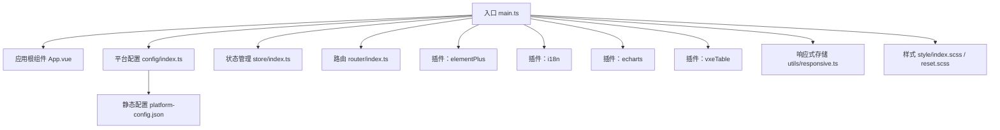
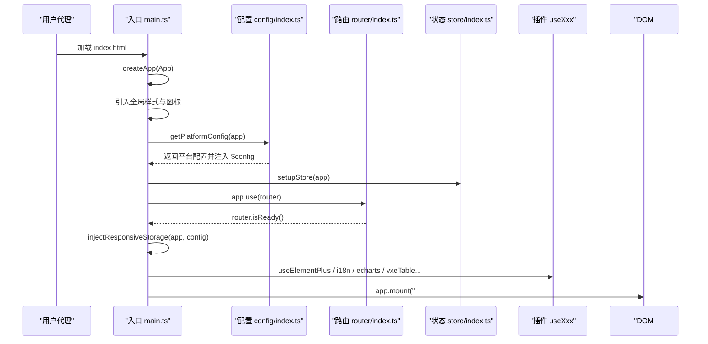
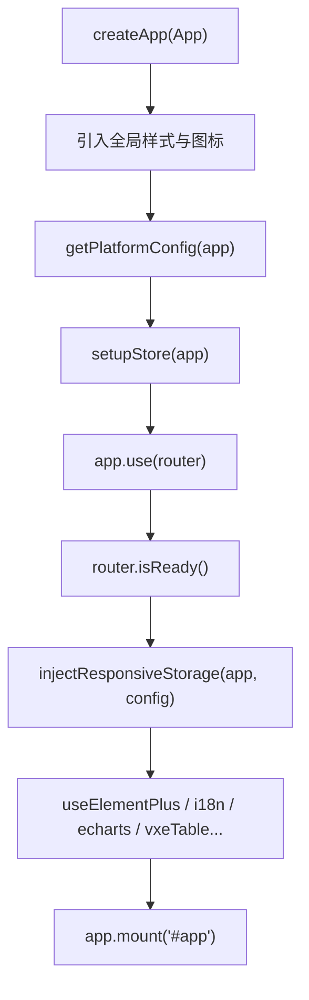
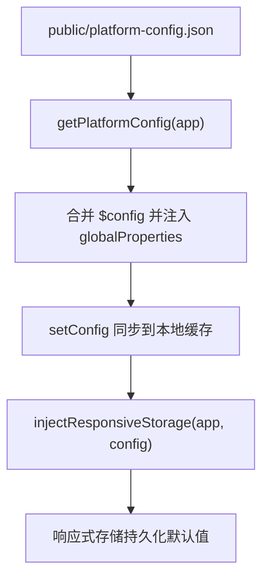
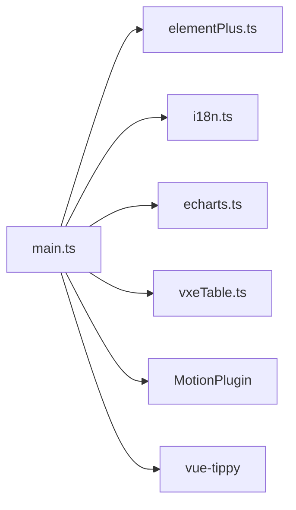
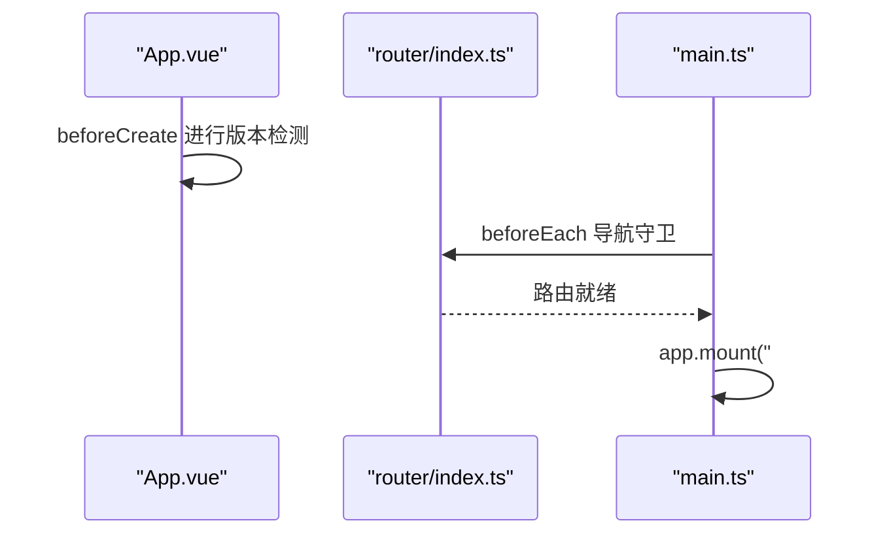
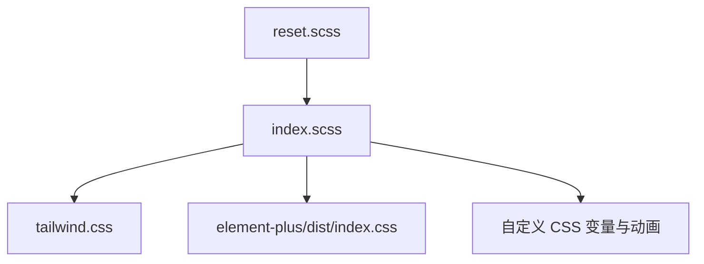
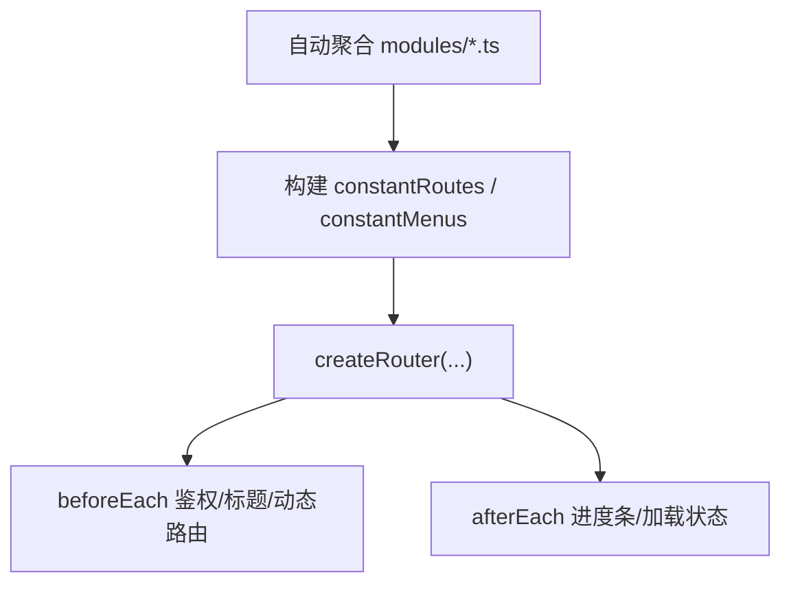
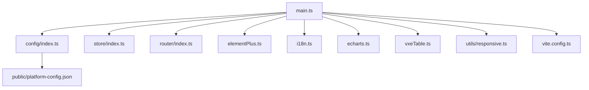

# Vue 应用架构

<cite>
**本文引用的文件**
- [main.ts](file://web/src/main.ts)
- [App.vue](file://web/src/App.vue)
- [config/index.ts](file://web/src/config/index.ts)
- [plugins/elementPlus.ts](file://web/src/plugins/elementPlus.ts)
- [plugins/i18n.ts](file://web/src/plugins/i18n.ts)
- [plugins/echarts.ts](file://web/src/plugins/echarts.ts)
- [plugins/vxeTable.ts](file://web/src/plugins/vxeTable.ts)
- [store/index.ts](file://web/src/store/index.ts)
- [router/index.ts](file://web/src/router/index.ts)
- [style/index.scss](file://web/src/style/index.scss)
- [style/reset.scss](file://web/src/style/reset.scss)
- [utils/responsive.ts](file://web/src/utils/responsive.ts)
- [public/platform-config.json](file://web/public/platform-config.json)
- [package.json](file://web/package.json)
- [vite.config.ts](file://web/vite.config.ts)
</cite>

## 目录
1. [引言](#引言)
2. [项目结构](#项目结构)
3. [核心组件](#核心组件)
4. [架构总览](#架构总览)
5. [详细组件分析](#详细组件分析)
6. [依赖关系分析](#依赖关系分析)
7. [性能考量](#性能考量)
8. [故障排查指南](#故障排查指南)
9. [结论](#结论)
10. [附录](#附录)

## 引言
本文件面向 Vue 3 + TypeScript 的前端应用，系统性梳理应用入口与初始化流程、依赖注入与插件配置、启动顺序与生命周期管理、平台配置系统与配置注入机制、全局样式与 CSS 架构、第三方库集成与插件注册模式，并总结最佳实践与扩展建议，帮助开发者快速理解并高效扩展整个前端应用的组织结构与运行机制。

## 项目结构
Web 前端采用 Vite + Vue 3 + TypeScript 技术栈，遵循“按功能域分层 + 插件化注册”的组织方式：
- 入口与应用根组件：main.ts、App.vue
- 平台配置与注入：config/index.ts、public/platform-config.json
- 插件体系：plugins 下各子模块（elementPlus、i18n、echarts、vxeTable）
- 状态管理：store/index.ts（Pinia）
- 路由系统：router/index.ts（动态路由聚合与守卫）
- 样式体系：style/*.scss（reset、index、主题、过渡等）
- 响应式存储：utils/responsive.ts（结合平台配置持久化）

图表来源
- [main.ts:1-72](file://web/src/main.ts#L1-L72)
- [App.vue:1-91](file://web/src/App.vue#L1-L91)
- [config/index.ts:1-56](file://web/src/config/index.ts#L1-L56)
- [store/index.ts:1-10](file://web/src/store/index.ts#L1-L10)
- [router/index.ts:1-230](file://web/src/router/index.ts#L1-L230)
- [plugins/elementPlus.ts:1-261](file://web/src/plugins/elementPlus.ts#L1-L261)
- [plugins/i18n.ts:1-117](file://web/src/plugins/i18n.ts#L1-L117)
- [plugins/echarts.ts:1-45](file://web/src/plugins/echarts.ts#L1-L45)
- [plugins/vxeTable.ts:1-105](file://web/src/plugins/vxeTable.ts#L1-L105)
- [utils/responsive.ts:1-49](file://web/src/utils/responsive.ts#L1-L49)
- [style/index.scss:1-53](file://web/src/style/index.scss#L1-L53)
- [style/reset.scss:1-251](file://web/src/style/reset.scss#L1-L251)
- [public/platform-config.json:1-37](file://web/public/platform-config.json#L1-L37)

章节来源
- [main.ts:1-72](file://web/src/main.ts#L1-L72)
- [vite.config.ts:1-67](file://web/vite.config.ts#L1-L67)

## 核心组件
- 应用入口与初始化：在入口文件中完成 createApp 实例创建、全局样式引入、自定义指令与全局组件注册、平台配置获取与注入、插件链式注册、Pinia 与路由挂载、最终挂载到 DOM。
- 平台配置系统：通过 axios 动态拉取 public/platform-config.json，合并到全局配置对象，并注入到 app.config.globalProperties，同时驱动响应式存储的命名空间与默认值。
- 插件体系：统一以 useXxx(app) 形式导出插件安装函数，集中于入口文件按序注册，确保依赖顺序与生命周期一致。
- 状态与路由：Pinia 在入口阶段注册；路由在平台配置完成后等待就绪，再进行后续初始化。
- 样式架构：reset.scss 提供基础归一化；index.scss 组织主题、过渡、侧边栏、暗色模式等模块化样式；TailwindCSS 与 Element Plus 样式在入口统一引入。

章节来源
- [main.ts:1-72](file://web/src/main.ts#L1-L72)
- [config/index.ts:1-56](file://web/src/config/index.ts#L1-L56)
- [store/index.ts:1-10](file://web/src/store/index.ts#L1-L10)
- [router/index.ts:1-230](file://web/src/router/index.ts#L1-L230)
- [style/index.scss:1-53](file://web/src/style/index.scss#L1-L53)
- [style/reset.scss:1-251](file://web/src/style/reset.scss#L1-L251)

## 架构总览
下图展示从入口到插件注册、配置注入、状态与路由挂载的完整启动序列：

图表来源
- [main.ts:57-71](file://web/src/main.ts#L57-L71)
- [config/index.ts:30-50](file://web/src/config/index.ts#L30-L50)
- [store/index.ts:5-7](file://web/src/store/index.ts#L5-L7)
- [router/index.ts:77-95](file://web/src/router/index.ts#L77-L95)
- [utils/responsive.ts:7-48](file://web/src/utils/responsive.ts#L7-L48)

## 详细组件分析

### 应用入口与初始化流程
- 创建应用实例：调用 createApp(App)，随后进行全局样式、指令、组件与第三方插件的注册。
- 平台配置获取：异步拉取 public/platform-config.json，合并至全局配置对象，并设置 app.config.globalProperties.$config。
- 注入响应式存储：根据平台配置生成命名空间与默认值，注入响应式存储插件。
- 插件链式注册：依次注册 Element Plus、i18n、ECharts、vxe-table 等插件。
- 路由与状态挂载：先等待 router.isReady()，再进行 mount，保证导航与视图渲染的稳定性。

图表来源
- [main.ts:27-71](file://web/src/main.ts#L27-L71)
- [config/index.ts:30-50](file://web/src/config/index.ts#L30-L50)
- [store/index.ts:5-7](file://web/src/store/index.ts#L5-L7)
- [router/index.ts:77-95](file://web/src/router/index.ts#L77-L95)
- [utils/responsive.ts:7-48](file://web/src/utils/responsive.ts#L7-L48)

章节来源
- [main.ts:1-72](file://web/src/main.ts#L1-L72)

### 平台配置系统与注入机制
- 配置来源：public/platform-config.json 提供运行期动态配置（标题、布局、主题、水印、地图参数等）。
- 获取与合并：getPlatformConfig 使用 axios 拉取配置，与现有 $config 合并，写回 app.config.globalProperties.$config，并同步到本地 getConfig 缓存。
- 命名空间与持久化：responsiveStorageNameSpace 从配置中读取命名空间，结合响应式存储插件实现本地持久化。
- 使用场景：路由守卫中读取 Title 作为页面标题前缀；App.vue 中读取 Locale 控制 Element Plus 语言包合并；响应式存储初始化默认布局与主题。

图表来源
- [config/index.ts:30-50](file://web/src/config/index.ts#L30-L50)
- [public/platform-config.json:1-37](file://web/public/platform-config.json#L1-L37)
- [utils/responsive.ts:7-48](file://web/src/utils/responsive.ts#L7-L48)

章节来源
- [config/index.ts:1-56](file://web/src/config/index.ts#L1-L56)
- [public/platform-config.json:1-37](file://web/public/platform-config.json#L1-L37)
- [utils/responsive.ts:1-49](file://web/src/utils/responsive.ts#L1-L49)

### 插件注册与第三方库集成模式
- Element Plus：按需引入组件与插件，统一通过 useElementPlus(app) 注册，减少打包体积。
- 国际化（i18n）：基于 vue-i18n，结合本地 locales YAML 文件与 Element Plus 语言包，提供 transformI18n 工具与响应式存储命名空间。
- ECharts：按需引入图表与组件，通过 useEcharts(app) 将 $echarts 写入全局属性，便于业务组件直接使用。
- vxe-table：按需启用表格功能与组件，统一通过 useVxeTable(app) 安装。
- MotionPlugin：来自 @vueuse/motion，提供动画能力。
- 其他：全局注册 tippy.js、自定义图标组件与权限组件等。

图表来源
- [main.ts:57-71](file://web/src/main.ts#L57-L71)
- [plugins/elementPlus.ts:251-261](file://web/src/plugins/elementPlus.ts#L251-L261)
- [plugins/i18n.ts:114-117](file://web/src/plugins/i18n.ts#L114-L117)
- [plugins/echarts.ts:40-45](file://web/src/plugins/echarts.ts#L40-L45)
- [plugins/vxeTable.ts:66-105](file://web/src/plugins/vxeTable.ts#L66-L105)

章节来源
- [main.ts:1-72](file://web/src/main.ts#L1-L72)
- [plugins/elementPlus.ts:1-261](file://web/src/plugins/elementPlus.ts#L1-L261)
- [plugins/i18n.ts:1-117](file://web/src/plugins/i18n.ts#L1-L117)
- [plugins/echarts.ts:1-45](file://web/src/plugins/echarts.ts#L1-L45)
- [plugins/vxeTable.ts:1-105](file://web/src/plugins/vxeTable.ts#L1-L105)

### 生命周期与启动顺序管理
- beforeCreate：在 App.vue 中进行版本检测（生产环境），避免开发环境干扰。
- beforeEach：在 router/index.ts 中进行鉴权、标题设置、动态路由初始化、标签页缓存控制等。
- isReady：在入口等待路由准备完成，确保导航与视图渲染一致性。
- 挂载：最后执行 app.mount("#app")，完成首屏渲染。

图表来源
- [App.vue:66-88](file://web/src/App.vue#L66-L88)
- [router/index.ts:123-222](file://web/src/router/index.ts#L123-L222)
- [main.ts:59-71](file://web/src/main.ts#L59-L71)

章节来源
- [App.vue:1-91](file://web/src/App.vue#L1-L91)
- [router/index.ts:1-230](file://web/src/router/index.ts#L1-L230)
- [main.ts:1-72](file://web/src/main.ts#L1-L72)

### 全局样式与 CSS 架构
- reset.scss：提供基础元素归一化、字体、列表、表单控件、媒体元素等默认样式，确保跨浏览器一致性。
- index.scss：组织主题、过渡、侧边栏、暗色模式等模块化样式，并定义常用 CSS 变量与动画。
- TailwindCSS：在入口引入，避免 HMR 对整体样式文件的频繁请求，提升开发体验。
- Element Plus：引入其 CSS 以保证组件样式一致。

图表来源
- [style/reset.scss:1-251](file://web/src/style/reset.scss#L1-L251)
- [style/index.scss:1-53](file://web/src/style/index.scss#L1-L53)
- [main.ts:16-25](file://web/src/main.ts#L16-L25)

章节来源
- [style/reset.scss:1-251](file://web/src/style/reset.scss#L1-L251)
- [style/index.scss:1-53](file://web/src/style/index.scss#L1-L53)
- [main.ts:16-25](file://web/src/main.ts#L16-L25)

### 状态管理与路由系统
- Pinia：在入口注册 createPinia()，提供全局状态管理能力。
- 路由：通过 import.meta.glob 自动聚合 modules 下的路由模块，构建常量路由与菜单树，支持动态路由初始化与标签页缓存。
- 守卫：在 beforeEach 中处理鉴权、标题国际化、外部链接打开、动态路由注入与标签页维护，afterEach 更新加载状态与进度条。

图表来源
- [router/index.ts:45-75](file://web/src/router/index.ts#L45-L75)
- [router/index.ts:123-222](file://web/src/router/index.ts#L123-L222)

章节来源
- [store/index.ts:1-10](file://web/src/store/index.ts#L1-L10)
- [router/index.ts:1-230](file://web/src/router/index.ts#L1-L230)

## 依赖关系分析
- 入口对配置、状态、路由、插件的依赖清晰：先配置，后状态与路由，再插件，最后挂载。
- 插件之间低耦合：每个插件通过独立的 useXxx(app) 函数注册，入口集中调用。
- 第三方库：Element Plus、vue-i18n、echarts、vxe-table、@vueuse/motion、vue-tippy 等均以插件或全局属性形式接入。
- 构建与运行：Vite 配置提供别名、插件列表、依赖预优化与输出目录策略。

图表来源
- [main.ts:1-72](file://web/src/main.ts#L1-L72)
- [config/index.ts:1-56](file://web/src/config/index.ts#L1-L56)
- [store/index.ts:1-10](file://web/src/store/index.ts#L1-L10)
- [router/index.ts:1-230](file://web/src/router/index.ts#L1-L230)
- [plugins/elementPlus.ts:1-261](file://web/src/plugins/elementPlus.ts#L1-L261)
- [plugins/i18n.ts:1-117](file://web/src/plugins/i18n.ts#L1-L117)
- [plugins/echarts.ts:1-45](file://web/src/plugins/echarts.ts#L1-L45)
- [plugins/vxeTable.ts:1-105](file://web/src/plugins/vxeTable.ts#L1-L105)
- [utils/responsive.ts:1-49](file://web/src/utils/responsive.ts#L1-L49)
- [public/platform-config.json:1-37](file://web/public/platform-config.json#L1-L37)
- [vite.config.ts:1-67](file://web/vite.config.ts#L1-L67)

章节来源
- [package.json:1-210](file://web/package.json#L1-L210)
- [vite.config.ts:1-67](file://web/vite.config.ts#L1-L67)

## 性能考量
- 依赖预优化：Vite optimizeDeps 预热与排除策略减少冷启动时间。
- 按需引入：Element Plus、ECharts、vxe-table 均采用按需引入，降低首屏体积。
- 样式拆分：reset 与 index 模块化，TailwindCSS 单独引入，避免整体样式热更新带来的性能损耗。
- 路由懒加载：modules 下的路由模块通过 import.meta.glob 懒加载，配合 keep-alive 与标签页缓存减少重复渲染。
- 构建产物：chunk 与资源文件命名规则优化，便于缓存与 CDN 分发。

章节来源
- [vite.config.ts:34-60](file://web/vite.config.ts#L34-L60)
- [plugins/elementPlus.ts:1-261](file://web/src/plugins/elementPlus.ts#L1-L261)
- [plugins/echarts.ts:1-45](file://web/src/plugins/echarts.ts#L1-L45)
- [plugins/vxeTable.ts:1-105](file://web/src/plugins/vxeTable.ts#L1-L105)
- [router/index.ts:45-75](file://web/src/router/index.ts#L45-L75)

## 故障排查指南
- 平台配置缺失：若 public/platform-config.json 不存在，getPlatformConfig 将抛出错误提示，请确保该文件存在且可访问。
- 路由白名单与鉴权：登录态缺失或角色不满足时，路由守卫会重定向至登录页；检查 cookies、token 与用户角色。
- 国际化键值：transformI18n 依赖 locales 文件与嵌套键结构，确保 YAML 键与使用位置一致。
- ECharts 全局属性：如业务组件无法访问 $echarts，请确认 useEcharts(app) 已在入口注册。
- 响应式存储命名空间：若主题或布局未生效，检查 responsiveStorageNameSpace 返回值与命名空间是否一致。
- 版本检测：生产环境才会启用版本检测，开发环境不会触发；如需调试可临时修改环境变量。

章节来源
- [config/index.ts:47-49](file://web/src/config/index.ts#L47-L49)
- [router/index.ts:119-222](file://web/src/router/index.ts#L119-L222)
- [plugins/i18n.ts:77-99](file://web/src/plugins/i18n.ts#L77-L99)
- [plugins/echarts.ts:40-42](file://web/src/plugins/echarts.ts#L40-L42)
- [utils/responsive.ts:53](file://web/src/utils/responsive.ts#L53)
- [App.vue:70-87](file://web/src/App.vue#L70-L87)

## 结论
该 Vue 应用通过“入口集中初始化 + 插件化注册 + 平台配置驱动 + 模块化样式”的架构，实现了高内聚、低耦合、可扩展的前端工程化组织。借助 Pinia 与 Vue Router 的现代化特性，配合按需引入与构建优化，兼顾了开发体验与运行性能。建议在扩展新功能时遵循“插件化封装 + 配置驱动 + 模块化样式”的模式，确保一致性与可维护性。

## 附录
- 最佳实践
  - 新增插件：在 plugins 目录新增 useXxx(app) 函数，在入口集中注册，避免分散注册。
  - 动态配置：优先通过 platform-config.json 驱动 UI 行为，减少硬编码。
  - 样式组织：遵循 reset → index → 模块化的层次，避免全局污染。
  - 路由与权限：将权限校验集中在 beforeEach，保持路由守卫职责单一。
- 扩展建议
  - 新增第三方库：评估是否可按需引入；如需全局属性，统一通过插件注册。
  - 主题与布局：通过响应式存储与平台配置联动，避免硬编码主题开关。
  - 性能监控：结合构建产物分析与路由懒加载策略，持续优化首屏与交互性能。