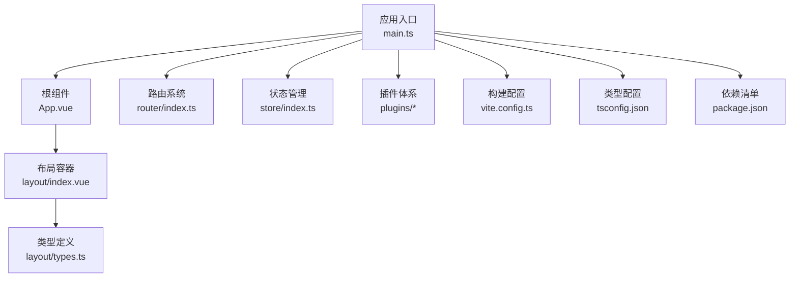
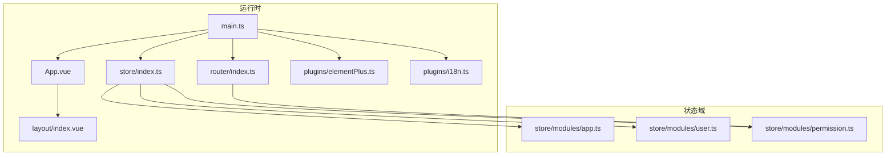
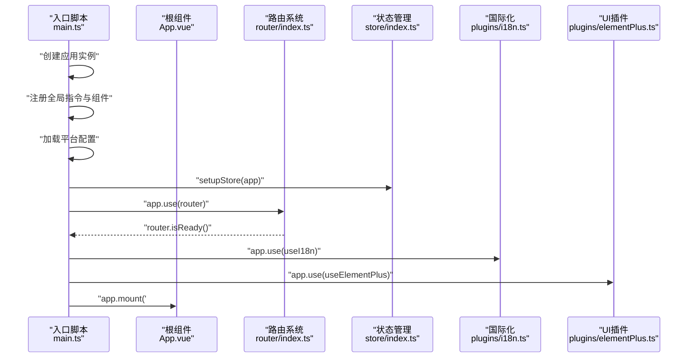
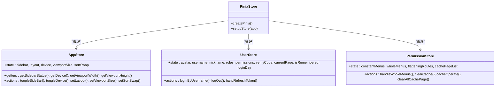
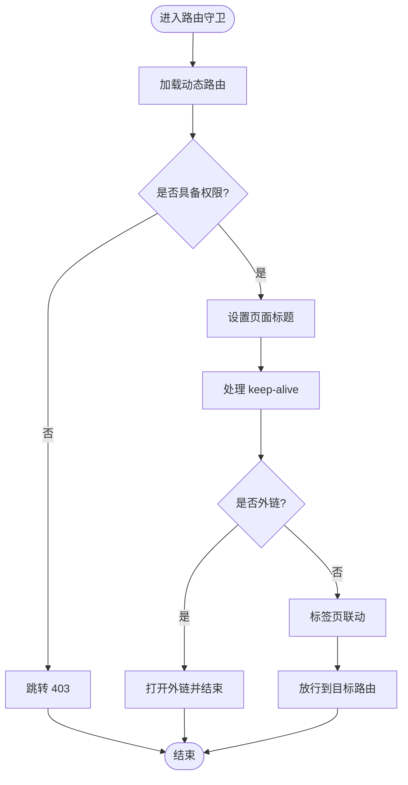
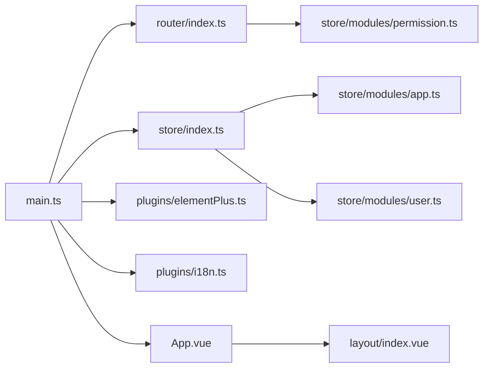

# 前端架构设计

<cite>
**本文引用的文件**
- [main.ts](file://web/src/main.ts)
- [App.vue](file://web/src/App.vue)
- [router/index.ts](file://web/src/router/index.ts)
- [store/index.ts](file://web/src/store/index.ts)
- [store/modules/app.ts](file://web/src/store/modules/app.ts)
- [store/modules/user.ts](file://web/src/store/modules/user.ts)
- [store/modules/permission.ts](file://web/src/store/modules/permission.ts)
- [plugins/elementPlus.ts](file://web/src/plugins/elementPlus.ts)
- [plugins/i18n.ts](file://web/src/plugins/i18n.ts)
- [layout/index.vue](file://web/src/layout/index.vue)
- [layout/types.ts](file://web/src/layout/types.ts)
- [directives/index.ts](file://web/src/directives/index.ts)
- [vite.config.ts](file://web/vite.config.ts)
- [tsconfig.json](file://web/tsconfig.json)
- [package.json](file://web/package.json)
</cite>

## 更新摘要
**所做更改**
- 更新了项目结构描述，反映移除了大量演示组件和路由模块
- 修改了核心组件分析，强调简化后的核心系统管理功能
- 更新了路由系统设计，说明简化后的路由结构
- 调整了性能考量部分，突出架构简化带来的性能提升
- 更新了故障排查指南，针对简化后的架构特点

## 目录
1. [引言](#引言)
2. [项目结构](#项目结构)
3. [核心组件](#核心组件)
4. [架构总览](#架构总览)
5. [详细组件分析](#详细组件分析)
6. [依赖关系分析](#依赖关系分析)
7. [性能考量](#性能考量)
8. [故障排查指南](#故障排查指南)
9. [结论](#结论)
10. [附录](#附录)

## 引言
本文件面向 Hello-FastApi 前端（Vue 3 + TypeScript）的架构设计与实现，围绕应用入口与初始化流程、依赖注入与插件配置、组件架构与组织策略、Pinia 状态管理、路由系统与动态路由生成、Element Plus UI 集成与自定义组件开发等方面进行系统化阐述。经过重大架构简化，移除了大量演示组件和路由模块，专注于核心系统管理功能，显著提升了前端性能和可维护性。

## 项目结构
前端工程位于 web 目录，采用模块化与分层组织方式，经过简化后更加聚焦核心功能：
- 应用入口与初始化：main.ts 负责创建应用实例、全局注册插件与组件、注入响应式存储、挂载应用。
- 根组件与国际化：App.vue 提供国际化配置与全局水印控制，统一路由视图出口。
- 路由系统：router/index.ts 动态聚合 modules 下的静态路由，构建常量路由与菜单树，提供导航守卫与进度条。
- 状态管理：store/index.ts 创建 Pinia 实例；各模块（app、user、permission）按功能域拆分。
- 插件体系：plugins 提供 Element Plus、i18n、图表等插件封装。
- 布局与类型：layout/index.vue 为核心布局容器，layout/types.ts 定义路由与主题相关类型。
- 指令与工具：directives 提供权限、复制、长按等指令；vite.config.ts 与 tsconfig.json 提供构建与类型配置。

**图表来源**
- [main.ts:1-72](file://web/src/main.ts#L1-L72)
- [App.vue:1-91](file://web/src/App.vue#L1-L91)
- [router/index.ts:1-230](file://web/src/router/index.ts#L1-L230)
- [store/index.ts:1-10](file://web/src/store/index.ts#L1-L10)
- [plugins/elementPlus.ts:1-261](file://web/src/plugins/elementPlus.ts#L1-L261)
- [plugins/i18n.ts:1-117](file://web/src/plugins/i18n.ts#L1-L117)
- [layout/index.vue:1-238](file://web/src/layout/index.vue#L1-L238)
- [layout/types.ts:1-94](file://web/src/layout/types.ts#L1-L94)
- [vite.config.ts:1-73](file://web/vite.config.ts#L1-L73)
- [tsconfig.json:1-55](file://web/tsconfig.json#L1-L55)
- [package.json:1-210](file://web/package.json#L1-L210)

**章节来源**
- [main.ts:1-72](file://web/src/main.ts#L1-L72)
- [router/index.ts:1-230](file://web/src/router/index.ts#L1-L230)
- [store/index.ts:1-10](file://web/src/store/index.ts#L1-L10)
- [plugins/elementPlus.ts:1-261](file://web/src/plugins/elementPlus.ts#L1-L261)
- [plugins/i18n.ts:1-117](file://web/src/plugins/i18n.ts#L1-L117)
- [layout/index.vue:1-238](file://web/src/layout/index.vue#L1-L238)
- [layout/types.ts:1-94](file://web/src/layout/types.ts#L1-L94)
- [vite.config.ts:1-73](file://web/vite.config.ts#L1-L73)
- [tsconfig.json:1-55](file://web/tsconfig.json#L1-L55)
- [package.json:1-210](file://web/package.json#L1-L210)

## 核心组件
- 应用入口与初始化：负责创建应用实例、注册全局指令与组件、注入平台配置、安装路由与插件、挂载根节点。
- 根组件与国际化：提供 Element Plus 国际化合并、全局对话框/抽屉组件、路由前置钩子清理弹窗、水印逻辑。
- 路由系统：自动扫描 modules 下的静态路由，构建两阶段路由树，提供导航守卫、标题国际化、动态路由注入、标签页联动。
- Pinia 状态管理：按域划分 store 模块，统一通过 setupStore 注入，提供应用状态、用户会话、权限菜单与缓存页集合。
- 插件体系：Element Plus 按需注册组件与插件；i18n 支持多语言与动态标题转换；图表、表格等第三方插件封装。
- 布局容器：根据设备与屏幕宽度切换布局模式，统一头部、侧边栏、内容区与设置面板。
- 类型系统：集中定义路由、菜单、标签页、主题色等类型，确保强类型约束。

**章节来源**
- [main.ts:1-72](file://web/src/main.ts#L1-L72)
- [App.vue:1-91](file://web/src/App.vue#L1-L91)
- [router/index.ts:1-230](file://web/src/router/index.ts#L1-L230)
- [store/index.ts:1-10](file://web/src/store/index.ts#L1-L10)
- [store/modules/app.ts:1-91](file://web/src/store/modules/app.ts#L1-L91)
- [store/modules/user.ts:1-128](file://web/src/store/modules/user.ts#L1-L128)
- [store/modules/permission.ts:1-76](file://web/src/store/modules/permission.ts#L1-L76)
- [plugins/elementPlus.ts:1-261](file://web/src/plugins/elementPlus.ts#L1-L261)
- [plugins/i18n.ts:1-117](file://web/src/plugins/i18n.ts#L1-L117)
- [layout/index.vue:1-238](file://web/src/layout/index.vue#L1-L238)
- [layout/types.ts:1-94](file://web/src/layout/types.ts#L1-L94)

## 架构总览
前端采用"入口初始化 + 插件体系 + 路由 + 状态管理 + 布局容器"的分层架构，结合 Vite 构建与 TypeScript 类型系统，形成高内聚、低耦合的现代化前端框架。经过简化后，架构更加精简高效，专注于核心系统管理功能。

**图表来源**
- [main.ts:1-72](file://web/src/main.ts#L1-L72)
- [App.vue:1-91](file://web/src/App.vue#L1-L91)
- [layout/index.vue:1-238](file://web/src/layout/index.vue#L1-L238)
- [router/index.ts:1-230](file://web/src/router/index.ts#L1-L230)
- [store/index.ts:1-10](file://web/src/store/index.ts#L1-L10)
- [store/modules/app.ts:1-91](file://web/src/store/modules/app.ts#L1-L91)
- [store/modules/user.ts:1-128](file://web/src/store/modules/user.ts#L1-L128)
- [store/modules/permission.ts:1-76](file://web/src/store/modules/permission.ts#L1-L76)
- [plugins/elementPlus.ts:1-261](file://web/src/plugins/elementPlus.ts#L1-L261)
- [plugins/i18n.ts:1-117](file://web/src/plugins/i18n.ts#L1-L117)

## 详细组件分析

### 应用入口与初始化流程
- 创建应用实例并导入公共样式与图标资源。
- 全局注册自定义指令与常用组件（图标、权限组件、弹窗/抽屉）。
- 平台配置异步加载后，安装路由、Pinia、国际化、Element Plus、表格与图表插件，最后挂载。
- 路由在安装前完成就绪，避免首屏路由异常。

**图表来源**
- [main.ts:1-72](file://web/src/main.ts#L1-L72)
- [router/index.ts:1-230](file://web/src/router/index.ts#L1-L230)
- [store/index.ts:1-10](file://web/src/store/index.ts#L1-L10)
- [plugins/i18n.ts:1-117](file://web/src/plugins/i18n.ts#L1-L117)
- [plugins/elementPlus.ts:1-261](file://web/src/plugins/elementPlus.ts#L1-L261)

**章节来源**
- [main.ts:1-72](file://web/src/main.ts#L1-L72)

### 组件架构设计原则与组织策略
- 分层清晰：入口负责装配，根组件负责国际化与全局行为，布局容器负责页面骨架，视图层负责业务页面。
- 指令与组件：通过 directives/index.ts 统一导出指令，减少重复注册；自定义组件集中于 components 目录并通过 index.ts 汇总导出。
- 响应式与可访问性：App.vue 在路由切换时清理弹窗与抽屉，避免状态泄漏；国际化通过 Element Plus 与项目本地化文件合并。
- 类型约束：layout/types.ts 定义路由、菜单、标签页与主题相关类型，保证数据结构一致性。

**章节来源**
- [App.vue:1-91](file://web/src/App.vue#L1-L91)
- [directives/index.ts:1-7](file://web/src/directives/index.ts#L1-L7)
- [layout/types.ts:1-94](file://web/src/layout/types.ts#L1-L94)

### Pinia 状态管理实现与使用模式
- store/index.ts 创建 Pinia 实例并通过 setupStore 注入应用。
- app 模块：管理侧边栏状态、布局模式、设备类型、视口尺寸等。
- user 模块：管理用户信息、角色与权限、登录状态、免登录配置与 Token 刷新。
- permission 模块：维护静态与动态菜单、扁平化路由、缓存页面集合，并与标签页联动。

**图表来源**
- [store/index.ts:1-10](file://web/src/store/index.ts#L1-L10)
- [store/modules/app.ts:1-91](file://web/src/store/modules/app.ts#L1-L91)
- [store/modules/user.ts:1-128](file://web/src/store/modules/user.ts#L1-L128)
- [store/modules/permission.ts:1-76](file://web/src/store/modules/permission.ts#L1-L76)

**章节来源**
- [store/index.ts:1-10](file://web/src/store/index.ts#L1-L10)
- [store/modules/app.ts:1-91](file://web/src/store/modules/app.ts#L1-L91)
- [store/modules/user.ts:1-128](file://web/src/store/modules/user.ts#L1-L128)
- [store/modules/permission.ts:1-76](file://web/src/store/modules/permission.ts#L1-L76)

### 路由系统设计原理与动态路由生成机制
- 静态路由聚合：通过 import.meta.glob 自动扫描 modules 下的路由模块（排除 remaining.ts），扁平化后构建层级树，再拍平为两级路由。
- 常量路由与菜单：constantRoutes 用于渲染与导航；constantMenus 保留原始层级；remainingPaths 用于白名单与错误页。
- 导航守卫：在 beforeEach 中处理进度条、keep-alive 生命周期、标题国际化、权限校验、外部链接打开、动态路由注入与标签页联动。
- 路由重置：resetRouter 用于登出或切换账号时恢复初始路由状态。

**图表来源**
- [router/index.ts:123-222](file://web/src/router/index.ts#L123-L222)

**章节来源**
- [router/index.ts:1-230](file://web/src/router/index.ts#L1-L230)

### Element Plus UI 组件库集成与自定义组件开发
- 按需引入：plugins/elementPlus.ts 按需注册 Element Plus 组件与插件，避免全量引入造成体积膨胀。
- 全局注册：在 main.ts 中通过 useElementPlus(app) 完成全局注册，确保任意组件可直接使用。
- 自定义组件：components 目录下提供 Re* 前缀的通用组件（如 ReAuth、ReDialog、ReDrawer 等），通过 index.ts 汇总导出，便于全局注册与复用。

**章节来源**
- [plugins/elementPlus.ts:1-261](file://web/src/plugins/elementPlus.ts#L1-L261)
- [main.ts:45-49](file://web/src/main.ts#L45-L49)

### 国际化与多语言支持
- 多源合并：plugins/i18n.ts 合并 Element Plus 与项目本地化 YAML 文件，支持 zh/en 双语。
- 动态标题：transformI18n 支持从路由 meta.title 中提取并进行国际化转换。
- 存储与回退：locale 优先从本地存储读取，否则回退至默认语言。

**章节来源**
- [plugins/i18n.ts:1-117](file://web/src/plugins/i18n.ts#L1-L117)
- [router/index.ts:142-146](file://web/src/router/index.ts#L142-L146)
- [App.vue:36-40](file://web/src/App.vue#L36-L40)

### 布局容器与响应式设计
- 布局模式：layout/index.vue 根据设备与宽度自动切换 vertical/mix/horizontal 等布局模式。
- 侧边栏折叠：移动端自动隐藏，桌面端在不同宽度区间执行折叠/展开策略。
- 主题与暗色：通过 useDataThemeChange 初始化主题模式，支持暗色与亮色切换。
- 标签页与头部：统一头部组件、侧边栏与内容区，支持固定头部与返回顶部。

**章节来源**
- [layout/index.vue:1-238](file://web/src/layout/index.vue#L1-L238)
- [layout/types.ts:1-94](file://web/src/layout/types.ts#L1-L94)

## 依赖关系分析
- 入口依赖：main.ts 依赖 router、store、plugins、directives、components、App.vue。
- 路由依赖：router/index.ts 依赖 utils 工具、权限 store、标签页 store、进度条与 Cookie。
- 状态依赖：各 store 模块相互解耦，permission 与 user 与 router 协作完成动态路由与权限控制。
- 插件依赖：plugins 作为应用级装配层，被 main.ts 统一安装。
- 构建与类型：vite.config.ts 与 tsconfig.json 为开发与生产提供统一的构建与类型约束。

**图表来源**
- [main.ts:1-72](file://web/src/main.ts#L1-L72)
- [router/index.ts:1-230](file://web/src/router/index.ts#L1-L230)
- [store/index.ts:1-10](file://web/src/store/index.ts#L1-L10)
- [store/modules/app.ts:1-91](file://web/src/store/modules/app.ts#L1-L91)
- [store/modules/user.ts:1-128](file://web/src/store/modules/user.ts#L1-L128)
- [store/modules/permission.ts:1-76](file://web/src/store/modules/permission.ts#L1-L76)
- [plugins/elementPlus.ts:1-261](file://web/src/plugins/elementPlus.ts#L1-L261)
- [plugins/i18n.ts:1-117](file://web/src/plugins/i18n.ts#L1-L117)
- [App.vue:1-91](file://web/src/App.vue#L1-L91)
- [layout/index.vue:1-238](file://web/src/layout/index.vue#L1-L238)

**章节来源**
- [main.ts:1-72](file://web/src/main.ts#L1-L72)
- [router/index.ts:1-230](file://web/src/router/index.ts#L1-L230)
- [store/index.ts:1-10](file://web/src/store/index.ts#L1-L10)
- [store/modules/app.ts:1-91](file://web/src/store/modules/app.ts#L1-L91)
- [store/modules/user.ts:1-128](file://web/src/store/modules/user.ts#L1-L128)
- [store/modules/permission.ts:1-76](file://web/src/store/modules/permission.ts#L1-L76)
- [plugins/elementPlus.ts:1-261](file://web/src/plugins/elementPlus.ts#L1-L261)
- [plugins/i18n.ts:1-117](file://web/src/plugins/i18n.ts#L1-L117)
- [App.vue:1-91](file://web/src/App.vue#L1-L91)
- [layout/index.vue:1-238](file://web/src/layout/index.vue#L1-L238)

## 性能考量
- 依赖预优化：vite.config.ts 中 optimizeDeps.include/exclude 控制预打包，提升冷启动速度。
- 构建产物：chunkSizeWarningLimit 提升体积阈值，静态资源按目录分包，减少首屏阻塞。
- 路由懒加载：通过 import.meta.glob 自动扫描模块，结合 keep-alive 与标签页缓存减少重复渲染。
- 图标与样式：按需引入 Element Plus 组件，避免全局样式污染；Tailwind CSS 与 SCSS 分离，减少热更新范围。
- 国际化：transformI18n 对嵌套键进行缓存，减少重复解析。
- 架构简化：移除大量演示组件和路由模块后，显著减少了代码体积和运行时开销，提升了整体性能。

**章节来源**
- [vite.config.ts:35-73](file://web/vite.config.ts#L35-L73)
- [plugins/elementPlus.ts:129-239](file://web/src/plugins/elementPlus.ts#L129-L239)
- [plugins/i18n.ts:62-70](file://web/src/plugins/i18n.ts#L62-L70)

## 故障排查指南
- 路由白名单与权限：若出现无法访问页面，检查 whiteList 与角色权限匹配逻辑，确认动态路由是否已注入。
- 标题国际化：若页面标题未生效，检查 meta.title 是否为对象或字符串，确认 transformI18n 的键是否存在。
- 弹窗与抽屉残留：若切换路由后弹窗未关闭，确认 App.vue 路由前置钩子是否正确清理。
- 国际化语言：若语言未切换，检查本地存储中的 locale 键与 fallbackLocale 配置。
- Element Plus 组件不可用：确认 plugins/elementPlus.ts 是否按需注册对应组件，main.ts 是否调用 useElementPlus(app)。
- 架构简化影响：由于移除了演示组件，某些路由可能不再可用，需要检查路由配置和权限设置。

**章节来源**
- [router/index.ts:119-222](file://web/src/router/index.ts#L119-L222)
- [plugins/i18n.ts:77-99](file://web/src/plugins/i18n.ts#L77-L99)
- [App.vue:42-60](file://web/src/App.vue#L42-L60)
- [plugins/elementPlus.ts:251-260](file://web/src/plugins/elementPlus.ts#L251-L260)

## 结论
本架构以 Vue 3 + TypeScript 为基础，结合 Pinia、Vue Router、Element Plus 与 Vite，实现了模块化、可扩展、高性能的前端工程化方案。经过重大简化后，移除了大量演示组件和路由模块，专注于核心系统管理功能，显著提升了前端性能和可维护性。通过入口装配、动态路由、状态域拆分与布局容器，开发者可以快速迭代核心功能并保持代码质量。建议在后续扩展中持续遵循"按域拆分状态""按需引入组件""统一类型约束"的原则，以获得更好的可维护性与性能表现。

## 附录
- 构建与运行：参考 package.json 中 scripts，使用 pnpm dev/build 进行开发与生产构建。
- 类型增强：tsconfig.json 中配置路径别名与类型声明，确保 IDE 与编译器正确识别模块与第三方类型。

**章节来源**
- [package.json:6-23](file://web/package.json#L6-L23)
- [tsconfig.json:25-40](file://web/tsconfig.json#L25-L40)