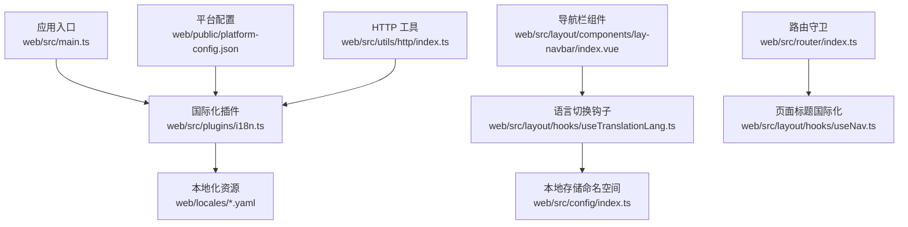
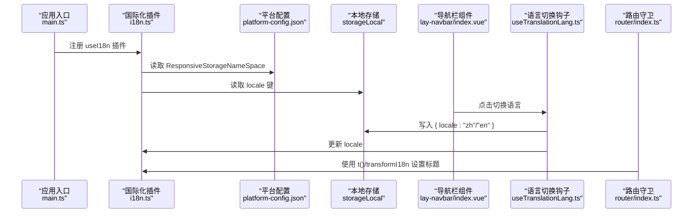
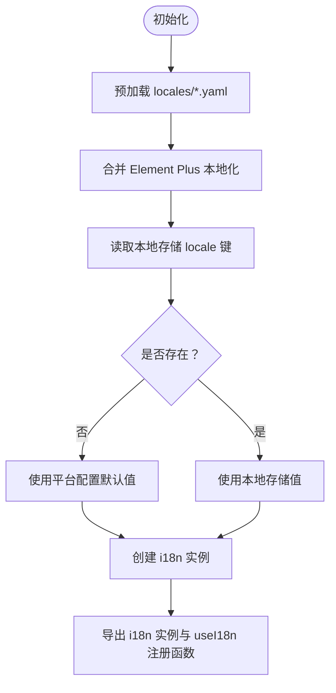
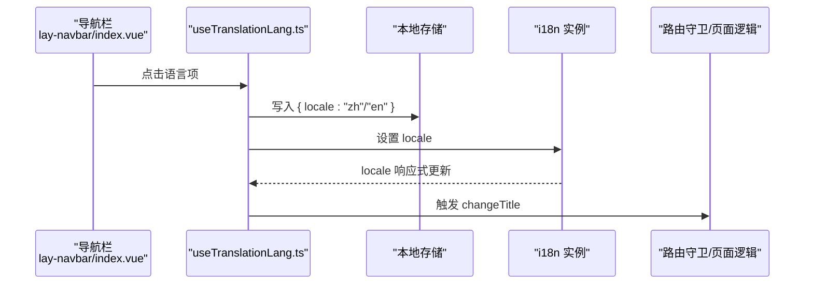
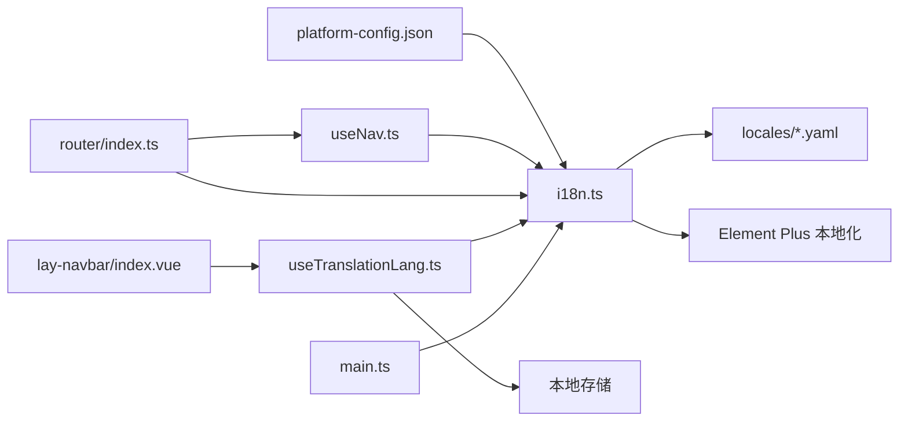

# 国际化系统

<cite>
**本文引用的文件**
- [web/src/plugins/i18n.ts](file://web/src/plugins/i18n.ts)
- [web/locales/en.yaml](file://web/locales/en.yaml)
- [web/locales/zh-CN.yaml](file://web/locales/zh-CN.yaml)
- [web/src/layout/hooks/useTranslationLang.ts](file://web/src/layout/hooks/useTranslationLang.ts)
- [web/src/main.ts](file://web/src/main.ts)
- [web/src/config/index.ts](file://web/src/config/index.ts)
- [web/src/layout/components/lay-navbar/index.vue](file://web/src/layout/components/lay-navbar/index.vue)
- [web/src/layout/hooks/useNav.ts](file://web/src/layout/hooks/useNav.ts)
- [web/src/router/index.ts](file://web/src/router/index.ts)
- [web/public/platform-config.json](file://web/public/platform-config.json)
- [web/src/utils/http/index.ts](file://web/src/utils/http/index.ts)
</cite>

## 目录
1. [简介](#简介)
2. [项目结构](#项目结构)
3. [核心组件](#核心组件)
4. [架构总览](#架构总览)
5. [详细组件分析](#详细组件分析)
6. [依赖关系分析](#依赖关系分析)
7. [性能考量](#性能考量)
8. [故障排查指南](#故障排查指南)
9. [结论](#结论)
10. [附录](#附录)

## 简介
本文件面向前端国际化系统，围绕 Vue I18n 的集成与配置、多语言资源组织与 YAML 格式、语言切换机制与本地化存储策略、文本翻译与插值使用、动态语言加载与按需翻译、最佳实践与资源管理策略等方面进行全面说明。目标是帮助开发者快速理解并扩展该系统的国际化能力，构建支持多语言的前端应用。

## 项目结构
国际化相关的核心位置如下：
- 插件与配置：web/src/plugins/i18n.ts
- 多语言资源：web/locales/*.yaml
- 语言切换钩子：web/src/layout/hooks/useTranslationLang.ts
- 应用入口注册：web/src/main.ts
- 配置与命名空间：web/src/config/index.ts
- 导航栏语言切换 UI：web/src/layout/components/lay-navbar/index.vue
- 页面标题国际化：web/src/layout/hooks/useNav.ts、web/src/router/index.ts
- 平台配置（含默认 Locale）：web/public/platform-config.json
- 国际化在业务中的使用示例：web/src/utils/http/index.ts

图表来源
- [web/src/main.ts:62-69](file://web/src/main.ts#L62-L69)
- [web/src/plugins/i18n.ts:104-112](file://web/src/plugins/i18n.ts#L104-L112)
- [web/src/layout/components/lay-navbar/index.vue:32](file://web/src/layout/components/lay-navbar/index.vue#L32)
- [web/src/layout/hooks/useTranslationLang.ts:8](file://web/src/layout/hooks/useTranslationLang.ts#L8)
- [web/src/config/index.ts:52-55](file://web/src/config/index.ts#L52-L55)
- [web/src/router/index.ts:140-146](file://web/src/router/index.ts#L140-L146)
- [web/src/layout/hooks/useNav.ts:92-97](file://web/src/layout/hooks/useNav.ts#L92-L97)
- [web/public/platform-config.json:8](file://web/public/platform-config.json#L8)
- [web/src/utils/http/index.ts:98](file://web/src/utils/http/index.ts#L98)

章节来源
- [web/src/main.ts:62-69](file://web/src/main.ts#L62-L69)
- [web/src/plugins/i18n.ts:104-112](file://web/src/plugins/i18n.ts#L104-L112)
- [web/locales/en.yaml:1-265](file://web/locales/en.yaml#L1-L265)
- [web/locales/zh-CN.yaml:1-265](file://web/locales/zh-CN.yaml#L1-L265)
- [web/src/layout/hooks/useTranslationLang.ts:6-41](file://web/src/layout/hooks/useTranslationLang.ts#L6-L41)
- [web/src/layout/components/lay-navbar/index.vue:32](file://web/src/layout/components/lay-navbar/index.vue#L32)
- [web/src/layout/hooks/useNav.ts:92-97](file://web/src/layout/hooks/useNav.ts#L92-L97)
- [web/src/router/index.ts:140-146](file://web/src/router/index.ts#L140-L146)
- [web/public/platform-config.json:8](file://web/public/platform-config.json#L8)
- [web/src/utils/http/index.ts:98](file://web/src/utils/http/index.ts#L98)

## 核心组件
- 国际化插件与配置
  - 使用 Vue I18n 创建实例，启用组合式 API（legacy: false），fallbackLocale 设为英文，messages 通过 localesConfigs 注入。
  - 通过 import.meta.glob 预加载 locales 目录下的 YAML 文件，按语言前缀聚合。
  - 提供 transformI18n 工具函数，支持对象形式的多语言字段与扁平键查找。
  - 提供 $t 辅助函数用于 IDE 提示（无运行时翻译逻辑）。
- 本地化资源
  - 英文与中文两套 YAML 文件，采用层级键结构，便于维护与查找。
- 语言切换钩子
  - useTranslationLang 提供 zh/en 切换方法，写入本地存储并更新 i18n.locale。
  - 监听 locale 变化以刷新页面标题。
- 应用入口注册
  - 在 main.ts 中注册 useI18n 插件，确保全局可用。
- 配置与命名空间
  - responsiveStorageNameSpace 从平台配置中读取，用于本地存储键的命名空间。
- 导航栏语言切换 UI
  - 导航栏右上角提供下拉菜单，点击切换语言并高亮当前语言。
- 页面标题国际化
  - 路由守卫与 useNav 的 changeTitle 方法结合 transformI18n 实现页面标题的国际化。
- 平台配置
  - platform-config.json 中的 Locale 字段作为初始语言的默认值来源之一。
- 国际化在业务中的使用
  - HTTP 工具在错误场景中使用 $t 与 transformI18n 输出国际化提示。

章节来源
- [web/src/plugins/i18n.ts:104-112](file://web/src/plugins/i18n.ts#L104-L112)
- [web/src/plugins/i18n.ts:11-24](file://web/src/plugins/i18n.ts#L11-L24)
- [web/src/plugins/i18n.ts:77-99](file://web/src/plugins/i18n.ts#L77-L99)
- [web/src/plugins/i18n.ts:101-102](file://web/src/plugins/i18n.ts#L101-L102)
- [web/src/main.ts:62-69](file://web/src/main.ts#L62-L69)
- [web/src/config/index.ts:52-55](file://web/src/config/index.ts#L52-L55)
- [web/src/layout/hooks/useTranslationLang.ts:6-41](file://web/src/layout/hooks/useTranslationLang.ts#L6-L41)
- [web/src/layout/components/lay-navbar/index.vue:32](file://web/src/layout/components/lay-navbar/index.vue#L32)
- [web/src/layout/hooks/useNav.ts:92-97](file://web/src/layout/hooks/useNav.ts#L92-L97)
- [web/src/router/index.ts:140-146](file://web/src/router/index.ts#L140-L146)
- [web/public/platform-config.json:8](file://web/public/platform-config.json#L8)
- [web/src/utils/http/index.ts:98](file://web/src/utils/http/index.ts#L98)

## 架构总览
下图展示了国际化系统在应用中的整体交互流程：应用启动时注册插件，读取平台配置与本地存储确定初始语言；导航栏触发语言切换，更新本地存储与 i18n.locale；路由守卫与页面逻辑通过 transformI18n 实现标题与文案的国际化。

图表来源
- [web/src/main.ts:62-69](file://web/src/main.ts#L62-L69)
- [web/src/plugins/i18n.ts:104-112](file://web/src/plugins/i18n.ts#L104-L112)
- [web/public/platform-config.json:8](file://web/public/platform-config.json#L8)
- [web/src/layout/components/lay-navbar/index.vue:32](file://web/src/layout/components/lay-navbar/index.vue#L32)
- [web/src/layout/hooks/useTranslationLang.ts:11-21](file://web/src/layout/hooks/useTranslationLang.ts#L11-L21)
- [web/src/router/index.ts:140-146](file://web/src/router/index.ts#L140-L146)

## 详细组件分析

### 组件一：国际化插件与配置（i18n.ts）
- 预加载与聚合
  - 使用 import.meta.glob 预加载 locales 目录下所有 YAML 文件，按文件名提取语言前缀并缓存。
  - 通过 siphonI18n(prefix) 返回对应语言的资源对象。
- 消息合并
  - localesConfigs 将各语言的本地资源与 Element Plus 的本地化资源合并，保证 UI 组件文案也国际化。
- 本地化存储与回退
  - locale 从本地存储读取，若不存在则回退到配置中的默认值；fallbackLocale 设为英文。
- 工具函数
  - transformI18n：支持对象形式的多语言字段（如 {zh: "...", en: "..."}）、扁平键查找与兜底返回原值。
  - $t：仅为 IDE 提示服务，不执行实际翻译。

图表来源
- [web/src/plugins/i18n.ts:11-24](file://web/src/plugins/i18n.ts#L11-L24)
- [web/src/plugins/i18n.ts:26-35](file://web/src/plugins/i18n.ts#L26-L35)
- [web/src/plugins/i18n.ts:104-112](file://web/src/plugins/i18n.ts#L104-L112)
- [web/public/platform-config.json:8](file://web/public/platform-config.json#L8)

章节来源
- [web/src/plugins/i18n.ts:11-24](file://web/src/plugins/i18n.ts#L11-L24)
- [web/src/plugins/i18n.ts:26-35](file://web/src/plugins/i18n.ts#L26-L35)
- [web/src/plugins/i18n.ts:104-112](file://web/src/plugins/i18n.ts#L104-L112)
- [web/public/platform-config.json:8](file://web/public/platform-config.json#L8)

### 组件二：多语言资源组织与 YAML 格式
- 资源文件
  - 英文：web/locales/en.yaml
  - 中文：web/locales/zh-CN.yaml
- 结构特点
  - 采用层级键（如 buttons、search、panel 等），便于分类与查找。
  - 键名统一，便于在代码中通过 t("...") 或 transformI18n 使用。
- 维护建议
  - 新增语言时，新增对应 YAML 文件并保持键名一致。
  - 对于复杂文案，建议拆分为多个键，避免长句导致维护困难。

章节来源
- [web/locales/en.yaml:1-265](file://web/locales/en.yaml#L1-L265)
- [web/locales/zh-CN.yaml:1-265](file://web/locales/zh-CN.yaml#L1-L265)

### 组件三：语言切换机制与本地化存储策略
- 切换流程
  - 导航栏点击触发 useTranslationLang 的 translationCh/translationEn。
  - 写入本地存储键（命名空间来自平台配置），同时更新 i18n.global.locale。
  - 监听 locale 变化，调用 changeTitle 刷新页面标题。
- 存储策略
  - 使用 storageLocal 与 responsiveStorageNameSpace 组合生成稳定键名，避免冲突。
  - 切换语言后立即生效，无需刷新页面。

图表来源
- [web/src/layout/components/lay-navbar/index.vue:62-87](file://web/src/layout/components/lay-navbar/index.vue#L62-L87)
- [web/src/layout/hooks/useTranslationLang.ts:11-21](file://web/src/layout/hooks/useTranslationLang.ts#L11-L21)
- [web/src/layout/hooks/useTranslationLang.ts:23-28](file://web/src/layout/hooks/useTranslationLang.ts#L23-L28)
- [web/src/layout/hooks/useNav.ts:92-97](file://web/src/layout/hooks/useNav.ts#L92-L97)

章节来源
- [web/src/layout/components/lay-navbar/index.vue:62-87](file://web/src/layout/components/lay-navbar/index.vue#L62-L87)
- [web/src/layout/hooks/useTranslationLang.ts:6-41](file://web/src/layout/hooks/useTranslationLang.ts#L6-L41)
- [web/src/layout/hooks/useNav.ts:92-97](file://web/src/layout/hooks/useNav.ts#L92-L97)
- [web/src/config/index.ts:52-55](file://web/src/config/index.ts#L52-L55)

### 组件四：文本翻译的使用方法与插值表达式
- 使用 $t 与 t
  - $t 用于 IDE 提示，配合 i18n Ally 插件提升开发体验。
  - t 为 i18n 的翻译函数，结合 transformI18n 可处理对象与扁平键。
- 插值与复数
  - Vue I18n 支持插值与复数规则，可在 YAML 中定义占位符并在模板或 JS 中传参。
  - 若需更复杂的本地化规则，可在 transformI18n 或业务层扩展。
- 示例场景
  - 导航栏菜单项、按钮文案、登录表单提示、HTTP 错误提示等均通过 $t/t 与 transformI18n 实现。

章节来源
- [web/src/plugins/i18n.ts:101-102](file://web/src/plugins/i18n.ts#L101-L102)
- [web/src/utils/http/index.ts:98](file://web/src/utils/http/index.ts#L98)

### 组件五：动态语言加载与按需翻译
- 预加载策略
  - 通过 import.meta.glob 在构建期预加载 locales 目录下的 YAML，减少运行时网络请求。
- 按需翻译
  - transformI18n 支持对象形式的多语言字段与扁平键查找，避免硬编码语言键。
- 扩展建议
  - 如需运行时动态加载，可基于 fetch 或异步模块加载器实现懒加载，但需考虑缓存与回退策略。

章节来源
- [web/src/plugins/i18n.ts:11-24](file://web/src/plugins/i18n.ts#L11-L24)
- [web/src/plugins/i18n.ts:77-99](file://web/src/plugins/i18n.ts#L77-L99)

### 组件六：页面标题国际化
- 路由守卫
  - 在路由进入时，使用 transformI18n 与 i18n.t 对 meta.title 进行国际化，并拼接全局标题。
- 页面逻辑
  - useNav 的 changeTitle 方法同样使用 transformI18n，确保动态标题一致化。

章节来源
- [web/src/router/index.ts:140-146](file://web/src/router/index.ts#L140-L146)
- [web/src/layout/hooks/useNav.ts:92-97](file://web/src/layout/hooks/useNav.ts#L92-L97)

## 依赖关系分析
- 组件耦合
  - i18n.ts 与 locales/*.yaml 为强耦合，键名一致性决定翻译可用性。
  - useTranslationLang.ts 依赖 useNav 的 changeTitle 与本地存储。
  - main.ts 依赖 i18n.ts 的 useI18n 注册。
  - router/index.ts 与 useNav.ts 依赖 transformI18n。
- 外部依赖
  - Element Plus 本地化资源与 i18n 合并。
  - 平台配置提供命名空间与默认 Locale。

图表来源
- [web/src/plugins/i18n.ts:26-35](file://web/src/plugins/i18n.ts#L26-L35)
- [web/src/main.ts:62-69](file://web/src/main.ts#L62-L69)
- [web/src/layout/components/lay-navbar/index.vue:32](file://web/src/layout/components/lay-navbar/index.vue#L32)
- [web/src/layout/hooks/useTranslationLang.ts:8](file://web/src/layout/hooks/useTranslationLang.ts#L8)
- [web/src/router/index.ts:140-146](file://web/src/router/index.ts#L140-L146)
- [web/src/layout/hooks/useNav.ts:92-97](file://web/src/layout/hooks/useNav.ts#L92-L97)
- [web/public/platform-config.json:8](file://web/public/platform-config.json#L8)

章节来源
- [web/src/plugins/i18n.ts:26-35](file://web/src/plugins/i18n.ts#L26-L35)
- [web/src/main.ts:62-69](file://web/src/main.ts#L62-L69)
- [web/src/layout/components/lay-navbar/index.vue:32](file://web/src/layout/components/lay-navbar/index.vue#L32)
- [web/src/layout/hooks/useTranslationLang.ts:8](file://web/src/layout/hooks/useTranslationLang.ts#L8)
- [web/src/router/index.ts:140-146](file://web/src/router/index.ts#L140-L146)
- [web/src/layout/hooks/useNav.ts:92-97](file://web/src/layout/hooks/useNav.ts#L92-L97)
- [web/public/platform-config.json:8](file://web/public/platform-config.json#L8)

## 性能考量
- 预加载优化
  - 构建期预加载 locales YAML，减少运行时 IO 与解析成本。
- 缓存策略
  - siphonI18n 与 keysCache 对资源与键集合进行缓存，避免重复计算。
- 本地存储
  - 语言切换写入本地存储，避免每次启动读取网络配置。
- 建议
  - 控制 YAML 文件数量与体积，必要时拆分大文件。
  - 对高频使用的键可增加二级缓存或懒加载策略。

## 故障排查指南
- 问题：页面标题未国际化
  - 排查：确认路由 meta.title 是否存在，是否正确传入 transformI18n。
  - 参考：web/src/router/index.ts 与 web/src/layout/hooks/useNav.ts。
- 问题：语言切换无效
  - 排查：检查本地存储键命名空间是否正确，useTranslationLang 是否写入与更新 locale。
  - 参考：web/src/layout/hooks/useTranslationLang.ts 与 web/src/config/index.ts。
- 问题：YAML 键缺失导致显示原文
  - 排查：确认 locales/*.yaml 中是否存在对应键，键名是否与代码一致。
  - 参考：web/locales/en.yaml 与 web/locales/zh-CN.yaml。
- 问题：Element Plus 组件文案未国际化
  - 排查：确认 localesConfigs 是否合并了 Element Plus 本地化资源。
  - 参考：web/src/plugins/i18n.ts。
- 问题：HTTP 错误提示未翻译
  - 排查：确认 $t 与 transformI18n 的使用是否正确。
  - 参考：web/src/utils/http/index.ts。

章节来源
- [web/src/router/index.ts:140-146](file://web/src/router/index.ts#L140-L146)
- [web/src/layout/hooks/useNav.ts:92-97](file://web/src/layout/hooks/useNav.ts#L92-L97)
- [web/src/layout/hooks/useTranslationLang.ts:11-21](file://web/src/layout/hooks/useTranslationLang.ts#L11-L21)
- [web/src/config/index.ts:52-55](file://web/src/config/index.ts#L52-L55)
- [web/locales/en.yaml:1-265](file://web/locales/en.yaml#L1-L265)
- [web/locales/zh-CN.yaml:1-265](file://web/locales/zh-CN.yaml#L1-L265)
- [web/src/plugins/i18n.ts:26-35](file://web/src/plugins/i18n.ts#L26-L35)
- [web/src/utils/http/index.ts:98](file://web/src/utils/http/index.ts#L98)

## 结论
该国际化系统通过 Vue I18n 与 Element Plus 本地化资源的整合，结合本地存储与预加载策略，实现了稳定高效的多语言支持。其设计具备良好的可扩展性：新增语言只需补充 YAML 文件，语言切换与页面标题国际化已在多个入口点统一处理。建议在后续迭代中进一步完善动态加载与缓存策略，并持续维护键名一致性与文案质量。

## 附录
- 最佳实践清单
  - 保持 locales/*.yaml 键名一致，避免重复与歧义。
  - 使用 transformI18n 与 $t/$t 提示配合，提升开发效率与准确性。
  - 将语言切换与页面标题国际化集中在统一钩子与路由守卫中。
  - 对高频文案进行缓存，控制资源体积与加载时间。
  - 在业务层（如 HTTP 工具）统一使用国际化提示，确保一致性。