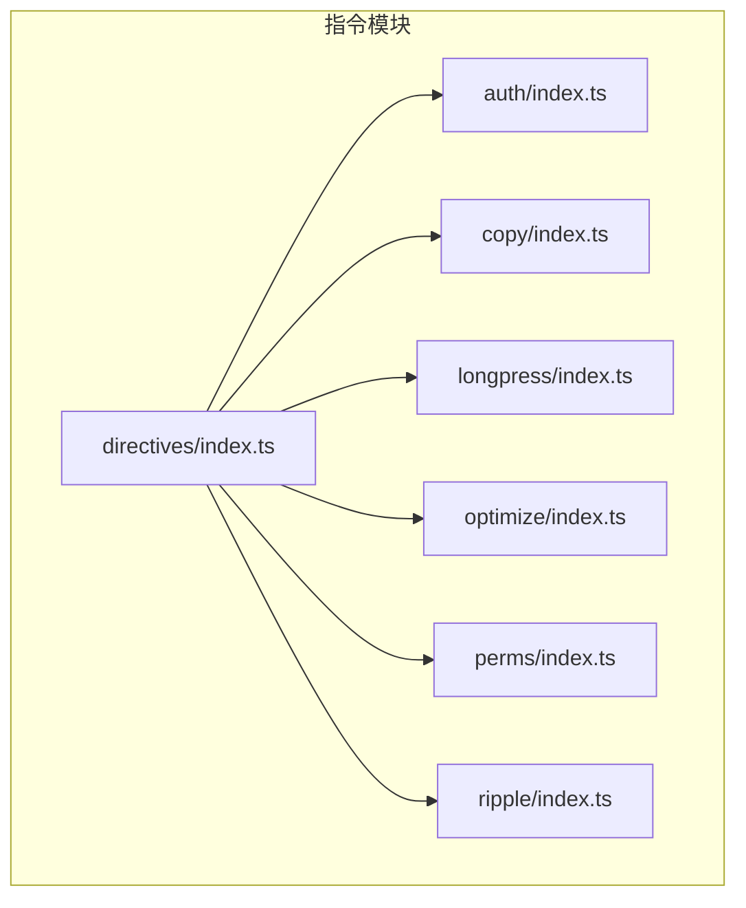
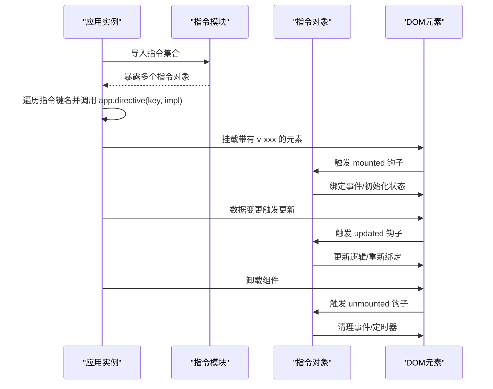
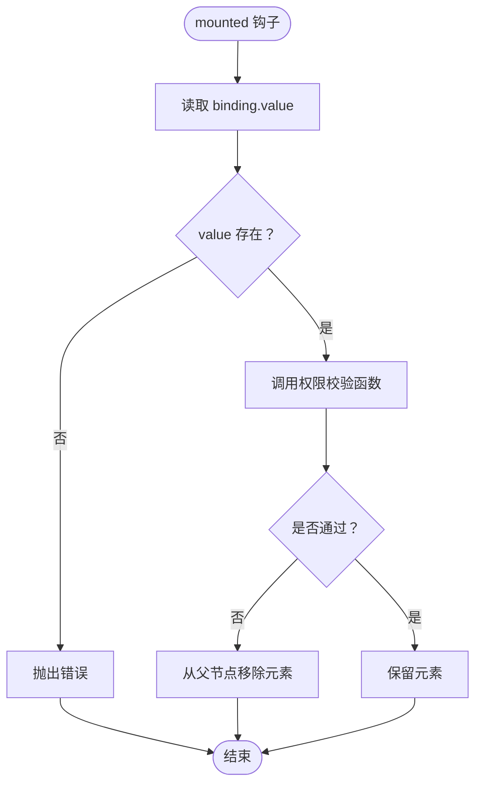
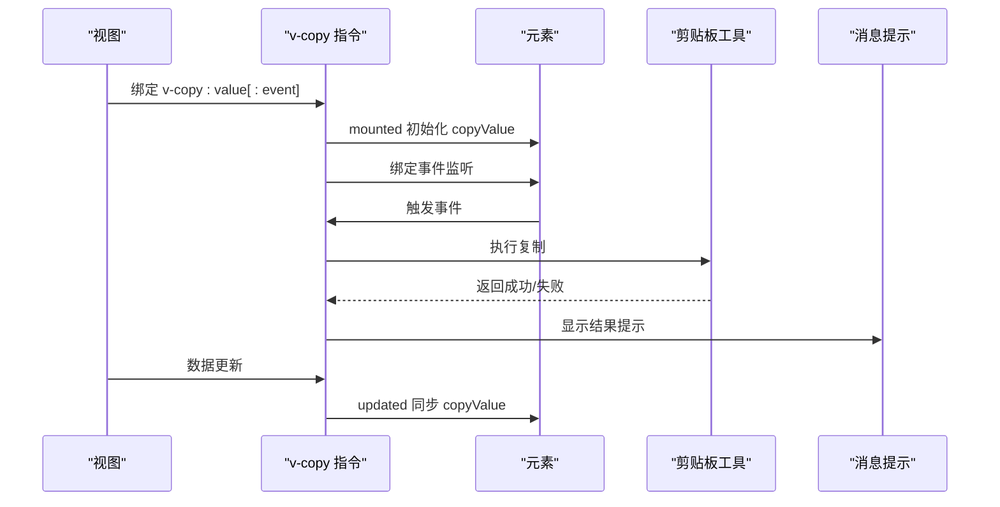
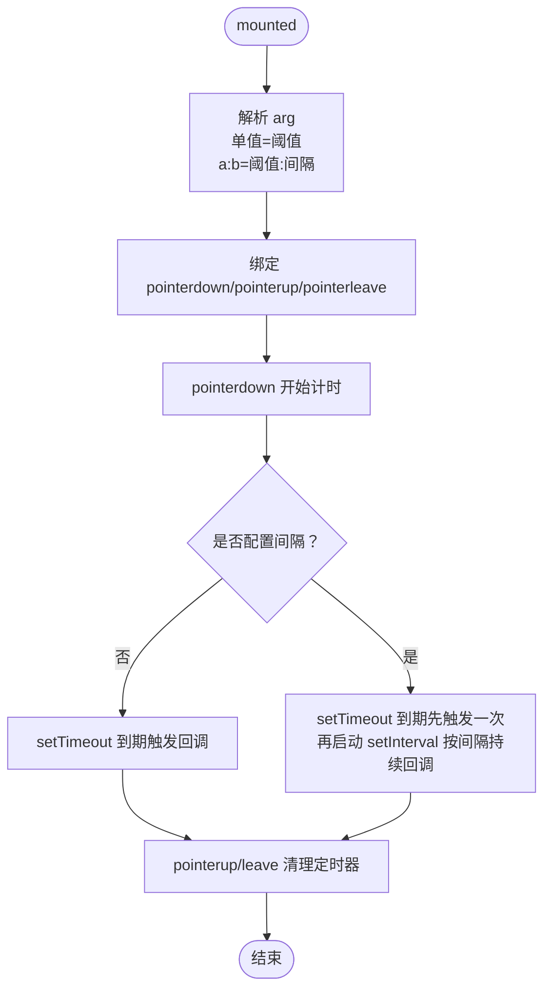
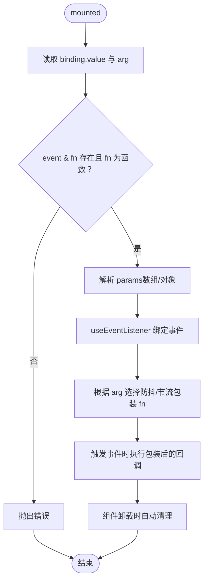
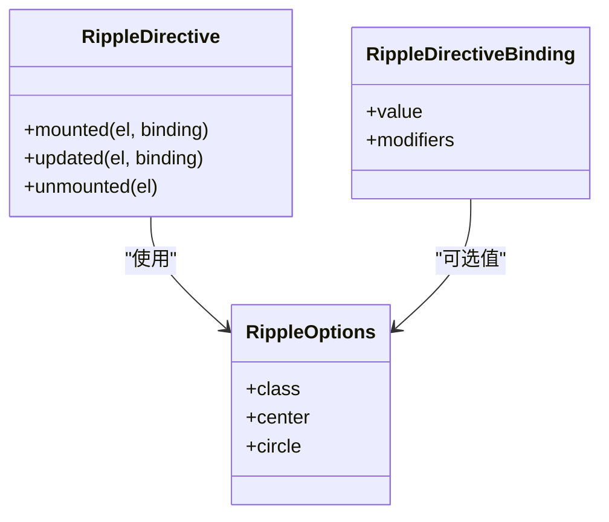
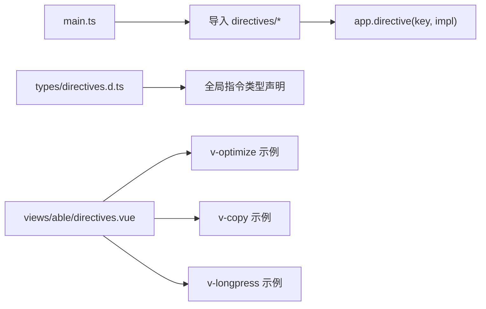

# 指令系统

<cite>
**本文引用的文件**
- [directives/index.ts](file://web/src/directives/index.ts)
- [directives/auth/index.ts](file://web/src/directives/auth/index.ts)
- [directives/copy/index.ts](file://web/src/directives/copy/index.ts)
- [directives/longpress/index.ts](file://web/src/directives/longpress/index.ts)
- [directives/optimize/index.ts](file://web/src/directives/optimize/index.ts)
- [directives/perms/index.ts](file://web/src/directives/perms/index.ts)
- [directives/ripple/index.ts](file://web/src/directives/ripple/index.ts)
- [types/directives.d.ts](file://web/types/directives.d.ts)
- [views/able/directives.vue](file://web/src/views/able/directives.vue)
- [main.ts](file://web/src/main.ts)
</cite>

## 目录
1. [简介](#简介)
2. [项目结构](#项目结构)
3. [核心组件](#核心组件)
4. [架构总览](#架构总览)
5. [详细组件分析](#详细组件分析)
6. [依赖关系分析](#依赖关系分析)
7. [性能考量](#性能考量)
8. [故障排查指南](#故障排查指南)
9. [结论](#结论)
10. [附录](#附录)

## 简介
本文件系统性梳理并讲解前端工程中的 Vue 自定义指令体系，涵盖权限指令、复制指令、长按指令、防抖/节流指令与波纹指令的设计原理与实现要点。文档将从生命周期钩子、参数与动态绑定机制、全局/局部注册方式入手，结合实际使用示例，给出最佳实践与性能优化建议，帮助开发者高效、安全地应用指令系统。

## 项目结构
指令模块集中位于 web/src/directives 下，采用“按功能分目录”的组织方式，每个指令独立导出一个 Directive 对象；通过统一入口导出并由应用在启动阶段完成全局注册。

图表来源
- [directives/index.ts:1-7](file://web/src/directives/index.ts#L1-L7)
- [directives/auth/index.ts:1-16](file://web/src/directives/auth/index.ts#L1-L16)
- [directives/copy/index.ts:1-34](file://web/src/directives/copy/index.ts#L1-L34)
- [directives/longpress/index.ts:1-64](file://web/src/directives/longpress/index.ts#L1-L64)
- [directives/optimize/index.ts:1-69](file://web/src/directives/optimize/index.ts#L1-L69)
- [directives/perms/index.ts:1-16](file://web/src/directives/perms/index.ts#L1-L16)
- [directives/ripple/index.ts:1-232](file://web/src/directives/ripple/index.ts#L1-L232)

章节来源
- [directives/index.ts:1-7](file://web/src/directives/index.ts#L1-L7)

## 核心组件
- 权限指令（v-auth）：基于路由元信息中的权限集合进行判定，未满足则移除元素。
- 权限指令（v-perms）：基于用户已授权的 permissions 判定，未满足则移除元素。
- 复制指令（v-copy）：默认双击复制，支持自定义事件触发与动态值更新。
- 长按指令（v-longpress）：支持自定义按下时长与持续回调间隔，内部管理定时器并在指针抬起/离开时清理。
- 防抖/节流指令（v-optimize[:debounce|:throttle]）：对指定事件进行防抖或节流封装，支持参数透传与立即执行。
- 波纹指令（v-ripple）：为按钮等元素提供点击波纹反馈，支持修饰符 center、circle 与自定义颜色类。

章节来源
- [directives/auth/index.ts:1-16](file://web/src/directives/auth/index.ts#L1-L16)
- [directives/perms/index.ts:1-16](file://web/src/directives/perms/index.ts#L1-L16)
- [directives/copy/index.ts:1-34](file://web/src/directives/copy/index.ts#L1-L34)
- [directives/longpress/index.ts:1-64](file://web/src/directives/longpress/index.ts#L1-L64)
- [directives/optimize/index.ts:1-69](file://web/src/directives/optimize/index.ts#L1-L69)
- [directives/ripple/index.ts:1-232](file://web/src/directives/ripple/index.ts#L1-L232)

## 架构总览
应用在启动时批量导入并注册所有指令，形成全局可用的 v-xxx 指令集。各指令在 mounted 钩子中完成事件监听绑定，在 updated 钩子中处理动态值变化，在 unmounted 钩子中清理资源，确保内存与事件不泄漏。

图表来源
- [main.ts:29-33](file://web/src/main.ts#L29-L33)
- [directives/copy/index.ts:11-33](file://web/src/directives/copy/index.ts#L11-L33)
- [directives/longpress/index.ts:5-62](file://web/src/directives/longpress/index.ts#L5-L62)
- [directives/optimize/index.ts:25-67](file://web/src/directives/optimize/index.ts#L25-L67)
- [directives/ripple/index.ts:209-225](file://web/src/directives/ripple/index.ts#L209-L225)

## 详细组件分析

### 权限指令（v-auth 与 v-perms）
- 设计目标：在渲染阶段依据权限集合决定元素是否可见，避免无意义的节点存在。
- 实现要点：
  - mounted 钩子读取 binding.value，若为空抛出错误；
  - 通过工具函数校验权限，不满足则从父节点移除该元素；
  - 两者差异在于权限来源不同：v-auth 基于路由元信息，v-perms 基于用户 permissions。
- 参数与动态绑定：
  - 支持字符串或字符串数组；
  - 未提供参数时抛错，保证显式意图。
- 使用场景：
  - 按钮级权限控制（新增、编辑、删除）；
  - 菜单项/页面级权限控制。

图表来源
- [directives/auth/index.ts:4-15](file://web/src/directives/auth/index.ts#L4-L15)
- [directives/perms/index.ts:4-15](file://web/src/directives/perms/index.ts#L4-L15)

章节来源
- [directives/auth/index.ts:1-16](file://web/src/directives/auth/index.ts#L1-L16)
- [directives/perms/index.ts:1-16](file://web/src/directives/perms/index.ts#L1-L16)

### 复制指令（v-copy）
- 设计目标：简化复制操作，支持默认双击与自定义事件触发。
- 实现要点：
  - mounted：读取 binding.value 作为复制源，解析 binding.arg 决定事件类型（默认双击），使用事件监听工具自动在卸载时清理；
  - updated：当绑定值变化时同步到内部 copyValue；
  - 使用剪贴板工具进行复制，并通过消息提示反馈结果。
- 参数与动态绑定：
  - 必须提供复制值；
  - 支持通过 arg 指定事件（如 click、dblclick 等）；
  - 值动态更新时自动同步。
- 使用场景：
  - 文本输入框、展示卡片、列表项等需要一键复制的交互。

图表来源
- [directives/copy/index.ts:11-33](file://web/src/directives/copy/index.ts#L11-L33)

章节来源
- [directives/copy/index.ts:1-34](file://web/src/directives/copy/index.ts#L1-L34)

### 长按指令（v-longpress）
- 设计目标：提供长按触发与持续回调能力，支持自定义时长与重复间隔。
- 实现要点：
  - mounted：解析 binding.arg，支持两种格式：
    - 单一数值：设置长按阈值；
    - 形如 "阈值:间隔" 的组合：阈值后开始回调，随后按间隔持续回调；
  - 使用 pointerdown/pointerup/pointerleave 管理状态，内部维护两个定时器并在抬起/离开时清理；
  - 回调必须为函数，否则抛错。
- 参数与动态绑定：
  - 仅支持函数类型的回调；
  - arg 支持数字或“数值:数值”格式；
  - 未提供有效回调时抛错。
- 使用场景：
  - 长按删除、长按播放、长按增减等需要按下保持的交互。

图表来源
- [directives/longpress/index.ts:5-62](file://web/src/directives/longpress/index.ts#L5-L62)

章节来源
- [directives/longpress/index.ts:1-64](file://web/src/directives/longpress/index.ts#L1-L64)

### 防抖/节流指令（v-optimize[:debounce|:throttle]）
- 设计目标：对频繁触发的事件进行性能优化，减少回调次数。
- 实现要点：
  - mounted：解析 binding.arg 选择优化策略（默认防抖，可选节流）；
  - 校验 binding.value 必须包含 event 与可执行的 fn；
  - 支持 params 为数组或对象，内部统一封装为数组以便透传；
  - 使用事件监听工具自动在卸载时清理。
- 参数与动态绑定：
  - event：事件名称；
  - fn：回调函数；
  - timeout：延迟时间（防抖默认 200ms，节流默认 1000ms）；
  - immediate：防抖是否立即执行（仅防抖）；
  - params：透传参数（数组或对象）。
- 使用场景：
  - 输入框搜索、滚动节流、高频点击等。

图表来源
- [directives/optimize/index.ts:25-67](file://web/src/directives/optimize/index.ts#L25-L67)

章节来源
- [directives/optimize/index.ts:1-69](file://web/src/directives/optimize/index.ts#L1-L69)

### 波纹指令（v-ripple）
- 设计目标：为按钮等元素提供点击波纹反馈，提升交互体验。
- 实现要点：
  - mounted：初始化状态，记录是否启用、是否居中、是否圆形、自定义类等；
  - updated：检测值或修饰符变化，必要时更新监听；
  - unmounted：移除监听与临时数据；
  - 内部计算点击位置与最大半径，生成容器与动画元素，控制入场/在场/离场过渡。
- 参数与动态绑定：
  - 值可为布尔或对象（支持 class 自定义颜色，需兼容 tailwindcss）；
  - 修饰符：center（从中心扩散）、circle（圆形扩展）。
- 使用场景：
  - 按钮、卡片、导航项等可点击区域。

图表来源
- [directives/ripple/index.ts:227-231](file://web/src/directives/ripple/index.ts#L227-L231)
- [directives/ripple/index.ts:5-22](file://web/src/directives/ripple/index.ts#L5-L22)

章节来源
- [directives/ripple/index.ts:1-232](file://web/src/directives/ripple/index.ts#L1-L232)

## 依赖关系分析
- 注册方式：应用启动时通过统一导入与循环注册，形成全局指令集。
- 类型声明：通过全局类型扩展为 v-xxx 指令提供类型提示与约束。
- 使用示例：示例页面集中展示了各指令的典型用法与参数组合。

图表来源
- [main.ts:29-33](file://web/src/main.ts#L29-L33)
- [types/directives.d.ts:4-25](file://web/types/directives.d.ts#L4-L25)
- [views/able/directives.vue:70-161](file://web/src/views/able/directives.vue#L70-L161)

章节来源
- [main.ts:29-33](file://web/src/main.ts#L29-L33)
- [types/directives.d.ts:1-29](file://web/types/directives.d.ts#L1-L29)
- [views/able/directives.vue:1-164](file://web/src/views/able/directives.vue#L1-L164)

## 性能考量
- 事件绑定与清理
  - 所有指令均在 mounted 中绑定事件，在组件卸载时自动清理，避免内存泄漏。
  - 推荐使用事件监听工具进行统一管理，确保生命周期内的一致性。
- 定时器管理
  - 长按指令内部维护多组定时器，务必在 pointerup/leave 时清理，避免后台持续回调。
- 防抖与节流
  - 合理设置 timeout 与 immediate，避免过度阻塞主线程；
  - 对高频事件（如 scroll、mousemove）优先采用节流。
- DOM 操作
  - 波纹指令会在元素上动态插入容器与动画节点，注意避免在大量节点上同时启用，必要时限制启用范围或延迟初始化。

## 故障排查指南
- 抛出“缺少参数”类错误
  - 症状：运行时报错提示需要提供 value 或 event/fn 等；
  - 排查：确认模板中是否正确传入参数，检查类型与必填项。
- 长按时无响应
  - 症状：未触发回调或未持续回调；
  - 排查：确认 arg 格式是否正确（数字或“阈值:间隔”），确保回调为函数。
- 复制失败
  - 症状：复制提示失败；
  - 排查：确认浏览器环境与剪贴板权限，检查复制源是否为空。
- 波纹效果异常
  - 症状：某些嵌套组件中波纹不生效；
  - 排查：v-ripple 指令需直接作用于目标元素，避免被多层容器遮挡或样式覆盖。

章节来源
- [directives/auth/index.ts:9-13](file://web/src/directives/auth/index.ts#L9-L13)
- [directives/copy/index.ts:24-28](file://web/src/directives/copy/index.ts#L24-L28)
- [directives/longpress/index.ts:57-61](file://web/src/directives/longpress/index.ts#L57-L61)
- [directives/optimize/index.ts:57-66](file://web/src/directives/optimize/index.ts#L57-L66)
- [directives/ripple/index.ts:196-201](file://web/src/directives/ripple/index.ts#L196-L201)

## 结论
本指令系统以“职责单一、生命周期清晰、参数明确、自动清理”为核心设计原则，覆盖权限控制、复制、长按、性能优化与交互反馈等常见场景。通过全局注册与类型声明，开发者可在模板中以简洁语法获得强大能力。建议在复杂场景下结合节流/防抖与条件渲染，进一步提升性能与用户体验。

## 附录
- 全局注册方式
  - 在应用入口导入指令集合并遍历注册，确保所有 v-xxx 指令在全局可用。
- 局部注册方式
  - 若需按组件局部启用，可在组件内部导入对应指令对象并通过局部 directive 选项注册，但本项目采用全局注册以提升一致性与复用性。
- 最佳实践
  - 明确参数与默认值，避免运行时抛错；
  - 合理选择优化策略（防抖/节流），并根据业务场景调整延迟；
  - 注意事件与定时器的生命周期管理，确保卸载时清理干净；
  - 对高频交互使用波纹指令时，控制启用范围与样式覆盖。

章节来源
- [main.ts:29-33](file://web/src/main.ts#L29-L33)
- [types/directives.d.ts:4-25](file://web/types/directives.d.ts#L4-L25)