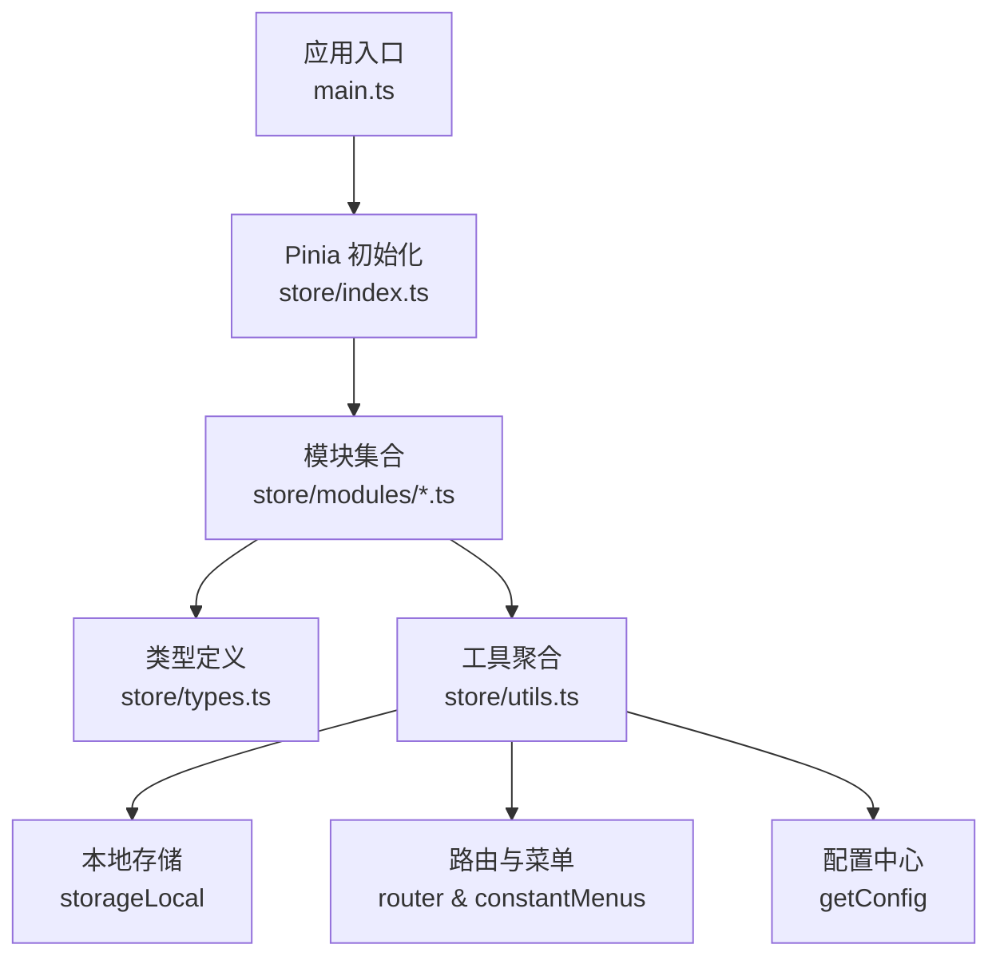
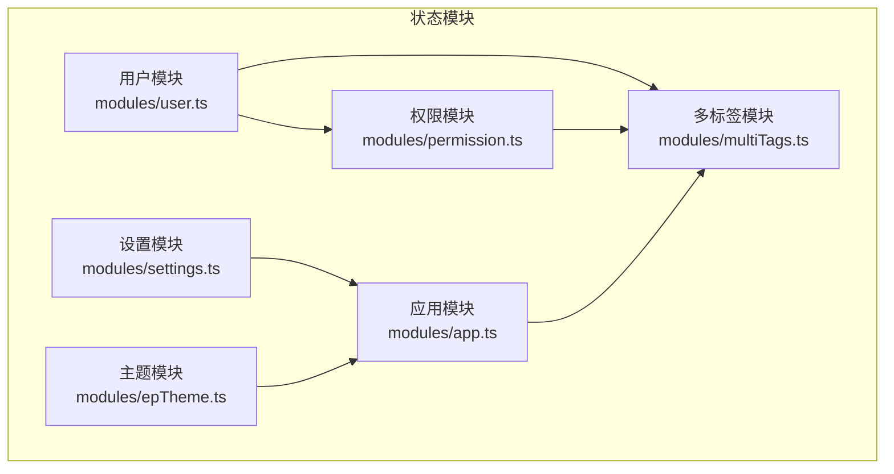
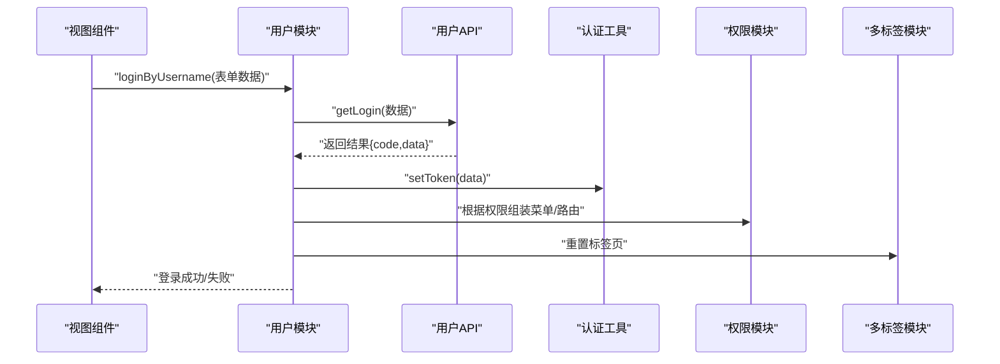
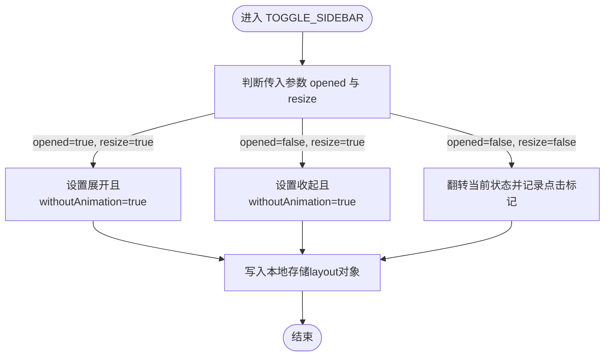
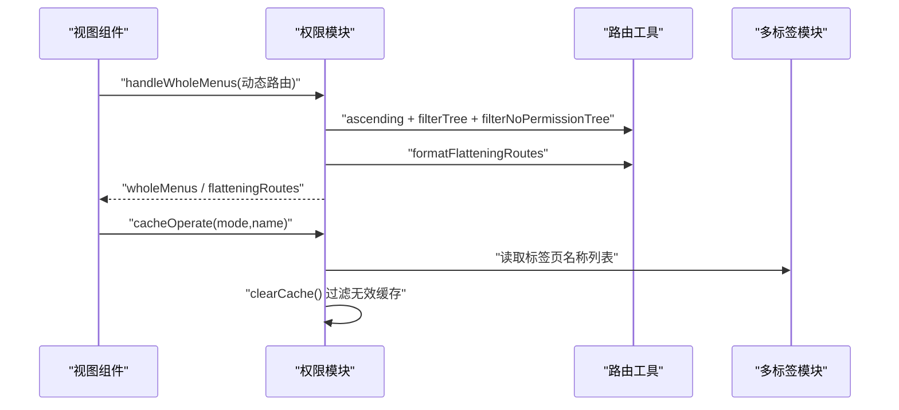
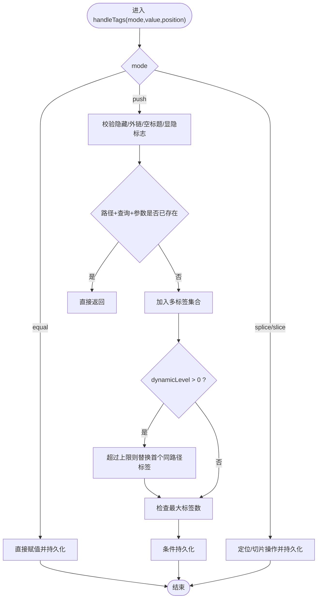
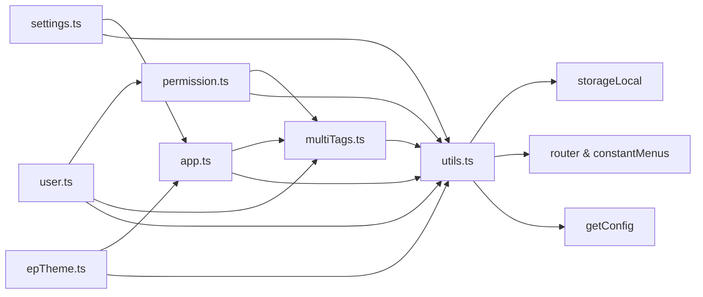

# 状态管理

<cite>
**本文引用的文件**
- [web/src/store/index.ts](file://web/src/store/index.ts)
- [web/src/store/types.ts](file://web/src/store/types.ts)
- [web/src/store/utils.ts](file://web/src/store/utils.ts)
- [web/src/store/modules/app.ts](file://web/src/store/modules/app.ts)
- [web/src/store/modules/user.ts](file://web/src/store/modules/user.ts)
- [web/src/store/modules/permission.ts](file://web/src/store/modules/permission.ts)
- [web/src/store/modules/settings.ts](file://web/src/store/modules/settings.ts)
- [web/src/store/modules/multiTags.ts](file://web/src/store/modules/multiTags.ts)
- [web/src/store/modules/epTheme.ts](file://web/src/store/modules/epTheme.ts)
</cite>

## 目录
1. [简介](#简介)
2. [项目结构](#项目结构)
3. [核心组件](#核心组件)
4. [架构总览](#架构总览)
5. [详细组件分析](#详细组件分析)
6. [依赖关系分析](#依赖关系分析)
7. [性能考量](#性能考量)
8. [故障排查指南](#故障排查指南)
9. [结论](#结论)
10. [附录](#附录)

## 简介
本文件系统性梳理基于 Vue 3 + Pinia 的前端状态管理实现，覆盖安装与初始化、模块化状态架构、各状态模块设计原理（用户、应用配置、权限、多标签页、主题色等）、状态定义与 getter 计算属性、action 行为模式、持久化策略与响应式绑定机制、模块间通信与数据共享方式，并给出最佳实践与性能优化建议，帮助团队构建可维护、可扩展的状态管理架构。

## 项目结构
- Pinia 实例在应用入口处集中初始化与注入，确保全局可用。
- 状态模块按功能拆分至 modules 目录，每个模块独立定义 state、getters、actions，并通过统一工具模块导出 Hook 函数以供组件层使用。
- 类型定义集中在 types.ts，便于跨模块复用与约束。
- 工具模块 utils.ts 聚合常用依赖（如本地存储、路由、配置等），减少模块间重复导入。

图表来源
- [web/src/store/index.ts:1-10](file://web/src/store/index.ts#L1-L10)
- [web/src/store/utils.ts:1-29](file://web/src/store/utils.ts#L1-L29)

章节来源
- [web/src/store/index.ts:1-10](file://web/src/store/index.ts#L1-L10)
- [web/src/store/types.ts:1-51](file://web/src/store/types.ts#L1-L51)
- [web/src/store/utils.ts:1-29](file://web/src/store/utils.ts#L1-L29)

## 核心组件
- Pinia 实例与安装
  - 在 store/index.ts 中创建 Pinia 实例并通过 setupStore 注入到 Vue 应用，保证全局单例。
- 类型体系
  - types.ts 定义 appType、userType、setType、multiType、cacheType、positionType 等核心类型，为各模块提供统一的数据契约。
- 工具聚合
  - utils.ts 导出 store、router、constantMenus、getConfig、storageLocal、设备检测、路由工具等，降低模块耦合度。

章节来源
- [web/src/store/index.ts:1-10](file://web/src/store/index.ts#L1-L10)
- [web/src/store/types.ts:1-51](file://web/src/store/types.ts#L1-L51)
- [web/src/store/utils.ts:1-29](file://web/src/store/utils.ts#L1-L29)

## 架构总览
- 模块化设计：每个模块聚焦单一职责（如用户、应用、权限、设置、多标签页、主题色），通过 defineStore 定义，避免状态分散与相互污染。
- 响应式绑定：Pinia 自动追踪 state 变化，配合 Vue 响应式系统实现视图自动更新。
- 持久化策略：通过 storageLocal 将关键状态写入本地存储，实现刷新后状态恢复；同时支持配置开关控制缓存策略。
- 模块间通信：通过工具模块统一导出的 Hook（如 useUserStoreHook、usePermissionStoreHook、useMultiTagsStoreHook）在组件或模块内调用，实现松耦合协作。

图表来源
- [web/src/store/modules/user.ts:1-128](file://web/src/store/modules/user.ts#L1-L128)
- [web/src/store/modules/app.ts:1-91](file://web/src/store/modules/app.ts#L1-L91)
- [web/src/store/modules/permission.ts:1-76](file://web/src/store/modules/permission.ts#L1-L76)
- [web/src/store/modules/settings.ts:1-36](file://web/src/store/modules/settings.ts#L1-L36)
- [web/src/store/modules/multiTags.ts:1-139](file://web/src/store/modules/multiTags.ts#L1-L139)
- [web/src/store/modules/epTheme.ts:1-50](file://web/src/store/modules/epTheme.ts#L1-L50)

## 详细组件分析

### 用户状态模块（user）
- 设计目标
  - 管理用户身份信息（头像、用户名、昵称）、角色与权限、登录页交互状态、登录/登出流程与 Token 刷新。
- 关键点
  - state：从本地存储恢复用户信息，避免每次刷新丢失。
  - actions：
    - SET_* 系列：原子化更新字段。
    - loginByUsername：封装登录请求，成功后写入 Token 并返回结果。
    - logOut：清理用户信息、重置路由、清空标签页、跳转登录。
    - handRefreshToken：刷新 Token 并更新本地存储。
- 与其它模块的关系
  - 与 permission 模块协作生成菜单与路由；与 multiTags 模块联动标签页行为；与 app 模块联动布局状态。

图表来源
- [web/src/store/modules/user.ts:78-121](file://web/src/store/modules/user.ts#L78-L121)
- [web/src/store/modules/permission.ts:26-34](file://web/src/store/modules/permission.ts#L26-L34)
- [web/src/store/modules/multiTags.ts:60-69](file://web/src/store/modules/multiTags.ts#L60-L69)

章节来源
- [web/src/store/modules/user.ts:1-128](file://web/src/store/modules/user.ts#L1-L128)

### 应用配置状态模块（app）
- 设计目标
  - 管理侧边栏展开状态、布局模式、设备类型、视口尺寸、排序拖拽状态等。
- 关键点
  - state：从本地存储与配置中心恢复初始值，确保一致性。
  - getters：提供只读访问器，便于视图层直接读取。
  - actions：
    - TOGGLE_SIDEBAR/toggleSideBar：切换侧边栏状态并持久化。
    - toggleDevice/setLayout/setViewportSize/setSortSwap：更新布局与设备信息。
- 持久化策略
  - 通过 storageLocal 与 responsiveStorageNameSpace 将 layout 与 sidebar 状态写入本地存储。

图表来源
- [web/src/store/modules/app.ts:49-84](file://web/src/store/modules/app.ts#L49-L84)

章节来源
- [web/src/store/modules/app.ts:1-91](file://web/src/store/modules/app.ts#L1-L91)

### 权限状态模块（permission）
- 设计目标
  - 统一管理静态与动态菜单、扁平化路由、缓存页面列表，以及与多标签页的协同清理。
- 关键点
  - state：包含 constantMenus、wholeMenus、flatteningRoutes、cachePageList。
  - actions：
    - handleWholeMenus：合并静态与动态路由，生成菜单树与扁平化路由。
    - cacheOperate：对 keep-alive 缓存进行增删改查。
    - clearCache/clearAllCachePage：清理无用缓存，保持内存整洁。
- 与其它模块的关系
  - 依赖 router/utils 的排序与过滤工具；与 multiTags 协作清理无效缓存。

图表来源
- [web/src/store/modules/permission.ts:26-64](file://web/src/store/modules/permission.ts#L26-L64)
- [web/src/store/utils.ts:5-10](file://web/src/store/utils.ts#L5-L10)

章节来源
- [web/src/store/modules/permission.ts:1-76](file://web/src/store/modules/permission.ts#L1-L76)

### 设置状态模块（settings）
- 设计目标
  - 管理标题、固定头部、隐藏侧边栏等全局设置项。
- 关键点
  - state：从配置中心读取默认值。
  - getters：提供只读访问。
  - actions：CHANGE_SETTING 支持动态修改键值，changeSetting 提供便捷入口。

章节来源
- [web/src/store/modules/settings.ts:1-36](file://web/src/store/modules/settings.ts#L1-L36)

### 多标签页状态模块（multiTags）
- 设计目标
  - 维护标签页集合与缓存策略，支持标签页增删改查、动态层级限制与最大数量控制。
- 关键点
  - state：从本地存储恢复标签页集合与缓存开关；若未开启缓存则回退到默认值。
  - actions：
    - multiTagsCacheChange：切换缓存开关并同步到本地存储。
    - handleTags：支持 equal、push、splice、slice 等模式，内部包含去重、隐藏规则、动态层级替换、最大数量裁剪等逻辑。
    - tagsCache：条件性持久化标签页集合。
- 与其它模块的关系
  - 与 permission 模块的扁平化路由协作，生成固定标签页；与 user 模块联动登出时重置标签页。

图表来源
- [web/src/store/modules/multiTags.ts:60-132](file://web/src/store/modules/multiTags.ts#L60-L132)

章节来源
- [web/src/store/modules/multiTags.ts:1-139](file://web/src/store/modules/multiTags.ts#L1-L139)

### 主题色状态模块（epTheme）
- 设计目标
  - 管理 Element Plus 主题色与主题模式，并根据主题模式动态计算图标填充色。
- 关键点
  - state：从本地存储或配置中心恢复主题色与主题模式。
  - getters：提供主题色与 fill（图标填充）计算属性。
  - actions：setEpThemeColor 更新主题色并持久化。

章节来源
- [web/src/store/modules/epTheme.ts:1-50](file://web/src/store/modules/epTheme.ts#L1-L50)

## 依赖关系分析
- 模块内聚与解耦
  - 各模块通过 utils.ts 聚合依赖，避免在模块内部直接引入大量外部库，提升可测试性与可维护性。
- 外部依赖
  - 本地存储：storageLocal 与 responsiveStorageNameSpace 提供命名空间隔离与持久化能力。
  - 路由与菜单：constantMenus、路由工具函数（排序、过滤、扁平化）。
  - 配置中心：getConfig 提供运行时配置读取。
- 潜在循环依赖
  - 当前结构中模块间通过 Hook 与工具函数间接交互，未见直接循环导入；但 multiTags 与 permission 的协作需注意调用顺序与数据一致性。

图表来源
- [web/src/store/utils.ts:1-29](file://web/src/store/utils.ts#L1-L29)
- [web/src/store/modules/user.ts:1-17](file://web/src/store/modules/user.ts#L1-L17)
- [web/src/store/modules/app.ts:1-9](file://web/src/store/modules/app.ts#L1-L9)
- [web/src/store/modules/permission.ts:1-11](file://web/src/store/modules/permission.ts#L1-L11)
- [web/src/store/modules/settings.ts:1-2](file://web/src/store/modules/settings.ts#L1-L2)
- [web/src/store/modules/multiTags.ts:1-14](file://web/src/store/modules/multiTags.ts#L1-L14)
- [web/src/store/modules/epTheme.ts:1-7](file://web/src/store/modules/epTheme.ts#L1-L7)

章节来源
- [web/src/store/utils.ts:1-29](file://web/src/store/utils.ts#L1-L29)

## 性能考量
- 状态粒度与拆分
  - 将状态按领域拆分为多个模块，避免单模块臃肿；仅在必要时合并逻辑，减少无关状态的响应式追踪开销。
- 响应式与计算属性
  - 使用 getters 作为纯计算属性，避免在模板中执行复杂逻辑；尽量将昂贵计算放入缓存或节流。
- 持久化与本地存储
  - 对频繁读写的配置采用本地存储，但注意序列化/反序列化的成本；对大体量数据谨慎持久化，优先考虑按需加载。
- 动作与副作用
  - 将异步请求与副作用放在 actions 内，避免在 getters 中产生副作用；批量更新状态时尽量合并多次变更，减少渲染次数。
- 缓存与内存
  - 权限模块的缓存列表与多标签页的动态层级限制有助于控制内存占用；定期清理无效缓存，防止“幽灵标签”导致的内存泄漏。
- 路由与菜单
  - 扁平化路由与排序/过滤工具仅在需要时调用，避免在高频渲染场景中重复计算。

## 故障排查指南
- 登录后页面未更新或标签页异常
  - 检查用户模块的登录动作是否正确写入 Token 并触发权限模块的菜单组装；确认多标签模块的 equal 模式是否正确重置标签页。
- 侧边栏状态不生效或刷新后丢失
  - 核对 app 模块的 TOGGLE_SIDEBAR 是否写入本地存储；确认 responsiveStorageNameSpace 命名空间一致。
- 主题色切换无效
  - 检查 epTheme 模块的 setEpThemeColor 是否更新 layout 对象并持久化；确认主题模式与 fill 计算属性是否被正确消费。
- 标签页过多或无法关闭
  - 查看 multiTags 的 handleTags 推送逻辑与最大数量限制；确认 splice/slice 操作的索引与长度是否正确。
- 权限导致菜单缺失
  - 检查 permission 模块的过滤与排序工具链；确认 constantMenus 与动态路由合并后的结果符合预期。

章节来源
- [web/src/store/modules/user.ts:95-121](file://web/src/store/modules/user.ts#L95-L121)
- [web/src/store/modules/app.ts:49-84](file://web/src/store/modules/app.ts#L49-L84)
- [web/src/store/modules/epTheme.ts:33-43](file://web/src/store/modules/epTheme.ts#L33-L43)
- [web/src/store/modules/multiTags.ts:60-132](file://web/src/store/modules/multiTags.ts#L60-L132)
- [web/src/store/modules/permission.ts:26-64](file://web/src/store/modules/permission.ts#L26-L64)

## 结论
该状态管理架构以 Pinia 为核心，结合模块化拆分、类型约束与工具聚合，实现了清晰的职责边界与良好的可维护性。通过本地存储与配置中心的组合，兼顾了易用性与一致性；通过 getters 与 actions 的规范使用，保障了响应式数据绑定与副作用管理。建议在后续迭代中持续关注性能指标，完善错误监控与日志埋点，进一步提升用户体验与开发效率。

## 附录
- 最佳实践清单
  - 使用 defineStore 与 Hook 函数统一导出，避免在组件内直接导入 store。
  - 将副作用与异步逻辑收敛到 actions，保持 getters 纯计算。
  - 对大体量状态采用懒加载与分页策略，避免一次性渲染。
  - 为关键状态提供持久化开关，允许用户选择是否启用缓存。
  - 在模块间传递数据时，优先通过工具函数与 Hook，减少直接依赖。
- 性能优化建议
  - 合理拆分状态，避免不必要的响应式追踪。
  - 对高频更新的状态使用防抖/节流。
  - 控制本地存储体积，避免序列化开销过大。
  - 定期清理无效缓存与标签页，维持内存健康。