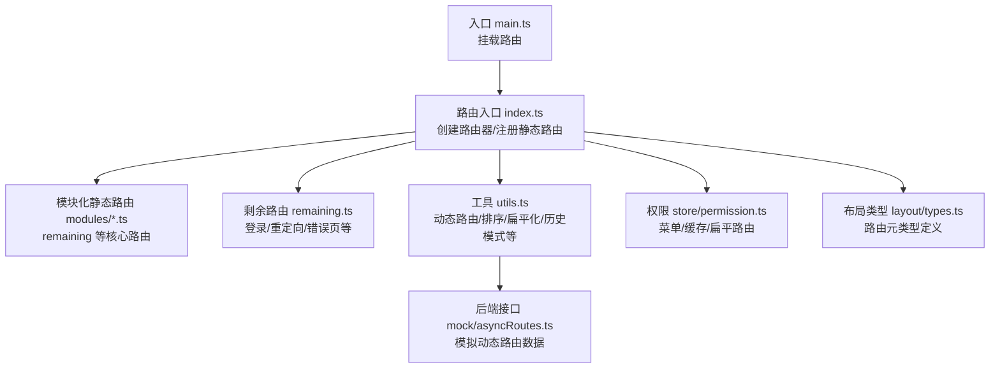
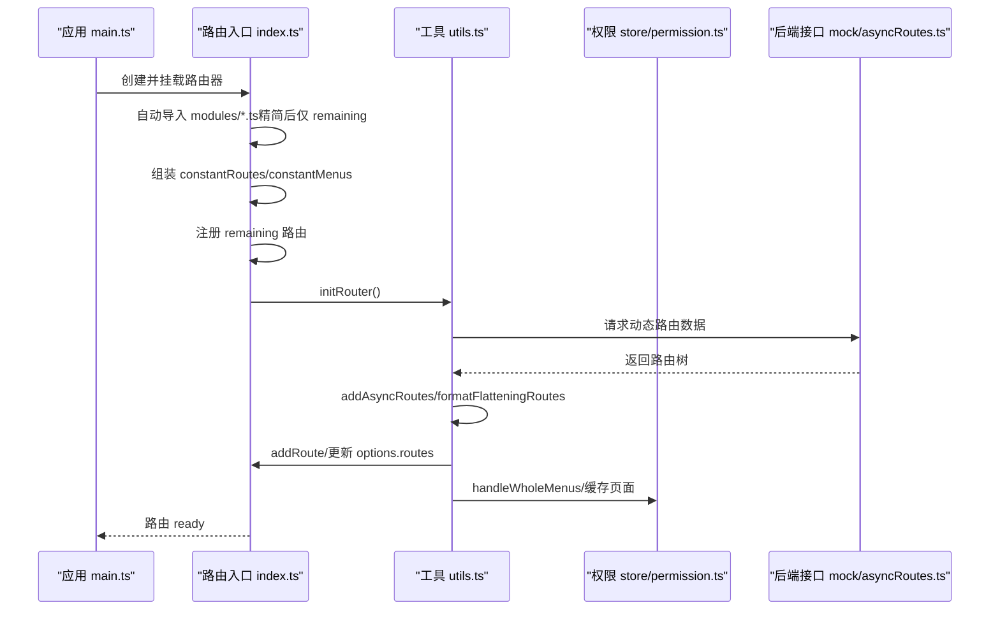
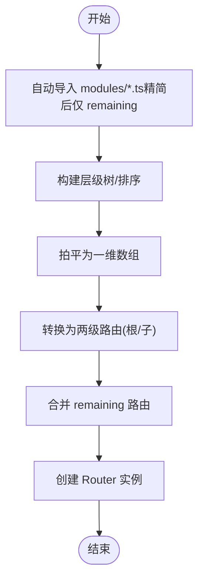
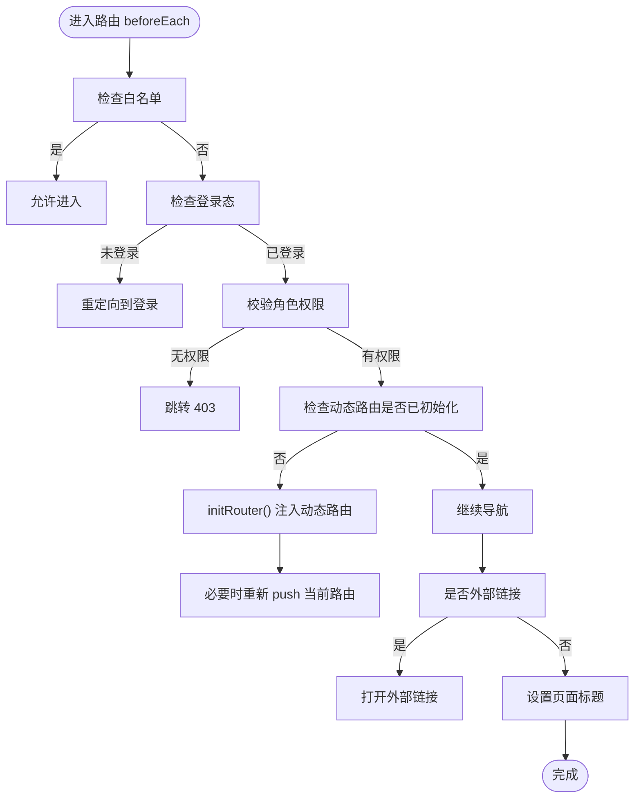
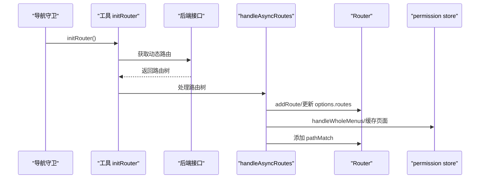
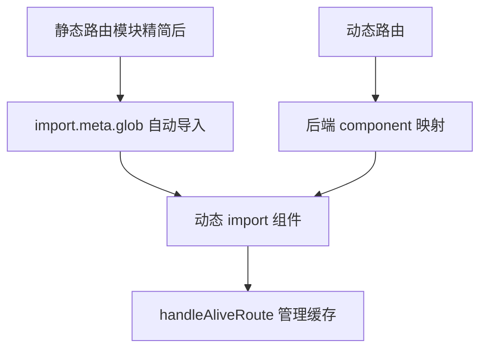
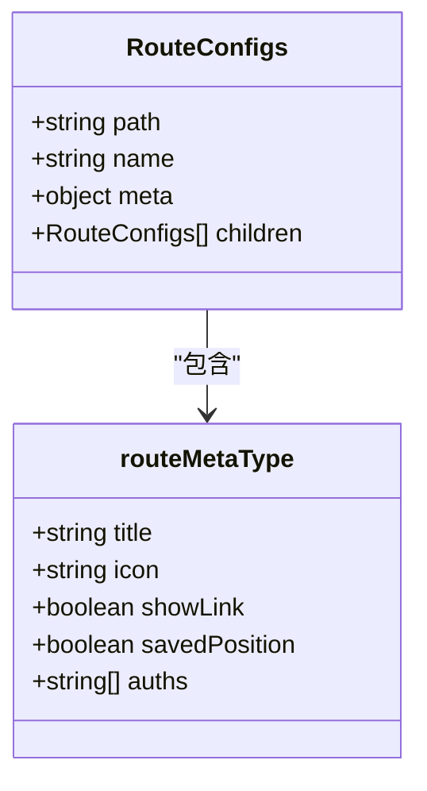
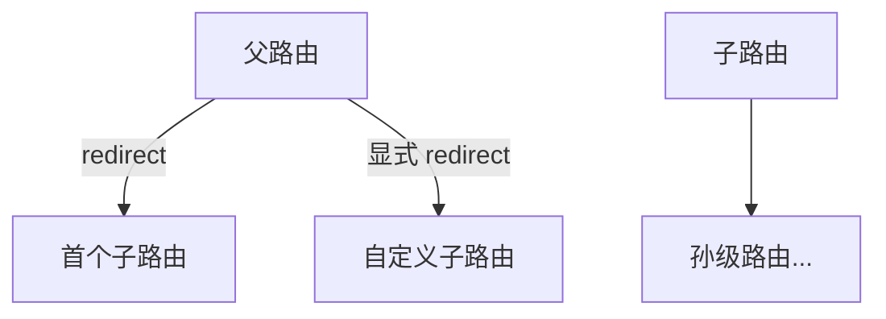
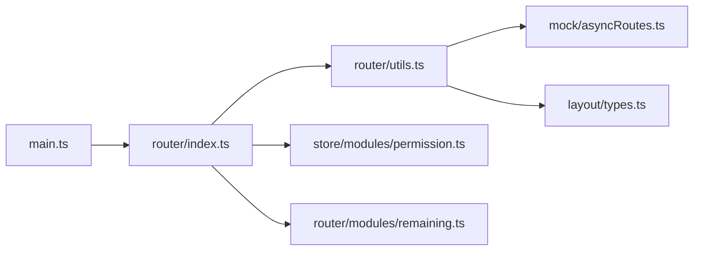

# 路由系统

<cite>
**本文档引用的文件**
- [web/src/router/index.ts](file://web/src/router/index.ts)
- [web/src/router/utils.ts](file://web/src/router/utils.ts)
- [web/src/router/enums.ts](file://web/src/router/enums.ts)
- [web/src/router/modules/remaining.ts](file://web/src/router/modules/remaining.ts)
- [web/src/store/modules/permission.ts](file://web/src/store/modules/permission.ts)
- [web/mock/asyncRoutes.ts](file://web/mock/asyncRoutes.ts)
- [web/src/layout/types.ts](file://web/src/layout/types.ts)
- [web/src/main.ts](file://web/src/main.ts)
</cite>

## 更新摘要
**所做更改**
- 更新了路由模块化组织结构，反映了移除大量演示路由模块的精简变化
- 修订了静态路由模块列表，仅保留核心系统管理路由
- 更新了路由配置和导航结构的说明
- 调整了相关图表和代码示例以反映当前实际的路由结构

## 目录
1. [简介](#简介)
2. [项目结构](#项目结构)
3. [核心组件](#核心组件)
4. [架构总览](#架构总览)
5. [详细组件分析](#详细组件分析)
6. [依赖关系分析](#依赖关系分析)
7. [性能考量](#性能考量)
8. [故障排查指南](#故障排查指南)
9. [结论](#结论)
10. [附录](#附录)

## 简介
本文件系统性梳理前端路由体系，围绕 Vue Router 在本项目中的配置与使用模式展开，重点覆盖：
- 精简后的路由定义与模块化组织
- 导航守卫与权限控制
- 动态路由生成与后端接口对接
- 路由懒加载与性能优化
- 路由元信息、参数传递、嵌套路由、重定向与别名
- 调试技巧与最佳实践

**更新** 路由系统经过精简，移除了大量演示路由模块，仅保留核心系统管理路由，简化了路由配置和导航结构。

## 项目结构
路由系统主要位于 web/src/router 目录，采用"静态路由 + 动态路由"的双轨设计，并通过模块化组织静态路由，配合权限状态管理与工具函数完成运行期装配。

**图示来源**
- [web/src/main.ts:57-71](file://web/src/main.ts#L57-L71)
- [web/src/router/index.ts:77-95](file://web/src/router/index.ts#L77-L95)
- [web/src/router/modules/remaining.ts:4-68](file://web/src/router/modules/remaining.ts#L4-L68)
- [web/src/router/utils.ts:200-235](file://web/src/router/utils.ts#L200-L235)
- [web/src/store/modules/permission.ts:14-71](file://web/src/store/modules/permission.ts#L14-L71)
- [web/mock/asyncRoutes.ts:323-341](file://web/mock/asyncRoutes.ts#L323-L341)
- [web/src/layout/types.ts:4-16](file://web/src/layout/types.ts#L4-L16)

**章节来源**
- [web/src/router/index.ts:41-76](file://web/src/router/index.ts#L41-L76)
- [web/src/router/modules/remaining.ts:4-68](file://web/src/router/modules/remaining.ts#L4-L68)
- [web/src/router/utils.ts:200-235](file://web/src/router/utils.ts#L200-L235)
- [web/src/store/modules/permission.ts:14-71](file://web/src/store/modules/permission.ts#L14-L71)
- [web/mock/asyncRoutes.ts:323-341](file://web/mock/asyncRoutes.ts#L323-L341)
- [web/src/layout/types.ts:4-16](file://web/src/layout/types.ts#L4-L16)

## 核心组件
- 路由器创建与静态路由装配：通过 glob 自动导入 modules 下的路由模块，统一拍平与层级化，注入 remaining 路由，创建 Router 实例。
- 导航守卫：beforeEach 中处理标题设置、白名单、权限校验、动态路由初始化、外部链接打开、标签页联动等。
- 动态路由：通过 utils.initRouter 从后端接口获取路由树，经 addAsyncRoutes 与 handleAsyncRoutes 处理后加入路由表。
- 权限状态：permission store 维护常驻菜单、整体菜单、扁平化路由与缓存页面列表，供 UI 与导航守卫使用。
- 路由工具：提供排序、过滤、扁平化、历史模式、缓存路由处理、按钮级权限查询等能力。

**更新** 路由模块经过精简，目前仅包含 remaining.ts 等核心路由模块，移除了大量演示和示例路由。

**章节来源**
- [web/src/router/index.ts:77-120](file://web/src/router/index.ts#L77-L120)
- [web/src/router/utils.ts:200-235](file://web/src/router/utils.ts#L200-L235)
- [web/src/store/modules/permission.ts:14-71](file://web/src/store/modules/permission.ts#L14-L71)

## 架构总览
路由系统以"静态 + 动态"双轨为核心，结合权限状态与工具函数，形成完整的运行期装配链路。

**图示来源**
- [web/src/main.ts:57-71](file://web/src/main.ts#L57-L71)
- [web/src/router/index.ts:77-120](file://web/src/router/index.ts#L77-L120)
- [web/src/router/utils.ts:200-235](file://web/src/router/utils.ts#L200-L235)
- [web/src/store/modules/permission.ts:26-34](file://web/src/store/modules/permission.ts#L26-L34)
- [web/mock/asyncRoutes.ts:323-341](file://web/mock/asyncRoutes.ts#L323-L341)

## 详细组件分析

### 路由定义与模块化组织
- 静态路由模块：经过精简，目前仅保留 remaining.ts 等核心路由模块，移除了 home、nested、error、form、table 等演示路由模块。
- remaining 路由：集中放置登录、重定向、全屏错误页、账户设置等不受菜单系统控制的路由。
- 路由枚举：通过 enums.ts 统一维护各模块的排序权重 rank，便于后端返回时按 rank 排序。

**更新** 路由模块大幅精简，仅保留 remaining.ts 等核心路由模块，移除了大量演示和示例路由。

**图示来源**
- [web/src/router/index.ts:45-62](file://web/src/router/index.ts#L45-L62)
- [web/src/router/enums.ts:32-61](file://web/src/router/enums.ts#L32-L61)

**章节来源**
- [web/src/router/modules/remaining.ts:4-68](file://web/src/router/modules/remaining.ts#L4-L68)
- [web/src/router/enums.ts:32-61](file://web/src/router/enums.ts#L32-L61)

### 导航守卫与权限控制
- 白名单：登录页直接放行。
- 登录态与权限：若已登录但无权限，跳转 403；隐藏首页时禁止直接访问欢迎页。
- 动态路由初始化：首次进入且无权限菜单时，调用 initRouter 完成动态路由注入与标签页联动。
- 外部链接：命中外部链接时直接打开，不再进入内部路由。
- 标题与进度条：进入路由时设置 document.title，afterEach 标记已加载并结束进度条。

**图示来源**
- [web/src/router/index.ts:123-222](file://web/src/router/index.ts#L123-L222)

**章节来源**
- [web/src/router/index.ts:123-222](file://web/src/router/index.ts#L123-L222)

### 动态路由生成与权限路由控制
- 数据来源：通过 utils.initRouter 从后端接口获取路由树，支持本地缓存。
- 处理流程：addAsyncRoutes 为后端路由补全组件映射、重定向、名称等；handleAsyncRoutes 将其拍平并加入路由表，同时更新权限 store。
- 权限控制：filterNoPermissionTree 基于当前用户角色过滤不可见菜单；permission store 维护整体菜单与扁平化路由，供 UI 与导航守卫使用。
- 404 匹配：动态路由注册完成后添加 pathMatch，避免刷新时误跳转。

**图示来源**
- [web/src/router/utils.ts:200-235](file://web/src/router/utils.ts#L200-L235)
- [web/src/router/utils.ts:157-197](file://web/src/router/utils.ts#L157-L197)
- [web/src/store/modules/permission.ts:26-34](file://web/src/store/modules/permission.ts#L26-L34)
- [web/mock/asyncRoutes.ts:323-341](file://web/mock/asyncRoutes.ts#L323-L341)

**章节来源**
- [web/src/router/utils.ts:157-197](file://web/src/router/utils.ts#L157-L197)
- [web/src/router/utils.ts:200-235](file://web/src/router/utils.ts#L200-L235)
- [web/src/store/modules/permission.ts:26-34](file://web/src/store/modules/permission.ts#L26-L34)
- [web/mock/asyncRoutes.ts:323-341](file://web/mock/asyncRoutes.ts#L323-L341)

### 路由懒加载机制
- 静态路由懒加载：通过 import.meta.glob 自动导入 modules 下的路由模块，结合动态组件 import 实现按需加载。
- 动态路由懒加载：后端返回的 component 字段映射到 views 下的组件，按需 import。
- keep-alive 缓存：通过 handleAliveRoute 管理缓存页面，支持 add/delete/refresh 模式。

**图示来源**
- [web/src/router/index.ts:45-50](file://web/src/router/index.ts#L45-L50)
- [web/src/router/utils.ts:317-343](file://web/src/router/utils.ts#L317-L343)
- [web/src/router/utils.ts:281-314](file://web/src/router/utils.ts#L281-L314)

**章节来源**
- [web/src/router/index.ts:45-50](file://web/src/router/index.ts#L45-L50)
- [web/src/router/utils.ts:317-343](file://web/src/router/utils.ts#L317-L343)
- [web/src/router/utils.ts:281-314](file://web/src/router/utils.ts#L281-L314)

### 路由元信息与参数传递
- 路由元信息：title、icon、rank、showLink、keepAlive、roles、auths、frameSrc、fixedTag 等，用于菜单渲染、权限控制、缓存与 iframe 嵌套。
- 参数传递：支持 query 与 params 两种模式；部分标签页详情路由通过 meta.showLink=false 控制不在菜单显示，通过 activePath 关联父级。
- 历史模式：支持 hash 与 h5 两种模式，可带 base 参数。

**图示来源**
- [web/src/layout/types.ts:26-33](file://web/src/layout/types.ts#L26-L33)
- [web/src/layout/types.ts:18-24](file://web/src/layout/types.ts#L18-L24)

**章节来源**
- [web/src/layout/types.ts:18-33](file://web/src/layout/types.ts#L18-L33)
- [web/src/router/modules/remaining.ts:297-320](file://web/src/router/modules/remaining.ts#L297-L320)
- [web/src/router/utils.ts:345-366](file://web/src/router/utils.ts#L345-L366)

### 嵌套路由、重定向与路由别名
- 嵌套路由：remaining 模块包含重定向功能，支持子路由到子路由的中间层重定向。
- 重定向：父级 redirect 默认取首个子级 path，也可显式配置；支持子路由到子路由的中间层重定向。
- 路由别名：通过 name 与 redirect 实现语义化别名，避免同名冲突。

**图示来源**
- [web/src/router/modules/remaining.ts:34-48](file://web/src/router/modules/remaining.ts#L34-L48)
- [web/src/router/utils.ts:317-343](file://web/src/router/utils.ts#L317-L343)

**章节来源**
- [web/src/router/modules/remaining.ts:34-48](file://web/src/router/modules/remaining.ts#L34-L48)
- [web/src/router/utils.ts:317-343](file://web/src/router/utils.ts#L317-L343)

### 路由模块化组织策略与路由枚举定义
- 按功能域划分模块：经过精简，目前仅保留 remaining.ts 等核心路由模块，移除了 components、form、table、nested、error 等演示模块。
- 枚举排序：通过 enums.ts 统一 rank，保证菜单顺序稳定可控。
- 常驻菜单与整体菜单：permission store 分别维护静态与动态组合后的菜单树与扁平化路由。

**更新** 路由模块经过大幅精简，仅保留 remaining.ts 等核心路由模块，移除了大量演示和示例路由。

**章节来源**
- [web/src/router/enums.ts:32-61](file://web/src/router/enums.ts#L32-L61)
- [web/src/store/modules/permission.ts:14-24](file://web/src/store/modules/permission.ts#L14-L24)

## 依赖关系分析
- 路由入口依赖：modules/*.ts（精简后仅 remaining.ts）、remaining.ts、utils.ts、permission store。
- 工具函数依赖：@pureadmin/utils、布局类型定义、权限 store。
- 动态路由依赖：后端接口 mock/asyncRoutes.ts。
- 应用入口依赖：main.ts 中确保 router.isReady 后再挂载应用。

**图示来源**
- [web/src/main.ts:57-71](file://web/src/main.ts#L57-L71)
- [web/src/router/index.ts:77-120](file://web/src/router/index.ts#L77-L120)
- [web/src/router/utils.ts:200-235](file://web/src/router/utils.ts#L200-L235)
- [web/src/store/modules/permission.ts:14-71](file://web/src/store/modules/permission.ts#L14-L71)
- [web/mock/asyncRoutes.ts:323-341](file://web/mock/asyncRoutes.ts#L323-L341)
- [web/src/layout/types.ts:4-16](file://web/src/layout/types.ts#L4-L16)

**章节来源**
- [web/src/main.ts:57-71](file://web/src/main.ts#L57-L71)
- [web/src/router/index.ts:77-120](file://web/src/router/index.ts#L77-L120)
- [web/src/router/utils.ts:200-235](file://web/src/router/utils.ts#L200-L235)
- [web/src/store/modules/permission.ts:14-71](file://web/src/store/modules/permission.ts#L14-L71)
- [web/mock/asyncRoutes.ts:323-341](file://web/mock/asyncRoutes.ts#L323-L341)
- [web/src/layout/types.ts:4-16](file://web/src/layout/types.ts#L4-L16)

## 性能考量
- 路由懒加载：静态与动态路由均采用 import 动态加载，减少首屏体积。
- keep-alive 缓存：仅二级以内缓存，避免深层嵌套带来的内存压力；通过 handleAliveRoute 精准管理缓存增删。
- 路由拍平与层级化：formatTwoStageRoutes 将三级及以上拍平为两级，兼顾 keep-alive 与结构清晰。
- 动态路由缓存：initRouter 支持 localStorage 缓存，避免重复拉取。
- 进度条与滚动恢复：NProgress 提升感知，scrollBehavior 结合 saveSrollTop 优化用户体验。

**更新** 路由模块精简后，首屏加载体积进一步减小，性能表现更佳。

**章节来源**
- [web/src/router/index.ts:77-95](file://web/src/router/index.ts#L77-L95)
- [web/src/router/utils.ts:261-279](file://web/src/router/utils.ts#L261-L279)
- [web/src/router/utils.ts:200-235](file://web/src/router/utils.ts#L200-L235)
- [web/src/router/utils.ts:281-314](file://web/src/router/utils.ts#L281-L314)

## 故障排查指南
- 动态路由未生效：确认 initRouter 是否被触发，检查 hasRoute 与 options.routes 同步；确保 pathMatch 已添加。
- 权限菜单不显示：检查 roles 与当前用户 roles 的交集；确认 filterNoPermissionTree 生效。
- 标签页不联动：确认 meta.fixedTag 与 activePath 设置；检查 useMultiTagsStoreHook.handleTags 的调用时机。
- 外链无法打开：检查 isUrl 与 openLink 的逻辑；确认 externalLink 分支处理。
- 404 误跳：确保动态路由完成后添加 pathMatch；避免在动态路由未完全注入时提前导航。

**章节来源**
- [web/src/router/utils.ts:142-155](file://web/src/router/utils.ts#L142-L155)
- [web/src/router/utils.ts:84-95](file://web/src/router/utils.ts#L84-L95)
- [web/src/router/index.ts:138-170](file://web/src/router/index.ts#L138-L170)

## 结论
本路由系统通过"静态 + 动态"双轨设计、模块化组织与完善的工具链，实现了灵活的权限控制、良好的用户体验与可维护性。经过精简后，系统更加简洁高效，建议在实际项目中：
- 统一使用枚举管理排序与权限；
- 严格区分静态与动态路由职责；
- 合理使用 keep-alive 与缓存策略；
- 重视导航守卫中的权限与标签页联动；
- 借助工具函数完成路由拍平、排序与历史模式切换。

**更新** 路由系统经过精简，移除了大量演示路由模块，仅保留核心系统管理路由，简化了配置和导航结构，提升了系统性能和可维护性。

## 附录
- 路由元信息字段参考：title、icon、rank、showLink、keepAlive、roles、auths、frameSrc、fixedTag、savedPosition、activePath 等。
- 常用工具函数：ascending、filterTree、filterNoPermissionTree、formatFlatteningRoutes、formatTwoStageRoutes、getHistoryMode、handleAliveRoute、addPathMatch、hasAuth、getAuths 等。

**章节来源**
- [web/src/layout/types.ts:18-33](file://web/src/layout/types.ts#L18-L33)
- [web/src/router/utils.ts:42-53](file://web/src/router/utils.ts#L42-L53)
- [web/src/router/utils.ts:84-95](file://web/src/router/utils.ts#L84-L95)
- [web/src/router/utils.ts:242-279](file://web/src/router/utils.ts#L242-L279)
- [web/src/router/utils.ts:345-366](file://web/src/router/utils.ts#L345-L366)
- [web/src/router/utils.ts:281-314](file://web/src/router/utils.ts#L281-L314)
- [web/src/router/utils.ts:406-423](file://web/src/router/utils.ts#L406-L423)