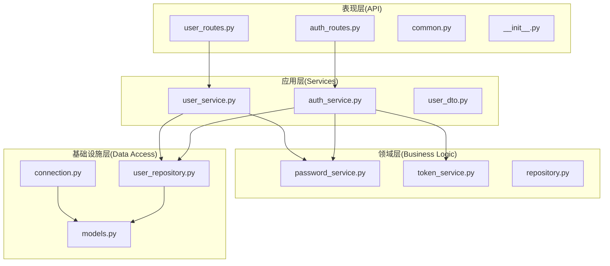
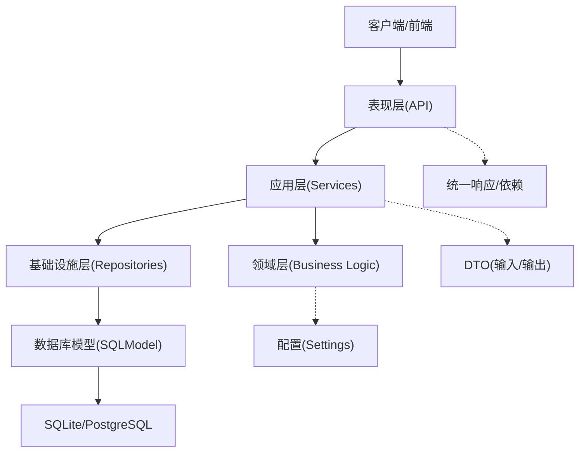
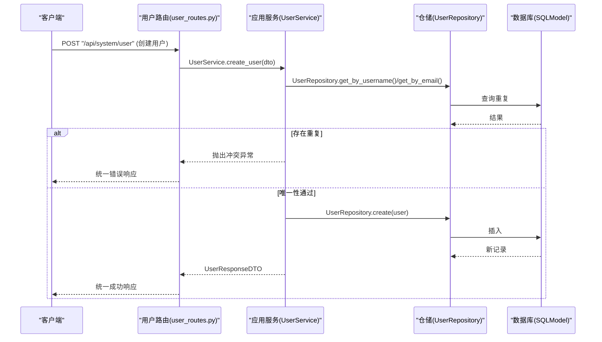
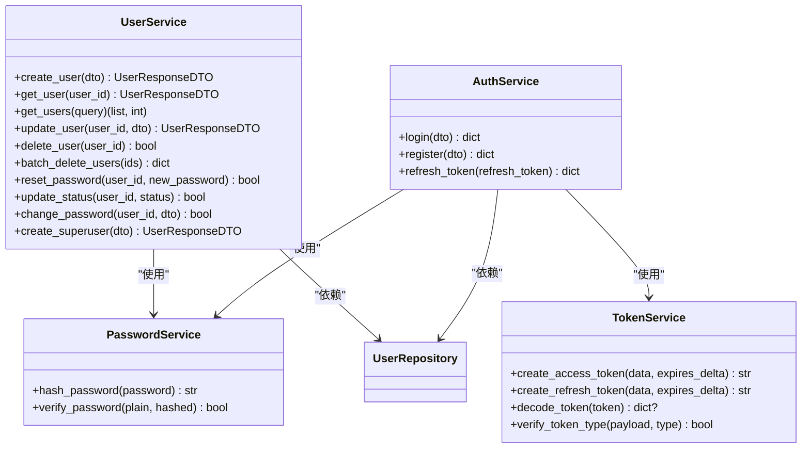
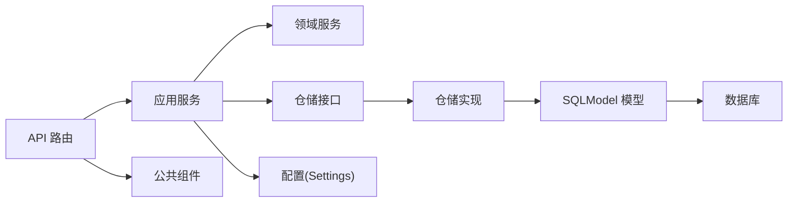

# DDD 分层架构详解

<cite>
**本文引用的文件**
- [main.py](file://service/src/main.py)
- [__init__.py](file://service/src/api/v1/__init__.py)
- [auth_routes.py](file://service/src/api/v1/auth_routes.py)
- [user_routes.py](file://service/src/api/v1/user_routes.py)
- [common.py](file://service/src/api/common.py)
- [auth_service.py](file://service/src/application/services/auth_service.py)
- [user_service.py](file://service/src/application/services/user_service.py)
- [user_dto.py](file://service/src/application/dto/user_dto.py)
- [password_service.py](file://service/src/domain/auth/password_service.py)
- [token_service.py](file://service/src/domain/auth/token_service.py)
- [repository.py](file://service/src/domain/user/repository.py)
- [user_repository.py](file://service/src/infrastructure/repositories/user_repository.py)
- [models.py](file://service/src/infrastructure/database/models.py)
- [connection.py](file://service/src/infrastructure/database/connection.py)
- [settings.py](file://service/src/config/settings.py)
- [exceptions.py](file://service/src/core/exceptions.py)
- [pyproject.toml](file://service/pyproject.toml)
</cite>

## 目录
1. [引言](#引言)
2. [项目结构](#项目结构)
3. [核心组件](#核心组件)
4. [架构总览](#架构总览)
5. [详细组件分析](#详细组件分析)
6. [依赖分析](#依赖分析)
7. [性能考虑](#性能考虑)
8. [故障排查指南](#故障排查指南)
9. [结论](#结论)
10. [附录](#附录)

## 引言
本文件面向 Hello-FastApi 的 DDD 分层架构，系统化阐述表现层（API）、应用层（Services）、领域层（Business Logic）、基础设施层（Data Access）四层的设计原则、职责边界、依赖关系与交互模式。通过具体代码路径与序列图、类图、流程图，帮助开发者建立清晰的分层理解与扩展路径，确保关注点分离、可测试性与可维护性。

## 项目结构
服务端采用 FastAPI 应用工厂与模块化路由聚合，按 DDD 层次划分：
- 表现层（API）：路由定义、共享响应模型、依赖注入
- 应用层（Services）：业务用例编排、DTO 校验与转换
- 领域层（Business Logic）：密码与令牌等核心领域服务
- 基础设施层（Data Access）：SQLModel 模型、仓储实现、数据库连接



图表来源
- [auth_routes.py:1-86](file://service/src/api/v1/auth_routes.py#L1-L86)
- [user_routes.py:1-252](file://service/src/api/v1/user_routes.py#L1-L252)
- [common.py:1-65](file://service/src/api/common.py#L1-L65)
- [__init__.py:1-41](file://service/src/api/v1/__init__.py#L1-L41)
- [auth_service.py:1-154](file://service/src/application/services/auth_service.py#L1-L154)
- [user_service.py:1-322](file://service/src/application/services/user_service.py#L1-L322)
- [user_dto.py:1-86](file://service/src/application/dto/user_dto.py#L1-L86)
- [password_service.py:1-21](file://service/src/domain/auth/password_service.py#L1-L21)
- [token_service.py:1-45](file://service/src/domain/auth/token_service.py#L1-L45)
- [repository.py:1-50](file://service/src/domain/user/repository.py#L1-L50)
- [user_repository.py:1-185](file://service/src/infrastructure/repositories/user_repository.py#L1-L185)
- [models.py:1-193](file://service/src/infrastructure/database/models.py#L1-L193)
- [connection.py:1-35](file://service/src/infrastructure/database/connection.py#L1-L35)

章节来源
- [main.py:1-96](file://service/src/main.py#L1-L96)
- [__init__.py:1-41](file://service/src/api/v1/__init__.py#L1-L41)
- [settings.py:1-198](file://service/src/config/settings.py#L1-L198)

## 核心组件
- 应用工厂与生命周期：在应用启动时初始化数据库、在关闭时释放连接；注册全局异常处理器与健康检查端点。
- 路由聚合：系统级路由统一挂载认证、用户、角色、权限、菜单等子路由。
- 统一响应与依赖：提供统一响应体、分页响应与共享依赖注入（数据库会话、权限校验、当前用户）。
- 配置中心：基于环境变量与 .env 文件的多环境配置加载与缓存。

章节来源
- [main.py:19-96](file://service/src/main.py#L19-L96)
- [__init__.py:13-41](file://service/src/api/v1/__init__.py#L13-L41)
- [common.py:29-65](file://service/src/api/common.py#L29-L65)
- [settings.py:144-198](file://service/src/config/settings.py#L144-L198)

## 架构总览
分层架构遵循“依赖倒置”原则：上层仅依赖抽象（接口/DTO），下层实现具体逻辑。表现层只感知应用服务；应用层编排业务用例并协调仓储；领域层封装核心业务规则；基础设施层提供数据持久化与外部集成能力。



图表来源
- [main.py:34-96](file://service/src/main.py#L34-L96)
- [auth_routes.py:19-86](file://service/src/api/v1/auth_routes.py#L19-L86)
- [user_routes.py:27-252](file://service/src/api/v1/user_routes.py#L27-L252)
- [auth_service.py:15-154](file://service/src/application/services/auth_service.py#L15-L154)
- [user_service.py:18-322](file://service/src/application/services/user_service.py#L18-L322)
- [user_repository.py:11-185](file://service/src/infrastructure/repositories/user_repository.py#L11-L185)
- [models.py:31-193](file://service/src/infrastructure/database/models.py#L31-L193)
- [settings.py:41-108](file://service/src/config/settings.py#L41-L108)

## 详细组件分析

### 表现层（API）
- 职责边界
  - 定义路由与 HTTP 协议契约，负责参数提取与依赖注入（数据库会话、权限校验、当前用户）。
  - 统一响应包装，保证对外接口的一致性与可观测性。
- 关键交互
  - 认证路由：登录、注册、登出、刷新令牌。
  - 用户路由：列表、详情、创建、更新、删除、批量删除、重置密码、状态变更、修改密码。
- 依赖关系
  - 依赖应用服务（AuthService/UserService）执行业务逻辑。
  - 依赖基础设施提供的数据库会话与仓储。
  - 依赖统一响应与依赖注入工具。



图表来源
- [user_routes.py:54-74](file://service/src/api/v1/user_routes.py#L54-L74)
- [user_service.py:25-58](file://service/src/application/services/user_service.py#L25-L58)
- [user_repository.py:114-120](file://service/src/infrastructure/repositories/user_repository.py#L114-L120)
- [models.py:31-65](file://service/src/infrastructure/database/models.py#L31-L65)

章节来源
- [auth_routes.py:1-86](file://service/src/api/v1/auth_routes.py#L1-L86)
- [user_routes.py:1-252](file://service/src/api/v1/user_routes.py#L1-L252)
- [common.py:29-65](file://service/src/api/common.py#L29-L65)

### 应用层（Services）
- 职责边界
  - 编排业务用例：参数校验（DTO）、领域服务调用、仓储交互、异常转换、响应组装。
  - 对外暴露稳定的服务接口，屏蔽底层实现细节。
- 关键流程
  - 用户服务：创建、查询、更新、删除、批量删除、重置密码、状态变更、修改密码、超级用户创建。
  - 认证服务：登录（校验密码、状态、生成令牌、拉取角色与权限）、注册（唯一性校验、密码哈希、创建用户）、刷新令牌（解码、类型校验、用户状态校验、签发新令牌）。
- 依赖关系
  - 使用领域服务（密码/令牌）与仓储接口。
  - 依赖配置（JWT 过期时间等）。



图表来源
- [user_service.py:18-322](file://service/src/application/services/user_service.py#L18-L322)
- [auth_service.py:15-154](file://service/src/application/services/auth_service.py#L15-L154)
- [password_service.py:6-21](file://service/src/domain/auth/password_service.py#L6-L21)
- [token_service.py:11-45](file://service/src/domain/auth/token_service.py#L11-L45)

章节来源
- [user_service.py:1-322](file://service/src/application/services/user_service.py#L1-L322)
- [auth_service.py:1-154](file://service/src/application/services/auth_service.py#L1-L154)
- [user_dto.py:1-86](file://service/src/application/dto/user_dto.py#L1-L86)

### 领域层（Business Logic）
- 职责边界
  - 封装核心业务规则与不变式，如密码哈希策略、JWT 令牌生成与校验、用户唯一性约束等。
- 关键实现
  - 密码服务：使用 bcrypt 进行哈希与校验。
  - 令牌服务：基于 python-jose 实现 JWT 的签发、解码与类型校验。
  - 用户仓储接口：定义用户领域操作的抽象契约，隔离具体存储实现。


图表来源
- [auth_service.py:26-74](file://service/src/application/services/auth_service.py#L26-L74)
- [password_service.py:17-21](file://service/src/domain/auth/password_service.py#L17-L21)
- [token_service.py:14-44](file://service/src/domain/auth/token_service.py#L14-L44)

章节来源
- [password_service.py:1-21](file://service/src/domain/auth/password_service.py#L1-L21)
- [token_service.py:1-45](file://service/src/domain/auth/token_service.py#L1-L45)
- [repository.py:8-50](file://service/src/domain/user/repository.py#L8-L50)

### 基础设施层（Data Access）
- 职责边界
  - 提供数据持久化与外部集成能力，屏蔽数据库差异与 ORM 细节。
- 关键实现
  - SQLModel 模型：定义用户、角色、权限、菜单、IP 规则等实体及关系。
  - 仓储实现：基于 SQLModel 的异步查询、分页、计数、批量删除、状态更新、密码重置等。
  - 数据库连接：异步引擎、会话管理、初始化与关闭。

```mermaid
erDiagram
USER {
string id PK
string username UK
string email
string hashed_password
string nickname
string avatar
string phone
int sex
int status
int dept_id
bool is_superuser
timestamp created_at
timestamp updated_at
}
ROLE {
string id PK
string name
string code UK
string description
int status
timestamp created_at
timestamp updated_at
}
PERMISSION {
string id PK
string name
string code UK
string category
string resource
string action
int status
timestamp created_at
}
USER_ROLES {
string id PK
string user_id FK
string role_id FK
timestamp assigned_at
}
ROLE_PERMISSIONS {
string role_id PK FK
string permission_id PK FK
}
MENU {
string id PK
string name
string path
string component
string icon
string title
string parent_id
int order_num
string permissions
int status
timestamp created_at
timestamp updated_at
}
IPRULE {
string id PK
string ip_address
string rule_type
string reason
bool is_active
timestamp created_at
timestamp expires_at
}
USER ||--o{ USER_ROLES : "拥有"
ROLE ||--o{ USER_ROLES : "授予"
ROLE ||--o{ ROLE_PERMISSIONS : "拥有"
PERMISSION ||--o{ ROLE_PERMISSIONS : "授权"
```

图表来源
- [models.py:31-193](file://service/src/infrastructure/database/models.py#L31-L193)

章节来源
- [models.py:1-193](file://service/src/infrastructure/database/models.py#L1-L193)
- [user_repository.py:1-185](file://service/src/infrastructure/repositories/user_repository.py#L1-L185)
- [connection.py:1-35](file://service/src/infrastructure/database/connection.py#L1-L35)

## 依赖分析
- 层内依赖
  - 表现层仅依赖应用服务与公共组件，不直接访问仓储或模型。
  - 应用层依赖领域服务与仓储接口，不直接操作数据库。
  - 领域层仅包含纯业务逻辑，不依赖框架或外部库。
  - 基础设施层依赖 ORM 与数据库驱动，向上提供抽象接口。
- 外部依赖
  - FastAPI、SQLModel、aiosqlite/asyncpg、bcrypt、python-jose、Redis、loguru 等。
- 循环依赖
  - 通过接口与 DTO 解耦，避免循环依赖；路由聚合统一入口，避免跨层直接引用。



图表来源
- [pyproject.toml:7-20](file://service/pyproject.toml#L7-L20)
- [main.py:11-16](file://service/src/main.py#L11-L16)
- [settings.py:41-108](file://service/src/config/settings.py#L41-L108)

章节来源
- [pyproject.toml:1-76](file://service/pyproject.toml#L1-L76)
- [main.py:1-96](file://service/src/main.py#L1-L96)

## 性能考虑
- 异步与连接池
  - 使用异步 SQLModel 与连接池预检，减少连接开销与超时问题。
- 查询优化
  - 分页与条件过滤在仓储层实现，避免一次性加载大结果集。
- 缓存与限流
  - 可结合 Redis 实现令牌缓存、验证码缓存与接口限流（当前配置项已提供）。
- 日志与监控
  - 使用统一异常处理与请求日志中间件，便于定位性能瓶颈与错误。

## 故障排查指南
- 常见异常
  - 未找到资源：返回 404，提示资源不存在。
  - 冲突/重复：返回 409，提示唯一性冲突。
  - 未授权/权限不足：返回 401/403，提示认证或权限问题。
  - 参数验证失败：返回 422，携带错误详情。
  - 未捕获异常：返回 500，记录错误日志。
- 排查步骤
  - 检查路由与依赖注入是否正确传递数据库会话。
  - 核对 DTO 字段与校验规则，确认请求体格式。
  - 查看应用服务中的异常转换与领域服务调用链。
  - 检查数据库连接初始化与关闭流程。

章节来源
- [exceptions.py:6-60](file://service/src/core/exceptions.py#L6-L60)
- [main.py:60-83](file://service/src/main.py#L60-L83)

## 结论
本项目以 DDD 分层架构为核心，通过明确的职责边界与依赖方向，实现了关注点分离、可测试性与可维护性。表现层专注协议与响应，应用层编排业务，领域层封装不变式，基础设施层屏蔽存储细节。配合统一异常处理、配置中心与路由聚合，形成高内聚、低耦合的工程化体系。建议在扩展新功能时严格遵循分层边界，优先在应用层组合用例，在领域层沉淀规则，并通过仓储接口与 DTO 保持上下层解耦。

## 附录
- 扩展建议
  - 新增领域实体：在领域层定义接口与实体，于基础设施层提供仓储实现与模型定义。
  - 新增业务用例：在应用层新增服务方法，复用 DTO 与异常体系。
  - 新增路由：在表现层定义路由与依赖，调用应用服务并返回统一响应。
  - 配置与环境：通过 Settings 类集中管理，按环境切换数据库与日志级别。