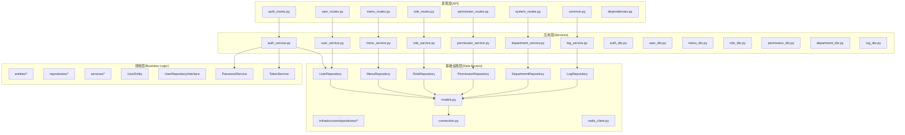
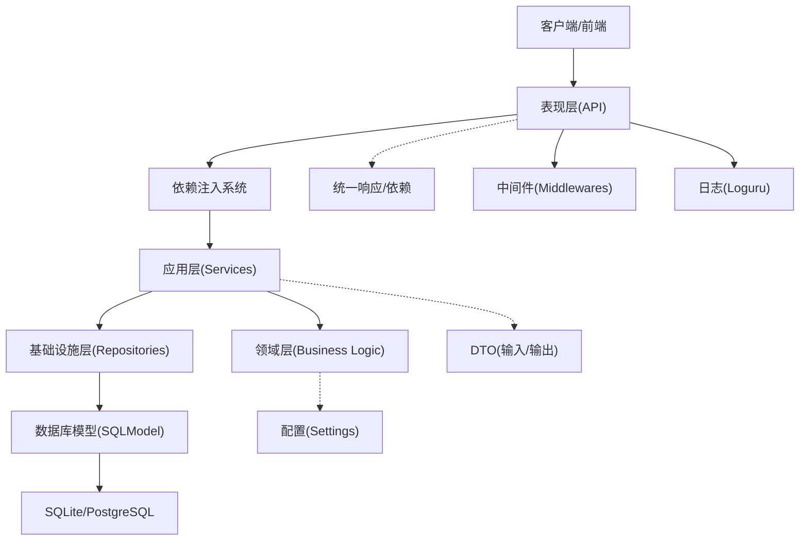
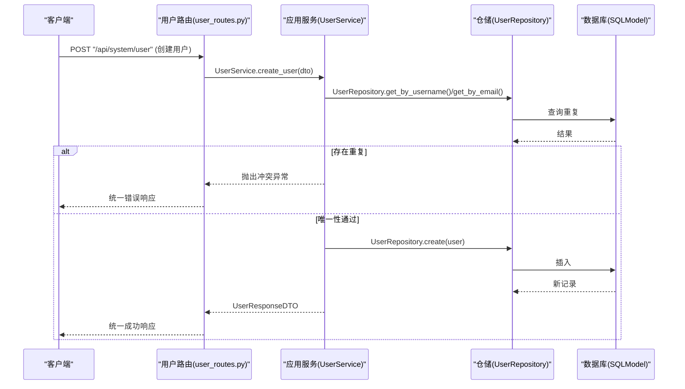
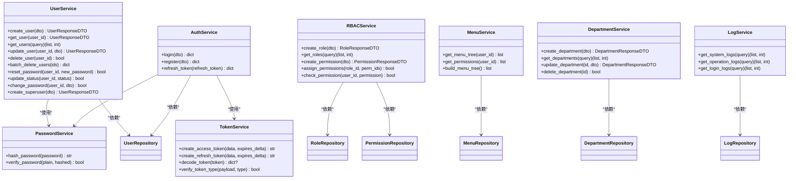
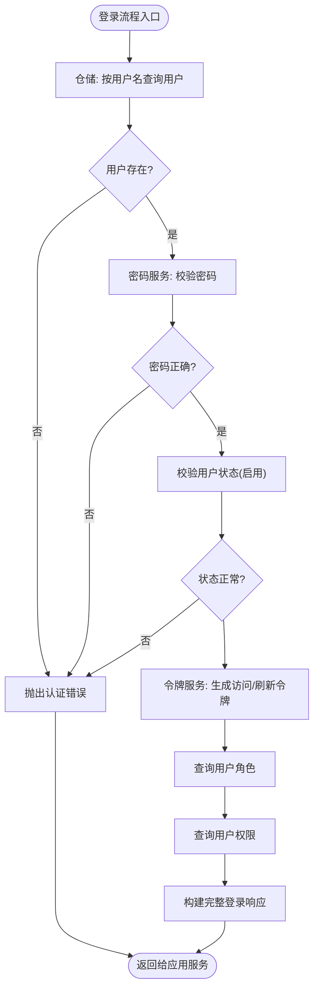
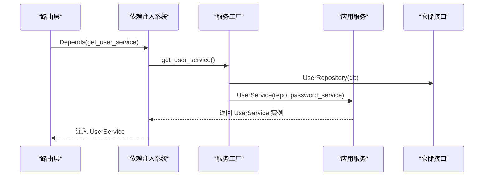
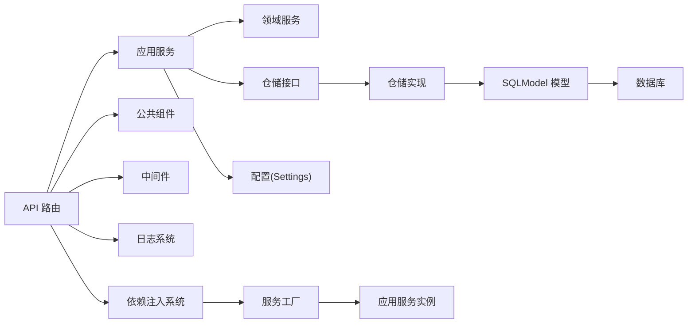

# DDD 分层架构详解

<cite>
**本文引用的文件**
- [main.py](file://service/src/main.py)
- [dependencies.py](file://service/src/api/dependencies.py)
- [__init__.py](file://service/src/domain/entities/__init__.py)
- [user.py](file://service/src/domain/entities/user.py)
- [__init__.py](file://service/src/domain/repositories/__init__.py)
- [user_repository.py](file://service/src/domain/repositories/user_repository.py)
- [__init__.py](file://service/src/domain/services/__init__.py)
- [password_service.py](file://service/src/domain/services/password_service.py)
- [user_repository.py](file://service/src/infrastructure/repositories/user_repository.py)
- [auth_service.py](file://service/src/application/services/auth_service.py)
- [auth_dto.py](file://service/src/application/dto/auth_dto.py)
- [models.py](file://service/src/infrastructure/database/models.py)
- [settings.py](file://service/src/config/settings.py)
- [constants.py](file://service/src/api/constants.py)
- [utils.py](file://service/src/api/common.py)
- [validators.py](file://service/src/application/validators.py)
- [pyproject.toml](file://service/pyproject.toml)
</cite>

## 更新摘要
**所做更改**
- 新增了完整的依赖注入系统架构分析，包括服务工厂和依赖项管理
- 重构了领域层结构，新增 domain/entities、domain/repositories、domain/services 三个子模块
- 完善了基础设施层的仓储实现，提供基于 FastCRUD 的通用 CRUD 功能
- 更新了应用层服务的依赖注入模式，实现更清晰的职责分离
- 增强了权限验证和认证流程的架构设计

## 目录
1. [引言](#引言)
2. [项目结构](#项目结构)
3. [核心组件](#核心组件)
4. [架构总览](#架构总览)
5. [详细组件分析](#详细组件分析)
6. [依赖注入系统](#依赖注入系统)
7. [依赖分析](#依赖分析)
8. [性能考虑](#性能考虑)
9. [故障排查指南](#故障排查指南)
10. [结论](#结论)
11. [附录](#附录)

## 引言
本文件面向 Hello-FastApi 的 DDD 分层架构，系统化阐述表现层（API）、应用层（Services）、领域层（Business Logic）、基础设施层（Data Access）四层的设计原则、职责边界、依赖关系与交互模式。通过具体代码路径与序列图、类图、流程图，帮助开发者建立清晰的分层理解与扩展路径，确保关注点分离、可测试性与可维护性。

**更新** 本次更新反映了全新的依赖注入系统和分层架构重构，包括新的 domain/entities、domain/repositories、domain/services 结构，以及基于工厂模式的服务创建机制。领域层现在完全独立于基础设施层，使用 dataclass 实现纯数据载体，仓储接口定义了数据持久化的抽象契约。

## 项目结构
服务端采用 FastAPI 应用工厂与模块化路由聚合，按 DDD 层次划分：
- 表现层（API）：路由定义、共享响应模型、依赖注入、中间件集成
- 应用层（Services）：业务用例编排、DTO 校验与转换、权限验证
- 领域层（Business Logic）：实体、仓储接口、领域服务，封装核心业务规则
- 基础设施层（Data Access）：SQLModel 模型、仓储实现、数据库连接、缓存集成



**图表来源**
- [main.py:1-73](file://service/src/main.py#L1-L73)
- [dependencies.py:1-201](file://service/src/api/dependencies.py#L1-L201)
- [__init__.py:1-15](file://service/src/domain/entities/__init__.py#L1-L15)
- [user_repository.py:1-112](file://service/src/domain/repositories/user_repository.py#L1-L112)
- [password_service.py:1-43](file://service/src/domain/services/password_service.py#L1-L43)
- [user_repository.py:1-198](file://service/src/infrastructure/repositories/user_repository.py#L1-L198)

**章节来源**
- [main.py:1-73](file://service/src/main.py#L1-L73)
- [dependencies.py:1-201](file://service/src/api/dependencies.py#L1-L201)
- [settings.py:1-198](file://service/src/config/settings.py#L1-L198)

## 核心组件
- 应用工厂与生命周期：在应用启动时初始化数据库、在关闭时释放连接；注册全局异常处理器与健康检查端点。
- 路由聚合：系统级路由统一挂载认证、用户、角色、权限、菜单、系统管理等子路由。
- 统一响应与依赖：提供统一响应体、分页响应与共享依赖注入（数据库会话、权限校验、当前用户）。
- 配置中心：基于环境变量与 .env 文件的多环境配置加载与缓存。
- 中间件集成：CORS、请求日志、异常处理等中间件的统一管理。
- 日志系统：基于 Loguru 的结构化日志记录与管理。
- **新增** 依赖注入系统：通过工厂函数和依赖项实现服务的创建与注入，遵循依赖倒置原则。

**章节来源**
- [main.py:19-73](file://service/src/main.py#L19-L73)
- [dependencies.py:36-48](file://service/src/api/dependencies.py#L36-L48)
- [settings.py:144-198](file://service/src/config/settings.py#L144-L198)
- [dependencies.py:1-201](file://service/src/api/dependencies.py#L1-L201)

## 架构总览
分层架构遵循"依赖倒置"原则：上层仅依赖抽象（接口/DTO），下层实现具体逻辑。表现层只感知应用服务；应用层编排业务用例并协调仓储；领域层封装核心业务规则；基础设施层提供数据持久化与外部集成能力。



**图表来源**
- [main.py:34-73](file://service/src/main.py#L34-L73)
- [dependencies.py:114-171](file://service/src/api/dependencies.py#L114-L171)
- [auth_service.py:1-151](file://service/src/application/services/auth_service.py#L1-151)
- [user_repository.py:11-198](file://service/src/infrastructure/repositories/user_repository.py#L11-L198)
- [models.py:31-193](file://service/src/infrastructure/database/models.py#L31-L193)

## 详细组件分析

### 表现层（API）
- 职责边界
  - 定义路由与 HTTP 协议契约，负责参数提取与依赖注入（数据库会话、权限校验、当前用户）。
  - 统一响应包装，保证对外接口的一致性与可观测性。
  - 集成中间件处理CORS、日志、异常等横切关注点。
- 关键交互
  - 认证路由：登录、注册、登出、刷新令牌。
  - 用户路由：列表、详情、创建、更新、删除、批量删除、重置密码、状态变更、修改密码。
  - RBAC路由：角色管理、权限管理、角色权限分配。
  - 菜单路由：菜单树获取、权限标识查询。
  - 系统路由：部门管理、系统日志、操作日志等扩展功能。
- 依赖关系
  - 依赖应用服务（AuthService/UserService/RBACService/MenuService）执行业务逻辑。
  - 依赖基础设施提供的数据库会话与仓储。
  - 依赖统一响应与依赖注入工具。
  - 集成中间件和日志系统。



**图表来源**
- [user_routes.py:54-74](file://service/src/api/v1/user_routes.py#L54-L74)
- [user_service.py:25-58](file://service/src/application/services/user_service.py#L25-L58)
- [user_repository.py:114-120](file://service/src/infrastructure/repositories/user_repository.py#L114-L120)
- [models.py:31-65](file://service/src/infrastructure/database/models.py#L31-L65)

**章节来源**
- [auth_routes.py:1-86](file://service/src/api/v1/auth_routes.py#L1-L86)
- [user_routes.py:1-252](file://service/src/api/v1/user_routes.py#L1-L252)
- [menu_routes.py:1-200](file://service/src/api/v1/menu_routes.py#L1-L200)
- [role_routes.py:1-150](file://service/src/api/v1/role_routes.py#L1-L150)
- [permission_routes.py:1-150](file://service/src/api/v1/permission_routes.py#L1-L150)
- [system_routes.py:1-180](file://service/src/api/v1/system_routes.py#L1-L180)
- [common.py:29-65](file://service/src/api/common.py#L29-L65)
- [dependencies.py:1-201](file://service/src/api/dependencies.py#L1-L201)

### 应用层（Services）
- 职责边界
  - 编排业务用例：参数校验（DTO）、领域服务调用、仓储交互、异常转换、响应组装。
  - 对外暴露稳定的服务接口，屏蔽底层实现细节。
  - 集成权限验证和业务规则检查。
- 关键流程
  - 用户服务：创建、查询、更新、删除、批量删除、重置密码、状态变更、修改密码、超级用户创建。
  - 认证服务：登录（校验密码、状态、生成令牌、拉取角色与权限）、注册（唯一性校验、密码哈希、创建用户）、刷新令牌（解码、类型校验、用户状态校验、签发新令牌）。
  - RBAC服务：角色管理、权限管理、角色权限分配、权限验证。
  - 菜单服务：菜单树构建、权限标识查询、菜单权限控制。
  - 部门服务：部门管理、组织架构维护。
  - 日志服务：系统日志、操作日志、登录日志管理。
- 依赖关系
  - 使用领域服务（密码/令牌）与仓储接口。
  - 依赖配置（JWT 过期时间等）。
  - 集成权限验证和业务规则。



**图表来源**
- [auth_service.py:18-151](file://service/src/application/services/auth_service.py#L18-L151)
- [password_service.py:6-43](file://service/src/domain/services/password_service.py#L6-L43)
- [token_service.py:11-45](file://service/src/domain/services/token_service.py#L11-L45)

**章节来源**
- [auth_service.py:1-151](file://service/src/application/services/auth_service.py#L1-L151)
- [auth_dto.py:1-100](file://service/src/application/dto/auth_dto.py#L1-L100)
- [user_dto.py:1-86](file://service/src/application/dto/user_dto.py#L1-L86)
- [menu_dto.py:1-120](file://service/src/application/dto/menu_dto.py#L1-L120)
- [role_dto.py:1-100](file://service/src/application/dto/role_dto.py#L1-L100)
- [permission_dto.py:1-150](file://service/src/application/dto/permission_dto.py#L1-L150)
- [department_dto.py:1-100](file://service/src/application/dto/department_dto.py#L1-L100)
- [log_dto.py:1-80](file://service/src/application/dto/log_dto.py#L1-L80)

### 领域层（Business Logic）
- 职责边界
  - 封装核心业务规则与不变式，如密码哈希策略、JWT 令牌生成与校验、用户唯一性约束等。
  - 定义业务实体和领域服务，确保业务逻辑的纯净性和可测试性。
  - 提供抽象仓储接口，隔离具体存储实现。
- 关键实现
  - **新增** 领域实体：使用 dataclass 实现的纯数据载体，不依赖任何外部库。
  - **新增** 领域仓储接口：定义数据持久化操作的契约，不依赖任何具体实现。
  - 密码服务：使用 bcrypt 进行哈希与校验。
  - 令牌服务：基于 python-jose 实现 JWT 的签发、解码与类型校验。
  - **新增** 用户实体：包含用户的所有领域属性和业务逻辑。
  - **新增** 用户仓储接口：定义用户领域操作的抽象契约，隔离具体存储实现。



**图表来源**
- [auth_service.py:26-74](file://service/src/application/services/auth_service.py#L26-L74)
- [password_service.py:17-21](file://service/src/domain/services/password_service.py#L17-L21)
- [token_service.py:14-44](file://service/src/domain/services/token_service.py#L14-L44)

**章节来源**
- [user.py:1-51](file://service/src/domain/entities/user.py#L1-L51)
- [user_repository.py:1-112](file://service/src/domain/repositories/user_repository.py#L1-L112)
- [password_service.py:1-43](file://service/src/domain/services/password_service.py#L1-L43)
- [token_service.py:1-45](file://service/src/domain/services/token_service.py#L1-L45)

### 基础设施层（Data Access）
- 职责边界
  - 提供数据持久化与外部集成能力，屏蔽数据库差异与 ORM 细节。
  - 实现领域接口，提供具体的数据访问实现。
  - 管理数据库连接、缓存、外部服务集成。
- 关键实现
  - **新增** 仓储实现：基于 FastCRUD 的异步查询、分页、计数、批量删除、状态更新、密码重置等。
  - SQLModel 模型：定义用户、角色、权限、菜单、IP 规则等实体及关系。
  - 仓储实现：基于 SQLModel 的异步查询、分页、计数、批量删除、状态更新、密码重置等。
  - 数据库连接：异步引擎、会话管理、初始化与关闭。
  - 缓存集成：Redis 客户端集成，支持令牌缓存、验证码缓存等。
  - 外部服务：提供统一的外部服务访问接口。

```mermaid
erDiagram
USER {
string id PK
string username UK
string email
string hashed_password
string nickname
string avatar
string phone
int sex
int status
string dept_id
bool is_superuser
timestamp created_at
timestamp updated_at
}
ROLE {
string id PK
string name
string code UK
string description
int status
timestamp created_at
timestamp updated_at
}
PERMISSION {
string id PK
string name
string code UK
string category
string resource
string action
int status
timestamp created_at
timestamp updated_at
}
USER_ROLES {
string id PK
string user_id FK
string role_id FK
timestamp assigned_at
}
ROLE_PERMISSIONS {
string role_id PK FK
string permission_id PK FK
}
MENU {
string id PK
string name
string path
string component
string icon
string title
string parent_id
int order_num
string permissions
int status
timestamp created_at
timestamp updated_at
}
IPRULE {
string id PK
string ip_address
string rule_type
string reason
bool is_active
timestamp created_at
timestamp expires_at
}
USER ||--o{ USER_ROLES : "拥有"
ROLE ||--o{ USER_ROLES : "授予"
ROLE ||--o{ ROLE_PERMISSIONS : "拥有"
PERMISSION ||--o{ ROLE_PERMISSIONS : "授权"
```

**图表来源**
- [models.py:31-193](file://service/src/infrastructure/database/models.py#L31-L193)

**章节来源**
- [models.py:1-193](file://service/src/infrastructure/database/models.py#L1-L193)
- [user_repository.py:1-198](file://service/src/infrastructure/repositories/user_repository.py#L1-L198)
- [connection.py:1-35](file://service/src/infrastructure/database/connection.py#L1-L35)

## 依赖注入系统
**新增** 依赖注入系统是本次架构重构的核心改进，通过工厂函数和依赖项实现服务的创建与注入。

- **服务工厂模式**
  - 领域服务工厂：`get_password_service()`、`get_token_service()` 提供密码和令牌服务实例。
  - 应用服务工厂：`get_auth_service()`、`get_user_service()`、`get_menu_service()` 等创建应用服务。
  - 仓储工厂：提供直接使用的仓储实例。
- **认证依赖项**
  - `get_current_user_id()`：从 JWT 令牌中提取并验证当前用户 ID。
  - `get_current_active_user()`：从数据库获取当前活跃用户。
  - `require_permission()`：权限检查依赖工厂。
  - `require_superuser()`：超级用户权限检查。
- **依赖注入模式**
  - 所有服务通过 `Depends()` 装饰器注入到路由层。
  - 遵循依赖倒置原则，路由层只依赖抽象接口。
  - 支持嵌套依赖，如应用服务依赖仓储和领域服务。



**图表来源**
- [dependencies.py:114-133](file://service/src/api/dependencies.py#L114-L133)
- [dependencies.py:178-185](file://service/src/api/dependencies.py#L178-L185)

**章节来源**
- [dependencies.py:1-201](file://service/src/api/dependencies.py#L1-L201)

## 依赖分析
- 层内依赖
  - 表现层仅依赖应用服务与公共组件，不直接访问仓储或模型。
  - 应用层依赖领域服务与仓储接口，不直接操作数据库。
  - 领域层仅包含纯业务逻辑，不依赖框架或外部库。
  - 基础设施层依赖 ORM 与数据库驱动，向上提供抽象接口。
- 外部依赖
  - FastAPI、SQLModel、aiosqlite/asyncpg、bcrypt、python-jose、Redis、loguru 等。
- 循环依赖
  - 通过接口与 DTO 解耦，避免循环依赖；路由聚合统一入口，避免跨层直接引用。
  - **新增** 依赖注入系统避免了复杂的构造函数依赖传递。
- 中间件依赖
  - CORS、日志、异常处理等中间件独立于业务逻辑，通过应用工厂统一注册。



**图表来源**
- [pyproject.toml:7-20](file://service/pyproject.toml#L7-L20)
- [main.py:11-16](file://service/src/main.py#L11-L16)
- [settings.py:41-108](file://service/src/config/settings.py#L41-L108)
- [dependencies.py:36-48](file://service/src/api/dependencies.py#L36-L48)

**章节来源**
- [pyproject.toml:1-76](file://service/pyproject.toml#L1-L76)
- [main.py:1-73](file://service/src/main.py#L1-L73)

## 性能考虑
- 异步与连接池
  - 使用异步 SQLModel 与连接池预检，减少连接开销与超时问题。
  - Redis 缓存集成，支持令牌缓存、验证码缓存与接口限流。
- 查询优化
  - 分页与条件过滤在仓储层实现，避免一次性加载大结果集。
  - 复合索引设计，优化常用查询条件（用户名、邮箱、状态等）。
  - **新增** 基于 FastCRUD 的通用 CRUD 实现，提供高性能的数据访问。
- 缓存策略
  - JWT 令牌缓存，减少重复计算。
  - RBAC 权限缓存，提升权限验证性能。
  - 菜单树缓存，优化前端菜单渲染。
- 日志与监控
  - 结构化日志记录，便于性能分析和问题定位。
  - 中间件集成请求日志，监控API性能指标。
- **新增** 依赖注入性能
  - 工厂函数缓存服务实例，避免重复创建。
  - 依赖注入容器优化，减少依赖解析开销。

**章节来源**
- [redis_client.py:1-100](file://service/src/infrastructure/cache/redis_client.py#L1-L100)
- [middlewares.py:1-150](file://service/src/api/middlewares.py#L1-L150)
- [logger.py:1-120](file://service/src/infrastructure/logging/logger.py#L1-L120)
- [user_repository.py:58-88](file://service/src/infrastructure/repositories/user_repository.py#L58-L88)

## 故障排查指南
- 常见异常
  - 未找到资源：返回 404，提示资源不存在。
  - 冲突/重复：返回 409，提示唯一性冲突。
  - 未授权/权限不足：返回 401/403，提示认证或权限问题。
  - 参数验证失败：返回 422，携带错误详情。
  - 未捕获异常：返回 500，记录错误日志。
- 排查步骤
  - 检查路由与依赖注入是否正确传递数据库会话。
  - 核对 DTO 字段与校验规则，确认请求体格式。
  - 查看应用服务中的异常转换与领域服务调用链。
  - 检查数据库连接初始化与关闭流程。
  - 验证中间件配置和日志记录。
  - 检查Redis缓存连接和配置。
  - **新增** 检查依赖注入配置，确认服务工厂正确创建实例。
  - **新增** 验证领域实体和仓储接口的实现一致性。

**章节来源**
- [exceptions.py:6-60](file://service/src/domain/exceptions.py#L6-L60)
- [main.py:46-59](file://service/src/main.py#L46-L59)
- [middlewares.py:1-150](file://service/src/api/middlewares.py#L1-L150)
- [logger.py:1-120](file://service/src/infrastructure/logging/logger.py#L1-L120)

## 结论
本项目以 DDD 分层架构为核心，通过明确的职责边界与依赖方向，实现了关注点分离、可测试性与可维护性。表现层专注协议与响应，应用层编排业务，领域层封装不变式，基础设施层屏蔽存储细节。配合统一异常处理、配置中心、中间件集成与日志系统，形成高内聚、低耦合的工程化体系。

**更新** 新增的依赖注入系统和分层架构重构进一步提升了架构的灵活性和可维护性。全新的 domain/entities、domain/repositories、domain/services 结构使领域层更加清晰，基于 FastCRUD 的仓储实现提供了高性能的数据访问能力，服务工厂模式简化了依赖管理。建议在扩展新功能时严格遵循分层边界，优先在应用层组合用例，在领域层沉淀规则，并通过仓储接口与 DTO 保持上下层解耦。

## 附录
- 扩展建议
  - 新增领域实体：在领域层定义接口与实体，于基础设施层提供仓储实现与模型定义。
  - 新增业务用例：在应用层新增服务方法，复用 DTO 与异常体系。
  - 新增路由：在表现层定义路由与依赖，调用应用服务并返回统一响应。
  - 配置与环境：通过 Settings 类集中管理，按环境切换数据库与日志级别。
  - 中间件扩展：在核心层添加新的中间件，统一处理横切关注点。
  - 缓存策略：根据业务特点设计合适的缓存策略，提升系统性能。
  - **新增** 依赖注入扩展：通过服务工厂添加新的服务实例，保持依赖注入的一致性。
  - **新增** 领域层扩展：遵循现有模式添加新的实体、仓储接口和服务，确保架构一致性。