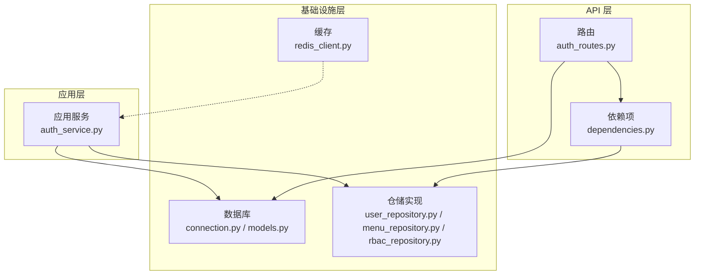
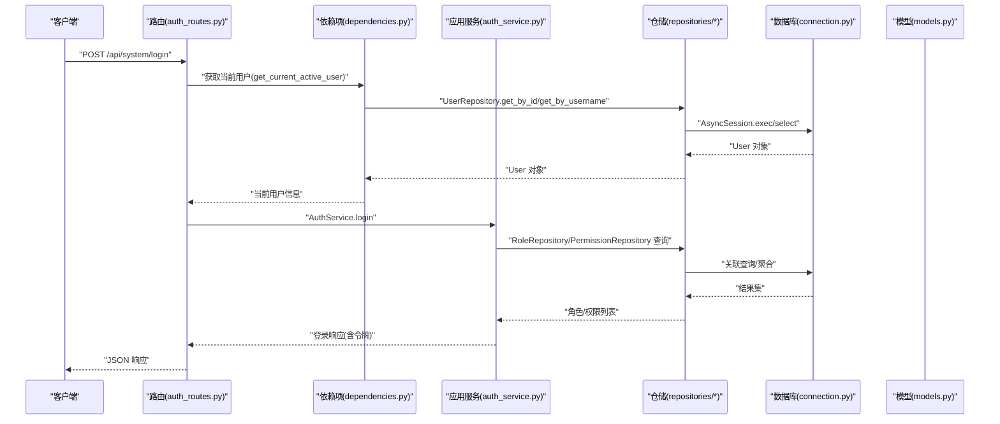
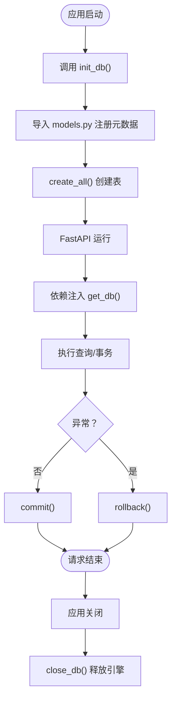
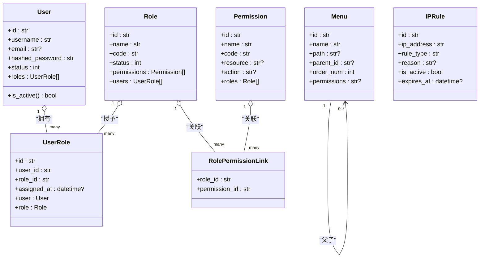
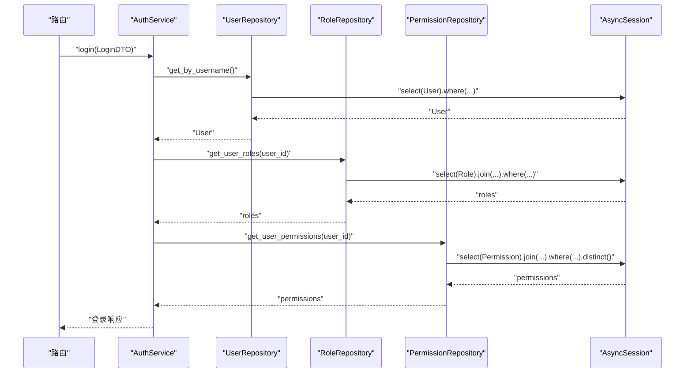
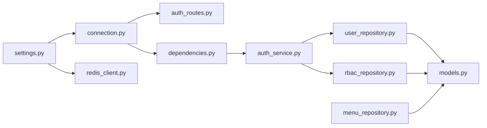

# 基础设施层（Data Access）

<cite>
**本文引用的文件**
- [service/src/infrastructure/database/models.py](file://service/src/infrastructure/database/models.py)
- [service/src/infrastructure/database/connection.py](file://service/src/infrastructure/database/connection.py)
- [service/src/infrastructure/cache/redis_client.py](file://service/src/infrastructure/cache/redis_client.py)
- [service/src/infrastructure/repositories/user_repository.py](file://service/src/infrastructure/repositories/user_repository.py)
- [service/src/infrastructure/repositories/menu_repository.py](file://service/src/infrastructure/repositories/menu_repository.py)
- [service/src/infrastructure/repositories/rbac_repository.py](file://service/src/infrastructure/repositories/rbac_repository.py)
- [service/src/domain/user/repository.py](file://service/src/domain/user/repository.py)
- [service/src/config/settings.py](file://service/src/config/settings.py)
- [service/src/main.py](file://service/src/main.py)
- [service/src/api/v1/auth_routes.py](file://service/src/api/v1/auth_routes.py)
- [service/src/api/dependencies.py](file://service/src/api/dependencies.py)
- [service/src/application/services/auth_service.py](file://service/src/application/services/auth_service.py)
- [service/tests/conftest.py](file://service/tests/conftest.py)
</cite>

## 目录
1. [引言](#引言)
2. [项目结构](#项目结构)
3. [核心组件](#核心组件)
4. [架构总览](#架构总览)
5. [详细组件分析](#详细组件分析)
6. [依赖分析](#依赖分析)
7. [性能考量](#性能考量)
8. [故障排查指南](#故障排查指南)
9. [结论](#结论)
10. [附录](#附录)

## 引言
本章节面向基础设施层（Data Access）的技术文档，聚焦于数据访问抽象、外部服务集成与基础设施配置。内容涵盖：
- SQLModel ORM 模型的表结构设计、关系映射与查询优化思路
- 数据库连接管理、事务处理与连接池配置
- 仓储实现类的编写范式、SQL 查询构建与异步数据库操作
- Redis 缓存客户端的集成、缓存策略、数据序列化与性能优化
- 通过依赖注入实现基础设施层的替换与测试

## 项目结构
基础设施层位于 service/src/infrastructure 下，主要分为三部分：
- database：数据库连接与 ORM 模型
- repositories：领域仓库接口与 SQLModel 实现
- cache：Redis 缓存客户端



图表来源
- [service/src/infrastructure/database/connection.py:1-35](file://service/src/infrastructure/database/connection.py#L1-L35)
- [service/src/infrastructure/database/models.py:1-193](file://service/src/infrastructure/database/models.py#L1-L193)
- [service/src/infrastructure/repositories/user_repository.py:1-185](file://service/src/infrastructure/repositories/user_repository.py#L1-L185)
- [service/src/infrastructure/repositories/menu_repository.py:1-50](file://service/src/infrastructure/repositories/menu_repository.py#L1-L50)
- [service/src/infrastructure/repositories/rbac_repository.py:1-213](file://service/src/infrastructure/repositories/rbac_repository.py#L1-L213)
- [service/src/infrastructure/cache/redis_client.py:1-24](file://service/src/infrastructure/cache/redis_client.py#L1-L24)
- [service/src/application/services/auth_service.py:1-154](file://service/src/application/services/auth_service.py#L1-L154)
- [service/src/api/v1/auth_routes.py:1-86](file://service/src/api/v1/auth_routes.py#L1-L86)
- [service/src/api/dependencies.py:1-72](file://service/src/api/dependencies.py#L1-L72)

章节来源
- [service/src/infrastructure/database/connection.py:1-35](file://service/src/infrastructure/database/connection.py#L1-L35)
- [service/src/infrastructure/database/models.py:1-193](file://service/src/infrastructure/database/models.py#L1-L193)
- [service/src/infrastructure/repositories/user_repository.py:1-185](file://service/src/infrastructure/repositories/user_repository.py#L1-L185)
- [service/src/infrastructure/repositories/menu_repository.py:1-50](file://service/src/infrastructure/repositories/menu_repository.py#L1-L50)
- [service/src/infrastructure/repositories/rbac_repository.py:1-213](file://service/src/infrastructure/repositories/rbac_repository.py#L1-L213)
- [service/src/infrastructure/cache/redis_client.py:1-24](file://service/src/infrastructure/cache/redis_client.py#L1-L24)

## 核心组件
- 数据库引擎与会话：基于 SQLModel/SQLAlchemy 异步引擎，提供 get_db 依赖项，自动提交/回滚事务，支持连接池预检测
- ORM 模型：统一使用 SQLModel 定义，兼顾 SQLAlchemy ORM 与 Pydantic 数据校验；模型具备索引、外键、默认值与关系映射
- 仓储实现：面向领域接口的 SQLModel 实现，封装 CRUD、分页、筛选与复杂关联查询
- Redis 客户端：提供异步 Redis 客户端获取与关闭方法，支持连接复用与编码配置

章节来源
- [service/src/infrastructure/database/connection.py:1-35](file://service/src/infrastructure/database/connection.py#L1-L35)
- [service/src/infrastructure/database/models.py:1-193](file://service/src/infrastructure/database/models.py#L1-L193)
- [service/src/infrastructure/repositories/user_repository.py:1-185](file://service/src/infrastructure/repositories/user_repository.py#L1-L185)
- [service/src/infrastructure/repositories/menu_repository.py:1-50](file://service/src/infrastructure/repositories/menu_repository.py#L1-L50)
- [service/src/infrastructure/repositories/rbac_repository.py:1-213](file://service/src/infrastructure/repositories/rbac_repository.py#L1-L213)
- [service/src/infrastructure/cache/redis_client.py:1-24](file://service/src/infrastructure/cache/redis_client.py#L1-L24)

## 架构总览
基础设施层通过依赖注入向应用层与 API 层提供数据访问能力，同时通过配置模块集中管理数据库与缓存连接参数。



图表来源
- [service/src/api/v1/auth_routes.py:1-86](file://service/src/api/v1/auth_routes.py#L1-L86)
- [service/src/api/dependencies.py:1-72](file://service/src/api/dependencies.py#L1-L72)
- [service/src/application/services/auth_service.py:1-154](file://service/src/application/services/auth_service.py#L1-L154)
- [service/src/infrastructure/repositories/user_repository.py:1-185](file://service/src/infrastructure/repositories/user_repository.py#L1-L185)
- [service/src/infrastructure/repositories/rbac_repository.py:1-213](file://service/src/infrastructure/repositories/rbac_repository.py#L1-L213)
- [service/src/infrastructure/database/connection.py:1-35](file://service/src/infrastructure/database/connection.py#L1-L35)
- [service/src/infrastructure/database/models.py:1-193](file://service/src/infrastructure/database/models.py#L1-L193)

## 详细组件分析

### 数据库连接与会话管理
- 异步引擎创建：使用 settings.DATABASE_URL 初始化异步引擎，开启 echo 与 pool_pre_ping
- 会话依赖：get_db 提供 AsyncSession，自动 commit/rollback，避免过期对象
- 初始化与关闭：init_db 基于 SQLModel.metadata.create_all 创建表；close_db 释放引擎资源



图表来源
- [service/src/infrastructure/database/connection.py:1-35](file://service/src/infrastructure/database/connection.py#L1-L35)
- [service/src/config/settings.py:57-62](file://service/src/config/settings.py#L57-L62)
- [service/src/main.py:19-32](file://service/src/main.py#L19-L32)

章节来源
- [service/src/infrastructure/database/connection.py:1-35](file://service/src/infrastructure/database/connection.py#L1-L35)
- [service/src/config/settings.py:57-62](file://service/src/config/settings.py#L57-L62)
- [service/src/main.py:19-32](file://service/src/main.py#L19-L32)

### SQLModel ORM 模型与关系映射
- 用户、角色、权限、用户-角色、角色-权限关联、菜单、IP 规则等模型
- 字段约束：主键、唯一索引、可空、默认值、时间戳、枚举状态
- 关系映射：一对多、多对多通过 link_model 与 Relationship 定义
- 查询优化建议：
  - 为高频过滤字段建立索引（如 username、email、code、parent_id）
  - 使用 selectin 加载策略减少 N+1 查询
  - 分页使用 offset/limit，避免一次性加载大结果集
  - 聚合查询使用 func.count 等，避免 in-memory 计算



图表来源
- [service/src/infrastructure/database/models.py:17-193](file://service/src/infrastructure/database/models.py#L17-L193)

章节来源
- [service/src/infrastructure/database/models.py:1-193](file://service/src/infrastructure/database/models.py#L1-L193)

### 仓储实现类与查询构建
- UserRepository：支持按 id/username/email 查询、分页筛选、计数、创建/更新/删除、批量删除、状态更新、密码重置
- MenuRepository：支持获取全部/按 id/按父 id 查询、创建/更新/删除
- RoleRepository/PermissionRepository：支持角色/权限的增删改查、角色权限分配、用户角色/权限查询



图表来源
- [service/src/application/services/auth_service.py:26-74](file://service/src/application/services/auth_service.py#L26-L74)
- [service/src/infrastructure/repositories/user_repository.py:17-30](file://service/src/infrastructure/repositories/user_repository.py#L17-L30)
- [service/src/infrastructure/repositories/rbac_repository.py:128-133](file://service/src/infrastructure/repositories/rbac_repository.py#L128-L133)
- [service/src/infrastructure/repositories/rbac_repository.py:203-212](file://service/src/infrastructure/repositories/rbac_repository.py#L203-L212)

章节来源
- [service/src/infrastructure/repositories/user_repository.py:1-185](file://service/src/infrastructure/repositories/user_repository.py#L1-L185)
- [service/src/infrastructure/repositories/menu_repository.py:1-50](file://service/src/infrastructure/repositories/menu_repository.py#L1-L50)
- [service/src/infrastructure/repositories/rbac_repository.py:1-213](file://service/src/infrastructure/repositories/rbac_repository.py#L1-L213)
- [service/src/domain/user/repository.py:1-50](file://service/src/domain/user/repository.py#L1-L50)

### Redis 缓存客户端集成
- 客户端获取：get_redis 从 settings.REDIS_URL 创建/复用 Redis 实例，设置编码与解码
- 生命周期：close_redis 关闭连接并清空全局实例
- 使用建议：
  - 采用键空间命名规范，结合 TTL 控制过期
  - 对热点数据进行序列化存储，注意一致性与缓存穿透防护
  - 结合业务场景选择合适的过期策略与淘汰机制

章节来源
- [service/src/infrastructure/cache/redis_client.py:1-24](file://service/src/infrastructure/cache/redis_client.py#L1-L24)
- [service/src/config/settings.py:60-61](file://service/src/config/settings.py#L60-L61)

### 依赖注入与替换、测试
- FastAPI 依赖注入：API 路由通过 Depends(get_db) 获取 AsyncSession；依赖项模块提供鉴权与权限检查
- 替换与测试：测试通过 app.dependency_overrides 将 get_db 替换为内存数据库会话，确保隔离与可控
- 最佳实践：
  - 将底层实现（数据库、缓存）抽象为接口或依赖函数，便于替换
  - 在单元测试中使用依赖覆盖，注入模拟或内存实现
  - 对事务边界清晰划分，避免长事务与死锁

```mermaid
sequenceDiagram
participant Test as "测试客户端"
participant App as "FastAPI 应用"
participant Over as "dependency_overrides"
participant DB as "内存引擎"
participant Repo as "仓储"
Test->>App : "发起请求"
App->>Over : "覆盖 get_db"
Over->>DB : "返回 AsyncSession"
DB-->>Repo : "会话"
Repo-->>App : "执行业务逻辑"
App-->>Test : "响应"
Test->>App : "清理覆盖"
```

图表来源
- [service/tests/conftest.py:54-61](file://service/tests/conftest.py#L54-L61)
- [service/src/api/dependencies.py:32-43](file://service/src/api/dependencies.py#L32-L43)
- [service/src/infrastructure/database/connection.py:12-21](file://service/src/infrastructure/database/connection.py#L12-L21)

章节来源
- [service/src/api/dependencies.py:1-72](file://service/src/api/dependencies.py#L1-L72)
- [service/tests/conftest.py:1-105](file://service/tests/conftest.py#L1-L105)

## 依赖分析
- 配置中心：settings 提供 DATABASE_URL、REDIS_URL、日志级别等关键参数
- 应用生命周期：main.py 在 lifespan 中初始化数据库并在关闭时释放连接
- 路由与依赖：auth_routes 与 dependencies 通过 get_db 与 TokenService 协作
- 仓储与模型：各仓储依赖 AsyncSession 与 models 中的实体类



图表来源
- [service/src/config/settings.py:57-62](file://service/src/config/settings.py#L57-L62)
- [service/src/infrastructure/database/connection.py:1-35](file://service/src/infrastructure/database/connection.py#L1-L35)
- [service/src/infrastructure/cache/redis_client.py:1-24](file://service/src/infrastructure/cache/redis_client.py#L1-L24)
- [service/src/api/v1/auth_routes.py:1-86](file://service/src/api/v1/auth_routes.py#L1-L86)
- [service/src/api/dependencies.py:1-72](file://service/src/api/dependencies.py#L1-L72)
- [service/src/application/services/auth_service.py:1-154](file://service/src/application/services/auth_service.py#L1-L154)
- [service/src/infrastructure/repositories/user_repository.py:1-185](file://service/src/infrastructure/repositories/user_repository.py#L1-L185)
- [service/src/infrastructure/repositories/rbac_repository.py:1-213](file://service/src/infrastructure/repositories/rbac_repository.py#L1-L213)
- [service/src/infrastructure/repositories/menu_repository.py:1-50](file://service/src/infrastructure/repositories/menu_repository.py#L1-L50)
- [service/src/infrastructure/database/models.py:1-193](file://service/src/infrastructure/database/models.py#L1-L193)

章节来源
- [service/src/config/settings.py:1-198](file://service/src/config/settings.py#L1-L198)
- [service/src/main.py:1-96](file://service/src/main.py#L1-L96)

## 性能考量
- 数据库
  - 使用索引：对高频过滤字段（username、email、code、parent_id）建立索引
  - 分页与限制：避免一次性加载大量数据，使用 offset/limit
  - 关联查询：优先使用 join 并配合 distinct，减少往返
  - 事务：合并多次写操作，减少 flush 次数
- 缓存
  - 热点数据缓存：对读多写少的数据设置合理 TTL
  - 序列化：统一序列化方案，避免频繁转换开销
  - 缓存穿透：对空结果也做短 TTL 缓存
- 连接池
  - 合理配置 pool_pre_ping，保证连接可用性
  - 控制并发与超时，避免连接耗尽

## 故障排查指南
- 数据库连接失败
  - 检查 DATABASE_URL 是否正确，确认数据库可达
  - 查看 init_db 是否在 lifespan 中执行
- 事务未提交或回滚
  - 确认 get_db 的 try/except/finally 流程是否正确
  - 检查业务逻辑中是否有异常导致回滚
- 查询性能问题
  - 使用 explain/analyze 分析慢查询
  - 为过滤字段添加索引，避免全表扫描
- 缓存不生效
  - 检查 REDIS_URL 与编码设置
  - 校验键空间命名与 TTL 设置
- 依赖注入问题
  - 测试中使用 dependency_overrides 覆盖 get_db
  - 确保路由依赖链路正确传递 AsyncSession

章节来源
- [service/src/infrastructure/database/connection.py:12-21](file://service/src/infrastructure/database/connection.py#L12-L21)
- [service/tests/conftest.py:54-61](file://service/tests/conftest.py#L54-L61)

## 结论
基础设施层通过 SQLModel 提供一致的 ORM 抽象，结合依赖注入与配置中心，实现了数据库与缓存的可替换与可测试化。仓储层封装了领域所需的 CRUD 与复杂查询，配合合理的索引与分页策略，能够满足大多数业务场景的数据访问需求。建议在实际项目中持续关注查询性能、连接池配置与缓存策略，并通过依赖覆盖实现高效的单元测试。

## 附录
- 配置项参考
  - DATABASE_URL：数据库连接字符串
  - REDIS_URL：Redis 连接字符串
  - LOG_LEVEL：日志级别
- 常用查询模式
  - 分页查询：offset/limit + where 条件
  - 聚合计数：func.count + where 条件
  - 多表关联：select(...).join(...).where(...).distinct()