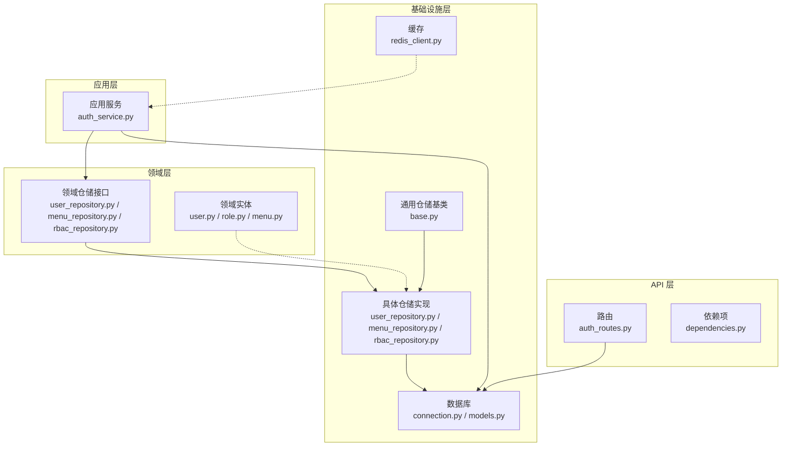
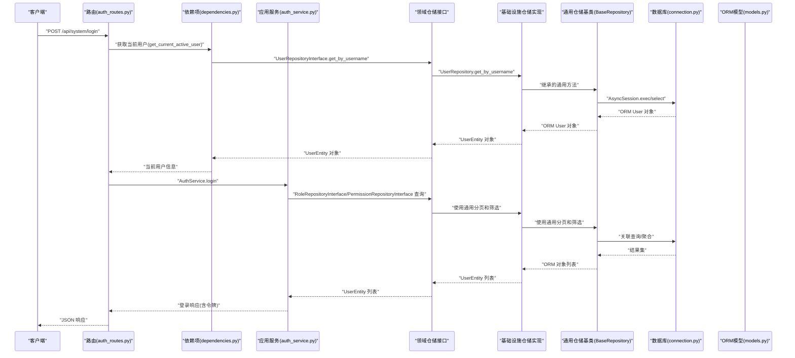
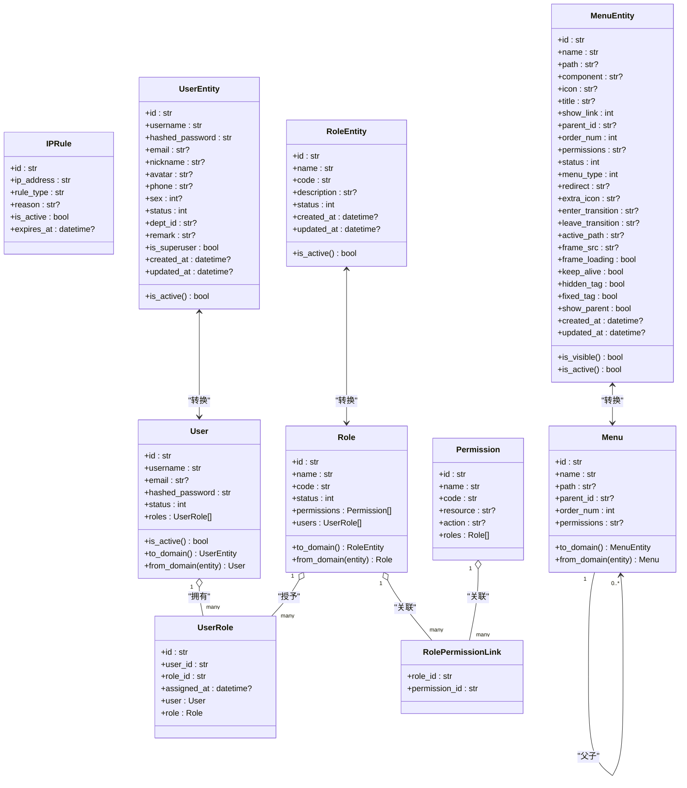
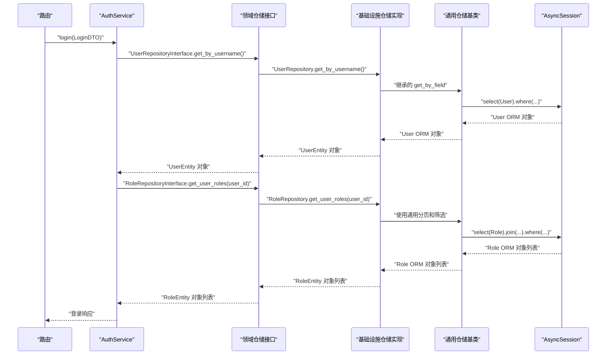
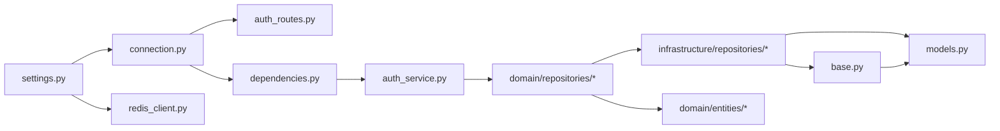

# 基础设施层（Data Access）

<cite>
**本文引用的文件**
- [service/src/infrastructure/database/models.py](file://service/src/infrastructure/database/models.py)
- [service/src/infrastructure/database/connection.py](file://service/src/infrastructure/database/connection.py)
- [service/src/infrastructure/cache/redis_client.py](file://service/src/infrastructure/cache/redis_client.py)
- [service/src/infrastructure/repositories/base.py](file://service/src/infrastructure/repositories/base.py)
- [service/src/infrastructure/repositories/user_repository.py](file://service/src/infrastructure/repositories/user_repository.py)
- [service/src/infrastructure/repositories/menu_repository.py](file://service/src/infrastructure/repositories/menu_repository.py)
- [service/src/infrastructure/repositories/rbac_repository.py](file://service/src/infrastructure/repositories/rbac_repository.py)
- [service/src/domain/repositories/user_repository.py](file://service/src/domain/repositories/user_repository.py)
- [service/src/domain/repositories/menu_repository.py](file://service/src/domain/repositories/menu_repository.py)
- [service/src/domain/repositories/rbac_repository.py](file://service/src/domain/repositories/rbac_repository.py)
- [service/src/domain/entities/user.py](file://service/src/domain/entities/user.py)
- [service/src/domain/entities/role.py](file://service/src/domain/entities/role.py)
- [service/src/domain/entities/menu.py](file://service/src/domain/entities/menu.py)
- [service/src/config/settings.py](file://service/src/config/settings.py)
- [service/src/main.py](file://service/src/main.py)
- [service/src/api/v1/auth_routes.py](file://service/src/api/v1/auth_routes.py)
- [service/src/api/dependencies.py](file://service/src/api/dependencies.py)
- [service/src/application/services/auth_service.py](file://service/src/application/services/auth_service.py)
- [service/tests/conftest.py](file://service/tests/conftest.py)
</cite>

## 更新摘要
**所做更改**
- 新增实体转换方法章节，详细说明 to_domain() 和 from_domain() 的实现
- 更新仓储依赖关系，说明基础设施仓储现在依赖新的抽象接口
- 新增领域实体定义章节，介绍领域层数据模型
- 更新架构图以反映实体转换和接口依赖的新架构
- 新增实体转换最佳实践指导

## 目录
1. [引言](#引言)
2. [项目结构](#项目结构)
3. [核心组件](#核心组件)
4. [架构总览](#架构总览)
5. [详细组件分析](#详细组件分析)
6. [依赖分析](#依赖分析)
7. [性能考量](#性能考量)
8. [故障排查指南](#故障排查指南)
9. [结论](#结论)
10. [附录](#附录)

## 引言
本章节面向基础设施层（Data Access）的技术文档，聚焦于数据访问抽象、外部服务集成与基础设施配置。内容涵盖：
- SQLModel ORM 模型的表结构设计、关系映射与查询优化思路
- 数据库连接管理、事务处理与连接池配置
- 通用仓储基类的实现与使用，显著减少仓储层样板代码
- 仓储实现类的编写范式、SQL 查询构建与异步数据库操作
- Redis 缓存客户端的集成、缓存策略、数据序列化与性能优化
- 通过依赖注入实现基础设施层的替换与测试
- 实体转换方法的实现，支持领域层与基础设施层之间的数据转换

## 项目结构
基础设施层位于 service/src/infrastructure 下，主要分为四部分：
- database：数据库连接与 ORM 模型
- repositories：通用仓储基类与具体仓储实现
- cache：Redis 缓存客户端
- domain：领域接口定义和领域实体



**图表来源**
- [service/src/infrastructure/database/connection.py:1-35](file://service/src/infrastructure/database/connection.py#L1-L35)
- [service/src/infrastructure/database/models.py:1-479](file://service/src/infrastructure/database/models.py#L1-L479)
- [service/src/infrastructure/repositories/base.py:1-205](file://service/src/infrastructure/repositories/base.py#L1-L205)
- [service/src/infrastructure/repositories/user_repository.py:1-169](file://service/src/infrastructure/repositories/user_repository.py#L1-L169)
- [service/src/infrastructure/repositories/menu_repository.py:1-50](file://service/src/infrastructure/repositories/menu_repository.py#L1-L50)
- [service/src/infrastructure/repositories/rbac_repository.py:1-265](file://service/src/infrastructure/repositories/rbac_repository.py#L1-L265)
- [service/src/infrastructure/cache/redis_client.py:1-24](file://service/src/infrastructure/cache/redis_client.py#L1-L24)
- [service/src/domain/repositories/user_repository.py:1-107](file://service/src/domain/repositories/user_repository.py#L1-L107)
- [service/src/domain/repositories/menu_repository.py:1-90](file://service/src/domain/repositories/menu_repository.py#L1-L90)
- [service/src/domain/repositories/rbac_repository.py:1-243](file://service/src/domain/repositories/rbac_repository.py#L1-L243)
- [service/src/domain/entities/user.py:1-51](file://service/src/domain/entities/user.py#L1-L51)
- [service/src/domain/entities/role.py:1-37](file://service/src/domain/entities/role.py#L1-L37)
- [service/src/domain/entities/menu.py:1-78](file://service/src/domain/entities/menu.py#L1-L78)
- [service/src/application/services/auth_service.py:1-154](file://service/src/application/services/auth_service.py#L1-L154)
- [service/src/api/v1/auth_routes.py:1-86](file://service/src/api/v1/auth_routes.py#L1-L86)
- [service/src/api/dependencies.py:1-72](file://service/src/api/dependencies.py#L1-L72)

**章节来源**
- [service/src/infrastructure/database/connection.py:1-35](file://service/src/infrastructure/database/connection.py#L1-L35)
- [service/src/infrastructure/database/models.py:1-479](file://service/src/infrastructure/database/models.py#L1-L479)
- [service/src/infrastructure/repositories/base.py:1-205](file://service/src/infrastructure/repositories/base.py#L1-L205)
- [service/src/infrastructure/repositories/user_repository.py:1-169](file://service/src/infrastructure/repositories/user_repository.py#L1-L169)
- [service/src/infrastructure/repositories/menu_repository.py:1-50](file://service/src/infrastructure/repositories/menu_repository.py#L1-L50)
- [service/src/infrastructure/repositories/rbac_repository.py:1-265](file://service/src/infrastructure/repositories/rbac_repository.py#L1-L265)
- [service/src/infrastructure/cache/redis_client.py:1-24](file://service/src/infrastructure/cache/redis_client.py#L1-L24)

## 核心组件
- 数据库引擎与会话：基于 SQLModel/SQLAlchemy 异步引擎，提供 get_db 依赖项，自动提交/回滚事务，支持连接池预检测
- ORM 模型：统一使用 SQLModel 定义，兼顾 SQLAlchemy ORM 与 Pydantic 数据校验；模型具备索引、外键、默认值与关系映射，支持实体转换方法
- 通用仓储基类：BaseRepository 提供 205 行通用 CRUD 实现，包括 get_by_id、批量操作、分页、带过滤器的计数等功能，显著减少专门仓储的样板代码
- 具体仓储实现：面向领域接口的具体实现，继承自通用仓储基类，仅需实现特定业务逻辑，支持实体转换
- Redis 客户端：提供异步 Redis 客户端获取与关闭方法，支持连接复用与编码配置
- 领域实体：使用 dataclass 定义的纯领域模型，不依赖任何外部库，支持与 ORM 模型的双向转换

**章节来源**
- [service/src/infrastructure/database/connection.py:1-35](file://service/src/infrastructure/database/connection.py#L1-L35)
- [service/src/infrastructure/database/models.py:1-479](file://service/src/infrastructure/database/models.py#L1-L479)
- [service/src/infrastructure/repositories/base.py:15-36](file://service/src/infrastructure/repositories/base.py#L15-L36)
- [service/src/infrastructure/repositories/user_repository.py:11-16](file://service/src/infrastructure/repositories/user_repository.py#L11-L16)
- [service/src/infrastructure/repositories/menu_repository.py:10-11](file://service/src/infrastructure/repositories/menu_repository.py#L10-L11)
- [service/src/infrastructure/repositories/rbac_repository.py:11-16](file://service/src/infrastructure/repositories/rbac_repository.py#L11-L16)
- [service/src/infrastructure/cache/redis_client.py:1-24](file://service/src/infrastructure/cache/redis_client.py#L1-L24)
- [service/src/domain/entities/user.py:1-51](file://service/src/domain/entities/user.py#L1-L51)
- [service/src/domain/entities/role.py:1-37](file://service/src/domain/entities/role.py#L1-L37)
- [service/src/domain/entities/menu.py:1-78](file://service/src/domain/entities/menu.py#L1-L78)

## 架构总览
基础设施层通过依赖注入向应用层与 API 层提供数据访问能力，同时通过配置模块集中管理数据库与缓存连接参数。新的仓储基类架构提供了更好的代码复用性和维护性。实体转换方法支持领域层与基础设施层之间的数据转换，确保数据的一致性和类型安全。



**图表来源**
- [service/src/api/v1/auth_routes.py:1-86](file://service/src/api/v1/auth_routes.py#L1-L86)
- [service/src/api/dependencies.py:1-72](file://service/src/api/dependencies.py#L1-L72)
- [service/src/application/services/auth_service.py:1-154](file://service/src/application/services/auth_service.py#L1-L154)
- [service/src/domain/repositories/user_repository.py:11-107](file://service/src/domain/repositories/user_repository.py#L11-L107)
- [service/src/infrastructure/repositories/user_repository.py:11-169](file://service/src/infrastructure/repositories/user_repository.py#L11-L169)
- [service/src/infrastructure/repositories/rbac_repository.py:11-265](file://service/src/infrastructure/repositories/rbac_repository.py#L11-L265)
- [service/src/infrastructure/repositories/base.py:15-205](file://service/src/infrastructure/repositories/base.py#L15-L205)
- [service/src/infrastructure/database/connection.py:1-35](file://service/src/infrastructure/database/connection.py#L1-L35)
- [service/src/infrastructure/database/models.py:1-479](file://service/src/infrastructure/database/models.py#L1-L479)

## 详细组件分析

### 数据库连接与会话管理
- 异步引擎创建：使用 settings.DATABASE_URL 初始化异步引擎，开启 echo 与 pool_pre_ping
- 会话依赖：get_db 提供 AsyncSession，自动 commit/rollback，避免过期对象
- 初始化与关闭：init_db 基于 SQLModel.metadata.create_all 创建表；close_db 释放引擎资源


**图表来源**
- [service/src/infrastructure/database/connection.py:1-35](file://service/src/infrastructure/database/connection.py#L1-L35)
- [service/src/config/settings.py:57-62](file://service/src/config/settings.py#L57-L62)
- [service/src/main.py:19-32](file://service/src/main.py#L19-L32)

**章节来源**
- [service/src/infrastructure/database/connection.py:1-35](file://service/src/infrastructure/database/connection.py#L1-L35)
- [service/src/config/settings.py:57-62](file://service/src/config/settings.py#L57-L62)
- [service/src/main.py:19-32](file://service/src/main.py#L19-L32)

### SQLModel ORM 模型与实体转换方法
- 用户、角色、权限、用户-角色、角色-权限关联、菜单、IP 规则等模型
- 字段约束：主键、唯一索引、可空、默认值、时间戳、枚举状态
- 关系映射：一对多、多对多通过 link_model 与 Relationship 定义
- 实体转换方法：每个模型都包含 to_domain() 和 from_domain() 方法，支持领域实体与 ORM 模型之间的双向转换
- 查询优化建议：
  - 为高频过滤字段建立索引（如 username、email、code、parent_id）
  - 使用 selectin 加载策略减少 N+1 查询
  - 分页使用 offset/limit，避免一次性加载大结果集
  - 聚合查询使用 func.count 等，避免 in-memory 计算



**图表来源**
- [service/src/infrastructure/database/models.py:41-109](file://service/src/infrastructure/database/models.py#L41-L109)
- [service/src/infrastructure/database/models.py:117-147](file://service/src/infrastructure/database/models.py#L117-L147)
- [service/src/infrastructure/database/models.py:203-299](file://service/src/infrastructure/database/models.py#L203-L299)
- [service/src/domain/entities/user.py:11-51](file://service/src/domain/entities/user.py#L11-L51)
- [service/src/domain/entities/role.py:11-37](file://service/src/domain/entities/role.py#L11-L37)
- [service/src/domain/entities/menu.py:11-78](file://service/src/domain/entities/menu.py#L11-L78)

**章节来源**
- [service/src/infrastructure/database/models.py:1-479](file://service/src/infrastructure/database/models.py#L1-L479)
- [service/src/domain/entities/user.py:1-51](file://service/src/domain/entities/user.py#L1-L51)
- [service/src/domain/entities/role.py:1-37](file://service/src/domain/entities/role.py#L1-L37)
- [service/src/domain/entities/menu.py:1-78](file://service/src/domain/entities/menu.py#L1-L78)

### 通用仓储基类（更新）
BaseRepository 是一个泛型仓储基类，提供了 205 行通用 CRUD 操作实现，显著减少了专门仓储的样板代码：

#### 核心功能特性
- **类型安全**：使用 TypeVar 和泛型，确保编译时类型检查
- **通用 CRUD**：提供 get_by_id、create、update、delete 等基础操作
- **批量操作**：支持批量删除和批量操作
- **分页查询**：内置分页支持，支持动态筛选和排序
- **灵活筛选**：支持多种数据类型的筛选，字符串使用模糊查询
- **存在性检查**：支持字段值存在性检查，常用于唯一性验证

#### 主要方法详解

**ID 查询**
```python
async def get_by_id(self, id: str) -> ModelType | None:
    """根据 ID 获取实体，使用 session.get 方法直接查询"""
```

**字段查询**
```python
async def get_by_field(self, field_name: str, value: Any) -> ModelType | None:
    """根据指定字段获取单个实体，支持动态字段名"""
```

**分页查询**
```python
async def get_all_with_pagination(
    self,
    page_num: int = 1,
    page_size: int = 10,
    order_by: Any = None,
    **filters,
) -> list[ModelType]:
    """获取实体列表（支持分页和筛选），字符串类型使用 contains 模糊查询"""
```

**计数统计**
```python
async def count(self, **filters) -> int:
    """获取实体总数（支持筛选），使用 func.count 统计"""
```

**批量删除**
```python
async def batch_delete(self, ids: list[str]) -> int:
    """批量删除实体，逐个删除并统计数量"""
```

**存在性检查**
```python
async def exists(self, field_name: str, value: Any, exclude_id: str | None = None) -> bool:
    """检查字段值是否已存在，支持排除特定 ID（用于更新时排除自身）"""
```

#### 使用示例
```python
class UserRepository(BaseRepository[User]):
    def __init__(self, session: AsyncSession):
        super().__init__(session, User)
    
    async def get_by_username(self, username: str) -> User | None:
        return await self.get_by_field("username", username)
    
    async def get_by_email(self, email: str) -> User | None:
        return await self.get_by_field("email", email)
```

**章节来源**
- [service/src/infrastructure/repositories/base.py:15-205](file://service/src/infrastructure/repositories/base.py#L15-L205)

### 具体仓储实现类与查询构建（更新）
新的仓储架构通过继承通用基类，大幅减少了样板代码，并且现在依赖新的抽象接口：

#### UserRepository 示例（更新）
继承自 BaseRepository，实现 UserRepositoryInterface 接口：
- get_by_id：基于通用 get_by_id 实现
- get_by_username：基于通用 get_by_field 实现
- get_by_email：基于通用 get_by_field 实现  
- update_status：特定业务逻辑
- reset_password：特定业务逻辑

#### MenuRepository 示例（更新）
实现 MenuRepositoryInterface 接口：
- get_all：获取所有菜单并排序
- get_by_id：基于 session.get 实现
- create：创建新菜单
- update：更新现有菜单
- delete：删除菜单
- get_by_parent_id：按父 ID 获取子菜单

#### RoleRepository 和 PermissionRepository 示例（更新）
实现 RoleRepositoryInterface 和 PermissionRepositoryInterface 接口：
- 角色权限分配
- 用户角色管理
- 菜单权限关联
- 复杂的多表关联查询



**图表来源**
- [service/src/application/services/auth_service.py:26-74](file://service/src/application/services/auth_service.py#L26-L74)
- [service/src/domain/repositories/user_repository.py:11-107](file://service/src/domain/repositories/user_repository.py#L11-L107)
- [service/src/infrastructure/repositories/user_repository.py:11-169](file://service/src/infrastructure/repositories/user_repository.py#L11-L169)
- [service/src/infrastructure/repositories/rbac_repository.py:11-265](file://service/src/infrastructure/repositories/rbac_repository.py#L11-L265)
- [service/src/infrastructure/repositories/base.py:15-205](file://service/src/infrastructure/repositories/base.py#L15-L205)

**章节来源**
- [service/src/infrastructure/repositories/user_repository.py:1-169](file://service/src/infrastructure/repositories/user_repository.py#L1-L169)
- [service/src/infrastructure/repositories/menu_repository.py:1-50](file://service/src/infrastructure/repositories/menu_repository.py#L1-L50)
- [service/src/infrastructure/repositories/rbac_repository.py:1-265](file://service/src/infrastructure/repositories/rbac_repository.py#L1-L265)
- [service/src/domain/repositories/user_repository.py:1-107](file://service/src/domain/repositories/user_repository.py#L1-L107)
- [service/src/domain/repositories/menu_repository.py:1-90](file://service/src/domain/repositories/menu_repository.py#L1-L90)
- [service/src/domain/repositories/rbac_repository.py:1-243](file://service/src/domain/repositories/rbac_repository.py#L1-L243)

### Redis 缓存客户端集成
- 客户端获取：get_redis 从 settings.REDIS_URL 创建/复用 Redis 实例，设置编码与解码
- 生命周期：close_redis 关闭连接并清空全局实例
- 使用建议：
  - 采用键空间命名规范，结合 TTL 控制过期
  - 对热点数据进行序列化存储，注意一致性与缓存穿透防护
  - 结合业务场景选择合适的过期策略与淘汰机制

**章节来源**
- [service/src/infrastructure/cache/redis_client.py:1-24](file://service/src/infrastructure/cache/redis_client.py#L1-L24)
- [service/src/config/settings.py:60-61](file://service/src/config/settings.py#L60-L61)

### 依赖注入与替换、测试（更新）
- FastAPI 依赖注入：API 路由通过 Depends(get_db) 获取 AsyncSession；依赖项模块提供鉴权与权限检查
- 替换与测试：测试通过 app.dependency_overrides 将 get_db 替换为内存数据库会话，确保隔离与可控
- 最佳实践：
  - 将底层实现（数据库、缓存）抽象为接口或依赖函数，便于替换
  - 在单元测试中使用依赖覆盖，注入模拟或内存实现
  - 对事务边界清晰划分，避免长事务与死锁
  - 使用实体转换方法确保数据类型一致性

```mermaid
sequenceDiagram
participant Test as "测试客户端"
participant App as "FastAPI 应用"
participant Over as "dependency_overrides"
participant DB as "内存引擎"
participant Repo as "仓储"
Test->>App : "发起请求"
App->>Over : "覆盖 get_db"
Over->>DB : "返回 AsyncSession"
DB-->>Repo : "会话"
Repo-->>App : "执行业务逻辑"
App-->>Test : "响应"
Test->>App : "清理覆盖"
```

**图表来源**
- [service/tests/conftest.py:54-61](file://service/tests/conftest.py#L54-L61)
- [service/src/api/dependencies.py:32-43](file://service/src/api/dependencies.py#L32-L43)
- [service/src/infrastructure/database/connection.py:12-21](file://service/src/infrastructure/database/connection.py#L12-L21)

**章节来源**
- [service/src/api/dependencies.py:1-72](file://service/src/api/dependencies.py#L1-L72)
- [service/tests/conftest.py:1-105](file://service/tests/conftest.py#L1-L105)

## 依赖分析（更新）
- 配置中心：settings 提供 DATABASE_URL、REDIS_URL、日志级别等关键参数
- 应用生命周期：main.py 在 lifespan 中初始化数据库并在关闭时释放连接
- 路由与依赖：auth_routes 与 dependencies 通过 get_db 与 TokenService 协作
- 仓储与模型：各仓储依赖 AsyncSession 与 models 中的实体类，通过接口依赖实现解耦
- 仓储层次：具体仓储继承自通用仓储基类，实现领域接口，支持实体转换
- 领域层解耦：基础设施层通过接口依赖领域层，实现依赖倒置原则



**图表来源**
- [service/src/config/settings.py:57-62](file://service/src/config/settings.py#L57-L62)
- [service/src/infrastructure/database/connection.py:1-35](file://service/src/infrastructure/database/connection.py#L1-L35)
- [service/src/infrastructure/cache/redis_client.py:1-24](file://service/src/infrastructure/cache/redis_client.py#L1-L24)
- [service/src/api/v1/auth_routes.py:1-86](file://service/src/api/v1/auth_routes.py#L1-L86)
- [service/src/api/dependencies.py:1-72](file://service/src/api/dependencies.py#L1-L72)
- [service/src/application/services/auth_service.py:1-154](file://service/src/application/services/auth_service.py#L1-L154)
- [service/src/infrastructure/repositories/base.py:15-36](file://service/src/infrastructure/repositories/base.py#L15-L36)
- [service/src/domain/repositories/user_repository.py:11-107](file://service/src/domain/repositories/user_repository.py#L11-L107)
- [service/src/infrastructure/repositories/user_repository.py:11-169](file://service/src/infrastructure/repositories/user_repository.py#L11-L169)
- [service/src/infrastructure/database/models.py:1-479](file://service/src/infrastructure/database/models.py#L1-L479)

**章节来源**
- [service/src/config/settings.py:1-198](file://service/src/config/settings.py#L1-L198)
- [service/src/main.py:1-96](file://service/src/main.py#L1-L96)

## 性能考量
- 数据库
  - 使用索引：对高频过滤字段（username、email、code、parent_id）建立索引
  - 分页与限制：避免一次性加载大量数据，使用 offset/limit
  - 关联查询：优先使用 join 并配合 distinct，减少往返
  - 事务：合并多次写操作，减少 flush 次数
  - 仓储基类：利用通用方法减少重复查询逻辑
  - 实体转换：使用 from_domain() 和 to_domain() 方法进行高效转换
- 缓存
  - 热点数据缓存：对读多写少的数据设置合理 TTL
  - 序列化：统一序列化方案，避免频繁转换开销
  - 缓存穿透：对空结果也做短 TTL 缓存
- 连接池
  - 合理配置 pool_pre_ping，保证连接可用性
  - 控制并发与超时，避免连接耗尽

## 故障排查指南（更新）
- 数据库连接失败
  - 检查 DATABASE_URL 是否正确，确认数据库可达
  - 查看 init_db 是否在 lifespan 中执行
- 事务未提交或回滚
  - 确认 get_db 的 try/except/finally 流程是否正确
  - 检查业务逻辑中是否有异常导致回滚
- 查询性能问题
  - 使用 explain/analyze 分析慢查询
  - 为过滤字段添加索引，避免全表扫描
  - 利用仓储基类的分页和筛选功能优化查询
- 缓存不生效
  - 检查 REDIS_URL 与编码设置
  - 校验键空间命名与 TTL 设置
- 依赖注入问题
  - 测试中使用 dependency_overrides 覆盖 get_db
  - 确保路由依赖链路正确传递 AsyncSession
- 仓储基类问题
  - 确认泛型类型正确传入
  - 检查 session 参数传递是否正确
  - 验证模型类是否正确注册到会话
- 实体转换问题
  - 确认 to_domain() 和 from_domain() 方法正确实现
  - 检查领域实体与 ORM 模型字段映射
  - 验证类型转换的准确性
- 接口依赖问题
  - 确认基础设施仓储正确实现领域接口
  - 检查依赖注入容器中的接口绑定
  - 验证接口方法签名与实现的一致性

**章节来源**
- [service/src/infrastructure/database/connection.py:12-21](file://service/src/infrastructure/database/connection.py#L12-L21)
- [service/tests/conftest.py:54-61](file://service/tests/conftest.py#L54-L61)
- [service/src/infrastructure/repositories/base.py:27-36](file://service/src/infrastructure/repositories/base.py#L27-L36)
- [service/src/infrastructure/database/models.py:64-109](file://service/src/infrastructure/database/models.py#L64-L109)

## 结论
基础设施层通过 SQLModel 提供一致的 ORM 抽象，结合依赖注入与配置中心，实现了数据库与缓存的可替换与可测试化。新增的通用仓储基类（BaseRepository）提供了 205 行通用 CRUD 实现，显著减少了专门仓储的样板代码，提高了开发效率和代码复用性。实体转换方法支持领域层与基础设施层之间的数据转换，确保数据的一致性和类型安全。仓储层封装了领域所需的 CRUD 与复杂查询，配合合理的索引与分页策略，能够满足大多数业务场景的数据访问需求。新的接口依赖架构实现了依赖倒置原则，使得基础设施层可以独立于具体实现进行替换和测试。建议在实际项目中持续关注查询性能、连接池配置与缓存策略，并通过依赖覆盖实现高效的单元测试。

## 附录
- 配置项参考
  - DATABASE_URL：数据库连接字符串
  - REDIS_URL：Redis 连接字符串
  - LOG_LEVEL：日志级别
- 常用查询模式
  - 分页查询：offset/limit + where 条件
  - 聚合计数：func.count + where 条件
  - 多表关联：select(...).join(...).where(...).distinct()
- 仓储基类最佳实践
  - 继承 BaseRepository 时确保泛型类型正确
  - 仅实现特定业务逻辑，复用通用方法
  - 利用 exists 方法进行唯一性验证
  - 使用 get_all_with_pagination 实现分页查询
  - 通过 batch_delete 进行批量操作
- 实体转换最佳实践
  - 使用 to_domain() 方法将 ORM 对象转换为领域实体
  - 使用 from_domain() 方法将领域实体转换为 ORM 对象
  - 确保字段映射的完整性和类型一致性
  - 在转换过程中处理可选字段和默认值
- 接口依赖最佳实践
  - 基础设施仓储实现领域接口，确保依赖倒置
  - 使用依赖注入容器管理接口绑定
  - 在测试中使用接口绑定模拟实现
  - 保持接口与实现的版本兼容性