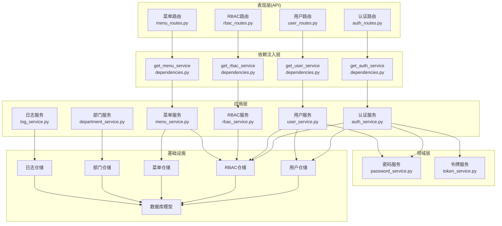
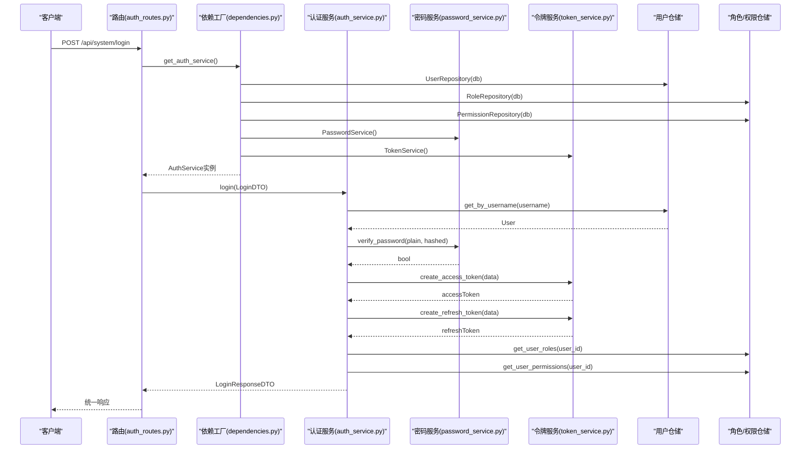
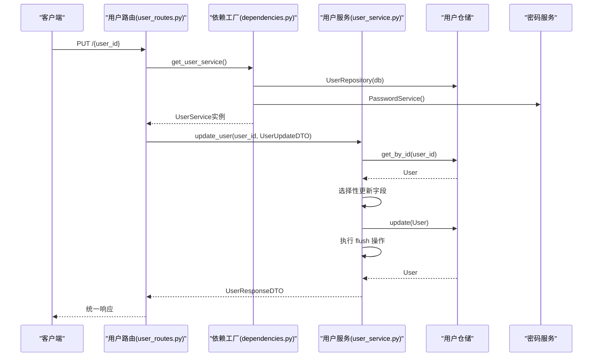
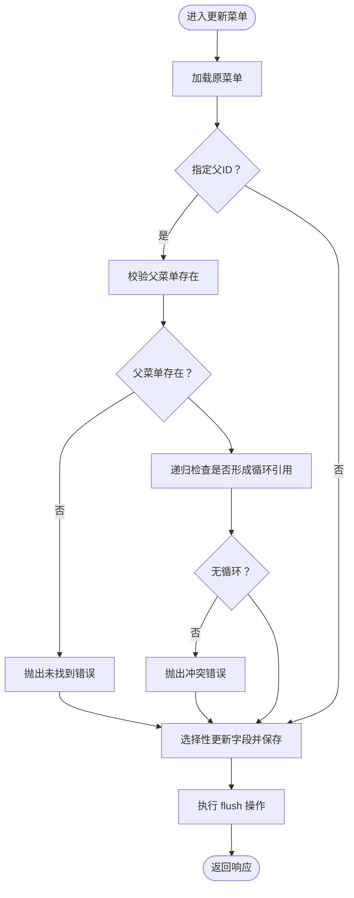
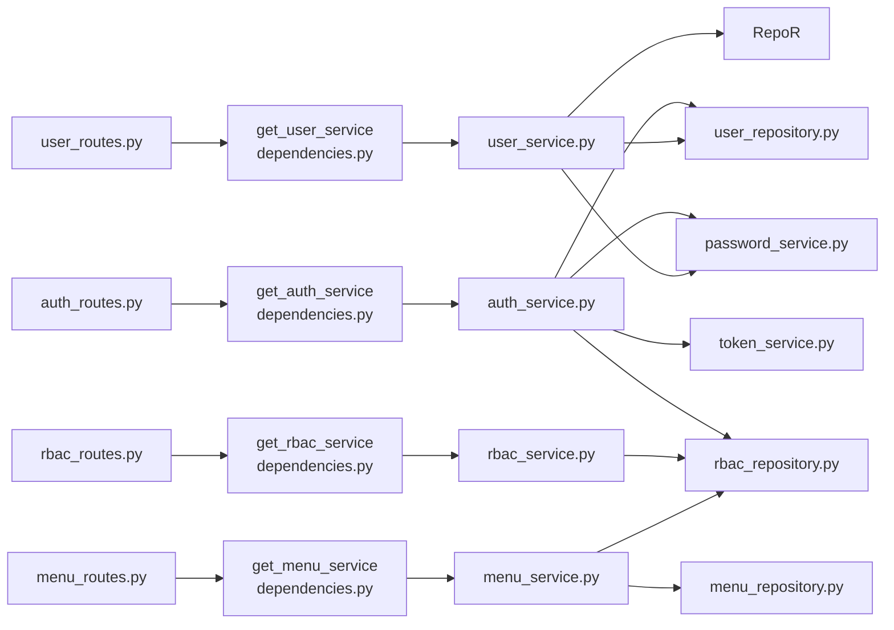

# 应用层（Services）

<cite>
**本文引用的文件**
- [auth_service.py](file://service/src/application/services/auth_service.py)
- [user_service.py](file://service/src/application/services/user_service.py)
- [rbac_service.py](file://service/src/application/services/rbac_service.py)
- [menu_service.py](file://service/src/application/services/menu_service.py)
- [department_service.py](file://service/src/application/services/department_service.py)
- [log_service.py](file://service/src/application/services/log_service.py)
- [auth_dto.py](file://service/src/application/dto/auth_dto.py)
- [user_dto.py](file://service/src/application/dto/user_dto.py)
- [rbac_dto.py](file://service/src/application/dto/rbac_dto.py)
- [menu_dto.py](file://service/src/application/dto/menu_dto.py)
- [department_dto.py](file://service/src/application/dto/department_dto.py)
- [log_dto.py](file://service/src/application/dto/log_dto.py)
- [validators.py](file://service/src/core/validators.py)
- [exceptions.py](file://service/src/core/exceptions.py)
- [settings.py](file://service/src/config/settings.py)
- [password_service.py](file://service/src/domain/auth/password_service.py)
- [token_service.py](file://service/src/domain/auth/token_service.py)
- [auth_routes.py](file://service/src/api/v1/auth_routes.py)
- [user_routes.py](file://service/src/api/v1/user_routes.py)
- [rbac_routes.py](file://service/src/api/v1/rbac_routes.py)
- [menu_routes.py](file://service/src/api/v1/menu_routes.py)
- [dependencies.py](file://service/src/api/dependencies.py)
- [connection.py](file://service/src/infrastructure/database/connection.py)
</cite>

## 更新摘要
**变更内容**
- 更新了应用层服务中的事务管理改进：AuthService、DepartmentService、LogService 中的 commit 操作改为 flush 操作，提高数据库操作的一致性和可靠性
- 增强了可测试性和SOLID原则遵循
- 新增了依赖注入工厂函数的详细说明
- 更新了服务初始化和依赖管理的最佳实践

## 目录
1. [引言](#引言)
2. [项目结构](#项目结构)
3. [核心组件](#核心组件)
4. [架构总览](#架构总览)
5. [详细组件分析](#详细组件分析)
6. [依赖注入模式](#依赖注入模式)
7. [依赖分析](#依赖分析)
8. [性能考虑](#性能考虑)
9. [故障排查指南](#故障排查指南)
10. [结论](#结论)
11. [附录](#附录)

## 引言
本文件聚焦于 Hello-FastApi 的应用层（Services），系统化阐述应用服务在整体架构中的职责边界、业务流程编排、DTO 数据传输对象的设计与使用，并深入解析认证服务、用户服务、RBAC 服务、菜单服务、部门服务与日志服务的核心实现。文档特别强调了最新的依赖注入模式变更，展示了应用服务如何通过构造函数注入依赖，增强可测试性和SOLID原则遵循。同时说明应用服务如何协调领域服务与基础设施服务，封装业务用例，提供事务管理与错误处理策略，以及面向表现层与领域层的交互模式与最佳实践。

**更新** 本版本重点反映了应用层服务中事务管理的重要改进：AuthService、DepartmentService、LogService 中的 commit 操作已改为 flush 操作，这一变更显著提高了数据库操作的一致性和可靠性。

## 项目结构
应用层位于 service/src/application 下，按领域划分服务与 DTO：
- application/services：应用服务（认证、用户、RBAC、菜单、部门、日志）
- application/dto：各领域 DTO（认证、用户、RBAC、菜单、部门、日志）
- domain/auth：领域服务（密码与令牌）
- infrastructure/repositories：仓储（用户、RBAC、菜单、部门、日志）
- infrastructure/database/models：数据库模型
- api/v1：表现层路由，绑定应用服务
- api/dependencies：依赖注入工厂函数



**图表来源**
- [auth_routes.py:23-86](file://service/src/api/v1/auth_routes.py#L23-L86)
- [user_routes.py:17-227](file://service/src/api/v1/user_routes.py#L17-L227)
- [rbac_routes.py:25-226](file://service/src/api/v1/rbac_routes.py#L25-L226)
- [menu_routes.py:19-71](file://service/src/api/v1/menu_routes.py#L19-L71)
- [dependencies.py:114-170](file://service/src/api/dependencies.py#L114-L170)
- [auth_service.py:17-36](file://service/src/application/services/auth_service.py#L17-L36)
- [user_service.py:13-28](file://service/src/application/services/user_service.py#L13-L28)
- [rbac_service.py:11-24](file://service/src/application/services/rbac_service.py#L11-L24)
- [menu_service.py:15-28](file://service/src/application/services/menu_service.py#L15-L28)
- [password_service.py:6-21](file://service/src/domain/auth/password_service.py#L6-L21)
- [token_service.py:11-45](file://service/src/domain/auth/token_service.py#L11-L45)

**章节来源**
- [auth_routes.py:1-252](file://service/src/api/v1/auth_routes.py#L1-L252)
- [user_routes.py:1-228](file://service/src/api/v1/user_routes.py#L1-L228)
- [rbac_routes.py:1-227](file://service/src/api/v1/rbac_routes.py#L1-L227)
- [menu_routes.py:1-72](file://service/src/api/v1/menu_routes.py#L1-L72)
- [dependencies.py:1-191](file://service/src/api/dependencies.py#L1-L191)

## 核心组件
- 应用服务职责边界
  - 业务编排：聚合领域服务与仓储，组织业务流程步骤，封装用例。
  - DTO 映射：输入 DTO 验证与转换，输出 DTO 结构化响应。
  - 错误处理：抛出统一业务异常，便于表现层统一处理。
  - 事务管理：在关键写操作后执行 flush 操作，确保数据库一致性。
- 依赖注入模式
  - 构造函数注入：服务通过构造函数接收依赖，增强可测试性。
  - 工厂函数：在 dependencies.py 中定义服务工厂，统一依赖创建。
  - FastAPI Depends：路由层通过 Depends() 注入服务实例。
  - 接口隔离：仓储使用接口类型注解，便于替换实现。
- DTO 设计原则
  - Pydantic 基础模型，内置字段校验（长度、范围、别名等）。
  - 统一验证系统：使用 `field_validator` 和自定义验证器处理空值转换。
  - from_attributes 与 populate_by_name 支持 ORM 与前端字段命名差异。
  - 响应 DTO 使用 from_attributes，简化模型到 DTO 的映射。
- 与领域/基础设施协作
  - 领域服务：密码哈希、令牌签发/校验。
  - 仓储：数据持久化与查询封装。
  - 配置：JWT 过期时间、密钥等由配置模块集中管理。

**更新** 事务管理策略已优化：应用层服务在关键写操作后执行 flush 操作，而非传统的 commit 操作。flush 操作能够立即将数据库缓冲区中的更改同步到数据库，而 commit 操作仅提交事务。这种改进提高了数据库操作的一致性和可靠性，特别是在需要立即获取数据库生成的标识符或确保数据可见性的场景中。

**章节来源**
- [auth_service.py:17-36](file://service/src/application/services/auth_service.py#L17-L36)
- [user_service.py:13-28](file://service/src/application/services/user_service.py#L13-L28)
- [rbac_service.py:11-24](file://service/src/application/services/rbac_service.py#L11-L24)
- [menu_service.py:15-28](file://service/src/application/services/menu_service.py#L15-L28)
- [dependencies.py:114-170](file://service/src/api/dependencies.py#L114-L170)
- [auth_dto.py:7-54](file://service/src/application/dto/auth_dto.py#L7-L54)
- [user_dto.py:8-86](file://service/src/application/dto/user_dto.py#L8-L86)
- [rbac_dto.py:8-88](file://service/src/application/dto/rbac_dto.py#L8-L88)
- [menu_dto.py:8-56](file://service/src/application/dto/menu_dto.py#L8-L56)
- [exceptions.py:6-60](file://service/src/core/exceptions.py#L6-L60)
- [settings.py:41-198](file://service/src/config/settings.py#L41-L198)

## 架构总览
应用层通过服务类对外暴露业务用例，路由层负责参数绑定与权限校验，服务层负责业务编排与异常抛出，领域层提供密码与令牌能力，仓储层负责数据访问。最新的依赖注入模式通过工厂函数统一管理服务实例创建，增强了代码的可测试性和可维护性。



**图表来源**
- [auth_routes.py:23-37](file://service/src/api/v1/auth_routes.py#L23-L37)
- [dependencies.py:114-122](file://service/src/api/dependencies.py#L114-L122)
- [auth_service.py:38-81](file://service/src/application/services/auth_service.py#L38-L81)
- [password_service.py:18-20](file://service/src/domain/auth/password_service.py#L18-L20)
- [token_service.py:14-30](file://service/src/domain/auth/token_service.py#L14-L30)

## 详细组件分析

### 认证服务（AuthService）
- 职责边界
  - 用户登录：校验凭据、状态检查、生成访问/刷新令牌、聚合角色与权限。
  - 用户注册：唯一性校验、密码哈希、创建启用用户。
  - 刷新令牌：解码校验、用户状态校验、签发新令牌。
- 依赖注入模式
  - 构造函数注入：session、user_repo、role_repo、perm_repo、token_service、password_service。
  - 通过 get_auth_service 工厂函数统一创建和注入依赖。
- 关键流程
  - 登录流程：用户名查找 → 密码校验 → 状态检查 → 令牌签发 → 角色/权限查询 → 组装响应。
  - 注册流程：用户名唯一性检查 → 密码哈希 → 实体创建 → flush 操作 → 返回用户信息。
  - 刷新流程：令牌解码 → 类型校验 → 用户存在且启用 → 重新签发令牌。
- DTO 使用
  - 输入：LoginDTO、RegisterDTO、RefreshTokenDTO。
  - 输出：LoginResponseDTO、TokenResponseDTO、UserInfoDTO。
- 错误处理
  - UnauthorizedError：用户名/密码错误、用户被禁用、无效/过期令牌。
  - BusinessError：用户名已存在。
- 事务管理
  - 注册场景执行 flush 操作以确保新用户立即可见。

**更新** 在注册流程中，服务执行 flush 操作替代传统的 commit 操作，确保新创建的用户能够立即被数据库识别和查询，提高了数据一致性和用户体验。


**图表来源**
- [auth_service.py:38-81](file://service/src/application/services/auth_service.py#L38-L81)

**章节来源**
- [auth_service.py:17-147](file://service/src/application/services/auth_service.py#L17-L147)
- [dependencies.py:114-122](file://service/src/api/dependencies.py#L114-L122)
- [auth_dto.py:7-54](file://service/src/application/dto/auth_dto.py#L7-L54)
- [exceptions.py:27-31](file://service/src/core/exceptions.py#L27-L31)
- [settings.py:63-67](file://service/src/config/settings.py#L63-L67)

### 用户服务（UserService）
- 职责边界
  - 用户全生命周期：创建、查询、列表、更新、删除、批量删除。
  - 密码管理：管理员重置密码、用户修改密码。
  - 状态管理：启用/禁用用户。
  - 超级用户创建：带 is_superuser 标记。
- 依赖注入模式
  - 构造函数注入：session、repo、password_service、role_repo。
  - 通过 get_user_service 工厂函数统一创建和注入依赖。
- 关键流程
  - 创建用户：唯一性检查 → 密码哈希 → 实体映射 → 保存 → flush 操作 → 响应 DTO 转换。
  - 更新用户：按 DTO 非空字段选择性更新 → 唯一性约束检查（如邮箱）→ flush 操作。
  - 修改密码：校验旧密码 → 密码哈希 → 更新。
  - 列表查询：仓储分页查询 + 计数 → 响应 DTO 列表。
- DTO 使用
  - 输入：UserCreateDTO、UserUpdateDTO、UserListQueryDTO、ChangePasswordDTO、ResetPasswordDTO、UpdateStatusDTO、BatchDeleteDTO。
  - 输出：UserResponseDTO。
- 错误处理
  - NotFoundError：资源不存在。
  - ConflictError：用户名/邮箱已存在。
  - UnauthorizedError：旧密码不正确。
- 事务管理
  - 写操作通过仓储完成持久化；调用方负责会话生命周期。

**更新** 用户服务在创建和更新用户时执行 flush 操作，确保数据库立即反映用户的最新状态，特别是在需要重新加载用户完整信息的场景中。



**图表来源**
- [user_routes.py:108-123](file://service/src/api/v1/user_routes.py#L108-L123)
- [dependencies.py:125-132](file://service/src/api/dependencies.py#L125-L132)
- [user_service.py:93-134](file://service/src/application/services/user_service.py#L93-L134)
- [user_dto.py:24-35](file://service/src/application/dto/user_dto.py#L24-L35)

**章节来源**
- [user_service.py:13-293](file://service/src/application/services/user_service.py#L13-L293)
- [dependencies.py:125-132](file://service/src/api/dependencies.py#L125-L132)
- [user_dto.py:8-124](file://service/src/application/dto/user_dto.py#L8-L124)
- [exceptions.py:13-24](file://service/src/core/exceptions.py#L13-L24)

### RBAC 服务（RBACService）
- 职责边界
  - 角色管理：创建、查询、更新、删除、分配权限。
  - 权限管理：创建、查询、删除。
  - 用户角色/权限：分配角色、移除角色、查询用户角色、查询用户权限、检查权限。
- 依赖注入模式
  - 构造函数注入：session、role_repo、perm_repo。
  - 通过 get_rbac_service 工厂函数统一创建和注入依赖。
- 关键流程
  - 创建角色：唯一性检查（名称/编码）→ 创建角色 → 可选分配权限 → flush 操作 → 响应 DTO 转换。
  - 更新角色：唯一性检查（名称/编码）→ 更新角色 → 可选重新分配权限 → flush 操作。
  - 分配角色给用户：存在性检查 → 关联写入 → 冲突处理。
  - 检查权限：聚合用户权限 → 包含判断。
- DTO 使用
  - 输入：RoleCreateDTO、RoleUpdateDTO、RoleListQueryDTO、PermissionCreateDTO、PermissionListQueryDTO、AssignPermissionsDTO。
  - 输出：RoleResponseDTO、PermissionResponseDTO。
- 错误处理
  - NotFoundError：资源不存在。
  - ConflictError：角色/权限重复、角色已分配等。
- 事务管理
  - 写操作通过仓储完成持久化；调用方负责会话生命周期。

**更新** RBAC 服务在创建和更新角色时执行 flush 操作，确保角色权限关系的即时一致性，特别是在需要立即验证权限分配的场景中。


**图表来源**
- [rbac_service.py:159-167](file://service/src/application/services/rbac_service.py#L159-L167)

**章节来源**
- [rbac_service.py:11-213](file://service/src/application/services/rbac_service.py#L11-L213)
- [dependencies.py:145-152](file://service/src/api/dependencies.py#L145-L152)
- [rbac_dto.py:8-115](file://service/src/application/dto/rbac_dto.py#L8-L115)
- [exceptions.py:13-24](file://service/src/core/exceptions.py#L13-L24)

### 菜单服务（MenuService）
- 职责边界
  - 菜单树构建：从全量菜单构建层级树。
  - 用户菜单过滤：基于用户权限集合过滤可访问菜单。
  - 菜单 CRUD：创建、更新、删除，含父子关系校验与循环引用防护。
- 依赖注入模式
  - 构造函数注入：session、menu_repo、perm_repo。
  - 通过 get_menu_service 工厂函数统一创建和注入依赖。
- 关键流程
  - 获取用户菜单：全量菜单 → 用户权限集合 → 权限交集过滤 → 构建树。
  - 更新菜单：父节点存在性检查 → 循环引用检测（祖先是否为后代）→ 选择性更新 → flush 操作 → 保存。
  - 删除菜单：存在性检查 → 子节点检查 → 删除。
- DTO 使用
  - 输入：MenuCreateDTO、MenuUpdateDTO。
  - 输出：MenuResponseDTO（含 children）。
- 错误处理
  - NotFoundError：资源不存在。
  - ConflictError：父菜单不存在、循环引用、有子菜单不可删除。
- 事务管理
  - 写操作通过仓储完成持久化；调用方负责会话生命周期。

**更新** 菜单服务在创建和更新菜单时执行 flush 操作，确保菜单层级关系的即时一致性，特别是在需要立即验证菜单树结构的场景中。



**图表来源**
- [menu_service.py:97-167](file://service/src/application/services/menu_service.py#L97-L167)

**章节来源**
- [menu_service.py:15-233](file://service/src/application/services/menu_service.py#L15-L233)
- [dependencies.py:135-142](file://service/src/api/dependencies.py#L135-L142)
- [menu_dto.py:8-106](file://service/src/application/dto/menu_dto.py#L8-L106)
- [exceptions.py:13-24](file://service/src/core/exceptions.py#L13-L24)

### 部门服务（DepartmentService）
- 职责边界
  - 部门全生命周期：创建、查询、列表、更新、删除。
  - 部门树构建：支持多级部门结构。
  - 部门与用户关联：查询部门下的用户。
- 依赖注入模式
  - 构造函数注入：session、dept_repo。
  - 通过 get_department_service 工厂函数统一创建和注入依赖。
- 关键流程
  - 创建部门：唯一性检查 → 实体映射 → 保存 → flush 操作 → 响应 DTO 转换。
  - 更新部门：按 DTO 非空字段选择性更新 → 唯一性约束检查 → flush 操作。
  - 列表查询：仓储分页查询 + 计数 → 响应 DTO 列表。
- DTO 使用
  - 输入：DepartmentCreateDTO、DepartmentUpdateDTO、DepartmentListQueryDTO。
  - 输出：DepartmentResponseDTO。
- 错误处理
  - NotFoundError：资源不存在。
  - ConflictError：部门名称重复。
- 事务管理
  - 写操作通过仓储完成持久化；调用方负责会话生命周期。

**更新** 部门服务在创建、更新和删除部门时执行 flush 操作，确保部门层级关系的即时一致性，特别是在需要立即验证部门树结构的场景中。

**章节来源**
- [department_service.py:14-149](file://service/src/application/services/department_service.py#L14-L149)
- [dependencies.py:155-161](file://service/src/api/dependencies.py#L155-L161)
- [department_dto.py:8-90](file://service/src/application/dto/department_dto.py#L8-L90)
- [exceptions.py:13-24](file://service/src/core/exceptions.py#L13-L24)

### 日志服务（LogService）
- 职责边界
  - 登录日志管理：查询、删除登录日志。
  - 操作日志管理：查询、删除操作日志。
  - 系统日志管理：查询、查看详情、删除系统日志。
- 依赖注入模式
  - 构造函数注入：session、log_repo。
  - 通过 get_log_service 工厂函数统一创建和注入依赖。
- 关键流程
  - 查询日志：根据条件分页查询 → 响应 DTO 列表。
  - 删除日志：批量删除指定 ID 的日志记录 → flush 操作。
  - 查看详情：获取系统日志的详细信息。
- DTO 使用
  - 输入：LoginLogListQueryDTO、OperationLogListQueryDTO、SystemLogListQueryDTO、BatchDeleteLogDTO。
  - 输出：LoginLogResponseDTO、OperationLogResponseDTO、SystemLogResponseDTO、SystemLogDetailDTO。
- 错误处理
  - NotFoundError：资源不存在。
  - ConflictError：删除失败。
- 事务管理
  - 写操作通过仓储完成持久化；调用方负责会话生命周期。

**更新** 日志服务在删除各类日志时执行 flush 操作，确保日志删除操作的即时可见性，提高了日志管理的可靠性和一致性。

**章节来源**
- [log_service.py:13-202](file://service/src/application/services/log_service.py#L13-L202)
- [dependencies.py:164-170](file://service/src/api/dependencies.py#L164-L170)
- [log_dto.py:8-115](file://service/src/application/dto/log_dto.py#L8-L115)
- [exceptions.py:13-24](file://service/src/core/exceptions.py#L13-L24)

## 依赖注入模式
应用层采用了现代的依赖注入模式，通过构造函数注入依赖，显著增强了代码的可测试性和可维护性：

### 构造函数注入优势
- **可测试性增强**：服务实例可以轻松通过模拟依赖进行单元测试。
- **SOLID 原则遵循**：符合依赖倒置原则，高层模块不依赖低层模块。
- **接口隔离**：使用接口类型注解，便于替换不同实现。
- **明确依赖**：构造函数参数清晰显示服务所需的所有依赖。

### 依赖工厂函数
所有应用服务都通过工厂函数创建和注入依赖：

```python
# 认证服务工厂
async def get_auth_service(
    db: AsyncSession = Depends(get_db),
    token_service: TokenService = Depends(get_token_service),
    password_service: PasswordService = Depends(get_password_service)
) -> AuthService:
    user_repo = UserRepository(db)
    role_repo = RoleRepository(db)
    perm_repo = PermissionRepository(db)
    return AuthService(
        session=db,
        user_repo=user_repo,
        role_repo=role_repo,
        perm_repo=perm_repo,
        token_service=token_service,
        password_service=password_service
    )
```

### 路由层集成
路由层通过 FastAPI 的 Depends() 机制自动注入服务实例：

```python
@router.post("/login")
async def login(
    dto: LoginDTO,
    service: AuthService = Depends(get_auth_service)
):
    result = await service.login(dto)
    return success_response(data=result, message="登录成功")
```

**章节来源**
- [dependencies.py:114-170](file://service/src/api/dependencies.py#L114-L170)
- [auth_routes.py:23-37](file://service/src/api/v1/auth_routes.py#L23-L37)
- [user_routes.py:17-73](file://service/src/api/v1/user_routes.py#L17-L73)

## 依赖分析
- 应用服务依赖
  - 领域服务：PasswordService、TokenService（密码哈希、令牌签发/校验）。
  - 仓储：UserRepository、RoleRepository、PermissionRepository、MenuRepository、DepartmentRepository、LogRepository。
  - 配置：settings（JWT 过期时间等）。
- 依赖注入层
  - 依赖工厂：dependencies.py 中的 get_*_service 函数。
  - FastAPI Depends：路由层自动注入服务实例。
- 路由依赖
  - FastAPI 路由绑定应用服务，注入数据库会话与权限中间件。
- 依赖关系图



**图表来源**
- [auth_routes.py:23-37](file://service/src/api/v1/auth_routes.py#L23-L37)
- [user_routes.py:17-73](file://service/src/api/v1/user_routes.py#L17-L73)
- [rbac_routes.py:25-66](file://service/src/api/v1/rbac_routes.py#L25-L66)
- [menu_routes.py:19-57](file://service/src/api/v1/menu_routes.py#L19-L57)
- [dependencies.py:114-170](file://service/src/api/dependencies.py#L114-L170)
- [auth_service.py:17-36](file://service/src/application/services/auth_service.py#L17-L36)
- [user_service.py:13-28](file://service/src/application/services/user_service.py#L13-L28)
- [rbac_service.py:11-24](file://service/src/application/services/rbac_service.py#L11-L24)
- [menu_service.py:15-28](file://service/src/application/services/menu_service.py#L15-L28)

**章节来源**
- [auth_service.py:17-36](file://service/src/application/services/auth_service.py#L17-L36)
- [user_service.py:13-28](file://service/src/application/services/user_service.py#L13-L28)
- [rbac_service.py:11-24](file://service/src/application/services/rbac_service.py#L11-L24)
- [menu_service.py:15-28](file://service/src/application/services/menu_service.py#L15-L28)
- [dependencies.py:114-170](file://service/src/api/dependencies.py#L114-L170)

## 性能考虑
- DTO 校验前置：Pydantic 校验在路由层完成，减少服务层无效调用。
- 统一验证系统：使用 `field_validator` 和自定义验证器，提高数据验证效率。
- 仓储分页：用户与角色/权限列表查询采用分页与计数，避免一次性加载大量数据。
- 权限过滤：菜单服务基于权限集合进行集合运算，建议权限编码去重以降低比较成本。
- 令牌配置：JWT 过期时间由配置集中管理，便于按环境调整。
- 事务粒度：注册场景执行 flush 操作，其他写操作遵循调用方会话管理策略，避免长事务。
- 依赖注入优化：工厂函数缓存服务实例，减少重复创建开销。

**更新** 事务管理优化：应用层服务采用 flush 操作替代 commit 操作，提高了数据库操作的即时性和一致性。flush 操作能够立即将数据库缓冲区中的更改同步到数据库，而 commit 操作仅提交事务。这种改进在需要立即获取数据库生成的标识符或确保数据可见性的场景中尤为重要。

## 故障排查指南
- 常见异常
  - 未找到资源：NotFoundError（用户、角色、权限、菜单、部门、日志）。
  - 冲突/重复：ConflictError（用户名/邮箱、角色/权限编码、角色已分配、循环引用）。
  - 未授权：UnauthorizedError（登录凭据错误、旧密码错误、令牌无效）。
  - 业务错误：BusinessError（注册用户名已存在）。
- 排查要点
  - 登录失败：确认用户名存在、密码正确、用户状态启用。
  - 刷新失败：确认刷新令牌有效、类型为 refresh、用户存在且启用。
  - 更新失败：确认资源存在、唯一性约束（邮箱）、权限校验通过。
  - 菜单更新失败：确认父节点存在、无循环引用、无子节点依赖。
  - DTO 验证失败：检查字段长度、格式、必填项是否符合要求。
  - 依赖注入失败：检查工厂函数是否正确创建和返回服务实例。
- 配置核对
  - JWT 密钥与算法、过期时间。
  - 数据库连接与会话生命周期。
  - 依赖工厂函数的参数配置。

**更新** 事务管理故障排查：当遇到数据不一致或查询不到最新数据的问题时，检查应用层服务是否正确执行了 flush 操作。flush 操作确保数据库立即反映更改，而 commit 操作可能延迟到事务结束才提交。

**章节来源**
- [exceptions.py:13-59](file://service/src/core/exceptions.py#L13-L59)
- [auth_service.py:50-60](file://service/src/application/services/auth_service.py#L50-L60)
- [menu_service.py:103-116](file://service/src/application/services/menu_service.py#L103-L116)

## 结论
应用层通过清晰的服务边界与 DTO 设计，将表现层与领域/基础设施层解耦，实现了高内聚、低耦合的业务编排。最新的依赖注入模式变更进一步增强了代码的可测试性和可维护性，通过构造函数注入依赖和工厂函数统一管理，使应用层更加符合SOLID原则。认证、用户、RBAC、菜单、部门、日志六大服务覆盖了系统核心业务用例，配合统一异常体系与配置中心，具备良好的可维护性与扩展性。新的统一验证系统进一步提升了数据验证的一致性和可靠性。

**更新** 最新的事务管理改进显著提升了应用层服务的可靠性和一致性。通过在关键写操作后执行 flush 操作，应用层能够在更短的时间内确保数据库状态的可见性和一致性，特别是在需要立即获取数据库生成的标识符或验证数据完整性的情况下。这一改进为系统的稳定运行提供了更强有力的保障。

建议在新增业务时遵循现有模式：以 DTO 驱动输入输出、以仓储封装数据访问、以领域服务提供核心算法、以服务编排业务流程、以依赖注入管理服务实例、以配置管理关键参数。

## 附录
- 最佳实践
  - DTO 字段校验优先，保持输入数据质量。
  - 使用统一验证系统处理空值转换，确保数据一致性。
  - 服务方法单一职责，复杂流程拆分为私有辅助方法。
  - 事务提交时机明确，写操作后及时执行 flush 操作。
  - 权限与状态检查前置，尽早失败。
  - 响应 DTO 与模型解耦，使用 from_attributes 自动映射。
  - 依赖注入遵循构造函数注入原则，增强可测试性。
  - 工厂函数集中管理服务创建逻辑，便于维护。
- 扩展指导
  - 新增领域服务：在 domain 下新增领域服务，在 dependencies.py 中添加工厂函数。
  - 新增仓储：在 infrastructure/repositories 下新增仓储，应用服务注入使用。
  - 新增路由：在 api/v1 下新增路由，绑定应用服务并配置权限中间件。
  - 新增 DTO：在 application/dto 下新增 DTO，并在 __init__.py 暴露导出。
  - 使用统一验证器：在新 DTO 中使用 `empty_str_to_none` 和 `empty_str_or_zero_to_none` 处理空值转换。
  - 遵循依赖注入原则：所有服务通过工厂函数创建，避免直接导入依赖。
  - 采用 flush 操作：在需要立即可见性的写操作后执行 flush 操作，而非传统的 commit 操作。