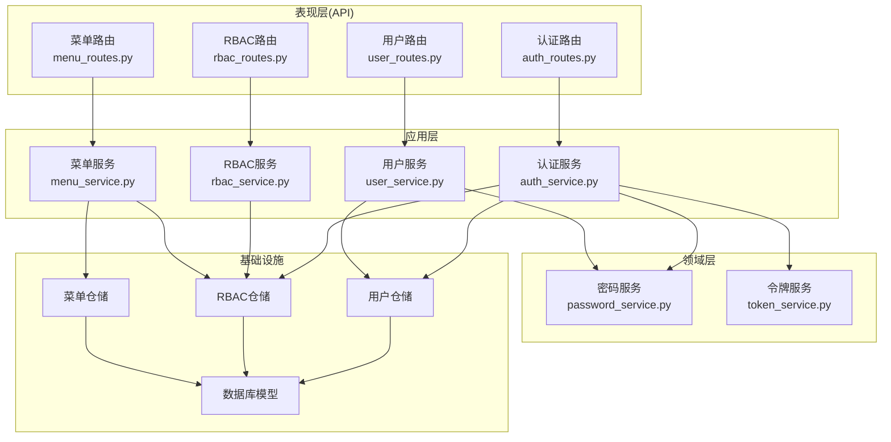
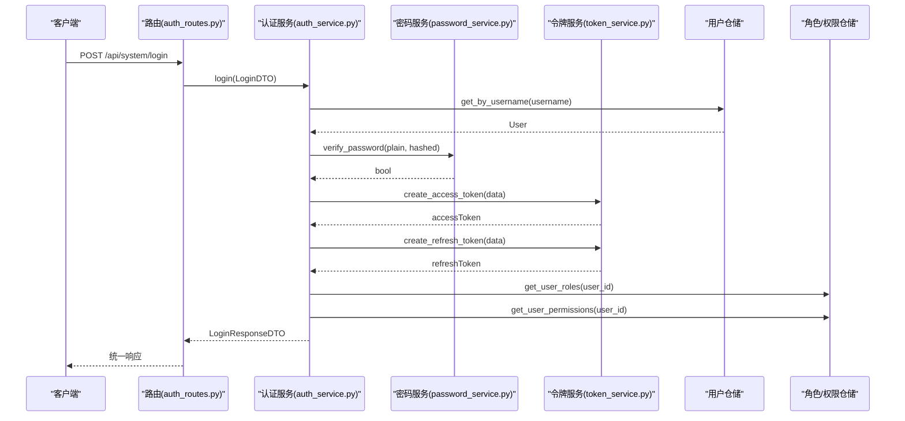
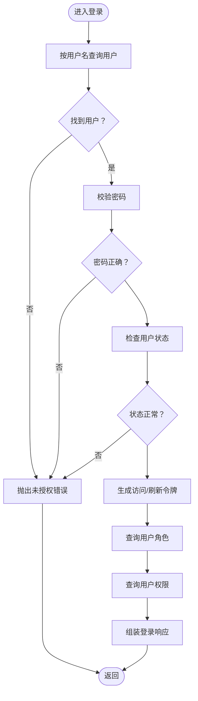
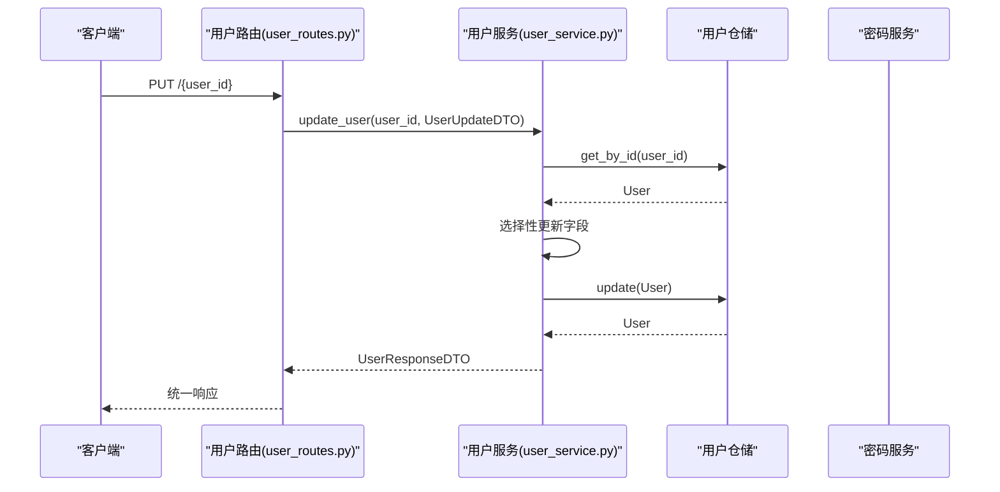
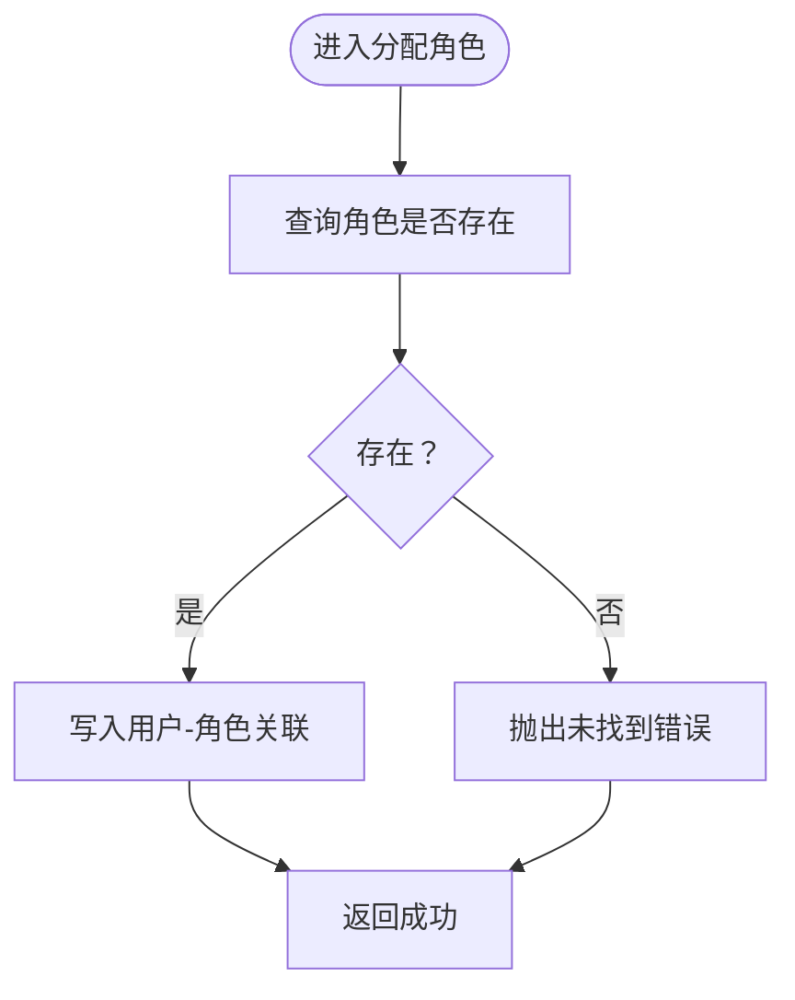
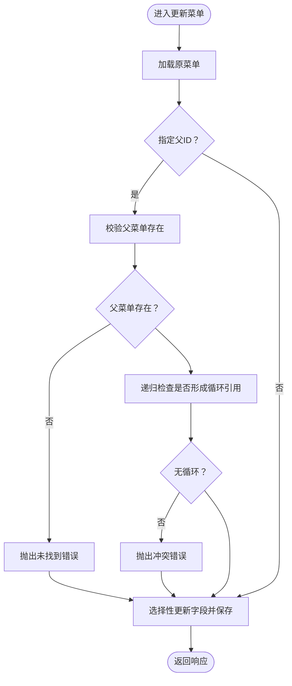
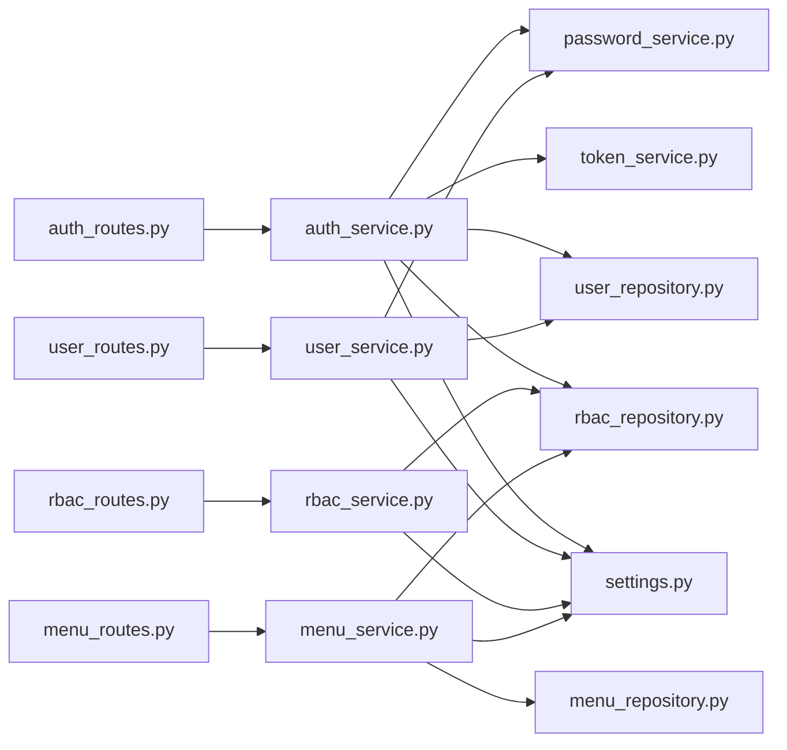

# 应用层（Services）

<cite>
**本文引用的文件**
- [auth_service.py](file://service/src/application/services/auth_service.py)
- [user_service.py](file://service/src/application/services/user_service.py)
- [rbac_service.py](file://service/src/application/services/rbac_service.py)
- [menu_service.py](file://service/src/application/services/menu_service.py)
- [auth_dto.py](file://service/src/application/dto/auth_dto.py)
- [user_dto.py](file://service/src/application/dto/user_dto.py)
- [rbac_dto.py](file://service/src/application/dto/rbac_dto.py)
- [menu_dto.py](file://service/src/application/dto/menu_dto.py)
- [exceptions.py](file://service/src/core/exceptions.py)
- [settings.py](file://service/src/config/settings.py)
- [password_service.py](file://service/src/domain/auth/password_service.py)
- [token_service.py](file://service/src/domain/auth/token_service.py)
- [auth_routes.py](file://service/src/api/v1/auth_routes.py)
- [user_routes.py](file://service/src/api/v1/user_routes.py)
- [rbac_routes.py](file://service/src/api/v1/rbac_routes.py)
- [menu_routes.py](file://service/src/api/v1/menu_routes.py)
</cite>

## 目录
1. [引言](#引言)
2. [项目结构](#项目结构)
3. [核心组件](#核心组件)
4. [架构总览](#架构总览)
5. [详细组件分析](#详细组件分析)
6. [依赖分析](#依赖分析)
7. [性能考虑](#性能考虑)
8. [故障排查指南](#故障排查指南)
9. [结论](#结论)
10. [附录](#附录)

## 引言
本文件聚焦于 Hello-FastApi 的应用层（Services），系统化阐述应用服务在整体架构中的职责边界、业务流程编排、DTO 数据传输对象的设计与使用，并深入解析认证服务、用户服务、RBAC 服务与菜单服务的核心实现。文档同时说明应用服务如何协调领域服务与基础设施服务，封装业务用例，提供事务管理与错误处理策略，以及面向表现层与领域层的交互模式与最佳实践。

## 项目结构
应用层位于 service/src/application 下，按领域划分服务与 DTO：
- application/services：应用服务（认证、用户、RBAC、菜单）
- application/dto：各领域 DTO（认证、用户、RBAC、菜单）
- domain/auth：领域服务（密码与令牌）
- infrastructure/repositories：仓储（用户、RBAC、菜单）
- infrastructure/database/models：数据库模型
- api/v1：表现层路由，绑定应用服务

图表来源
- [auth_routes.py:19-85](file://service/src/api/v1/auth_routes.py#L19-L85)
- [user_routes.py:27-251](file://service/src/api/v1/user_routes.py#L27-L251)
- [rbac_routes.py:33-256](file://service/src/api/v1/rbac_routes.py#L33-L256)
- [menu_routes.py:19-70](file://service/src/api/v1/menu_routes.py#L19-L70)
- [auth_service.py:15-154](file://service/src/application/services/auth_service.py#L15-L154)
- [user_service.py:18-322](file://service/src/application/services/user_service.py#L18-L322)
- [rbac_service.py:19-231](file://service/src/application/services/rbac_service.py#L19-L231)
- [menu_service.py:15-169](file://service/src/application/services/menu_service.py#L15-L169)
- [password_service.py:6-21](file://service/src/domain/auth/password_service.py#L6-L21)
- [token_service.py:11-45](file://service/src/domain/auth/token_service.py#L11-L45)

章节来源
- [auth_routes.py:1-86](file://service/src/api/v1/auth_routes.py#L1-L86)
- [user_routes.py:1-252](file://service/src/api/v1/user_routes.py#L1-L252)
- [rbac_routes.py:1-257](file://service/src/api/v1/rbac_routes.py#L1-L257)
- [menu_routes.py:1-71](file://service/src/api/v1/menu_routes.py#L1-L71)

## 核心组件
- 应用服务职责边界
  - 业务编排：聚合领域服务与仓储，组织业务流程步骤，封装用例。
  - DTO 映射：输入 DTO 验证与转换，输出 DTO 结构化响应。
  - 错误处理：抛出统一业务异常，便于表现层统一处理。
  - 事务管理：在关键写操作后提交数据库会话，确保一致性。
- DTO 设计原则
  - Pydantic 基础模型，内置字段校验（长度、范围、别名等）。
  - from_attributes 与 populate_by_name 支持 ORM 与前端字段命名差异。
  - 响应 DTO 使用 from_attributes，简化模型到 DTO 的映射。
- 与领域/基础设施协作
  - 领域服务：密码哈希、令牌签发/校验。
  - 仓储：数据持久化与查询封装。
  - 配置：JWT 过期时间、密钥等由配置模块集中管理。

章节来源
- [auth_service.py:15-25](file://service/src/application/services/auth_service.py#L15-L25)
- [user_service.py:18-24](file://service/src/application/services/user_service.py#L18-L24)
- [rbac_service.py:19-25](file://service/src/application/services/rbac_service.py#L19-L25)
- [menu_service.py:15-21](file://service/src/application/services/menu_service.py#L15-L21)
- [auth_dto.py:7-54](file://service/src/application/dto/auth_dto.py#L7-L54)
- [user_dto.py:8-86](file://service/src/application/dto/user_dto.py#L8-L86)
- [rbac_dto.py:8-88](file://service/src/application/dto/rbac_dto.py#L8-L88)
- [menu_dto.py:8-56](file://service/src/application/dto/menu_dto.py#L8-L56)
- [exceptions.py:6-60](file://service/src/core/exceptions.py#L6-L60)
- [settings.py:41-198](file://service/src/config/settings.py#L41-L198)

## 架构总览
应用层通过服务类对外暴露业务用例，路由层负责参数绑定与权限校验，服务层负责业务编排与异常抛出，领域层提供密码与令牌能力，仓储层负责数据访问。

图表来源
- [auth_routes.py:19-34](file://service/src/api/v1/auth_routes.py#L19-L34)
- [auth_service.py:26-74](file://service/src/application/services/auth_service.py#L26-L74)
- [password_service.py:18-20](file://service/src/domain/auth/password_service.py#L18-L20)
- [token_service.py:14-30](file://service/src/domain/auth/token_service.py#L14-L30)

## 详细组件分析

### 认证服务（AuthService）
- 职责边界
  - 用户登录：校验凭据、状态检查、生成访问/刷新令牌、聚合角色与权限。
  - 用户注册：唯一性校验、密码哈希、创建启用用户。
  - 刷新令牌：解码校验、用户状态校验、签发新令牌。
- 关键流程
  - 登录流程：用户名查找 → 密码校验 → 状态检查 → 令牌签发 → 角色/权限查询 → 组装响应。
  - 注册流程：用户名唯一性检查 → 密码哈希 → 实体创建 → 提交事务 → 返回用户信息。
  - 刷新流程：令牌解码 → 类型校验 → 用户存在且启用 → 重新签发令牌。
- DTO 使用
  - 输入：LoginDTO、RegisterDTO、RefreshTokenDTO。
  - 输出：LoginResponseDTO、TokenResponseDTO、UserInfoDTO。
- 错误处理
  - UnauthorizedError：用户名/密码错误、用户被禁用、无效/过期令牌。
  - BusinessError：用户名已存在。
- 事务管理
  - 注册场景显式提交会话以持久化新用户。

图表来源
- [auth_service.py:26-74](file://service/src/application/services/auth_service.py#L26-L74)

章节来源
- [auth_service.py:15-154](file://service/src/application/services/auth_service.py#L15-L154)
- [auth_dto.py:7-54](file://service/src/application/dto/auth_dto.py#L7-L54)
- [exceptions.py:27-31](file://service/src/core/exceptions.py#L27-L31)
- [settings.py:63-67](file://service/src/config/settings.py#L63-L67)

### 用户服务（UserService）
- 职责边界
  - 用户全生命周期：创建、查询、列表、更新、删除、批量删除。
  - 密码管理：管理员重置密码、用户修改密码。
  - 状态管理：启用/禁用用户。
  - 超级用户创建：带 is_superuser 标记。
- 关键流程
  - 创建用户：唯一性检查 → 密码哈希 → 实体映射 → 保存 → 响应 DTO 转换。
  - 更新用户：按 DTO 非空字段选择性更新 → 唯一性约束检查（如邮箱）。
  - 修改密码：校验旧密码 → 密码哈希 → 更新。
  - 列表查询：仓储分页查询 + 计数 → 响应 DTO 列表。
- DTO 使用
  - 输入：UserCreateDTO、UserUpdateDTO、UserListQueryDTO、ChangePasswordDTO、ResetPasswordDTO、UpdateStatusDTO、BatchDeleteDTO。
  - 输出：UserResponseDTO。
- 错误处理
  - NotFoundError：资源不存在。
  - ConflictError：用户名/邮箱已存在。
  - UnauthorizedError：旧密码不正确。
- 事务管理
  - 写操作通过仓储完成持久化；调用方负责会话生命周期。

图表来源
- [user_routes.py:117-138](file://service/src/api/v1/user_routes.py#L117-L138)
- [user_service.py:115-156](file://service/src/application/services/user_service.py#L115-L156)
- [user_dto.py:24-35](file://service/src/application/dto/user_dto.py#L24-L35)

章节来源
- [user_service.py:18-322](file://service/src/application/services/user_service.py#L18-L322)
- [user_dto.py:8-86](file://service/src/application/dto/user_dto.py#L8-L86)
- [exceptions.py:13-24](file://service/src/core/exceptions.py#L13-L24)

### RBAC 服务（RBACService）
- 职责边界
  - 角色管理：创建、查询、更新、删除、分配权限。
  - 权限管理：创建、查询、删除。
  - 用户角色/权限：分配角色、移除角色、查询用户角色、查询用户权限、检查权限。
- 关键流程
  - 创建角色：唯一性检查（名称/编码）→ 创建角色 → 可选分配权限 → 响应 DTO 转换。
  - 更新角色：唯一性检查（名称/编码）→ 更新角色 → 可选重新分配权限。
  - 分配角色给用户：存在性检查 → 关联写入 → 冲突处理。
  - 检查权限：聚合用户权限 → 包含判断。
- DTO 使用
  - 输入：RoleCreateDTO、RoleUpdateDTO、RoleListQueryDTO、PermissionCreateDTO、PermissionListQueryDTO、AssignPermissionsDTO。
  - 输出：RoleResponseDTO、PermissionResponseDTO。
- 错误处理
  - NotFoundError：资源不存在。
  - ConflictError：角色/权限重复、角色已分配等。
- 事务管理
  - 写操作通过仓储完成持久化；调用方负责会话生命周期。

图表来源
- [rbac_service.py:169-177](file://service/src/application/services/rbac_service.py#L169-L177)

章节来源
- [rbac_service.py:19-231](file://service/src/application/services/rbac_service.py#L19-L231)
- [rbac_dto.py:8-88](file://service/src/application/dto/rbac_dto.py#L8-L88)
- [exceptions.py:13-24](file://service/src/core/exceptions.py#L13-L24)

### 菜单服务（MenuService）
- 职责边界
  - 菜单树构建：从全量菜单构建层级树。
  - 用户菜单过滤：基于用户权限集合过滤可访问菜单。
  - 菜单 CRUD：创建、更新、删除，含父子关系校验与循环引用防护。
- 关键流程
  - 获取用户菜单：全量菜单 → 用户权限集合 → 权限交集过滤 → 构建树。
  - 更新菜单：父节点存在性检查 → 循环引用检测（祖先是否为后代）→ 选择性更新 → 保存。
  - 删除菜单：存在性检查 → 子节点检查 → 删除。
- DTO 使用
  - 输入：MenuCreateDTO、MenuUpdateDTO。
  - 输出：MenuResponseDTO（含 children）。
- 错误处理
  - NotFoundError：资源不存在。
  - ConflictError：父菜单不存在、循环引用、有子菜单不可删除。
- 事务管理
  - 写操作通过仓储完成持久化；调用方负责会话生命周期。

图表来源
- [menu_service.py:76-115](file://service/src/application/services/menu_service.py#L76-L115)

章节来源
- [menu_service.py:15-169](file://service/src/application/services/menu_service.py#L15-L169)
- [menu_dto.py:8-56](file://service/src/application/dto/menu_dto.py#L8-L56)
- [exceptions.py:13-24](file://service/src/core/exceptions.py#L13-L24)

## 依赖分析
- 应用服务依赖
  - 领域服务：PasswordService、TokenService（密码哈希、令牌签发/校验）。
  - 仓储：UserRepository、RoleRepository、PermissionRepository、MenuRepository。
  - 配置：settings（JWT 过期时间等）。
- 路由依赖
  - FastAPI 路由绑定应用服务，注入数据库会话与权限中间件。
- 依赖关系图

图表来源
- [auth_routes.py:12-14](file://service/src/api/v1/auth_routes.py#L12-L14)
- [user_routes.py:20-22](file://service/src/api/v1/user_routes.py#L20-L22)
- [rbac_routes.py:22-24](file://service/src/api/v1/rbac_routes.py#L22-L24)
- [menu_routes.py:11-13](file://service/src/api/v1/menu_routes.py#L11-L13)
- [auth_service.py:3-24](file://service/src/application/services/auth_service.py#L3-L24)
- [user_service.py:3-23](file://service/src/application/services/user_service.py#L3-L23)
- [rbac_service.py:3-24](file://service/src/application/services/rbac_service.py#L3-L24)
- [menu_service.py:6-20](file://service/src/application/services/menu_service.py#L6-L20)
- [settings.py:63-67](file://service/src/config/settings.py#L63-L67)

章节来源
- [auth_service.py:3-24](file://service/src/application/services/auth_service.py#L3-L24)
- [user_service.py:3-23](file://service/src/application/services/user_service.py#L3-L23)
- [rbac_service.py:3-24](file://service/src/application/services/rbac_service.py#L3-L24)
- [menu_service.py:6-20](file://service/src/application/services/menu_service.py#L6-L20)

## 性能考虑
- DTO 校验前置：Pydantic 校验在路由层完成，减少服务层无效调用。
- 仓储分页：用户与角色/权限列表查询采用分页与计数，避免一次性加载大量数据。
- 权限过滤：菜单服务基于权限集合进行集合运算，建议权限编码去重以降低比较成本。
- 令牌配置：JWT 过期时间由配置集中管理，便于按环境调整。
- 事务粒度：注册场景显式提交，其他写操作遵循调用方会话管理策略，避免长事务。

## 故障排查指南
- 常见异常
  - 未找到资源：NotFoundError（用户、角色、权限、菜单）。
  - 冲突/重复：ConflictError（用户名/邮箱、角色/权限编码、角色已分配、循环引用）。
  - 未授权：UnauthorizedError（登录凭据错误、旧密码错误、令牌无效）。
  - 业务错误：BusinessError（注册用户名已存在）。
- 排查要点
  - 登录失败：确认用户名存在、密码正确、用户状态启用。
  - 刷新失败：确认刷新令牌有效、类型为 refresh、用户存在且启用。
  - 更新失败：确认资源存在、唯一性约束（邮箱）、权限校验通过。
  - 菜单更新失败：确认父节点存在、无循环引用、无子节点依赖。
- 配置核对
  - JWT 密钥与算法、过期时间。
  - 数据库连接与会话生命周期。

章节来源
- [exceptions.py:13-59](file://service/src/core/exceptions.py#L13-L59)
- [auth_service.py:40-48](file://service/src/application/services/auth_service.py#L40-L48)
- [menu_service.py:82-93](file://service/src/application/services/menu_service.py#L82-L93)

## 结论
应用层通过清晰的服务边界与 DTO 设计，将表现层与领域/基础设施层解耦，实现了高内聚、低耦合的业务编排。认证、用户、RBAC、菜单四大服务覆盖了系统核心业务用例，配合统一异常体系与配置中心，具备良好的可维护性与扩展性。建议在新增业务时遵循现有模式：以 DTO 驱动输入输出、以仓储封装数据访问、以领域服务提供核心算法、以服务编排业务流程、以配置管理关键参数。

## 附录
- 最佳实践
  - DTO 字段校验优先，保持输入数据质量。
  - 服务方法单一职责，复杂流程拆分为私有辅助方法。
  - 事务提交时机明确，写操作后及时提交。
  - 权限与状态检查前置，尽早失败。
  - 响应 DTO 与模型解耦，使用 from_attributes 自动映射。
- 扩展指导
  - 新增领域服务：在 domain 下新增领域服务，应用服务注入使用。
  - 新增仓储：在 infrastructure/repositories 下新增仓储，应用服务注入使用。
  - 新增路由：在 api/v1 下新增路由，绑定应用服务并配置权限中间件。
  - 新增 DTO：在 application/dto 下新增 DTO，并在 __init__.py 暴露导出。