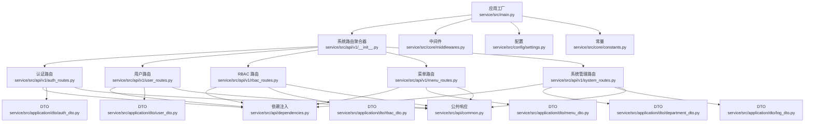
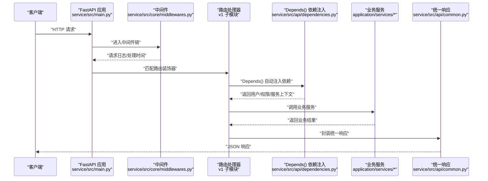
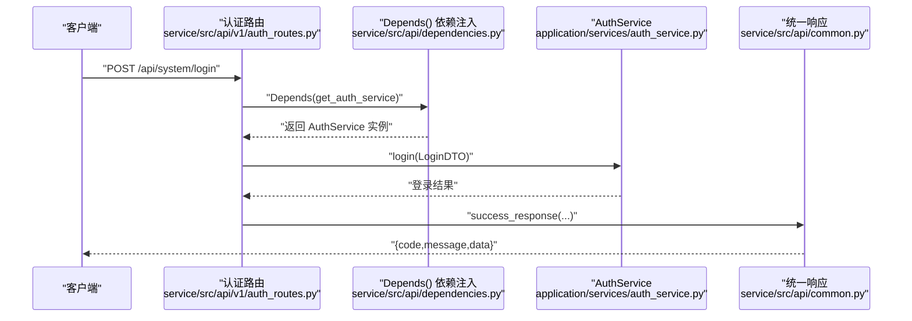
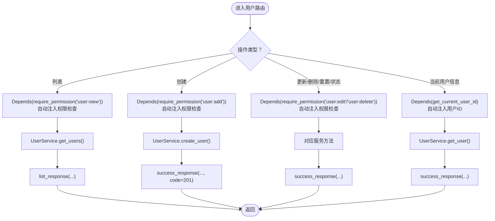
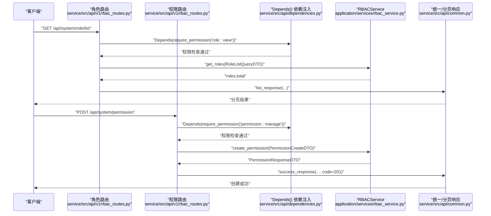
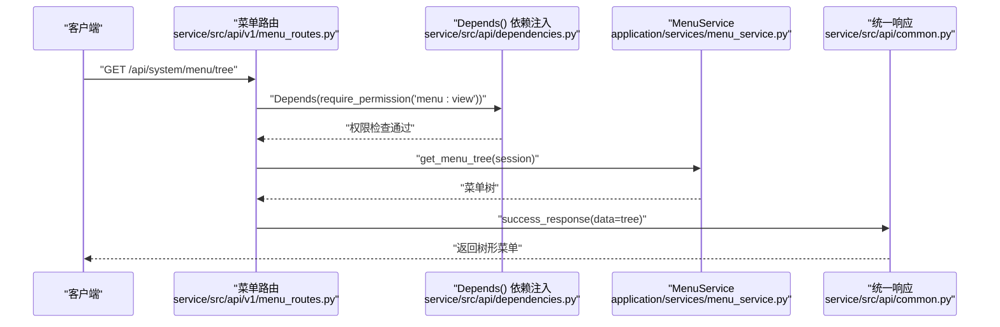
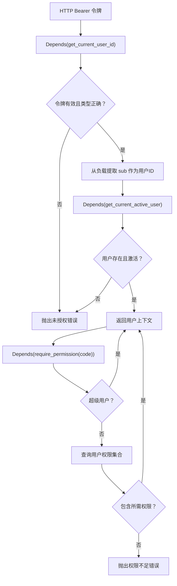
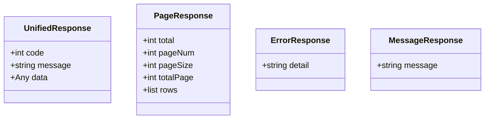
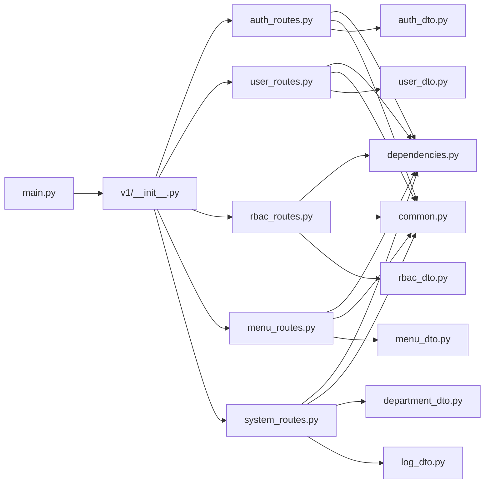

# 表现层（API Routes）

<cite>
**本文引用的文件**
- [service/src/api/v1/__init__.py](file://service/src/api/v1/__init__.py)
- [service/src/api/v1/auth_routes.py](file://service/src/api/v1/auth_routes.py)
- [service/src/api/v1/user_routes.py](file://service/src/api/v1/user_routes.py)
- [service/src/api/v1/rbac_routes.py](file://service/src/api/v1/rbac_routes.py)
- [service/src/api/v1/menu_routes.py](file://service/src/api/v1/menu_routes.py)
- [service/src/api/v1/system_routes.py](file://service/src/api/v1/system_routes.py)
- [service/src/api/dependencies.py](file://service/src/api/dependencies.py)
- [service/src/api/common.py](file://service/src/api/common.py)
- [service/src/main.py](file://service/src/main.py)
- [service/src/application/dto/auth_dto.py](file://service/src/application/dto/auth_dto.py)
- [service/src/application/dto/user_dto.py](file://service/src/application/dto/user_dto.py)
- [service/src/application/dto/rbac_dto.py](file://service/src/application/dto/rbac_dto.py)
- [service/src/application/dto/menu_dto.py](file://service/src/application/dto/menu_dto.py)
- [service/src/application/dto/department_dto.py](file://service/src/application/dto/department_dto.py)
- [service/src/application/dto/log_dto.py](file://service/src/application/dto/log_dto.py)
- [service/src/core/constants.py](file://service/src/core/constants.py)
- [service/src/config/settings.py](file://service/src/config/settings.py)
- [service/src/core/middlewares.py](file://service/src/core/middlewares.py)
</cite>

## 更新摘要
**变更内容**
- 路由依赖已完全重构为使用Depends()机制自动注入依赖
- 移除了手动依赖管理的复杂性，简化了路由层代码
- 所有服务和仓储通过依赖工厂函数自动注入
- 依赖注入链路更加清晰和可维护

## 目录
1. [引言](#引言)
2. [项目结构](#项目结构)
3. [核心组件](#核心组件)
4. [架构总览](#架构总览)
5. [详细组件分析](#详细组件分析)
6. [依赖分析](#依赖分析)
7. [性能考虑](#性能考虑)
8. [故障排查指南](#故障排查指南)
9. [结论](#结论)
10. [附录](#附录)

## 引言
本文件聚焦 Hello-FastApi 的表现层（API Routes），系统性阐述 FastAPI 路由组织、请求处理流程与响应格式标准化。v1 版本路由模块以"系统路由聚合器"为核心，按领域拆分为认证、用户、RBAC（角色-权限）、菜单和系统管理五大子路由，并通过统一的依赖注入体系实现权限校验与用户身份获取。**更新** 依赖注入已完全重构为使用Depends()机制自动注入，移除了手动管理依赖的复杂性。同时，文档覆盖中间件集成、全局异常处理、API 版本管理与最佳实践，帮助开发者快速理解并扩展路由层。

## 项目结构
- 路由聚合与版本前缀
  - v1 路由聚合器将认证、用户、角色、权限、菜单和系统管理路由统一挂载至系统前缀，形成清晰的 API 结构。
  - 系统前缀由常量定义，最终在应用工厂中作为路由前缀注册。
- 路由模块划分
  - 认证路由：登录、注册、登出、刷新令牌、个人资料、动态路由等。
  - 用户路由：列表、创建、详情、更新、删除、批量删除、重置密码、状态变更、密码修改、角色分配等。
  - RBAC 路由：角色列表、创建、详情、更新、删除、权限分配、菜单权限分配；权限列表、创建、删除。
  - 菜单路由：菜单列表、菜单树、用户可见菜单、创建、更新、删除。
  - 系统管理路由：部门管理、在线用户、各类日志管理等扩展功能。
- 依赖与公共组件
  - 依赖项：基于 HTTP Bearer Token 的用户身份解析、活跃用户校验、权限校验、超级用户校验。
  - 公共组件：统一响应体、分页响应体、错误响应体与辅助函数。

**图表来源**
- [service/src/main.py:34-96](file://service/src/main.py#L34-L96)
- [service/src/api/v1/__init__.py:13-46](file://service/src/api/v1/__init__.py#L13-L46)
- [service/src/api/v1/auth_routes.py:16-252](file://service/src/api/v1/auth_routes.py#L16-L252)
- [service/src/api/v1/user_routes.py:24-228](file://service/src/api/v1/user_routes.py#L24-L228)
- [service/src/api/v1/rbac_routes.py:30-227](file://service/src/api/v1/rbac_routes.py#L30-L227)
- [service/src/api/v1/menu_routes.py:15-72](file://service/src/api/v1/menu_routes.py#L15-L72)
- [service/src/api/v1/system_routes.py:17-335](file://service/src/api/v1/system_routes.py#L17-L335)
- [service/src/api/dependencies.py:16-191](file://service/src/api/dependencies.py#L16-L191)
- [service/src/api/common.py:29-197](file://service/src/api/common.py#L29-L197)
- [service/src/application/dto/auth_dto.py:7-54](file://service/src/application/dto/auth_dto.py#L7-L54)
- [service/src/application/dto/user_dto.py:8-86](file://service/src/application/dto/user_dto.py#L8-L86)
- [service/src/application/dto/rbac_dto.py:8-88](file://service/src/application/dto/rbac_dto.py#L8-L88)
- [service/src/application/dto/menu_dto.py:8-56](file://service/src/application/dto/menu_dto.py#L8-L56)
- [service/src/application/dto/department_dto.py](file://service/src/application/dto/department_dto.py)
- [service/src/application/dto/log_dto.py](file://service/src/application/dto/log_dto.py)
- [service/src/core/constants.py:4-6](file://service/src/core/constants.py#L4-L6)
- [service/src/config/settings.py:47-51](file://service/src/config/settings.py#L47-L51)

**章节来源**
- [service/src/api/v1/__init__.py:13-46](file://service/src/api/v1/__init__.py#L13-L46)
- [service/src/core/constants.py:4-6](file://service/src/core/constants.py#L4-L6)
- [service/src/config/settings.py:47-51](file://service/src/config/settings.py#L47-L51)

## 核心组件
- 系统路由聚合器
  - 将认证、用户、角色、权限、菜单和系统管理路由按前缀挂载，统一标签分类，便于文档生成与维护。
- **重构后的依赖注入体系**
  - 使用 FastAPI 的 Depends() 机制自动注入依赖，包括 HTTP Bearer 令牌解析与校验、当前活跃用户获取、权限校验（支持超级用户豁免）、超级用户校验。
  - 服务工厂函数通过依赖注入创建，路由层通过 Depends() 自动获取。
- 统一响应与分页
  - 统一响应体包含 code、message、data；分页响应体包含 total、pageNum、pageSize、totalPage、rows。
- DTO 层
  - 认证、用户、RBAC、菜单、部门、日志各领域 DTO 定义，确保请求/响应结构清晰且具备字段约束。

**章节来源**
- [service/src/api/v1/__init__.py:13-46](file://service/src/api/v1/__init__.py#L13-L46)
- [service/src/api/dependencies.py:16-191](file://service/src/api/dependencies.py#L16-L191)
- [service/src/api/common.py:29-197](file://service/src/api/common.py#L29-L197)
- [service/src/application/dto/auth_dto.py:7-54](file://service/src/application/dto/auth_dto.py#L7-L54)
- [service/src/application/dto/user_dto.py:8-86](file://service/src/application/dto/user_dto.py#L8-L86)
- [service/src/application/dto/rbac_dto.py:8-88](file://service/src/application/dto/rbac_dto.py#L8-L88)
- [service/src/application/dto/menu_dto.py:8-56](file://service/src/application/dto/menu_dto.py#L8-L56)

## 架构总览
- 应用启动与路由注册
  - 应用工厂创建 FastAPI 实例，配置文档路径、CORS、请求日志中间件、全局异常处理器，并在 lifespan 中初始化/关闭数据库。
  - 将系统路由聚合器以系统前缀注册到应用。
- **重构后的请求处理链路**
  - 中间件 → 路由装饰器 → Depends() 依赖注入（权限/用户/服务）→ 业务服务 → 统一响应封装。

**图表来源**
- [service/src/main.py:34-96](file://service/src/main.py#L34-L96)
- [service/src/core/middlewares.py:12-39](file://service/src/core/middlewares.py#L12-L39)
- [service/src/api/v1/auth_routes.py:19-252](file://service/src/api/v1/auth_routes.py#L19-L252)
- [service/src/api/dependencies.py:16-191](file://service/src/api/dependencies.py#L16-L191)
- [service/src/api/common.py:45-197](file://service/src/api/common.py#L45-L197)

## 详细组件分析

### 认证路由（auth_routes）
- 路由装饰器与请求处理
  - 登录：接收登录 DTO，通过 `Depends(get_auth_service)` 注入认证服务，调用认证服务登录，返回统一响应。
  - 注册：接收注册 DTO，通过 `Depends(get_auth_service)` 注入认证服务，调用认证服务注册，返回统一响应。
  - 刷新：接收刷新令牌 DTO，通过 `Depends(get_auth_service)` 注入认证服务，调用认证服务刷新，返回统一响应。
  - 登出：通过 `Depends(get_current_active_user)` 注入当前活跃用户，返回统一响应（JWT 无状态，服务端不存储）。
  - 个人资料：通过 `Depends(get_current_active_user)` 和 `Depends(get_user_repository)` 注入用户信息和仓储，返回用户基本信息。
- **重构后的依赖注入**
  - 所有依赖通过 Depends() 自动注入，无需手动管理依赖链。
  - 服务工厂函数 `get_auth_service()`、`get_user_repository()` 等通过依赖注入创建。
- 响应格式
  - 统一响应体，包含 code、message、data。

**图表来源**
- [service/src/api/v1/auth_routes.py:23-103](file://service/src/api/v1/auth_routes.py#L23-L103)
- [service/src/api/dependencies.py:114-122](file://service/src/api/dependencies.py#L114-L122)
- [service/src/api/common.py:48-50](file://service/src/api/common.py#L48-L50)

**章节来源**
- [service/src/api/v1/auth_routes.py:23-103](file://service/src/api/v1/auth_routes.py#L23-L103)
- [service/src/application/dto/auth_dto.py:7-54](file://service/src/application/dto/auth_dto.py#L7-L54)

### 用户路由（user_routes）
- 功能覆盖
  - 列表（分页+筛选）、创建、详情、更新、删除、批量删除、重置密码、状态变更、当前用户信息、密码修改、角色分配。
- **重构后的权限控制**
  - 使用 `Depends(require_permission("user:view"))` 等依赖工厂函数，通过 Depends() 自动注入权限检查。
  - 权限检查在路由装饰器参数中直接声明，无需手动调用。
- 请求参数处理
  - 查询参数使用 Pydantic DTO，如用户列表查询 DTO；路径参数使用 str 类型。
- 响应格式
  - 列表使用分页响应；其他操作使用统一响应。

**图表来源**
- [service/src/api/v1/user_routes.py:17-228](file://service/src/api/v1/user_routes.py#L17-L228)
- [service/src/api/dependencies.py:82-95](file://service/src/api/dependencies.py#L82-L95)
- [service/src/api/common.py:53-74](file://service/src/api/common.py#L53-L74)

**章节来源**
- [service/src/api/v1/user_routes.py:17-228](file://service/src/api/v1/user_routes.py#L17-L228)
- [service/src/application/dto/user_dto.py:8-86](file://service/src/application/dto/user_dto.py#L8-L86)

### RBAC 路由（rbac_routes）
- 角色管理
  - 列表（分页+筛选）、创建、详情、更新、删除、为角色分配权限、为角色分配菜单权限。
- 权限管理
  - 列表（分页+筛选）、创建、删除。
- **重构后的权限控制**
  - 角色相关操作依赖 `Depends(require_permission("role:manage"))` 等权限检查。
  - 权限相关操作依赖 `Depends(require_permission("permission:manage"))` 等权限检查。
  - 菜单权限分配通过 `Depends(get_db)` 和 `Depends(get_role_repository)` 自动注入数据库会话和仓储。
- 请求参数与响应
  - 使用角色/权限 DTO；列表使用分页响应。

**图表来源**
- [service/src/api/v1/rbac_routes.py:25-227](file://service/src/api/v1/rbac_routes.py#L25-L227)
- [service/src/api/dependencies.py:82-95](file://service/src/api/dependencies.py#L82-L95)
- [service/src/api/common.py:53-74](file://service/src/api/common.py#L53-L74)

**章节来源**
- [service/src/api/v1/rbac_routes.py:25-227](file://service/src/api/v1/rbac_routes.py#L25-L227)
- [service/src/application/dto/rbac_dto.py:8-88](file://service/src/application/dto/rbac_dto.py#L8-L88)

### 菜单路由（menu_routes）
- 功能覆盖
  - 获取菜单列表（扁平结构）、获取完整菜单树、获取当前用户可见菜单、创建、更新、删除菜单。
- **重构后的权限控制**
  - 菜单树与用户菜单需具备 `Depends(require_permission("menu:view"))` 权限。
  - 新增/编辑/删除需相应权限，通过 `Depends(require_permission("menu:add/edit/delete"))` 自动注入。
- 请求参数与响应
  - 使用菜单 DTO；返回统一响应。

**图表来源**
- [service/src/api/v1/menu_routes.py:36-72](file://service/src/api/v1/menu_routes.py#L36-L72)
- [service/src/api/dependencies.py:82-95](file://service/src/api/dependencies.py#L82-L95)
- [service/src/api/common.py:48-50](file://service/src/api/common.py#L48-L50)

**章节来源**
- [service/src/api/v1/menu_routes.py:36-72](file://service/src/api/v1/menu_routes.py#L36-L72)
- [service/src/application/dto/menu_dto.py:8-56](file://service/src/application/dto/menu_dto.py#L8-L56)

### 系统管理路由（system_routes）
- 功能覆盖
  - 部门管理：列表、创建、更新、删除。
  - 在线用户：在线用户列表（stub 实现）。
  - 日志管理：登录日志、操作日志、系统日志的列表、批量删除、清空等。
  - 地图数据和卡片列表：模拟数据接口。
- **重构后的依赖注入**
  - 部门管理通过 `Depends(get_current_active_user)` 和 `Depends(get_department_service)` 自动注入。
  - 日志管理通过 `Depends(get_current_active_user)` 和 `Depends(get_log_service)` 自动注入。
- 请求参数与响应
  - 使用部门和日志 DTO；列表使用分页响应。

**章节来源**
- [service/src/api/v1/system_routes.py:25-335](file://service/src/api/v1/system_routes.py#L25-L335)
- [service/src/application/dto/department_dto.py](file://service/src/application/dto/department_dto.py)
- [service/src/application/dto/log_dto.py](file://service/src/application/dto/log_dto.py)

### 依赖注入与权限校验（dependencies）
- **重构后的依赖注入机制**
  - 使用 FastAPI 的 Depends() 机制自动注入依赖，替代手动管理依赖的方式。
  - 令牌解析与用户身份：从 Authorization 头部提取 Bearer 令牌，解码并校验类型，提取用户 ID。
  - 从数据库获取当前活跃用户，校验账户状态。
- 权限校验
  - `require_permission(code)` 工厂：若非超级用户，查询用户权限集合，校验是否包含所需权限。
  - `require_superuser()`：仅超级用户可访问。
- **重构后的使用场景**
  - 认证路由的登出、RBAC/菜单/系统管理路由的各类操作均通过 Depends() 自动依赖注入。
  - 服务工厂函数通过 `Depends(get_auth_service)`、`Depends(get_user_service)` 等自动创建服务实例。

**图表来源**
- [service/src/api/dependencies.py:55-95](file://service/src/api/dependencies.py#L55-L95)

**章节来源**
- [service/src/api/dependencies.py:55-95](file://service/src/api/dependencies.py#L55-L95)

### 统一响应与分页（common）
- 统一响应体
  - 字段：code、message、data，默认 code=0、message="操作成功"。
- 分页响应体
  - 字段：total、pageNum、pageSize、totalPage、rows；totalPage 基于 total/pageSize 计算。
- 辅助函数
  - `success_response`、`list_response`、`page_response`、`error_response`，用于快速构造响应。

**图表来源**
- [service/src/api/common.py:30-197](file://service/src/api/common.py#L30-L197)

**章节来源**
- [service/src/api/common.py:30-197](file://service/src/api/common.py#L30-L197)

## 依赖分析
- **重构后的路由到依赖**
  - 所有 v1 路由模块均通过 Depends() 依赖注入统一的依赖注入模块，实现权限与用户身份的集中管理。
  - 服务工厂函数通过依赖注入自动创建，路由层无需手动管理服务实例。
- 路由到 DTO
  - 认证、用户、RBAC、菜单、部门、日志路由分别依赖对应 DTO，保证输入输出结构一致。
- 路由到公共组件
  - 统一响应与分页响应被广泛复用，降低重复逻辑。
- 应用到路由
  - 应用工厂在 lifespan 中初始化数据库，在 include_router 时挂载系统路由聚合器。

**图表来源**
- [service/src/api/v1/auth_routes.py:7-18](file://service/src/api/v1/auth_routes.py#L7-L18)
- [service/src/api/v1/user_routes.py:7-12](file://service/src/api/v1/user_routes.py#L7-L12)
- [service/src/api/v1/rbac_routes.py:8-16](file://service/src/api/v1/rbac_routes.py#L8-L16)
- [service/src/api/v1/menu_routes.py:7-14](file://service/src/api/v1/menu_routes.py#L7-L14)
- [service/src/api/v1/system_routes.py:8-15](file://service/src/api/v1/system_routes.py#L8-L15)
- [service/src/api/dependencies.py:16-191](file://service/src/api/dependencies.py#L16-L191)
- [service/src/api/common.py:29-197](file://service/src/api/common.py#L29-L197)
- [service/src/main.py:67](file://service/src/main.py#L67)
- [service/src/api/v1/__init__.py:14-45](file://service/src/api/v1/__init__.py#L14-L45)

**章节来源**
- [service/src/api/v1/__init__.py:14-45](file://service/src/api/v1/__init__.py#L14-L45)
- [service/src/main.py:67](file://service/src/main.py#L67)

## 性能考虑
- 中间件开销
  - 请求日志中间件对每个请求计算耗时并写入日志，建议在生产环境合理设置日志级别，避免高频写盘。
- **重构后的依赖链路**
  - 依赖注入通过 Depends() 机制自动管理，涉及令牌解码与数据库查询，建议在网关或上游做必要的限流与缓存。
  - 服务工厂函数通过依赖注入创建，避免了重复创建服务实例的开销。
- 分页策略
  - 列表接口统一使用分页 DTO，建议结合索引与 LIMIT/OFFSET 优化数据库查询。
- 响应体积
  - 统一响应体包含 code/message/data，建议在大列表场景仅返回必要字段，避免过度序列化。

## 故障排查指南
- 参数验证失败（422）
  - 全局异常处理器捕获 RequestValidationError，返回包含 errors 的统一错误响应。
- 未授权/权限不足
  - 依赖注入通过 Depends() 自动抛出未授权或权限不足异常，确认 Bearer 令牌有效性与权限分配。
- 服务器内部错误（500）
  - 未捕获异常统一转换为 500 错误响应，检查日志定位问题。
- 健康检查
  - GET /health 返回应用健康状态与版本号，用于探活与版本核对。

**章节来源**
- [service/src/main.py:46-59](file://service/src/main.py#L46-L59)
- [service/src/api/dependencies.py:55-95](file://service/src/api/dependencies.py#L55-L95)

## 结论
本表现层以 v1 路由聚合器为核心，结合**重构后的依赖注入体系**，实现了认证、用户、RBAC、菜单和系统管理五大领域的清晰分离与一致交互体验。**更新** 依赖注入已完全重构为使用Depends()机制自动注入，移除了手动管理依赖的复杂性，使代码更加简洁和可维护。通过权限校验与中间件集成，保障了安全性与可观测性。遵循本文的路由设计模式与最佳实践，可高效扩展新功能并保持代码一致性。

## 附录
- API 版本管理
  - 应用标题、版本与文档路径由配置与常量共同决定，系统前缀统一挂载路由，便于未来版本演进。
- 常用路径参考
  - 认证：登录/注册/刷新/登出/个人资料/动态路由
  - 用户：列表/创建/详情/更新/删除/批量删除/重置密码/状态变更/密码修改/角色分配
  - 角色：列表/创建/详情/更新/删除/为角色分配权限/为角色分配菜单权限
  - 权限：列表/创建/删除
  - 菜单：菜单列表/菜单树/用户可见菜单/创建/更新/删除
  - 系统管理：部门管理/在线用户/各类日志管理/地图数据/卡片列表

**章节来源**
- [service/src/config/settings.py:47-51](file://service/src/config/settings.py#L47-L51)
- [service/src/core/constants.py:4-6](file://service/src/core/constants.py#L4-L6)
- [service/src/api/v1/auth_routes.py:23-252](file://service/src/api/v1/auth_routes.py#L23-L252)
- [service/src/api/v1/user_routes.py:17-228](file://service/src/api/v1/user_routes.py#L17-L228)
- [service/src/api/v1/rbac_routes.py:25-227](file://service/src/api/v1/rbac_routes.py#L25-L227)
- [service/src/api/v1/menu_routes.py:19-72](file://service/src/api/v1/menu_routes.py#L19-L72)
- [service/src/api/v1/system_routes.py:25-335](file://service/src/api/v1/system_routes.py#L25-L335)