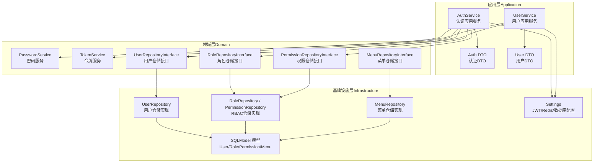
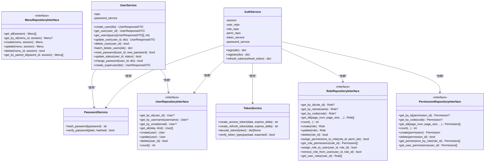
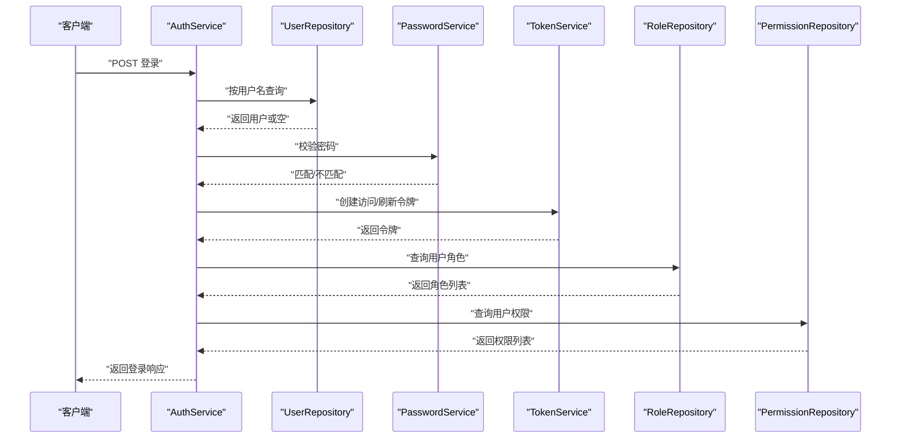
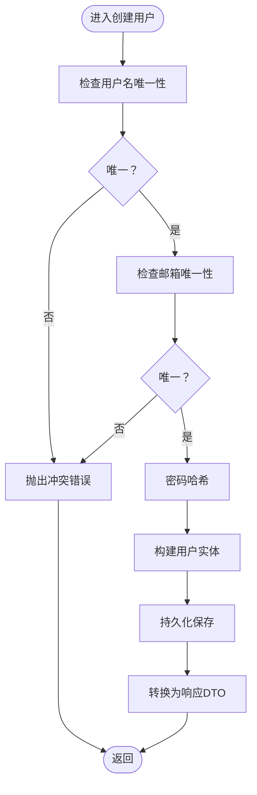
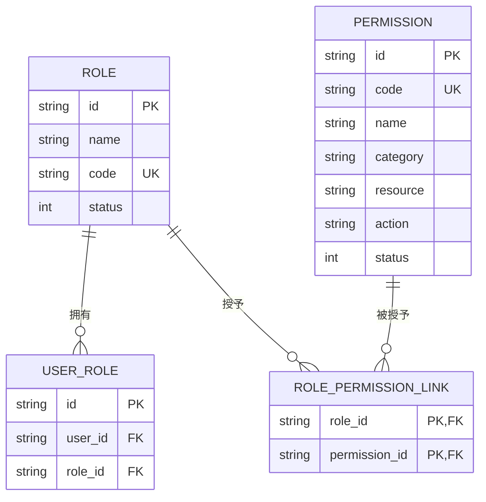
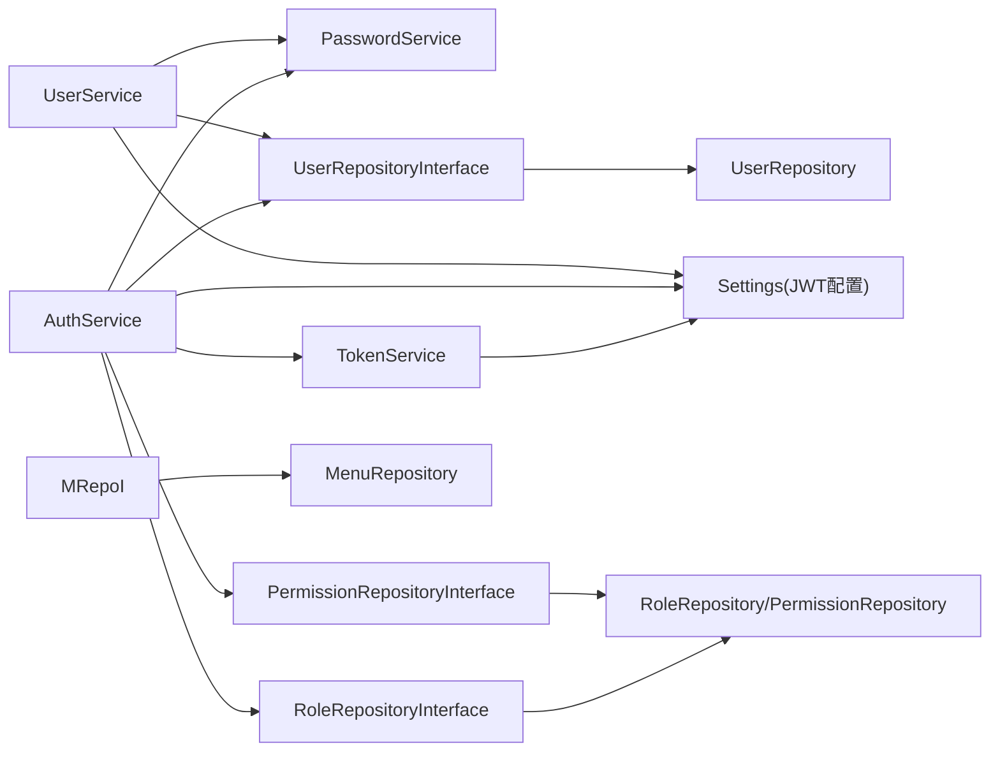

# 领域层（Business Logic）

<cite>
**本文引用的文件**
- [service/src/domain/auth/password_service.py](file://service/src/domain/auth/password_service.py)
- [service/src/domain/auth/token_service.py](file://service/src/domain/auth/token_service.py)
- [service/src/domain/user/repository.py](file://service/src/domain/user/repository.py)
- [service/src/domain/rbac/repository.py](file://service/src/domain/rbac/repository.py)
- [service/src/domain/menu/repository.py](file://service/src/domain/menu/repository.py)
- [service/src/application/services/auth_service.py](file://service/src/application/services/auth_service.py)
- [service/src/application/dto/auth_dto.py](file://service/src/application/dto/auth_dto.py)
- [service/src/application/services/user_service.py](file://service/src/application/services/user_service.py)
- [service/src/application/dto/user_dto.py](file://service/src/application/dto/user_dto.py)
- [service/src/infrastructure/repositories/user_repository.py](file://service/src/infrastructure/repositories/user_repository.py)
- [service/src/infrastructure/repositories/rbac_repository.py](file://service/src/infrastructure/repositories/rbac_repository.py)
- [service/src/infrastructure/repositories/menu_repository.py](file://service/src/infrastructure/repositories/menu_repository.py)
- [service/src/infrastructure/database/models.py](file://service/src/infrastructure/database/models.py)
- [service/src/config/settings.py](file://service/src/config/settings.py)
</cite>

## 目录
1. [引言](#引言)
2. [项目结构](#项目结构)
3. [核心组件](#核心组件)
4. [架构总览](#架构总览)
5. [详细组件分析](#详细组件分析)
6. [依赖分析](#依赖分析)
7. [性能考虑](#性能考虑)
8. [故障排查指南](#故障排查指南)
9. [结论](#结论)
10. [附录](#附录)

## 引言
本文件聚焦 Hello-FastApi 的领域层（Business Logic），系统化阐述业务规则核心的设计与实现，包括：
- 领域对象建模与不变量维护
- 认证领域的密码服务与令牌服务
- 仓储接口的设计原则与抽象定义
- 领域服务的实现、业务规则验证与数据一致性保障
- 领域驱动设计（DDD）实践：聚合根、值对象、领域事件等
- 通过接口隔离提升领域逻辑独立性与可测试性

## 项目结构
领域层位于 service/src/domain，采用“按特性分层 + 接口隔离”的组织方式：
- 认证领域：密码服务、令牌服务
- 用户领域：用户仓储接口
- RBAC 领域：角色与权限仓储接口
- 菜单领域：菜单仓储接口
应用层在 service/src/application 提供业务用例；基础设施层在 service/src/infrastructure 提供仓储的具体实现；数据库模型在 service/src/infrastructure/database/models.py。

图表来源
- [service/src/domain/auth/password_service.py:1-21](file://service/src/domain/auth/password_service.py#L1-L21)
- [service/src/domain/auth/token_service.py:1-45](file://service/src/domain/auth/token_service.py#L1-L45)
- [service/src/domain/user/repository.py:1-50](file://service/src/domain/user/repository.py#L1-L50)
- [service/src/domain/rbac/repository.py:1-77](file://service/src/domain/rbac/repository.py#L1-L77)
- [service/src/domain/menu/repository.py:1-43](file://service/src/domain/menu/repository.py#L1-L43)
- [service/src/application/services/auth_service.py:1-154](file://service/src/application/services/auth_service.py#L1-L154)
- [service/src/application/services/user_service.py:1-322](file://service/src/application/services/user_service.py#L1-L322)
- [service/src/infrastructure/repositories/user_repository.py:1-185](file://service/src/infrastructure/repositories/user_repository.py#L1-L185)
- [service/src/infrastructure/repositories/rbac_repository.py:1-213](file://service/src/infrastructure/repositories/rbac_repository.py#L1-L213)
- [service/src/infrastructure/repositories/menu_repository.py:1-50](file://service/src/infrastructure/repositories/menu_repository.py#L1-L50)
- [service/src/infrastructure/database/models.py:1-193](file://service/src/infrastructure/database/models.py#L1-L193)
- [service/src/config/settings.py:1-198](file://service/src/config/settings.py#L1-L198)

章节来源
- [service/src/domain/__init__.py:1-2](file://service/src/domain/__init__.py#L1-L2)

## 核心组件
- 密码服务 PasswordService：提供密码哈希与校验，封装加密细节，确保密码安全存储与验证。
- 令牌服务 TokenService：封装 JWT 的签发、刷新与解码，统一管理过期策略与算法。
- 用户仓储接口 UserRepositoryInterface：定义用户 CRUD、计数、分页与唯一性约束检查等业务能力。
- RBAC 仓储接口 RoleRepositoryInterface / PermissionRepositoryInterface：定义角色与权限的增删改查、分配与查询关系的能力。
- 菜单仓储接口 MenuRepositoryInterface：定义菜单树形结构与层级查询能力。
- 应用服务 AuthService / UserService：编排领域服务与仓储，执行业务规则与数据一致性保障。
- DTO：LoginDTO/RegisterDTO/LoginResponseDTO 等，承载输入输出的数据契约，配合 Pydantic 校验。

章节来源
- [service/src/domain/auth/password_service.py:1-21](file://service/src/domain/auth/password_service.py#L1-L21)
- [service/src/domain/auth/token_service.py:1-45](file://service/src/domain/auth/token_service.py#L1-L45)
- [service/src/domain/user/repository.py:1-50](file://service/src/domain/user/repository.py#L1-L50)
- [service/src/domain/rbac/repository.py:1-77](file://service/src/domain/rbac/repository.py#L1-L77)
- [service/src/domain/menu/repository.py:1-43](file://service/src/domain/menu/repository.py#L1-L43)
- [service/src/application/services/auth_service.py:1-154](file://service/src/application/services/auth_service.py#L1-L154)
- [service/src/application/services/user_service.py:1-322](file://service/src/application/services/user_service.py#L1-L322)
- [service/src/application/dto/auth_dto.py:1-54](file://service/src/application/dto/auth_dto.py#L1-L54)
- [service/src/application/dto/user_dto.py:1-86](file://service/src/application/dto/user_dto.py#L1-L86)

## 架构总览
领域层通过接口隔离与依赖倒置，将业务规则与基础设施解耦。应用服务持有仓储接口与领域服务，负责业务流程编排；基础设施层提供具体实现，面向 SQLModel ORM。

图表来源
- [service/src/domain/auth/password_service.py:1-21](file://service/src/domain/auth/password_service.py#L1-L21)
- [service/src/domain/auth/token_service.py:1-45](file://service/src/domain/auth/token_service.py#L1-L45)
- [service/src/domain/user/repository.py:1-50](file://service/src/domain/user/repository.py#L1-L50)
- [service/src/domain/rbac/repository.py:1-77](file://service/src/domain/rbac/repository.py#L1-L77)
- [service/src/domain/menu/repository.py:1-43](file://service/src/domain/menu/repository.py#L1-L43)
- [service/src/application/services/auth_service.py:1-154](file://service/src/application/services/auth_service.py#L1-L154)
- [service/src/application/services/user_service.py:1-322](file://service/src/application/services/user_service.py#L1-L322)

## 详细组件分析

### 认证领域：密码服务与令牌服务
- 密码服务 PasswordService
  - 哈希策略：使用 bcrypt 对明文密码进行哈希，确保不可逆与抗彩虹表。
  - 校验策略：比较明文与存储哈希值，返回布尔结果。
  - 不变性：哈希过程与盐生成由服务内部完成，调用方仅传入明文。
- 令牌服务 TokenService
  - 访问令牌：携带 exp 与 type=access，使用配置的密钥与算法签名。
  - 刷新令牌：携带 exp 与 type=refresh，独立有效期策略。
  - 解码与校验：统一捕获 JWTError 并返回 None，避免异常泄露。
  - 类型校验：通过 payload.type 校验令牌用途，防止误用。

图表来源
- [service/src/application/services/auth_service.py:26-74](file://service/src/application/services/auth_service.py#L26-L74)
- [service/src/domain/auth/password_service.py:10-20](file://service/src/domain/auth/password_service.py#L10-L20)
- [service/src/domain/auth/token_service.py:15-39](file://service/src/domain/auth/token_service.py#L15-L39)
- [service/src/infrastructure/repositories/rbac_repository.py:128-212](file://service/src/infrastructure/repositories/rbac_repository.py#L128-L212)

章节来源
- [service/src/domain/auth/password_service.py:1-21](file://service/src/domain/auth/password_service.py#L1-L21)
- [service/src/domain/auth/token_service.py:1-45](file://service/src/domain/auth/token_service.py#L1-L45)
- [service/src/application/services/auth_service.py:26-74](file://service/src/application/services/auth_service.py#L26-L74)

### 用户领域：仓储接口与应用服务
- 用户仓储接口 UserRepositoryInterface
  - 定义用户唯一性查询（用户名/邮箱）、分页查询、创建/更新/删除、计数等。
  - 通过抽象方法约束实现，确保业务规则在应用层统一执行。
- 用户应用服务 UserService
  - 创建用户：校验唯一性（用户名/邮箱），哈希密码，持久化并返回响应 DTO。
  - 更新用户：选择性更新，再次校验邮箱唯一性。
  - 修改密码：校验旧密码，哈希新密码后更新。
  - 重置密码：管理员重置，直接哈希并写入。
  - 批量删除：统计删除数量，返回结果。
  - 状态变更：启用/禁用用户。
  - 内部查询：按用户名获取用户实体，供其他服务复用。

图表来源
- [service/src/application/services/user_service.py:25-57](file://service/src/application/services/user_service.py#L25-L57)
- [service/src/application/dto/user_dto.py:8-19](file://service/src/application/dto/user_dto.py#L8-L19)
- [service/src/domain/auth/password_service.py:10-15](file://service/src/domain/auth/password_service.py#L10-L15)

章节来源
- [service/src/domain/user/repository.py:1-50](file://service/src/domain/user/repository.py#L1-L50)
- [service/src/application/services/user_service.py:25-57](file://service/src/application/services/user_service.py#L25-L57)
- [service/src/application/dto/user_dto.py:8-19](file://service/src/application/dto/user_dto.py#L8-L19)

### RBAC 领域：角色与权限仓储
- 角色仓储接口 RoleRepositoryInterface
  - 支持按名称/编码/ID 查询，分页与计数。
  - 提供角色-权限分配、角色-用户分配与查询。
- 权限仓储接口 PermissionRepositoryInterface
  - 支持按编码/ID 查询，分页与计数。
  - 提供角色权限与用户权限查询。
- 基础设施实现
  - RoleRepository：基于多对多关联表 RolePermissionLink 与 UserRole，实现分配/查询。
  - PermissionRepository：实现权限与角色/用户的关联查询。

图表来源
- [service/src/infrastructure/database/models.py:17-141](file://service/src/infrastructure/database/models.py#L17-L141)
- [service/src/domain/rbac/repository.py:8-77](file://service/src/domain/rbac/repository.py#L8-L77)
- [service/src/infrastructure/repositories/rbac_repository.py:11-213](file://service/src/infrastructure/repositories/rbac_repository.py#L11-L213)

章节来源
- [service/src/domain/rbac/repository.py:1-77](file://service/src/domain/rbac/repository.py#L1-L77)
- [service/src/infrastructure/repositories/rbac_repository.py:1-213](file://service/src/infrastructure/repositories/rbac_repository.py#L1-L213)
- [service/src/infrastructure/database/models.py:17-141](file://service/src/infrastructure/database/models.py#L17-L141)

### 菜单领域：仓储接口
- 菜单仓储接口 MenuRepositoryInterface
  - 支持获取全部、按 ID 查询、按父 ID 查询子菜单、创建/更新/删除。
- 基础设施实现 MenuRepository
  - 使用 SQLModel 查询，按排序号排序，支持父子关系查询。

章节来源
- [service/src/domain/menu/repository.py:1-43](file://service/src/domain/menu/repository.py#L1-L43)
- [service/src/infrastructure/repositories/menu_repository.py:1-50](file://service/src/infrastructure/repositories/menu_repository.py#L1-L50)
- [service/src/infrastructure/database/models.py:146-171](file://service/src/infrastructure/database/models.py#L146-L171)

### 领域建模最佳实践与 DDD 实践
- 聚合根与实体
  - User/Role/Permission/Menu 为聚合根，各自维护状态与行为（如 User 的 is_active）。
- 值对象
  - DTO（如 LoginDTO、UserCreateDTO）作为值对象，承载输入/输出数据契约，避免副作用。
- 领域服务
  - PasswordService/TokenService 封装跨聚合的业务能力，避免在应用服务中散落加密与令牌逻辑。
- 领域事件
  - 当前未见显式领域事件发布；可在用户状态变更、角色分配等关键动作处引入事件，以支持审计与异步处理。

章节来源
- [service/src/infrastructure/database/models.py:31-171](file://service/src/infrastructure/database/models.py#L31-L171)
- [service/src/application/dto/auth_dto.py:7-54](file://service/src/application/dto/auth_dto.py#L7-L54)
- [service/src/application/dto/user_dto.py:8-86](file://service/src/application/dto/user_dto.py#L8-L86)

## 依赖分析
- 应用服务依赖领域服务与仓储接口，不直接依赖具体实现，满足依赖倒置。
- 基础设施仓储实现依赖领域接口，向上提供一致的业务能力。
- 配置模块集中管理 JWT 密钥、算法与过期时间，被令牌服务使用。

图表来源
- [service/src/application/services/auth_service.py:18-24](file://service/src/application/services/auth_service.py#L18-L24)
- [service/src/application/services/user_service.py:21-23](file://service/src/application/services/user_service.py#L21-L23)
- [service/src/domain/auth/token_service.py:8-8](file://service/src/domain/auth/token_service.py#L8-L8)
- [service/src/config/settings.py:63-67](file://service/src/config/settings.py#L63-L67)

章节来源
- [service/src/application/services/auth_service.py:1-154](file://service/src/application/services/auth_service.py#L1-L154)
- [service/src/application/services/user_service.py:1-322](file://service/src/application/services/user_service.py#L1-L322)
- [service/src/config/settings.py:1-198](file://service/src/config/settings.py#L1-L198)

## 性能考虑
- 查询优化
  - 用户/角色/权限仓储均支持筛选与分页，建议在高频查询上增加索引（如用户名、邮箱、角色编码、权限编码）。
- 缓存策略
  - 可结合 Redis 缓存热点用户信息与权限集合，降低数据库压力。
- 事务边界
  - 应用服务中涉及多表写入（如创建用户并分配默认角色）应置于同一事务，确保一致性。
- 密码哈希成本
  - bcrypt 默认成本较高，注意在高并发场景下的延迟与资源占用，必要时调整成本参数。

## 故障排查指南
- 认证失败
  - 用户名或密码错误：检查密码哈希与校验流程，确认 DTO 字段与仓储查询。
  - 用户被禁用：确认 status 字段与业务规则。
- 令牌问题
  - 无效刷新令牌：检查解码与类型校验，确认用户状态。
  - JWT 算法或密钥不匹配：核对配置项与服务端签名算法。
- 用户唯一性冲突
  - 注册/更新时邮箱或用户名冲突：检查仓储唯一性查询与 DTO 校验。
- 权限/角色分配异常
  - 分配前清空旧关联再插入新关联，确保幂等性；检查外键与级联删除策略。

章节来源
- [service/src/application/services/auth_service.py:40-48](file://service/src/application/services/auth_service.py#L40-L48)
- [service/src/application/services/auth_service.py:130-143](file://service/src/application/services/auth_service.py#L130-L143)
- [service/src/application/services/user_service.py:38-41](file://service/src/application/services/user_service.py#L38-L41)
- [service/src/infrastructure/repositories/rbac_repository.py:84-96](file://service/src/infrastructure/repositories/rbac_repository.py#L84-L96)

## 结论
领域层通过清晰的接口划分与稳定的业务规则封装，实现了与基础设施的解耦与可测试性。认证领域的密码与令牌服务、用户与 RBAC 的仓储接口、以及应用服务的流程编排共同构成了稳定可靠的业务内核。建议在后续迭代中引入领域事件与缓存策略，进一步增强可观测性与性能表现。

## 附录
- 配置要点
  - JWT 密钥、算法与过期时间在配置模块集中管理，令牌服务直接使用。
- 数据模型要点
  - 用户/角色/权限/菜单模型定义了完整的多对多关系与外键约束，支撑 RBAC 与菜单树形结构。

章节来源
- [service/src/config/settings.py:63-67](file://service/src/config/settings.py#L63-L67)
- [service/src/infrastructure/database/models.py:17-171](file://service/src/infrastructure/database/models.py#L17-L171)