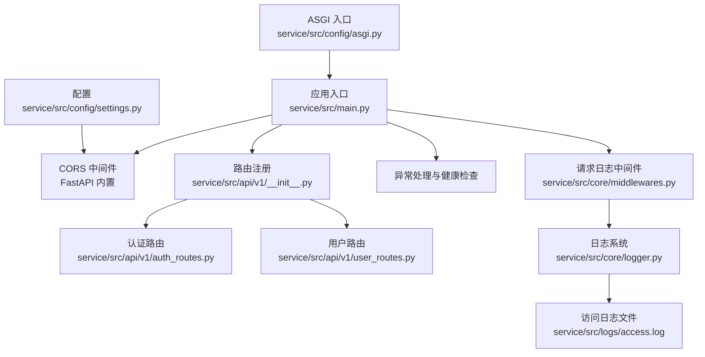
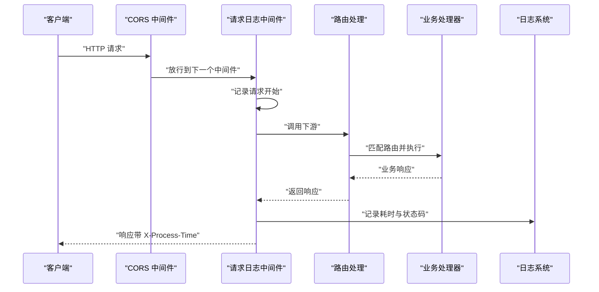
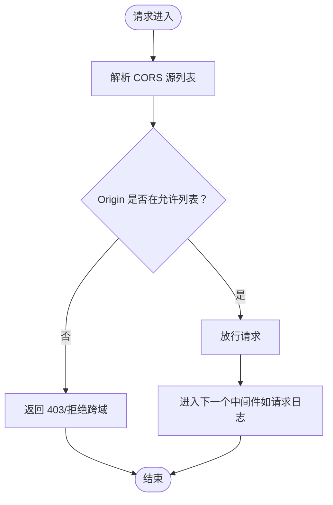
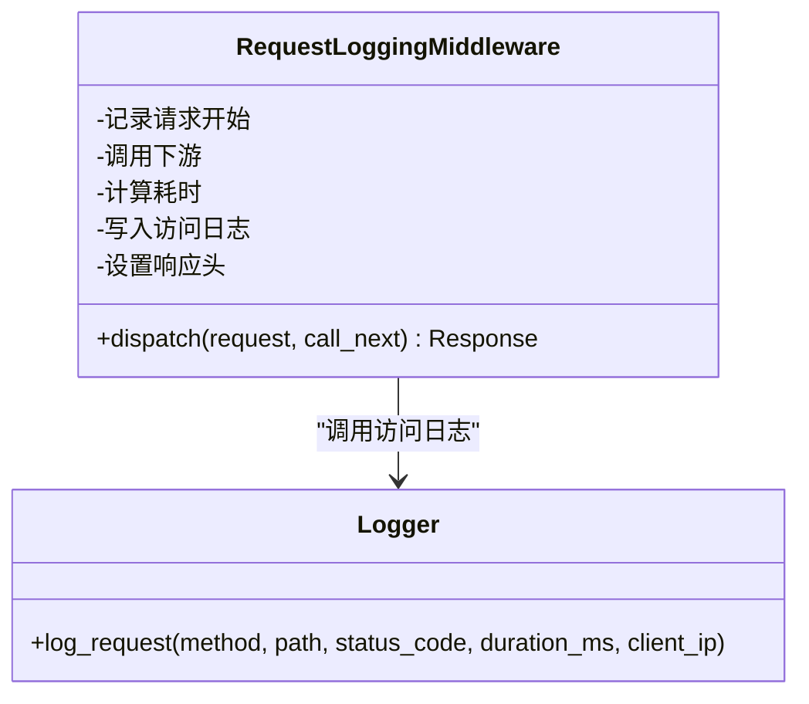
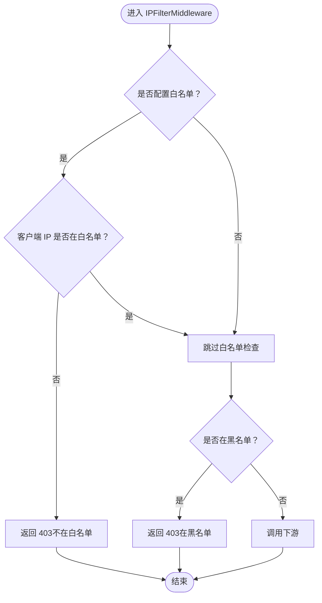
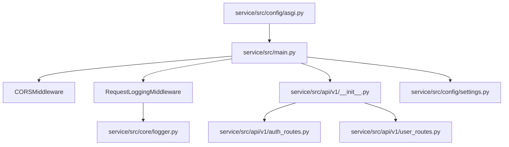

# 中间件系统

<cite>
**本文引用的文件**
- [service/src/main.py](file://service/src/main.py)
- [service/src/core/middlewares.py](file://service/src/core/middlewares.py)
- [service/src/core/logger.py](file://service/src/core/logger.py)
- [service/src/config/settings.py](file://service/src/config/settings.py)
- [service/src/config/asgi.py](file://service/src/config/asgi.py)
- [service/src/api/v1/__init__.py](file://service/src/api/v1/__init__.py)
- [service/src/api/v1/auth_routes.py](file://service/src/api/v1/auth_routes.py)
- [service/src/api/v1/user_routes.py](file://service/src/api/v1/user_routes.py)
</cite>

## 目录
1. [简介](#简介)
2. [项目结构](#项目结构)
3. [核心组件](#核心组件)
4. [架构总览](#架构总览)
5. [详细组件分析](#详细组件分析)
6. [依赖分析](#依赖分析)
7. [性能考虑](#性能考虑)
8. [故障排查指南](#故障排查指南)
9. [结论](#结论)
10. [附录](#附录)

## 简介
本文件系统性阐述 Hello-FastApi 的中间件体系，覆盖中间件注册、执行顺序与生命周期管理；重点解析 CORS 中间件的配置与跨域处理机制；详解请求日志中间件的实现原理与日志格式规范；提供自定义中间件的开发指南与最佳实践；给出性能优化策略与错误处理机制，并说明中间件与路由系统的集成方式与优先级管理。

## 项目结构
中间件相关代码主要分布在以下位置：
- 应用入口与中间件注册：service/src/main.py
- 核心中间件实现：service/src/core/middlewares.py
- 日志系统与访问日志格式：service/src/core/logger.py
- 配置与 CORS 源解析：service/src/config/settings.py
- ASGI 入口：service/src/config/asgi.py
- 路由聚合与前缀：service/src/api/v1/__init__.py 及各业务路由模块

图表来源
- [service/src/main.py:34-92](file://service/src/main.py#L34-L92)
- [service/src/core/middlewares.py:12-39](file://service/src/core/middlewares.py#L12-L39)
- [service/src/core/logger.py:61-85](file://service/src/core/logger.py#L61-L85)
- [service/src/config/settings.py:69-76](file://service/src/config/settings.py#L69-L76)
- [service/src/api/v1/__init__.py:14-38](file://service/src/api/v1/__init__.py#L14-L38)

章节来源
- [service/src/main.py:34-92](file://service/src/main.py#L34-L92)
- [service/src/core/middlewares.py:12-39](file://service/src/core/middlewares.py#L12-L39)
- [service/src/core/logger.py:61-85](file://service/src/core/logger.py#L61-L85)
- [service/src/config/settings.py:69-76](file://service/src/config/settings.py#L69-L76)
- [service/src/config/asgi.py:1-6](file://service/src/config/asgi.py#L1-L6)
- [service/src/api/v1/__init__.py:14-38](file://service/src/api/v1/__init__.py#L14-L38)

## 核心组件
- CORS 中间件：通过 FastAPI 内置的 CORSMiddleware 实现，配置项来自 settings.cors_origins_list。
- 请求日志中间件：自定义中间件，记录请求开始、结束与耗时，并在响应头注入 X-Process-Time。
- 异常处理：全局异常处理器对 AppException、参数校验错误与未捕获异常进行统一处理。
- 路由系统：系统路由通过 APIRouter 聚合，挂载于统一前缀下，便于中间件对所有路由生效。

章节来源
- [service/src/main.py:46-58](file://service/src/main.py#L46-L58)
- [service/src/core/middlewares.py:12-39](file://service/src/core/middlewares.py#L12-L39)
- [service/src/core/middlewares.py:42-64](file://service/src/core/middlewares.py#L42-L64)
- [service/src/main.py:60-82](file://service/src/main.py#L60-L82)
- [service/src/api/v1/__init__.py:14-38](file://service/src/api/v1/__init__.py#L14-L38)

## 架构总览
中间件在应用启动时注册，遵循“从上到下”的调用链：CORS → 请求日志 → 路由处理 → 异常处理。请求日志中间件在调用下游之前记录开始，在下游返回后计算耗时并写入访问日志。

图表来源
- [service/src/main.py:46-58](file://service/src/main.py#L46-L58)
- [service/src/core/middlewares.py:15-39](file://service/src/core/middlewares.py#L15-L39)
- [service/src/core/logger.py:75-85](file://service/src/core/logger.py#L75-L85)

## 详细组件分析

### CORS 中间件
- 注册位置：在应用工厂中通过 add_middleware 注册。
- 配置来源：settings.cors_origins_list 将逗号分隔的字符串解析为列表。
- 放行策略：允许凭证、所有方法与头部，源列表由配置决定。
- 与路由的关系：CORS 对所有路由生效，优先于业务逻辑执行。

图表来源
- [service/src/main.py:46-53](file://service/src/main.py#L46-L53)
- [service/src/config/settings.py:72-75](file://service/src/config/settings.py#L72-L75)

章节来源
- [service/src/main.py:46-53](file://service/src/main.py#L46-L53)
- [service/src/config/settings.py:69-76](file://service/src/config/settings.py#L69-L76)

### 请求日志中间件
- 功能要点：
  - 记录请求开始（方法、路径、客户端 IP）。
  - 计算处理时间（毫秒），写入响应头 X-Process-Time。
  - 使用专用访问日志通道，格式包含客户端 IP、方法、路径、状态码与耗时。
- 生命周期：
  - 进入 dispatch：记录开始与客户端 IP。
  - 调用下游：await call_next(request)。
  - 返回后：计算耗时、写入访问日志、设置响应头、返回响应。

图表来源
- [service/src/core/middlewares.py:12-39](file://service/src/core/middlewares.py#L12-L39)
- [service/src/core/logger.py:75-85](file://service/src/core/logger.py#L75-L85)

章节来源
- [service/src/core/middlewares.py:12-39](file://service/src/core/middlewares.py#L12-L39)
- [service/src/core/logger.py:75-85](file://service/src/core/logger.py#L75-L85)

### IP 白名单/黑名单中间件
- 功能要点：
  - 若配置了白名单，则仅允许白名单内的 IP 访问，否则 403。
  - 若命中黑名单，直接 403。
  - 未命中则放行至下游。
- 适用场景：安全加固、灰度控制或区域限制。

图表来源
- [service/src/core/middlewares.py:42-64](file://service/src/core/middlewares.py#L42-L64)

章节来源
- [service/src/core/middlewares.py:42-64](file://service/src/core/middlewares.py#L42-L64)

### 异常处理与健康检查
- 全局异常处理：
  - AppException：统一返回 code 与 message。
  - 参数校验错误：返回 422 与错误明细。
  - 未捕获异常：记录错误并返回 500。
- 健康检查：/health 返回服务状态与版本。

章节来源
- [service/src/main.py:60-82](file://service/src/main.py#L60-L82)
- [service/src/main.py:84-87](file://service/src/main.py#L84-L87)

### 路由系统与中间件优先级
- 路由聚合：system_router 聚合认证、用户、角色、权限、菜单等路由，统一挂载于系统前缀。
- 中间件优先级：CORS 在前，请求日志在后，异常处理贯穿始终。
- 作用范围：中间件对所有路由生效，包括系统路由与健康检查。

章节来源
- [service/src/api/v1/__init__.py:14-38](file://service/src/api/v1/__init__.py#L14-L38)
- [service/src/main.py:89-91](file://service/src/main.py#L89-L91)

## 依赖分析
- 中间件依赖关系：
  - 请求日志中间件依赖日志系统模块以输出访问日志。
  - CORS 中间件依赖配置模块提供的源列表。
  - 应用入口负责注册中间件与路由。
- 外部依赖：
  - FastAPI 内置中间件（CORSMiddleware）。
  - Starlette BaseHTTPMiddleware 基类。
  - loguru 日志库。

图表来源
- [service/src/main.py:46-58](file://service/src/main.py#L46-L58)
- [service/src/core/middlewares.py:9](file://service/src/core/middlewares.py#L9)
- [service/src/core/logger.py:13](file://service/src/core/logger.py#L13)
- [service/src/api/v1/__init__.py:14-38](file://service/src/api/v1/__init__.py#L14-L38)
- [service/src/config/settings.py:69-76](file://service/src/config/settings.py#L69-L76)
- [service/src/config/asgi.py:1-6](file://service/src/config/asgi.py#L1-L6)

章节来源
- [service/src/main.py:46-58](file://service/src/main.py#L46-L58)
- [service/src/core/middlewares.py:9](file://service/src/core/middlewares.py#L9)
- [service/src/core/logger.py:13](file://service/src/core/logger.py#L13)
- [service/src/api/v1/__init__.py:14-38](file://service/src/api/v1/__init__.py#L14-L38)
- [service/src/config/settings.py:69-76](file://service/src/config/settings.py#L69-L76)
- [service/src/config/asgi.py:1-6](file://service/src/config/asgi.py#L1-L6)

## 性能考虑
- 日志开销控制：
  - 使用异步队列（enqueue）避免阻塞 IO。
  - 访问日志独立文件与通道，降低与其他日志的耦合。
- 响应头注入：
  - X-Process-Time 仅在日志中间件中设置，避免重复计算。
- 中间件顺序优化：
  - 将轻量中间件置于前部，耗时中间件尽量靠后。
- CORS 优化：
  - 严格控制允许源列表，减少预检请求的复杂度。
- 缓存与配置：
  - 使用缓存的配置实例，减少重复解析。

章节来源
- [service/src/core/logger.py:20-30](file://service/src/core/logger.py#L20-L30)
- [service/src/core/logger.py:61-72](file://service/src/core/logger.py#L61-L72)
- [service/src/config/settings.py:186-193](file://service/src/config/settings.py#L186-L193)

## 故障排查指南
- CORS 相关问题：
  - 确认 CORS_ORIGINS 配置正确，逗号分隔且无多余空格。
  - 检查 settings.cors_origins_list 解析是否符合预期。
- 访问日志缺失：
  - 确认日志级别与文件轮转配置有效。
  - 检查访问日志通道过滤器是否正确绑定 type="access"。
- 性能异常：
  - 查看响应头 X-Process-Time 是否过大。
  - 结合业务处理器耗时定位瓶颈。
- 异常处理：
  - AppException 与 422 错误需检查异常处理器是否被触发。
  - 未捕获异常会在日志中记录堆栈信息。

章节来源
- [service/src/config/settings.py:72-75](file://service/src/config/settings.py#L72-L75)
- [service/src/core/logger.py:61-72](file://service/src/core/logger.py#L61-L72)
- [service/src/core/middlewares.py:15-39](file://service/src/core/middlewares.py#L15-L39)
- [service/src/main.py:60-82](file://service/src/main.py#L60-L82)

## 结论
Hello-FastApi 的中间件体系以简洁清晰的方式实现了跨域、请求日志与异常处理三大核心能力。通过明确的注册顺序与统一的日志格式，系统在可维护性与可观测性方面具备良好基础。建议在生产环境中进一步完善 IP 白名单/黑名单策略、细化异常分类与告警联动，并持续监控中间件对整体性能的影响。

## 附录

### 自定义中间件开发指南与最佳实践
- 继承基类：使用 BaseHTTPMiddleware，实现 dispatch(request, call_next)。
- 顺序与职责：每个中间件只做单一职责，避免在中间件中处理业务逻辑。
- 异常与返回：若提前返回（如鉴权失败），确保设置合适的状态码与内容类型。
- 性能：避免在中间件中进行阻塞操作，必要时使用异步与队列。
- 日志：使用专用通道与格式，便于检索与分析。

章节来源
- [service/src/core/middlewares.py:12-39](file://service/src/core/middlewares.py#L12-L39)
- [service/src/core/middlewares.py:42-64](file://service/src/core/middlewares.py#L42-L64)

### 中间件与路由系统的集成与优先级
- 注册顺序即执行顺序：CORS → 请求日志 → 路由 → 异常处理。
- 路由前缀：系统路由统一挂载于前缀下，中间件对所有路由生效。
- 健康检查：独立路由，同样受中间件影响。

章节来源
- [service/src/main.py:46-58](file://service/src/main.py#L46-L58)
- [service/src/api/v1/__init__.py:14-38](file://service/src/api/v1/__init__.py#L14-L38)
- [service/src/main.py:84-87](file://service/src/main.py#L84-L87)